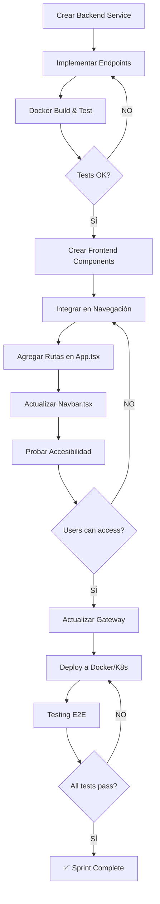

# 🤖 GitHub Copilot Instructions - OKLA (CarDealer Microservices)

Este documento proporciona contexto para GitHub Copilot sobre el proyecto OKLA (antes CarDealer).

**Última actualización:** Enero 8, 2026

---

## 📋 RESUMEN DEL PROYECTO

**OKLA** es una plataforma de marketplace para compra y venta de vehículos en República Dominicana. Implementa arquitectura de **microservicios** con Clean Architecture, desplegada en **Digital Ocean Kubernetes (DOKS)**.

### 👥 Tipos de Cuentas

| Tipo                    | AccountType | Paga         | Objetivo                     |
| ----------------------- | ----------- | ------------ | ---------------------------- |
| **Comprador**           | Individual  | No (gratis)  | Encontrar y comprar vehículo |
| **Vendedor Individual** | Individual  | $29/listing  | Vender su vehículo personal  |
| **Dealer** ⭐           | Dealer      | $49-$299/mes | Vender inventario completo   |
| **Admin**               | Admin       | No (staff)   | Moderar plataforma           |

> Ver estrategia completa: [docs/ESTRATEGIA_TIPOS_USUARIO_DEALERS.md](docs/ESTRATEGIA_TIPOS_USUARIO_DEALERS.md)

### 🌐 URLs de Producción

| Recurso          | URL                            |
| ---------------- | ------------------------------ |
| **Frontend**     | https://okla.com.do            |
| **API Gateway**  | https://api.okla.com.do        |
| **Health Check** | https://api.okla.com.do/health |

### Stack Tecnológico

| Capa                   | Tecnología                          | Versión     |
| ---------------------- | ----------------------------------- | ----------- |
| **Backend**            | .NET 8.0 LTS                        | net8.0      |
| **Frontend Web**       | React 19 + TypeScript + Vite        | ^19.0.0     |
| **Frontend Mobile**    | Flutter + Dart                      | SDK >=3.4.0 |
| **Base de Datos**      | PostgreSQL                          | 16+         |
| **Cache**              | Redis                               | 7+          |
| **Message Broker**     | RabbitMQ                            | 3.12+       |
| **API Gateway**        | Ocelot                              | 22.0.1      |
| **Container Registry** | GitHub Container Registry (ghcr.io) |
| **Kubernetes**         | Digital Ocean DOKS                  | 1.28+       |
| **CI/CD**              | GitHub Actions                      |

---

## 🚀 ESTADO DE PRODUCCIÓN (Enero 2026)

### ✅ Servicios Desplegados en DOKS

El proyecto está **EN PRODUCCIÓN** en Digital Ocean Kubernetes (cluster: `okla-cluster`, namespace: `okla`).

| Servicio                | Estado     | Puerto K8s | Descripción               |
| ----------------------- | ---------- | ---------- | ------------------------- |
| **frontend-web**        | ✅ Running | 8080       | React 19 SPA              |
| **gateway**             | ✅ Running | 8080       | Ocelot API Gateway        |
| **authservice**         | ✅ Running | 8080       | Autenticación JWT         |
| **userservice**         | ✅ Running | 8080       | Gestión de usuarios       |
| **roleservice**         | ✅ Running | 8080       | Roles y permisos          |
| **vehiclessaleservice** | ✅ Running | 8080       | CRUD vehículos + catálogo |
| **mediaservice**        | ✅ Running | 8080       | Gestión de imágenes (S3)  |
| **notificationservice** | ✅ Running | 8080       | Email/SMS/Push            |
| **billingservice**      | ✅ Running | 8080       | Pagos (Stripe + Azul)     |
| **errorservice**        | ✅ Running | 8080       | Centralización de errores |
| **postgres**            | ✅ Running | 5432       | Base de datos principal   |
| **redis**               | ✅ Running | 6379       | Cache distribuido         |
| **rabbitmq**            | ✅ Running | 5672/15672 | Message broker            |

**Load Balancer IP:** 146.190.199.0

### 💳 Pasarelas de Pago

OKLA utiliza **dos pasarelas de pago** para maximizar conversiones:

| Pasarela                 | Uso Principal                              | Comisión | Depósito |
| ------------------------ | ------------------------------------------ | -------- | -------- |
| **Azul (Banco Popular)** | Tarjetas dominicanas (DEFAULT)             | ~2.5%    | 24-48h   |
| **Stripe**               | Tarjetas internacionales, Apple/Google Pay | ~3.5%    | 7 días   |

> Ver implementación: [docs/MEJORAS_RECOMENDACIONES_MARKETPLACE.md](docs/MEJORAS_RECOMENDACIONES_MARKETPLACE.md#-pasarelas-de-pago-stripe--azul)

### 🔴 Servicios NO Desplegados (Solo en desarrollo local)

Estos servicios existen en el código pero NO están en producción:

- VehiclesRentService
- PropertiesSaleService
- PropertiesRentService
- AdminService
- CRMService
- ReportsService
- SchedulerService
- AuditService
- Y otros servicios de infraestructura

### 🆕 Microservicios Planificados (Enero 2026)

#### Servicios para Dealers (Prioridad Alta)

| Servicio                   | Puerto | Descripción                                 |
| -------------------------- | ------ | ------------------------------------------- |
| DealerManagementService    | 5039   | Gestión de perfiles y sucursales de dealers |
| InventoryManagementService | 5040   | Import/export masivo, edición en batch      |
| DealerAnalyticsService     | 5041   | Dashboard y métricas para dealers           |
| PricingIntelligenceService | 5042   | IA para pricing óptimo                      |
| TradeInService             | 5043   | Gestión de trade-ins                        |
| WarrantyService            | 5044   | Garantías extendidas                        |

#### Servicios de Data & ML (Críticos)

| Servicio                    | Puerto | Descripción                                           |
| --------------------------- | ------ | ----------------------------------------------------- |
| EventTrackingService        | 5050   | Captura TODOS los eventos de usuario                  |
| DataPipelineService         | 5051   | ETL, transformaciones, agregaciones                   |
| UserBehaviorService         | 5052   | Perfiles de comportamiento, segmentos                 |
| FeatureStoreService         | 5053   | Features centralizados para ML                        |
| RecommendationService       | 5054   | "Vehículos para ti", similar vehicles                 |
| LeadScoringService          | 5055   | Hot/Warm/Cold leads con IA                            |
| VehicleIntelligenceService  | 5056   | Pricing IA, predicción de demanda                     |
| MLTrainingService           | 5057   | Pipeline de entrenamiento de modelos                  |
| **ListingAnalyticsService** | 5058   | **Estadísticas de publicaciones (vistas, contactos)** |
| **ReviewService**           | 5059   | **Reviews estilo Amazon para dealers/vendedores**     |
| **ChatbotService**          | 5060   | **Chatbot IA + Calificación de leads + WhatsApp**     |

#### Servicios de UX & Operaciones (Nuevos)

| Servicio                     | Puerto | Descripción                                 |
| ---------------------------- | ------ | ------------------------------------------- |
| **MaintenanceService**       | 5061   | **Modo mantenimiento programable**          |
| **FraudDetectionService**    | 5062   | **Detección de fraude en listings**         |
| **SupportService**           | 5063   | **Soporte al cliente + Help Center**        |
| **TestDriveService**         | 5064   | **Agendamiento de test drives**             |
| **FinancingService**         | 5065   | **Integración con bancos RD**               |
| **ComparisonService**        | 5066   | **Comparador de vehículos (hasta 3)**       |
| **AlertService**             | 5067   | **Alertas de precio y búsquedas guardadas** |
| **PlatformAnalyticsService** | 5068   | **Dashboard ejecutivo para dueños**         |

> Ver documentación completa:
>
> - [docs/ESTRATEGIA_TIPOS_USUARIO_DEALERS.md](docs/ESTRATEGIA_TIPOS_USUARIO_DEALERS.md)
> - [docs/DATA_ML_MICROSERVICES_STRATEGY.md](docs/DATA_ML_MICROSERVICES_STRATEGY.md)
> - [docs/SERVICIOS_PRIORIZACION.md](docs/SERVICIOS_PRIORIZACION.md)
> - [docs/CHATBOT_SERVICE_STRATEGY.md](docs/CHATBOT_SERVICE_STRATEGY.md)
> - [docs/SPRINT_PLAN_MARKETPLACE.md](docs/SPRINT_PLAN_MARKETPLACE.md)
> - [docs/MEJORAS_RECOMENDACIONES_MARKETPLACE.md](docs/MEJORAS_RECOMENDACIONES_MARKETPLACE.md)

---

## 🏗️ ESTRUCTURA DEL PROYECTO

```
cardealer-microservices/
├── .github/
│   ├── copilot-instructions.md     # Este archivo
│   ├── copilot-samples/            # Templates para Copilot
│   └── workflows/                  # GitHub Actions CI/CD
│       ├── deploy-digitalocean.yml # Deploy a DOKS
│       ├── smart-cicd.yml          # Build y push imágenes
│       └── pr-checks.yml           # Validación de PRs
├── backend/                        # Microservicios .NET 8
│   ├── _Shared/                    # Librerías compartidas
│   │   ├── CarDealer.Contracts/    # DTOs y Events
│   │   └── CarDealer.Shared/       # Utilidades
│   ├── Gateway/                    # Ocelot API Gateway
│   │   └── Gateway.Api/
│   │       ├── ocelot.dev.json     # Config desarrollo
│   │       └── ocelot.prod.json    # Config producción (puerto 8080)
│   ├── AuthService/                # Autenticación
│   ├── UserService/                # Usuarios
│   ├── VehiclesSaleService/        # Vehículos (principal)
│   ├── MediaService/               # Archivos/Imágenes
│   ├── NotificationService/        # Notificaciones
│   ├── BillingService/             # Pagos Stripe + Azul (Banco Popular)
│   ├── ErrorService/               # Errores centralizados
│   └── ... (35 servicios total)
├── frontend/
│   ├── web/                        # React 19 + Vite
│   │   ├── src/
│   │   ├── Dockerfile
│   │   └── nginx.conf
│   └── mobile/cardealer/           # Flutter app
├── k8s/                            # Kubernetes manifests
│   ├── namespace.yaml
│   ├── deployments.yaml            # Todos los deployments
│   ├── services.yaml               # ClusterIP services
│   ├── ingress.yaml                # Ingress rules + TLS
│   ├── configmaps.yaml             # Configuraciones
│   ├── secrets.yaml                # Secrets (encriptados)
│   └── databases.yaml              # PostgreSQL StatefulSet
├── docs/
│   ├── tutorials/                  # 15 tutoriales de deployment
│   └── analysis/                   # Documentación técnica
├── compose.yaml                    # Docker Compose (desarrollo local)
└── cardealer.sln                   # Solución .NET
```

---

## 🔧 ARQUITECTURA DE MICROSERVICIOS

### Clean Architecture por Servicio

Cada microservicio sigue esta estructura:

```
{ServiceName}/
├── {ServiceName}.Api/              # Capa de presentación
│   ├── Controllers/                # REST Controllers
│   ├── Program.cs                  # Entry point
│   ├── appsettings.json
│   └── Dockerfile                  # Para producción
├── {ServiceName}.Application/      # Capa de aplicación
│   ├── Features/                   # CQRS con MediatR
│   │   ├── Commands/
│   │   └── Queries/
│   ├── DTOs/
│   └── Validators/                 # FluentValidation
├── {ServiceName}.Domain/           # Capa de dominio
│   ├── Entities/
│   ├── Interfaces/
│   └── Events/
└── {ServiceName}.Infrastructure/   # Capa de infraestructura
    ├── Persistence/                # DbContext, Repositories
    └── Services/
```

### Patrones Utilizados

- **CQRS** con MediatR para Commands/Queries
- **Repository Pattern** para acceso a datos
- **Result Pattern** para manejo de errores
- **Domain Events** publicados via RabbitMQ
- **JWT Bearer** para autenticación

---

## ☸️ KUBERNETES (DOKS)

### Comandos Frecuentes

```bash
# Conectar a cluster
doctl kubernetes cluster kubeconfig save okla-cluster

# Ver pods
kubectl get pods -n okla

# Ver logs de un servicio
kubectl logs -f deployment/gateway -n okla

# Reiniciar un deployment
kubectl rollout restart deployment/vehiclessaleservice -n okla

# Ver ConfigMap del Gateway
kubectl get configmap gateway-config -n okla -o yaml

# Actualizar ConfigMap del Gateway (IMPORTANTE)
kubectl delete configmap gateway-config -n okla
kubectl create configmap gateway-config --from-file=ocelot.json=backend/Gateway/Gateway.Api/ocelot.prod.json -n okla
kubectl rollout restart deployment/gateway -n okla

# Port-forward para debugging
kubectl port-forward svc/vehiclessaleservice 8080:8080 -n okla
```

### ⚠️ REGLA CRÍTICA: Puertos en Kubernetes

**TODOS los servicios usan puerto 8080 en Kubernetes (NO 80).**

El archivo `ocelot.prod.json` DEBE tener:

```json
{
  "DownstreamHostAndPorts": [{ "Host": "servicename", "Port": 8080 }]
}
```

### Ingress y DNS

| Host            | Service           | TLS              |
| --------------- | ----------------- | ---------------- |
| okla.com.do     | frontend-web:8080 | ✅ Let's Encrypt |
| api.okla.com.do | gateway:8080      | ✅ Let's Encrypt |

---

## 🔄 CI/CD (GitHub Actions)

### Workflows Principales

| Workflow    | Archivo                   | Trigger             | Función               |
| ----------- | ------------------------- | ------------------- | --------------------- |
| Smart CI/CD | `smart-cicd.yml`          | Push a main/develop | Build + Push imágenes |
| Deploy DO   | `deploy-digitalocean.yml` | Manual o post-CI    | Deploy a DOKS         |
| PR Checks   | `pr-checks.yml`           | PR abierto          | Validación            |

### Servicios en CI/CD

```yaml
SERVICES: "frontend-web,gateway,authservice,userservice,vehiclessaleservice,mediaservice,notificationservice,billingservice,errorservice,roleservice"
```

### Secrets de GitHub Requeridos

| Secret                      | Descripción                     |
| --------------------------- | ------------------------------- |
| `DIGITALOCEAN_ACCESS_TOKEN` | Token API de DO                 |
| `GHCR_TOKEN`                | Token para ghcr.io              |
| `KUBE_CONFIG`               | Kubeconfig del cluster (base64) |

---

## 🌿 ESTRATEGIA DE BRANCHING (GitFlow Adaptado)

### Branches Principales

```
┌─────────────────────────────────────────────────────────────────────────────┐
│                     FLUJO DE BRANCHES OKLA                                  │
├─────────────────────────────────────────────────────────────────────────────┤
│                                                                             │
│  🏭 main (producción)                                                       │
│  ════════════════════                                                       │
│  │   Solo código probado y listo para producción                           │
│  │   Cada push a main dispara deploy automático a DOKS                     │
│  │   Tags de versión: v1.0.0, v1.1.0, etc.                                 │
│  │                                                                         │
│  │◄──── merge ──── 🧪 development                                          │
│                     ════════════════                                        │
│                     │   Integración y pruebas                              │
│                     │   Aquí se prueban todos los features juntos          │
│                     │   CI/CD ejecuta tests completos                      │
│                     │                                                      │
│                     │◄──── merge ──── 📦 sprint/X-nombre                   │
│                                        ═══════════════════                 │
│                                        │   Un branch por sprint            │
│                                        │   Trabajo del equipo              │
│                                        │                                   │
│                                        │◄──── merge ──── feature/xxx       │
│                                        │◄──── merge ──── fix/xxx           │
│                                                                             │
└─────────────────────────────────────────────────────────────────────────────┘
```

### Tipos de Branches

| Branch        | Propósito              | Crea desde    | Merge hacia            | Ejemplo                |
| ------------- | ---------------------- | ------------- | ---------------------- | ---------------------- |
| `main`        | Producción             | -             | -                      | `main`                 |
| `development` | Integración/QA         | `main`        | `main`                 | `development`          |
| `sprint/*`    | Trabajo de sprint      | `development` | `development`          | `sprint/4-pagos`       |
| `feature/*`   | Nuevas funcionalidades | `sprint/*`    | `sprint/*`             | `feature/azul-gateway` |
| `fix/*`       | Corrección de bugs     | `sprint/*`    | `sprint/*`             | `fix/login-error`      |
| `hotfix/*`    | Fixes urgentes prod    | `main`        | `main` + `development` | `hotfix/critical-bug`  |

### Flujo de Trabajo Completo

```bash
# ══════════════════════════════════════════════════════════════════════════════
# INICIO DE SPRINT (Ej: Sprint 4 - Pagos)
# ══════════════════════════════════════════════════════════════════════════════

# 1. Crear branch del sprint desde development
git checkout development
git pull origin development
git checkout -b sprint/4-pagos

# ══════════════════════════════════════════════════════════════════════════════
# TRABAJO DIARIO - Feature o Fix
# ══════════════════════════════════════════════════════════════════════════════

# 2. Crear branch de feature desde el sprint
git checkout sprint/4-pagos
git checkout -b feature/azul-gateway

# 3. Trabajar y commitear
git add .
git commit -m "feat(billing): integración inicial Azul API"
git push origin feature/azul-gateway

# 4. Crear PR: feature/azul-gateway → sprint/4-pagos
#    - PR Checks se ejecutan automáticamente
#    - Code review
#    - Merge cuando aprobado

# ══════════════════════════════════════════════════════════════════════════════
# FIN DE SPRINT - Integración
# ══════════════════════════════════════════════════════════════════════════════

# 5. Merge sprint a development
git checkout development
git merge sprint/4-pagos
git push origin development

# 6. Pruebas en development
#    - CI/CD ejecuta tests completos
#    - Pruebas manuales en localhost
#    - Validar que todo funciona antes de merge a main

# ══════════════════════════════════════════════════════════════════════════════
# RELEASE A PRODUCCIÓN
# ══════════════════════════════════════════════════════════════════════════════

# 7. Cuando development está estable, merge a main
git checkout main
git merge development
git tag -a v1.4.0 -m "Release Sprint 4: Pagos Azul + Stripe"
git push origin main --tags

# 8. Deploy automático a producción (DOKS)
#    - workflow smart-cicd.yml detecta push a main
#    - build + push imágenes a ghcr.io
#    - deploy-digitalocean.yml actualiza pods
```

### Convención de Nombres

```bash
# Sprints
sprint/1-busqueda-fundamentos
sprint/2-publicacion-formularios
sprint/3-ui-ux-compradores
sprint/4-pagos
sprint/5-dashboard-vendedor

# Features (dentro de un sprint)
feature/stripe-checkout
feature/azul-gateway
feature/payment-selector
feature/webhook-handlers

# Fixes
fix/login-token-expiry
fix/image-upload-timeout
fix/price-validation

# Hotfixes (urgentes, directo a main)
hotfix/security-patch
hotfix/payment-crash
```

### Ambientes por Branch

> ⚠️ **NOTA:** Actualmente solo existe un cluster (producción). El staging se implementará cuando haya más recursos.

| Branch        | Ambiente           | Deploy                | Descripción                         |
| ------------- | ------------------ | --------------------- | ----------------------------------- |
| `main`        | **Producción**     | ✅ Auto-deploy a DOKS | okla.com.do                         |
| `development` | **Pre-producción** | ❌ Solo CI/Tests      | Validación antes de merge a main    |
| `sprint/*`    | Local              | ❌ No                 | Desarrollo local con docker-compose |
| `feature/*`   | Local              | localhost             | ❌ No                               |

### Comandos Útiles

```bash
# Ver todos los branches
git branch -a

# Ver branches remotos
git branch -r

# Actualizar desde development antes de crear feature
git checkout development && git pull && git checkout -b feature/nueva

# Sincronizar sprint con development (rebase)
git checkout sprint/4-pagos
git rebase development

# Limpiar branches locales ya mergeados
git branch --merged | grep -v "main\|development" | xargs git branch -d

# Ver historial visual
git log --oneline --graph --all

# Crear tag de release
git tag -a v1.4.0 -m "Sprint 4: Pagos"
git push origin v1.4.0
```

### Protección de Branches (GitHub)

Configurar en GitHub → Settings → Branches → Branch protection rules:

**Para `main`:**

- ✅ Require pull request before merging
- ✅ Require approvals (1)
- ✅ Require status checks to pass
- ✅ Require branches to be up to date
- ✅ Do not allow bypassing

**Para `development`:**

- ✅ Require pull request before merging
- ✅ Require status checks to pass
- ❌ Require approvals (opcional para velocidad)

---

## 🎯 REGLAS PARA DESARROLLO

### 1. Puertos en Kubernetes

```csharp
// ❌ NUNCA en producción/Kubernetes
"Port": 80

// ✅ SIEMPRE en producción/Kubernetes
"Port": 8080
```

### 2. Rutas de Gateway

Todas las rutas van a través del Gateway Ocelot:

```
Cliente → https://api.okla.com.do/api/{service}/{endpoint}
        → Gateway (Ocelot)
        → {service}:8080/api/{endpoint}
```

### 3. Imágenes Docker

```bash
# Registry: GitHub Container Registry
ghcr.io/gregorymorenoiem/cardealer-{service}:latest

# Ejemplos:
ghcr.io/gregorymorenoiem/cardealer-web:latest
ghcr.io/gregorymorenoiem/cardealer-gateway:latest
ghcr.io/gregorymorenoiem/cardealer-vehiclessaleservice:latest
```

### 4. Variables de Entorno (Frontend)

En desarrollo:

```env
VITE_API_URL=http://localhost:18443
```

En producción (K8s):

```yaml
env:
  - name: RUNTIME_API_URL
    value: "https://api.okla.com.do"
```

---

## 📡 API Endpoints Principales

### Health Check

- `GET /health` - Estado del Gateway

### Auth (`/api/auth`)

- `POST /api/auth/register` - Registro
- `POST /api/auth/login` - Login (retorna JWT)
- `POST /api/auth/refresh` - Refresh token
- `GET /api/auth/me` - Usuario actual

### Vehicles (`/api/vehicles`)

- `GET /api/vehicles` - Listar (paginado)
- `GET /api/vehicles/{id}` - Detalle
- `POST /api/vehicles` - Crear (auth required)
- `PUT /api/vehicles/{id}` - Actualizar
- `DELETE /api/vehicles/{id}` - Eliminar

### Homepage Sections (`/api/homepagesections`)

- `GET /api/homepagesections/homepage` - Secciones del homepage con vehículos

### Catalog (`/api/catalog`)

- `GET /api/catalog/makes` - Marcas de vehículos
- `GET /api/catalog/models/{makeId}` - Modelos por marca
- `GET /api/catalog/years` - Años disponibles

### Users (`/api/users`)

- `GET /api/users/{id}` - Obtener usuario
- `PUT /api/users/{id}` - Actualizar perfil

### Media (`/api/media`)

- `POST /api/media/upload` - Subir archivo a S3
- `GET /api/media/{id}` - Obtener archivo

---

## 🏠 SISTEMA DE HOMEPAGE SECTIONS

El homepage del frontend muestra secciones dinámicas de vehículos configuradas desde la base de datos.

### Arquitectura del Sistema

```
┌─────────────────────────────────────────────────────────────────────────┐
│                              FRONTEND                                    │
│  VehiclesOnlyHomePage.tsx                                               │
│  ├── useHomepageSections() hook → GET /api/homepagesections/homepage    │
│  ├── HeroCarousel (Carousel Principal)                                  │
│  ├── FeaturedListingGrid (Destacados con maxItems={9})                  │
│  └── FeaturedSection (Sedanes, SUVs, Camionetas, etc.)                  │
└─────────────────────────────────────────────────────────────────────────┘
                                    │
                                    ▼
┌─────────────────────────────────────────────────────────────────────────┐
│                         API GATEWAY (Ocelot)                            │
│  /api/homepagesections/* → vehiclessaleservice:8080                     │
└─────────────────────────────────────────────────────────────────────────┘
                                    │
                                    ▼
┌─────────────────────────────────────────────────────────────────────────┐
│                      VEHICLESSALESERVICE                                │
│  HomepageSectionsController.cs                                          │
│  ├── GET /homepage → Retorna todas las secciones activas               │
│  ├── Usa MaxItems para limitar vehículos por sección                   │
│  └── Solo incluye vehículos con Status = 'Active'                      │
└─────────────────────────────────────────────────────────────────────────┘
                                    │
                                    ▼
┌─────────────────────────────────────────────────────────────────────────┐
│                         POSTGRESQL                                       │
│  Base de datos: vehiclessaleservice                                     │
│  ├── homepage_section_configs (configuración de secciones)             │
│  ├── vehicle_homepage_sections (relación vehículo-sección)             │
│  └── vehicles (datos de vehículos)                                     │
└─────────────────────────────────────────────────────────────────────────┘
```

### Tablas en Base de Datos

#### `homepage_section_configs`

Configuración de cada sección del homepage.

| Columna        | Tipo    | Descripción                              |
| -------------- | ------- | ---------------------------------------- |
| `Id`           | UUID    | ID único de la sección                   |
| `Name`         | VARCHAR | Nombre visible ("Sedanes", "SUVs", etc.) |
| `Slug`         | VARCHAR | Identificador URL-friendly               |
| `DisplayOrder` | INT     | Orden de aparición (1, 2, 3...)          |
| `MaxItems`     | INT     | **Límite de vehículos a mostrar**        |
| `IsActive`     | BOOL    | Si la sección está activa                |
| `Subtitle`     | VARCHAR | Descripción corta                        |
| `AccentColor`  | VARCHAR | Color del tema (blue, amber, etc.)       |
| `ViewAllHref`  | VARCHAR | Link "Ver todo"                          |

#### `vehicle_homepage_sections`

Relación muchos-a-muchos entre vehículos y secciones.

| Columna                   | Tipo      | Descripción                   |
| ------------------------- | --------- | ----------------------------- |
| `VehicleId`               | UUID      | FK a vehicles                 |
| `HomepageSectionConfigId` | UUID      | FK a homepage_section_configs |
| `SortOrder`               | INT       | Orden dentro de la sección    |
| `IsPinned`                | BOOL      | Si está fijado al inicio      |
| `StartDate`               | TIMESTAMP | Fecha inicio (opcional)       |
| `EndDate`                 | TIMESTAMP | Fecha fin (opcional)          |

### Configuración Actual de Secciones

| #   | Sección              | MaxItems | Vehículos Asignados |
| --- | -------------------- | -------- | ------------------- |
| 1   | Carousel Principal   | 5        | 10                  |
| 2   | Sedanes              | 10       | 10                  |
| 3   | SUVs                 | 10       | 10                  |
| 4   | Camionetas           | 10       | 10                  |
| 5   | Deportivos           | 10       | 10                  |
| 6   | Destacados           | 9        | 10                  |
| 7   | Lujo                 | 10       | 10                  |
| 8   | Vehículos Eléctricos | 10       | 15                  |
| 9   | Eficiencia Total     | 10       | 10                  |
| 10  | Muscle & Performance | 10       | 10                  |

### Backend: HomepageSectionsController.cs

```csharp
// Ubicación: backend/VehiclesSaleService/VehiclesSaleService.Api/Controllers/
// El límite de vehículos se aplica con .Take(s.MaxItems)

[HttpGet("homepage")]
public async Task<ActionResult<List<HomepageSectionDto>>> GetHomepage()
{
    var sections = await _context.HomepageSectionConfigs
        .Where(s => s.IsActive)
        .OrderBy(s => s.DisplayOrder)
        .Select(s => new HomepageSectionDto
        {
            Name = s.Name,
            Vehicles = s.VehicleSections
                .Where(vs => vs.Vehicle.Status == "Active")
                .OrderBy(vs => vs.SortOrder)
                .Take(s.MaxItems)  // ← LÍMITE AQUÍ
                .Select(vs => new VehicleDto { ... })
                .ToList()
        })
        .ToListAsync();
    return Ok(sections);
}
```

### Frontend: VehiclesOnlyHomePage.tsx

```typescript
// Ubicación: frontend/web/src/pages/VehiclesOnlyHomePage.tsx

// 1. Hook para obtener secciones del API
const { sections, isLoading, error } = useHomepageSections();

// 2. Extraer secciones por nombre
const carousel = sections?.find(s => s.name === 'Carousel Principal');
const sedanes = sections?.find(s => s.name === 'Sedanes');
const destacados = sections?.find(s => s.name === 'Destacados');
// ... etc

// 3. Renderizar componentes
<HeroCarousel vehicles={carousel?.vehicles} />
<FeaturedListingGrid vehicles={destacados?.vehicles} maxItems={9} />
<FeaturedSection
  title={sedanes?.name}
  listings={transformSectionVehicles(sedanes)}
/>
```

### Componentes del Frontend

| Componente             | Ubicación                        | Función                       |
| ---------------------- | -------------------------------- | ----------------------------- |
| `useHomepageSections`  | `hooks/useHomepageSections.ts`   | Hook para fetch del API       |
| `VehiclesOnlyHomePage` | `pages/VehiclesOnlyHomePage.tsx` | Página principal              |
| `HeroCarousel`         | `components/organisms/`          | Carrusel hero con auto-play   |
| `FeaturedListingGrid`  | `components/molecules/`          | Grid de vehículos destacados  |
| `FeaturedSection`      | Inline en VehiclesOnlyHomePage   | Sección horizontal scrollable |

### Comandos para Modificar Secciones

```bash
# Ver configuración actual
kubectl exec -it postgres-0 -n okla -- psql -U postgres -d vehiclessaleservice -c \
  'SELECT "Name", "MaxItems", "DisplayOrder" FROM homepage_section_configs ORDER BY "DisplayOrder";'

# Cambiar MaxItems de una sección
kubectl exec -it postgres-0 -n okla -- psql -U postgres -d vehiclessaleservice -c \
  "UPDATE homepage_section_configs SET \"MaxItems\" = 9 WHERE \"Name\" = 'Destacados';"

# Ver vehículos por sección
kubectl exec -it postgres-0 -n okla -- psql -U postgres -d vehiclessaleservice -c \
  'SELECT hsc."Name", COUNT(vhs."VehicleId") as total
   FROM homepage_section_configs hsc
   LEFT JOIN vehicle_homepage_sections vhs ON hsc."Id" = vhs."HomepageSectionConfigId"
   GROUP BY hsc."Name" ORDER BY hsc."DisplayOrder";'

# Verificar respuesta del API
curl -s "https://api.okla.com.do/api/homepagesections/homepage" | \
  python3 -c "import json,sys; [print(f\"{s['name']}: {len(s['vehicles'])}\") for s in json.load(sys.stdin)]"
```

### Flujo de Datos Completo

1. **Usuario accede a okla.com.do**
2. **Frontend carga VehiclesOnlyHomePage**
3. **useHomepageSections() hace fetch a /api/homepagesections/homepage**
4. **Gateway (Ocelot) rutea a vehiclessaleservice:8080**
5. **HomepageSectionsController consulta PostgreSQL:**
   - Obtiene secciones activas ordenadas por DisplayOrder
   - Para cada sección, obtiene vehículos con Status='Active'
   - Aplica límite con `.Take(MaxItems)`
6. **API retorna JSON con secciones y vehículos**
7. **Frontend renderiza:**
   - HeroCarousel con Carousel Principal
   - FeaturedListingGrid con Destacados
   - FeaturedSection para cada categoría

---

## 🐛 TROUBLESHOOTING COMÚN

### 404 en Gateway

1. Verificar que la ruta existe en `ocelot.prod.json`
2. Verificar que el ConfigMap está actualizado:
   ```bash
   kubectl get configmap gateway-config -n okla -o yaml | grep -A5 "rutaproblema"
   ```
3. Reiniciar Gateway después de actualizar ConfigMap:
   ```bash
   kubectl rollout restart deployment/gateway -n okla
   ```

### 503 Service Unavailable / Timeout

1. **Verificar puerto** - Debe ser 8080, no 80
2. Verificar que el servicio destino está Running:
   ```bash
   kubectl get pods -n okla | grep servicename
   ```
3. Verificar conectividad interna:
   ```bash
   kubectl exec -it deployment/gateway -n okla -- wget -qO- http://vehiclessaleservice:8080/health
   ```

### Pod en CrashLoopBackOff

```bash
# Ver logs del pod (incluyendo restart anterior)
kubectl logs -f pod/{pod-name} -n okla --previous

# Ver eventos del pod
kubectl describe pod {pod-name} -n okla
```

### CORS Error

1. Verificar configuración CORS en Gateway y servicios
2. Verificar que el dominio está en la lista permitida
3. Pre-flight OPTIONS debe retornar 204

---

## 📚 DOCUMENTACIÓN ADICIONAL

### Tutoriales (docs/tutorials/)

15 tutoriales de deployment organizados por nivel:

| Nivel            | Tutoriales | Contenido                                      |
| ---------------- | ---------- | ---------------------------------------------- |
| 1 - Principiante | 01-04      | kubectl, pods, configmaps, logs                |
| 2 - Intermedio   | 05-08      | DNS/SSL, LoadBalancer, Registry, PostgreSQL    |
| 3 - Avanzado     | 09-11      | Ocelot Gateway, troubleshooting, zero-downtime |
| 4 - Experto      | 12-14      | GitHub Actions, CI/CD completo, monitoreo      |
| 5 - Masterclass  | 15         | Deploy completo de 0 a producción              |

---

## ⚡ COMANDOS RÁPIDOS DE REFERENCIA

```bash
# === KUBERNETES ===
kubectl get pods -n okla                              # Ver pods
kubectl logs -f deployment/gateway -n okla           # Logs en tiempo real
kubectl rollout restart deployment -n okla           # Reiniciar todo
kubectl describe pod {pod} -n okla                   # Debug de pod

# === GATEWAY CONFIG ===
# Actualizar configuración del Gateway:
kubectl delete configmap gateway-config -n okla
kubectl create configmap gateway-config \
  --from-file=ocelot.json=backend/Gateway/Gateway.Api/ocelot.prod.json \
  -n okla
kubectl rollout restart deployment/gateway -n okla

# === VERIFICAR API ===
curl https://api.okla.com.do/health
curl https://api.okla.com.do/api/vehicles

# === DOCKER (desarrollo local) ===
docker-compose up -d                                  # Levantar todo
docker-compose logs -f gateway                        # Ver logs
docker-compose down                                   # Bajar todo

# === CI/CD ===
gh run list --limit 5                                 # Ver últimos workflows
gh run view {run-id}                                  # Ver detalles
gh run watch {run-id}                                 # Watch en tiempo real
```

---

## 📝 CONVENCIONES DE CÓDIGO

### C# / .NET

```csharp
// Namespaces file-scoped
namespace AuthService.Domain.Entities;

// Records para DTOs inmutables
public record UserDto(Guid Id, string Email, string FullName);

// Primary constructors para DI
public class UserService(IUserRepository repo, ILogger<UserService> logger)
{
    public async Task<User?> GetAsync(Guid id) => await repo.GetByIdAsync(id);
}

// Async siempre con CancellationToken
public async Task<Result<T>> HandleAsync(Command cmd, CancellationToken ct);
```

### TypeScript / React

```typescript
// Functional components
export const UserCard = ({ user }: { user: User }) => {
  return <div>{user.fullName}</div>;
};

// Custom hooks con prefijo use
export const useAuth = () => {
  /* ... */
};

// TanStack Query para data fetching
const { data, isLoading } = useQuery({
  queryKey: ["vehicles"],
  queryFn: () => vehicleService.getAll(),
});
```

### Commits

```
<type>(<scope>): <description>

Tipos: feat, fix, docs, style, refactor, test, chore
Ejemplos:
  feat(vehicles): add search by price range
  fix(gateway): use correct port 8080 for production
  docs(readme): update deployment instructions
```

---

## 🔐 SEGURIDAD

- JWT tokens con expiración de 24h
- Refresh tokens para renovación automática
- HTTPS obligatorio en producción (Let's Encrypt)
- Secrets en Kubernetes Secrets (no en código)
- CORS configurado para dominios específicos (okla.com.do)
- Rate limiting en Gateway

---

## ✅ WORKFLOW DE DESARROLLO - REGLAS OBLIGATORIAS

### 🎯 Completar un Sprint CORRECTAMENTE

Cada sprint debe seguir este checklist COMPLETO antes de marcarse como terminado:

#### 1️⃣ Backend Development

- [ ] Crear microservicio(s) con Clean Architecture
- [ ] Implementar todos los endpoints requeridos
- [ ] Agregar validaciones con FluentValidation
- [ ] Crear Entity Configurations (EF Core)
- [ ] Agregar Health Checks
- [ ] Documentar API con Swagger/XML comments

#### 2️⃣ Frontend Development (SI APLICA)

- [ ] Crear componentes React/TypeScript
- [ ] **INTEGRAR en la navegación (Navbar/Rutas)** ⚠️ CRÍTICO
- [ ] Agregar en App.tsx con ProtectedRoute si requiere auth
- [ ] Actualizar Navbar.tsx con links visibles
- [ ] Envolver en MainLayout para banners site-wide
- [ ] Verificar accesibilidad en Desktop, Tablet y Mobile
- [ ] Asegurar que usuarios puedan ACCEDER a las funcionalidades

#### 3️⃣ Integración de Rutas

```tsx
// ✅ SIEMPRE hacer esto cuando crees UI:

// 1. Importar en App.tsx
import { MiNuevoComponente } from "./pages/MiNuevoComponente";

// 2. Agregar ruta
<Route
  path="/mi-ruta"
  element={
    <ProtectedRoute>
      {" "}
      {/* Si requiere auth */}
      <MiNuevoComponente />
    </ProtectedRoute>
  }
/>;

// 3. Agregar link en Navbar.tsx
const userNavLinks = [{ href: "/mi-ruta", label: "Mi Función", icon: FiIcon }];

// 4. Envolver componente en MainLayout
export const MiNuevoComponente = () => {
  return (
    <MainLayout>
      <div>...</div>
    </MainLayout>
  );
};
```

#### 4️⃣ Docker & Testing

- [ ] **Compilar imagen Docker del servicio**
  ```bash
  docker build -t cardealer-miservicio:latest ./backend/MiServicio/MiServicio.Api
  ```
- [ ] **Probar localmente con docker-compose**
  ```bash
  docker-compose up miservicio postgres rabbitmq redis
  ```
- [ ] **Verificar Health Check**
  ```bash
  curl http://localhost:PORT/health
  ```
- [ ] **Probar todos los endpoints principales**
  ```bash
  # GET, POST, PUT, DELETE
  curl -X POST http://localhost:PORT/api/endpoint \
    -H "Content-Type: application/json" \
    -d '{"field": "value"}'
  ```
- [ ] **Verificar logs sin errores**
  ```bash
  docker-compose logs -f miservicio
  ```

#### 5️⃣ Gateway Configuration

- [ ] Agregar rutas en `ocelot.prod.json`
- [ ] Usar puerto **8080** (NO 80) en DownstreamHostAndPorts
- [ ] Actualizar ConfigMap en Kubernetes si está desplegado
- [ ] Probar enrutamiento: `curl https://api.okla.com.do/api/miservicio/endpoint`

#### 6️⃣ Kubernetes Deployment (si aplica)

- [ ] Crear/actualizar Deployment en k8s/deployments.yaml
- [ ] Crear/actualizar Service en k8s/services.yaml
- [ ] Agregar variables de entorno en ConfigMap/Secrets
- [ ] Agregar servicio a smart-cicd.yml workflow
- [ ] Deploy y verificar pods: `kubectl get pods -n okla`

#### 7️⃣ Documentación

- [ ] Actualizar README del servicio con endpoints
- [ ] Documentar DTOs y modelos de datos
- [ ] Agregar ejemplos de uso en docs/
- [ ] **Actualizar SPRINT_PLAN con checkmarks ✅**

#### 8️⃣ Verificación Final

```bash
# Checklist de testing completo:

# Backend funcionando
✅ Health check responde 200 OK
✅ GET endpoints devuelven datos correctos
✅ POST/PUT crean/actualizan correctamente
✅ DELETE elimina correctamente
✅ Validaciones funcionan (400 Bad Request)
✅ Auth funciona (401 Unauthorized si no token)

# Frontend funcionando
✅ Página se renderiza sin errores de consola
✅ API calls funcionan (Network tab muestra 200)
✅ Usuarios pueden navegar a la página
✅ Botones/formularios funcionan
✅ Responsive en mobile/tablet/desktop

# Integración
✅ Gateway rutea correctamente
✅ CORS permite requests desde frontend
✅ WebSocket funciona (si aplica)
✅ RabbitMQ procesa eventos (si aplica)
```

---

## 🚫 ERRORES COMUNES A EVITAR

### ❌ NO HACER:

1. **Crear UI sin agregar a navegación** → Usuarios no pueden acceder
2. **Omitir docker build/test** → Errores en producción
3. **Puerto 80 en K8s** → Debe ser 8080
4. **Olvidar ProtectedRoute** → Páginas privadas accesibles sin auth
5. **No probar endpoints** → Bugs en producción
6. **Saltarse Health Check** → K8s no puede monitorear el servicio
7. **No actualizar Gateway** → 404 en API calls
8. **Commits sin testing** → Breaking changes

### ✅ HACER SIEMPRE:

1. **UI nueva = Ruta + Navbar link** → Accesibilidad garantizada
2. **Backend nuevo = Docker build + test** → Calidad asegurada
3. **Cambio en servicio = Actualizar Gateway** → Routing correcto
4. **Feature completo = Testing end-to-end** → UX funcional
5. **Sprint terminado = Checklist 100%** → Deploy confiable

---

## 🔄 FLUJO COMPLETO: Backend → Frontend → Testing



---

## 📋 TEMPLATE: Checklist por Sprint

Copiar esto al inicio de cada sprint:

```markdown
## Sprint X - [Nombre] - Checklist

### Backend

- [ ] Microservicio creado con Clean Architecture
- [ ] Todos los endpoints implementados
- [ ] FluentValidation agregado
- [ ] Health Check funcional
- [ ] Docker build exitoso
- [ ] Tests locales pasados

### Frontend (si aplica)

- [ ] Componentes creados
- [ ] Rutas agregadas en App.tsx
- [ ] Links en Navbar (desktop + mobile)
- [ ] MainLayout wrapper aplicado
- [ ] Accesibilidad verificada
- [ ] Responsive design OK

### Integración

- [ ] Gateway routes configuradas
- [ ] Puerto 8080 verificado
- [ ] CORS funcionando
- [ ] API calls desde frontend OK
- [ ] Auth/ProtectedRoute funciona

### Testing

- [ ] Todos los endpoints probados
- [ ] UI navegable por usuarios
- [ ] Docker compose up sin errores
- [ ] Logs limpios sin warnings
- [ ] Health checks responden

### Deployment

- [ ] K8s manifests actualizados
- [ ] CI/CD workflow funcional
- [ ] Deploy exitoso a DOKS
- [ ] Verificación en producción

### Documentación

- [ ] README actualizado
- [ ] API endpoints documentados
- [ ] Sprint plan marcado ✅
```

---

## 🎓 LECCIONES APRENDIDAS

### Sprint 1 - Marketplace Foundations

**Fecha:** Enero 8, 2026

**Problema identificado:**

- Componentes UI creados (SearchPage, FavoritesPage, ComparisonPage, AlertsPage) pero NO integrados en navegación
- Usuarios no podían acceder a las nuevas funcionalidades
- Faltaba agregar rutas en App.tsx
- Faltaban links en Navbar.tsx
- Componentes no envueltos en MainLayout

**Solución aplicada:**

1. Agregar importaciones en App.tsx
2. Crear rutas con ProtectedRoute donde correspondía
3. Actualizar Navbar con `navLinks` y `userNavLinks`
4. Envolver todos los componentes en MainLayout
5. Probar accesibilidad en desktop/mobile

**Regla nueva:**

> **SIEMPRE que crees UI, INMEDIATAMENTE integrarlo en navegación antes de marcar como completo.**

**Documentación:** [SPRINT_1_NAVIGATION_INTEGRATION.md](../docs/SPRINT_1_NAVIGATION_INTEGRATION.md)

---

_Documento mantenido por el equipo de desarrollo - Enero 2026_
