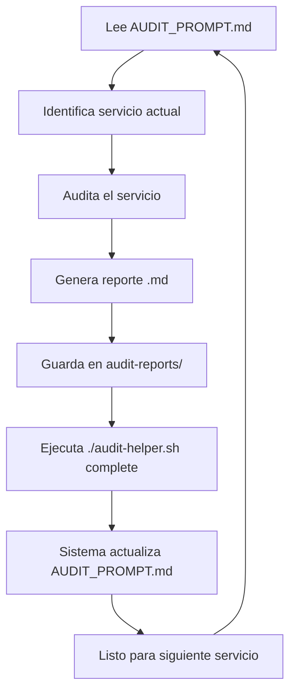

# 🔍 Sistema de Auditoría Incremental - OKLA CarDealer

Este sistema permite que GitHub Copilot realice auditorías completas del código de manera incremental y sistemática.

## 📁 Estructura del Sistema

```
cardealer-microservices/
├── AUDIT_PROMPT.md          # 🎯 Prompt dinámico para GitHub Copilot
├── audit-helper.sh          # 🛠️ Script de automatización
├── audit-reports/           # 📊 Reportes generados
│   ├── TEMPLATE_EXAMPLE.md  # 📋 Template de referencia
│   └── AUDIT_REPORT_*.md    # 📄 Reportes individuales
└── AUDIT_README.md          # 📚 Este archivo
```

## 🚀 Cómo Usar el Sistema

### Para GitHub Copilot:

1. **Lee siempre primero** `AUDIT_PROMPT.md`
2. **Audita el servicio** indicado en "SIGUIENTE SERVICIO A AUDITAR"
3. **Genera reporte** siguiendo el template exacto
4. **Guarda el reporte** como `audit-reports/AUDIT_REPORT_[SERVICIO].md`
5. **Ejecuta** `./audit-helper.sh complete` para continuar

### Para el desarrollador:

```bash
# Ver estado actual
./audit-helper.sh status

# Ver próximo servicio
./audit-helper.sh next

# Completar auditoría actual
./audit-helper.sh complete

# Ver progreso general
./audit-helper.sh progress

# Listar todos los reportes
./audit-helper.sh reports

# Ver ayuda
./audit-helper.sh help
```

## 🔄 Flujo de Trabajo



## 📊 Criterios de Auditoría

### 🔒 Seguridad (25%)
- OWASP Top 10 compliance
- Input validation
- Authentication & Authorization
- Secret management
- SQL injection prevention

### 🏗️ Arquitectura (25%)
- Clean Architecture
- CQRS patterns
- DDD implementation
- SOLID principles
- Dependency injection

### 📝 Calidad de Código (25%)
- Code coverage
- Exception handling
- Performance patterns
- Resource management
- Naming conventions

### 🧪 Testing (25%)
- Unit test coverage
- Integration tests
- Test quality
- Mock usage
- Edge case testing

## 📋 Servicios en Cola (32 total)

### 🖥️ Backend Microservices (20)
1. AdminService ← 🎯 Inicia aquí
2. AuthService
3. ContactService
4. ErrorService
5. Gateway
6. MediaService
7. NotificationService
8. UserService
9. VehiclesSaleService
10. BillingService
11. AuditService
12. ChatbotService
13. CRMService
14. ComparisonService
15. KYCService
16. ReportsService
17. RoleService
18. ReviewService
19. RecommendationService
20. DealerAnalyticsService

### 🤖 AI Agents (9)
21. AIProcessingService
22. AnalyticsAgent
23. ListingAgent
24. ModerationAgent
25. PricingAgent
26. RecoAgent
27. SearchAgent
28. SupportAgent
29. VehicleIntelligenceService

### 🌐 Frontend & Shared (3)
30. web-next
31. _Shared
32. _Tests

## 📈 Métricas de Progreso

- **Meta diaria:** 4-6 servicios auditados
- **Tiempo por servicio:** 15-20 minutos
- **Duración total estimada:** 5-8 días de trabajo
- **Calidad objetivo:** 95% de cobertura de criterios

## 🎯 Formato de Reporte Estándar

Cada reporte debe seguir exactamente la estructura del template:
- **Resumen Ejecutivo:** Calificación, riesgo, problemas críticos
- **Análisis de Seguridad:** Fortalezas, vulnerabilidades, críticos
- **Análisis de Arquitectura:** Patrones, violaciones, mejoras
- **Calidad de Código:** Buenas prácticas, code smells, refactoring
- **Análisis de Testing:** Cobertura, gaps, recomendaciones
- **DevOps & Deployment:** Configuración, mejoras, recomendaciones
- **Plan de Acción:** Prioridades alta/media/baja con acciones específicas
- **Conclusión:** Resumen y próximos pasos

## 🔧 Comandos Útiles

```bash
# Verificar estructura de un servicio
ls -la backend/AdminService/

# Contar líneas de código
find backend/AdminService -name "*.cs" | xargs wc -l

# Buscar patrones específicos
grep -r "TODO\|FIXME\|HACK" backend/AdminService/

# Ver tests relacionados
find . -name "*AdminService*Test*.cs"
```

## 📞 Soporte

Si encuentras algún problema con el sistema de auditoría:
1. Verifica que `AUDIT_PROMPT.md` esté actualizado
2. Ejecuta `./audit-helper.sh status` para ver el estado
3. Revisa el template `TEMPLATE_EXAMPLE.md` para formato correcto
4. Consulta este README para el flujo completo

---

**¡Comenzar auditoría!** GitHub Copilot debe leer `AUDIT_PROMPT.md` y empezar con AdminService.

*Sistema creado: 2026-03-23 18:36 AST*