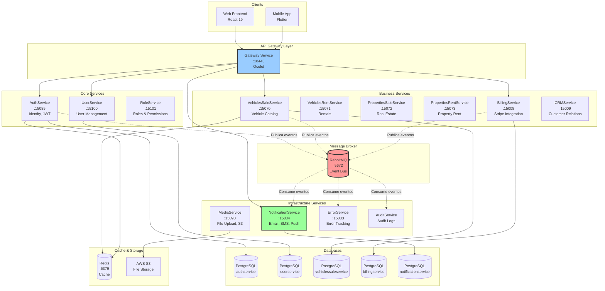
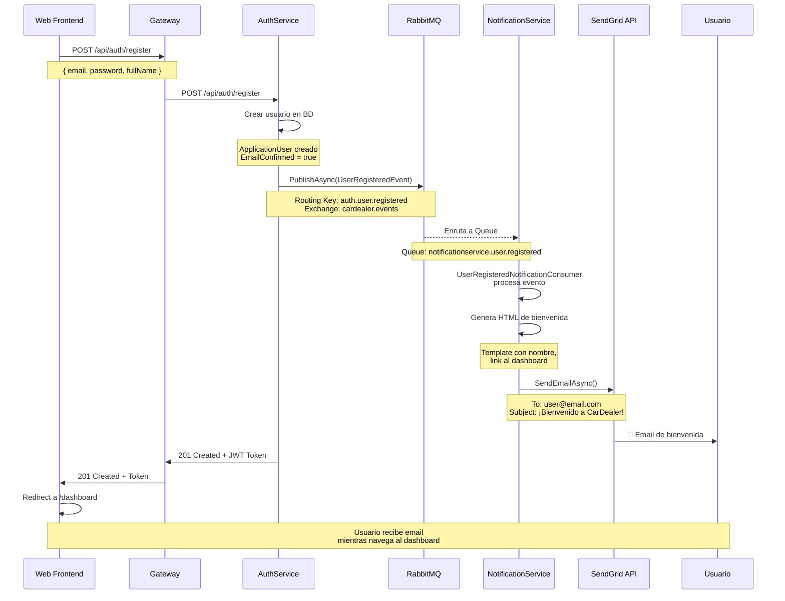
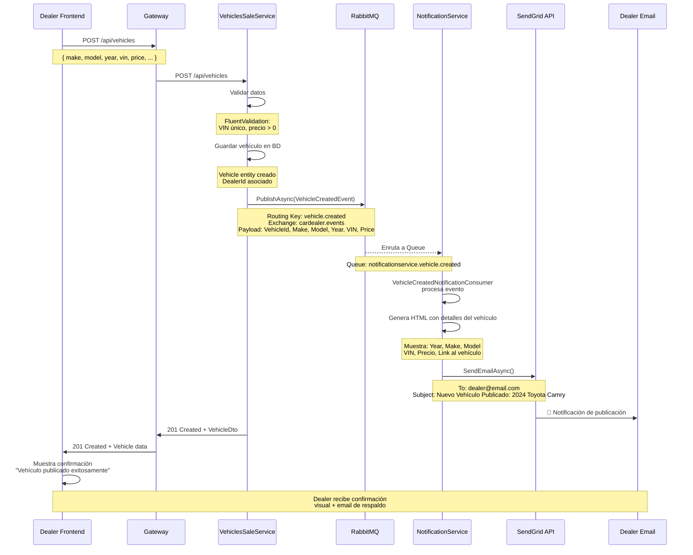
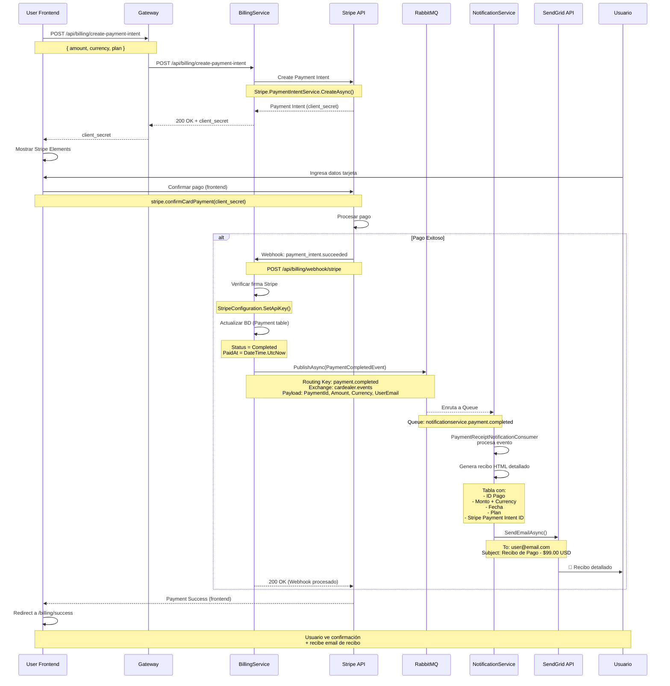
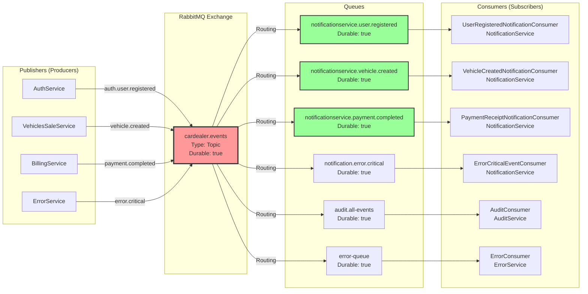
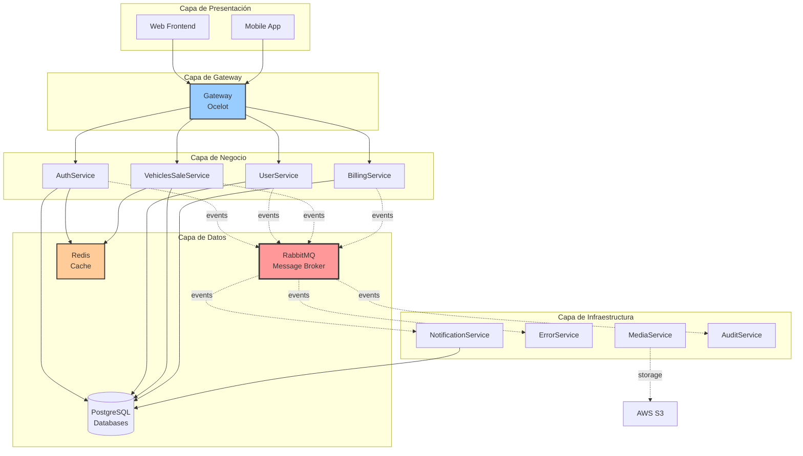
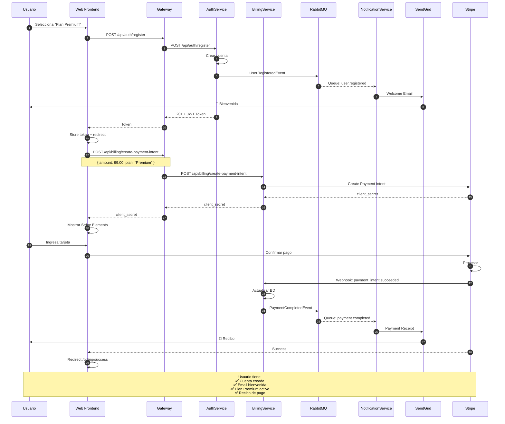
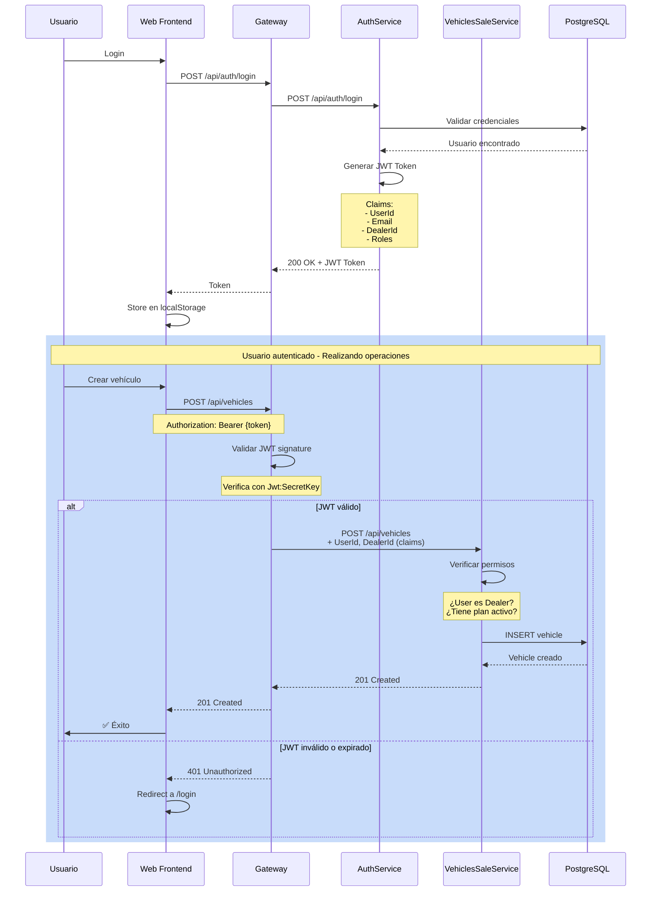

# 📊 Diagrama de Comunicación entre Microservicios

**Fecha:** 6 Enero 2026  
**Proyecto:** CarDealer Microservices  
**Estado:** Arquitectura Event-Driven con RabbitMQ

---

## 🏗️ ARQUITECTURA GENERAL



---

## 🔄 SINCRONIZACIÓN 1: Welcome Email

### Flujo Completo



### Datos Sincronizados

| Campo | Origen (AuthService) | Destino (NotificationService) | Uso en Email |
|-------|---------------------|-------------------------------|--------------|
| UserId | `user.Id` | `eventData.UserId` | Tracking |
| Email | `user.Email` | `eventData.Email` | **Recipient** |
| FullName | `user.FullName` | `eventData.FullName` | **Saludo personalizado** |
| AccountType | `user.AccountType` | `eventData.AccountType` | Personalización mensaje |
| CreatedAt | `user.CreatedAt` | `eventData.CreatedAt` | Timestamp |

---

## 🚗 SINCRONIZACIÓN 2: Vehicle Notification

### Flujo Completo



### Datos Sincronizados

| Campo | Origen (VehiclesSaleService) | Destino (NotificationService) | Uso en Email |
|-------|----------------------------|-------------------------------|--------------|
| VehicleId | `vehicle.Id` | `eventData.VehicleId` | **Link al vehículo** |
| DealerId | `vehicle.DealerId` | `eventData.DealerId` | Obtener email dealer |
| Make | `vehicle.Make` | `eventData.Make` | **Subject + Body** |
| Model | `vehicle.Model` | `eventData.Model` | **Subject + Body** |
| Year | `vehicle.Year` | `eventData.Year` | **Subject + Body** |
| VIN | `vehicle.VIN` | `eventData.VIN` | **Mostrar en tabla** |
| Price | `vehicle.Price` | `eventData.Price` | **Mostrar en tabla** |
| CreatedAt | `vehicle.CreatedAt` | `eventData.CreatedAt` | Fecha de publicación |

---

## 💳 SINCRONIZACIÓN 3: Payment Receipt

### Flujo Completo



### Datos Sincronizados

| Campo | Origen (BillingService) | Destino (NotificationService) | Uso en Email |
|-------|------------------------|-------------------------------|--------------|
| PaymentId | `payment.Id` | `eventData.PaymentId` | **ID en tabla** |
| UserId | `payment.UserId` | `eventData.UserId` | Tracking |
| UserEmail | `user.Email` | `eventData.UserEmail` | **Recipient** |
| UserName | `user.FullName` | `eventData.UserName` | **Saludo** |
| Amount | `payment.Amount` | `eventData.Amount` | **Monto en tabla + Subject** |
| Currency | `payment.Currency` | `eventData.Currency` | **Currency en tabla** |
| Description | `payment.Description` | `eventData.Description` | Descripción del pago |
| SubscriptionPlan | `payment.PlanName` | `eventData.SubscriptionPlan` | **Mostrar plan si aplica** |
| StripePaymentIntentId | `payment.StripePaymentIntentId` | `eventData.StripePaymentIntentId` | **ID Stripe en tabla** |
| PaidAt | `payment.PaidAt` | `eventData.PaidAt` | **Fecha en tabla** |

---

## 🐰 ARQUITECTURA RABBITMQ

### Exchange y Queues



### Routing Keys y Bindings

| Publisher | Routing Key | Queue | Consumer | Servicio |
|-----------|------------|-------|----------|----------|
| AuthService | `auth.user.registered` | `notificationservice.user.registered` | UserRegisteredNotificationConsumer | NotificationService |
| VehiclesSaleService | `vehicle.created` | `notificationservice.vehicle.created` | VehicleCreatedNotificationConsumer | NotificationService |
| BillingService | `payment.completed` | `notificationservice.payment.completed` | PaymentReceiptNotificationConsumer | NotificationService |
| ErrorService | `error.critical` | `notification.error.critical` | ErrorCriticalEventConsumer | NotificationService |
| *Todos* | `*.*.#` | `audit.all-events` | AuditConsumer | AuditService |
| ErrorService | `error.logged` | `error-queue` | ErrorConsumer | ErrorService |

---

## 📡 MATRIZ DE COMUNICACIÓN ENTRE SERVICIOS

### Comunicación Síncrona (HTTP via Gateway)

| Servicio Origen | Servicio Destino | Endpoint | Método | Propósito |
|----------------|------------------|----------|--------|-----------|
| Web Frontend | AuthService | `/api/auth/login` | POST | Autenticación |
| Web Frontend | AuthService | `/api/auth/register` | POST | Registro |
| Web Frontend | UserService | `/api/users/{id}` | GET | Obtener perfil |
| Web Frontend | VehiclesSaleService | `/api/vehicles` | GET/POST | CRUD vehículos |
| Web Frontend | BillingService | `/api/billing/payment-intent` | POST | Crear pago |
| AuthService | UserService | N/A | - | ❌ **NO DIRECTA** |
| VehiclesSaleService | MediaService | N/A | - | ❌ **NO DIRECTA** |

**🚨 REGLA:** Ningún microservicio llama directamente a otro. **SIEMPRE via Gateway o RabbitMQ.**

### Comunicación Asíncrona (RabbitMQ Events)

| Servicio Origen | Evento Publicado | Servicio Destino | Acción |
|----------------|------------------|------------------|--------|
| AuthService | `UserRegisteredEvent` | NotificationService | Envía email bienvenida |
| VehiclesSaleService | `VehicleCreatedEvent` | NotificationService | Notifica al dealer |
| BillingService | `PaymentCompletedEvent` | NotificationService | Envía recibo |
| *Todos* | `ErrorLoggedEvent` | ErrorService | Centraliza errores |
| *Todos* | Todos los eventos | AuditService | Audita todas las acciones |

---

## 🔗 DEPENDENCIAS ENTRE SERVICIOS

### Diagrama de Dependencias



### Tabla de Dependencias

| Servicio | Depende de | Tipo de Dependencia | Crítico |
|----------|-----------|---------------------|---------|
| **Gateway** | Consul | Service Discovery | ✅ Sí |
| **AuthService** | PostgreSQL | Base de datos | ✅ Sí |
| **AuthService** | Redis | Cache (opcional) | ❌ No |
| **AuthService** | RabbitMQ | Message Broker | ❌ No |
| **UserService** | PostgreSQL | Base de datos | ✅ Sí |
| **VehiclesSaleService** | PostgreSQL | Base de datos | ✅ Sí |
| **VehiclesSaleService** | Redis | Cache | ❌ No |
| **VehiclesSaleService** | RabbitMQ | Event Publishing | ❌ No |
| **BillingService** | PostgreSQL | Base de datos | ✅ Sí |
| **BillingService** | Stripe API | Payment Gateway | ✅ Sí |
| **BillingService** | RabbitMQ | Event Publishing | ❌ No |
| **NotificationService** | PostgreSQL | Base de datos | ✅ Sí |
| **NotificationService** | RabbitMQ | Event Consuming | ✅ Sí |
| **NotificationService** | SendGrid API | Email Provider | ✅ Sí |
| **NotificationService** | Twilio API | SMS Provider | ❌ No |
| **NotificationService** | Firebase | Push Notifications | ❌ No |
| **MediaService** | PostgreSQL | Metadata storage | ✅ Sí |
| **MediaService** | AWS S3 | File storage | ✅ Sí |
| **ErrorService** | PostgreSQL | Error logs | ✅ Sí |
| **ErrorService** | RabbitMQ | Event Consuming | ❌ No |
| **AuditService** | PostgreSQL | Audit logs | ✅ Sí |
| **AuditService** | RabbitMQ | Event Consuming | ✅ Sí |

**Leyenda:**
- ✅ **Crítico:** El servicio NO funciona sin esta dependencia
- ❌ **No Crítico:** El servicio puede funcionar sin esta dependencia (degraded mode)

---

## 🌊 FLUJO DE DATOS COMPLETO

### Ejemplo: Usuario compra plan Premium



---

## 📊 ESTADÍSTICAS DE COMUNICACIÓN

### Comunicación HTTP (Síncrona)

| Ruta | Servicio | Avg Response Time | QPS Esperado | Cacheado |
|------|----------|-------------------|--------------|----------|
| `/api/auth/login` | AuthService | 50-100ms | Alto (500-1000) | ✅ Redis |
| `/api/vehicles` | VehiclesSaleService | 30-80ms | Muy Alto (2000+) | ✅ Redis |
| `/api/billing/*` | BillingService | 100-200ms | Medio (100-300) | ❌ No |
| `/api/users/*` | UserService | 40-90ms | Alto (800-1200) | ✅ Redis |
| `/api/notifications/*` | NotificationService | 50-120ms | Bajo (50-100) | ❌ No |

### Comunicación RabbitMQ (Asíncrona)

| Evento | Publisher | Consumers | Frecuencia | Prioridad |
|--------|-----------|-----------|------------|-----------|
| `auth.user.registered` | AuthService | 1 | Baja (~10/día) | Alta |
| `vehicle.created` | VehiclesSaleService | 1 | Media (~50/día) | Media |
| `payment.completed` | BillingService | 1 | Media (~30/día) | Alta |
| `error.critical` | ErrorService | 1 | Baja (~5/día) | Crítica |
| `*.*.#` (todos) | Múltiples | 1 (Audit) | Alta (~1000/día) | Baja |

---

## 🔐 FLUJO DE AUTENTICACIÓN Y AUTORIZACIÓN



---

## 🎯 PUNTOS CLAVE DE LA ARQUITECTURA

### ✅ Ventajas del Diseño Actual

1. **Desacoplamiento:**
   - Servicios no se llaman directamente entre sí
   - Cambios en un servicio no afectan a otros
   - Facilita escalabilidad independiente

2. **Resiliencia:**
   - Si NotificationService cae, AuthService sigue funcionando
   - RabbitMQ persiste mensajes si consumer está down
   - Retries automáticos configurables

3. **Observabilidad:**
   - Todos los eventos pasan por RabbitMQ (punto central)
   - AuditService recibe TODOS los eventos para logging
   - ErrorService centraliza errores de todos los servicios

4. **Escalabilidad:**
   - Cada consumer puede escalar independientemente
   - Múltiples instancias de NotificationService pueden consumir la misma queue
   - Load balancing automático por RabbitMQ

### ⚠️ Puntos a Considerar

1. **Latencia:**
   - Eventos asíncronos NO son inmediatos (1-5 segundos típicamente)
   - No usar para operaciones que requieren respuesta instantánea

2. **Orden de Eventos:**
   - RabbitMQ NO garantiza orden entre queues diferentes
   - Si el orden importa, usar single queue o añadir sequence numbers

3. **Idempotencia:**
   - Consumers deben ser idempotentes (procesar mismo evento múltiples veces sin problemas)
   - Usar IDs únicos de evento para tracking

4. **Monitoreo:**
   - Crítico monitorear:
     - Mensajes en cola (no debe crecer indefinidamente)
     - Consumer lag (tiempo entre publish y consume)
     - Dead Letter Queue (mensajes fallidos)

---

## 🧪 CÓMO PROBAR LAS SINCRONIZACIONES

### 1. Test Welcome Email

```bash
# 1. Registrar usuario
curl -X POST http://localhost:18443/api/auth/register \
  -H "Content-Type: application/json" \
  -d '{
    "email": "test@example.com",
    "password": "Password123!",
    "fullName": "Test User"
  }'

# 2. Verificar logs
docker logs authservice | grep "UserRegisteredEvent"
docker logs notificationservice | grep "Welcome email sent"

# 3. Verificar queue en RabbitMQ
docker exec rabbitmq rabbitmqctl list_queues | grep user.registered
```

### 2. Test Vehicle Notification

```bash
# 1. Crear vehículo (necesitas token JWT primero)
curl -X POST http://localhost:18443/api/vehicles \
  -H "Authorization: Bearer {JWT_TOKEN}" \
  -H "Content-Type: application/json" \
  -d '{
    "make": "Toyota",
    "model": "Camry",
    "year": 2024,
    "vin": "1HGCM82633A123456",
    "price": 32000
  }'

# 2. Verificar logs
docker logs vehiclessaleservice | grep "VehicleCreatedEvent"
docker logs notificationservice | grep "Vehicle creation notification"

# 3. Verificar queue
docker exec rabbitmq rabbitmqctl list_queues | grep vehicle.created
```

### 3. Test Payment Receipt

```bash
# 1. Simular webhook de Stripe (en desarrollo)
curl -X POST http://localhost:18443/api/billing/webhook/stripe \
  -H "Content-Type: application/json" \
  -d '{
    "type": "payment_intent.succeeded",
    "data": {
      "object": {
        "id": "pi_test123",
        "amount": 9900,
        "currency": "usd"
      }
    }
  }'

# 2. Verificar logs
docker logs billingservice | grep "PaymentCompletedEvent"
docker logs notificationservice | grep "Payment receipt email sent"
```

---

## 📚 CONCLUSIÓN

Esta arquitectura **event-driven** con RabbitMQ permite:

✅ **Desacoplamiento total** entre servicios  
✅ **Sincronizaciones automáticas** sin necesidad de polling  
✅ **Escalabilidad horizontal** independiente por servicio  
✅ **Resiliencia** ante fallos temporales  
✅ **Auditoría completa** de todas las operaciones  
✅ **Extensibilidad** fácil para agregar nuevos consumers  

**Próximo paso:** Testing exhaustivo de las 3 sincronizaciones implementadas 🧪

---

**Documentado por:** GitHub Copilot AI Assistant  
**Fecha:** 6 Enero 2026  
**Actualizado:** Tras implementación Sprint 0.8
