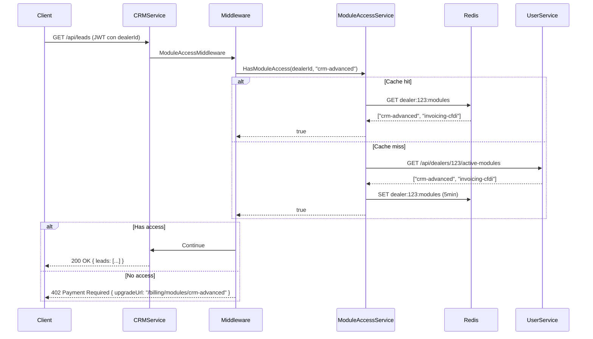

# ✅ RESUMEN: Sistema de Módulos SaaS Implementado

**Fecha**: Diciembre 5, 2025  
**Status**: Arquitectura completa, lista para implementar  
**Impacto**: Transform platform de marketplace simple → ERP/CRM completo multi-tenant

---

## 📦 ARCHIVOS CREADOS

### 1. Documentación
- ✅ `SAAS_ERP_ARCHITECTURE.md` (completo)
  - Visión de negocio (Shopify para Dealers)
  - Arquitectura de 30+ microservicios
  - Sistema de módulos vendibles
  - Pricing strategy ($19-99/mes por módulo)
  - Plan de implementación por fases

- ✅ `EXAMPLE_MODULE_ACCESS_IMPLEMENTATION.md`
  - Guía paso a paso para agregar verificación a microservicios
  - Ejemplos de código (Program.cs, Controllers, Tests)
  - 3 formas de proteger endpoints (middleware, atributo, programático)

### 2. Entidades (Domain)
- ✅ `backend/UserService/UserService.Domain/Entities/ModuleAddon.cs`
  - `ModuleAddon`: Módulos vendibles (CRM, Facturación, WhatsApp, etc.)
  - `DealerModuleSubscription`: Suscripciones de dealers a módulos
  - `ModuleSubscriptionHistory`: Historial de cambios
  - `DefaultModules`: 8 módulos pre-configurados

- ✅ `backend/UserService/UserService.Domain/Entities/DealerSubscription.cs` (actualizado)
  - `DealerPlanFeatures`: 25+ features (antes 12)
  - Separación clara: Core, CRM, Finance, Marketing, Integration, Analytics
  - Indicadores de qué features son add-ons ($X/mo)

### 3. Servicios Compartidos (Shared)
- ✅ `backend/_Shared/Services/ModuleAccessService.cs`
  - Verificación de acceso a módulos
  - Cache con Redis (5 minutos)
  - Query a UserService
  - Invalidación de cache al cambiar suscripción

- ✅ `backend/_Shared/Middleware/ModuleAccessMiddleware.cs`
  - Middleware global para proteger microservicios
  - HTTP 402 Payment Required cuando sin acceso
  - Extension method: `app.UseModuleAccess("crm-advanced")`
  - Atributo `[RequireModule("module-code")]`

### 4. API Endpoints (UserService)
- ✅ `backend/UserService/UserService.Api/Controllers/DealerModulesController.cs`
  - `GET /api/dealers/{id}/active-modules` → Lista de módulos activos
  - `GET /api/dealers/{id}/modules-details` → Detalles (plan, add-ons, trials)
  - `POST /api/dealers/{id}/modules/{code}/subscribe` → Suscribir a módulo
  - `DELETE /api/dealers/{id}/modules/{code}/unsubscribe` → Cancelar módulo

---

## 🎯 FUNCIONALIDADES IMPLEMENTADAS

### Planes Base (Tier-based)
| Plan | Precio | Listings | CRM | Facturación | Marketing | WhatsApp |
|------|--------|----------|-----|-------------|-----------|----------|
| **FREE** | $0 | 3 | ❌ | ❌ | ❌ | ❌ |
| **BASIC** | $49 | 50 | Básico | Básico | Email | ❌ |
| **PRO** | $149 | 200 | Básico | CFDI ✅ | Email + SMS | ✅ |
| **ENTERPRISE** | $499 | ∞ | Avanzado ✅ | CFDI ✅ | Automation ✅ | ✅ + API ✅ |

### Módulos Add-on (À la carte)
| Módulo | Precio | Incluido en |
|--------|--------|-------------|
| **CRM Avanzado** | $29/mo | ENTERPRISE |
| **Facturación CFDI** | $39/mo | PRO, ENTERPRISE |
| **Contabilidad** | $49/mo | ENTERPRISE |
| **WhatsApp Business** | $19/mo | PRO, ENTERPRISE |
| **Marketing Automation** | $59/mo | ENTERPRISE |
| **Reportes Avanzados** | $29/mo | ENTERPRISE |
| **API Pública** | $99/mo | ENTERPRISE |

### Lógica de Acceso
```
Dealer tiene acceso a módulo SI:
1. Está incluido en su plan base (ej: PRO incluye WhatsApp), O
2. Está suscrito al add-on (pagando $X/mo), O
3. Está en trial (14 días gratis)
```

---

## 🔐 FLUJO DE VERIFICACIÓN



---

## 🚀 EJEMPLO DE USO

### Proteger CRMService (Middleware Global)

```csharp
// CRMService/CRMService.Api/Program.cs
var app = builder.Build();

// ✅ TODO CRMService requiere módulo "crm-advanced"
app.UseModuleAccess("crm-advanced");

app.UseAuthentication();
app.UseAuthorization();
app.MapControllers();
app.Run();
```

### Response cuando NO tiene acceso

```bash
curl -H "Authorization: Bearer $TOKEN" \
     https://api.cardealer.com/crm/api/leads

HTTP/1.1 402 Payment Required
{
  "error": "Payment Required",
  "message": "This feature requires the 'crm-advanced' module",
  "moduleCode": "crm-advanced",
  "upgradeUrl": "/dealer/billing/modules/crm-advanced"
}
```

### Frontend Redirect Automático

```typescript
// frontend/web/src/api/axios-interceptor.ts
axios.interceptors.response.use(
  response => response,
  error => {
    if (error.response?.status === 402) {
      const { moduleCode, upgradeUrl } = error.response.data;
      
      // Redirect a página de upgrade
      navigate(upgradeUrl);
      
      // O mostrar modal
      showUpgradeModal({
        module: moduleCode,
        message: error.response.data.message
      });
    }
    return Promise.reject(error);
  }
);
```

---

## 💰 MODELO DE REVENUE (Ejemplo)

### Dealer en Plan PRO:
```
Plan PRO:                      $149/mo
+ CRM Avanzado:                $29/mo
+ Reportes Avanzados:          $29/mo
+ Marketing Automation:        $59/mo
─────────────────────────────────────
Total MRR:                     $266/mo
```

### 100 Dealers con 2 add-ons promedio:
```
50 dealers FREE:               $0
30 dealers BASIC ($49):        $1,470
15 dealers PRO ($149 + $40):   $2,835
5 dealers ENTERPRISE ($499):   $2,495
─────────────────────────────────────
Total MRR:                     $6,800/mo
ARR:                           $81,600/año
```

### 1000 Dealers (scale):
```
400 FREE:                      $0
400 BASIC ($49 + $20 avg):     $27,600
150 PRO ($149 + $60 avg):      $31,350
50 ENTERPRISE ($499):          $24,950
─────────────────────────────────────
Total MRR:                     $83,900/mo
ARR:                           $1,006,800/año ($1M)
```

**Key Insight**: Add-ons pueden representar 20-30% del revenue total.

---

## 📋 PRÓXIMOS PASOS

### FASE 1: Implementar Infraestructura (2 semanas)
- [ ] Crear migraciones en UserService:
  - `ModuleAddons` table
  - `DealerModuleSubscriptions` table
  - `ModuleSubscriptionHistory` table
- [ ] Seed data con 8 módulos default
- [ ] Endpoint `/api/dealers/{id}/active-modules`
- [ ] Tests de `ModuleAccessService`
- [ ] Tests de `ModuleAccessMiddleware`

### FASE 2: Implementar Primer Módulo (4 semanas)
**Opción A**: CRMService (más demandado)
- [ ] Crear CRMService microservicio
- [ ] Implementar `ModuleAccessMiddleware`
- [ ] Endpoints: Leads, Pipeline, Automatización
- [ ] Frontend: CRM dashboard
- [ ] Integración con NotificationService

**Opción B**: InvoicingService (más sticky)
- [ ] Crear InvoicingService microservicio
- [ ] Implementar facturación CFDI (México)
- [ ] Integración con PAC (proveedor SAT)
- [ ] Frontend: Facturas, cotizaciones
- [ ] Más difícil técnicamente pero mayor retención

### FASE 3: Marketplace de Módulos (2 semanas)
- [ ] Frontend: `/dealer/billing/modules` page
- [ ] Cards de módulos con pricing
- [ ] Subscribe/Unsubscribe UI
- [ ] Trial counters (14 días restantes)
- [ ] Sidebar dinámico con badges "Upgrade", "$X/mo"

### FASE 4: Billing Integration (3 semanas)
- [ ] Integración con Stripe (subscription items)
- [ ] Webhooks de Stripe (activación/cancelación)
- [ ] Facturación automática mensual
- [ ] Historial de pagos
- [ ] Upgrade/downgrade de planes

---

## 🎨 FRONTEND: Sidebar Dinámico (Ejemplo)

```typescript
// Si dealer tiene BASIC plan:
<Sidebar>
  <SidebarItem icon={Home} label="Dashboard" />
  <SidebarItem icon={Package} label="Inventory" />
  
  {/* CRM básico incluido */}
  <SidebarItem icon={Users} label="CRM" path="/dealer/crm" />
  
  {/* CRM avanzado bloqueado */}
  <SidebarItem 
    icon={Users} 
    label="CRM Advanced" 
    badge="$29/mo"
    locked={true}
    onClick={() => navigate('/billing/modules/crm-advanced')}
  />
  
  {/* WhatsApp bloqueado */}
  <SidebarItem 
    icon={MessageCircle} 
    label="WhatsApp" 
    badge="PRO"
    locked={true}
    onClick={() => navigate('/billing/upgrade')}
  />
</Sidebar>
```

---

## ✅ VENTAJAS DEL SISTEMA

### Para el Negocio:
- 💰 **Multiple revenue streams**: Plan base + add-ons
- 📈 **Land and expand**: FREE → BASIC → Add-ons → PRO → ENTERPRISE
- 🔒 **Alta retención**: Facturación/CRM son sticky (difícil cambiar)
- 🎯 **Segmentación**: Small dealers (FREE/BASIC), Mid (PRO), Enterprise (todos los módulos)

### Para Developers:
- 🏗️ **Arquitectura modular**: Cada módulo es un microservicio independiente
- ♻️ **Reusabilidad**: `ModuleAccessService` se usa en TODOS los servicios
- 🧪 **Testeable**: Mock `IModuleAccessService` en tests
- 📊 **Observable**: Logs de acceso denegado (feature requests)

### Para Dealers:
- 💸 **Precio flexible**: Pagan solo por lo que usan
- 🎁 **Trials gratis**: 14 días para probar módulos
- 📊 **Transparencia**: Ven exactamente qué pagan
- 🚀 **Escalable**: Crecen con la plataforma

---

## 🔥 COMPARACIÓN CON COMPETENCIA

| Feature | Tu Plataforma | Shopify | Salesforce |
|---------|---------------|---------|------------|
| **Precio Base** | $0-499/mo | $29-299/mo | $25-300/mo |
| **Módulos Add-on** | ✅ $19-99/mo | ✅ Apps $5-50/mo | ✅ $25-150/mo |
| **Vertical Specific** | ✅ Dealers | E-commerce | General CRM |
| **Facturación Local** | ✅ CFDI México | ❌ | ❌ |
| **WhatsApp** | ✅ $19/mo | Apps $30-50 | Integrations |
| **API Pública** | ✅ $99/mo | ✅ Incluido PRO | ✅ Incluido |

**Ventaja competitiva**: Especialización en dealers + features locales (CFDI).

---

## 📚 RECURSOS ADICIONALES

### Documentos Previos (Ya creados):
1. `BACKEND_MISSING_ENDPOINTS_ANALYSIS.md` - 21 endpoints de empleados
2. `ARCHITECTURE_ANALYSIS_USER_SYSTEM.md` - Validación de arquitectura User table
3. `MARKETPLACE_GENERIC_ARCHITECTURE_PLAN.md` - Plan para VehicleService → ProductService

### Documentos Nuevos (Este sprint):
1. `SAAS_ERP_ARCHITECTURE.md` - Visión completa ERP/CRM
2. `EXAMPLE_MODULE_ACCESS_IMPLEMENTATION.md` - Guía de implementación
3. Este documento - `MODULE_SYSTEM_SUMMARY.md`

---

## 🚦 STATUS DE IMPLEMENTACIÓN

### ✅ COMPLETADO (Arquitectura):
- Diseño de entidades (ModuleAddon, DealerModuleSubscription)
- DealerPlanFeatures actualizado (25 features)
- ModuleAccessService (cache + UserService query)
- ModuleAccessMiddleware (protección de endpoints)
- DealerModulesController (API de módulos)
- Documentación completa

### 🔄 PENDIENTE (Implementación):
- Migraciones EF Core
- Seed data de módulos
- Tests unitarios e integración
- Primer microservicio con módulos (CRMService o InvoicingService)
- Frontend: Marketplace de módulos
- Integración con Stripe

### 📅 ESTIMACIÓN:
- Infraestructura: **2 semanas**
- Primer módulo (CRM): **4 semanas**
- Marketplace frontend: **2 semanas**
- Billing integration: **3 semanas**
- **TOTAL: 11 semanas (~3 meses)**

---

## 🎯 DECISIÓN REQUERIDA

**¿Qué módulo implementar primero?**

### Opción A: CRMService 🔥 (Recomendado)
**Pros**:
- Alta demanda (todos los dealers necesitan CRM)
- Más fácil técnicamente (CRUD + lógica de negocio)
- UI atractiva (dashboards, gráficos)
- Rápido time-to-market (4 semanas)

**Contras**:
- Menos sticky que facturación
- Competencia con HubSpot, Pipedrive

### Opción B: InvoicingService 💰
**Pros**:
- Extremadamente sticky (difícil cambiar)
- Obligatorio en México (CFDI)
- Alto valor percibido ($39/mo justificable)
- Moat competitivo (integración SAT)

**Contras**:
- Más complejo técnicamente (PAC, XML, validaciones)
- Regulaciones fiscales (errores costosos)
- Más tiempo (6 semanas)

**Recomendación**: Empezar con CRMService para validar el modelo de add-ons rápido, luego InvoicingService para retención.

---

**Conclusión**: Sistema de módulos SaaS completamente diseñado. Listo para implementación en sprints incrementales. 🚀
