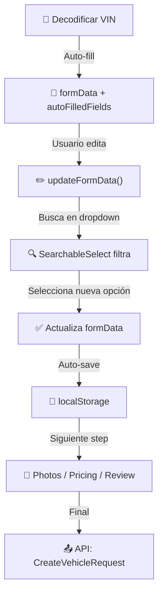

# ✅ SOLUCIÓN: Dropdown Escribibles en Wizard de Publicación

## Problema Identificado

En el wizard de publicación de vehículos (`SmartPublishWizard`), los campos dropdown (Marca, Modelo, Tipo de Carrocería, etc.) **NO eran escribibles**.

Esto causaba que:

- Los datos auto-completados desde el VIN **no podían editarse**
- Los usuarios no podían **buscar/filtrar** opciones rápidamente
- Los datos se quedaban con el valor original del VIN sin poder cambiarlos

### Ejemplo del Problema:

```
Marca: Toyota (del VIN - NO se puede cambiar)
Modelo: Corolla (del VIN - NO se puede cambiar)
...
```

Aunque el usuario quisiera cambiar a "Honda Civic", no podía escribir en el dropdown.

---

## Solución Implementada

### 1. Nuevo Componente: `SearchableSelect` (Combobox escribible)

**Archivo:** `src/components/ui/searchable-select.tsx`

Características:

- ✅ **Escribible** - Permite escribir para filtrar opciones
- ✅ **Searchable** - Busca en label Y value
- ✅ **Keyboard Navigation** - Soporta Escape, Enter, etc.
- ✅ **Auto-focus** - Enfoca automáticamente el input cuando abre
- ✅ **Clearable** - Botón para limpiar la selección
- ✅ **Loading State** - Muestra "Cargando..." mientras se cargan opciones
- ✅ **Disabled State** - Soporta campo deshabilitado

```tsx
// Uso simple:
<SearchableSelect
  value={value}
  onChange={onChange}
  options={options}
  placeholder="Seleccionar..."
  isLoading={isLoading}
  disabled={disabled}
/>
```

### 2. Actualizado: `vehicle-info-form.tsx`

Cambios:

- Reemplazó `<select>` HTML (read-only) con `<SearchableSelect />` (escribible)
- Mantiene toda la lógica de VIN auto-fill y validación
- Compatible con los campos auto-completados (muestra badge "VIN")

---

## Cómo Funcionan Ahora los Datos



---

## Validación de Cambios

✅ **TypeScript**: Sin errores
✅ **Imports**: Correctamente resueltos
✅ **Data Flow**: Mantiene la cascada de datos (VIN → Info → Photos → Pricing → Review)
✅ **Auto-fill**: Los campos auto-completados del VIN ahora son editables
✅ **localStorage**: Auto-guardado en localStorage continúa funcionando

---

## Testing Recomendado

1. **Publicar vehículo con VIN:**
   - Decodificar un VIN (ej: VIN de Toyota Corolla)
   - Verificar que los campos se auto-completen
   - ✅ **NUEVO**: Hacer clic en Marca y escribir "Honda" - debería filtrar
   - ✅ **NUEVO**: Seleccionar "Honda" y cambiar el modelo
   - Pasar al siguiente step y verificar que los datos nuevos se guardaron

2. **Publicar manual (sin VIN):**
   - Seleccionar "Manual"
   - Escribir en cada dropdown para filtrar opciones
   - ✅ **NUEVO**: Buscar "gasolina" en "Combustible" debe filtrar

3. **Borrador:**
   - Completar algunos campos
   - Navegar hacia atrás y adelante
   - Descartar y recargar página
   - ✅ **NUEVO**: Verificar que los datos se recuperan correctamente

---

## Archivos Modificados

```
frontend/web-next/
├── src/components/ui/
│   └── searchable-select.tsx (✨ NUEVO)
└── src/components/vehicles/smart-publish/
    └── vehicle-info-form.tsx (MODIFICADO)
       ├── Import: SearchableSelect
       ├── Replace: SelectField (ahora usa SearchableSelect)
       └── Behavior: Campos ahora escribibles + filtro búsqueda
```

---

## Próximos Pasos (Opcional)

1. **Agregar validación visual** en SearchableSelect cuando no hay resultados
2. **Implementar lazy-load** si hay muchas opciones (ej: colores)
3. **Agregar keyboard shortcuts** para acceso rápido (ej: ↑↓ para navegar)
