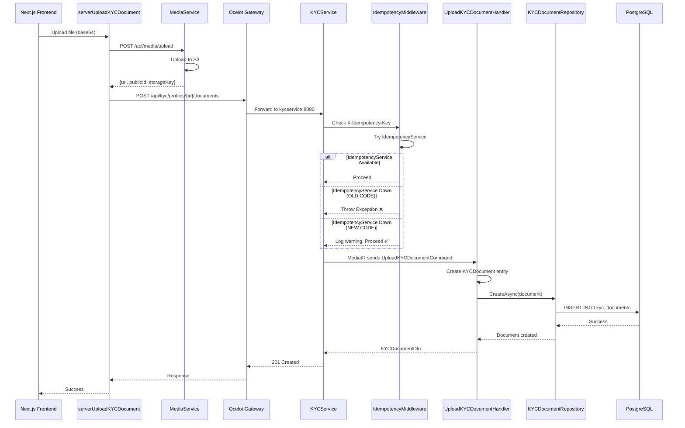

# 🔍 Testing KYC Document Upload Flow - Complete Guide

**Date:** 2026-02-24  
**Purpose:** Debug and verify KYC document upload flow from frontend to database  
**Test User:** `gmoreno@okla.com.do` / `$Gregory1`  
**Admin User:** `admin@okla.local` / `Admin123!@#`

---

## 📊 Current Situation

**Problem:** Documents upload successfully to S3 via MediaService, but don't appear in the admin panel.

**Root Cause (Suspected):**

- IdempotencyService is down/unavailable
- Old code in KYCService pod throws exception when idempotency check fails
- Handler never executes → Documents never inserted into DB

**Fix Applied:**

- Commit `119d0f13`: Middleware now catches IdempotencyService errors and proceeds
- Commit `61505a4c`: Added detailed logging to UploadKYCDocumentHandler
- Commit `8c6c6ffa`: Added comprehensive logging to controller and repository layers

---

## 🔄 Complete Upload Flow



---

## 🧪 How to Test the Upload Flow

### Option 1: Manual Test via Browser (Recommended)

1. **Open frontend:** `https://okla.com.do` (or localhost if testing locally)
2. **Login as user:**
   - Email: `gmoreno@okla.com.do`
   - Password: `$Gregory1`
3. **Navigate to KYC verification page:** `/cuenta/verificacion`
4. **Upload documents:**
   - Cédula (Front): any JPG/PNG image
   - Cédula (Back): any JPG/PNG image
   - Selfie: any JPG/PNG image
5. **While uploading, watch logs in terminal:**
   ```bash
   kubectl logs -n okla -l app=kycservice --follow
   ```
6. **Expected log sequence:**
   ```
   info: IdempotencyMiddleware: IdempotencyService unavailable, proceeding without idempotency
   info: CONTROLLER: UploadDocument START
   info: Starting document upload for KYC Profile...
   info: Profile found: Status=...
   info: Creating document with ID...
   info: REPOSITORY: CreateAsync START
   info: Document added to context, calling SaveChangesAsync...
   info: REPOSITORY: CreateAsync SUCCESS === SaveChanges returned 1 changes
   info: Document created successfully
   info: CONTROLLER: UploadDocument SUCCESS
   ```
7. **Verify in admin panel:**
   - Login as admin: `admin@okla.local` / `Admin123!@#`
   - Navigate to: `/admin/kyc`
   - Find user `gmoreno@okla.com.do`
   - Click to view details
   - **Documents section should show 3 uploaded documents**

### Option 2: Test via API with curl

```bash
# 1. Login as user to get JWT token
TOKEN=$(curl -s -X POST https://okla.com.do/api/auth/login \
  -H "Content-Type: application/json" \
  -d '{"email":"gmoreno@okla.com.do","password":"$Gregory1"}' \
  | jq -r '.data.accessToken')

# 2. Get KYC Profile ID
PROFILE_ID=$(curl -s -X GET https://okla.com.do/api/kyc/kycprofiles/user \
  -H "Authorization: Bearer $TOKEN" \
  | jq -r '.data.id')

echo "Profile ID: $PROFILE_ID"

# 3. Create a test image (1x1 red pixel PNG)
echo "iVBORw0KGgoAAAANSUhEUgAAAAEAAAABCAYAAAAfFcSJAAAADUlEQVR42mP8z8DwHwAFBQIAX8jx0gAAAABJRU5ErkJggg==" > /tmp/test_image.b64

# 4. Upload document via server action (simulate Next.js call)
# This would require calling the Next.js API route, not the backend directly
# Better to use the browser for testing
```

### Option 3: Check Database Directly

```bash
# Connect to PostgreSQL
PGPASSWORD=your_password psql -h okla-db-do-user-31493168-0.g.db.ondigitalocean.com -p 25060 -U doadmin -d kycservice

# Get profile ID
SELECT id, user_id, full_name, status FROM kyc_profiles WHERE user_id = (SELECT id FROM auth_users WHERE email = 'gmoreno@okla.com.do');

# Check documents for this profile
SELECT id, kyc_profile_id, type, document_name, status, uploaded_at
FROM kyc_documents
WHERE kyc_profile_id = '<profile_id_from_above>';

# Count total documents
SELECT COUNT(*) as total_documents FROM kyc_documents;
```

---

## 📋 Verification Checklist

After uploading documents, verify each step:

- [ ] **MediaService upload succeeded** (check S3 bucket or MediaService logs)
- [ ] **KYCService received request** (controller logs: "CONTROLLER: UploadDocument START")
- [ ] **Idempotency middleware passed** (log: "proceeding without idempotency" or no error)
- [ ] **Handler executed** (log: "Starting document upload for KYC Profile")
- [ ] **Profile found** (log: "Profile found: Status=...")
- [ ] **Document created in memory** (log: "Creating document with ID")
- [ ] **Repository called** (log: "REPOSITORY: CreateAsync START")
- [ ] **SaveChangesAsync called** (log: "calling SaveChangesAsync...")
- [ ] **Database insert succeeded** (log: "SaveChanges returned 1 changes")
- [ ] **Handler returned DTO** (log: "Document upload completed successfully")
- [ ] **Controller returned 201** (log: "CONTROLLER: UploadDocument SUCCESS")
- [ ] **Database contains document** (SQL: `SELECT * FROM kyc_documents WHERE kyc_profile_id = '...'`)
- [ ] **Admin panel displays document** (UI: Admin panel shows document in list)

---

## 🐛 Common Issues and Solutions

### Issue 1: "IdempotencyService unavailable" + Request fails

**Symptom:** Logs show idempotency error and no handler logs  
**Cause:** Old code (before commit `119d0f13`)  
**Solution:** Wait for GitHub Actions to rebuild image, then restart pod

### Issue 2: Handler executes but no DB insert

**Symptom:** Handler logs present, but "SaveChanges returned 0 changes"  
**Cause:** EF Core not tracking entity or DB connection issue  
**Solution:** Check DbContext configuration, verify connection string

### Issue 3: Documents in DB but not in admin panel

**Symptom:** Database has records, admin panel empty  
**Cause:** Admin panel fetching wrong endpoint or profile ID mismatch  
**Solution:** Check admin panel API calls (Network tab), verify profile ID

### Issue 4: GitHub Actions not rebuilding

**Symptom:** Pod still runs old image after push  
**Cause:** Workflow not triggered or using cached build  
**Solution:**

```bash
# Check latest workflow run
# Visit: https://github.com/gregorymorenoiem/cardealer-microservices/actions

# Force rebuild
git commit --allow-empty -m "rebuild: force CI image rebuild"
git push origin main
```

---

## 🚀 Quick Commands

```bash
# Watch logs in real-time
kubectl logs -n okla -l app=kycservice --follow | grep -E "CONTROLLER|REPOSITORY|idempotency"

# Check pod image digest
kubectl get pods -n okla -l app=kycservice -o jsonpath='{.items[0].status.containerStatuses[0].imageID}'

# Restart deployment to pull latest image
kubectl rollout restart deployment/kycservice -n okla

# Wait for rollout to complete
kubectl rollout status deployment/kycservice -n okla

# Check database document count
kubectl exec -it deployment/kycservice -n okla -- psql $DATABASE_URL -c "SELECT COUNT(*) FROM kyc_documents;"
```

---

## 📝 Expected Results After Fix

1. **Logs show complete flow:** Controller → Handler → Repository → DB
2. **Database contains documents:** `SELECT COUNT(*) FROM kyc_documents` returns > 0
3. **Admin panel displays documents:** UI shows uploaded files with preview/download links
4. **No IdempotencyService errors block requests:** Middleware logs warning but proceeds

---

## ✅ Success Criteria

**Task complete when:**

- User `gmoreno@okla.com.do` uploads 3 documents (cédula front/back + selfie)
- Admin `admin@okla.local` logs in and navigates to KYC admin panel
- Admin sees the user in the list
- Admin clicks on user and sees 3 documents displayed with:
  - Document type (Cédula / Selfie)
  - Upload date
  - Status (Pending)
  - Preview/download button

---

**Last Updated:** 2026-02-24  
**Commits with fixes:**

- `119d0f13`: Middleware error handling
- `61505a4c`: Handler logging
- `8c6c6ffa`: Controller + Repository logging
