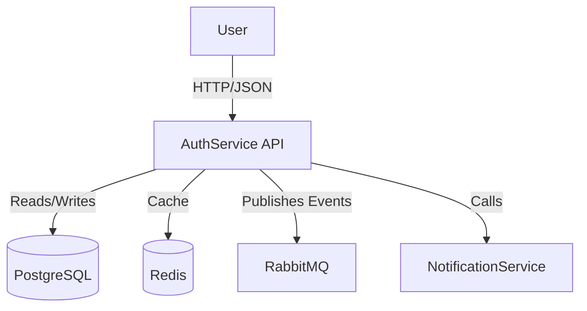

# Architecture: AuthService

## 🏗️ High-Level Design

The AuthService follows the **Clean Architecture** principles, separating concerns into distinct layers:

1.  **Api**: Entry point (Controllers, Middleware, Configuration).
2.  **Application**: Business logic (Commands, Queries, Validators).
3.  **Domain**: Core entities, interfaces, and business rules.
4.  **Infrastructure**: External concerns (Database, Messaging, Identity).

## 🧩 Components

### C4 Container Diagram (Textual)

## 🔒 Security

-   **Authentication**: JWT (JSON Web Tokens) with 60-minute expiration.
-   **Passwords**: Hashed using BCrypt/Argon2 (via ASP.NET Core Identity).
-   **Communication**: HTTPS required for all endpoints.
-   **Secrets**: Managed via User Secrets (Dev) and Key Vault (Prod).

## 🔄 Data Flow

### Login Flow
1.  User submits credentials to `/api/auth/login`.
2.  `LoginCommand` is handled by `LoginCommandHandler`.
3.  Credentials validated against `AspNetUsers` table.
4.  JWT Access Token and Refresh Token generated.
5.  Refresh Token stored in DB (hashed).
6.  Tokens returned to user.

## 🛠️ Patterns
-   **CQRS**: Command Query Responsibility Segregation using MediatR.
-   **Repository Pattern**: Abstraction over Entity Framework Core.
-   **Outbox Pattern**: For reliable event publishing (planned).
