# 🔄 Diagrama de Comunicaciones - OKLA Compliance

## Diagrama Principal de Arquitectura

```mermaid
flowchart TB
    subgraph CLIENTS["👥 CLIENTES"]
        WEB["🌐 Web App<br/>React 19"]
        MOBILE["📱 Mobile App<br/>Flutter"]
        API["🔌 API Consumers"]
    end

    subgraph GATEWAY["🚪 API GATEWAY"]
        OCELOT["Ocelot<br/>api.okla.com.do"]
    end

    subgraph CORE["🏠 CORE SERVICES"]
        AUTH["🔐 AuthService"]
        USER["👤 UserService"]
        VEHICLE["🚗 VehiclesSaleService"]
        MEDIA["📷 MediaService"]
        BILLING["💳 BillingService"]
        NOTIFY["📧 NotificationService"]
    end

    subgraph COMPLIANCE["⚖️ COMPLIANCE LAYER"]
        C1["C1: TaxCompliance<br/>📊 Ley 11-92"]
        C2["C2: DataProtection<br/>🔒 Ley 172-13"]
        C3["C3: AML<br/>🚨 Ley 155-17"]
        C4["C4: ConsumerProtection<br/>🛡️ Ley 358-05"]
        C5["C5: Compliance<br/>✅ Orquestador"]
        C6["C6: Contract<br/>📝 Ley 126-02"]
        C7["C7: Escrow<br/>💰 Código Civil"]
        C8["C8: Dispute<br/>⚔️ Pro-Consumidor"]
        C9["C9: Audit<br/>📋 Trazabilidad"]
        C10["C10: LegalDocument<br/>📄 Requisitos"]
        C11["C11: RegulatoryAlert<br/>🔔 Monitoreo"]
        C12["C12: Integration<br/>🔗 Gobierno"]
    end

    subgraph INFRA["🏗️ INFRAESTRUCTURA"]
        PG[("🐘 PostgreSQL")]
        REDIS[("⚡ Redis")]
        RABBIT["🐰 RabbitMQ"]
        S3["☁️ S3 Storage"]
    end

    subgraph EXTERNAL["🏛️ SISTEMAS EXTERNOS"]
        DGII["DGII<br/>Impuestos"]
        JCE["JCE<br/>Identidad"]
        UAF["UAF<br/>AML"]
        INTRANT["INTRANT<br/>Vehículos"]
        INDOTEL["INDOTEL<br/>PKI"]
        PROCON["Pro-Consumidor<br/>Disputas"]
        BCRD["Banco Central<br/>Tasas"]
    end

    WEB --> OCELOT
    MOBILE --> OCELOT
    API --> OCELOT

    OCELOT --> AUTH
    OCELOT --> USER
    OCELOT --> VEHICLE
    OCELOT --> MEDIA
    OCELOT --> BILLING
    OCELOT --> NOTIFY
    OCELOT --> C1
    OCELOT --> C2
    OCELOT --> C3
    OCELOT --> C4
    OCELOT --> C5
    OCELOT --> C6
    OCELOT --> C7
    OCELOT --> C8
    OCELOT --> C10
    OCELOT --> C11

    C5 --> C1
    C5 --> C2
    C5 --> C3
    C5 --> C4
    C5 --> C9

    C6 --> C9
    C7 --> C9
    C8 --> C9

    C1 --> C12
    C3 --> C12
    C6 --> C12
    C8 --> C12

    C12 --> DGII
    C12 --> JCE
    C12 --> UAF
    C12 --> INTRANT
    C12 --> INDOTEL
    C12 --> PROCON
    C12 --> BCRD

    AUTH --> PG
    USER --> PG
    VEHICLE --> PG
    C1 --> PG
    C2 --> PG
    C3 --> PG
    C4 --> PG
    C6 --> PG
    C7 --> PG
    C8 --> PG
    C9 --> PG
    C10 --> PG
    C11 --> PG

    AUTH --> REDIS
    C5 --> REDIS
    C9 --> REDIS

    VEHICLE --> RABBIT
    C3 --> RABBIT
    C5 --> RABBIT
    C9 --> RABBIT
    NOTIFY --> RABBIT

    MEDIA --> S3
    C10 --> S3

    style COMPLIANCE fill:#e1f5fe
    style EXTERNAL fill:#fff3e0
    style INFRA fill:#f3e5f5
```

---

## Comunicación por Eventos (RabbitMQ)

```mermaid
flowchart LR
    subgraph PUBLISHERS["📤 PUBLISHERS"]
        P1["VehiclesSaleService"]
        P2["C3: AML Service"]
        P3["C5: Compliance Service"]
        P4["C1: Tax Service"]
        P5["C6: Contract Service"]
        P6["C7: Escrow Service"]
    end

    subgraph EXCHANGES["📬 EXCHANGES"]
        E1["vehicle.events"]
        E2["aml.alerts"]
        E3["compliance.events"]
        E4["tax.declarations"]
        E5["contract.signatures"]
        E6["escrow.movements"]
    end

    subgraph QUEUES["📥 QUEUES"]
        Q1["compliance.vehicle.created"]
        Q2["notification.aml.alert"]
        Q3["audit.compliance.check"]
        Q4["notification.tax.reminder"]
        Q5["audit.contract.signed"]
        Q6["notification.escrow.released"]
    end

    subgraph CONSUMERS["📥 CONSUMERS"]
        C1C["C5: Compliance"]
        C2C["NotificationService"]
        C3C["C9: Audit Service"]
    end

    P1 --> E1
    P2 --> E2
    P3 --> E3
    P4 --> E4
    P5 --> E5
    P6 --> E6

    E1 --> Q1
    E2 --> Q2
    E3 --> Q3
    E4 --> Q4
    E5 --> Q5
    E6 --> Q6

    Q1 --> C1C
    Q2 --> C2C
    Q3 --> C3C
    Q4 --> C2C
    Q5 --> C3C
    Q6 --> C2C

    style EXCHANGES fill:#fff9c4
    style QUEUES fill:#c8e6c9
```

---

## Flujo de Venta de Vehículo

```mermaid
sequenceDiagram
    participant Buyer as 🧑 Comprador
    participant Gateway as 🚪 Gateway
    participant Vehicle as 🚗 VehicleService
    participant AML as 🚨 C3: AML
    participant Tax as 📊 C1: Tax
    participant Contract as 📝 C6: Contract
    participant Escrow as 💰 C7: Escrow
    participant Legal as 📄 C10: LegalDoc
    participant Integration as 🔗 C12: Integration
    participant Audit as 📋 C9: Audit
    participant Seller as 🏪 Vendedor

    Buyer->>Gateway: 1. Iniciar compra
    Gateway->>Vehicle: 2. Obtener vehículo
    Vehicle-->>Gateway: Datos vehículo

    Gateway->>AML: 3. KYC Check (Comprador)
    AML->>Integration: Verificar JCE
    Integration-->>AML: Cédula válida
    AML-->>Gateway: ✅ KYC Aprobado

    Gateway->>Tax: 4. Validar RNC vendedor
    Tax->>Integration: Consultar DGII
    Integration-->>Tax: RNC activo
    Tax-->>Gateway: ✅ RNC válido

    Gateway->>Contract: 5. Generar contrato
    Contract->>Legal: Obtener template
    Legal-->>Contract: Template compraventa
    Contract-->>Gateway: Contrato generado

    Gateway->>Buyer: 6. Solicitar firma
    Buyer-->>Gateway: Firma digital

    Gateway->>Contract: 7. Registrar firma comprador
    Contract->>Integration: Validar con INDOTEL
    Integration-->>Contract: ✅ Firma válida

    Gateway->>Seller: 8. Solicitar firma
    Seller-->>Gateway: Firma digital

    Gateway->>Contract: 9. Registrar firma vendedor
    Contract-->>Gateway: ✅ Contrato firmado

    Gateway->>Escrow: 10. Crear cuenta escrow
    Escrow-->>Gateway: Cuenta creada

    Gateway->>Buyer: 11. Solicitar pago
    Buyer-->>Gateway: Pago realizado

    Gateway->>Escrow: 12. Depositar fondos
    Escrow-->>Gateway: ✅ Fondos depositados

    Gateway->>Integration: 13. Validar vehículo INTRANT
    Integration-->>Gateway: ✅ Sin multas

    Gateway->>Legal: 14. Generar traspaso
    Legal->>Integration: Reportar a DGII
    Integration-->>Legal: NCF generado
    Legal-->>Gateway: Documentos listos

    Gateway->>Escrow: 15. Liberar fondos
    Escrow->>Seller: Transferir pago
    Escrow-->>Gateway: ✅ Fondos liberados

    Gateway->>Audit: 16. Registrar transacción
    Audit-->>Gateway: Log completado

    Gateway->>Buyer: ✅ Compra completada
    Gateway->>Seller: ✅ Venta completada
```

---

## Flujo de Disputa

```mermaid
sequenceDiagram
    participant Consumer as 🧑 Consumidor
    participant Gateway as 🚪 Gateway
    participant Protection as 🛡️ C4: ConsumerProtection
    participant Dispute as ⚔️ C8: Dispute
    participant Data as 🔒 C2: DataProtection
    participant Integration as 🔗 C12: Integration
    participant Audit as 📋 C9: Audit
    participant Notify as 📧 Notification
    participant Seller as 🏪 Vendedor

    Consumer->>Gateway: 1. Crear reclamación
    Gateway->>Protection: Registrar caso
    Protection->>Data: Verificar consentimiento
    Data-->>Protection: ✅ Consentimiento activo
    Protection-->>Gateway: Caso #REC-2026-001

    Gateway->>Notify: 2. Notificar vendedor
    Notify->>Seller: Email: 15 días para responder

    Note over Seller: ⏳ Plazo: 15 días hábiles

    alt Respuesta en tiempo
        Seller->>Gateway: 3. Enviar respuesta
        Gateway->>Dispute: Evaluar respuesta

        alt Respuesta satisfactoria
            Dispute-->>Gateway: ✅ Caso resuelto
            Gateway->>Consumer: Resolución aceptada
        else Respuesta insatisfactoria
            Dispute-->>Gateway: ⚠️ Requiere mediación
            Gateway->>Dispute: 4. Agendar mediación
            Dispute->>Notify: Invitar a mediación
            Notify->>Consumer: Fecha de mediación
            Notify->>Seller: Fecha de mediación

            Note over Consumer,Seller: 🤝 Sesión de Mediación

            alt Acuerdo en mediación
                Dispute-->>Gateway: ✅ Acuerdo alcanzado
                Gateway->>Audit: Registrar acuerdo
            else Sin acuerdo
                Dispute->>Integration: 5. Escalar a Pro-Consumidor
                Integration-->>Dispute: Caso #PC-2026-001
                Dispute-->>Gateway: ⚖️ Escalado
                Gateway->>Consumer: Caso en Pro-Consumidor
            end
        end
    else Sin respuesta (15 días)
        Gateway->>Dispute: Vendedor no respondió
        Dispute->>Integration: Auto-escalar
        Integration-->>Dispute: Caso #PC-2026-001
        Gateway->>Consumer: Escalado automático
    end

    Gateway->>Audit: Registrar timeline completo
```

---

## Flujo AML (Anti-Lavado)

```mermaid
sequenceDiagram
    participant User as 👤 Usuario
    participant Gateway as 🚪 Gateway
    participant AML as 🚨 C3: AML
    participant Integration as 🔗 C12: Integration
    participant Audit as 📋 C9: Audit
    participant Alert as 🔔 C11: RegulatoryAlert
    participant Notify as 📧 Notification
    participant Officer as 👮 Oficial Cumplimiento

    User->>Gateway: 1. Transacción $15,000 USD
    Gateway->>AML: Registrar transacción

    AML->>AML: 2. Verificar umbral
    Note over AML: $15,000 >= $10,000 ⚠️

    AML->>Integration: 3. Verificar listas sanciones
    Integration-->>AML: No en listas

    AML->>Integration: 4. Verificar PEP
    Integration-->>AML: No es PEP

    AML->>AML: 5. Calcular riesgo
    Note over AML: Score: 65/100 (Medio-Alto)

    AML->>Audit: 6. Registrar alerta

    AML->>Alert: 7. Crear alerta interna
    Alert->>Notify: Notificar oficial
    Notify->>Officer: 🚨 Nueva alerta AML

    Officer->>Gateway: 8. Revisar alerta
    Gateway->>AML: Obtener detalles
    AML-->>Gateway: Transacción + historial

    alt Falso Positivo
        Officer->>Gateway: Marcar como FP
        Gateway->>AML: Cerrar alerta
        AML->>Audit: Registrar resolución
    else Sospechoso Confirmado
        Officer->>Gateway: Crear ROS
        Gateway->>AML: Generar reporte
        AML->>Integration: 9. Enviar a UAF
        Note over Integration: ⏳ 15 días hábiles máximo
        Integration-->>AML: Confirmación UAF
        AML->>Audit: Registrar envío ROS
        AML-->>Gateway: ROS enviado
    end
```

---

## Matriz de Dependencias

```mermaid
graph TD
    subgraph "Capa 1: Core"
        AUTH[AuthService]
        USER[UserService]
    end

    subgraph "Capa 2: Business"
        VEHICLE[VehiclesSaleService]
        BILLING[BillingService]
    end

    subgraph "Capa 3: Compliance Básico"
        C2[C2: DataProtection]
        C4[C4: ConsumerProtection]
    end

    subgraph "Capa 4: Compliance Transaccional"
        C1[C1: TaxCompliance]
        C3[C3: AML]
        C6[C6: Contract]
        C7[C7: Escrow]
    end

    subgraph "Capa 5: Compliance Operativo"
        C5[C5: Compliance Orquestador]
        C8[C8: Dispute]
        C10[C10: LegalDocument]
    end

    subgraph "Capa 6: Soporte"
        C9[C9: Audit]
        C11[C11: RegulatoryAlert]
        C12[C12: Integration]
    end

    AUTH --> USER
    VEHICLE --> AUTH
    BILLING --> AUTH

    C2 --> USER
    C4 --> C2

    C1 --> C12
    C3 --> C12
    C6 --> C12
    C7 --> C6

    C5 --> C1
    C5 --> C2
    C5 --> C3
    C5 --> C4

    C8 --> C4
    C8 --> C7
    C10 --> C6

    C9 --> C5
    C9 --> C6
    C9 --> C7
    C9 --> C8

    C11 --> C12

    style C5 fill:#4caf50,color:#fff
    style C9 fill:#2196f3,color:#fff
    style C12 fill:#ff9800,color:#fff
```

---

## Puertos de Servicios

| Servicio                          | Puerto Dev | Puerto K8s |
| --------------------------------- | ---------- | ---------- |
| C1: TaxComplianceService          | 5021       | 8080       |
| C2: DataProtectionService         | 5022       | 8080       |
| C3: AntiMoneyLaunderingService    | 5023       | 8080       |
| C4: ConsumerProtectionService     | 5024       | 8080       |
| C5: ComplianceService             | 5025       | 8080       |
| C6: ContractService               | 5026       | 8080       |
| C7: EscrowService                 | 5027       | 8080       |
| C8: DisputeService                | 5028       | 8080       |
| C9: AuditService                  | 5029       | 8080       |
| C10: LegalDocumentService         | 5030       | 8080       |
| C11: RegulatoryAlertService       | 5031       | 8080       |
| C12: ComplianceIntegrationService | 5032       | 8080       |

---

## Resumen de Tests

---

**Documento generado:** Enero 20, 2026  
**Versión:** 1.0
