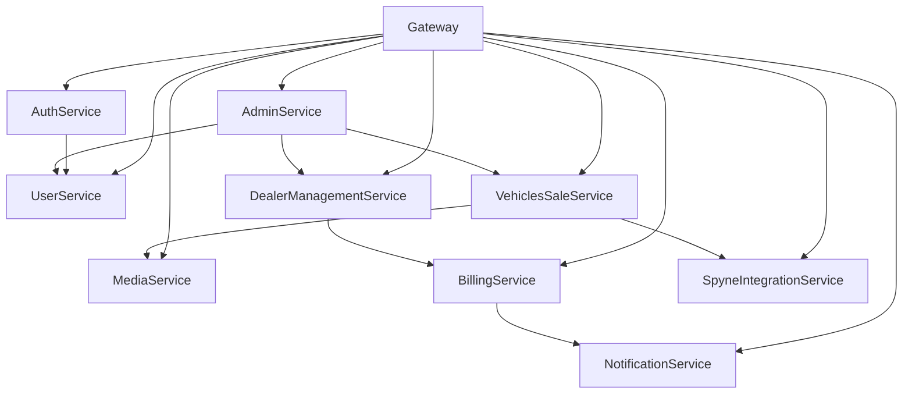

# 📚 00 - Índice Maestro de Procesos API

**Última actualización:** Enero 21, 2026  
**Versión:** 1.0.0

---

## 📋 Resumen

Este directorio contiene la documentación completa y detallada de **TODOS** los procesos de la plataforma OKLA. Cada documento describe el flujo exacto de llamadas API, el orden correcto de ejecución, validaciones, y casos de error.

> ⚠️ **IMPORTANTE:** Seguir estos procesos al pie de la letra. No hay espacio para improvisación. El orden de las llamadas API es crítico para el funcionamiento correcto.

---

## 🏗️ Arquitectura General

```
┌─────────────────────────────────────────────────────────────────────────────┐
│                              OKLA PLATFORM                                   │
├─────────────────────────────────────────────────────────────────────────────┤
│                                                                             │
│  ┌─────────────┐    ┌─────────────┐    ┌─────────────┐    ┌─────────────┐  │
│  │   FRONTEND  │    │   GATEWAY   │    │  SERVICES   │    │  DATABASE   │  │
│  │   (React)   │───▶│   (Ocelot)  │───▶│  (.NET 8)   │───▶│ (PostgreSQL)│  │
│  └─────────────┘    └─────────────┘    └─────────────┘    └─────────────┘  │
│         │                                     │                             │
│         │                              ┌──────┴──────┐                      │
│         │                              │   RabbitMQ  │                      │
│         │                              │   (Events)  │                      │
│         │                              └─────────────┘                      │
│         │                                                                   │
│         ▼                                                                   │
│  ┌─────────────┐    ┌─────────────┐    ┌─────────────┐                     │
│  │    Spyne    │    │   Stripe    │    │    AZUL     │                     │
│  │  (Imágenes) │    │   (Pagos)   │    │   (Pagos)   │                     │
│  └─────────────┘    └─────────────┘    └─────────────┘                     │
│                                                                             │
└─────────────────────────────────────────────────────────────────────────────┘
```

---

## 🎭 Tipos de Cuenta

### Definición Completa

| AccountType        | Valor | Descripción                     | Paga             | Panel Acceso      |
| ------------------ | ----- | ------------------------------- | ---------------- | ----------------- |
| `Guest`            | 0     | Usuario no registrado           | No               | Solo marketplace  |
| `Individual`       | 1     | Comprador o Vendedor Individual | $29/listing      | Marketplace       |
| `Dealer`           | 2     | Propietario de concesionario    | $49-$299/mes     | Dealer Dashboard  |
| `DealerEmployee`   | 3     | Empleado de concesionario       | No (paga Dealer) | Dealer (limitado) |
| `Admin`            | 4     | Administrador de plataforma     | Staff            | Admin Panel       |
| `PlatformEmployee` | 5     | Empleado operativo de OKLA      | Staff            | Limitado          |

### Subtipos de Admin (AdminRole)

| AdminRole         | Valor | Descripción                   | Accesos Principales                 |
| ----------------- | ----- | ----------------------------- | ----------------------------------- |
| `SuperAdmin`      | 0     | Acceso total al sistema       | TODO                                |
| `PlatformAdmin`   | 1     | Configuración y mantenimiento | Config, Maintenance, Homepage, Logs |
| `ModerationAdmin` | 2     | Moderación de contenido       | Aprobar listings, Verificar dealers |
| `SupportAdmin`    | 3     | Soporte al cliente            | Tickets, Ver usuarios, Impersonar   |
| `AnalyticsAdmin`  | 4     | Solo lectura de analytics     | Dashboard, Reportes (solo lectura)  |

---

## 📑 Índice de Documentos

### 🔐 Autenticación y Usuarios

| Doc                                  | Nombre                   | Descripción                                 |
| ------------------------------------ | ------------------------ | ------------------------------------------- |
| [01](01_AUTENTICACION_Y_REGISTRO.md) | Autenticación y Registro | Login, registro, verificación email, tokens |
| [02](02_GESTION_USUARIOS.md)         | Gestión de Usuarios      | Perfil, preferencias, roles                 |

### 🚗 Vehículos y Marketplace

| Doc                                  | Nombre                   | Descripción                           |
| ------------------------------------ | ------------------------ | ------------------------------------- |
| [03](03_PUBLICACION_VEHICULO.md)     | Publicación de Vehículo  | Flujo completo de creación de listado |
| [04](04_BUSQUEDA_Y_FILTRADO.md)      | Búsqueda y Filtrado      | Filtros, ordenamiento, paginación     |
| [05](05_FAVORITOS_Y_COMPARACION.md)  | Favoritos y Comparación  | Guardar, comparar, compartir          |
| [06](06_ALERTAS_Y_NOTIFICACIONES.md) | Alertas y Notificaciones | Price alerts, saved searches          |

### 🏢 Dealers

| Doc                               | Nombre                | Descripción                         |
| --------------------------------- | --------------------- | ----------------------------------- |
| [07](07_GESTION_DEALER.md)        | Gestión de Dealer     | Registro, verificación, ubicaciones |
| [08](08_SUSCRIPCIONES_Y_PAGOS.md) | Suscripciones y Pagos | Stripe, AZUL, planes, facturación   |
| [09](09_INVENTARIO_DEALER.md)     | Inventario de Dealer  | Bulk upload, gestión masiva         |
| [10](10_ANALYTICS_DEALER.md)      | Analytics de Dealer   | Dashboard, métricas, reportes       |

### 🖼️ Integración Spyne

| Doc                        | Nombre             | Descripción                           |
| -------------------------- | ------------------ | ------------------------------------- |
| [11](11_SPYNE_IMAGENES.md) | Imágenes con Spyne | Background replacement, procesamiento |
| [12](12_SPYNE_360_SPIN.md) | 360° Spin          | Vistas interactivas (solo Dealers)    |

### ⚙️ Administración

| Doc                                   | Nombre                       | Descripción                      |
| ------------------------------------- | ---------------------------- | -------------------------------- |
| [13](13_ADMINISTRACION_PLATAFORMA.md) | Administración de Plataforma | Config, maintenance, homepage    |
| [14](14_MODERACION_CONTENIDO.md)      | Moderación de Contenido      | Aprobar/rechazar, reportes       |
| [15](15_TIPOS_ADMINISTRADOR.md)       | Tipos de Administrador       | Roles, permisos, matriz completa |
| [16](16_SOPORTE_CLIENTE.md)           | Soporte al Cliente           | Tickets, impersonación           |

### 📊 Otros Procesos

| Doc                              | Nombre                 | Descripción                  |
| -------------------------------- | ---------------------- | ---------------------------- |
| [17](17_CONTACTO_VENDEDOR.md)    | Contacto con Vendedor  | Mensajes, leads, seguimiento |
| [18](18_REPORTES_EXPORTACION.md) | Reportes y Exportación | CSV, PDF, analytics          |

---

## 🔄 Dependencias de Servicios



---

## 📡 Base URLs por Ambiente

| Ambiente   | Gateway URL               | WebSocket               |
| ---------- | ------------------------- | ----------------------- |
| Desarrollo | `http://localhost:18443`  | `ws://localhost:18443`  |
| Producción | `https://api.okla.com.do` | `wss://api.okla.com.do` |

---

## 🔑 Autenticación

Todas las llamadas autenticadas requieren el header:

```http
Authorization: Bearer {jwt_token}
```

### Obtener Token

Ver [01_AUTENTICACION_Y_REGISTRO.md](01_AUTENTICACION_Y_REGISTRO.md) para el flujo completo.

```bash
curl -X POST https://api.okla.com.do/api/auth/login \
  -H "Content-Type: application/json" \
  -d '{"email": "usuario@email.com", "password": "contraseña"}'
```

---

## ⚠️ Códigos de Error Comunes

| Código | Significado                            | Acción                    |
| ------ | -------------------------------------- | ------------------------- |
| `400`  | Bad Request - Datos inválidos          | Revisar payload enviado   |
| `401`  | Unauthorized - Token inválido/expirado | Refresh token o re-login  |
| `403`  | Forbidden - Sin permisos               | Verificar rol y permisos  |
| `404`  | Not Found - Recurso no existe          | Verificar ID/ruta         |
| `409`  | Conflict - Ya existe                   | Verificar unicidad        |
| `422`  | Unprocessable - Validación fallida     | Revisar reglas de negocio |
| `429`  | Too Many Requests                      | Esperar y reintentar      |
| `500`  | Server Error                           | Reportar a soporte        |
| `503`  | Service Unavailable                    | Servicio en mantenimiento |

---

## 📋 Template de Proceso

Cada documento de proceso sigue esta estructura:

```markdown
# 🎯 [Nombre del Proceso]

## 📋 Resumen

Descripción breve del proceso.

## 🎭 Tipos de Usuario

Quién puede ejecutar este proceso.

## 📋 Pre-requisitos

Qué se necesita antes de empezar.

## 🔄 Flujo Completo

Diagrama y pasos detallados.

## 📡 Endpoints API

Lista completa con request/response.

## 🔍 Validaciones

Reglas de negocio.

## ⚠️ Casos de Error

Errores comunes y soluciones.

## 💡 Ejemplos de Código

Frontend y Backend.
```

---

## 🚀 Cómo Usar Esta Documentación

### Para Desarrolladores Frontend

1. Identificar el proceso que necesitas implementar
2. Leer el documento correspondiente completo
3. Seguir el flujo de API calls en el orden exacto indicado
4. Implementar manejo de errores según la sección de errores
5. Validar con los ejemplos de código proporcionados

### Para Desarrolladores Backend

1. Verificar que tus endpoints cumplen con las especificaciones
2. Asegurar que las validaciones documentadas están implementadas
3. Confirmar que los códigos de error son correctos
4. Validar la integración con otros servicios

### Para QA/Testing

1. Usar los flujos documentados como casos de prueba
2. Verificar cada paso del proceso
3. Probar todos los casos de error listados
4. Validar permisos por tipo de usuario

---

## 🔗 Navegación

- **Siguiente:** [01_AUTENTICACION_Y_REGISTRO.md](01_AUTENTICACION_Y_REGISTRO.md)
- **Spyne Processes:** [../spyne-processes/00_INDICE_MAESTRO.md](../spyne-processes/00_INDICE_MAESTRO.md)

---

**Equipo OKLA - Enero 2026**
