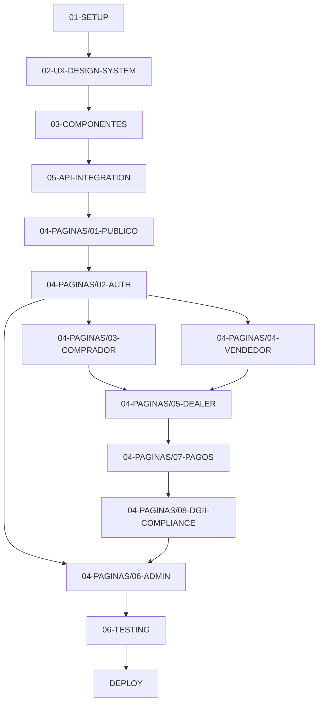

# 🤖 GUÍA DE EJECUCIÓN PARA MODELOS DE IA

> **LEER PRIMERO:** Este documento es el punto de entrada para cualquier modelo de IA que vaya a implementar el frontend de OKLA. Sigue las instrucciones en orden estricto.

---

## 📋 RESUMEN EJECUTIVO

**Proyecto:** Frontend para marketplace de vehículos OKLA (República Dominicana)  
**Stack:** Next.js 14 + TypeScript + shadcn/ui + TailwindCSS  
**Tiempo estimado:** 15-29 semanas (dependiendo de recursos)  
**Total de documentos:** 179 archivos de documentación ejecutable

---

## 🚨 REGLAS OBLIGATORIAS

### ✅ ANTES de ejecutar cualquier documento:

1. **Lee el documento COMPLETO** antes de ejecutar comandos
2. **Verifica prerrequisitos** listados al inicio de cada doc
3. **Ejecuta comandos UNO A LA VEZ** - nunca en batch
4. **Valida el output** contra lo esperado antes de continuar
5. **Reporta errores** inmediatamente si algo falla

### ❌ NUNCA hagas esto:

- Ejecutar múltiples comandos sin verificar el anterior
- Saltarte documentos o pasos
- Asumir que algo funciona sin validar
- Modificar rutas o nombres sin justificación
- Ignorar la sección de troubleshooting

---

## 🗺️ ORDEN ESTRICTO DE EJECUCIÓN

### 📍 UBICACIÓN BASE

```
/docs/frontend-rebuild/
```

---

## FASE 0: PREPARACIÓN (Día 1)

### Paso 0.1: Leer documentos de contexto

```
📄 LEER (no ejecutar):
├── 00-INDICE-MAESTRO.md           → Entender estructura completa
├── 00-RESUMEN-AUDITORIA.md        → Estado actual de documentación
└── 00-MAPEO-PAGINAS-API.md        → Relación páginas ↔ APIs
```

### Paso 0.2: Verificar el backend está corriendo

```bash
# Verificar que el backend está disponible
curl https://api.okla.com.do/health

# Output esperado:
# {"status":"healthy","timestamp":"..."}
```

---

## FASE 1: SETUP INICIAL (Semana 1)

### 📁 Carpeta: `01-SETUP/`

**Ejecutar en este orden exacto:**

| Orden | Documento                        | Descripción               | Tiempo |
| ----- | -------------------------------- | ------------------------- | ------ |
| 1.1   | `01-crear-proyecto.md`           | Crear proyecto Next.js 14 | 30 min |
| 1.2   | `02-configurar-typescript.md`    | tsconfig.json estricto    | 15 min |
| 1.3   | `03-configurar-eslint.md`        | ESLint + Prettier         | 20 min |
| 1.4   | `04-instalar-shadcn.md`          | Componentes shadcn/ui     | 30 min |
| 1.5   | `05-configurar-playwright.md`    | Testing E2E               | 20 min |
| 1.6   | `06-internationalization.md`     | i18n (es-DO/en-US)        | 45 min |
| 1.7   | `07-performance-optimization.md` | Core Web Vitals           | 30 min |
| 1.8   | `08-seo-configuration.md`        | SEO, sitemap, robots      | 30 min |
| 1.9   | `09-environment-variables.md`    | Variables de entorno      | 15 min |

**⏸️ CHECKPOINT 1:**

```bash
# Verificar que todo funciona
pnpm build    # → Exit code 0
pnpm lint     # → 0 errors
pnpm test     # → 0 failures
```

**Si falla:** No continúes. Revisa troubleshooting en el documento que falló.

---

## FASE 2: SISTEMA DE DISEÑO (Semana 1-2)

### 📁 Carpeta: `02-UX-DESIGN-SYSTEM/`

**Ejecutar en este orden exacto:**

| Orden | Documento                | Descripción                    | Tiempo |
| ----- | ------------------------ | ------------------------------ | ------ |
| 2.1   | `01-principios-ux.md`    | 10 principios UX OKLA          | 20 min |
| 2.2   | `02-design-tokens.md`    | Colores, tipografía, espaciado | 45 min |
| 2.3   | `03-componentes-base.md` | Button, Card, Input, etc.      | 2 hrs  |
| 2.4   | `04-patrones-ux.md`      | Loading, errors, empty states  | 1 hr   |
| 2.5   | `05-animaciones.md`      | Framer Motion guidelines       | 1 hr   |
| 2.6   | `06-accesibilidad.md`    | WCAG 2.1 AA checklist          | 1 hr   |
| 2.7   | `07-error-handling.md`   | Error Boundaries, Sentry       | 1 hr   |
| 2.8   | `08-api-error-codes.md`  | Códigos de error por servicio  | 30 min |

**⏸️ CHECKPOINT 2:**

```bash
pnpm storybook  # → Abre en http://localhost:6006
# Verificar que todos los componentes base se renderizan
```

---

## FASE 3: COMPONENTES REUTILIZABLES (Semana 2-3)

### 📁 Carpeta: `03-COMPONENTES/`

**Ejecutar en este orden exacto:**

| Orden | Documento                  | Descripción                    | Tiempo |
| ----- | -------------------------- | ------------------------------ | ------ |
| 3.0   | `00-global-types.md`       | Tipos TypeScript centralizados | 2 hrs  |
| 3.1   | `01-layout.md`             | Navbar, Footer, MainLayout     | 3 hrs  |
| 3.2   | `02-formularios.md`        | Form components + validación   | 4 hrs  |
| 3.3   | `03-vehiculos.md`          | VehicleCard, Gallery, Filters  | 4 hrs  |
| 3.4   | `04-dealers.md`            | DealerCard, DealerProfile      | 2 hrs  |
| 3.5   | `05-usuarios.md`           | UserProfile, UserMenu          | 2 hrs  |
| 3.6   | `06-vehicle-360-viewer.md` | Visor 360° de vehículos        | 3 hrs  |

**⏸️ CHECKPOINT 3:**

```bash
pnpm test -- --coverage  # → >70% coverage en componentes
pnpm storybook           # → Todos los componentes visibles
```

---

## FASE 4: INTEGRACIÓN API (Semana 3-4)

### 📁 Carpeta: `05-API-INTEGRATION/`

**Ejecutar en este orden exacto:**

| Orden | Documento                      | Descripción                  | Tiempo |
| ----- | ------------------------------ | ---------------------------- | ------ |
| 4.1   | `01-cliente-http.md`           | Cliente Axios base           | 1 hr   |
| 4.2   | `02-autenticacion.md`          | Auth endpoints (8)           | 2 hrs  |
| 4.3   | `03-formularios.md`            | Patrones de formularios      | 2 hrs  |
| 4.4   | `04-subida-imagenes.md`        | Upload de imágenes/media     | 2 hrs  |
| 4.5   | `05-vehicle-360-api.md`        | Vehicle360 API (6 endpoints) | 1 hr   |
| 4.6   | `08-rate-limits-pagination.md` | Rate limits y paginación     | 1 hr   |
| 4.7   | `31-state-management.md`       | Zustand stores               | 3 hrs  |
| 4.8   | `32-realtime-websockets.md`    | WebSocket chat/notif         | 2 hrs  |
| 4.9   | `33-mock-data-examples.md`     | Mock data para testing       | 1 hr   |

**⏸️ CHECKPOINT 4:**

```bash
pnpm test:api  # → Todos los tests de API pasan
# Verificar que auth funciona: login → token → logout
```

---

## FASE 5: PÁGINAS PÚBLICAS (Semana 4-5)

### 📁 Carpeta: `04-PAGINAS/01-PUBLICO/`

**Ejecutar en este orden exacto:**

| Orden | Documento                 | Descripción                      | Tiempo |
| ----- | ------------------------- | -------------------------------- | ------ |
| 5.1   | `01-home.md`              | Homepage con secciones dinámicas | 4 hrs  |
| 5.2   | `02-busqueda.md`          | Búsqueda avanzada                | 4 hrs  |
| 5.3   | `03-detalle-vehiculo.md`  | Página de detalle                | 4 hrs  |
| 5.4   | `04-help-center.md`       | Centro de ayuda y FAQ            | 2 hrs  |
| 5.5   | `05-vehicle-360-page.md`  | Visor 360° página                | 2 hrs  |
| 5.6   | `06-comparador.md`        | Comparador hasta 3 vehículos     | 3 hrs  |
| 5.7   | `07-filtros-avanzados.md` | Filtros avanzados                | 2 hrs  |
| 5.8   | `08-search-completo.md`   | Búsqueda completa                | 2 hrs  |
| 5.9   | `09-vehicle-browse.md`    | Navegación por categoría         | 2 hrs  |
| 5.10  | `10-static-pages.md`      | About, Terms, Privacy, Contact   | 2 hrs  |

**⏸️ CHECKPOINT 5:**

```bash
pnpm test:e2e -- --grep "public"  # → Todos los tests E2E pasan
# Navegar manualmente: Home → Buscar → Detalle → Comparar
```

---

## FASE 6: AUTENTICACIÓN (Semana 5-6)

### 📁 Carpeta: `04-PAGINAS/02-AUTH/`

**Ejecutar en este orden exacto:**

| Orden | Documento                     | Descripción                     | Tiempo |
| ----- | ----------------------------- | ------------------------------- | ------ |
| 6.1   | `01-auth-login-register.md`   | Login y registro combinado      | 4 hrs  |
| 6.2   | `02-verification-flows.md`    | Verificación email/phone        | 3 hrs  |
| 6.3   | `03-oauth-management.md`      | Cuentas OAuth (Google, etc.)    | 2 hrs  |
| 6.4   | `04-kyc-verificacion.md`      | Verificación de identidad       | 4 hrs  |
| 6.5   | `05-privacy-gdpr.md`          | Privacidad y GDPR               | 2 hrs  |
| 6.6   | `06-user-security-privacy.md` | Seguridad de usuario            | 2 hrs  |
| 6.7   | `07-auth-flow-diagrams.md`    | Diagramas de flujo (referencia) | 30 min |

**⏸️ CHECKPOINT 6:**

```bash
pnpm test:e2e -- --grep "auth"  # → 7/7 tests pasan
# Flujo completo: Register → Verify Email → Login → Logout
```

---

## FASE 7: PORTAL DEL COMPRADOR (Semana 6-8)

### 📁 Carpeta: `04-PAGINAS/03-COMPRADOR/`

**Ejecutar en este orden exacto:**

| Orden | Documento                   | Descripción                   | Tiempo |
| ----- | --------------------------- | ----------------------------- | ------ |
| 7.1   | `01-perfil.md`              | Perfil del comprador          | 3 hrs  |
| 7.2   | `02-alertas-busquedas.md`   | Alertas y búsquedas guardadas | 3 hrs  |
| 7.3   | `03-notificaciones.md`      | Centro de notificaciones      | 2 hrs  |
| 7.4   | `04-recomendaciones.md`     | Recomendaciones IA            | 3 hrs  |
| 7.5   | `05-inquiries-messaging.md` | Consultas y mensajería        | 4 hrs  |
| 7.6   | `06-reviews-reputacion.md`  | Reviews y reputación          | 3 hrs  |
| 7.7   | `07-chatbot.md`             | Chatbot de ayuda              | 4 hrs  |
| 7.8   | `08-favorites-compare.md`   | Favoritos y comparador        | 2 hrs  |
| 7.9   | `09-user-dashboard.md`      | Dashboard del usuario         | 4 hrs  |
| 7.10  | `10-user-messages.md`       | Mensajes del usuario          | 3 hrs  |
| 7.11  | `12-inquiries-messages.md`  | Sistema de consultas          | 2 hrs  |
| 7.12  | `13-security-settings.md`   | Configuración de seguridad    | 2 hrs  |
| 7.13  | `14-vehicle-extras.md`      | Extras de vehículos           | 1 hr   |
| 7.14  | `15-wishlist-favorites.md`  | Lista de deseos               | 2 hrs  |

**⏸️ CHECKPOINT 7:**

```bash
pnpm test:e2e -- --grep "buyer"  # → Todos los tests del comprador pasan
```

---

## FASE 8: PORTAL DEL VENDEDOR (Semana 8-9)

### 📁 Carpeta: `04-PAGINAS/04-VENDEDOR/`

| Orden | Documento                 | Descripción               | Tiempo |
| ----- | ------------------------- | ------------------------- | ------ |
| 8.1   | `01-publicar-vehiculo.md` | Formulario de publicación | 6 hrs  |
| 8.2   | `02-seller-dashboard.md`  | Dashboard del vendedor    | 4 hrs  |
| 8.3   | `03-seller-profiles.md`   | Perfiles de vendedor      | 2 hrs  |
| 8.4   | `04-sell-your-car.md`     | Landing "Vende tu carro"  | 2 hrs  |
| 8.5   | `05-media-multimedia.md`  | Subida fotos/videos/360°  | 4 hrs  |

**⏸️ CHECKPOINT 8:**

```bash
pnpm test:e2e -- --grep "seller"  # → Tests de vendedor pasan
# Flujo completo: Publicar vehículo → Subir fotos → Ver en búsqueda
```

---

## FASE 9: PORTAL DEL DEALER (Semana 9-12)

### 📁 Carpeta: `04-PAGINAS/05-DEALER/`

**Esta es la fase más extensa. Ejecutar en orden:**

| Orden | Documento                          | Descripción             | Tiempo |
| ----- | ---------------------------------- | ----------------------- | ------ |
| 9.1   | `05-dealer-onboarding.md`          | Proceso de registro     | 4 hrs  |
| 9.2   | `21-dealer-landing-pricing.md`     | Landing y precios       | 2 hrs  |
| 9.3   | `01-dealer-dashboard.md`           | Dashboard principal     | 6 hrs  |
| 9.4   | `02-dealer-inventario.md`          | Gestión de inventario   | 6 hrs  |
| 9.5   | `17-dealer-vehicles-crud.md`       | CRUD de vehículos       | 4 hrs  |
| 9.6   | `23-csv-import.md`                 | Importación CSV         | 4 hrs  |
| 9.7   | `03-dealer-crm.md`                 | CRM de leads            | 6 hrs  |
| 9.8   | `25-lead-funnel.md`                | Funnel de leads         | 3 hrs  |
| 9.9   | `04-dealer-analytics.md`           | Analytics y reportes    | 4 hrs  |
| 9.10  | `16-inventory-analytics.md`        | Analytics de inventario | 3 hrs  |
| 9.11  | `06-dealer-appointments.md`        | Gestión de citas        | 3 hrs  |
| 9.12  | `18-test-drives.md`                | Test drives             | 2 hrs  |
| 9.13  | `11-dealer-employees-locations.md` | Empleados y ubicaciones | 3 hrs  |
| 9.14  | `12-dealer-employees.md`           | Gestión de empleados    | 2 hrs  |
| 9.15  | `15-dealer-locations.md`           | Sucursales              | 2 hrs  |
| 9.16  | `07-badges-display.md`             | Sistema de badges       | 2 hrs  |
| 9.17  | `08-boost-promociones.md`          | Promoción de listings   | 3 hrs  |
| 9.18  | `09-pricing-intelligence.md`       | IA de pricing           | 4 hrs  |
| 9.19  | `24-market-benchmarks.md`          | Benchmarks de mercado   | 2 hrs  |
| 9.20  | `10-dealer-sales-market.md`        | Ventas y mercado        | 2 hrs  |
| 9.21  | `19-dealer-sales-reports.md`       | Reportes de ventas      | 3 hrs  |
| 9.22  | `13-dealer-alerts-reports.md`      | Alertas y reportes      | 2 hrs  |
| 9.23  | `14-dealer-documents.md`           | Documentos del dealer   | 2 hrs  |
| 9.24  | `22-dealer-profile-editor.md`      | Editor de perfil        | 2 hrs  |
| 9.25  | `20-financiamiento-tradein.md`     | Financiamiento/trade-in | 4 hrs  |

**⏸️ CHECKPOINT 9:**

```bash
pnpm test:e2e -- --grep "dealer"  # → Todos los tests del dealer pasan
```

---

## FASE 10: PAGOS Y BILLING (Semana 12-13)

### 📁 Carpeta: `04-PAGINAS/07-PAGOS/`

| Orden | Documento                    | Descripción           | Tiempo |
| ----- | ---------------------------- | --------------------- | ------ |
| 10.1  | `01-pagos-checkout.md`       | Flujo de checkout     | 4 hrs  |
| 10.2  | `02-payment-results.md`      | Resultados de pago    | 2 hrs  |
| 10.3  | `03-billing-dashboard.md`    | Dashboard facturación | 3 hrs  |
| 10.4  | `04-moneda-extranjera.md`    | Multi-moneda USD/DOP  | 2 hrs  |
| 10.5  | `05-comercio-electronico.md` | E-commerce            | 2 hrs  |

**⏸️ CHECKPOINT 10:**

```bash
pnpm test:e2e -- --grep "payment"  # → Tests de pago pasan
# Flujo: Seleccionar plan → Checkout → Confirmar pago
```

---

## FASE 11: COMPLIANCE DGII (Semana 13-14)

### 📁 Carpeta: `04-PAGINAS/08-DGII-COMPLIANCE/`

| Orden | Documento                             | Descripción           | Tiempo |
| ----- | ------------------------------------- | --------------------- | ------ |
| 11.1  | `01-facturacion-dgii.md`              | NCF y facturación     | 4 hrs  |
| 11.2  | `02-auditoria-compliance-legal.md`    | Auditoría legal       | 3 hrs  |
| 11.3  | `03-obligaciones-fiscales.md`         | Obligaciones fiscales | 2 hrs  |
| 11.4  | `04-registro-gastos.md`               | Registro de gastos    | 2 hrs  |
| 11.5  | `05-automatizacion-reportes.md`       | Automatización DGII   | 3 hrs  |
| 11.6  | `06-preparacion-auditoria.md`         | Preparación auditoría | 2 hrs  |
| 11.7  | `07-consentimiento-comunicaciones.md` | Ley 172-13 RD         | 2 hrs  |
| 11.8  | `08-legal-common-pages.md`            | Páginas legales       | 2 hrs  |

---

## FASE 12: PANEL ADMIN (Semana 14-18)

### 📁 Carpeta: `04-PAGINAS/06-ADMIN/`

**Esta es la segunda fase más extensa:**

| Orden | Documento                       | Descripción              | Tiempo |
| ----- | ------------------------------- | ------------------------ | ------ |
| 12.1  | `01-admin-dashboard.md`         | Dashboard administrativo | 6 hrs  |
| 12.2  | `02-admin-users.md`             | Gestión de usuarios      | 4 hrs  |
| 12.3  | `13-users-roles-management.md`  | Gestión de roles         | 3 hrs  |
| 12.4  | `20-admin-rbac.md`              | RBAC                     | 4 hrs  |
| 12.5  | `03-admin-moderation.md`        | Moderación contenido     | 4 hrs  |
| 12.6  | `08-admin-review-moderation.md` | Moderación reviews       | 2 hrs  |
| 12.7  | `15-listings-approvals.md`      | Aprobación listings      | 3 hrs  |
| 12.8  | `04-admin-compliance.md`        | Compliance               | 3 hrs  |
| 12.9  | `09-admin-compliance-alerts.md` | Alertas compliance       | 2 hrs  |
| 12.10 | `14-admin-aml-watchlist.md`     | AML y watchlist          | 3 hrs  |
| 12.11 | `17-reports-kyc-queue.md`       | Cola de KYC              | 2 hrs  |
| 12.12 | `05-admin-support.md`           | Tickets de soporte       | 3 hrs  |
| 12.13 | `06-admin-system.md`            | Configuración sistema    | 4 hrs  |
| 12.14 | `18-admin-settings.md`          | Settings admin           | 2 hrs  |
| 12.15 | `07-notificaciones-admin.md`    | Notificaciones           | 2 hrs  |
| 12.16 | `11-admin-operations.md`        | Operaciones              | 3 hrs  |
| 12.17 | `12-admin-reports-listings.md`  | Reportes listings        | 2 hrs  |
| 12.18 | `16-admin-categories.md`        | Categorías               | 2 hrs  |
| 12.19 | `10-admin-ml-ai.md`             | Machine Learning         | 4 hrs  |
| 12.20 | `19-ml-admin-dashboards.md`     | Dashboards ML            | 3 hrs  |

**⏸️ CHECKPOINT 12:**

```bash
pnpm test:e2e -- --grep "admin"  # → Todos los tests admin pasan
```

---

## FASE 13: COMPONENTES COMUNES (En paralelo)

### 📁 Carpeta: `04-PAGINAS/09-COMPONENTES-COMUNES/`

| Orden | Documento                  | Descripción                 | Tiempo |
| ----- | -------------------------- | --------------------------- | ------ |
| 13.1  | `01-common-components.md`  | Componentes genéricos       | 3 hrs  |
| 13.2  | `02-layouts.md`            | MainLayout, DashboardLayout | 2 hrs  |
| 13.3  | `03-static-pages.md`       | About, Contact, FAQ         | 2 hrs  |
| 13.4  | `04-vehicle-media.md`      | Galería, 360°, Video        | 3 hrs  |
| 13.5  | `05-video-tour.md`         | Video tour interactivo      | 2 hrs  |
| 13.6  | `06-event-tracking-sdk.md` | SDK analytics               | 2 hrs  |

---

## FASE 14: TESTING FINAL (Semana 19-20)

### 📁 Carpeta: `06-TESTING/`

| Orden | Documento                         | Descripción           | Tiempo |
| ----- | --------------------------------- | --------------------- | ------ |
| 14.1  | `01-estrategia-testing.md`        | Estrategia de testing | 2 hrs  |
| 14.2  | `02-coverage-ci.md`               | Coverage y CI/CD      | 3 hrs  |
| 14.3  | `03-e2e-fixtures.md`              | Fixtures para E2E     | 4 hrs  |
| 14.4  | `04-ci-cd-integration.md`         | GitHub Actions        | 4 hrs  |
| 14.5  | `05-implementation-checklists.md` | Checklists finales    | 2 hrs  |

**⏸️ CHECKPOINT FINAL:**

```bash
# Verificación completa
pnpm build              # → Exit code 0
pnpm test -- --coverage # → >80% coverage
pnpm test:e2e           # → 100% tests pasan
pnpm lint               # → 0 errors
npx lighthouse https://localhost:3000 --view  # → Score >90
```

---

## FASE 15: DEPLOY PRODUCCIÓN (Semana 20+)

### 📁 Carpeta: `01-SETUP/`

| Orden | Documento                    | Descripción        | Tiempo |
| ----- | ---------------------------- | ------------------ | ------ |
| 15.1  | `10-deploy-production.md`    | Deploy Docker/K8s  | 4 hrs  |
| 15.2  | `16-deployment-checklist.md` | Checklist pre-prod | 2 hrs  |
| 15.3  | `17-changelog-template.md`   | CHANGELOG          | 1 hr   |

---

## 📊 RESUMEN DE TIEMPOS

| Fase      | Nombre           | Documentos   | Tiempo Estimado |
| --------- | ---------------- | ------------ | --------------- |
| 0         | Preparación      | 3            | 2 hrs           |
| 1         | Setup            | 9            | 4 hrs           |
| 2         | Design System    | 8            | 8 hrs           |
| 3         | Componentes      | 7            | 20 hrs          |
| 4         | API Integration  | 9            | 15 hrs          |
| 5         | Páginas Públicas | 10           | 27 hrs          |
| 6         | Auth             | 7            | 18 hrs          |
| 7         | Comprador        | 14           | 38 hrs          |
| 8         | Vendedor         | 5            | 18 hrs          |
| 9         | Dealer           | 25           | 75 hrs          |
| 10        | Pagos            | 5            | 13 hrs          |
| 11        | DGII Compliance  | 8            | 20 hrs          |
| 12        | Admin            | 20           | 62 hrs          |
| 13        | Comunes          | 6            | 14 hrs          |
| 14        | Testing          | 5            | 15 hrs          |
| 15        | Deploy           | 3            | 7 hrs           |
| **TOTAL** |                  | **144 docs** | **~356 hrs**    |

**Con 1 desarrollador (40 hrs/semana):** ~9 semanas de código puro  
**Con 2 desarrolladores en paralelo:** ~5 semanas  
**Incluyendo revisiones y bugs:** Multiplicar por 1.5x = ~15-22 semanas reales

---

## 🔗 DEPENDENCIAS ENTRE DOCUMENTOS



**Regla:** No puedes empezar una fase sin completar sus dependencias.

---

## ❓ TROUBLESHOOTING GENERAL

### Error: "Module not found"

```bash
pnpm install  # Reinstalar dependencias
```

### Error: "Type error"

```bash
pnpm tsc --noEmit  # Ver todos los errores de tipo
# Arreglar errores uno por uno
```

### Error: "Test failed"

```bash
pnpm test -- --watch  # Correr tests en modo watch
# Ver cuál test falla y por qué
```

### Error: "E2E timeout"

```bash
# Verificar que el servidor de dev está corriendo
pnpm dev  # En terminal 1
pnpm test:e2e  # En terminal 2
```

### Error: "API 401 Unauthorized"

```bash
# Verificar token de auth
# Ver 05-API-INTEGRATION/02-autenticacion.md
```

---

## 📝 NOTAS IMPORTANTES

1. **Cada documento tiene su propia sección de troubleshooting** - Consultarla primero

2. **Los checkpoints son obligatorios** - No avanzar si fallan

3. **Si algo no está claro** - Revisar `00-INDICE-MAESTRO.md`

4. **Backend debe estar corriendo** - `https://api.okla.com.do`

5. **Variables de entorno** - Configurar antes de empezar (doc 1.9)

---

## 🚀 COMENZAR

**Paso 1:** Leer este documento completo ✓  
**Paso 2:** Ejecutar `01-SETUP/01-crear-proyecto.md`  
**Paso 3:** Seguir el orden de fases estrictamente

---

> **Última actualización:** Enero 31, 2026  
> **Versión:** 1.0  
> **Autor:** Documentación generada para ejecución por modelos de IA
