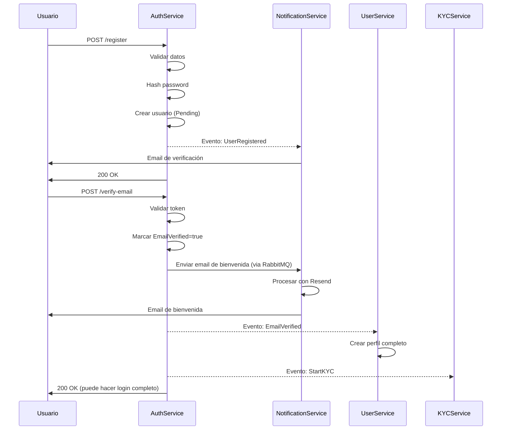
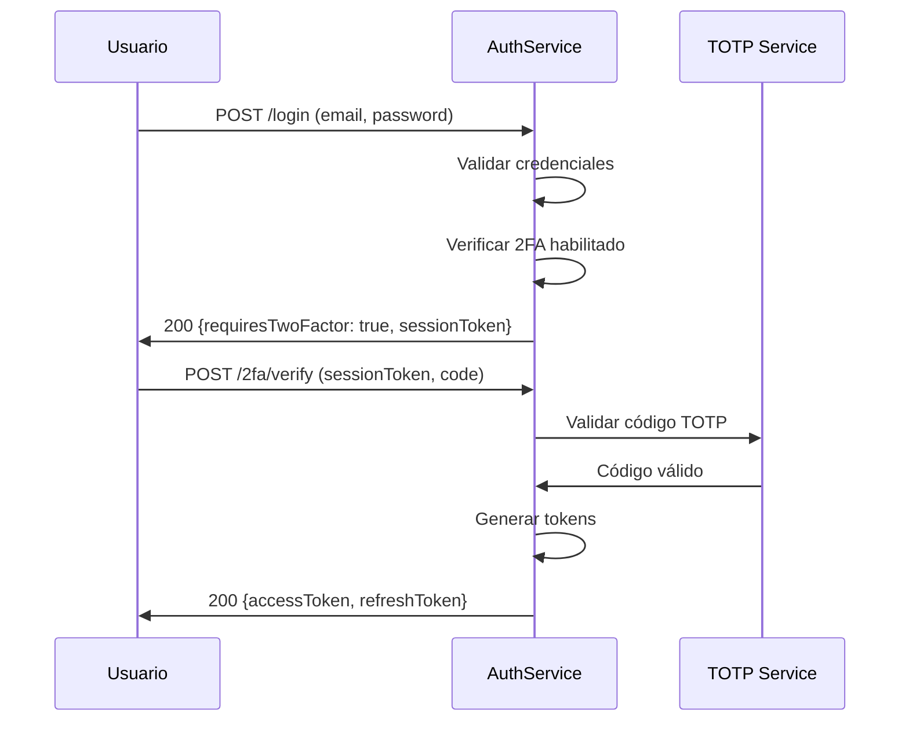

# 🔐 AuthService - Matriz de Procesos

> **Servicio:** AuthService  
> **Puerto:** 15011 (Docker), 80 (K8s)  
> **Base de Datos:** authservice (PostgreSQL)  
> **Última actualización:** Enero 25, 2026  
> **Estado:** ✅ PRODUCCIÓN - SMS 2FA + Google Authenticator + Google OAuth funcionando  
> **Estado de Implementación:** ✅ 100% Backend | ✅ 100% UI

---

## ✅ AUDITORÍA DE ACCESO UI (Enero 25, 2026)

> **Estado:** ✅ 100% COMPLETO - Todas las rutas de autenticación funcionando.

| Proceso         | Backend | UI Access | Observación                |
| --------------- | ------- | --------- | -------------------------- |
| Login           | ✅ 100% | ✅ 100%   | `/login`                   |
| Registro        | ✅ 100% | ✅ 100%   | `/register`                |
| Forgot password | ✅ 100% | ✅ 100%   | `/forgot-password`         |
| Reset password  | ✅ 100% | ✅ 100%   | `/reset-password`          |
| Email verify    | ✅ 100% | ✅ 100%   | `/verify-email`            |
| 2FA             | ✅ 100% | ✅ 100%   | `/settings/security`       |
| Google OAuth    | ✅ 100% | ✅ 100%   | Botón en `/login`          |
| Sesiones        | ✅ 100% | ✅ 100%   | `/settings/security` (tab) |

### Rutas UI Existentes ✅

- ✅ `/login` - Página de login
- ✅ `/register` - Registro de usuario
- ✅ `/forgot-password` - Recuperar contraseña
- ✅ `/reset-password` - Resetear contraseña
- ✅ `/verify-email` - Verificar email
- ✅ `/settings/security` - Configuración 2FA y sesiones
- ✅ `/settings/account` - Cambiar contraseña

**Verificación Backend:** AuthService existe en `/backend/AuthService/` ✅

---

## 📋 Estado de Procesos - AuthService

### ✅ PROCESOS PROBADOS Y FUNCIONANDO (24 procesos)

| ID             | Proceso                        | Endpoint                                      | Fecha Prueba   |
| -------------- | ------------------------------ | --------------------------------------------- | -------------- |
| AUTH-REG-001   | Registro de Usuario            | `POST /api/auth/register`                     | Enero 22, 2026 |
| AUTH-VER-001   | Verificación de Email          | `POST /api/auth/verify-email`                 | Enero 22, 2026 |
| AUTH-LOG-001   | Login (sin 2FA)                | `POST /api/auth/login`                        | Enero 22, 2026 |
| AUTH-TOK-001   | Refresh Token                  | `POST /api/auth/refresh-token`                | Enero 22, 2026 |
| AUTH-LOG-002   | Logout                         | `POST /api/auth/logout`                       | Enero 22, 2026 |
| AUTH-PWD-001   | Forgot Password                | `POST /api/auth/forgot-password`              | Enero 22, 2026 |
| AUTH-PWD-002   | Reset Password                 | `POST /api/auth/reset-password`               | Enero 22, 2026 |
| AUTH-2FA-001   | Habilitar 2FA                  | `POST /api/TwoFactor/enable`                  | Enero 22, 2026 |
| AUTH-2FA-002   | Verificar Setup 2FA            | `POST /api/TwoFactor/verify`                  | Enero 22, 2026 |
| AUTH-2FA-003   | Deshabilitar 2FA               | `POST /api/TwoFactor/disable`                 | Enero 22, 2026 |
| AUTH-2FA-004   | Generar Recovery Codes         | `POST /api/TwoFactor/generate-recovery-codes` | Enero 22, 2026 |
| AUTH-2FA-005   | Verificar Recovery Code        | `POST /api/TwoFactor/verify-recovery-code`    | Enero 22, 2026 |
| AUTH-2FA-006   | Login con 2FA SMS              | `POST /api/TwoFactor/login`                   | Enero 22, 2026 |
| AUTH-2FA-007   | Login con Authenticator (TOTP) | `POST /api/TwoFactor/login`                   | Enero 22, 2026 |
| AUTH-PHONE-001 | Enviar código SMS verificación | `POST /api/PhoneVerification/send`            | Enero 22, 2026 |
| AUTH-PHONE-002 | Verificar código SMS           | `POST /api/PhoneVerification/verify`          | Enero 22, 2026 |
| AUTH-PHONE-003 | Estado verificación teléfono   | `GET /api/PhoneVerification/status`           | Enero 22, 2026 |
| AUTH-EXT-001   | Login con Google OAuth         | `POST /api/ExternalAuth/callback`             | Enero 22, 2026 |
| AUTH-EXT-004   | Callback OAuth (Google)        | `POST /api/ExternalAuth/callback`             | Enero 22, 2026 |
| AUTH-EXT-007   | Listar Cuentas Vinculadas      | `GET /api/ExternalAuth/linked-accounts`       | Enero 22, 2026 |
| AUTH-SEC-001   | Change Password                | `POST /api/auth/security/change-password`     | Enero 22, 2026 |
| AUTH-SEC-002   | Listar Sesiones Activas        | `GET /api/auth/security/sessions`             | Enero 22, 2026 |
| AUTH-SEC-003   | Cerrar Sesión Específica       | `DELETE /api/auth/security/sessions/{id}`     | Enero 22, 2026 |
| AUTH-SEC-004   | Cerrar Todas las Sesiones      | `POST /api/auth/security/sessions/revoke-all` | Enero 22, 2026 |
| AUTH-EXT-005   | Vincular Cuenta Externa        | `POST /api/ExternalAuth/link-account`         | Enero 22, 2026 |
| AUTH-EXT-006   | Desvincular Cuenta Externa     | `DELETE /api/ExternalAuth/unlink-account`     | Enero 22, 2026 |

### ⏳ PROCESOS PENDIENTES DE PROBAR (3 procesos)

| #   | ID           | Proceso             | Endpoint                          | Prioridad | Notas                          |
| --- | ------------ | ------------------- | --------------------------------- | --------- | ------------------------------ |
| 1   | AUTH-EXT-002 | Login con Facebook  | `POST /api/ExternalAuth/callback` | 🟡 MEDIO  | Requiere config en Meta Portal |
| 2   | AUTH-EXT-003 | Login con Apple     | `POST /api/ExternalAuth/callback` | 🟡 MEDIO  | Requiere Apple Dev ($99/año)   |
| 3   | AUTH-EXT-008 | Login con Microsoft | `POST /api/ExternalAuth/callback` | 🟡 MEDIO  | Requiere config en Azure       |

### 📊 Resumen de Cobertura

```
┌─────────────────────────────────────────────────────────────────────────────┐
│                      COBERTURA DE PROCESOS AUTHSERVICE                      │
├─────────────────────────────────────────────────────────────────────────────┤
│                                                                             │
│  Total Procesos: 29          Probados: 26          Pendientes: 3            │
│                                                                             │
│  ██████████████████████████████████████████████████████░░░  90% Probados    │
│                                                                             │
│  Por Categoría:                                                             │
│  ├── Auth Básico (REG, VER, LOG, TOK, PWD)  ➜ 7/7   ████████████ 100%      │
│  ├── 2FA (SMS, TOTP, Recovery)              ➜ 7/7   ████████████ 100%      │
│  ├── Phone Verification                     ➜ 3/3   ████████████ 100%      │
│  ├── OAuth/External Auth                    ➜ 5/8   ████████░░░░  63%      │
│  └── Security (Sessions, Password)          ➜ 4/4   ████████████ 100% ✅   │
│                                                                             │
│  Prioridades Pendientes:                                                    │
│  ├── 🔴 CRÍTICO:   0 procesos                                               │
│  ├── 🟠 ALTO:      0 procesos                                               │
│  └── 🟡 MEDIO:     3 procesos (OAuth providers externos)                    │
│                                                                             │
└─────────────────────────────────────────────────────────────────────────────┘
```

### 🔗 Documentación Relacionada

| Documento                                                                                      | Descripción                       |
| ---------------------------------------------------------------------------------------------- | --------------------------------- |
| [/docs/oauth-integration/README.md](../../oauth-integration/README.md)                         | Guía completa OAuth (4 providers) |
| [/docs/oauth-integration/GOOGLE_OAUTH_SETUP.md](../../oauth-integration/GOOGLE_OAUTH_SETUP.md) | Configuración Google OAuth        |
| [/docs/oauth-integration/TROUBLESHOOTING.md](../../oauth-integration/TROUBLESHOOTING.md)       | Solución de problemas OAuth       |

---

## 1. Información General

### 1.1 Descripción

El AuthService es el servicio central de autenticación y autorización de OKLA. Gestiona registro, login, tokens JWT, verificación de email, recuperación de contraseña, autenticación externa (Google, Facebook, Apple), verificación telefónica y 2FA.

### 1.2 Estado de Integración de Emails, SMS, 2FA y OAuth ✅

| Funcionalidad             | Estado          | Proveedor | Notas                                         |
| ------------------------- | --------------- | --------- | --------------------------------------------- |
| Email de Verificación     | ✅ Funcionando  | Resend    | Enviado vía RabbitMQ → NotificationService    |
| Email de Bienvenida       | ✅ Funcionando  | Resend    | Se envía DESPUÉS de verificar email           |
| Reset de Contraseña       | ✅ Funcionando  | Resend    | Template configurado - PROBADO                |
| Códigos 2FA por Email     | ✅ Implementado | Resend    | Backup codes por email                        |
| **SMS Verificación Tel.** | ✅ Funcionando  | Twilio    | Para verificar teléfono antes de 2FA SMS      |
| **SMS Códigos 2FA**       | ✅ Funcionando  | Twilio    | **Auto-envío en login cuando 2FA SMS activo** |
| **Google Authenticator**  | ✅ Funcionando  | TOTP      | **Códigos TOTP cada 30 segundos - PROBADO**   |
| **Google OAuth**          | ✅ Funcionando  | Google    | **Login con Google probado - Enero 22, 2026** |
| Microsoft OAuth           | ⚠️ Pendiente    | Azure AD  | Código listo, falta configurar credenciales   |
| Facebook OAuth            | ⚠️ Pendiente    | Meta      | Código listo, falta configurar credenciales   |
| Apple Sign In             | ⚠️ Pendiente    | Apple     | Código listo, requiere Apple Developer ($99)  |

### 1.3 Dependencias

| Servicio            | Propósito                             | Comunicación     |
| ------------------- | ------------------------------------- | ---------------- |
| NotificationService | Enviar emails de verificación/reset   | RabbitMQ (async) |
| UserService         | Crear perfil de usuario post-registro | HTTP             |
| KYCService          | Iniciar proceso KYC                   | RabbitMQ         |
| AuditService        | Registrar eventos de seguridad        | RabbitMQ         |

### 1.4 Arquitectura

```
┌─────────────────────────────────────────────────────────────────────────────┐
│                        AuthService Architecture                              │
├─────────────────────────────────────────────────────────────────────────────┤
│                                                                              │
│   Clients                      AuthService                   External        │
│   ┌────────────┐              ┌──────────────────────────┐  ┌────────────┐  │
│   │ Web App    │──┐           │ ┌──────────────────────┐ │  │ Google     │  │
│   │ (React)    │  │           │ │    Controllers       │ │  │ OAuth      │  │
│   └────────────┘  │           │ │ - AuthController     │ │  └────────────┘  │
│   ┌────────────┐  │ HTTPS/JWT │ │ - ExternalAuth       │ │  ┌────────────┐  │
│   │ Mobile App │──┼──────────▶│ │ - TwoFactor          │ │  │ Facebook   │  │
│   │ (Flutter)  │  │           │ │ - Security           │ │  │ OAuth      │  │
│   └────────────┘  │           │ │ - PhoneVerification  │ │  └────────────┘  │
│   ┌────────────┐  │           │ └──────────┬───────────┘ │  ┌────────────┐  │
│   │ API        │──┘           │            │             │  │ Apple      │  │
│   │ Gateway    │              │ ┌──────────▼───────────┐ │  │ Sign In    │  │
│   └────────────┘              │ │   Application Layer  │ │  └────────────┘  │
│                               │ │ - CQRS + MediatR     │ │  ┌────────────┐  │
│                               │ │ - JWT Generation     │ │  │ Twilio     │  │
│                               │ │ - TOTP Validation    │ │  │ SMS        │  │
│                               │ │ - OAuth Handlers     │ │  └────────────┘  │
│                               │ └──────────┬───────────┘ │                  │
│                               │            │             │                  │
│                               │ ┌──────────▼───────────┐ │                  │
│                               │ │   Infrastructure     │ │                  │
│                               │ │ - EF Core + Identity │ │                  │
│                               │ │ - Redis Cache        │ │                  │
│                               │ │ - RabbitMQ Events    │ │                  │
│                               │ └──────────────────────┘ │                  │
│                               └──────────┬───────────────┘                  │
│                                          │                                  │
│   ┌──────────────────────────────────────┼──────────────────────────────┐   │
│   │                                      ▼                              │   │
│   │  ┌──────────────┐  ┌──────────────┐  ┌──────────────┐               │   │
│   │  │  PostgreSQL  │  │    Redis     │  │  RabbitMQ    │               │   │
│   │  │  (authdb)    │  │   (tokens)   │  │  (events)    │               │   │
│   │  │ - Users      │  │ - Sessions   │  │ - UserReg    │               │   │
│   │  │ - Tokens     │  │ - Rate Limit │  │ - PasswordRst│               │   │
│   │  │ - 2FA        │  │ - OTP Codes  │  │ - LoginEvent │               │   │
│   │  └──────────────┘  └──────────────┘  └──────────────┘               │   │
│   │                         Data Layer                                  │   │
│   └─────────────────────────────────────────────────────────────────────┘   │
│                                                                              │
└─────────────────────────────────────────────────────────────────────────────┘
```

### 1.5 Controllers

| Controller                  | Archivo                        | Endpoints |
| --------------------------- | ------------------------------ | --------- |
| AuthController              | AuthController.cs              | 7         |
| ExternalAuthController      | ExternalAuthController.cs      | 6         |
| PhoneVerificationController | PhoneVerificationController.cs | 3         |
| SecurityController          | SecurityController.cs          | 4         |
| TwoFactorController         | TwoFactorController.cs         | 5         |

---

## 2. Endpoints API

### 2.1 AuthController

| Método | Endpoint                    | Descripción                   | Auth | Rate Limit |
| ------ | --------------------------- | ----------------------------- | ---- | ---------- |
| POST   | `/api/auth/register`        | Registro de nuevo usuario     | ❌   | 5/min      |
| POST   | `/api/auth/login`           | Iniciar sesión                | ❌   | 10/min     |
| POST   | `/api/auth/forgot-password` | Solicitar reset de contraseña | ❌   | 3/min      |
| POST   | `/api/auth/reset-password`  | Resetear contraseña con token | ❌   | 5/min      |
| POST   | `/api/auth/verify-email`    | Verificar email con token     | ❌   | 10/min     |
| POST   | `/api/auth/refresh-token`   | Renovar access token          | ❌   | 30/min     |
| POST   | `/api/auth/logout`          | Cerrar sesión                 | ✅   | 10/min     |

### 2.2 ExternalAuthController ✅ GOOGLE OAUTH PROBADO

| Método | Endpoint                            | Descripción             | Auth | Estado               |
| ------ | ----------------------------------- | ----------------------- | ---- | -------------------- |
| POST   | `/api/ExternalAuth/callback`        | Callback OAuth (Google) | ❌   | ✅ PROBADO           |
| GET    | `/api/ExternalAuth/linked-accounts` | Cuentas vinculadas      | ✅   | ✅ PROBADO           |
| POST   | `/api/ExternalAuth/link`            | Vincular cuenta externa | ✅   | ⚠️ Pendiente testing |
| DELETE | `/api/ExternalAuth/unlink/{id}`     | Desvincular cuenta      | ✅   | ⚠️ Pendiente testing |
| POST   | `/api/auth/external/facebook`       | Login con Facebook      | ❌   | ⚠️ Pendiente config  |
| POST   | `/api/auth/external/apple`          | Login con Apple         | ❌   | ⚠️ Pendiente config  |

### 2.3 PhoneVerificationController

| Método | Endpoint                        | Descripción            | Auth |
| ------ | ------------------------------- | ---------------------- | ---- |
| POST   | `/api/PhoneVerification/send`   | Enviar código SMS      | ✅   |
| POST   | `/api/PhoneVerification/verify` | Verificar código       | ✅   |
| GET    | `/api/PhoneVerification/status` | Estado de verificación | ✅   |

### 2.4 SecurityController

| Método | Endpoint                                 | Descripción               | Auth |
| ------ | ---------------------------------------- | ------------------------- | ---- |
| POST   | `/api/auth/security/change-password`     | Cambiar contraseña        | ✅   |
| GET    | `/api/auth/security/sessions`            | Listar sesiones activas   | ✅   |
| DELETE | `/api/auth/security/sessions/{id}`       | Cerrar sesión específica  | ✅   |
| POST   | `/api/auth/security/sessions/revoke-all` | Cerrar todas las sesiones | ✅   |

### 2.5 TwoFactorController

| Método | Endpoint                                 | Descripción                      | Auth |
| ------ | ---------------------------------------- | -------------------------------- | ---- |
| POST   | `/api/TwoFactor/enable`                  | Habilitar 2FA                    | ✅   |
| POST   | `/api/TwoFactor/verify`                  | Verificar/Confirmar setup 2FA    | ✅   |
| POST   | `/api/TwoFactor/disable`                 | Deshabilitar 2FA                 | ✅   |
| POST   | `/api/TwoFactor/generate-recovery-codes` | Generar códigos de recuperación  | ✅   |
| POST   | `/api/TwoFactor/verify-recovery-code`    | Verificar código de recuperación | ✅\* |
| POST   | `/api/TwoFactor/login`                   | Completar login con 2FA          | ❌   |

> \*`verify-recovery-code` tiene `[AllowAnonymous]` pero requiere userId del contexto.

> **NOTA GATEWAY:** El Gateway Ocelot rutea `/api/auth/2fa/*` → `/api/TwoFactor/*` para mantener consistencia de rutas en el frontend.

---

## 3. Procesos Detallados

### AUTH-REG-001: Registro de Usuario

| Campo          | Valor               |
| -------------- | ------------------- |
| **ID**         | AUTH-REG-001        |
| **Nombre**     | Registro de Usuario |
| **Actor**      | Usuario Anónimo     |
| **Criticidad** | 🔴 CRÍTICO          |
| **Estado**     | 🟢 ACTIVO           |

#### Precondiciones

- [ ] Email no registrado previamente
- [ ] Request con datos válidos
- [ ] Rate limit no excedido (5/min por IP)

#### Request Body

```json
{
  "userName": "string (3-50 chars, alfanumérico)",
  "email": "string (email válido)",
  "password": "string (min 8 chars, 1 mayúscula, 1 número, 1 especial)"
}
```

#### Flujo Paso a Paso

| Paso | Acción                         | Servicio                       | Validación                          |
| ---- | ------------------------------ | ------------------------------ | ----------------------------------- |
| 1    | Recibir request                | AuthController                 | Schema JSON válido                  |
| 2    | Validar formato email          | Validator                      | Regex email RFC 5322                |
| 3    | Validar fortaleza password     | Validator                      | Min 8 chars, complejidad            |
| 4    | Verificar email no existe      | Repository                     | Query a DB                          |
| 5    | Verificar username no existe   | Repository                     | Query a DB                          |
| 6    | Hash de contraseña             | BCrypt                         | 12 rounds                           |
| 7    | Crear entidad User             | Handler                        | Con status Pending                  |
| 8    | Generar token verificación     | TokenService                   | JWT 24h expiración                  |
| 9    | Guardar en DB                  | Repository                     | Transacción                         |
| 10   | Publicar evento UserRegistered | RabbitMQ                       | Exchange: user.events               |
| 11   | Enviar email verificación      | RabbitMQ → NotificationService | ✅ Async via `notification-queue`   |
| 12   | Retornar respuesta             | Controller                     | 200 OK + accessToken + refreshToken |

#### Response Success (200)

```json
{
  "success": true,
  "data": {
    "userId": "833d354b-b0c7-4bc2-a25a-fa802d6e1820",
    "userName": "gregorytest",
    "email": "user@example.com",
    "accessToken": "eyJhbGciOiJIUzI1NiIsInR5cCI6IkpXVCJ9...",
    "refreshToken": "2e19c88318114129a1ea0308df54a521...",
    "expiresAt": "2026-01-22T02:15:51.885Z"
  },
  "error": null,
  "metadata": null,
  "timestamp": "2026-01-22T01:15:51.957Z"
}
```

> **Nota:** El usuario recibe tokens inmediatamente pero con `email_verified: false`. Debe verificar su email para acceso completo.

#### Postcondiciones

- [x] Usuario creado en DB con `EmailConfirmed = false`
- [x] Token de verificación guardado en tabla `VerificationTokens` (24h expiración)
- [x] Email de verificación enviado vía RabbitMQ → NotificationService → Resend
- [x] Evento `UserRegisteredEvent` publicado en RabbitMQ
- [x] Access token y refresh token retornados al usuario

#### Flujo de Email de Verificación ✅

```
┌─────────────┐     ┌──────────────┐     ┌─────────────────────┐     ┌────────┐
│ AuthService │────►│   RabbitMQ   │────►│ NotificationService │────►│ Resend │
│  (Registro) │     │ notification │     │  (Consumer)         │     │  API   │
│             │     │    -queue    │     │                     │     │        │
└─────────────┘     └──────────────┘     └─────────────────────┘     └────────┘
                                                                          │
                                                                          ▼
                                                                    ┌──────────┐
                                                                    │  Usuario │
                                                                    │  (Email) │
                                                                    └──────────┘
```

**Link enviado:** `{FrontendBaseUrl}/verify-email?token={token}`  
**Dominio configurado:** `okla.com.do`  
**From email:** `noreply@okla.com.do`

#### Errores Posibles

| Código | Error           | Causa                | Acción                   |
| ------ | --------------- | -------------------- | ------------------------ |
| 400    | INVALID_EMAIL   | Email mal formateado | Mostrar formato correcto |
| 400    | WEAK_PASSWORD   | Contraseña débil     | Mostrar requisitos       |
| 409    | EMAIL_EXISTS    | Email ya registrado  | Sugerir login            |
| 409    | USERNAME_EXISTS | Username tomado      | Sugerir alternativas     |
| 429    | RATE_LIMIT      | Muchos intentos      | Esperar 60s              |

---

### AUTH-VER-001: Verificación de Email ✅

| Campo          | Valor                     |
| -------------- | ------------------------- |
| **ID**         | AUTH-VER-001              |
| **Nombre**     | Verificación de Email     |
| **Actor**      | Usuario con link de email |
| **Criticidad** | 🔴 CRÍTICO                |
| **Estado**     | 🟢 ACTIVO - PRODUCCIÓN    |

#### Precondiciones

- [ ] Token de verificación válido (recibido por email)
- [ ] Token no expirado (24 horas)
- [ ] Token no usado previamente

#### Request Body

```json
{
  "token": "vmyactx1-yjrErRRlEN-NgSpBohYrb_HNRZP0_EtVYI"
}
```

#### Flujo Paso a Paso ✅ IMPLEMENTADO

| Paso | Acción                          | Servicio                       | Validación                   |
| ---- | ------------------------------- | ------------------------------ | ---------------------------- |
| 1    | Usuario hace clic en link email | Frontend                       | `/verify-email?token=xxx`    |
| 2    | Frontend envía POST             | API Gateway                    | Route a AuthService          |
| 3    | Buscar token en DB              | VerificationTokenRepository    | Token existe                 |
| 4    | Validar token no expirado       | Handler                        | ExpiresAt > now              |
| 5    | Validar token no usado          | Handler                        | IsUsed = false               |
| 6    | Obtener usuario por UserId      | UserRepository                 | Usuario existe               |
| 7    | Marcar token como usado         | Repository                     | IsUsed = true, UsedAt        |
| 8    | Marcar email como verificado    | Repository                     | EmailConfirmed = true        |
| 9    | **Enviar email de bienvenida**  | RabbitMQ → NotificationService | ✅ Solo DESPUÉS de verificar |
| 10   | Retornar éxito                  | Controller                     | 200 OK                       |

#### Response Success (200)

```json
{
  "success": true,
  "data": null,
  "error": null,
  "timestamp": "2026-01-22T01:20:00.000Z"
}
```

#### Postcondiciones

- [x] `EmailConfirmed = true` en tabla `Users`
- [x] Token marcado como usado en `VerificationTokens`
- [x] Email de bienvenida enviado (template: `welcome`)
- [x] Usuario puede ahora hacer login con acceso completo

#### Flujo Correcto de Emails ✅

```
1. REGISTRO
   └── Envía: Email de VERIFICACIÓN (con link)
       Template: email_verification
       Subject: "Verifica tu email para activar tu cuenta OKLA"

2. VERIFICACIÓN (cuando usuario hace clic en link)
   └── Envía: Email de BIENVENIDA
       Template: welcome
       Subject: "¡Bienvenido a OKLA!"
```

> ⚠️ **IMPORTANTE:** El email de bienvenida se envía SOLO después de verificar el email, NO en el registro.

#### Errores Posibles

| Código | Error              | Causa               | Acción                 |
| ------ | ------------------ | ------------------- | ---------------------- |
| 400    | INVALID_TOKEN      | Token malformado    | Solicitar reenvío      |
| 400    | TOKEN_EXPIRED      | Token expiró (>24h) | Solicitar reenvío      |
| 400    | TOKEN_ALREADY_USED | Token ya fue usado  | Intentar login         |
| 404    | USER_NOT_FOUND     | Usuario no existe   | Registrarse nuevamente |

---

### AUTH-LOG-001: Inicio de Sesión (Login)

| Campo          | Valor              |
| -------------- | ------------------ |
| **ID**         | AUTH-LOG-001       |
| **Nombre**     | Inicio de Sesión   |
| **Actor**      | Usuario Registrado |
| **Criticidad** | 🔴 CRÍTICO         |
| **Estado**     | 🟢 ACTIVO          |

#### Precondiciones

- [ ] Usuario existe en sistema
- [ ] Email verificado
- [ ] Cuenta no bloqueada
- [ ] Rate limit no excedido (10/min)

#### Request Body

```json
{
  "email": "user@example.com",
  "password": "SecurePass123!"
}
```

#### Flujo Paso a Paso

| Paso | Acción                             | Servicio        | Validación           |
| ---- | ---------------------------------- | --------------- | -------------------- |
| 1    | Recibir request                    | AuthController  | Schema válido        |
| 2    | Buscar usuario por email           | Repository      | Query                |
| 3    | Verificar usuario existe           | Handler         | Si no: 401           |
| 4    | Verificar cuenta activa            | Handler         | Status = Active      |
| 5    | Verificar email verificado         | Handler         | EmailVerified = true |
| 6    | Verificar intentos fallidos        | SecurityService | Max 5 intentos       |
| 7    | Comparar hash contraseña           | BCrypt          | Verify hash          |
| 8    | Si falla: incrementar intentos     | Repository      | +1 FailedAttempts    |
| 9    | Si exitoso: resetear intentos      | Repository      | FailedAttempts = 0   |
| 10   | Verificar si 2FA habilitado        | Handler         | TwoFactorEnabled?    |
| 11a  | Si 2FA: retornar RequiresTwoFactor | Controller      | Con session token    |
| 11b  | Si no 2FA: generar tokens          | TokenService    | Access + Refresh     |
| 12   | Crear registro de sesión           | Repository      | IP, UserAgent, etc   |
| 13   | Publicar evento UserLoggedIn       | RabbitMQ        | Para analytics       |
| 14   | Retornar tokens                    | Controller      | 200 OK               |

#### Response Success (200) - Sin 2FA

```json
{
  "success": true,
  "data": {
    "accessToken": "eyJhbGc...",
    "refreshToken": "eyJhbGc...",
    "expiresIn": 3600,
    "tokenType": "Bearer",
    "user": {
      "id": "uuid",
      "email": "user@example.com",
      "userName": "johndoe",
      "roles": ["Buyer", "Seller"]
    }
  }
}
```

#### Response Requires 2FA (200)

```json
{
  "success": true,
  "data": {
    "requiresTwoFactor": true,
    "sessionToken": "temp-session-token",
    "message": "Por favor ingresa el código de tu autenticador"
  }
}
```

#### Postcondiciones

- [x] Tokens JWT generados (si no 2FA)
- [x] Sesión registrada en DB
- [x] Intentos fallidos reseteados
- [x] Evento de login registrado

#### Errores Posibles

| Código | Error               | Causa                     | Acción                 |
| ------ | ------------------- | ------------------------- | ---------------------- |
| 401    | INVALID_CREDENTIALS | Email/password incorrecto | Genérico por seguridad |
| 401    | EMAIL_NOT_VERIFIED  | Email sin verificar       | Reenviar email         |
| 403    | ACCOUNT_LOCKED      | 5+ intentos fallidos      | Esperar 30 min         |
| 403    | ACCOUNT_DISABLED    | Cuenta desactivada        | Contactar soporte      |
| 429    | RATE_LIMIT          | Muchos intentos           | Esperar 60s            |

---

### AUTH-TOK-001: Refresh Token

| Campo          | Valor                |
| -------------- | -------------------- |
| **ID**         | AUTH-TOK-001         |
| **Nombre**     | Renovar Access Token |
| **Actor**      | Usuario Autenticado  |
| **Criticidad** | 🔴 CRÍTICO           |
| **Estado**     | 🟢 ACTIVO            |

#### Precondiciones

- [ ] Refresh token válido
- [ ] Refresh token no expirado
- [ ] Refresh token no revocado

#### Request Body

```json
{
  "refreshToken": "eyJhbGc..."
}
```

#### Flujo Paso a Paso

| Paso | Acción                       | Servicio     | Validación        |
| ---- | ---------------------------- | ------------ | ----------------- |
| 1    | Recibir refresh token        | Controller   | No vacío          |
| 2    | Decodificar token            | TokenService | JWT válido        |
| 3    | Verificar firma              | TokenService | Signature match   |
| 4    | Verificar expiración         | TokenService | exp > now         |
| 5    | Buscar token en DB           | Repository   | Exists and active |
| 6    | Verificar no revocado        | Repository   | IsRevoked = false |
| 7    | Obtener usuario              | Repository   | UserId del token  |
| 8    | Verificar usuario activo     | Handler      | Status = Active   |
| 9    | Revocar refresh token actual | Repository   | IsRevoked = true  |
| 10   | Generar nuevo access token   | TokenService | 1h expiración     |
| 11   | Generar nuevo refresh token  | TokenService | 7d expiración     |
| 12   | Guardar nuevo refresh token  | Repository   | INSERT            |
| 13   | Retornar tokens              | Controller   | 200 OK            |

#### Response Success (200)

```json
{
  "success": true,
  "data": {
    "accessToken": "eyJhbGc...(nuevo)",
    "refreshToken": "eyJhbGc...(nuevo)",
    "expiresIn": 3600
  }
}
```

#### Postcondiciones

- [x] Access token antiguo invalidado (por expiración)
- [x] Refresh token antiguo revocado
- [x] Nuevos tokens generados y almacenados

#### Errores Posibles

| Código | Error            | Causa               | Acción             |
| ------ | ---------------- | ------------------- | ------------------ |
| 401    | INVALID_TOKEN    | Token malformado    | Re-login requerido |
| 401    | TOKEN_EXPIRED    | Token expirado      | Re-login requerido |
| 401    | TOKEN_REVOKED    | Token revocado      | Re-login requerido |
| 403    | ACCOUNT_DISABLED | Usuario desactivado | Contactar soporte  |

---

### AUTH-LOG-002: Logout (Cerrar Sesión) ✅

| Campo          | Valor                             |
| -------------- | --------------------------------- |
| **ID**         | AUTH-LOG-002                      |
| **Nombre**     | Cerrar Sesión                     |
| **Actor**      | Usuario Autenticado               |
| **Criticidad** | 🟠 ALTO                           |
| **Estado**     | 🟢 ACTIVO - PROBADO EN PRODUCCIÓN |

#### Precondiciones

- [ ] Usuario autenticado con access token válido
- [ ] Refresh token válido en localStorage/storage

#### Request

```
POST /api/auth/logout
Authorization: Bearer {accessToken}
Content-Type: application/json
```

#### Request Body

```json
{
  "refreshToken": "8182d88ee00a40829c9105df4fceb4fdbb05a38719514b1899d35c097ffa8b82"
}
```

#### Flujo Paso a Paso

| Paso | Acción                           | Servicio       | Validación                 |
| ---- | -------------------------------- | -------------- | -------------------------- |
| 1    | Recibir request con Bearer token | AuthController | Header Authorization       |
| 2    | Validar access token             | JwtMiddleware  | Token válido y no expirado |
| 3    | Extraer UserId del token         | Handler        | Claim nameidentifier       |
| 4    | Recibir refresh token del body   | Handler        | No vacío                   |
| 5    | Buscar refresh token en DB       | Repository     | Token existe               |
| 6    | Verificar que pertenece al user  | Handler        | UserId match               |
| 7    | Marcar token como revocado       | Repository     | RevokedAt = now            |
| 8    | Guardar razón de revocación      | Repository     | RevokedReason = "user"     |
| 9    | Retornar éxito                   | Controller     | 200 OK                     |

#### Response Success (200)

```json
{
  "success": true,
  "error": null,
  "metadata": null,
  "timestamp": "2026-01-22T03:42:05.4573063Z"
}
```

#### Postcondiciones

- [x] Refresh token marcado como revocado en tabla `RefreshTokens`
- [x] `RevokedAt` = timestamp actual
- [x] `RevokedReason` = "user" (logout manual)
- [x] Access token sigue válido hasta expirar (JWT es stateless)
- [x] Frontend debe limpiar localStorage (accessToken, refreshToken, userId)

#### Flujo en Frontend (authService.ts) ✅

```typescript
async logout(): Promise<void> {
  try {
    const refreshToken = localStorage.getItem('refreshToken');
    const accessToken = localStorage.getItem('accessToken');

    if (refreshToken && accessToken) {
      await axios.post(
        `${AUTH_API_URL}/logout`,
        { refreshToken },
        {
          headers: {
            Authorization: `Bearer ${accessToken}`,
          },
        }
      );
    }
  } catch (error) {
    console.error('Error during logout:', error);
  } finally {
    // Clear tokens regardless of API call success
    localStorage.removeItem('accessToken');
    localStorage.removeItem('refreshToken');
    localStorage.removeItem('userId');
    localStorage.removeItem('rememberMe');
  }
}
```

#### Diagrama de Flujo

```
┌─────────────┐     ┌──────────────┐     ┌─────────────────┐     ┌────────────┐
│   Frontend  │────►│   Gateway    │────►│   AuthService   │────►│ PostgreSQL │
│   (React)   │     │   (Ocelot)   │     │   (Controller)  │     │  (DB)      │
│             │     │              │     │                 │     │            │
│ POST /logout│     │ Route to     │     │ Validate token  │     │ UPDATE     │
│ + Bearer    │     │ authservice  │     │ Revoke refresh  │     │ RevokedAt  │
│ + body      │     │              │     │                 │     │            │
└─────────────┘     └──────────────┘     └─────────────────┘     └────────────┘
      │                                                                 │
      │◄────────────────── 200 OK ──────────────────────────────────────┤
      │
      ▼
┌─────────────┐
│ localStorage│
│ .clear()    │
└─────────────┘
```

#### Errores Posibles

| Código | Error           | Causa                          | Acción                    |
| ------ | --------------- | ------------------------------ | ------------------------- |
| 401    | UNAUTHORIZED    | Sin header Authorization       | Limpiar tokens localmente |
| 401    | INVALID_TOKEN   | Access token inválido/expirado | Limpiar tokens localmente |
| 400    | INVALID_REQUEST | Refresh token vacío o faltante | Limpiar tokens localmente |

#### Notas de Seguridad

- ⚠️ El endpoint requiere autenticación (`[Authorize]`) para prevenir abuse
- ⚠️ Solo el usuario dueño del refresh token puede revocarlo
- ⚠️ El frontend SIEMPRE limpia localStorage aunque la API falle
- ⚠️ El access token JWT sigue válido hasta expirar (1 hora) - es stateless

#### Tests Realizados ✅

| Test | Escenario                    | Resultado | Respuesta                   |
| ---- | ---------------------------- | --------- | --------------------------- |
| 1    | Logout con token válido      | ✅ PASS   | 200 OK, success: true       |
| 2    | Refresh token revocado en DB | ✅ PASS   | RevokedReason: 'user'       |
| 3    | Logout sin Authorization     | ✅ PASS   | 401 Unauthorized            |
| 4    | Logout con token inválido    | ✅ PASS   | 401 Unauthorized            |
| 5    | Verificación en PostgreSQL   | ✅ PASS   | Token marcado como revocado |

---

### AUTH-PWD-001: Recuperación de Contraseña ✅ PROBADO

| Campo          | Valor                             |
| -------------- | --------------------------------- |
| **ID**         | AUTH-PWD-001                      |
| **Nombre**     | Forgot Password                   |
| **Actor**      | Usuario Registrado                |
| **Criticidad** | 🔴 CRÍTICO                        |
| **Estado**     | 🟢 ACTIVO - PROBADO EN PRODUCCIÓN |

#### Precondiciones

- [ ] Email registrado en sistema
- [ ] Rate limit no excedido (3/min)

#### Request Body

```json
{
  "email": "user@example.com"
}
```

#### Flujo Paso a Paso

| Paso | Acción                        | Servicio            | Validación           |
| ---- | ----------------------------- | ------------------- | -------------------- |
| 1    | Recibir email                 | Controller          | Formato válido       |
| 2    | Buscar usuario                | Repository          | Por email            |
| 3    | Si no existe: retornar OK     | Controller          | Prevenir enumeración |
| 4    | Verificar solicitudes previas | Repository          | Max 3 en 1 hora      |
| 5    | Generar token reset           | TokenService        | 1 hora expiración    |
| 6    | Guardar token en DB           | Repository          | Con hash             |
| 7    | Enviar email con link         | NotificationService | Template reset       |
| 8    | Registrar intento             | AuditService        | Para seguridad       |
| 9    | Retornar mensaje genérico     | Controller          | 200 OK               |

#### Response Success (200)

```json
{
  "success": true,
  "data": {
    "message": "Si el email existe, recibirás instrucciones para recuperar tu contraseña."
  }
}
```

#### Notas de Seguridad

- ⚠️ SIEMPRE retornar mismo mensaje para prevenir enumeración de emails
- ⚠️ Token debe tener hash en DB, no texto plano
- ⚠️ Link debe ser single-use

---

### AUTH-PWD-002: Reset de Contraseña ✅ PROBADO

| Campo          | Valor                             |
| -------------- | --------------------------------- |
| **ID**         | AUTH-PWD-002                      |
| **Nombre**     | Reset Password                    |
| **Actor**      | Usuario con Token                 |
| **Criticidad** | 🔴 CRÍTICO                        |
| **Estado**     | 🟢 ACTIVO - PROBADO EN PRODUCCIÓN |

#### Request Body

```json
{
  "token": "reset-token-from-email",
  "newPassword": "NewSecurePass123!",
  "confirmPassword": "NewSecurePass123!"
}
```

#### Flujo Paso a Paso

| Paso | Acción                           | Servicio            | Validación             |
| ---- | -------------------------------- | ------------------- | ---------------------- |
| 1    | Recibir datos                    | Controller          | Schema válido          |
| 2    | Validar passwords coinciden      | Validator           | newPassword == confirm |
| 3    | Validar fortaleza password       | Validator           | Complejidad            |
| 4    | Hash del token recibido          | Handler             | SHA256                 |
| 5    | Buscar token en DB               | Repository          | Por hash               |
| 6    | Verificar token válido           | Handler             | Existe y no usado      |
| 7    | Verificar no expirado            | Handler             | ExpiresAt > now        |
| 8    | Hash nueva contraseña            | BCrypt              | 12 rounds              |
| 9    | Actualizar contraseña            | Repository          | UPDATE                 |
| 10   | Marcar token como usado          | Repository          | IsUsed = true          |
| 11   | Revocar todos los refresh tokens | Repository          | Seguridad              |
| 12   | Enviar confirmación email        | NotificationService | Alerta seguridad       |
| 13   | Publicar evento                  | RabbitMQ            | PasswordChanged        |
| 14   | Retornar éxito                   | Controller          | 200 OK                 |

#### Postcondiciones

- [x] Contraseña actualizada
- [x] Todas las sesiones cerradas
- [x] Token de reset invalidado
- [x] Email de confirmación enviado

---

### AUTH-2FA-001: Habilitar Two-Factor Authentication

| Campo          | Valor               |
| -------------- | ------------------- |
| **ID**         | AUTH-2FA-001        |
| **Nombre**     | Habilitar 2FA       |
| **Actor**      | Usuario Autenticado |
| **Criticidad** | 🟠 ALTO             |
| **Estado**     | 🟢 ACTIVO           |

#### Tipos de 2FA Soportados

| Tipo          | Valor | Requisitos                | Genera QR |
| ------------- | ----- | ------------------------- | --------- |
| Authenticator | 1     | Ninguno adicional         | ✅ Sí     |
| SMS           | 2     | Teléfono verificado ⚠️    | ❌ No     |
| Email         | 3     | Email verificado (ya req) | ❌ No     |

#### Precondiciones

- [ ] Usuario autenticado
- [ ] 2FA no habilitado actualmente
- [ ] Email verificado
- [ ] **Para SMS:** Teléfono registrado Y verificado (`PhoneNumberConfirmed = true`)

#### Request Body

```json
{
  "type": 1
}
```

> **Tipos:** 1 = Authenticator (recomendado), 2 = SMS, 3 = Email

#### Flujo Paso a Paso

| Paso | Acción                          | Servicio    | Validación                  |
| ---- | ------------------------------- | ----------- | --------------------------- |
| 1    | Verificar 2FA no activo         | Handler     | TwoFactorEnabled = false    |
| 2    | **Validar requisitos por tipo** | Handler     | Ver tabla arriba            |
| 2a   | Si SMS: verificar teléfono      | Handler     | PhoneNumber != null         |
| 2b   | Si SMS: verificar confirmado    | Handler     | PhoneNumberConfirmed = true |
| 2c   | Si Email: verificar email       | Handler     | EmailConfirmed = true       |
| 3    | Generar secret según tipo       | TotpService | Base32 secret / código      |
| 4    | Generar QR code (solo Auth)     | TotpService | otpauth:// format           |
| 5    | Generar códigos respaldo        | Handler     | 10 códigos únicos           |
| 6    | Hash códigos respaldo           | BCrypt      | Para almacenar              |
| 7    | Guardar TwoFactorAuth en DB     | Repository  | INSERT                      |
| 8    | Enviar códigos respaldo email   | RabbitMQ    | NotificationService         |
| 9    | Retornar QR y códigos           | Controller  | 200 OK                      |

#### Response Success (200) - Authenticator

```json
{
  "success": true,
  "data": {
    "secret": "DJRBA3JWOU7D5RG75MLR2MFZWBG3B4GD",
    "qrCodeUri": "iVBORw0KGgoAAAANSUhEUgAABMQ...",
    "recoveryCodes": [
      "7K0RZXVT",
      "OF1U308W",
      "SU0JHRC2",
      "YMIKP79I",
      "FNSFFAB2",
      "8B0WVST9",
      "3082F4SO",
      "ED35IUH4",
      "O8AE1K49",
      "F6N83SIM"
    ],
    "message": "Two-factor authentication setup completed successfully. Please verify your authenticator app."
  }
}
```

#### Errores Posibles

| Código | Error               | Causa                          | Acción                     |
| ------ | ------------------- | ------------------------------ | -------------------------- |
| 401    | UNAUTHORIZED        | Token inválido                 | Re-login                   |
| 400    | 2FA_ALREADY_ENABLED | 2FA ya está activo             | Deshabilitar primero       |
| 400    | PHONE_REQUIRED      | SMS sin teléfono registrado    | Agregar teléfono primero   |
| 400    | PHONE_NOT_VERIFIED  | SMS con teléfono no confirmado | Verificar teléfono primero |
| 400    | EMAIL_NOT_VERIFIED  | Email sin verificar            | Verificar email primero    |
| 400    | INVALID_2FA_TYPE    | Tipo no válido (no 1, 2, 3)    | Usar tipo válido           |

````

#### Siguiente Paso

Usuario debe llamar a `/api/auth/2fa/verify` con código del autenticador para confirmar activación.

---

### AUTH-2FA-002: Verificar/Confirmar Setup 2FA

| Campo          | Valor               |
| -------------- | ------------------- |
| **ID**         | AUTH-2FA-002        |
| **Nombre**     | Verificar Setup 2FA |
| **Actor**      | Usuario Autenticado |
| **Criticidad** | 🟠 ALTO             |
| **Estado**     | 🟢 ACTIVO           |

#### Precondiciones

- [ ] Usuario autenticado
- [ ] 2FA habilitado recientemente (paso AUTH-2FA-001 completado)
- [ ] Código TOTP válido del autenticador

#### Request Body

```json
{
  "code": "123456",
  "type": 1
}
````

> **Tipos:** 1 = Authenticator, 2 = SMS, 3 = Email

#### Flujo Paso a Paso

| Paso | Acción                     | Servicio    | Validación              |
| ---- | -------------------------- | ----------- | ----------------------- |
| 1    | Recibir código y tipo      | Controller  | No vacío                |
| 2    | Obtener userId del token   | Middleware  | JWT válido              |
| 3    | Buscar TwoFactorAuth       | Repository  | Existe para usuario     |
| 4    | Validar código TOTP        | TotpService | Código correcto         |
| 5    | Marcar 2FA como verificado | Repository  | IsVerified = true       |
| 6    | Actualizar usuario         | Repository  | TwoFactorEnabled = true |
| 7    | Retornar éxito             | Controller  | 200 OK                  |

#### Response Success (200)

```json
{
  "success": true,
  "data": {
    "success": true,
    "message": "Two-factor authentication verified successfully."
  }
}
```

#### Errores Posibles

| Código | Error         | Causa                   | Acción                  |
| ------ | ------------- | ----------------------- | ----------------------- |
| 401    | UNAUTHORIZED  | Token inválido/expirado | Re-login                |
| 400    | INVALID_CODE  | Código TOTP incorrecto  | Verificar tiempo/código |
| 400    | 2FA_NOT_SETUP | 2FA no habilitado       | Llamar enable primero   |

---

### AUTH-2FA-003: Deshabilitar 2FA

| Campo          | Valor               |
| -------------- | ------------------- |
| **ID**         | AUTH-2FA-003        |
| **Nombre**     | Deshabilitar 2FA    |
| **Actor**      | Usuario Autenticado |
| **Criticidad** | 🟠 ALTO             |
| **Estado**     | 🟢 ACTIVO           |

#### Precondiciones

- [ ] Usuario autenticado
- [ ] 2FA actualmente habilitado
- [ ] Contraseña correcta (para confirmar identidad)

#### Request Body

```json
{
  "password": "CurrentPassword123!"
}
```

#### Flujo Paso a Paso

| Paso | Acción                        | Servicio   | Validación               |
| ---- | ----------------------------- | ---------- | ------------------------ |
| 1    | Recibir contraseña            | Controller | No vacía                 |
| 2    | Obtener userId del token      | Middleware | JWT válido               |
| 3    | Buscar usuario                | Repository | Usuario existe           |
| 4    | Verificar contraseña          | BCrypt     | Hash match               |
| 5    | Verificar 2FA habilitado      | Handler    | TwoFactorEnabled = true  |
| 6    | Eliminar TwoFactorAuth        | Repository | DELETE                   |
| 7    | Actualizar usuario            | Repository | TwoFactorEnabled = false |
| 8    | Enviar notificación seguridad | RabbitMQ   | Alerta por email         |
| 9    | Retornar éxito                | Controller | 200 OK                   |

#### Response Success (200)

```json
{
  "success": true,
  "data": {
    "success": true,
    "message": "Two-factor authentication has been disabled."
  }
}
```

#### Errores Posibles

| Código | Error            | Causa                 | Acción             |
| ------ | ---------------- | --------------------- | ------------------ |
| 401    | UNAUTHORIZED     | Token inválido        | Re-login           |
| 400    | INVALID_PASSWORD | Contraseña incorrecta | Verificar password |
| 400    | 2FA_NOT_ENABLED  | 2FA no está activo    | Nada que hacer     |

---

### AUTH-2FA-004: Generar Códigos de Recuperación

| Campo          | Valor                        |
| -------------- | ---------------------------- |
| **ID**         | AUTH-2FA-004                 |
| **Nombre**     | Generar Códigos Recuperación |
| **Actor**      | Usuario Autenticado          |
| **Criticidad** | 🟠 ALTO                      |
| **Estado**     | 🟢 ACTIVO                    |

#### Precondiciones

- [ ] Usuario autenticado
- [ ] 2FA habilitado
- [ ] Contraseña correcta (para confirmar identidad)

#### Request Body

```json
{
  "password": "CurrentPassword123!"
}
```

#### Flujo Paso a Paso

| Paso | Acción                          | Servicio            | Validación            |
| ---- | ------------------------------- | ------------------- | --------------------- |
| 1    | Recibir contraseña              | Controller          | No vacía              |
| 2    | Obtener userId del token        | Middleware          | JWT válido            |
| 3    | Buscar usuario                  | Repository          | Usuario existe        |
| 4    | Verificar contraseña            | BCrypt              | Hash match            |
| 5    | Verificar 2FA habilitado        | Handler             | TwoFactorEnabled=true |
| 6    | Generar 10 nuevos códigos       | TwoFactorService    | Únicos, seguros       |
| 7    | Hash de códigos                 | BCrypt              | Para almacenar        |
| 8    | Reemplazar códigos anteriores   | Repository          | UPDATE                |
| 9    | Enviar códigos por email        | NotificationService | Backup seguro         |
| 10   | Retornar códigos en texto plano | Controller          | 200 OK                |

#### Response Success (200)

```json
{
  "success": true,
  "data": {
    "recoveryCodes": [
      "7K0RZXVT",
      "OF1U308W",
      "SU0JHRC2",
      "YMIKP79I",
      "FNSFFAB2",
      "8B0WVST9",
      "3082F4SO",
      "ED35IUH4",
      "O8AE1K49",
      "F6N83SIM"
    ],
    "message": "New recovery codes generated. Previous codes are now invalid."
  }
}
```

> ⚠️ **IMPORTANTE:** Los códigos anteriores se invalidan. El usuario debe guardar estos nuevos códigos.

#### Errores Posibles

| Código | Error            | Causa                 | Acción             |
| ------ | ---------------- | --------------------- | ------------------ |
| 401    | UNAUTHORIZED     | Token inválido        | Re-login           |
| 400    | INVALID_PASSWORD | Contraseña incorrecta | Verificar password |
| 400    | 2FA_NOT_ENABLED  | 2FA no está activo    | Habilitar 2FA      |

---

### AUTH-2FA-005: Verificar Código de Recuperación

| Campo          | Valor                            |
| -------------- | -------------------------------- |
| **ID**         | AUTH-2FA-005                     |
| **Nombre**     | Verificar Código de Recuperación |
| **Actor**      | Usuario en proceso de login      |
| **Criticidad** | 🔴 CRÍTICO                       |
| **Estado**     | 🟢 ACTIVO                        |

#### Descripción

Se usa cuando el usuario perdió acceso a su autenticador y necesita usar un código de recuperación para iniciar sesión.

#### Precondiciones

- [ ] Usuario en medio de flujo 2FA login
- [ ] Código de recuperación válido (no usado previamente)

#### Request Body

```json
{
  "code": "7K0RZXVT"
}
```

#### Flujo Paso a Paso

| Paso | Acción                         | Servicio   | Validación    |
| ---- | ------------------------------ | ---------- | ------------- |
| 1    | Recibir código de recuperación | Controller | No vacío      |
| 2    | Obtener userId del contexto    | Handler    | UserId válido |
| 3    | Buscar TwoFactorAuth           | Repository | Existe        |
| 4    | Buscar código en lista         | Handler    | Código existe |
| 5    | Verificar hash del código      | BCrypt     | Match         |
| 6    | Marcar código como usado       | Repository | IsUsed = true |
| 7    | Retornar éxito                 | Controller | 200 OK        |

#### Response Success (200)

```json
{
  "success": true,
  "data": {
    "success": true,
    "message": "Recovery code verified successfully. This code has been consumed."
  }
}
```

> ⚠️ **IMPORTANTE:** Cada código de recuperación solo puede usarse UNA vez.

#### Errores Posibles

| Código | Error              | Causa                    | Acción            |
| ------ | ------------------ | ------------------------ | ----------------- |
| 400    | INVALID_CODE       | Código no existe         | Verificar código  |
| 400    | CODE_ALREADY_USED  | Código ya fue utilizado  | Usar otro código  |
| 400    | NO_CODES_REMAINING | Todos los códigos usados | Regenerar códigos |

---

### AUTH-2FA-006: Login con 2FA (Completar Login) ✅ PROBADO

| Campo          | Valor                       |
| -------------- | --------------------------- |
| **ID**         | AUTH-2FA-006                |
| **Nombre**     | Completar Login con 2FA     |
| **Actor**      | Usuario con 2FA habilitado  |
| **Criticidad** | 🔴 CRÍTICO                  |
| **Estado**     | 🟢 ACTIVO - PROBADO EN PROD |

#### Descripción

Este endpoint se llama DESPUÉS del login normal cuando el usuario tiene 2FA habilitado. El login normal retorna `requiresTwoFactor: true` con un `tempToken`, y este endpoint completa el login.

**⚠️ IMPORTANTE:** Para 2FA tipo SMS o Email, el sistema **ENVÍA AUTOMÁTICAMENTE** el código durante el login inicial. El usuario NO necesita solicitar el código manualmente.

#### Precondiciones

- [ ] Login normal exitoso (AUTH-LOG-001)
- [ ] Usuario tiene 2FA habilitado
- [ ] `tempToken` válido (5 minutos de expiración)
- [ ] Código 2FA correcto (TOTP o SMS/Email recibido)

#### Request Body

```json
{
  "tempToken": "eyJhbGciOiJIUzI1NiIs...",
  "twoFactorCode": "RQ1GPG"
}
```

#### Flujo Paso a Paso

| Paso | Acción                       | Servicio          | Validación        |
| ---- | ---------------------------- | ----------------- | ----------------- |
| 1    | Recibir tempToken y código   | Controller        | No vacíos         |
| 2    | Decodificar tempToken        | TokenService      | JWT válido        |
| 3    | Verificar no expirado        | Handler           | exp > now (5 min) |
| 4    | Extraer userId del tempToken | Handler           | Claim userId      |
| 5    | Buscar TwoFactorAuth         | Repository        | Existe y activo   |
| 6    | Validar código según tipo    | TotpService/Cache | Código correcto   |
| 7    | Generar access token         | TokenService      | 1h expiración     |
| 8    | Generar refresh token        | TokenService      | 7d expiración     |
| 9    | Crear sesión                 | Repository        | INSERT            |
| 10   | Publicar evento UserLoggedIn | RabbitMQ          | Analytics         |
| 11   | Retornar tokens              | Controller        | 200 OK            |

#### Response Success (200)

```json
{
  "success": true,
  "data": {
    "userId": "ff5c251b-e554-4e03-8d36-83afa3851255",
    "email": "gregorymoreno_iem@hotmail.com",
    "accessToken": "eyJhbGciOiJIUzI1NiIs...",
    "refreshToken": "404bd951fc5e4709a6dfb838df11ac5c...",
    "expiresAt": "2026-01-22T07:23:46.592Z",
    "isTwoFactorEnabled": true
  }
}
```

#### Errores Posibles

| Código | Error              | Causa                     | Acción                |
| ------ | ------------------ | ------------------------- | --------------------- |
| 401    | INVALID_TEMP_TOKEN | TempToken inválido        | Reiniciar login       |
| 401    | TEMP_TOKEN_EXPIRED | TempToken expiró (>5 min) | Reiniciar login       |
| 401    | INVALID_2FA_CODE   | Código 2FA incorrecto     | Verificar código/hora |
| 403    | 2FA_NOT_ENABLED    | 2FA deshabilitado         | Login normal sin 2FA  |

#### Diagrama de Flujo Completo Login + 2FA SMS ✅ PROBADO

```
┌─────────────────────────────────────────────────────────────────────────────┐
│               FLUJO LOGIN CON 2FA SMS - PROBADO ENERO 22, 2026              │
├─────────────────────────────────────────────────────────────────────────────┤
│                                                                             │
│  📱 PASO 1: Login Normal                                                    │
│  ═══════════════════════                                                    │
│  POST /api/auth/login                                                       │
│  Body: { "email": "user@example.com", "password": "SecurePass123!" }       │
│                                                                             │
│  📦 PASO 2: Sistema Detecta 2FA Habilitado                                  │
│  ═════════════════════════════════════════                                  │
│  Response 200:                                                              │
│  {                                                                          │
│    "success": true,                                                        │
│    "data": {                                                               │
│      "requiresTwoFactor": true,                                            │
│      "tempToken": "eyJhbGciOiJIUzI1NiIs..."  ← Expira en 5 minutos         │
│    }                                                                       │
│  }                                                                          │
│                                                                             │
│  📲 PASO 3: Sistema ENVÍA SMS AUTOMÁTICAMENTE (para SMS/Email 2FA)         │
│  ═══════════════════════════════════════════════════════════════════        │
│  ┌─────────────┐     ┌──────────────┐     ┌─────────────────────┐          │
│  │ AuthService │────►│   RabbitMQ   │────►│ NotificationService │          │
│  │  (Login)    │     │ notification │     │  (Consumer)         │          │
│  │             │     │    -queue    │     │                     │          │
│  └─────────────┘     └──────────────┘     └──────────┬──────────┘          │
│                                                       │                     │
│                                                       ▼                     │
│                                            ┌──────────────────┐             │
│                                            │  Twilio API      │             │
│                                            │  SMS enviado     │             │
│                                            │  +1829XXXXXXX    │             │
│                                            └────────┬─────────┘             │
│                                                     │                       │
│                                                     ▼                       │
│                                            ┌──────────────────┐             │
│                                            │   📱 USUARIO     │             │
│                                            │  Recibe SMS:     │             │
│                                            │  "Tu código OKLA │             │
│                                            │   es: RQ1GPG"    │             │
│                                            └──────────────────┘             │
│                                                                             │
│  🔐 PASO 4: Completar Login con Código 2FA                                  │
│  ═══════════════════════════════════════════                                │
│  POST /api/TwoFactor/login                                                  │
│  Body: {                                                                    │
│    "tempToken": "eyJhbGciOiJIUzI1NiIs...",                                 │
│    "twoFactorCode": "RQ1GPG"                                               │
│  }                                                                          │
│                                                                             │
│  ✅ PASO 5: Tokens Generados                                                │
│  ═══════════════════════════                                                │
│  Response 200:                                                              │
│  {                                                                          │
│    "success": true,                                                        │
│    "data": {                                                               │
│      "accessToken": "eyJhbGciOiJIUzI1NiIs...",                             │
│      "refreshToken": "404bd951fc5e4709a6dfb838df11ac5c...",                │
│      "expiresAt": "2026-01-22T07:23:46.592Z",                              │
│      "isTwoFactorEnabled": true                                            │
│    }                                                                       │
│  }                                                                          │
│                                                                             │
│  🎉 USUARIO AUTENTICADO COMPLETAMENTE                                       │
│                                                                             │
└─────────────────────────────────────────────────────────────────────────────┘
```

#### Logs de Sistema (Ejemplo Real)

```log
[06:22:49 INF] RabbitMQ Notification Producer initialized with Circuit Breaker
[06:22:49 INF] Notification event published: SMS to +18298302434
[06:22:49 INF] 2FA code sent via RabbitMQ to +18298302434 using SMS
[06:22:49 INF] HTTP POST /api/auth/login responded 200 in 572ms
[06:22:49 INF] Received message from notification-queue (general)
[06:22:49 INF] Creating SMS notification for +18298302434
[06:22:50 INF] SMS sent successfully to +18298302434
[06:22:50 INF] Successfully processed SMS notification for +18298302434
```

#### Test Realizado SMS ✅ (Enero 22, 2026)

| Paso | Acción                      | Resultado                          |
| ---- | --------------------------- | ---------------------------------- |
| 1    | Login con email/password    | ✅ 200 OK, requiresTwoFactor: true |
| 2    | SMS enviado automáticamente | ✅ Código "RQ1GPG" recibido        |
| 3    | Verificar código 2FA        | ✅ 200 OK, tokens generados        |
| 4    | Usuario autenticado         | ✅ accessToken válido              |

---

### AUTH-2FA-007: Login con 2FA Authenticator (TOTP) ✅ PROBADO

| Campo          | Valor                           |
| -------------- | ------------------------------- |
| **ID**         | AUTH-2FA-007                    |
| **Nombre**     | Login con Google Authenticator  |
| **Actor**      | Usuario con 2FA TOTP habilitado |
| **Criticidad** | 🔴 CRÍTICO                      |
| **Estado**     | 🟢 ACTIVO - PROBADO EN PROD     |

#### Descripción

Flujo de login cuando el usuario tiene 2FA tipo **Authenticator** (type=1) habilitado. A diferencia del SMS, el código **NO se envía automáticamente** - el usuario debe abrir su app de autenticación (Google Authenticator, Authy, 1Password, etc.) para obtener el código TOTP de 6 dígitos.

#### Tipos de 2FA Soportados

| Type | Nombre        | Auto-envío | App Requerida        |
| ---- | ------------- | ---------- | -------------------- |
| 1    | Authenticator | ❌ No      | Google Auth, Authy   |
| 2    | SMS           | ✅ Sí      | Ninguna (solo SMS)   |
| 3    | Email         | ✅ Sí      | Ninguna (solo email) |

#### Flujo de Configuración Inicial (Una sola vez)

```
┌─────────────────────────────────────────────────────────────────────────────┐
│           CONFIGURACIÓN INICIAL - GOOGLE AUTHENTICATOR                      │
├─────────────────────────────────────────────────────────────────────────────┤
│                                                                             │
│  📱 PASO 1: Habilitar 2FA Authenticator                                     │
│  ═══════════════════════════════════════                                    │
│  POST /api/TwoFactor/enable                                                 │
│  Authorization: Bearer {accessToken}                                        │
│  Body: { "type": 1 }                                                        │
│                                                                             │
│  📦 PASO 2: Sistema Genera Secret y QR                                      │
│  ═══════════════════════════════════════                                    │
│  Response 200:                                                              │
│  {                                                                          │
│    "success": true,                                                         │
│    "data": {                                                                │
│      "secret": "4TNHD42YQZG5BK5KKXCLCF6XB2OBFR7Y",  ← Clave Base32         │
│      "qrCodeUri": "iVBORw0KGgoAAAANSUhEUg...",       ← PNG en Base64       │
│      "recoveryCodes": [                              ← 10 códigos backup    │
│        "2ERGD6BF", "BLC65GDP", "GX99PPSV", ...                             │
│      ],                                                                     │
│      "message": "Two-factor authentication setup completed..."              │
│    }                                                                        │
│  }                                                                          │
│                                                                             │
│  📲 PASO 3: Usuario Escanea QR con App                                      │
│  ═════════════════════════════════════                                      │
│  1. Abrir Google Authenticator                                              │
│  2. Tocar + → "Escanear código QR"                                         │
│  3. Apuntar cámara al QR (o ingresar secret manualmente)                   │
│  4. App muestra código de 6 dígitos que cambia cada 30 segundos            │
│                                                                             │
│  🔐 PASO 4: Verificar Configuración (Opcional pero recomendado)            │
│  ════════════════════════════════════════════════════════════               │
│  POST /api/TwoFactor/verify                                                 │
│  Body: { "code": "450150", "type": 1 }                                     │
│                                                                             │
│  ✅ 2FA AUTHENTICATOR CONFIGURADO                                           │
│                                                                             │
└─────────────────────────────────────────────────────────────────────────────┘
```

#### Flujo de Login con Authenticator ✅ PROBADO

```
┌─────────────────────────────────────────────────────────────────────────────┐
│        FLUJO LOGIN CON AUTHENTICATOR - PROBADO ENERO 22, 2026               │
├─────────────────────────────────────────────────────────────────────────────┤
│                                                                             │
│  📱 PASO 1: Login Normal                                                    │
│  ═══════════════════════                                                    │
│  POST /api/auth/login                                                       │
│  Body: { "email": "user@example.com", "password": "SecurePass123!" }       │
│                                                                             │
│  📦 PASO 2: Sistema Detecta 2FA Authenticator                               │
│  ════════════════════════════════════════════                               │
│  Response 200:                                                              │
│  {                                                                          │
│    "success": true,                                                         │
│    "data": {                                                                │
│      "requiresTwoFactor": true,                                             │
│      "tempToken": "eyJhbGciOiJIUzI1NiIs..."  ← Expira en 5 minutos         │
│    }                                                                        │
│  }                                                                          │
│                                                                             │
│  ⚠️ DIFERENCIA CON SMS: NO se envía ningún código automáticamente          │
│  El usuario debe abrir su app para ver el código TOTP                      │
│                                                                             │
│  📲 PASO 3: Usuario Abre Google Authenticator                               │
│  ════════════════════════════════════════════                               │
│  ┌─────────────────────────────────────┐                                   │
│  │     GOOGLE AUTHENTICATOR            │                                   │
│  │  ┌─────────────────────────────────┐│                                   │
│  │  │ OKLA                            ││                                   │
│  │  │ gregorymoreno_iem@hotmail.com   ││                                   │
│  │  │                                 ││                                   │
│  │  │      4 5 0 1 5 0                ││  ← Código TOTP (6 dígitos)       │
│  │  │      ████████░░░░               ││  ← Barra de tiempo (30 seg)      │
│  │  └─────────────────────────────────┘│                                   │
│  └─────────────────────────────────────┘                                   │
│                                                                             │
│  🔐 PASO 4: Completar Login con Código TOTP                                 │
│  ══════════════════════════════════════════                                 │
│  POST /api/TwoFactor/login                                                  │
│  Body: {                                                                    │
│    "tempToken": "eyJhbGciOiJIUzI1NiIs...",                                 │
│    "twoFactorCode": "450150"                                               │
│  }                                                                          │
│                                                                             │
│  ✅ PASO 5: Tokens Generados                                                │
│  ═══════════════════════════                                                │
│  Response 200:                                                              │
│  {                                                                          │
│    "success": true,                                                         │
│    "data": {                                                                │
│      "userId": "ff5c251b-e554-4e03-8d36-83afa3851255",                     │
│      "email": "gregorymoreno_iem@hotmail.com",                             │
│      "accessToken": "eyJhbGciOiJIUzI1NiIs...",                             │
│      "refreshToken": "c967c2cc6c3c4336a566c9ea01f1bab1...",                │
│      "expiresAt": "2026-01-22T07:43:56.130Z",                              │
│      "isTwoFactorEnabled": true                                            │
│    }                                                                        │
│  }                                                                          │
│                                                                             │
│  🎉 USUARIO AUTENTICADO COMPLETAMENTE                                       │
│                                                                             │
└─────────────────────────────────────────────────────────────────────────────┘
```

#### Diferencias SMS vs Authenticator

| Aspecto           | SMS (type=2)               | Authenticator (type=1)   |
| ----------------- | -------------------------- | ------------------------ |
| **Auto-envío**    | ✅ Sí, durante login       | ❌ No, usuario abre app  |
| **Requiere**      | Teléfono verificado        | App de autenticación     |
| **Código válido** | 10 minutos                 | 30 segundos              |
| **Dependencia**   | Red celular, proveedor SMS | Solo reloj sincronizado  |
| **Costo**         | ~$0.05 por SMS             | Gratis                   |
| **Offline**       | ❌ Necesita señal          | ✅ Funciona sin internet |
| **Seguridad**     | 🟡 Vulnerable a SIM swap   | 🟢 Más seguro            |

#### Test Realizado Authenticator ✅ (Enero 22, 2026)

| Paso | Acción                        | Resultado                          |
| ---- | ----------------------------- | ---------------------------------- |
| 1    | Habilitar 2FA type=1          | ✅ Secret + QR + 10 recovery codes |
| 2    | Escanear QR con Google Auth   | ✅ Cuenta "OKLA" agregada          |
| 3    | Login con email/password      | ✅ 200 OK, requiresTwoFactor: true |
| 4    | Obtener código TOTP de la app | ✅ Código "450150" visible         |
| 5    | Verificar código 2FA          | ✅ 200 OK, tokens generados        |
| 6    | Usuario autenticado           | ✅ accessToken válido              |

#### Códigos de Recuperación (Backup)

Si el usuario pierde acceso a su app de autenticación, puede usar un código de recuperación:

```json
POST /api/TwoFactor/verify-recovery-code
Body: { "code": "2ERGD6BF" }
```

> ⚠️ **IMPORTANTE:** Cada código solo puede usarse UNA vez. Se generan 10 códigos iniciales.

---

### AUTH-SEC-002: Listar Sesiones Activas ✅ PROBADO

| Campo          | Valor                                   |
| -------------- | --------------------------------------- |
| **ID**         | AUTH-SEC-002                            |
| **Nombre**     | Listar Sesiones Activas                 |
| **Actor**      | Usuario Autenticado                     |
| **Criticidad** | 🟡 MEDIO                                |
| **Estado**     | 🟢 ACTIVO - Implementado Enero 22, 2026 |
| **Endpoint**   | `GET /api/auth/security/sessions`       |

#### Descripción

Obtiene lista de todas las sesiones activas del usuario con información detallada del dispositivo, ubicación e IP. Las direcciones IP están parcialmente enmascaradas para privacidad (ej: `192.168.1.***`).

#### Precondiciones

- [x] Usuario autenticado con access token válido
- [x] Token no expirado

#### Request

```http
GET /api/auth/security/sessions
Authorization: Bearer {accessToken}
```

#### Response Success (200)

```json
{
  "success": true,
  "data": {
    "success": true,
    "message": "Active sessions retrieved successfully",
    "sessions": [
      {
        "id": "a1b2c3d4-e5f6-7890-abcd-ef1234567890",
        "device": "Windows Desktop",
        "browser": "Chrome 120",
        "operatingSystem": "Windows 10",
        "location": "Santo Domingo, DO",
        "ipAddress": "192.168.1.***",
        "lastActive": "2026-01-22T12:30:00Z",
        "createdAt": "2026-01-20T08:00:00Z",
        "isCurrent": true,
        "isExpiringSoon": false,
        "expiresAt": "2026-01-23T08:00:00Z"
      },
      {
        "id": "b2c3d4e5-f6a7-8901-bcde-f23456789012",
        "device": "iPhone 14",
        "browser": "Safari Mobile",
        "operatingSystem": "iOS 17",
        "location": "Santiago, DO",
        "ipAddress": "10.0.0.***",
        "lastActive": "2026-01-21T18:45:00Z",
        "createdAt": "2026-01-19T14:20:00Z",
        "isCurrent": false,
        "isExpiringSoon": true,
        "expiresAt": "2026-01-22T14:20:00Z"
      }
    ],
    "totalCount": 2,
    "currentSessionId": "a1b2c3d4-e5f6-7890-abcd-ef1234567890"
  }
}
```

#### Características de Seguridad

| Característica        | Implementación                         |
| --------------------- | -------------------------------------- |
| IP Parcial            | Últimos octetos enmascarados (privacy) |
| XSS Sanitization      | Strings limpiados antes de retornar    |
| Current Session Flag  | Marca la sesión actual para UI         |
| Expiring Soon Warning | Flag si expira en menos de 1 hora      |
| Only User's Sessions  | Solo retorna sesiones del usuario auth |

#### Frontend Component

**Ruta:** `/settings/security`  
**Componente:** `SecuritySettingsPage.tsx`  
**Servicio:** `securitySessionService.ts`

---

### AUTH-SEC-003: Cerrar Sesión Específica ✅ PROBADO

| Campo          | Valor                                            |
| -------------- | ------------------------------------------------ |
| **ID**         | AUTH-SEC-003                                     |
| **Nombre**     | Cerrar Sesión Específica (Remote Logout)         |
| **Actor**      | Usuario Autenticado                              |
| **Criticidad** | 🟡 MEDIO                                         |
| **Estado**     | 🟢 ACTIVO - Implementado Enero 22, 2026          |
| **Endpoint**   | `DELETE /api/auth/security/sessions/{sessionId}` |

#### Descripción

Revoca una sesión específica, cerrando sesión remotamente en otro dispositivo. También revoca el refresh token asociado para logout completo.

#### Precondiciones

- [x] Usuario autenticado con access token válido
- [x] SessionId es un GUID válido
- [x] La sesión pertenece al usuario autenticado (verificación IDOR)

#### Request

```http
DELETE /api/auth/security/sessions/b2c3d4e5-f6a7-8901-bcde-f23456789012
Authorization: Bearer {accessToken}
```

#### Response Success (200)

```json
{
  "success": true,
  "data": {
    "success": true,
    "message": "Session revoked successfully",
    "sessionId": "b2c3d4e5-f6a7-8901-bcde-f23456789012",
    "revokedAt": "2026-01-22T13:00:00Z",
    "wasCurrentSession": false,
    "refreshTokenRevoked": true
  }
}
```

#### Response Errors

| Status | Código       | Descripción                     |
| ------ | ------------ | ------------------------------- |
| 400    | INVALID_ID   | SessionId no es un GUID válido  |
| 404    | NOT_FOUND    | Sesión no existe o no pertenece |
| 401    | UNAUTHORIZED | Token inválido o expirado       |

#### Características de Seguridad

| Característica        | Implementación                           |
| --------------------- | ---------------------------------------- |
| IDOR Prevention       | Verifica que sesión pertenece al usuario |
| 404 Enumeration Guard | Retorna 404 para sesiones de otros users |
| Refresh Token Revoke  | Revoca token asociado automáticamente    |
| Audit Logging         | Log de quién revocó qué y cuándo         |

---

### AUTH-SEC-004: Cerrar Todas las Sesiones ✅ PROBADO

| Campo          | Valor                                          |
| -------------- | ---------------------------------------------- |
| **ID**         | AUTH-SEC-004                                   |
| **Nombre**     | Cerrar Todas las Sesiones (Logout All Devices) |
| **Actor**      | Usuario Autenticado                            |
| **Criticidad** | 🟡 MEDIO                                       |
| **Estado**     | 🟢 ACTIVO - Implementado Enero 22, 2026        |
| **Endpoint**   | `POST /api/auth/security/sessions/revoke-all`  |

#### Descripción

Revoca todas las sesiones activas del usuario. Por defecto mantiene la sesión actual activa. Opcional: revocar TODAS incluyendo la actual. Envía alerta de seguridad por email.

#### Casos de Uso

1. **Sospecha de cuenta comprometida** - Revocar todo
2. **Perdió un dispositivo** - Revocar todo excepto actual
3. **Higiene de seguridad periódica** - Limpiar sesiones antiguas

#### Request

```http
POST /api/auth/security/sessions/revoke-all?keepCurrentSession=true
Authorization: Bearer {accessToken}
```

#### Query Parameters

| Parámetro          | Tipo    | Default | Descripción                   |
| ------------------ | ------- | ------- | ----------------------------- |
| keepCurrentSession | boolean | true    | Mantener sesión actual activa |

#### Response Success (200)

```json
{
  "success": true,
  "data": {
    "success": true,
    "message": "All sessions revoked successfully",
    "sessionsRevoked": 4,
    "refreshTokensRevoked": 4,
    "currentSessionKept": true,
    "securityAlertSent": true,
    "revokedAt": "2026-01-22T14:00:00Z"
  }
}
```

#### Características de Seguridad

| Característica       | Implementación                        |
| -------------------- | ------------------------------------- |
| Keep Current Option  | Permite mantener sesión actual activa |
| Bulk Refresh Revoke  | Revoca TODOS los refresh tokens       |
| Security Alert Email | Notifica al usuario por email         |
| Audit Logging        | Log con conteo de sesiones revocadas  |

#### UI Flow

1. Usuario hace clic en "Log out other devices" → `keepCurrentSession=true`
2. Usuario hace clic en "Log out ALL" → `keepCurrentSession=false` (requiere re-login)
3. Después de revocar, recibe email de alerta de seguridad

---

### AUTH-EXT-005: Vincular Cuenta Externa ✅ IMPLEMENTADO

| Campo          | Valor                                   |
| -------------- | --------------------------------------- |
| **ID**         | AUTH-EXT-005                            |
| **Nombre**     | Vincular Cuenta Externa (Link Account)  |
| **Actor**      | Usuario Autenticado                     |
| **Criticidad** | 🟡 MEDIO                                |
| **Estado**     | 🟢 ACTIVO - Implementado Enero 22, 2026 |
| **Endpoint**   | `POST /api/ExternalAuth/link-account`   |

#### Descripción

Permite a usuarios ya registrados vincular una cuenta OAuth externa (Google, Microsoft, Facebook, Apple) a su cuenta existente. Esto habilita login vía el provider externo además del email/password.

**Restricciones:**

- Solo se puede tener UN provider externo vinculado a la vez
- Si ya tiene un provider vinculado, debe desvincular primero
- Email del provider puede diferir del email de la cuenta (se registra en logs)

#### Precondiciones

- [x] Usuario autenticado con access token válido
- [x] Usuario NO tiene otra cuenta externa vinculada
- [x] ID Token válido del provider OAuth
- [x] Provider soportado (Google, Microsoft, Facebook, Apple)

#### Request

```http
POST /api/ExternalAuth/link-account
Authorization: Bearer {accessToken}
Content-Type: application/json

{
  "provider": "google",
  "idToken": "eyJhbGciOiJSUzI1NiIsInR5cCI6IkpXVCJ9..."
}
```

#### Response Success (200)

```json
{
  "success": true,
  "data": {
    "userId": "833d354b-b0c7-4bc2-a25a-fa802d6e1820",
    "userName": "gregorytest",
    "email": "user@example.com",
    "accessToken": "eyJhbGciOiJIUzI1NiIsInR5cCI6IkpXVCJ9...",
    "refreshToken": "2e19c88318114129a1ea0308df54a521...",
    "expiresAt": "2026-01-22T15:00:00Z",
    "isNewUser": false
  },
  "metadata": {
    "isLinked": true,
    "provider": "google",
    "linkedAt": "2026-01-22T14:00:00Z"
  }
}
```

#### Response Errors

| Status | Código           | Descripción                    |
| ------ | ---------------- | ------------------------------ |
| 400    | ALREADY_LINKED   | Ya tiene un provider vinculado |
| 400    | INVALID_PROVIDER | Provider no soportado          |
| 400    | INVALID_TOKEN    | ID Token inválido o expirado   |
| 401    | UNAUTHORIZED     | No autenticado                 |
| 404    | USER_NOT_FOUND   | Usuario no existe              |

#### Características de Seguridad

| Característica       | Implementación                               |
| -------------------- | -------------------------------------------- |
| Email Mismatch Log   | Se registra si email externo ≠ email cuenta  |
| Token Refresh        | Genera nuevos tokens con claims actualizados |
| Provider Validation  | Valida que el provider es soportado          |
| Duplicate Prevention | No permite vincular si ya tiene uno          |

#### Frontend Component

**Ruta:** `/settings/security`  
**Componente:** `SecuritySettingsPage.tsx` → Sección "Linked Accounts"  
**Servicio:** `authService.ts` → `linkExternalAccount()`

#### UI Flow

1. Usuario navega a Settings → Security
2. En sección "Linked Accounts" ve botones de providers disponibles
3. Click en "Google" → Inicia OAuth flow
4. Autoriza en Google → Callback con ID token
5. Backend vincula cuenta → Retorna nuevos tokens
6. UI muestra cuenta vinculada con badge "✓ Connected"

---

### AUTH-EXT-006: Desvincular Cuenta Externa ✅ IMPLEMENTADO

| Campo          | Valor                                     |
| -------------- | ----------------------------------------- |
| **ID**         | AUTH-EXT-006                              |
| **Nombre**     | Desvincular Cuenta Externa (Unlink)       |
| **Actor**      | Usuario Autenticado                       |
| **Criticidad** | 🟡 MEDIO                                  |
| **Estado**     | 🟢 ACTIVO - Implementado Enero 22, 2026   |
| **Endpoint**   | `DELETE /api/ExternalAuth/unlink-account` |

#### Descripción

Permite a usuarios desconectar una cuenta OAuth externa de su cuenta. Después de desvincular, solo podrán acceder con email/password.

**Seguridad Crítica:**

- El usuario DEBE tener un password establecido antes de desvincularvincular
- Si el usuario solo tiene OAuth (sin password), se rechaza la operación
- Se envía alerta de seguridad por email al desvincular

#### Precondiciones

- [x] Usuario autenticado con access token válido
- [x] Usuario tiene una cuenta externa vinculada
- [x] **Usuario tiene password establecido** (seguridad crítica)
- [x] Provider a desvincular coincide con el vinculado

#### Request

```http
DELETE /api/ExternalAuth/unlink-account
Authorization: Bearer {accessToken}
Content-Type: application/json

{
  "provider": "google"
}
```

#### Response Success (200)

```json
{
  "success": true,
  "data": {
    "success": true,
    "message": "Successfully unlinked Google account",
    "provider": "Google",
    "unlinkedAt": "2026-01-22T14:30:00Z"
  },
  "metadata": {
    "provider": "Google",
    "unlinkedAt": "2026-01-22T14:30:00Z"
  }
}
```

#### Response Errors

| Status | Código            | Descripción                                   |
| ------ | ----------------- | --------------------------------------------- |
| 400    | NO_PASSWORD_SET   | Debe establecer password antes de desvincular |
| 400    | NOT_LINKED        | No tiene ese provider vinculado               |
| 400    | PROVIDER_MISMATCH | El provider no coincide con el vinculado      |
| 400    | INVALID_PROVIDER  | Provider no soportado                         |
| 401    | UNAUTHORIZED      | No autenticado                                |
| 404    | USER_NOT_FOUND    | Usuario no existe                             |

#### Características de Seguridad

| Característica        | Implementación                                   |
| --------------------- | ------------------------------------------------ |
| Password Required     | Verifica que tenga password antes de desvincular |
| Audit Logging         | Log con provider y timestamp de desvinculación   |
| Security Alert        | Email de alerta al usuario (TODO: implementar)   |
| Provider Verification | Solo permite desvincular el provider actual      |

#### Frontend Component

**Ruta:** `/settings/security`  
**Componente:** `SecuritySettingsPage.tsx` → Sección "Linked Accounts"  
**Servicio:** `authService.ts` → `unlinkExternalAccount()`

#### UI Flow

1. Usuario navega a Settings → Security
2. En sección "Linked Accounts" ve cuenta vinculada con "✓ Connected"
3. Click en "Unlink" → Aparece confirmación:
   - "Are you sure you want to unlink your Google account?"
   - "You will no longer be able to sign in with Google."
   - "Make sure you have set a password before proceeding."
4. Confirma → Backend desvincula
5. Success: "✓ Google account unlinked successfully"
6. UI actualiza mostrando botones de providers disponibles

#### Mensaje de Error Amigable

Si el usuario no tiene password:

```
Cannot unlink external account: You must set a password first.
Go to Security Settings and set a password before unlinking your external account.
```

---

### AUTH-EXT-001: Login con Google ✅ PROBADO EN PRODUCCIÓN

| Campo          | Valor                          |
| -------------- | ------------------------------ |
| **ID**         | AUTH-EXT-001                   |
| **Nombre**     | Login con Google               |
| **Actor**      | Usuario Anónimo                |
| **Criticidad** | 🔴 CRÍTICO                     |
| **Estado**     | 🟢 ACTIVO - PROBADO ENERO 2026 |

#### Flujo OAuth Implementado

```
┌─────────────────────────────────────────────────────────────────────────────┐
│                 FLUJO GOOGLE OAUTH - PROBADO ENERO 22, 2026                 │
├─────────────────────────────────────────────────────────────────────────────┤
│                                                                             │
│  📱 PASO 1: Usuario hace clic en "Continuar con Google"                    │
│  ═══════════════════════════════════════════════════════                    │
│  Frontend construye URL de Google OAuth:                                    │
│  https://accounts.google.com/o/oauth2/v2/auth?                              │
│    client_id=723958602264-dqjjm7sg45e6vff1jmoql4d74jf1ibdd.apps...         │
│    redirect_uri=http://localhost:3000/auth/callback/google                  │
│    response_type=code                                                       │
│    scope=openid email profile                                               │
│                                                                             │
│  🔐 PASO 2: Usuario autoriza en Google                                      │
│  ════════════════════════════════════                                       │
│  Google muestra pantalla de consentimiento                                  │
│  Usuario selecciona cuenta y autoriza                                       │
│  Google redirige a: /auth/callback/google?code=4/0AeanS0a...               │
│                                                                             │
│  📲 PASO 3: Frontend captura código y envía al backend                     │
│  ══════════════════════════════════════════════════════                     │
│  POST /api/ExternalAuth/callback                                            │
│  Body: { "provider": "google", "code": "4/0AeanS0a..." }                  │
│                                                                             │
│  🔧 PASO 4: Backend intercambia código por tokens de Google                 │
│  ═══════════════════════════════════════════════════════                    │
│  AuthService → POST https://oauth2.googleapis.com/token                     │
│  Body: code, client_id, client_secret, redirect_uri, grant_type             │
│  Response: { access_token, id_token, refresh_token }                        │
│                                                                             │
│  ✅ PASO 5: Backend valida id_token con Google                              │
│  ══════════════════════════════════════════                                 │
│  GET https://www.googleapis.com/oauth2/v3/tokeninfo?id_token=...            │
│  Extrae: email, name, sub (Google ID), email_verified                       │
│                                                                             │
│  👤 PASO 6: Crear/Vincular usuario en OKLA                                  │
│  ═════════════════════════════════════════                                  │
│  - Si email NO existe: Crear nuevo usuario (auto-registro)                  │
│  - Si email existe SIN Google: Vincular cuenta automáticamente              │
│  - Si email existe CON Google: Login normal                                 │
│                                                                             │
│  🎟️ PASO 7: Generar tokens OKLA y retornar                                 │
│  ═══════════════════════════════════════                                    │
│  Response 200:                                                              │
│  {                                                                          │
│    "success": true,                                                        │
│    "data": {                                                               │
│      "userId": "833d354b-b0c7-4bc2-a25a-fa802d6e1820",                     │
│      "email": "user@gmail.com",                                           │
│      "accessToken": "eyJhbGciOiJIUzI1NiIs...",                            │
│      "refreshToken": "2e19c88318114129a1ea0308df54a521..."                │
│    }                                                                        │
│  }                                                                          │
│                                                                             │
│  🎉 USUARIO AUTENTICADO VÍA GOOGLE                                          │
│                                                                             │
└─────────────────────────────────────────────────────────────────────────────┘
```

#### Request Body

```json
{
  "provider": "google",
  "code": "4/0AeanS0a..."
}
```

#### Flujo Paso a Paso

| Paso | Acción                             | Servicio               | Validación           |
| ---- | ---------------------------------- | ---------------------- | -------------------- |
| 1    | Frontend redirige a Google OAuth   | Frontend               | URL con client_id    |
| 2    | Usuario autoriza en Google         | Google                 | Consentimiento       |
| 3    | Google redirige con code           | OAuthCallbackPage.tsx  | code en query params |
| 4    | Frontend envía code al backend     | authService.ts         | POST /callback       |
| 5    | Backend intercambia code por token | ExchangeGoogleCode()   | Token exchange API   |
| 6    | Validar id_token con Google        | ExternalTokenValidator | tokeninfo endpoint   |
| 7    | Extraer claims (email, name, sub)  | Handler                | email_verified: true |
| 8    | Buscar/Crear usuario               | Repository             | Por email o GoogleId |
| 9    | Vincular ExternalAuth              | Repository             | ProviderId = sub     |
| 10   | Generar tokens OKLA                | TokenService           | Access + Refresh     |
| 11   | Retornar tokens                    | Controller             | 200 OK               |

#### Response Success (200)

```json
{
  "success": true,
  "data": {
    "userId": "833d354b-b0c7-4bc2-a25a-fa802d6e1820",
    "email": "user@gmail.com",
    "accessToken": "eyJhbGciOiJIUzI1NiIs...",
    "refreshToken": "2e19c88318114129a1ea0308df54a521...",
    "expiresAt": "2026-01-22T02:15:51.885Z"
  },
  "error": null,
  "timestamp": "2026-01-22T01:15:51.957Z"
}
```

#### Configuración Google OAuth

| Campo              | Valor                                                   |
| ------------------ | ------------------------------------------------------- |
| **Client ID**      | `723958602264-dqjjm7sg45e6vff1jmoql4d74jf1ibdd.apps...` |
| **Redirect URI**   | `http://localhost:3000/auth/callback/google`            |
| **Scopes**         | `openid email profile`                                  |
| **Token Endpoint** | `https://oauth2.googleapis.com/token`                   |
| **Validation**     | `https://www.googleapis.com/oauth2/v3/tokeninfo`        |

#### Archivos Clave Implementados

| Archivo                                 | Ubicación                            | Función                            |
| --------------------------------------- | ------------------------------------ | ---------------------------------- |
| `ExternalAuthCallbackCommandHandler.cs` | `Application/Features/ExternalAuth/` | Intercambia code por token, valida |
| `ExternalTokenValidator.cs`             | `Infrastructure/Services/`           | Valida tokens con Google API       |
| `ExternalAuthController.cs`             | `Api/Controllers/`                   | Endpoints REST OAuth               |
| `authService.ts`                        | `frontend/web/src/services/`         | Métodos OAuth frontend             |
| `OAuthCallbackPage.tsx`                 | `frontend/web/src/pages/`            | Captura code y llama backend       |

#### Errores Corregidos Durante Implementación

| Error                                    | Causa                              | Solución                                  |
| ---------------------------------------- | ---------------------------------- | ----------------------------------------- |
| 404 en `/api/auth/ExternalAuth/callback` | URL incorrecta en frontend         | Creado `EXTERNAL_AUTH_API_URL` constante  |
| "invalid_grant" (code already redeemed)  | React StrictMode ejecutaba 2 veces | Agregado `useRef` para prevenir duplicado |
| JSON deserialization `email_verified`    | Google retorna string no bool      | Cambiado tipo a `string` en DTO           |
| Missing Facebook/Apple enums             | Enum solo tenía Google y Microsoft | Agregados Facebook=3, Apple=4             |

#### Test Realizado Google OAuth ✅ (Enero 22, 2026)

| Paso | Acción                         | Resultado                           |
| ---- | ------------------------------ | ----------------------------------- |
| 1    | Click "Continuar con Google"   | ✅ Redirige a accounts.google.com   |
| 2    | Seleccionar cuenta Google      | ✅ Pantalla consentimiento mostrada |
| 3    | Autorizar permisos             | ✅ Redirige a /auth/callback/google |
| 4    | Frontend envía code al backend | ✅ POST /api/ExternalAuth/callback  |
| 5    | Backend intercambia code       | ✅ Tokens de Google obtenidos       |
| 6    | Validación id_token            | ✅ email_verified: "true"           |
| 7    | Crear/vincular usuario         | ✅ Usuario creado/vinculado en DB   |
| 8    | Retornar tokens OKLA           | ✅ accessToken + refreshToken       |
| 9    | Redirigir al dashboard         | ✅ Usuario autenticado              |

#### Consideraciones

- Email de Google se marca como verificado automáticamente (`EmailConfirmed = true`)
- Si email existe pero no vinculado a Google: Se vincula automáticamente
- Usuario no necesita verificar email (ya verificado por Google)
- 2FA NO aplica para login OAuth (considerado como factor adicional de por sí)

---

### AUTH-PHONE-001: Enviar Código de Verificación SMS

| Campo          | Valor                          |
| -------------- | ------------------------------ |
| **ID**         | AUTH-PHONE-001                 |
| **Nombre**     | Enviar código verificación SMS |
| **Actor**      | Usuario Autenticado            |
| **Criticidad** | 🟡 ALTA                        |
| **Estado**     | 🟢 ACTIVO                      |

#### Descripción

Envía un código de 6 dígitos por SMS al número de teléfono proporcionado. Este paso es **PREREQUISITO** para habilitar 2FA por SMS (type=2).

#### Endpoint

```
POST /api/PhoneVerification/send
Authorization: Bearer {accessToken}
```

#### Request Body

```json
{
  "phoneNumber": "+18091234567"
}
```

#### Flujo Paso a Paso

| Paso | Acción                    | Servicio            | Validación           |
| ---- | ------------------------- | ------------------- | -------------------- |
| 1    | Recibir request           | Controller          | Usuario autenticado  |
| 2    | Validar formato teléfono  | Validator           | E.164 format         |
| 3    | Verificar no duplicado    | Repository          | Teléfono no usado    |
| 4    | Generar código 6 dígitos  | Handler             | Random 100000-999999 |
| 5    | Guardar código temporal   | Cache/DB            | TTL 10 minutos       |
| 6    | Publicar evento SMS       | RabbitMQ            | notification-queue   |
| 7    | NotificationService envía | Twilio/SMS Provider | SMS delivery         |
| 8    | Retornar confirmación     | Controller          | 200 OK               |

#### Response Success (200)

```json
{
  "success": true,
  "data": {
    "message": "Verification code sent successfully",
    "expiresAt": "2026-01-22T06:10:00Z",
    "phoneNumber": "+18091234567"
  },
  "metadata": {
    "expiresAt": "2026-01-22T06:10:00Z",
    "phoneNumber": "+18091234567"
  }
}
```

#### Errores Posibles

| Código | Error                | Causa                        | Acción             |
| ------ | -------------------- | ---------------------------- | ------------------ |
| 400    | INVALID_PHONE_FORMAT | Formato incorrecto           | Usar formato E.164 |
| 400    | PHONE_ALREADY_IN_USE | Teléfono registrado por otro | Usar otro número   |
| 429    | RATE_LIMIT_EXCEEDED  | Muchos SMS en poco tiempo    | Esperar 1 minuto   |
| 500    | SMS_DELIVERY_FAILED  | Error del proveedor SMS      | Reintentar         |

---

### AUTH-PHONE-002: Verificar Código SMS

| Campo          | Valor                |
| -------------- | -------------------- |
| **ID**         | AUTH-PHONE-002       |
| **Nombre**     | Verificar código SMS |
| **Actor**      | Usuario Autenticado  |
| **Criticidad** | 🟡 ALTA              |
| **Estado**     | 🟢 ACTIVO            |

#### Descripción

Verifica el código de 6 dígitos recibido por SMS. Al verificar correctamente, marca `PhoneNumberConfirmed = true`, permitiendo habilitar 2FA por SMS.

#### Endpoint

```
POST /api/PhoneVerification/verify
Authorization: Bearer {accessToken}
```

#### Request Body

```json
{
  "phoneNumber": "+18091234567",
  "verificationCode": "123456"
}
```

#### Flujo Paso a Paso

| Paso | Acción                    | Servicio   | Validación             |
| ---- | ------------------------- | ---------- | ---------------------- |
| 1    | Recibir request           | Controller | Usuario autenticado    |
| 2    | Validar formato teléfono  | Validator  | E.164 format           |
| 3    | Validar formato código    | Validator  | 6 dígitos              |
| 4    | Buscar código en cache/DB | Repository | Existe y no expirado   |
| 5    | Comparar código           | Handler    | Match exacto           |
| 6    | Actualizar usuario        | Repository | PhoneNumberConfirmed=t |
| 7    | Guardar PhoneNumber       | Repository | UPDATE Users           |
| 8    | Invalidar código usado    | Cache/DB   | DELETE                 |
| 9    | Retornar confirmación     | Controller | 200 OK                 |

#### Response Success (200)

```json
{
  "success": true,
  "data": {
    "success": true,
    "isVerified": true,
    "message": "Phone number verified successfully"
  },
  "metadata": {
    "isVerified": true,
    "phoneNumber": "+18091234567"
  }
}
```

#### Errores Posibles

| Código | Error                 | Causa                   | Acción                 |
| ------ | --------------------- | ----------------------- | ---------------------- |
| 400    | INVALID_CODE          | Código incorrecto       | Verificar SMS recibido |
| 400    | CODE_EXPIRED          | Código expiró (>10 min) | Solicitar nuevo código |
| 400    | CODE_ALREADY_USED     | Código ya verificado    | Ya está verificado     |
| 400    | MAX_ATTEMPTS_EXCEEDED | 5+ intentos fallidos    | Solicitar nuevo código |

#### Post-Verificación: Habilitar 2FA SMS

Una vez verificado el teléfono (`PhoneNumberConfirmed = true`), el usuario puede habilitar 2FA por SMS:

```json
POST /api/TwoFactor/enable
Authorization: Bearer {accessToken}

{
  "type": 2
}
```

Si el teléfono NO está verificado, recibirá error:

```json
{
  "success": false,
  "error": "Phone number must be verified before enabling SMS two-factor authentication. Please verify your phone number first."
}
```

---

### AUTH-PHONE-003: Obtener Estado de Verificación

| Campo          | Valor                        |
| -------------- | ---------------------------- |
| **ID**         | AUTH-PHONE-003               |
| **Nombre**     | Estado verificación teléfono |
| **Actor**      | Usuario Autenticado          |
| **Criticidad** | 🟢 NORMAL                    |
| **Estado**     | 🟢 ACTIVO                    |

#### Endpoint

```
GET /api/PhoneVerification/status
Authorization: Bearer {accessToken}
```

#### Response Success (200)

```json
{
  "success": true,
  "data": {
    "hasPhoneNumber": true,
    "phoneNumber": "+1809***4567",
    "isVerified": true,
    "canEnable2FASMS": true
  }
}
```

#### Flujo Completo: Verificar Teléfono → Habilitar 2FA SMS → Login ✅ PROBADO

```
┌─────────────────────────────────────────────────────────────────────────────┐
│       FLUJO COMPLETO: Verificar Teléfono + 2FA SMS - PROBADO 22/01/2026     │
├─────────────────────────────────────────────────────────────────────────────┤
│                                                                             │
│  PASO 1️⃣: Verificar Estado Actual                                           │
│  ─────────────────────────────────                                          │
│  GET /api/PhoneVerification/status                                          │
│  → Response: { isVerified: false }                                         │
│                                                                             │
│  PASO 2️⃣: Enviar Código SMS                                                 │
│  ─────────────────────────────                                              │
│  POST /api/PhoneVerification/send                                           │
│  Body: { "phoneNumber": "+18298302434" }                                   │
│  → NotificationService envía SMS via Twilio                                 │
│  → Usuario recibe SMS: "Tu código OKLA es: NFJECT"                         │
│                                                                             │
│  PASO 3️⃣: Verificar Código                                                  │
│  ─────────────────────────                                                  │
│  POST /api/PhoneVerification/verify                                         │
│  Body: { "phoneNumber": "+18298302434", "verificationCode": "NFJECT" }     │
│  → Response: { isVerified: true }                                          │
│  → DB: PhoneNumberConfirmed = true                                         │
│                                                                             │
│  PASO 4️⃣: Habilitar 2FA SMS                                                 │
│  ─────────────────────────                                                  │
│  POST /api/TwoFactor/enable                                                 │
│  Body: { "type": 2 }                                                       │
│  → Response: { success: true, recoveryCodes: ["H29S41MV", ...] }           │
│  → DB: TwoFactorAuth creado con PrimaryMethod = SMS (2)                    │
│                                                                             │
│  PASO 5️⃣: Login con 2FA SMS (FLUJO AUTOMÁTICO)                              │
│  ──────────────────────────────────────────────                             │
│  POST /api/auth/login                                                       │
│  Body: { "email": "user@example.com", "password": "Password123!" }         │
│  → Response: { requiresTwoFactor: true, tempToken: "eyJ..." }              │
│  → ⚡ SISTEMA ENVÍA SMS AUTOMÁTICAMENTE (no requiere llamada adicional)    │
│  → Usuario recibe SMS: "Tu código OKLA es: RQ1GPG"                         │
│                                                                             │
│  PASO 6️⃣: Completar Login                                                   │
│  ─────────────────────────                                                  │
│  POST /api/TwoFactor/login                                                  │
│  Body: { "tempToken": "eyJ...", "twoFactorCode": "RQ1GPG" }                │
│  → Response: { accessToken: "eyJ...", refreshToken: "404bd..." }           │
│                                                                             │
│  ✅ USUARIO AUTENTICADO CON 2FA SMS                                         │
│                                                                             │
└─────────────────────────────────────────────────────────────────────────────┘
```

#### Arquitectura del Flujo SMS

```
┌─────────────────────────────────────────────────────────────────────────────┐
│                     ARQUITECTURA SMS 2FA - OKLA                             │
├─────────────────────────────────────────────────────────────────────────────┤
│                                                                             │
│  ┌─────────────┐                                                            │
│  │   Cliente   │ POST /api/auth/login                                       │
│  │   (React)   │────────────────────────────►┌─────────────┐               │
│  │             │                              │   Gateway   │               │
│  └─────────────┘                              │   (Ocelot)  │               │
│        ▲                                      └──────┬──────┘               │
│        │                                             │                      │
│        │ 200 OK                                      ▼                      │
│        │ requiresTwoFactor: true              ┌─────────────┐               │
│        │ tempToken: "..."                     │ AuthService │               │
│        │                                      │             │               │
│        │◄─────────────────────────────────────│ LoginCmd    │               │
│        │                                      │ Handler     │               │
│        │                                      └──────┬──────┘               │
│        │                                             │                      │
│        │                          Si 2FA SMS/Email:  │                      │
│        │                          SendTwoFactorCodeAsync()                  │
│        │                                             ▼                      │
│        │                                      ┌─────────────┐               │
│        │                                      │  RabbitMQ   │               │
│        │                                      │ notification│               │
│        │                                      │   -queue    │               │
│        │                                      └──────┬──────┘               │
│        │                                             │                      │
│        │                                             ▼                      │
│        │                                   ┌──────────────────┐             │
│        │                                   │NotificationService│            │
│        │                                   │  (Consumer)      │             │
│        │                                   └────────┬─────────┘             │
│        │                                            │                       │
│        │                                            ▼                       │
│        │                                   ┌──────────────────┐             │
│        │                                   │   Twilio API     │             │
│        │                                   │  +13476622382    │             │
│        │                                   │  (From Number)   │             │
│        │                                   └────────┬─────────┘             │
│        │                                            │                       │
│        │                                            ▼                       │
│        │                                   ┌──────────────────┐             │
│        │                                   │   📱 USUARIO     │             │
│        │                                   │  +18298302434    │             │
│   ┌────┴────┐                              │  SMS: "RQ1GPG"   │             │
│   │  📱     │◄─────────────────────────────└──────────────────┘             │
│   │ Usuario │                                                               │
│   │ ingresa │                                                               │
│   │ código  │                                                               │
│   └────┬────┘                                                               │
│        │                                                                    │
│        │ POST /api/TwoFactor/login                                          │
│        │ { tempToken, twoFactorCode: "RQ1GPG" }                            │
│        │                                                                    │
│        └────────────────────────────────────►┌─────────────┐               │
│                                              │ AuthService │               │
│                                              │ TwoFactor   │               │
│                                              │ Login       │               │
│        ◄─────────────────────────────────────│ Handler     │               │
│        200 OK                                └─────────────┘               │
│        { accessToken, refreshToken }                                        │
│                                                                             │
└─────────────────────────────────────────────────────────────────────────────┘
```

#### Configuración Twilio (Producción)

| Configuración | Valor                            |
| ------------- | -------------------------------- |
| AccountSid    | AC19fec9dd3df70a34f6252c9ef64... |
| FromNumber    | +13476622382                     |
| API Base      | https://api.twilio.com           |

#### Tests Realizados ✅ (Enero 22, 2026)

| Test | Escenario                           | Resultado            | Teléfono     |
| ---- | ----------------------------------- | -------------------- | ------------ |
| 1    | Enviar código verificación teléfono | ✅ SMS recibido      | +18298302434 |
| 2    | Verificar código (NFJECT)           | ✅ PhoneConfirmed=t  | +18298302434 |
| 3    | Habilitar 2FA SMS (type=2)          | ✅ 10 recovery codes | -            |
| 4    | Login → Auto-envío SMS              | ✅ SMS automático    | +18298302434 |
| 5    | Verificar 2FA (RQ1GPG)              | ✅ Tokens generados  | -            |
| 6    | Login completo con 2FA              | ✅ accessToken valid | -            |

---

## 4. Flujos de Integración

### 4.1 Registro Completo de Usuario



### 4.2 Arquitectura de Envío de Emails ✅

```
┌─────────────────────────────────────────────────────────────────────────────┐
│                    FLUJO DE EMAILS EN OKLA                                  │
├─────────────────────────────────────────────────────────────────────────────┤
│                                                                             │
│  ┌───────────────┐    ┌─────────────────┐    ┌──────────────────────────┐   │
│  │  AuthService  │───▶│    RabbitMQ     │───▶│  NotificationService     │   │
│  │               │    │                 │    │                          │   │
│  │ • Registro    │    │ notification-   │    │ • RabbitMQConsumer       │   │
│  │ • Verificar   │    │   queue         │    │ • SendEmailNotification  │   │
│  │ • Reset pwd   │    │                 │    │   CommandHandler         │   │
│  └───────────────┘    └─────────────────┘    └──────────────────────────┘   │
│                                                          │                  │
│                                                          ▼                  │
│                                              ┌──────────────────────────┐   │
│                                              │    ResendEmailService    │   │
│                                              │                          │   │
│                                              │ API: api.resend.com      │   │
│                                              │ From: noreply@okla.com.do│   │
│                                              └──────────────────────────┘   │
│                                                          │                  │
│                                                          ▼                  │
│                                              ┌──────────────────────────┐   │
│                                              │     Usuario (Email)      │   │
│                                              └──────────────────────────┘   │
│                                                                             │
└─────────────────────────────────────────────────────────────────────────────┘
```

### 4.3 Login con 2FA



---

## 5. Reglas de Negocio

### 5.1 Contraseñas

| Regla                 | Valor                |
| --------------------- | -------------------- |
| Longitud mínima       | 8 caracteres         |
| Mayúsculas requeridas | Al menos 1           |
| Números requeridos    | Al menos 1           |
| Caracteres especiales | Al menos 1           |
| No puede contener     | Email o username     |
| Historial             | No repetir últimas 5 |

### 5.2 Tokens

| Token                | Expiración | Renovable            |
| -------------------- | ---------- | -------------------- |
| Access Token         | 1 hora     | No (usar refresh)    |
| Refresh Token        | 7 días     | Sí (genera nuevo)    |
| Verification Token   | 24 horas   | Sí (reenviar)        |
| Reset Password Token | 1 hora     | Sí (solicitar nuevo) |
| 2FA Session Token    | 5 minutos  | No                   |

### 5.3 Rate Limiting

| Endpoint         | Límite | Ventana  |
| ---------------- | ------ | -------- |
| /register        | 5      | 1 minuto |
| /login           | 10     | 1 minuto |
| /forgot-password | 3      | 1 minuto |
| /refresh-token   | 30     | 1 minuto |
| General          | 100    | 1 minuto |

### 5.4 Bloqueo de Cuenta

| Evento                           | Acción                      |
| -------------------------------- | --------------------------- |
| 5 intentos fallidos consecutivos | Bloqueo 30 minutos          |
| 10 intentos fallidos en 1 hora   | Bloqueo 2 horas             |
| 20 intentos fallidos en 24 horas | Bloqueo permanente (manual) |

---

## 6. Manejo de Errores

### 6.1 Códigos de Error

| Código  | Nombre                 | HTTP | Descripción                     |
| ------- | ---------------------- | ---- | ------------------------------- |
| AUTH001 | INVALID_CREDENTIALS    | 401  | Email o contraseña incorrectos  |
| AUTH002 | EMAIL_NOT_VERIFIED     | 401  | Email pendiente de verificación |
| AUTH003 | ACCOUNT_LOCKED         | 403  | Cuenta bloqueada temporalmente  |
| AUTH004 | ACCOUNT_DISABLED       | 403  | Cuenta desactivada              |
| AUTH005 | TOKEN_EXPIRED          | 401  | Token ha expirado               |
| AUTH006 | TOKEN_INVALID          | 401  | Token malformado o inválido     |
| AUTH007 | TOKEN_REVOKED          | 401  | Token fue revocado              |
| AUTH008 | 2FA_REQUIRED           | 200  | Se requiere código 2FA          |
| AUTH009 | 2FA_INVALID_CODE       | 401  | Código 2FA incorrecto           |
| AUTH010 | EMAIL_EXISTS           | 409  | Email ya registrado             |
| AUTH011 | USERNAME_EXISTS        | 409  | Username ya existe              |
| AUTH012 | WEAK_PASSWORD          | 400  | Contraseña no cumple requisitos |
| AUTH013 | RATE_LIMIT_EXCEEDED    | 429  | Demasiados intentos             |
| AUTH014 | EXTERNAL_AUTH_FAILED   | 401  | Fallo autenticación externa     |
| AUTH015 | PHONE_ALREADY_VERIFIED | 400  | Teléfono ya verificado          |

### 6.2 Formato de Respuesta de Error

```json
{
  "success": false,
  "error": {
    "code": "AUTH001",
    "message": "Credenciales inválidas",
    "details": null,
    "timestamp": "2026-01-21T10:30:00Z",
    "traceId": "abc123"
  }
}
```

---

## 7. Eventos Publicados (RabbitMQ)

| Evento           | Exchange    | Routing Key           | Consumers                                    |
| ---------------- | ----------- | --------------------- | -------------------------------------------- |
| UserRegistered   | user.events | user.registered       | UserService, NotificationService, KYCService |
| UserLoggedIn     | user.events | user.logged_in        | AuditService, AnalyticsService               |
| UserLoggedOut    | user.events | user.logged_out       | AuditService                                 |
| PasswordChanged  | user.events | user.password_changed | NotificationService, AuditService            |
| EmailVerified    | user.events | user.email_verified   | UserService                                  |
| TwoFactorEnabled | user.events | user.2fa_enabled      | AuditService                                 |
| AccountLocked    | user.events | user.account_locked   | NotificationService, AuditService            |

---

## 8. Auditoría

Todos los endpoints tienen decorador `[Audit]` que registra:

| Campo        | Descripción                                |
| ------------ | ------------------------------------------ |
| Action       | Nombre de la acción (LOGIN, REGISTER, etc) |
| ResourceType | User, Token, etc                           |
| Severity     | Debug, Info, Warning, Error, Critical      |
| UserId       | ID del usuario (si autenticado)            |
| IP           | Dirección IP del cliente                   |
| UserAgent    | Browser/cliente                            |
| Timestamp    | Fecha y hora UTC                           |
| Success      | Si la operación fue exitosa                |
| ErrorMessage | Mensaje de error (si aplica)               |

---

## 9. Configuración

### 9.1 Variables de Entorno (Docker/K8s) ✅

```bash
# JWT Configuration
JWT_SECRET_KEY=CarDealerSecretKeyForJwtToken2024MustBeAtLeast32CharactersLong!
JWT_ISSUER=OKLA
JWT_AUDIENCE=OKLA.Users

# Database
Database__ConnectionStrings__PostgreSQL=Host=postgres_db;Port=5432;Database=authservice;Username=postgres;Password=***

# RabbitMQ (para envío de emails)
RabbitMQ__Enabled=true
RabbitMQ__Host=rabbitmq
RabbitMQ__Port=5672
RabbitMQ__Username=guest
RabbitMQ__Password=guest

# Frontend URL (para links en emails)
AuthSettings__FrontendBaseUrl=http://localhost:3000
```

### 9.2 appsettings.json

```json
{
  "Jwt": {
    "Secret": "[SECRET_KEY]",
    "Issuer": "OKLA",
    "Audience": "OKLA.Users",
    "AccessTokenExpirationMinutes": 60,
    "RefreshTokenExpirationDays": 7
  },
  "RabbitMQ": {
    "Enabled": true,
    "Host": "rabbitmq",
    "Port": 5672
  },
  "AuthSettings": {
    "FrontendBaseUrl": "http://localhost:3000"
  },
  "Security": {
    "MaxFailedAttempts": 5,
    "LockoutMinutes": 30,
    "PasswordHistoryCount": 5
  }
}
```

### 9.3 Configuración de Emails (NotificationService)

```bash
# Resend API (proveedor de emails)
Resend__ApiKey=re_Bi3rubbH_***
Resend__FromEmail=noreply@okla.com.do

# Database
Database__ConnectionStrings__PostgreSQL=Host=postgres_db;Port=5432;Database=notificationservice;...

# RabbitMQ (consumidor)
RabbitMQ__Host=rabbitmq
RabbitMQ__Port=5672
```

---

## 10. Scripts de Reinicio (Desarrollo Local)

### restart-authservice.sh

```bash
#!/bin/bash
docker rm -f authservice 2>/dev/null || true
docker run -d --name authservice \
  --network cardealer-microservices_cargurus-net \
  -p 15011:80 \
  -e ASPNETCORE_ENVIRONMENT=Docker \
  -e 'Database__ConnectionStrings__PostgreSQL=Host=postgres_db;...' \
  -e RabbitMQ__Enabled=true \
  -e RabbitMQ__Host=rabbitmq \
  -e JWT_SECRET_KEY=CarDealerSecretKeyForJwtToken2024MustBeAtLeast32CharactersLong! \
  -e JWT_ISSUER=OKLA \
  -e JWT_AUDIENCE=OKLA.Users \
  cardealer-authservice:latest
```

### restart-notification.sh

```bash
#!/bin/bash
docker rm -f notificationservice 2>/dev/null || true
docker run -d --name notificationservice \
  --network cardealer-microservices_cargurus-net \
  -p 15040:80 \
  -e ASPNETCORE_ENVIRONMENT=Docker \
  -e 'Database__ConnectionStrings__PostgreSQL=Host=postgres_db;...' \
  -e RabbitMQ__Host=rabbitmq \
  -e Resend__ApiKey=re_Bi3rubbH_*** \
  -e Resend__FromEmail=noreply@okla.com.do \
  cardealer-notificationservice:latest
```

---

## 11. Registro de Pruebas de Integración

### 11.1 Prueba 2FA SMS Completa (Enero 22, 2026) ✅

| Paso | Descripción                     | Endpoint                           | Resultado                    |
| ---- | ------------------------------- | ---------------------------------- | ---------------------------- |
| 1    | Enviar código verificación tel. | POST /api/PhoneVerification/send   | ✅ SMS recibido "NFJECT"     |
| 2    | Verificar teléfono              | POST /api/PhoneVerification/verify | ✅ PhoneNumberConfirmed=true |
| 3    | Habilitar 2FA SMS               | POST /api/TwoFactor/enable         | ✅ 10 recovery codes         |
| 4    | Login (detecta 2FA)             | POST /api/auth/login               | ✅ requiresTwoFactor=true    |
| 5    | SMS automático enviado          | (interno via RabbitMQ)             | ✅ SMS recibido "RQ1GPG"     |
| 6    | Completar login 2FA             | POST /api/TwoFactor/login          | ✅ accessToken generado      |

**Usuario de prueba:** gregorymoreno_iem@hotmail.com  
**Teléfono:** +18298302434  
**Proveedor SMS:** Twilio (From: +13476622382)

### 11.2 Test Google Authenticator ✅ (Enero 22, 2026)

| Paso | Acción                      | Endpoint/Método               | Resultado                  |
| ---- | --------------------------- | ----------------------------- | -------------------------- |
| 1    | Habilitar 2FA Authenticator | POST /api/TwoFactor/enable    | ✅ Secret + QR + 10 codes  |
| 2    | Escanear QR en Google Auth  | (manual en app móvil)         | ✅ Cuenta OKLA agregada    |
| 3    | Login (detecta 2FA)         | POST /api/auth/login          | ✅ requiresTwoFactor=true  |
| 4    | Obtener código TOTP         | (ver app, código cada 30 seg) | ✅ Código "450150" visible |
| 5    | Completar login 2FA         | POST /api/TwoFactor/login     | ✅ accessToken generado    |

### 11.3 Test Forgot/Reset Password ✅ (Enero 22, 2026)

| Paso | Acción                       | Endpoint                       | Resultado                      |
| ---- | ---------------------------- | ------------------------------ | ------------------------------ |
| 1    | Solicitar reset contraseña   | POST /api/auth/forgot-password | ✅ Email enviado con link      |
| 2    | Abrir link del email         | UI /reset-password?token=xxx   | ✅ Formulario de reset cargado |
| 3    | Ingresar nueva contraseña    | UI (formulario)                | ✅ Validación de fortaleza OK  |
| 4    | Enviar nueva contraseña      | POST /api/auth/reset-password  | ✅ Contraseña actualizada      |
| 5    | Login con nueva contraseña   | POST /api/auth/login           | ✅ Login exitoso               |
| 6    | Verificar sesiones revocadas | (tokens anteriores inválidos)  | ✅ Refresh tokens revocados    |

**Validaciones probadas:**

- ✅ Email no registrado retorna mismo mensaje (prevención enumeración)
- ✅ Token de reset expira después de 1 hora
- ✅ Token single-use (no se puede reusar)
- ✅ Todas las sesiones anteriores se cierran
- ✅ Email de confirmación enviado al cambiar contraseña
- ✅ UI funciona correctamente en Desktop y Mobile

**Secret generado:** 4TNHD42YQZG5BK5KKXCLCF6XB2OBFR7Y  
**Recovery codes:** 10 códigos de backup generados  
**Diferencia con SMS:** Código NO se envía automáticamente, usuario abre app

### 11.4 Test Google OAuth ✅ (Enero 22, 2026)

| Paso | Acción                       | Endpoint/Componente                | Resultado                         |
| ---- | ---------------------------- | ---------------------------------- | --------------------------------- |
| 1    | Click "Continuar con Google" | LoginPage.tsx                      | ✅ Redirige a accounts.google.com |
| 2    | Seleccionar cuenta Google    | Google OAuth                       | ✅ Pantalla consentimiento        |
| 3    | Autorizar permisos           | Google OAuth                       | ✅ Redirige con code              |
| 4    | Frontend captura code        | OAuthCallbackPage.tsx              | ✅ useRef previene duplicados     |
| 5    | Enviar code al backend       | POST /api/ExternalAuth/callback    | ✅ 200 OK                         |
| 6    | Intercambio code → token     | ExchangeGoogleCode()               | ✅ id_token obtenido              |
| 7    | Validación id_token          | ExternalTokenValidator             | ✅ email_verified: "true"         |
| 8    | Crear/vincular usuario       | ExternalAuthCallbackCommandHandler | ✅ Usuario en DB                  |
| 9    | Generar tokens OKLA          | TokenService                       | ✅ JWT generado                   |
| 10   | Redirigir al dashboard       | Frontend                           | ✅ Usuario autenticado            |

**Configuración probada:**

- **Client ID:** `723958602264-dqjjm7sg45e6vff1jmoql4d74jf1ibdd.apps.googleusercontent.com`
- **Redirect URI:** `http://localhost:3000/auth/callback/google`
- **Scopes:** `openid email profile`

**Errores resueltos durante pruebas:**

1. ✅ 404 en callback → Corregido con `EXTERNAL_AUTH_API_URL`
2. ✅ Double-submit → Corregido con `useRef` en OAuthCallbackPage
3. ✅ JSON parsing `email_verified` → Cambiado de `bool` a `string`

**Documentación creada:** `/docs/oauth-integration/` (6 archivos)

### 11.5 Logs de Confirmación SMS

```log
[06:22:49 INF] Notification event published: SMS to +18298302434
[06:22:49 INF] 2FA code sent via RabbitMQ to +18298302434 using SMS
[06:22:50 INF] SMS sent successfully to +18298302434
[06:22:50 INF] Successfully processed SMS notification for +18298302434
```

---

## 12. Correcciones de Seguridad (Enero 22, 2026)

### 12.1 BUG CRÍTICO CORREGIDO: Revocación de Tokens en Reset Password

**Problema:** Al cambiar contraseña, las sesiones anteriores seguían activas.

**Solución implementada en `ResetPasswordCommandHandler.cs`:**

- ✅ Ahora se revocan TODOS los refresh tokens del usuario
- ✅ Se envía email de confirmación de cambio de contraseña
- ✅ Cumple con OWASP Session Management Cheat Sheet

**Archivos modificados:**

1. `ResetPasswordCommandHandler.cs` - Agregada revocación de tokens y notificación
2. `IAuthNotificationService.cs` - Agregado método `SendPasswordChangedConfirmationAsync`
3. `AuthNotificationService.cs` - Implementación del email de confirmación

### 12.2 Validaciones de Seguridad Implementadas

| Aspecto                             | Estado | Detalle                                         |
| ----------------------------------- | ------ | ----------------------------------------------- |
| Prevención de enumeración de emails | ✅ OK  | Mismo mensaje para email existente/no existente |
| Token criptográficamente seguro     | ✅ OK  | RandomNumberGenerator con 32 bytes              |
| Expiración de token                 | ✅ OK  | 1 hora de validez                               |
| Token single-use                    | ✅ OK  | Marcado como IsUsed después de usar             |
| Validación de contraseña fuerte     | ✅ OK  | Min 8 chars, 1 mayúscula, 1 número              |
| Rate limiting                       | ✅ OK  | 3/min para forgot-password                      |
| Revocación de sesiones              | ✅ OK  | Todos los refresh tokens revocados              |
| Email de confirmación               | ✅ OK  | Usuario notificado del cambio                   |
| Audit logging                       | ✅ OK  | Attribute [Audit] en endpoints                  |

---

## 13. Implementación de IP Context Real (Sprint 13)

### 13.1 Arquitectura IRequestContext

El AuthService implementa obtención segura de IP real del cliente usando abstracción `IRequestContext`.

#### Interfaz (Application Layer)

```csharp
// AuthService.Application/Common/Interfaces/IRequestContext.cs
public interface IRequestContext
{
    string IpAddress { get; }       // IP real del cliente
    string? UserAgent { get; }      // User-Agent del navegador
    string? UserId { get; }         // ID del usuario autenticado
    string? CorrelationId { get; }  // ID de correlación de request
}
```

#### Implementación (Infrastructure Layer)

```csharp
// AuthService.Infrastructure/Services/HttpRequestContext.cs
public class HttpRequestContext : IRequestContext
{
    public string IpAddress
    {
        get
        {
            // 1. Prioridad: X-Forwarded-For (proxies/load balancers)
            var forwardedFor = context.Request.Headers["X-Forwarded-For"].FirstOrDefault();
            if (!string.IsNullOrEmpty(forwardedFor))
                return forwardedFor.Split(',').FirstOrDefault()?.Trim();

            // 2. X-Real-IP (nginx)
            var realIp = context.Request.Headers["X-Real-IP"].FirstOrDefault();
            if (!string.IsNullOrEmpty(realIp))
                return realIp;

            // 3. Fallback: Conexión directa (con soporte IPv4-mapped-to-IPv6)
            var remoteIp = context.Connection.RemoteIpAddress;
            if (remoteIp?.IsIPv4MappedToIPv6 == true)
                return remoteIp.MapToIPv4().ToString();

            return remoteIp?.ToString() ?? "unknown";
        }
    }
}
```

### 13.2 Handlers que Capturan IP Real

| #   | Handler                            | Archivo                                    | Uso de IRequestContext                |
| --- | ---------------------------------- | ------------------------------------------ | ------------------------------------- |
| 1   | LoginCommandHandler                | Auth/Commands/Login                        | `_requestContext.IpAddress` línea 101 |
| 2   | RegisterCommandHandler             | Auth/Commands/Register                     | `_requestContext.IpAddress` línea 70  |
| 3   | RefreshTokenCommandHandler         | Auth/Commands/RefreshToken                 | `_requestContext.IpAddress` línea 67  |
| 4   | ExternalAuthCommandHandler         | ExternalAuth/Commands/ExternalAuth         | `_requestContext.IpAddress` línea 54  |
| 5   | LinkExternalAccountCommandHandler  | ExternalAuth/Commands/LinkExternalAccount  | `_requestContext.IpAddress` línea 74  |
| 6   | ExternalAuthCallbackCommandHandler | ExternalAuth/Commands/ExternalAuthCallback | `_requestContext.IpAddress` línea 66  |

### 13.3 Registro en DI (ServiceCollectionExtensions.cs)

```csharp
// AuthService.Infrastructure/Extensions/ServiceCollectionExtensions.cs línea 143
services.AddScoped<IRequestContext, HttpRequestContext>();
```

### 13.4 Soporte para Proxy/Load Balancer

| Header            | Fuente                                         | Prioridad    |
| ----------------- | ---------------------------------------------- | ------------ |
| `X-Forwarded-For` | AWS ALB, Cloudflare, nginx, Kubernetes Ingress | 1 (más alta) |
| `X-Real-IP`       | nginx específico                               | 2            |
| `RemoteIpAddress` | Conexión TCP directa                           | 3 (fallback) |

**Nota:** En Kubernetes (DOKS), el Ingress Controller automáticamente agrega `X-Forwarded-For` con la IP real del cliente.

### 13.5 Almacenamiento de IP en RefreshToken

```csharp
// Todos los handlers crean RefreshToken con IP capturada:
var refreshTokenEntity = new RefreshToken(
    user.Id,
    refreshTokenValue,
    DateTime.UtcNow.AddDays(7),
    _requestContext.IpAddress  // ← IP real del cliente
);
```

**Tabla:** `RefreshTokens.IpAddress` almacena la IP para auditoría de sesiones.

---

## 14. Verificación Real de Permisos (RoleService)

### 14.1 CheckPermissionQueryHandler

El RoleService implementa verificación real de permisos contra la base de datos.

```csharp
// RoleService.Application/UseCases/RolePermissions/CheckPermission/CheckPermissionQueryHandler.cs
public async Task<CheckPermissionResponse> Handle(CheckPermissionQuery request, CancellationToken ct)
{
    // 1. Validar acción con enum tipado
    if (!Enum.TryParse<PermissionAction>(request.Action, true, out var action))
        return new CheckPermissionResponse(false, $"Invalid action: {request.Action}");

    // 2. Validar que hay roles
    if (request.RoleIds == null || !request.RoleIds.Any())
        return new CheckPermissionResponse(false, "No roles provided");

    // 3. Verificar cada rol contra base de datos
    foreach (var roleId in request.RoleIds)
    {
        var hasPermission = await _rolePermissionRepository.RoleHasPermissionAsync(
            roleId, request.Resource, action, ct);

        if (hasPermission)
            return new CheckPermissionResponse(true, $"Permission granted via role {roleId}");
    }

    return new CheckPermissionResponse(false, "User does not have permission");
}
```

### 14.2 Tabla de Permisos

```sql
-- RolePermissions table
SELECT r.Name as Role, p.Resource, p.Action
FROM RolePermissions rp
JOIN Roles r ON rp.RoleId = r.Id
JOIN Permissions p ON rp.PermissionId = p.Id;

-- Ejemplo:
-- Admin | vehicles | write
-- Admin | users | manage
-- Seller | vehicles | write
-- Buyer | vehicles | read
```

---

**Documento generado:** Enero 22, 2026  
**Versión:** 2.6.0 - Google OAuth FUNCIONANDO + Password Recovery + SMS 2FA + Google Authenticator + IP Context Real  
**Última prueba:** Enero 22, 2026 - Google OAuth ✅ (Login completo probado)  
**Sprint 13:** ✅ COMPLETADO (IP Context Real + Permission Verification + Google OAuth)  
**Autor:** Equipo OKLA
