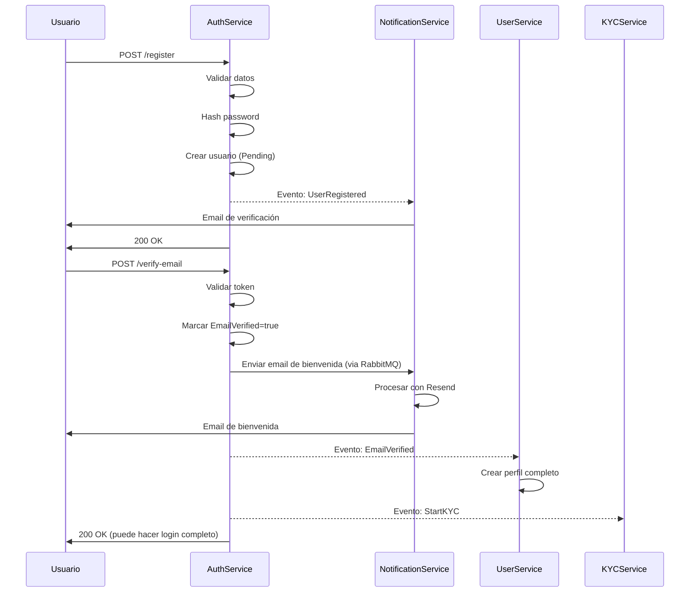
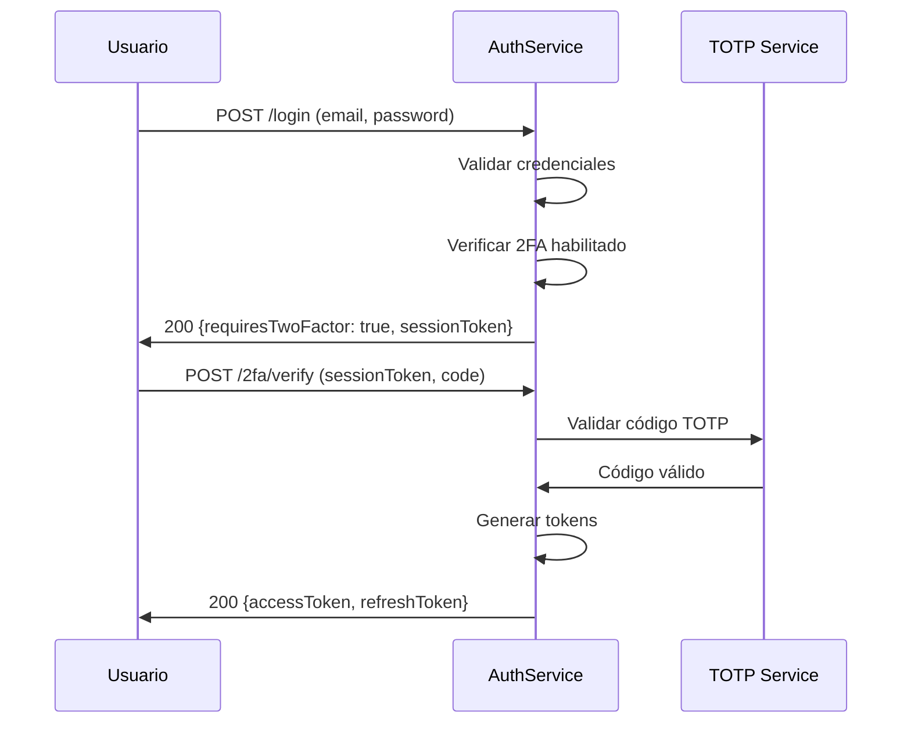

# 🔐 AuthService - Matriz de Procesos

> **Servicio:** AuthService  
> **Puerto:** 15011 (Docker), 80 (K8s)  
> **Base de Datos:** authservice (PostgreSQL)  
> **Última actualización:** Enero 21, 2026  
> **Estado:** ✅ PRODUCCIÓN - Emails funcionando

---

## 1. Información General

### 1.1 Descripción

El AuthService es el servicio central de autenticación y autorización de OKLA. Gestiona registro, login, tokens JWT, verificación de email, recuperación de contraseña, autenticación externa (Google, Facebook, Apple), verificación telefónica y 2FA.

### 1.2 Estado de Integración de Emails ✅

| Funcionalidad         | Estado          | Proveedor | Notas                                      |
| --------------------- | --------------- | --------- | ------------------------------------------ |
| Email de Verificación | ✅ Funcionando  | Resend    | Enviado vía RabbitMQ → NotificationService |
| Email de Bienvenida   | ✅ Funcionando  | Resend    | Se envía DESPUÉS de verificar email        |
| Reset de Contraseña   | ✅ Implementado | Resend    | Template configurado                       |
| Códigos 2FA por Email | ✅ Implementado | Resend    | Backup codes por email                     |

### 1.3 Dependencias

| Servicio            | Propósito                             | Comunicación     |
| ------------------- | ------------------------------------- | ---------------- |
| NotificationService | Enviar emails de verificación/reset   | RabbitMQ (async) |
| UserService         | Crear perfil de usuario post-registro | HTTP             |
| KYCService          | Iniciar proceso KYC                   | RabbitMQ         |
| AuditService        | Registrar eventos de seguridad        | RabbitMQ         |

### 1.3 Controllers

| Controller                  | Archivo                        | Endpoints |
| --------------------------- | ------------------------------ | --------- |
| AuthController              | AuthController.cs              | 7         |
| ExternalAuthController      | ExternalAuthController.cs      | 6         |
| PhoneVerificationController | PhoneVerificationController.cs | 3         |
| SecurityController          | SecurityController.cs          | 4         |
| TwoFactorController         | TwoFactorController.cs         | 5         |

---

## 2. Endpoints API

### 2.1 AuthController

| Método | Endpoint                    | Descripción                   | Auth | Rate Limit |
| ------ | --------------------------- | ----------------------------- | ---- | ---------- |
| POST   | `/api/auth/register`        | Registro de nuevo usuario     | ❌   | 5/min      |
| POST   | `/api/auth/login`           | Iniciar sesión                | ❌   | 10/min     |
| POST   | `/api/auth/forgot-password` | Solicitar reset de contraseña | ❌   | 3/min      |
| POST   | `/api/auth/reset-password`  | Resetear contraseña con token | ❌   | 5/min      |
| POST   | `/api/auth/verify-email`    | Verificar email con token     | ❌   | 10/min     |
| POST   | `/api/auth/refresh-token`   | Renovar access token          | ❌   | 30/min     |
| POST   | `/api/auth/logout`          | Cerrar sesión                 | ✅   | 10/min     |

### 2.2 ExternalAuthController

| Método | Endpoint                                 | Descripción             | Auth |
| ------ | ---------------------------------------- | ----------------------- | ---- |
| POST   | `/api/auth/external/google`              | Login con Google        | ❌   |
| POST   | `/api/auth/external/facebook`            | Login con Facebook      | ❌   |
| POST   | `/api/auth/external/apple`               | Login con Apple         | ❌   |
| GET    | `/api/auth/external/callback/{provider}` | Callback OAuth          | ❌   |
| POST   | `/api/auth/external/link`                | Vincular cuenta externa | ✅   |
| DELETE | `/api/auth/external/unlink/{provider}`   | Desvincular cuenta      | ✅   |

### 2.3 PhoneVerificationController

| Método | Endpoint                    | Descripción            | Auth |
| ------ | --------------------------- | ---------------------- | ---- |
| POST   | `/api/auth/phone/send-code` | Enviar código SMS      | ✅   |
| POST   | `/api/auth/phone/verify`    | Verificar código       | ✅   |
| GET    | `/api/auth/phone/status`    | Estado de verificación | ✅   |

### 2.4 SecurityController

| Método | Endpoint                             | Descripción               | Auth |
| ------ | ------------------------------------ | ------------------------- | ---- |
| POST   | `/api/auth/security/change-password` | Cambiar contraseña        | ✅   |
| GET    | `/api/auth/security/sessions`        | Listar sesiones activas   | ✅   |
| DELETE | `/api/auth/security/sessions/{id}`   | Cerrar sesión específica  | ✅   |
| POST   | `/api/auth/security/revoke-all`      | Cerrar todas las sesiones | ✅   |

### 2.5 TwoFactorController

| Método | Endpoint                         | Descripción                 | Auth |
| ------ | -------------------------------- | --------------------------- | ---- |
| POST   | `/api/auth/2fa/enable`           | Habilitar 2FA               | ✅   |
| POST   | `/api/auth/2fa/disable`          | Deshabilitar 2FA            | ✅   |
| POST   | `/api/auth/2fa/verify`           | Verificar código 2FA        | ✅   |
| GET    | `/api/auth/2fa/backup-codes`     | Obtener códigos de respaldo | ✅   |
| POST   | `/api/auth/2fa/regenerate-codes` | Regenerar códigos           | ✅   |

---

## 3. Procesos Detallados

### AUTH-REG-001: Registro de Usuario

| Campo          | Valor               |
| -------------- | ------------------- |
| **ID**         | AUTH-REG-001        |
| **Nombre**     | Registro de Usuario |
| **Actor**      | Usuario Anónimo     |
| **Criticidad** | 🔴 CRÍTICO          |
| **Estado**     | 🟢 ACTIVO           |

#### Precondiciones

- [ ] Email no registrado previamente
- [ ] Request con datos válidos
- [ ] Rate limit no excedido (5/min por IP)

#### Request Body

```json
{
  "userName": "string (3-50 chars, alfanumérico)",
  "email": "string (email válido)",
  "password": "string (min 8 chars, 1 mayúscula, 1 número, 1 especial)"
}
```

#### Flujo Paso a Paso

| Paso | Acción                         | Servicio                       | Validación                          |
| ---- | ------------------------------ | ------------------------------ | ----------------------------------- |
| 1    | Recibir request                | AuthController                 | Schema JSON válido                  |
| 2    | Validar formato email          | Validator                      | Regex email RFC 5322                |
| 3    | Validar fortaleza password     | Validator                      | Min 8 chars, complejidad            |
| 4    | Verificar email no existe      | Repository                     | Query a DB                          |
| 5    | Verificar username no existe   | Repository                     | Query a DB                          |
| 6    | Hash de contraseña             | BCrypt                         | 12 rounds                           |
| 7    | Crear entidad User             | Handler                        | Con status Pending                  |
| 8    | Generar token verificación     | TokenService                   | JWT 24h expiración                  |
| 9    | Guardar en DB                  | Repository                     | Transacción                         |
| 10   | Publicar evento UserRegistered | RabbitMQ                       | Exchange: user.events               |
| 11   | Enviar email verificación      | RabbitMQ → NotificationService | ✅ Async via `notification-queue`   |
| 12   | Retornar respuesta             | Controller                     | 200 OK + accessToken + refreshToken |

#### Response Success (200)

```json
{
  "success": true,
  "data": {
    "userId": "833d354b-b0c7-4bc2-a25a-fa802d6e1820",
    "userName": "gregorytest",
    "email": "user@example.com",
    "accessToken": "eyJhbGciOiJIUzI1NiIsInR5cCI6IkpXVCJ9...",
    "refreshToken": "2e19c88318114129a1ea0308df54a521...",
    "expiresAt": "2026-01-22T02:15:51.885Z"
  },
  "error": null,
  "metadata": null,
  "timestamp": "2026-01-22T01:15:51.957Z"
}
```

> **Nota:** El usuario recibe tokens inmediatamente pero con `email_verified: false`. Debe verificar su email para acceso completo.

#### Postcondiciones

- [x] Usuario creado en DB con `EmailConfirmed = false`
- [x] Token de verificación guardado en tabla `VerificationTokens` (24h expiración)
- [x] Email de verificación enviado vía RabbitMQ → NotificationService → Resend
- [x] Evento `UserRegisteredEvent` publicado en RabbitMQ
- [x] Access token y refresh token retornados al usuario

#### Flujo de Email de Verificación ✅

```
┌─────────────┐     ┌──────────────┐     ┌─────────────────────┐     ┌────────┐
│ AuthService │────►│   RabbitMQ   │────►│ NotificationService │────►│ Resend │
│  (Registro) │     │ notification │     │  (Consumer)         │     │  API   │
│             │     │    -queue    │     │                     │     │        │
└─────────────┘     └──────────────┘     └─────────────────────┘     └────────┘
                                                                          │
                                                                          ▼
                                                                    ┌──────────┐
                                                                    │  Usuario │
                                                                    │  (Email) │
                                                                    └──────────┘
```

**Link enviado:** `{FrontendBaseUrl}/verify-email?token={token}`  
**Dominio configurado:** `okla.com.do`  
**From email:** `noreply@okla.com.do`

#### Errores Posibles

| Código | Error           | Causa                | Acción                   |
| ------ | --------------- | -------------------- | ------------------------ |
| 400    | INVALID_EMAIL   | Email mal formateado | Mostrar formato correcto |
| 400    | WEAK_PASSWORD   | Contraseña débil     | Mostrar requisitos       |
| 409    | EMAIL_EXISTS    | Email ya registrado  | Sugerir login            |
| 409    | USERNAME_EXISTS | Username tomado      | Sugerir alternativas     |
| 429    | RATE_LIMIT      | Muchos intentos      | Esperar 60s              |

---

### AUTH-VER-001: Verificación de Email ✅

| Campo          | Valor                     |
| -------------- | ------------------------- |
| **ID**         | AUTH-VER-001              |
| **Nombre**     | Verificación de Email     |
| **Actor**      | Usuario con link de email |
| **Criticidad** | 🔴 CRÍTICO                |
| **Estado**     | 🟢 ACTIVO - PRODUCCIÓN    |

#### Precondiciones

- [ ] Token de verificación válido (recibido por email)
- [ ] Token no expirado (24 horas)
- [ ] Token no usado previamente

#### Request Body

```json
{
  "token": "vmyactx1-yjrErRRlEN-NgSpBohYrb_HNRZP0_EtVYI"
}
```

#### Flujo Paso a Paso ✅ IMPLEMENTADO

| Paso | Acción                          | Servicio                       | Validación                   |
| ---- | ------------------------------- | ------------------------------ | ---------------------------- |
| 1    | Usuario hace clic en link email | Frontend                       | `/verify-email?token=xxx`    |
| 2    | Frontend envía POST             | API Gateway                    | Route a AuthService          |
| 3    | Buscar token en DB              | VerificationTokenRepository    | Token existe                 |
| 4    | Validar token no expirado       | Handler                        | ExpiresAt > now              |
| 5    | Validar token no usado          | Handler                        | IsUsed = false               |
| 6    | Obtener usuario por UserId      | UserRepository                 | Usuario existe               |
| 7    | Marcar token como usado         | Repository                     | IsUsed = true, UsedAt        |
| 8    | Marcar email como verificado    | Repository                     | EmailConfirmed = true        |
| 9    | **Enviar email de bienvenida**  | RabbitMQ → NotificationService | ✅ Solo DESPUÉS de verificar |
| 10   | Retornar éxito                  | Controller                     | 200 OK                       |

#### Response Success (200)

```json
{
  "success": true,
  "data": null,
  "error": null,
  "timestamp": "2026-01-22T01:20:00.000Z"
}
```

#### Postcondiciones

- [x] `EmailConfirmed = true` en tabla `Users`
- [x] Token marcado como usado en `VerificationTokens`
- [x] Email de bienvenida enviado (template: `welcome`)
- [x] Usuario puede ahora hacer login con acceso completo

#### Flujo Correcto de Emails ✅

```
1. REGISTRO
   └── Envía: Email de VERIFICACIÓN (con link)
       Template: email_verification
       Subject: "Verifica tu email para activar tu cuenta OKLA"

2. VERIFICACIÓN (cuando usuario hace clic en link)
   └── Envía: Email de BIENVENIDA
       Template: welcome
       Subject: "¡Bienvenido a OKLA!"
```

> ⚠️ **IMPORTANTE:** El email de bienvenida se envía SOLO después de verificar el email, NO en el registro.

#### Errores Posibles

| Código | Error              | Causa               | Acción                 |
| ------ | ------------------ | ------------------- | ---------------------- |
| 400    | INVALID_TOKEN      | Token malformado    | Solicitar reenvío      |
| 400    | TOKEN_EXPIRED      | Token expiró (>24h) | Solicitar reenvío      |
| 400    | TOKEN_ALREADY_USED | Token ya fue usado  | Intentar login         |
| 404    | USER_NOT_FOUND     | Usuario no existe   | Registrarse nuevamente |

---

### AUTH-LOG-001: Inicio de Sesión (Login)

| Campo          | Valor              |
| -------------- | ------------------ |
| **ID**         | AUTH-LOG-001       |
| **Nombre**     | Inicio de Sesión   |
| **Actor**      | Usuario Registrado |
| **Criticidad** | 🔴 CRÍTICO         |
| **Estado**     | 🟢 ACTIVO          |

#### Precondiciones

- [ ] Usuario existe en sistema
- [ ] Email verificado
- [ ] Cuenta no bloqueada
- [ ] Rate limit no excedido (10/min)

#### Request Body

```json
{
  "email": "user@example.com",
  "password": "SecurePass123!"
}
```

#### Flujo Paso a Paso

| Paso | Acción                             | Servicio        | Validación           |
| ---- | ---------------------------------- | --------------- | -------------------- |
| 1    | Recibir request                    | AuthController  | Schema válido        |
| 2    | Buscar usuario por email           | Repository      | Query                |
| 3    | Verificar usuario existe           | Handler         | Si no: 401           |
| 4    | Verificar cuenta activa            | Handler         | Status = Active      |
| 5    | Verificar email verificado         | Handler         | EmailVerified = true |
| 6    | Verificar intentos fallidos        | SecurityService | Max 5 intentos       |
| 7    | Comparar hash contraseña           | BCrypt          | Verify hash          |
| 8    | Si falla: incrementar intentos     | Repository      | +1 FailedAttempts    |
| 9    | Si exitoso: resetear intentos      | Repository      | FailedAttempts = 0   |
| 10   | Verificar si 2FA habilitado        | Handler         | TwoFactorEnabled?    |
| 11a  | Si 2FA: retornar RequiresTwoFactor | Controller      | Con session token    |
| 11b  | Si no 2FA: generar tokens          | TokenService    | Access + Refresh     |
| 12   | Crear registro de sesión           | Repository      | IP, UserAgent, etc   |
| 13   | Publicar evento UserLoggedIn       | RabbitMQ        | Para analytics       |
| 14   | Retornar tokens                    | Controller      | 200 OK               |

#### Response Success (200) - Sin 2FA

```json
{
  "success": true,
  "data": {
    "accessToken": "eyJhbGc...",
    "refreshToken": "eyJhbGc...",
    "expiresIn": 3600,
    "tokenType": "Bearer",
    "user": {
      "id": "uuid",
      "email": "user@example.com",
      "userName": "johndoe",
      "roles": ["Buyer", "Seller"]
    }
  }
}
```

#### Response Requires 2FA (200)

```json
{
  "success": true,
  "data": {
    "requiresTwoFactor": true,
    "sessionToken": "temp-session-token",
    "message": "Por favor ingresa el código de tu autenticador"
  }
}
```

#### Postcondiciones

- [x] Tokens JWT generados (si no 2FA)
- [x] Sesión registrada en DB
- [x] Intentos fallidos reseteados
- [x] Evento de login registrado

#### Errores Posibles

| Código | Error               | Causa                     | Acción                 |
| ------ | ------------------- | ------------------------- | ---------------------- |
| 401    | INVALID_CREDENTIALS | Email/password incorrecto | Genérico por seguridad |
| 401    | EMAIL_NOT_VERIFIED  | Email sin verificar       | Reenviar email         |
| 403    | ACCOUNT_LOCKED      | 5+ intentos fallidos      | Esperar 30 min         |
| 403    | ACCOUNT_DISABLED    | Cuenta desactivada        | Contactar soporte      |
| 429    | RATE_LIMIT          | Muchos intentos           | Esperar 60s            |

---

### AUTH-TOK-001: Refresh Token

| Campo          | Valor                |
| -------------- | -------------------- |
| **ID**         | AUTH-TOK-001         |
| **Nombre**     | Renovar Access Token |
| **Actor**      | Usuario Autenticado  |
| **Criticidad** | 🔴 CRÍTICO           |
| **Estado**     | 🟢 ACTIVO            |

#### Precondiciones

- [ ] Refresh token válido
- [ ] Refresh token no expirado
- [ ] Refresh token no revocado

#### Request Body

```json
{
  "refreshToken": "eyJhbGc..."
}
```

#### Flujo Paso a Paso

| Paso | Acción                       | Servicio     | Validación        |
| ---- | ---------------------------- | ------------ | ----------------- |
| 1    | Recibir refresh token        | Controller   | No vacío          |
| 2    | Decodificar token            | TokenService | JWT válido        |
| 3    | Verificar firma              | TokenService | Signature match   |
| 4    | Verificar expiración         | TokenService | exp > now         |
| 5    | Buscar token en DB           | Repository   | Exists and active |
| 6    | Verificar no revocado        | Repository   | IsRevoked = false |
| 7    | Obtener usuario              | Repository   | UserId del token  |
| 8    | Verificar usuario activo     | Handler      | Status = Active   |
| 9    | Revocar refresh token actual | Repository   | IsRevoked = true  |
| 10   | Generar nuevo access token   | TokenService | 1h expiración     |
| 11   | Generar nuevo refresh token  | TokenService | 7d expiración     |
| 12   | Guardar nuevo refresh token  | Repository   | INSERT            |
| 13   | Retornar tokens              | Controller   | 200 OK            |

#### Response Success (200)

```json
{
  "success": true,
  "data": {
    "accessToken": "eyJhbGc...(nuevo)",
    "refreshToken": "eyJhbGc...(nuevo)",
    "expiresIn": 3600
  }
}
```

#### Postcondiciones

- [x] Access token antiguo invalidado (por expiración)
- [x] Refresh token antiguo revocado
- [x] Nuevos tokens generados y almacenados

#### Errores Posibles

| Código | Error            | Causa               | Acción             |
| ------ | ---------------- | ------------------- | ------------------ |
| 401    | INVALID_TOKEN    | Token malformado    | Re-login requerido |
| 401    | TOKEN_EXPIRED    | Token expirado      | Re-login requerido |
| 401    | TOKEN_REVOKED    | Token revocado      | Re-login requerido |
| 403    | ACCOUNT_DISABLED | Usuario desactivado | Contactar soporte  |

---

### AUTH-PWD-001: Recuperación de Contraseña

| Campo          | Valor              |
| -------------- | ------------------ |
| **ID**         | AUTH-PWD-001       |
| **Nombre**     | Forgot Password    |
| **Actor**      | Usuario Registrado |
| **Criticidad** | 🟠 ALTO            |
| **Estado**     | 🟢 ACTIVO          |

#### Precondiciones

- [ ] Email registrado en sistema
- [ ] Rate limit no excedido (3/min)

#### Request Body

```json
{
  "email": "user@example.com"
}
```

#### Flujo Paso a Paso

| Paso | Acción                        | Servicio            | Validación           |
| ---- | ----------------------------- | ------------------- | -------------------- |
| 1    | Recibir email                 | Controller          | Formato válido       |
| 2    | Buscar usuario                | Repository          | Por email            |
| 3    | Si no existe: retornar OK     | Controller          | Prevenir enumeración |
| 4    | Verificar solicitudes previas | Repository          | Max 3 en 1 hora      |
| 5    | Generar token reset           | TokenService        | 1 hora expiración    |
| 6    | Guardar token en DB           | Repository          | Con hash             |
| 7    | Enviar email con link         | NotificationService | Template reset       |
| 8    | Registrar intento             | AuditService        | Para seguridad       |
| 9    | Retornar mensaje genérico     | Controller          | 200 OK               |

#### Response Success (200)

```json
{
  "success": true,
  "data": {
    "message": "Si el email existe, recibirás instrucciones para recuperar tu contraseña."
  }
}
```

#### Notas de Seguridad

- ⚠️ SIEMPRE retornar mismo mensaje para prevenir enumeración de emails
- ⚠️ Token debe tener hash en DB, no texto plano
- ⚠️ Link debe ser single-use

---

### AUTH-PWD-002: Reset de Contraseña

| Campo          | Valor             |
| -------------- | ----------------- |
| **ID**         | AUTH-PWD-002      |
| **Nombre**     | Reset Password    |
| **Actor**      | Usuario con Token |
| **Criticidad** | 🔴 CRÍTICO        |
| **Estado**     | 🟢 ACTIVO         |

#### Request Body

```json
{
  "token": "reset-token-from-email",
  "newPassword": "NewSecurePass123!",
  "confirmPassword": "NewSecurePass123!"
}
```

#### Flujo Paso a Paso

| Paso | Acción                           | Servicio            | Validación             |
| ---- | -------------------------------- | ------------------- | ---------------------- |
| 1    | Recibir datos                    | Controller          | Schema válido          |
| 2    | Validar passwords coinciden      | Validator           | newPassword == confirm |
| 3    | Validar fortaleza password       | Validator           | Complejidad            |
| 4    | Hash del token recibido          | Handler             | SHA256                 |
| 5    | Buscar token en DB               | Repository          | Por hash               |
| 6    | Verificar token válido           | Handler             | Existe y no usado      |
| 7    | Verificar no expirado            | Handler             | ExpiresAt > now        |
| 8    | Hash nueva contraseña            | BCrypt              | 12 rounds              |
| 9    | Actualizar contraseña            | Repository          | UPDATE                 |
| 10   | Marcar token como usado          | Repository          | IsUsed = true          |
| 11   | Revocar todos los refresh tokens | Repository          | Seguridad              |
| 12   | Enviar confirmación email        | NotificationService | Alerta seguridad       |
| 13   | Publicar evento                  | RabbitMQ            | PasswordChanged        |
| 14   | Retornar éxito                   | Controller          | 200 OK                 |

#### Postcondiciones

- [x] Contraseña actualizada
- [x] Todas las sesiones cerradas
- [x] Token de reset invalidado
- [x] Email de confirmación enviado

---

### AUTH-2FA-001: Habilitar Two-Factor Authentication

| Campo          | Valor               |
| -------------- | ------------------- |
| **ID**         | AUTH-2FA-001        |
| **Nombre**     | Habilitar 2FA       |
| **Actor**      | Usuario Autenticado |
| **Criticidad** | 🟠 ALTO             |
| **Estado**     | 🟢 ACTIVO           |

#### Precondiciones

- [ ] Usuario autenticado
- [ ] 2FA no habilitado actualmente
- [ ] Email verificado

#### Flujo Paso a Paso

| Paso | Acción                   | Servicio    | Validación               |
| ---- | ------------------------ | ----------- | ------------------------ |
| 1    | Verificar 2FA no activo  | Handler     | TwoFactorEnabled = false |
| 2    | Generar secret TOTP      | TotpService | Base32 secret            |
| 3    | Generar QR code URI      | TotpService | otpauth:// format        |
| 4    | Generar códigos respaldo | Handler     | 10 códigos únicos        |
| 5    | Hash códigos respaldo    | BCrypt      | Para almacenar           |
| 6    | Guardar temporalmente    | Cache       | Pendiente confirmación   |
| 7    | Retornar QR y códigos    | Controller  | 200 OK                   |

#### Response Success (200)

```json
{
  "success": true,
  "data": {
    "secret": "JBSWY3DPEHPK3PXP",
    "qrCodeUri": "otpauth://totp/OKLA:user@example.com?secret=...",
    "qrCodeImage": "data:image/png;base64,...",
    "backupCodes": [
      "XXXX-XXXX-XXXX",
      "YYYY-YYYY-YYYY",
      ...
    ],
    "message": "Escanea el QR y confirma con un código"
  }
}
```

#### Siguiente Paso

Usuario debe llamar a `/api/auth/2fa/verify` con código del autenticador para confirmar activación.

---

### AUTH-EXT-001: Login con Google

| Campo          | Valor            |
| -------------- | ---------------- |
| **ID**         | AUTH-EXT-001     |
| **Nombre**     | Login con Google |
| **Actor**      | Usuario Anónimo  |
| **Criticidad** | 🔴 CRÍTICO       |
| **Estado**     | 🟢 ACTIVO        |

#### Request Body

```json
{
  "idToken": "google-id-token-from-frontend"
}
```

#### Flujo Paso a Paso

| Paso | Acción                           | Servicio          | Validación       |
| ---- | -------------------------------- | ----------------- | ---------------- |
| 1    | Recibir ID token                 | Controller        | No vacío         |
| 2    | Validar con Google               | GoogleAuthService | Verify token API |
| 3    | Extraer claims                   | Handler           | email, sub, name |
| 4    | Buscar usuario por email         | Repository        | Query            |
| 5a   | Si existe: verificar vinculación | Handler           | GoogleId match   |
| 5b   | Si no existe: crear usuario      | Handler           | Auto-registro    |
| 6    | Si nuevo: crear perfil           | UserService       | Via HTTP         |
| 7    | Generar tokens OKLA              | TokenService      | Access + Refresh |
| 8    | Registrar sesión                 | Repository        | Con provider     |
| 9    | Retornar tokens                  | Controller        | 200 OK           |

#### Consideraciones

- Email de Google se marca como verificado automáticamente
- Si email existe pero no vinculado a Google: error (debe vincular manualmente)

---

## 4. Flujos de Integración

### 4.1 Registro Completo de Usuario



### 4.2 Arquitectura de Envío de Emails ✅

```
┌─────────────────────────────────────────────────────────────────────────────┐
│                    FLUJO DE EMAILS EN OKLA                                  │
├─────────────────────────────────────────────────────────────────────────────┤
│                                                                             │
│  ┌───────────────┐    ┌─────────────────┐    ┌──────────────────────────┐   │
│  │  AuthService  │───▶│    RabbitMQ     │───▶│  NotificationService     │   │
│  │               │    │                 │    │                          │   │
│  │ • Registro    │    │ notification-   │    │ • RabbitMQConsumer       │   │
│  │ • Verificar   │    │   queue         │    │ • SendEmailNotification  │   │
│  │ • Reset pwd   │    │                 │    │   CommandHandler         │   │
│  └───────────────┘    └─────────────────┘    └──────────────────────────┘   │
│                                                          │                  │
│                                                          ▼                  │
│                                              ┌──────────────────────────┐   │
│                                              │    ResendEmailService    │   │
│                                              │                          │   │
│                                              │ API: api.resend.com      │   │
│                                              │ From: noreply@okla.com.do│   │
│                                              └──────────────────────────┘   │
│                                                          │                  │
│                                                          ▼                  │
│                                              ┌──────────────────────────┐   │
│                                              │     Usuario (Email)      │   │
│                                              └──────────────────────────┘   │
│                                                                             │
└─────────────────────────────────────────────────────────────────────────────┘
```

### 4.3 Login con 2FA



---

## 5. Reglas de Negocio

### 5.1 Contraseñas

| Regla                 | Valor                |
| --------------------- | -------------------- |
| Longitud mínima       | 8 caracteres         |
| Mayúsculas requeridas | Al menos 1           |
| Números requeridos    | Al menos 1           |
| Caracteres especiales | Al menos 1           |
| No puede contener     | Email o username     |
| Historial             | No repetir últimas 5 |

### 5.2 Tokens

| Token                | Expiración | Renovable            |
| -------------------- | ---------- | -------------------- |
| Access Token         | 1 hora     | No (usar refresh)    |
| Refresh Token        | 7 días     | Sí (genera nuevo)    |
| Verification Token   | 24 horas   | Sí (reenviar)        |
| Reset Password Token | 1 hora     | Sí (solicitar nuevo) |
| 2FA Session Token    | 5 minutos  | No                   |

### 5.3 Rate Limiting

| Endpoint         | Límite | Ventana  |
| ---------------- | ------ | -------- |
| /register        | 5      | 1 minuto |
| /login           | 10     | 1 minuto |
| /forgot-password | 3      | 1 minuto |
| /refresh-token   | 30     | 1 minuto |
| General          | 100    | 1 minuto |

### 5.4 Bloqueo de Cuenta

| Evento                           | Acción                      |
| -------------------------------- | --------------------------- |
| 5 intentos fallidos consecutivos | Bloqueo 30 minutos          |
| 10 intentos fallidos en 1 hora   | Bloqueo 2 horas             |
| 20 intentos fallidos en 24 horas | Bloqueo permanente (manual) |

---

## 6. Manejo de Errores

### 6.1 Códigos de Error

| Código  | Nombre                 | HTTP | Descripción                     |
| ------- | ---------------------- | ---- | ------------------------------- |
| AUTH001 | INVALID_CREDENTIALS    | 401  | Email o contraseña incorrectos  |
| AUTH002 | EMAIL_NOT_VERIFIED     | 401  | Email pendiente de verificación |
| AUTH003 | ACCOUNT_LOCKED         | 403  | Cuenta bloqueada temporalmente  |
| AUTH004 | ACCOUNT_DISABLED       | 403  | Cuenta desactivada              |
| AUTH005 | TOKEN_EXPIRED          | 401  | Token ha expirado               |
| AUTH006 | TOKEN_INVALID          | 401  | Token malformado o inválido     |
| AUTH007 | TOKEN_REVOKED          | 401  | Token fue revocado              |
| AUTH008 | 2FA_REQUIRED           | 200  | Se requiere código 2FA          |
| AUTH009 | 2FA_INVALID_CODE       | 401  | Código 2FA incorrecto           |
| AUTH010 | EMAIL_EXISTS           | 409  | Email ya registrado             |
| AUTH011 | USERNAME_EXISTS        | 409  | Username ya existe              |
| AUTH012 | WEAK_PASSWORD          | 400  | Contraseña no cumple requisitos |
| AUTH013 | RATE_LIMIT_EXCEEDED    | 429  | Demasiados intentos             |
| AUTH014 | EXTERNAL_AUTH_FAILED   | 401  | Fallo autenticación externa     |
| AUTH015 | PHONE_ALREADY_VERIFIED | 400  | Teléfono ya verificado          |

### 6.2 Formato de Respuesta de Error

```json
{
  "success": false,
  "error": {
    "code": "AUTH001",
    "message": "Credenciales inválidas",
    "details": null,
    "timestamp": "2026-01-21T10:30:00Z",
    "traceId": "abc123"
  }
}
```

---

## 7. Eventos Publicados (RabbitMQ)

| Evento           | Exchange    | Routing Key           | Consumers                                    |
| ---------------- | ----------- | --------------------- | -------------------------------------------- |
| UserRegistered   | user.events | user.registered       | UserService, NotificationService, KYCService |
| UserLoggedIn     | user.events | user.logged_in        | AuditService, AnalyticsService               |
| UserLoggedOut    | user.events | user.logged_out       | AuditService                                 |
| PasswordChanged  | user.events | user.password_changed | NotificationService, AuditService            |
| EmailVerified    | user.events | user.email_verified   | UserService                                  |
| TwoFactorEnabled | user.events | user.2fa_enabled      | AuditService                                 |
| AccountLocked    | user.events | user.account_locked   | NotificationService, AuditService            |

---

## 8. Auditoría

Todos los endpoints tienen decorador `[Audit]` que registra:

| Campo        | Descripción                                |
| ------------ | ------------------------------------------ |
| Action       | Nombre de la acción (LOGIN, REGISTER, etc) |
| ResourceType | User, Token, etc                           |
| Severity     | Debug, Info, Warning, Error, Critical      |
| UserId       | ID del usuario (si autenticado)            |
| IP           | Dirección IP del cliente                   |
| UserAgent    | Browser/cliente                            |
| Timestamp    | Fecha y hora UTC                           |
| Success      | Si la operación fue exitosa                |
| ErrorMessage | Mensaje de error (si aplica)               |

---

## 9. Configuración

### 9.1 Variables de Entorno (Docker/K8s) ✅

```bash
# JWT Configuration
JWT_SECRET_KEY=CarDealerSecretKeyForJwtToken2024MustBeAtLeast32CharactersLong!
JWT_ISSUER=OKLA
JWT_AUDIENCE=OKLA.Users

# Database
Database__ConnectionStrings__PostgreSQL=Host=postgres_db;Port=5432;Database=authservice;Username=postgres;Password=***

# RabbitMQ (para envío de emails)
RabbitMQ__Enabled=true
RabbitMQ__Host=rabbitmq
RabbitMQ__Port=5672
RabbitMQ__Username=guest
RabbitMQ__Password=guest

# Frontend URL (para links en emails)
AuthSettings__FrontendBaseUrl=http://localhost:3000
```

### 9.2 appsettings.json

```json
{
  "Jwt": {
    "Secret": "[SECRET_KEY]",
    "Issuer": "OKLA",
    "Audience": "OKLA.Users",
    "AccessTokenExpirationMinutes": 60,
    "RefreshTokenExpirationDays": 7
  },
  "RabbitMQ": {
    "Enabled": true,
    "Host": "rabbitmq",
    "Port": 5672
  },
  "AuthSettings": {
    "FrontendBaseUrl": "http://localhost:3000"
  },
  "Security": {
    "MaxFailedAttempts": 5,
    "LockoutMinutes": 30,
    "PasswordHistoryCount": 5
  }
}
```

### 9.3 Configuración de Emails (NotificationService)

```bash
# Resend API (proveedor de emails)
Resend__ApiKey=re_Bi3rubbH_***
Resend__FromEmail=noreply@okla.com.do

# Database
Database__ConnectionStrings__PostgreSQL=Host=postgres_db;Port=5432;Database=notificationservice;...

# RabbitMQ (consumidor)
RabbitMQ__Host=rabbitmq
RabbitMQ__Port=5672
```

---

## 10. Scripts de Reinicio (Desarrollo Local)

### restart-authservice.sh

```bash
#!/bin/bash
docker rm -f authservice 2>/dev/null || true
docker run -d --name authservice \
  --network cardealer-microservices_cargurus-net \
  -p 15011:80 \
  -e ASPNETCORE_ENVIRONMENT=Docker \
  -e 'Database__ConnectionStrings__PostgreSQL=Host=postgres_db;...' \
  -e RabbitMQ__Enabled=true \
  -e RabbitMQ__Host=rabbitmq \
  -e JWT_SECRET_KEY=CarDealerSecretKeyForJwtToken2024MustBeAtLeast32CharactersLong! \
  -e JWT_ISSUER=OKLA \
  -e JWT_AUDIENCE=OKLA.Users \
  cardealer-authservice:latest
```

### restart-notification.sh

```bash
#!/bin/bash
docker rm -f notificationservice 2>/dev/null || true
docker run -d --name notificationservice \
  --network cardealer-microservices_cargurus-net \
  -p 15040:80 \
  -e ASPNETCORE_ENVIRONMENT=Docker \
  -e 'Database__ConnectionStrings__PostgreSQL=Host=postgres_db;...' \
  -e RabbitMQ__Host=rabbitmq \
  -e Resend__ApiKey=re_Bi3rubbH_*** \
  -e Resend__FromEmail=noreply@okla.com.do \
  cardealer-notificationservice:latest
```

---

**Documento generado:** Enero 21, 2026  
**Versión:** 2.0.0 - Emails funcionando con Resend  
**Autor:** Equipo OKLA
