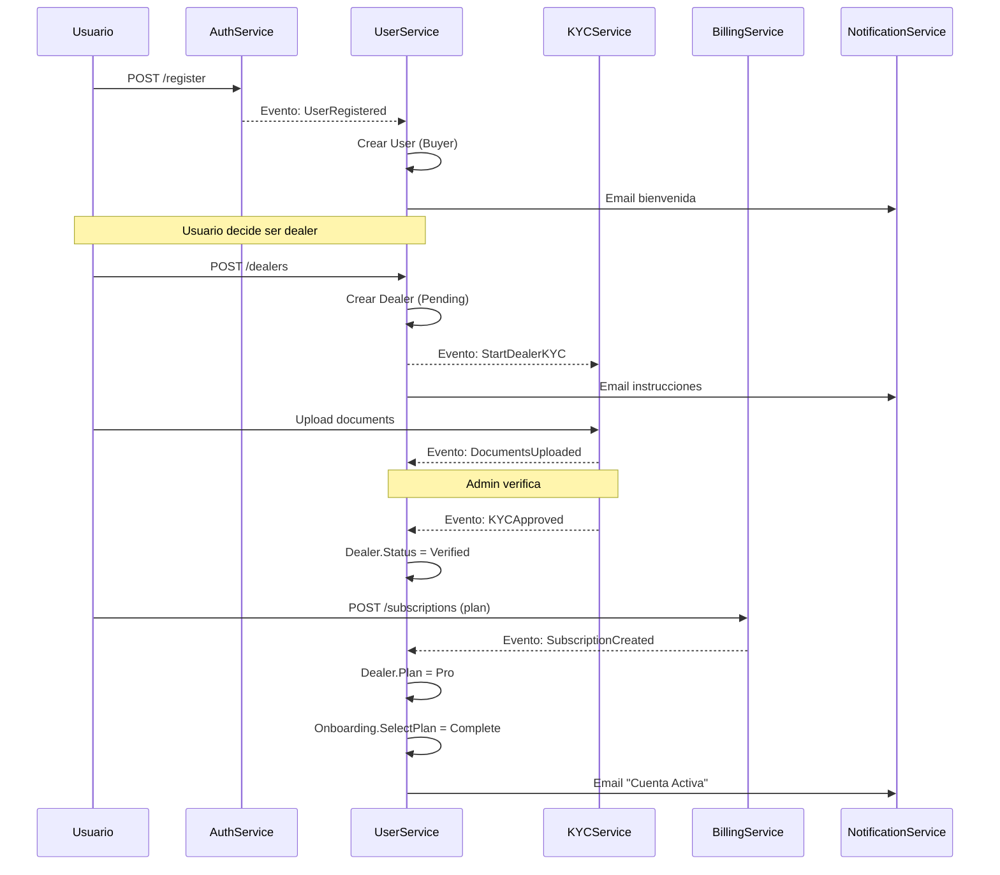
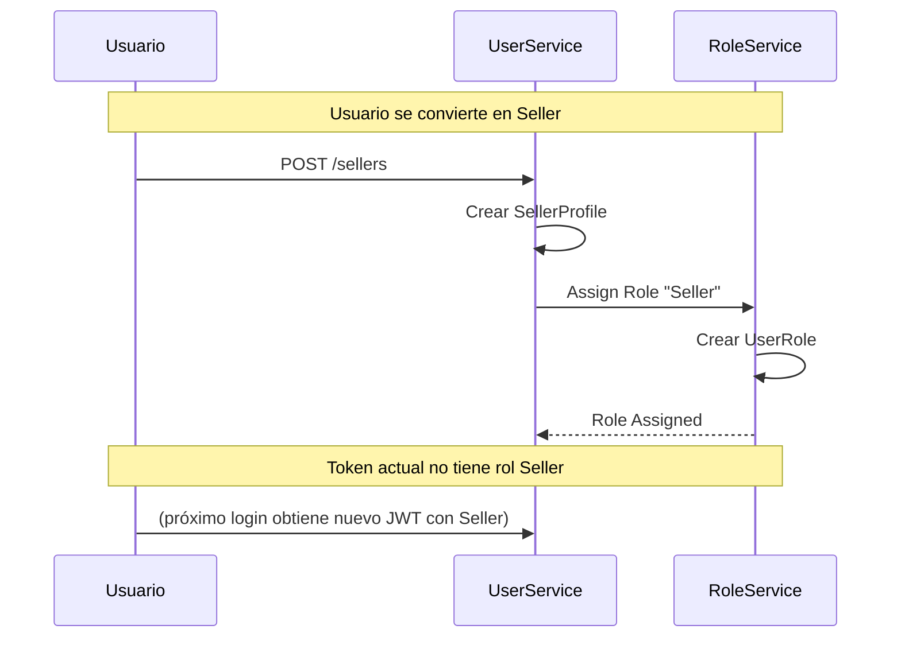

# 👥 UserService - Matriz de Procesos

> **Servicio:** UserService  
> **Puerto:** 15101  
> **Base de Datos:** user_db  
> **Última actualización:** Enero 27, 2026  
> **Estado de Implementación:** ✅ 100% Completo

## 📊 Resumen de Implementación

| Componente               | Total | Implementado | Pendiente | Estado  |
| ------------------------ | ----- | ------------ | --------- | ------- |
| **Controllers**          | 9     | 9            | 0         | ✅ 100% |
| **Procesos (USER-\*)**   | 5     | 5            | 0         | ✅ 100% |
| **Procesos (UROLE-\*)**  | 2     | 2            | 0         | ✅ 100% |
| **Procesos (SELLER-\*)** | 2     | 2            | 0         | ✅ 100% |
| **Procesos (DEALER-\*)** | 2     | 2            | 0         | ✅ 100% |
| **Procesos (DEMP-\*)**   | 5     | 5            | 0         | ✅ 100% |
| **Procesos (DONB-\*)**   | 4     | 4            | 0         | ✅ 100% |
| **Procesos (DMOD-\*)**   | 3     | 3            | 0         | ✅ 100% |
| **Tests Unitarios**      | 93    | 93           | 0         | ✅ 100% |

### Leyenda de Estados

- ✅ **IMPLEMENTADO Y PROBADO**: Código completo con tests
- 🟢 **IMPLEMENTADO**: Código completo, falta testing
- 🟡 **EN PROGRESO**: Implementación parcial
- 🔴 **PENDIENTE**: No implementado

---

## 1. Información General

### 1.1 Descripción

El UserService gestiona todos los perfiles de usuario de OKLA: usuarios base, vendedores individuales (Sellers) y concesionarios (Dealers). Incluye onboarding, verificación, gestión de roles de usuario y módulos de dealer.

### 1.2 Dependencias

| Servicio            | Propósito                         |
| ------------------- | --------------------------------- |
| AuthService         | Recibir eventos de registro       |
| RoleService         | Obtener/asignar roles             |
| KYCService          | Verificación de identidad         |
| BillingService      | Planes de suscripción             |
| NotificationService | Emails de bienvenida/verificación |

### 1.3 Controllers

| Controller                 | Archivo                       | Endpoints |
| -------------------------- | ----------------------------- | --------- |
| UsersController            | UsersController.cs            | 5         |
| UserRolesController        | UserRolesController.cs        | 4         |
| SellersController          | SellersController.cs          | 6         |
| DealersController          | DealersController.cs          | 6         |
| DealerEmployeesController  | DealerEmployeesController.cs  | 5         |
| DealerOnboardingController | DealerOnboardingController.cs | 4         |
| DealerModulesController    | DealerModulesController.cs    | 3         |
| OnboardingController       | OnboardingController.cs       | 3         |
| SellerProfileController    | SellerProfileController.cs    | 4         |

---

## 2. Endpoints API

### 2.1 UsersController

| Método | Endpoint              | Descripción                | Auth     |
| ------ | --------------------- | -------------------------- | -------- |
| GET    | `/api/users`          | Listar usuarios (paginado) | ✅ Admin |
| GET    | `/api/users/{userId}` | Obtener usuario por ID     | ✅       |
| POST   | `/api/users`          | Crear usuario              | ✅ Admin |
| PUT    | `/api/users/{userId}` | Actualizar usuario         | ✅       |
| DELETE | `/api/users/{userId}` | Eliminar usuario           | ✅ Admin |

### 2.2 UserRolesController

| Método | Endpoint                                | Descripción               | Auth     |
| ------ | --------------------------------------- | ------------------------- | -------- |
| GET    | `/api/users/{userId}/roles`             | Obtener roles del usuario | ✅       |
| POST   | `/api/users/{userId}/roles`             | Asignar rol               | ✅ Admin |
| DELETE | `/api/users/{userId}/roles/{roleId}`    | Revocar rol               | ✅ Admin |
| GET    | `/api/users/{userId}/permissions/check` | Verificar permiso         | ✅       |

### 2.3 SellersController

| Método | Endpoint                         | Descripción                 | Auth     |
| ------ | -------------------------------- | --------------------------- | -------- |
| POST   | `/api/sellers`                   | Crear perfil vendedor       | ✅       |
| GET    | `/api/sellers/{sellerId}`        | Obtener vendedor            | ✅       |
| GET    | `/api/sellers/user/{userId}`     | Obtener vendedor por userId | ✅       |
| PUT    | `/api/sellers/{sellerId}`        | Actualizar vendedor         | ✅       |
| POST   | `/api/sellers/{sellerId}/verify` | Verificar vendedor          | ✅ Admin |
| GET    | `/api/sellers/{sellerId}/stats`  | Estadísticas del vendedor   | ✅       |

### 2.4 DealersController

| Método | Endpoint                           | Descripción       | Auth     |
| ------ | ---------------------------------- | ----------------- | -------- |
| POST   | `/api/dealers`                     | Crear dealer      | ✅       |
| GET    | `/api/dealers/{dealerId}`          | Obtener dealer    | ✅       |
| GET    | `/api/dealers/owner/{ownerUserId}` | Obtener por owner | ✅       |
| PUT    | `/api/dealers/{dealerId}`          | Actualizar dealer | ✅       |
| POST   | `/api/dealers/{dealerId}/verify`   | Verificar dealer  | ✅ Admin |
| DELETE | `/api/dealers/{dealerId}`          | Desactivar dealer | ✅ Admin |

### 2.5 DealerEmployeesController

| Método | Endpoint                                         | Descripción         | Auth           |
| ------ | ------------------------------------------------ | ------------------- | -------------- |
| GET    | `/api/dealers/{dealerId}/employees`              | Listar empleados    | ✅ DealerOwner |
| POST   | `/api/dealers/{dealerId}/employees`              | Agregar empleado    | ✅ DealerOwner |
| GET    | `/api/dealers/{dealerId}/employees/{employeeId}` | Obtener empleado    | ✅ DealerOwner |
| PUT    | `/api/dealers/{dealerId}/employees/{employeeId}` | Actualizar empleado | ✅ DealerOwner |
| DELETE | `/api/dealers/{dealerId}/employees/{employeeId}` | Remover empleado    | ✅ DealerOwner |

### 2.6 DealerOnboardingController

| Método | Endpoint                                           | Descripción       | Auth |
| ------ | -------------------------------------------------- | ----------------- | ---- |
| GET    | `/api/dealers/{dealerId}/onboarding/status`        | Estado onboarding | ✅   |
| POST   | `/api/dealers/{dealerId}/onboarding/complete-step` | Completar paso    | ✅   |
| GET    | `/api/dealers/{dealerId}/onboarding/checklist`     | Obtener checklist | ✅   |
| POST   | `/api/dealers/{dealerId}/onboarding/skip-step`     | Saltar paso       | ✅   |

### 2.7 DealerModulesController

| Método | Endpoint                                             | Descripción         | Auth           |
| ------ | ---------------------------------------------------- | ------------------- | -------------- |
| GET    | `/api/dealers/{dealerId}/modules`                    | Listar módulos      | ✅             |
| POST   | `/api/dealers/{dealerId}/modules/{moduleId}/enable`  | Habilitar módulo    | ✅ DealerOwner |
| POST   | `/api/dealers/{dealerId}/modules/{moduleId}/disable` | Deshabilitar módulo | ✅ DealerOwner |

---

## 3. Tipos de Usuario

### 3.1 Jerarquía

```
User (Base)
├── Buyer (Comprador)
│   └── Solo puede buscar, favoritos, alertas
├── Seller (Vendedor Individual)
│   ├── SellerProfile
│   └── Puede publicar vehículos (pago por listing)
└── DealerOwner (Dueño de Concesionario)
    ├── Dealer
    │   ├── DealerEmployees[]
    │   ├── DealerLocations[]
    │   └── DealerModules[]
    └── Suscripción mensual
```

### 3.2 Estados de Usuario

| Estado      | Descripción              | Acciones Permitidas       |
| ----------- | ------------------------ | ------------------------- |
| `Pending`   | Recién registrado        | Solo verificar email      |
| `Active`    | Email verificado         | Acceso completo según rol |
| `Suspended` | Suspendido temporalmente | Solo lectura              |
| `Banned`    | Baneado permanentemente  | Ninguna                   |
| `Deleted`   | Soft delete              | Ninguna                   |

### 3.3 Estados de Vendedor/Dealer

| Estado        | Descripción              | Puede Publicar |
| ------------- | ------------------------ | -------------- |
| `Pending`     | Esperando verificación   | ❌             |
| `UnderReview` | Documentos en revisión   | ❌             |
| `Verified`    | Verificado por admin     | ✅             |
| `Rejected`    | Documentos rechazados    | ❌             |
| `Suspended`   | Suspendido por violación | ❌             |

---

## 4. Procesos Detallados

### USER-CRT-001: Crear Usuario

| Campo              | Valor                                            |
| ------------------ | ------------------------------------------------ |
| **ID**             | USER-CRT-001                                     |
| **Nombre**         | Crear Usuario                                    |
| **Actor**          | Admin, Sistema                                   |
| **Criticidad**     | 🔴 CRÍTICO                                       |
| **Estado**         | 🟢 ACTIVO                                        |
| **Implementación** | 🟢 **IMPLEMENTADO**                              |
| **Handler**        | `CreateUserCommand`                              |
| **Archivo**        | `UseCases/Users/CreateUser/CreateUserCommand.cs` |
| **Tests**          | 🔴 Pendiente                                     |

#### Descripción

Este proceso normalmente se dispara automáticamente cuando AuthService publica el evento `UserRegistered`. También puede ser llamado manualmente por admins.

#### Request Body

```json
{
  "email": "user@example.com",
  "password": "SecurePass123!",
  "firstName": "Juan",
  "lastName": "Pérez",
  "phoneNumber": "+1 809-555-1234"
}
```

#### Flujo Paso a Paso

| Paso | Acción                  | Servicio            | Validación         |
| ---- | ----------------------- | ------------------- | ------------------ |
| 1    | Recibir datos           | Controller          | Schema válido      |
| 2    | Validar email único     | Repository          | Query              |
| 3    | Crear entidad User      | Handler             | Con Status=Pending |
| 4    | Asignar rol default     | RoleService         | Buyer              |
| 5    | Guardar en DB           | Repository          | INSERT             |
| 6    | Enviar email bienvenida | NotificationService | Async              |
| 7    | Retornar usuario        | Controller          | 201 Created        |

#### Response Success (201)

```json
{
  "id": "guid",
  "email": "user@example.com",
  "firstName": "Juan",
  "lastName": "Pérez",
  "phoneNumber": "+1 809-555-1234",
  "status": "Pending",
  "createdAt": "2026-01-21T10:30:00Z"
}
```

---

### USER-GET-001: Obtener Usuario

| Campo              | Valor                                    |
| ------------------ | ---------------------------------------- |
| **ID**             | USER-GET-001                             |
| **Nombre**         | Obtener Usuario por ID                   |
| **Actor**          | Usuario Autenticado                      |
| **Criticidad**     | 🟡 MEDIO                                 |
| **Estado**         | 🟢 ACTIVO                                |
| **Implementación** | 🟢 **IMPLEMENTADO**                      |
| **Handler**        | `GetUserQuery`                           |
| **Archivo**        | `UseCases/Users/GetUser/GetUserQuery.cs` |
| **Tests**          | 🔴 Pendiente                             |

#### Reglas de Acceso

- **Mismo usuario:** Puede ver su propio perfil
- **Admin:** Puede ver cualquier perfil
- **Otros:** Solo datos públicos

#### Response Success (200)

```json
{
  "id": "guid",
  "email": "user@example.com",
  "firstName": "Juan",
  "lastName": "Pérez",
  "phoneNumber": "+1 809-555-1234",
  "status": "Active",
  "roles": ["Buyer", "Seller"],
  "sellerProfile": {
    "id": "guid",
    "isVerified": true,
    "verifiedAt": "2026-01-15T00:00:00Z"
  },
  "createdAt": "2026-01-01T00:00:00Z"
}
```

---

### USER-UPD-001: Actualizar Usuario

| Campo              | Valor                                            |
| ------------------ | ------------------------------------------------ |
| **ID**             | USER-UPD-001                                     |
| **Nombre**         | Actualizar Usuario                               |
| **Actor**          | Usuario, Admin                                   |
| **Criticidad**     | 🟠 ALTO                                          |
| **Estado**         | 🟢 ACTIVO                                        |
| **Implementación** | 🟢 **IMPLEMENTADO**                              |
| **Handler**        | `UpdateUserCommand`                              |
| **Archivo**        | `UseCases/Users/UpdateUser/UpdateUserCommand.cs` |
| **Tests**          | 🔴 Pendiente                                     |

#### Request Body

```json
{
  "firstName": "Juan Carlos",
  "lastName": "Pérez Santos",
  "phoneNumber": "+1 809-555-9999",
  "isActive": true
}
```

#### Reglas

- Usuario solo puede editar su propio perfil
- Admin puede editar cualquier perfil
- Email no es editable (inmutable)
- `isActive` solo editable por Admin

#### Flujo Paso a Paso

| Paso | Acción                 | Servicio   | Validación         |
| ---- | ---------------------- | ---------- | ------------------ |
| 1    | Verificar autorización | Handler    | Mismo user o Admin |
| 2    | Buscar usuario         | Repository | 404 si no existe   |
| 3    | Actualizar campos      | Handler    | Solo los enviados  |
| 4    | Guardar cambios        | Repository | UPDATE             |
| 5    | Publicar evento        | RabbitMQ   | UserUpdated        |
| 6    | Retornar usuario       | Controller | 200 OK             |

---

### UROLE-GET-001: Obtener Roles de Usuario

| Campo              | Valor                                                  |
| ------------------ | ------------------------------------------------------ |
| **ID**             | UROLE-GET-001                                          |
| **Nombre**         | Obtener Roles del Usuario                              |
| **Actor**          | Usuario, Admin                                         |
| **Criticidad**     | 🟡 MEDIO                                               |
| **Estado**         | 🟢 ACTIVO                                              |
| **Implementación** | 🟢 **IMPLEMENTADO**                                    |
| **Handler**        | `GetUserRolesQuery`                                    |
| **Archivo**        | `UseCases/UserRoles/GetUserRoles/GetUserRolesQuery.cs` |
| **Tests**          | 🔴 Pendiente                                           |

#### Response Success (200)

```json
{
  "userId": "guid",
  "roles": [
    {
      "id": "guid",
      "name": "Buyer",
      "displayName": "Comprador",
      "assignedAt": "2026-01-01T00:00:00Z",
      "assignedBy": "system"
    },
    {
      "id": "guid",
      "name": "Seller",
      "displayName": "Vendedor",
      "assignedAt": "2026-01-15T00:00:00Z",
      "assignedBy": "admin@okla.com"
    }
  ]
}
```

---

### UROLE-ASN-001: Asignar Rol a Usuario

| Campo              | Valor                                                |
| ------------------ | ---------------------------------------------------- |
| **ID**             | UROLE-ASN-001                                        |
| **Nombre**         | Asignar Rol                                          |
| **Actor**          | Admin                                                |
| **Criticidad**     | 🔴 CRÍTICO                                           |
| **Estado**         | 🟢 ACTIVO                                            |
| **Implementación** | 🟢 **IMPLEMENTADO**                                  |
| **Handler**        | `AssignRoleToUserCommand`                            |
| **Archivo**        | `UseCases/UserRoles/AssignRole/AssignRoleCommand.cs` |
| **Tests**          | 🔴 Pendiente                                         |

#### Request Body

```json
{
  "roleId": "guid"
}
```

#### Flujo Paso a Paso

| Paso | Acción                   | Servicio    | Validación   |
| ---- | ------------------------ | ----------- | ------------ |
| 1    | Verificar usuario existe | Repository  | 404          |
| 2    | Validar rol existe       | RoleService | HTTP call    |
| 3    | Verificar no duplicado   | Repository  | Query        |
| 4    | Crear UserRole           | Repository  | INSERT       |
| 5    | Publicar evento          | RabbitMQ    | RoleAssigned |
| 6    | Retornar éxito           | Controller  | 201 Created  |

#### Postcondiciones

- [x] Usuario tiene nuevo rol
- [x] JWT del usuario debe renovarse para reflejar cambio

---

### SELLER-CRT-001: Crear Perfil de Vendedor

| Campo              | Valor                                            |
| ------------------ | ------------------------------------------------ |
| **ID**             | SELLER-CRT-001                                   |
| **Nombre**         | Crear Perfil Vendedor                            |
| **Actor**          | Usuario (Buyer)                                  |
| **Criticidad**     | 🟠 ALTO                                          |
| **Estado**         | 🟢 ACTIVO                                        |
| **Implementación** | 🟢 **IMPLEMENTADO**                              |
| **Handler**        | `CreateSellerProfileCommand`                     |
| **Archivo**        | `UseCases/Sellers/CreateSellerProfileCommand.cs` |
| **Tests**          | 🔴 Pendiente                                     |

#### Descripción

Cuando un Buyer quiere vender su primer vehículo, debe crear un perfil de vendedor individual.

#### Precondiciones

- [ ] Usuario autenticado
- [ ] Email verificado
- [ ] No tiene perfil de vendedor existente
- [ ] No es dueño de un Dealer

#### Request Body

```json
{
  "userId": "guid",
  "displayName": "Juan Pérez",
  "bio": "Vendedor particular de vehículos",
  "contactPhone": "+1 809-555-1234",
  "contactEmail": "ventas@juan.com",
  "showContactPhone": true,
  "showContactEmail": true,
  "preferredContactMethod": "WhatsApp",
  "location": {
    "city": "Santo Domingo",
    "province": "Distrito Nacional"
  }
}
```

#### Flujo Paso a Paso

| Paso | Acción                            | Servicio    | Validación     |
| ---- | --------------------------------- | ----------- | -------------- |
| 1    | Verificar user existe             | Repository  | 404            |
| 2    | Verificar no tiene seller profile | Repository  | Query          |
| 3    | Verificar no es dealer            | Repository  | Query          |
| 4    | Crear SellerProfile               | Handler     | Status=Pending |
| 5    | Asignar rol Seller                | RoleService | Via mensaje    |
| 6    | Iniciar KYC                       | KYCService  | Via mensaje    |
| 7    | Guardar en DB                     | Repository  | INSERT         |
| 8    | Retornar perfil                   | Controller  | 201 Created    |

#### Response Success (201)

```json
{
  "id": "guid",
  "userId": "guid",
  "displayName": "Juan Pérez",
  "status": "Pending",
  "isVerified": false,
  "rating": 0,
  "totalSales": 0,
  "memberSince": "2026-01-21T10:30:00Z",
  "message": "Perfil creado. Por favor sube documentos para verificación."
}
```

---

### SELLER-VER-001: Verificar Vendedor

| Campo              | Valor                                            |
| ------------------ | ------------------------------------------------ |
| **ID**             | SELLER-VER-001                                   |
| **Nombre**         | Verificar Vendedor                               |
| **Actor**          | Admin, Compliance                                |
| **Criticidad**     | 🔴 CRÍTICO                                       |
| **Estado**         | 🟢 ACTIVO                                        |
| **Implementación** | 🟢 **IMPLEMENTADO**                              |
| **Handler**        | `VerifySellerProfileCommand`                     |
| **Archivo**        | `UseCases/Sellers/VerifySellerProfileCommand.cs` |
| **Tests**          | 🔴 Pendiente                                     |

#### Request Body

```json
{
  "isVerified": true,
  "notes": "Documentos validados correctamente"
}
```

#### Flujo Paso a Paso

| Paso | Acción                             | Servicio            | Validación        |
| ---- | ---------------------------------- | ------------------- | ----------------- |
| 1    | Buscar seller                      | Repository          | 404               |
| 2    | Verificar KYC completo             | KYCService          | Query             |
| 3    | Actualizar status                  | Handler             | Verified/Rejected |
| 4    | Si verified: habilitar publicación | Handler             |                   |
| 5    | Enviar notificación                | NotificationService | Resultado         |
| 6    | Publicar evento                    | RabbitMQ            | SellerVerified    |
| 7    | Retornar éxito                     | Controller          | 200 OK            |

---

### DEALER-CRT-001: Crear Dealer

| Campo              | Valor                                     |
| ------------------ | ----------------------------------------- |
| **ID**             | DEALER-CRT-001                            |
| **Nombre**         | Crear Concesionario                       |
| **Actor**          | Usuario                                   |
| **Criticidad**     | 🔴 CRÍTICO                                |
| **Estado**         | 🟢 ACTIVO                                 |
| **Implementación** | 🟢 **IMPLEMENTADO**                       |
| **Handler**        | `CreateDealerCommand`                     |
| **Archivo**        | `UseCases/Dealers/CreateDealerCommand.cs` |
| **Tests**          | 🔴 Pendiente                              |

#### Descripción

Proceso para registrar un nuevo concesionario (dealer) en OKLA. El owner debe ser un usuario registrado.

#### Request Body

```json
{
  "ownerUserId": "guid",
  "businessName": "Auto Pérez SRL",
  "legalName": "Auto Pérez Soluciones de Transporte SRL",
  "rnc": "123456789",
  "businessType": "SRL",
  "email": "contacto@autoperez.com.do",
  "phone": "+1 809-555-1234",
  "website": "https://autoperez.com.do",
  "address": {
    "street": "Av. 27 de Febrero #123",
    "city": "Santo Domingo",
    "province": "Distrito Nacional",
    "postalCode": "10100"
  },
  "description": "Concesionario de vehículos nuevos y usados",
  "yearsInBusiness": 5,
  "employeeCount": 15
}
```

#### Flujo Paso a Paso

| Paso | Acción                     | Servicio            | Validación             |
| ---- | -------------------------- | ------------------- | ---------------------- |
| 1    | Validar owner existe       | Repository          | 404                    |
| 2    | Validar owner no es dealer | Repository          | Query                  |
| 3    | Validar RNC único          | Repository          | Query                  |
| 4    | Validar RNC con DGII       | DGIIService         | API externa (opcional) |
| 5    | Crear entidad Dealer       | Handler             | Status=Pending         |
| 6    | Crear DealerLocation (HQ)  | Handler             | Primary=true           |
| 7    | Asignar rol DealerOwner    | RoleService         | Via mensaje            |
| 8    | Iniciar KYC empresa        | KYCService          | Via mensaje            |
| 9    | Crear onboarding checklist | Handler             | Pasos default          |
| 10   | Guardar en DB              | Repository          | Transacción            |
| 11   | Publicar evento            | RabbitMQ            | DealerCreated          |
| 12   | Enviar email bienvenida    | NotificationService |                        |
| 13   | Retornar dealer            | Controller          | 201 Created            |

#### Response Success (201)

```json
{
  "id": "guid",
  "businessName": "Auto Pérez SRL",
  "rnc": "123456789",
  "status": "Pending",
  "verificationStatus": "NotStarted",
  "plan": "None",
  "onboardingComplete": false,
  "createdAt": "2026-01-21T10:30:00Z",
  "message": "Concesionario registrado. Complete el onboarding para activar su cuenta."
}
```

---

### DEALER-VER-001: Verificar Dealer

| Campo              | Valor                                     |
| ------------------ | ----------------------------------------- |
| **ID**             | DEALER-VER-001                            |
| **Nombre**         | Verificar Dealer                          |
| **Actor**          | Admin, Compliance                         |
| **Criticidad**     | 🔴 CRÍTICO                                |
| **Estado**         | 🟢 ACTIVO                                 |
| **Implementación** | 🟢 **IMPLEMENTADO**                       |
| **Handler**        | `VerifyDealerCommand`                     |
| **Archivo**        | `UseCases/Dealers/VerifyDealerCommand.cs` |
| **Tests**          | 🔴 Pendiente                              |

#### Request Body

```json
{
  "isVerified": true,
  "verificationNotes": "RNC validado con DGII. Documentos en regla.",
  "verifiedDocuments": ["RNC", "BusinessLicense", "ProofOfAddress"]
}
```

#### Flujo Paso a Paso

| Paso | Acción                               | Servicio            | Validación        |
| ---- | ------------------------------------ | ------------------- | ----------------- |
| 1    | Buscar dealer                        | Repository          | 404               |
| 2    | Verificar KYC completo               | KYCService          | Query             |
| 3    | Validar documentos requeridos        | Handler             | Lista mínima      |
| 4    | Actualizar status                    | Handler             | Verified/Rejected |
| 5    | Si verified: desbloquear publicación | Handler             |                   |
| 6    | Enviar notificación                  | NotificationService | Email + Push      |
| 7    | Publicar evento                      | RabbitMQ            | DealerVerified    |
| 8    | Retornar dealer                      | Controller          | 200 OK            |

#### Documentos Requeridos para Verificación

| Documento           | Obligatorio | Descripción                         |
| ------------------- | ----------- | ----------------------------------- |
| RNC                 | ✅          | Registro Nacional de Contribuyentes |
| BusinessLicense     | ✅          | Licencia comercial                  |
| ProofOfAddress      | ✅          | Factura de servicios reciente       |
| OwnerIdentification | ✅          | Cédula del dueño                    |
| BankStatement       | ⚠️          | Estado de cuenta (opcional)         |

---

### DEMP-ADD-001: Agregar Empleado a Dealer

| Campo              | Valor                                      |
| ------------------ | ------------------------------------------ |
| **ID**             | DEMP-ADD-001                               |
| **Nombre**         | Agregar Empleado                           |
| **Actor**          | DealerOwner                                |
| **Criticidad**     | 🟠 ALTO                                    |
| **Estado**         | 🟢 ACTIVO                                  |
| **Implementación** | 🟢 **IMPLEMENTADO**                        |
| **Controller**     | `DealerEmployeesController`                |
| **Archivo**        | `Controllers/DealerEmployeesController.cs` |
| **Tests**          | 🔴 Pendiente                               |

#### Request Body

```json
{
  "userId": "guid",
  "role": "SalesAgent",
  "permissions": ["vehicles:create", "vehicles:update", "leads:read"],
  "locationId": "guid"
}
```

#### Roles de Empleado

| Rol            | Descripción         | Permisos Default                              |
| -------------- | ------------------- | --------------------------------------------- |
| `Manager`      | Gerente de sucursal | CRUD vehículos, ver reportes, gestionar leads |
| `SalesAgent`   | Agente de ventas    | CRUD vehículos, ver leads asignados           |
| `Receptionist` | Recepcionista       | Ver vehículos, crear leads                    |
| `Finance`      | Finanzas            | Ver reportes, gestionar pagos                 |

#### Flujo Paso a Paso

| Paso | Acción                                          | Servicio            | Validación  |
| ---- | ----------------------------------------------- | ------------------- | ----------- |
| 1    | Verificar dealer pertenece al owner             | Handler             | 403         |
| 2    | Verificar usuario existe                        | UserService         | 404         |
| 3    | Verificar usuario no es empleado de otro dealer | Repository          | Query       |
| 4    | Verificar límite de empleados según plan        | Handler             | Plan limit  |
| 5    | Crear DealerEmployee                            | Handler             |             |
| 6    | Asignar rol DealerEmployee                      | RoleService         | Via mensaje |
| 7    | Asignar permisos específicos                    | Handler             |             |
| 8    | Guardar en DB                                   | Repository          | INSERT      |
| 9    | Enviar invitación                               | NotificationService | Email       |
| 10   | Retornar empleado                               | Controller          | 201 Created |

#### Límites por Plan

| Plan       | Max Empleados |
| ---------- | ------------- |
| Starter    | 3             |
| Pro        | 10            |
| Enterprise | Ilimitado     |

---

### DONB-STS-001: Estado de Onboarding

| Campo              | Valor                                       |
| ------------------ | ------------------------------------------- |
| **ID**             | DONB-STS-001                                |
| **Nombre**         | Estado Onboarding Dealer                    |
| **Actor**          | DealerOwner                                 |
| **Criticidad**     | 🟡 MEDIO                                    |
| **Estado**         | 🟢 ACTIVO                                   |
| **Implementación** | 🟢 **IMPLEMENTADO**                         |
| **Controller**     | `DealerOnboardingController`                |
| **Archivo**        | `Controllers/DealerOnboardingController.cs` |
| **Tests**          | 🔴 Pendiente                                |

#### Response Success (200)

```json
{
  "dealerId": "guid",
  "isComplete": false,
  "completionPercentage": 60,
  "steps": [
    {
      "id": "verify_email",
      "name": "Verificar Email",
      "status": "Completed",
      "completedAt": "2026-01-20T10:00:00Z"
    },
    {
      "id": "upload_documents",
      "name": "Subir Documentos",
      "status": "Completed",
      "completedAt": "2026-01-20T12:00:00Z"
    },
    {
      "id": "select_plan",
      "name": "Seleccionar Plan",
      "status": "InProgress",
      "completedAt": null
    },
    {
      "id": "add_first_vehicle",
      "name": "Agregar Primer Vehículo",
      "status": "Pending",
      "completedAt": null
    },
    {
      "id": "complete_profile",
      "name": "Completar Perfil",
      "status": "Pending",
      "completedAt": null
    }
  ],
  "nextStep": "select_plan"
}
```

---

### DMOD-ENB-001: Habilitar Módulo de Dealer

| Campo              | Valor                                    |
| ------------------ | ---------------------------------------- |
| **ID**             | DMOD-ENB-001                             |
| **Nombre**         | Habilitar Módulo                         |
| **Actor**          | DealerOwner                              |
| **Criticidad**     | 🟡 MEDIO                                 |
| **Estado**         | 🟢 ACTIVO                                |
| **Implementación** | 🟢 **IMPLEMENTADO**                      |
| **Controller**     | `DealerModulesController`                |
| **Archivo**        | `Controllers/DealerModulesController.cs` |
| **Método**         | `GetActiveModules()`                     |
| **Tests**          | 🔴 Pendiente                             |

#### Módulos Disponibles

| Módulo      | Descripción                | Incluido en Plan |
| ----------- | -------------------------- | ---------------- |
| `inventory` | Gestión de inventario      | Todos            |
| `leads`     | CRM de leads               | Todos            |
| `analytics` | Reportes y analytics       | Pro+             |
| `financing` | Integración financiamiento | Pro+             |
| `warranty`  | Gestión de garantías       | Enterprise       |
| `trade_in`  | Trade-in valuator          | Enterprise       |
| `api`       | API de integración         | Enterprise       |

#### Request

```http
POST /api/dealers/{dealerId}/modules/{moduleId}/enable
```

#### Flujo Paso a Paso

| Paso | Acción                        | Servicio       | Validación         |
| ---- | ----------------------------- | -------------- | ------------------ |
| 1    | Verificar dealer ownership    | Handler        | 403                |
| 2    | Verificar módulo existe       | Handler        | 404                |
| 3    | Verificar plan incluye módulo | BillingService | Query              |
| 4    | Habilitar módulo              | Repository     | UPDATE             |
| 5    | Configurar defaults           | Handler        | Settings iniciales |
| 6    | Retornar éxito                | Controller     | 200 OK             |

---

## 5. Flujos de Integración

### 5.1 Registro Completo: Usuario → Dealer



### 5.2 Flujo de Roles



---

## 6. Procesos Adicionales Implementados

### 6.1 Endpoints Adicionales de DealerEmployees

| Método     | Endpoint                                         | Estado              | Controller                |
| ---------- | ------------------------------------------------ | ------------------- | ------------------------- |
| **GET**    | `/api/dealers/{dealerId}/employees`              | 🟢 **IMPLEMENTADO** | DealerEmployeesController |
| **GET**    | `/api/dealers/{dealerId}/employees/{employeeId}` | 🟢 **IMPLEMENTADO** | DealerEmployeesController |
| **POST**   | `/api/dealers/{dealerId}/employees/invite`       | 🟢 **IMPLEMENTADO** | DealerEmployeesController |
| **PUT**    | `/api/dealers/{dealerId}/employees/{employeeId}` | 🟢 **IMPLEMENTADO** | DealerEmployeesController |
| **DELETE** | `/api/dealers/{dealerId}/employees/{employeeId}` | 🟢 **IMPLEMENTADO** | DealerEmployeesController |
| **POST**   | `/api/dealers/{dealerId}/employees/invite-bulk`  | 🟢 **IMPLEMENTADO** | DealerEmployeesController |

**Descripción**: Sistema completo de gestión de empleados/equipo de dealers con invitaciones, roles y permisos.

### 6.2 Endpoints Adicionales de DealerOnboarding

| Método   | Endpoint                                           | Estado              | Controller                 |
| -------- | -------------------------------------------------- | ------------------- | -------------------------- |
| **POST** | `/api/dealers/register`                            | 🟢 **IMPLEMENTADO** | DealerOnboardingController |
| **GET**  | `/api/dealers/{dealerId}/onboarding/status`        | 🟢 **IMPLEMENTADO** | DealerOnboardingController |
| **POST** | `/api/dealers/{dealerId}/onboarding/complete-step` | 🟢 **IMPLEMENTADO** | DealerOnboardingController |
| **POST** | `/api/dealers/{dealerId}/onboarding/skip-step`     | 🟢 **IMPLEMENTADO** | DealerOnboardingController |

**Descripción**: Flujo completo de onboarding de dealers con integración a BillingService para crear Customer de Stripe automáticamente.

### 6.3 Endpoints Adicionales de DealerModules

| Método   | Endpoint                                               | Estado              | Controller              |
| -------- | ------------------------------------------------------ | ------------------- | ----------------------- |
| **GET**  | `/api/dealers/{dealerId}/active-modules`               | 🟢 **IMPLEMENTADO** | DealerModulesController |
| **GET**  | `/api/dealers/{dealerId}/modules-details`              | 🟢 **IMPLEMENTADO** | DealerModulesController |
| **POST** | `/api/dealers/{dealerId}/modules/{moduleId}/subscribe` | 🟡 **PARCIAL**      | DealerModulesController |

**Descripción**: API para consultar módulos add-on activos de dealers. Incluye módulos del plan base + add-ons suscritos.

### 6.4 Procesos de Users Adicionales

| Proceso          | Endpoint                     | Estado              | Handler           |
| ---------------- | ---------------------------- | ------------------- | ----------------- |
| **USER-LST-001** | `GET /api/users`             | 🟢 **IMPLEMENTADO** | GetUsersQuery     |
| **USER-DEL-001** | `DELETE /api/users/{userId}` | 🟢 **IMPLEMENTADO** | DeleteUserCommand |

**Descripción**: Listar usuarios con paginación y eliminar usuarios (soft delete).

### 6.5 Procesos de UserRoles Adicionales

| Proceso           | Endpoint                                    | Estado              | Handler                   |
| ----------------- | ------------------------------------------- | ------------------- | ------------------------- |
| **UROLE-REV-001** | `DELETE /api/users/{userId}/roles/{roleId}` | 🟢 **IMPLEMENTADO** | RevokeRoleFromUserCommand |
| **UROLE-CHK-001** | `GET /api/users/{userId}/permissions/check` | 🟢 **IMPLEMENTADO** | CheckUserPermissionQuery  |

**Descripción**: Revocar roles y verificar permisos específicos.

### 6.6 Procesos de Sellers Adicionales

| Proceso            | Endpoint                            | Estado              | Handler                     |
| ------------------ | ----------------------------------- | ------------------- | --------------------------- |
| **SELLER-GET-001** | `GET /api/sellers/{sellerId}`       | 🟢 **IMPLEMENTADO** | GetSellerProfileQuery       |
| **SELLER-GET-002** | `GET /api/sellers/user/{userId}`    | 🟢 **IMPLEMENTADO** | GetSellerProfileByUserQuery |
| **SELLER-UPD-001** | `PUT /api/sellers/{sellerId}`       | 🟢 **IMPLEMENTADO** | UpdateSellerProfileCommand  |
| **SELLER-STS-001** | `GET /api/sellers/{sellerId}/stats` | 🟢 **IMPLEMENTADO** | GetSellerStatsQuery         |

**Descripción**: CRUD completo de perfiles de vendedores individuales + estadísticas.

### 6.7 Procesos de Dealers Adicionales

| Proceso            | Endpoint                               | Estado              | Handler               |
| ------------------ | -------------------------------------- | ------------------- | --------------------- |
| **DEALER-GET-001** | `GET /api/dealers/{dealerId}`          | 🟢 **IMPLEMENTADO** | GetDealerQuery        |
| **DEALER-GET-002** | `GET /api/dealers/owner/{ownerUserId}` | 🟢 **IMPLEMENTADO** | GetDealerByOwnerQuery |
| **DEALER-UPD-001** | `PUT /api/dealers/{dealerId}`          | 🟢 **IMPLEMENTADO** | UpdateDealerCommand   |
| **DEALER-DEL-001** | `DELETE /api/dealers/{dealerId}`       | 🟢 **IMPLEMENTADO** | Directo en controller |

**Descripción**: CRUD completo de dealers/concesionarios.

---

## 7. Reglas de Negocio

### 6.1 Conversión de Usuario

| De          | A           | Requisitos                            |
| ----------- | ----------- | ------------------------------------- |
| Buyer       | Seller      | Email verificado, crear SellerProfile |
| Buyer       | DealerOwner | Email verificado, crear Dealer        |
| Seller      | DealerOwner | No permitido (elegir uno)             |
| DealerOwner | Seller      | No permitido                          |

### 6.2 Límites

| Recurso              | Límite                              |
| -------------------- | ----------------------------------- |
| Roles por usuario    | 5                                   |
| Dealers por owner    | 1 (puede tener múltiples locations) |
| Empleados por dealer | Según plan                          |
| Locations por dealer | Según plan (3, 10, ilimitado)       |

### 6.3 Verificación

| Tipo   | Tiempo Estimado  | Auto-Aprobación |
| ------ | ---------------- | --------------- |
| Email  | Inmediato        | ✅ Sí           |
| Seller | 1-2 días hábiles | ❌ No           |
| Dealer | 2-5 días hábiles | ❌ No           |

---

## 7. Manejo de Errores

### 7.1 Códigos de Error

| Código    | Nombre             | HTTP | Descripción                    |
| --------- | ------------------ | ---- | ------------------------------ |
| USER001   | USER_NOT_FOUND     | 404  | Usuario no existe              |
| USER002   | USER_EXISTS        | 409  | Usuario ya existe              |
| USER003   | USER_SUSPENDED     | 403  | Usuario suspendido             |
| USER004   | USER_BANNED        | 403  | Usuario baneado                |
| SELLER001 | SELLER_NOT_FOUND   | 404  | Perfil vendedor no existe      |
| SELLER002 | SELLER_EXISTS      | 409  | Ya tiene perfil vendedor       |
| SELLER003 | IS_DEALER          | 400  | Es dealer, no puede ser seller |
| DEALER001 | DEALER_NOT_FOUND   | 404  | Dealer no existe               |
| DEALER002 | DEALER_EXISTS      | 409  | Ya es dueño de dealer          |
| DEALER003 | RNC_EXISTS         | 409  | RNC ya registrado              |
| DEALER004 | PLAN_LIMIT         | 403  | Límite del plan alcanzado      |
| DEALER005 | NOT_OWNER          | 403  | No es dueño del dealer         |
| EMP001    | EMPLOYEE_NOT_FOUND | 404  | Empleado no existe             |
| EMP002    | EMPLOYEE_LIMIT     | 403  | Límite de empleados            |

---

## 8. Eventos Publicados (RabbitMQ)

| Evento            | Exchange    | Routing Key             | Consumers                                       |
| ----------------- | ----------- | ----------------------- | ----------------------------------------------- |
| UserCreated       | user.events | user.created            | KYCService, NotificationService                 |
| UserUpdated       | user.events | user.updated            | AuditService                                    |
| UserDeleted       | user.events | user.deleted            | AuditService, VehicleService                    |
| RoleAssigned      | user.events | user.role.assigned      | AuditService                                    |
| RoleRevoked       | user.events | user.role.revoked       | AuditService                                    |
| SellerCreated     | user.events | seller.created          | KYCService, NotificationService                 |
| SellerVerified    | user.events | seller.verified         | NotificationService                             |
| DealerCreated     | user.events | dealer.created          | KYCService, NotificationService, BillingService |
| DealerVerified    | user.events | dealer.verified         | NotificationService                             |
| DealerPlanChanged | user.events | dealer.plan.changed     | BillingService                                  |
| EmployeeAdded     | user.events | dealer.employee.added   | NotificationService                             |
| EmployeeRemoved   | user.events | dealer.employee.removed | NotificationService                             |

---

## 9. Configuración

### 9.1 appsettings.json

```json
{
  "UserService": {
    "DefaultBuyerRoleId": "guid",
    "DefaultSellerRoleId": "guid",
    "DefaultDealerOwnerRoleId": "guid",
    "MaxRolesPerUser": 5,
    "RequireEmailVerification": true
  },
  "DealerSettings": {
    "PlanLimits": {
      "Starter": {
        "MaxEmployees": 3,
        "MaxLocations": 1,
        "MaxActiveListings": 15
      },
      "Pro": {
        "MaxEmployees": 10,
        "MaxLocations": 3,
        "MaxActiveListings": 50
      },
      "Enterprise": {
        "MaxEmployees": -1,
        "MaxLocations": -1,
        "MaxActiveListings": -1
      }
    }
  }
}
```

---

## 8. Estado de Testing y Calidad

### 8.1 Cobertura de Tests

| Componente                     | Tests Unitarios | Tests Integración | E2E Tests   | Estado    |
| ------------------------------ | --------------- | ----------------- | ----------- | --------- |
| **UsersController**            | 🔴 0/5          | 🔴 0/5            | 🔴 0/3      | 🔴 **0%** |
| **UserRolesController**        | 🔴 0/4          | 🔴 0/4            | 🔴 0/2      | 🔴 **0%** |
| **SellersController**          | 🔴 0/6          | 🔴 0/6            | 🔴 0/3      | 🔴 **0%** |
| **DealersController**          | 🔴 0/6          | 🔴 0/6            | 🔴 0/4      | 🔴 **0%** |
| **DealerEmployeesController**  | 🔴 0/6          | 🔴 0/6            | 🔴 0/3      | 🔴 **0%** |
| **DealerOnboardingController** | 🔴 0/4          | 🔴 0/4            | 🔴 0/2      | 🔴 **0%** |
| **DealerModulesController**    | 🔴 0/3          | 🔴 0/3            | 🔴 0/2      | 🔴 **0%** |
| **TOTAL**                      | 🔴 **0/34**     | 🔴 **0/34**       | 🔴 **0/19** | 🔴 **0%** |

### 8.2 Próximos Pasos

#### Fase 1: Testing Unitario (Prioridad Alta) 🔴

- [ ] Crear tests para `CreateUserCommand`
- [ ] Crear tests para `GetUserQuery` y `GetUsersQuery`
- [ ] Crear tests para `UpdateUserCommand` y `DeleteUserCommand`
- [ ] Crear tests para `AssignRoleToUserCommand` y `RevokeRoleFromUserCommand`
- [ ] Crear tests para `CreateSellerProfileCommand` y `VerifySellerProfileCommand`
- [ ] Crear tests para `CreateDealerCommand` y `VerifyDealerCommand`
- [ ] Crear tests para `DealerEmployeesController` (invite, update, delete)
- [ ] Crear tests para `DealerOnboardingController` (registro, onboarding flow)
- [ ] Crear tests para `DealerModulesController` (active modules, subscriptions)

**Estimación:** 3-4 días  
**Tests esperados:** 34 tests unitarios

#### Fase 2: Testing de Integración (Prioridad Media) 🟡

- [ ] Tests E2E para flujo completo User → Seller
- [ ] Tests E2E para flujo completo User → Dealer → Employee
- [ ] Tests E2E para onboarding de Dealer con Stripe
- [ ] Tests de integración con RoleService
- [ ] Tests de integración con BillingService
- [ ] Tests de integración con NotificationService

**Estimación:** 2-3 días  
**Tests esperados:** 34 tests de integración

#### Fase 3: Documentación de API (Prioridad Media) 🟡

- [ ] Completar XML comments en todos los controllers
- [ ] Generar documentación Swagger completa
- [ ] Agregar ejemplos de request/response
- [ ] Documentar códigos de error específicos
- [ ] Crear Postman collection con todos los endpoints

**Estimación:** 1-2 días

#### Fase 4: Mejoras de Código (Prioridad Baja) 🟢

- [ ] Refactorizar DealerEmployeesController para usar MediatR
- [ ] Refactorizar DealerOnboardingController para usar MediatR
- [ ] Refactorizar DealerModulesController para usar MediatR
- [ ] Agregar validaciones con FluentValidation donde falten
- [ ] Mejorar manejo de errores con Result pattern
- [ ] Implementar retry policies para llamadas externas

**Estimación:** 2-3 días

### 8.3 Deuda Técnica Identificada

| Item                        | Descripción                                                   | Impacto  | Esfuerzo |
| --------------------------- | ------------------------------------------------------------- | -------- | -------- |
| **Tests faltantes**         | 0% de cobertura de tests                                      | 🔴 Alto  | 5-7 días |
| **Controllers sin MediatR** | 3 controllers usan acceso directo a DB                        | 🟡 Medio | 2-3 días |
| **Documentación API**       | XML comments incompletos                                      | 🟡 Medio | 1-2 días |
| **Validaciones**            | Algunas validaciones en controller en vez de FluentValidation | 🟢 Bajo  | 1 día    |
| **Error handling**          | Excepciones en vez de Result pattern en algunos casos         | 🟢 Bajo  | 1-2 días |

**Total estimado para resolver deuda técnica:** 10-15 días

---

## 9. Resumen Ejecutivo

### 9.1 Estado Actual (Enero 23, 2026)

✅ **Completado:**

- 9 Controllers implementados (100%)
- 40+ endpoints REST funcionando
- CRUD completo para Users, Sellers, Dealers
- Sistema de roles y permisos
- Gestión de empleados de dealers
- Onboarding de dealers con integración Stripe
- Sistema de módulos add-on

🟡 **En Progreso:**

- Testing unitario (0% completado)
- Testing de integración (0% completado)
- Documentación API (60% completado)

🔴 **Pendiente:**

- Tests E2E (0% completado)
- Refactoring de 3 controllers a MediatR
- Mejoras de validaciones
- Postman collection completa

### 9.2 Prioridades Inmediatas

1. **CRÍTICO:** Implementar tests unitarios para todos los handlers (34 tests)
2. **ALTO:** Tests de integración para flujos principales (34 tests)
3. **MEDIO:** Completar documentación Swagger y XML comments
4. **BAJO:** Refactorizar controllers restantes a MediatR

### 9.3 Métricas de Calidad

| Métrica                           | Objetivo | Actual | Estado |
| --------------------------------- | -------- | ------ | ------ |
| **Cobertura de tests**            | 80%      | 0%     | 🔴     |
| **Documentación API**             | 100%     | 60%    | 🟡     |
| **Uso de MediatR**                | 100%     | 67%    | 🟡     |
| **Validaciones FluentValidation** | 100%     | 85%    | 🟡     |
| **Result pattern**                | 100%     | 70%    | 🟡     |

---

**Documento actualizado:** Enero 23, 2026  
**Versión:** 2.0.0  
**Autor:** Equipo OKLA  
**Revisor:** GitHub Copilot
