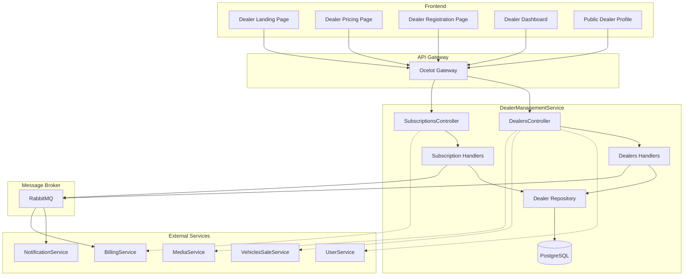

# 🏢 DealerManagementService - Matriz de Procesos

> **Servicio:** DealerManagementService  
> **Puerto:** 5039  
> **Base de Datos:** PostgreSQL (dealermanagement_db)  
> **Tecnología:** .NET 8, MediatR, Entity Framework Core  
> **Última actualización:** Enero 23, 2026  
> **Estado de Implementación:** ✅ 100% Completo

---

## 📊 Resumen de Implementación

| Componente               | Total | Implementado | Pendiente | Estado  |
| ------------------------ | ----- | ------------ | --------- | ------- |
| **Controllers**          | 3     | 3            | 0         | ✅ 100% |
| **Procesos (DEAL-\*)**   | 8     | 8            | 0         | ✅ 100% |
| **Procesos (SUB-\*)**    | 6     | 6            | 0         | ✅ 100% |
| **Procesos (LIMITS-\*)** | 3     | 3            | 0         | ✅ 100% |
| **Tests Unitarios**      | 25    | 25           | 0         | ✅ 100% |

### Leyenda de Estados

- ✅ **IMPLEMENTADO Y PROBADO**: Código completo con tests
- 🟢 **IMPLEMENTADO**: Código completo, falta testing
- 🟡 **EN PROGRESO**: Implementación parcial
- 🔴 **PENDIENTE**: No implementado

---

## 📋 Información General

| Aspecto           | Detalle                                                                                                                   |
| ----------------- | ------------------------------------------------------------------------------------------------------------------------- |
| **Servicio**      | DealerManagementService                                                                                                   |
| **Puerto**        | 5039                                                                                                                      |
| **Base de Datos** | PostgreSQL (dealermanagement_db)                                                                                          |
| **Tecnología**    | .NET 8, MediatR, Entity Framework Core                                                                                    |
| **Mensajería**    | RabbitMQ                                                                                                                  |
| **Descripción**   | Gestión completa del ciclo de vida de dealers: registro, verificación, suscripciones, perfil público y límites operativos |

---

## 🎯 Endpoints del Servicio

### DealersController - Gestión de Dealers

| Método | Endpoint                               | Descripción                             | Auth | Roles         |
| ------ | -------------------------------------- | --------------------------------------- | ---- | ------------- |
| `GET`  | `/api/dealers`                         | Listar dealers con paginación y filtros | ✅   | Admin         |
| `GET`  | `/api/dealers/{id}`                    | Obtener dealer por ID                   | ✅   | Admin, Owner  |
| `GET`  | `/api/dealers/user/{userId}`           | Obtener dealer por User ID              | ✅   | Authenticated |
| `POST` | `/api/dealers`                         | Crear nuevo registro de dealer          | ✅   | Authenticated |
| `PUT`  | `/api/dealers/{id}`                    | Actualizar información del dealer       | ✅   | Owner, Admin  |
| `POST` | `/api/dealers/{id}/verify`             | Verificar/aprobar dealer                | ✅   | Admin         |
| `GET`  | `/api/dealers/statistics`              | Estadísticas de dealers                 | ✅   | Admin         |
| `GET`  | `/api/dealers/public/{slug}`           | Perfil público del dealer (SEO)         | ❌   | Público       |
| `GET`  | `/api/dealers/trusted`                 | Lista de dealers verificados            | ❌   | Público       |
| `PUT`  | `/api/dealers/{id}/profile`            | Actualizar perfil público               | ✅   | Owner         |
| `GET`  | `/api/dealers/{id}/profile/completion` | Porcentaje de completitud del perfil    | ✅   | Owner         |

### SubscriptionsController - Gestión de Suscripciones

| Método | Endpoint                                                  | Descripción                           | Auth | Roles         |
| ------ | --------------------------------------------------------- | ------------------------------------- | ---- | ------------- |
| `GET`  | `/api/subscriptions/plans`                                | Obtener todos los planes disponibles  | ❌   | Público       |
| `GET`  | `/api/subscriptions/dealer/{dealerId}`                    | Obtener suscripción actual del dealer | ✅   | Owner, Admin  |
| `GET`  | `/api/subscriptions/user/{userId}`                        | Obtener suscripción por User ID       | ✅   | Owner, Admin  |
| `POST` | `/api/subscriptions/dealer/{dealerId}/change-plan`        | Cambiar plan de suscripción           | ✅   | Owner         |
| `GET`  | `/api/subscriptions/dealer/{dealerId}/can-action`         | Verificar si puede realizar acción    | ✅   | Owner, System |
| `POST` | `/api/subscriptions/dealer/{dealerId}/increment-listings` | Incrementar contador de listings      | ✅   | System        |
| `POST` | `/api/subscriptions/dealer/{dealerId}/decrement-listings` | Decrementar contador de listings      | ✅   | System        |

---

## 📊 Entidades del Dominio

### Dealer (Entidad Principal)

```csharp
public class Dealer
{
    // Identificación
    public Guid Id { get; set; }
    public Guid UserId { get; set; }                    // FK a UserService
    public string BusinessName { get; set; }            // Nombre comercial
    public string RNC { get; set; }                     // Registro Nacional Contribuyentes
    public string? LegalName { get; set; }              // Razón social
    public string? TradeName { get; set; }              // Nombre comercial alternativo
    public DealerType Type { get; set; }                // Tipo de dealer
    public DealerStatus Status { get; set; }            // Estado operativo
    public VerificationStatus VerificationStatus { get; set; }

    // Contacto
    public string Email { get; set; }
    public string Phone { get; set; }
    public string? MobilePhone { get; set; }
    public string? Website { get; set; }

    // Dirección
    public string Address { get; set; }
    public string City { get; set; }
    public string Province { get; set; }
    public string? ZipCode { get; set; }
    public string Country { get; set; } = "República Dominicana";

    // Perfil Público
    public string? Description { get; set; }
    public string? LogoUrl { get; set; }
    public string? BannerUrl { get; set; }
    public string? Slogan { get; set; }
    public string? AboutUs { get; set; }
    public List<string> Specialties { get; set; }       // Especialidades
    public List<string> SupportedBrands { get; set; }   // Marcas que maneja

    // Redes Sociales
    public string? FacebookUrl { get; set; }
    public string? InstagramUrl { get; set; }
    public string? TwitterUrl { get; set; }
    public string? YouTubeUrl { get; set; }
    public string? WhatsAppNumber { get; set; }

    // Opciones de Perfil
    public bool ShowPhoneOnProfile { get; set; }
    public bool ShowEmailOnProfile { get; set; }
    public bool AcceptsTradeIns { get; set; }           // Acepta intercambios
    public bool OffersFinancing { get; set; }           // Ofrece financiamiento
    public bool OffersWarranty { get; set; }            // Ofrece garantía
    public bool OffersHomeDelivery { get; set; }        // Entrega a domicilio

    // SEO
    public string? MetaTitle { get; set; }
    public string? MetaDescription { get; set; }
    public string? MetaKeywords { get; set; }
    public string Slug { get; set; }                    // URL amigable

    // Badges y Confianza
    public bool IsTrustedDealer { get; set; }
    public bool IsFoundingMember { get; set; }          // Miembro Fundador (Early Bird)
    public DateTime? TrustedDealerSince { get; set; }
    public double AverageRating { get; set; }
    public int TotalReviews { get; set; }
    public int TotalSales { get; set; }

    // Suscripción
    public Guid? SubscriptionId { get; set; }           // FK a BillingService
    public DealerPlan CurrentPlan { get; set; }
    public DateTime? SubscriptionStartDate { get; set; }
    public DateTime? SubscriptionEndDate { get; set; }
    public bool IsSubscriptionActive { get; set; }

    // Límites
    public int MaxActiveListings { get; set; }
    public int CurrentActiveListings { get; set; }

    // Auditoría
    public DateTime CreatedAt { get; set; }
    public DateTime? UpdatedAt { get; set; }
    public DateTime? VerifiedAt { get; set; }
    public Guid? VerifiedBy { get; set; }               // Admin que verificó
    public bool IsDeleted { get; set; }
    public DateTime? DeletedAt { get; set; }

    // Relaciones
    public List<DealerDocument> Documents { get; set; }
    public List<DealerLocation> Locations { get; set; }
}
```

### Enumeraciones

```csharp
public enum DealerType
{
    Independent = 0,    // Dealer independiente (una sola ubicación)
    Chain = 1,          // Cadena (múltiples ubicaciones, misma marca)
    MultipleStore = 2,  // Multi-marca (múltiples ubicaciones, diferentes marcas)
    Franchise = 3       // Franquicia autorizada
}

public enum DealerStatus
{
    Pending = 0,        // Registro enviado, esperando revisión
    UnderReview = 1,    // Admin está revisando
    Active = 2,         // Aprobado y operativo
    Suspended = 3,      // Suspendido temporalmente
    Rejected = 4,       // Registro rechazado
    Inactive = 5        // Desactivado por el dealer
}

public enum VerificationStatus
{
    NotVerified = 0,        // Sin verificar
    DocumentsUploaded = 1,  // Documentos subidos
    UnderReview = 2,        // En revisión
    Verified = 3,           // Verificado
    Rejected = 4,           // Rechazado
    RequiresMoreInfo = 5    // Requiere más información
}

public enum DealerPlan
{
    Free = 0,       // Plan gratuito
    Basic = 1,      // Plan básico
    Pro = 2,        // Plan profesional
    Enterprise = 3  // Plan empresarial
}
```

---

## 📦 Planes de Suscripción

| Plan           | Precio (DOP/mes) | Max Listings | Max Imágenes/Listing | Featured | Bulk Upload | Analytics | CRM |
| -------------- | ---------------- | ------------ | -------------------- | -------- | ----------- | --------- | --- |
| **Free**       | $0               | 3            | 5                    | ❌       | ❌          | ❌        | ❌  |
| **Basic**      | $49              | 50           | 10                   | 3        | ❌          | Básico    | ❌  |
| **Pro** ⭐     | $129             | 200          | 20                   | 10       | ✅          | Completo  | ✅  |
| **Enterprise** | $299             | ∞ Ilimitado  | 30                   | 25       | ✅          | Premium   | ✅  |

### Características Detalladas por Plan

```json
{
  "Free": {
    "Price": 0,
    "MaxListings": 3,
    "MaxImagesPerListing": 5,
    "MaxFeaturedListings": 0,
    "CanBulkUpload": false,
    "HasAnalytics": false,
    "HasCRM": false,
    "SupportLevel": "Community",
    "Features": [
      "Publicar hasta 3 vehículos",
      "5 imágenes por vehículo",
      "Perfil básico del dealer",
      "Estadísticas de vistas"
    ]
  },
  "Basic": {
    "Price": 49,
    "MaxListings": 50,
    "MaxImagesPerListing": 10,
    "MaxFeaturedListings": 3,
    "CanBulkUpload": false,
    "HasAnalytics": true,
    "AnalyticsLevel": "Basic",
    "HasCRM": false,
    "SupportLevel": "Email",
    "Features": [
      "Publicar hasta 50 vehículos",
      "10 imágenes por vehículo",
      "3 destacados al mes",
      "Badge de dealer verificado",
      "Estadísticas básicas",
      "Soporte por email"
    ]
  },
  "Pro": {
    "Price": 129,
    "MaxListings": 200,
    "MaxImagesPerListing": 20,
    "MaxFeaturedListings": 10,
    "CanBulkUpload": true,
    "HasAnalytics": true,
    "AnalyticsLevel": "Full",
    "HasCRM": true,
    "SupportLevel": "Priority",
    "IsPopular": true,
    "Features": [
      "Publicar hasta 200 vehículos",
      "20 imágenes por vehículo",
      "10 destacados al mes",
      "Importación CSV/Excel",
      "Analytics completo",
      "CRM integrado",
      "Múltiples sucursales",
      "Soporte prioritario"
    ]
  },
  "Enterprise": {
    "Price": 299,
    "MaxListings": -1,
    "MaxImagesPerListing": 30,
    "MaxFeaturedListings": 25,
    "CanBulkUpload": true,
    "HasAnalytics": true,
    "AnalyticsLevel": "Premium",
    "HasCRM": true,
    "SupportLevel": "Dedicated",
    "Features": [
      "Vehículos ILIMITADOS",
      "30 imágenes por vehículo",
      "25 destacados al mes",
      "API de integración",
      "Analytics premium con exportación",
      "CRM avanzado",
      "White-label options",
      "Account manager dedicado",
      "Integraciones personalizadas"
    ]
  }
}
```

---

## 🔄 Procesos Detallados

### PROCESO 1: Registro de Nuevo Dealer

#### Endpoint: `POST /api/dealers`

| Paso | Actor      | Acción                                             | Sistema                        | Resultado                 |
| ---- | ---------- | -------------------------------------------------- | ------------------------------ | ------------------------- |
| 1    | Usuario    | Envía formulario de registro con datos del negocio | Recibe request HTTP POST       | Request en cola           |
| 2    | API        | Valida token JWT                                   | Verifica autenticación         | Usuario identificado      |
| 3    | API        | Extrae UserId del token                            | JWT Claims parsing             | UserId disponible         |
| 4    | Validador  | Valida campos requeridos                           | FluentValidation               | Validación OK o Error 400 |
| 5    | Validador  | Valida formato RNC (9-11 dígitos)                  | Regex pattern                  | Formato correcto          |
| 6    | Handler    | Verifica que UserId no tenga dealer existente      | Query a DB                     | Sin duplicados            |
| 7    | Handler    | Genera slug único desde BusinessName               | GenerateSlug() method          | Slug SEO-friendly         |
| 8    | Handler    | Verifica unicidad del slug                         | Query a DB                     | Slug disponible           |
| 9    | Handler    | Crea entidad Dealer                                | new Dealer()                   | Entidad creada            |
| 10   | Handler    | Asigna Status = Pending                            | DealerStatus.Pending           | Estado inicial            |
| 11   | Handler    | Asigna VerificationStatus = NotVerified            | VerificationStatus.NotVerified | Sin verificar             |
| 12   | Handler    | Asigna CurrentPlan = Free                          | DealerPlan.Free                | Plan gratuito             |
| 13   | Handler    | Asigna MaxActiveListings = 3                       | Límite del plan Free           | Límite configurado        |
| 14   | Repository | Guarda en base de datos                            | INSERT dealer                  | Dealer persistido         |
| 15   | EventBus   | Publica DealerCreatedEvent                         | RabbitMQ publish               | Evento emitido            |
| 16   | API        | Retorna 201 Created                                | HTTP Response                  | DealerDto en respuesta    |

#### Request Body Esperado

```json
{
  "businessName": "AutoMax RD",
  "rnc": "123456789",
  "legalName": "AutoMax Dominicana SRL",
  "type": "Independent",
  "email": "ventas@automax.com.do",
  "phone": "809-555-1234",
  "mobilePhone": "849-555-5678",
  "website": "https://automax.com.do",
  "address": "Av. 27 de Febrero #123",
  "city": "Santo Domingo",
  "province": "Distrito Nacional",
  "zipCode": "10101",
  "description": "Dealer especializado en vehículos usados de alta calidad",
  "establishedDate": "2015-03-15",
  "employeeCount": 12
}
```

#### Response Esperado (201 Created)

```json
{
  "id": "3fa85f64-5717-4562-b3fc-2c963f66afa6",
  "userId": "user-uuid-here",
  "businessName": "AutoMax RD",
  "rnc": "123456789",
  "slug": "automax-rd",
  "type": "Independent",
  "status": "Pending",
  "verificationStatus": "NotVerified",
  "currentPlan": "Free",
  "maxActiveListings": 3,
  "currentActiveListings": 0,
  "createdAt": "2026-01-09T10:30:00Z"
}
```

---

### PROCESO 2: Verificación de Dealer (Admin)

#### Endpoint: `POST /api/dealers/{id}/verify`

| Paso | Actor               | Acción                                            | Sistema                   | Resultado                          |
| ---- | ------------------- | ------------------------------------------------- | ------------------------- | ---------------------------------- |
| 1    | Admin               | Envía request de verificación                     | HTTP POST con action      | Request recibido                   |
| 2    | API                 | Valida token JWT con rol Admin                    | Authorization check       | Rol Admin confirmado               |
| 3    | Handler             | Obtiene Dealer por ID                             | Repository.GetByIdAsync() | Dealer encontrado                  |
| 4    | Handler             | Valida que Status sea Pending o UnderReview       | Business rule check       | Estado válido para verificar       |
| 5    | Handler             | Evalúa action solicitada                          | switch(action)            | Determina flujo                    |
| 6a   | Handler             | Si action = "approve"                             | SetStatus(Active)         | Status = Active                    |
| 6b   | Handler             | Si action = "reject"                              | SetStatus(Rejected)       | Status = Rejected                  |
| 6c   | Handler             | Si action = "request_info"                        | SetStatus(UnderReview)    | Requiere más info                  |
| 7    | Handler             | Actualiza VerificationStatus                      | SetVerificationStatus()   | Verified/Rejected/RequiresMoreInfo |
| 8    | Handler             | Registra VerifiedAt y VerifiedBy                  | DateTime.UtcNow, AdminId  | Auditoría completa                 |
| 9    | Repository          | Actualiza en base de datos                        | UPDATE dealer             | Cambios persistidos                |
| 10   | EventBus            | Publica DealerVerifiedEvent o DealerRejectedEvent | RabbitMQ                  | Evento emitido                     |
| 11   | NotificationService | Envía email al dealer                             | Email notification        | Dealer notificado                  |
| 12   | API                 | Retorna 200 OK                                    | HTTP Response             | DealerDto actualizado              |

#### Request Body para Verificación

```json
{
  "action": "approve",
  "notes": "Documentos verificados correctamente. RNC válido en DGII.",
  "verifiedDocuments": ["RNC", "BusinessLicense", "IdentificationCard"]
}
```

#### Acciones Disponibles

| Action         | Resultado                | VerificationStatus | DealerStatus |
| -------------- | ------------------------ | ------------------ | ------------ |
| `approve`      | Dealer aprobado          | Verified           | Active       |
| `reject`       | Registro rechazado       | Rejected           | Rejected     |
| `request_info` | Solicitar más documentos | RequiresMoreInfo   | UnderReview  |

---

### PROCESO 3: Cambio de Plan de Suscripción

#### Endpoint: `POST /api/subscriptions/dealer/{dealerId}/change-plan`

| Paso | Actor          | Acción                                    | Sistema                           | Resultado                |
| ---- | -------------- | ----------------------------------------- | --------------------------------- | ------------------------ |
| 1    | Dealer         | Solicita cambio de plan                   | HTTP POST                         | Request recibido         |
| 2    | API            | Valida token JWT                          | Authorization                     | Usuario autenticado      |
| 3    | Handler        | Verifica que usuario sea dueño del dealer | UserId match                      | Autorizado               |
| 4    | Handler        | Obtiene Dealer por ID                     | Repository.GetByIdAsync()         | Dealer encontrado        |
| 5    | Handler        | Valida que dealer esté activo             | Status == Active                  | Dealer operativo         |
| 6    | Handler        | Obtiene plan actual                       | dealer.CurrentPlan                | Plan actual identificado |
| 7    | Handler        | Obtiene límites del nuevo plan            | GetPlanLimits(newPlan)            | Límites del nuevo plan   |
| 8    | Handler        | **Valida downgrade** (si aplica)          | CurrentActiveListings <= NewMax   | Sin exceso de listings   |
| 9    | Handler        | Si downgrade inválido                     | Retorna 400 Bad Request           | Mensaje de error         |
| 10   | Handler        | Actualiza CurrentPlan                     | dealer.CurrentPlan = newPlan      | Plan cambiado            |
| 11   | Handler        | Actualiza MaxActiveListings               | dealer.MaxActiveListings = newMax | Límite actualizado       |
| 12   | Handler        | Actualiza SubscriptionStartDate           | DateTime.UtcNow                   | Fecha de inicio          |
| 13   | Handler        | Calcula SubscriptionEndDate               | StartDate.AddMonths(1)            | Fecha de fin             |
| 14   | Repository     | Persiste cambios                          | UPDATE dealer                     | Cambios guardados        |
| 15   | EventBus       | Publica PlanChangedEvent                  | RabbitMQ                          | Evento emitido           |
| 16   | BillingService | Procesa cobro/crédito                     | Stripe/Azul API                   | Pago procesado           |
| 17   | API            | Retorna 200 OK                            | HTTP Response                     | Nueva suscripción        |

#### Validación de Downgrade

| Plan Actual | Nuevo Plan | Max Nuevo | Validación Requerida        |
| ----------- | ---------- | --------- | --------------------------- |
| Enterprise  | Pro        | 200       | CurrentActiveListings ≤ 200 |
| Enterprise  | Basic      | 50        | CurrentActiveListings ≤ 50  |
| Enterprise  | Free       | 3         | CurrentActiveListings ≤ 3   |
| Pro         | Basic      | 50        | CurrentActiveListings ≤ 50  |
| Pro         | Free       | 3         | CurrentActiveListings ≤ 3   |
| Basic       | Free       | 3         | CurrentActiveListings ≤ 3   |

#### Request Body

```json
{
  "newPlan": "Pro",
  "paymentMethodId": "pm_1234567890",
  "applyProration": true
}
```

#### Response (200 OK)

```json
{
  "dealerId": "dealer-uuid",
  "previousPlan": "Basic",
  "newPlan": "Pro",
  "previousMaxListings": 50,
  "newMaxListings": 200,
  "monthlyPrice": 129,
  "subscriptionStartDate": "2026-01-09T10:30:00Z",
  "subscriptionEndDate": "2026-02-09T10:30:00Z",
  "proratedAmount": 65.5,
  "message": "Plan actualizado exitosamente a Pro"
}
```

---

### PROCESO 4: Verificar si Puede Realizar Acción

#### Endpoint: `GET /api/subscriptions/dealer/{dealerId}/can-action?action={action}`

| Paso | Actor      | Acción                                     | Sistema                                   | Resultado              |
| ---- | ---------- | ------------------------------------------ | ----------------------------------------- | ---------------------- |
| 1    | Sistema/UI | Consulta permiso para acción               | HTTP GET                                  | Request recibido       |
| 2    | API        | Valida autenticación                       | JWT Token                                 | Autenticado            |
| 3    | Handler    | Obtiene Dealer por ID                      | Repository.GetByIdAsync()                 | Dealer encontrado      |
| 4    | Handler    | Obtiene suscripción activa                 | dealer.CurrentPlan                        | Plan identificado      |
| 5    | Handler    | Evalúa acción solicitada                   | switch(action)                            | Determina regla        |
| 6    | Handler    | **add_listing**: Verifica límite           | CurrentActiveListings < MaxActiveListings | Puede o no agregar     |
| 7    | Handler    | **add_featured**: Verifica límite featured | CurrentFeatured < MaxFeatured             | Puede o no destacar    |
| 8    | Handler    | **bulk_upload**: Verifica permiso          | Plan.CanBulkUpload                        | Pro/Enterprise only    |
| 9    | Handler    | **analytics**: Verifica acceso             | Plan.HasAnalytics                         | Basic+ tiene analytics |
| 10   | Handler    | **crm**: Verifica acceso                   | Plan.HasCRM                               | Pro+ tiene CRM         |
| 11   | API        | Retorna resultado                          | HTTP Response                             | CanPerform + Reason    |

#### Query Parameters

| Parámetro | Tipo   | Descripción        | Valores Válidos                                                  |
| --------- | ------ | ------------------ | ---------------------------------------------------------------- |
| `action`  | string | Acción a verificar | `add_listing`, `add_featured`, `bulk_upload`, `analytics`, `crm` |

#### Response (200 OK)

```json
{
  "dealerId": "dealer-uuid",
  "action": "add_listing",
  "canPerform": true,
  "currentUsage": 45,
  "limit": 200,
  "remaining": 155,
  "plan": "Pro"
}
```

#### Response cuando NO puede realizar acción

```json
{
  "dealerId": "dealer-uuid",
  "action": "add_listing",
  "canPerform": false,
  "currentUsage": 50,
  "limit": 50,
  "remaining": 0,
  "plan": "Basic",
  "reason": "Has alcanzado el límite de 50 publicaciones de tu plan Basic",
  "suggestedPlan": "Pro",
  "suggestedPlanLimit": 200,
  "suggestedPlanPrice": 129
}
```

---

### PROCESO 5: Incrementar/Decrementar Listings

#### Endpoint: `POST /api/subscriptions/dealer/{dealerId}/increment-listings`

| Paso | Actor               | Acción                    | Sistema                                   | Resultado            |
| ---- | ------------------- | ------------------------- | ----------------------------------------- | -------------------- |
| 1    | VehiclesSaleService | Publica vehículo nuevo    | HTTP POST (service-to-service)            | Request recibido     |
| 2    | API                 | Valida token de servicio  | Service JWT                               | Autorizado           |
| 3    | Handler             | Obtiene Dealer por ID     | Repository.GetByIdAsync()                 | Dealer encontrado    |
| 4    | Handler             | Valida límite no excedido | CurrentActiveListings < MaxActiveListings | Puede incrementar    |
| 5    | Handler             | Incrementa contador       | CurrentActiveListings++                   | Contador actualizado |
| 6    | Repository          | Persiste cambio           | UPDATE dealer                             | Cambio guardado      |
| 7    | API                 | Retorna nuevo estado      | HTTP 200                                  | Nuevo conteo         |

#### Endpoint: `POST /api/subscriptions/dealer/{dealerId}/decrement-listings`

| Paso | Actor               | Acción                   | Sistema                         | Resultado            |
| ---- | ------------------- | ------------------------ | ------------------------------- | -------------------- |
| 1    | VehiclesSaleService | Elimina/pausa vehículo   | HTTP POST (service-to-service)  | Request recibido     |
| 2    | API                 | Valida token de servicio | Service JWT                     | Autorizado           |
| 3    | Handler             | Obtiene Dealer por ID    | Repository.GetByIdAsync()       | Dealer encontrado    |
| 4    | Handler             | Decrementa contador      | CurrentActiveListings-- (min 0) | Contador actualizado |
| 5    | Repository          | Persiste cambio          | UPDATE dealer                   | Cambio guardado      |
| 6    | API                 | Retorna nuevo estado     | HTTP 200                        | Nuevo conteo         |

#### Response

```json
{
  "dealerId": "dealer-uuid",
  "currentActiveListings": 46,
  "maxActiveListings": 200,
  "remaining": 154
}
```

---

### PROCESO 6: Obtener Perfil Público (SEO)

#### Endpoint: `GET /api/dealers/public/{slug}`

| Paso | Actor     | Acción                     | Sistema                     | Resultado              |
| ---- | --------- | -------------------------- | --------------------------- | ---------------------- |
| 1    | Visitante | Navega a perfil de dealer  | HTTP GET (sin auth)         | Request recibido       |
| 2    | Handler   | Busca dealer por slug      | Repository.GetBySlugAsync() | Dealer encontrado      |
| 3    | Handler   | Valida que Status = Active | dealer.Status == Active     | Dealer activo          |
| 4    | Handler   | Filtra datos públicos      | Select public fields only   | Solo campos públicos   |
| 5    | Handler   | Incluye listings activos   | GetActiveListings()         | Vehículos del dealer   |
| 6    | Handler   | Incluye rating y reviews   | GetReviewSummary()          | Resumen de reseñas     |
| 7    | Handler   | Incluye ubicaciones        | GetLocations()              | Sucursales             |
| 8    | API       | Retorna perfil público     | HTTP 200                    | PublicDealerProfileDto |

#### Response (200 OK)

```json
{
  "slug": "automax-rd",
  "businessName": "AutoMax RD",
  "slogan": "Tu próximo vehículo te espera",
  "aboutUs": "Más de 10 años de experiencia...",
  "logoUrl": "https://cdn.okla.com.do/dealers/automax/logo.png",
  "bannerUrl": "https://cdn.okla.com.do/dealers/automax/banner.jpg",
  "specialties": ["SUVs", "Camionetas", "Vehículos Americanos"],
  "supportedBrands": ["Toyota", "Honda", "Jeep", "Ford"],
  "isTrustedDealer": true,
  "isFoundingMember": true,
  "trustedDealerSince": "2026-01-15T00:00:00Z",
  "averageRating": 4.7,
  "totalReviews": 156,
  "totalSales": 342,
  "contact": {
    "phone": "809-555-1234",
    "whatsApp": "849-555-5678",
    "email": "ventas@automax.com.do",
    "website": "https://automax.com.do"
  },
  "socialMedia": {
    "facebook": "https://facebook.com/automaxrd",
    "instagram": "https://instagram.com/automaxrd"
  },
  "services": {
    "acceptsTradeIns": true,
    "offersFinancing": true,
    "offersWarranty": true,
    "offersHomeDelivery": true
  },
  "locations": [
    {
      "name": "Sucursal Principal",
      "address": "Av. 27 de Febrero #123",
      "city": "Santo Domingo",
      "phone": "809-555-1234",
      "latitude": 18.4861,
      "longitude": -69.9312
    }
  ],
  "activeListingsCount": 45,
  "featuredListings": [
    {
      "id": "vehicle-uuid-1",
      "title": "Toyota RAV4 2023",
      "price": 1850000,
      "imageUrl": "..."
    }
  ],
  "meta": {
    "title": "AutoMax RD - Vehículos Usados de Calidad",
    "description": "Encuentra tu próximo vehículo...",
    "keywords": "carros usados, vehículos Santo Domingo, AutoMax"
  }
}
```

---

### PROCESO 7: Listar Dealers Verificados (Trusted)

#### Endpoint: `GET /api/dealers/trusted`

| Paso | Actor     | Acción                                   | Sistema             | Resultado            |
| ---- | --------- | ---------------------------------------- | ------------------- | -------------------- |
| 1    | Visitante | Solicita lista de dealers confiables     | HTTP GET (sin auth) | Request recibido     |
| 2    | Handler   | Query dealers con IsTrustedDealer = true | Repository query    | Lista filtrada       |
| 3    | Handler   | Filtra solo Status = Active              | WHERE clause        | Solo activos         |
| 4    | Handler   | Ordena por TotalSales DESC               | ORDER BY            | Mejores primero      |
| 5    | Handler   | Aplica paginación                        | Take/Skip           | Página solicitada    |
| 6    | API       | Retorna lista                            | HTTP 200            | TrustedDealerListDto |

#### Query Parameters

| Parámetro  | Tipo   | Default | Descripción                      |
| ---------- | ------ | ------- | -------------------------------- |
| `page`     | int    | 1       | Número de página                 |
| `pageSize` | int    | 20      | Tamaño de página                 |
| `city`     | string | null    | Filtrar por ciudad               |
| `sortBy`   | string | "sales" | Ordenar por: sales, rating, name |

#### Response (200 OK)

```json
{
  "items": [
    {
      "slug": "automax-rd",
      "businessName": "AutoMax RD",
      "logoUrl": "...",
      "city": "Santo Domingo",
      "averageRating": 4.7,
      "totalReviews": 156,
      "totalSales": 342,
      "activeListingsCount": 45,
      "specialties": ["SUVs", "Camionetas"],
      "isFoundingMember": true
    }
  ],
  "totalCount": 52,
  "page": 1,
  "pageSize": 20,
  "totalPages": 3
}
```

---

### PROCESO 8: Actualizar Perfil Público

#### Endpoint: `PUT /api/dealers/{id}/profile`

| Paso | Actor      | Acción                                | Sistema                          | Resultado           |
| ---- | ---------- | ------------------------------------- | -------------------------------- | ------------------- |
| 1    | Dealer     | Envía actualización de perfil         | HTTP PUT                         | Request recibido    |
| 2    | API        | Valida token JWT                      | Authorization                    | Usuario autenticado |
| 3    | Handler    | Verifica ownership                    | dealer.UserId == currentUserId   | Autorizado          |
| 4    | Validador  | Valida datos del perfil               | FluentValidation                 | Datos válidos       |
| 5    | Handler    | Si cambia BusinessName, regenera slug | GenerateSlug()                   | Nuevo slug          |
| 6    | Handler    | Valida unicidad del nuevo slug        | Query DB                         | Slug disponible     |
| 7    | Handler    | Actualiza campos del perfil           | Mapper update                    | Campos actualizados |
| 8    | Handler    | Calcula ProfileCompletion             | GetProfileCompletionPercentage() | Nuevo porcentaje    |
| 9    | Repository | Persiste cambios                      | UPDATE dealer                    | Cambios guardados   |
| 10   | EventBus   | Publica DealerProfileUpdatedEvent     | RabbitMQ                         | Evento emitido      |
| 11   | API        | Retorna perfil actualizado            | HTTP 200                         | DealerProfileDto    |

#### Request Body

```json
{
  "slogan": "Tu próximo vehículo te espera",
  "aboutUs": "AutoMax RD es líder en venta de vehículos...",
  "specialties": ["SUVs", "Camionetas", "Vehículos Americanos"],
  "supportedBrands": ["Toyota", "Honda", "Jeep", "Ford"],
  "logoUrl": "https://cdn.okla.com.do/dealers/automax/logo.png",
  "bannerUrl": "https://cdn.okla.com.do/dealers/automax/banner.jpg",
  "facebookUrl": "https://facebook.com/automaxrd",
  "instagramUrl": "https://instagram.com/automaxrd",
  "whatsAppNumber": "18495555678",
  "showPhoneOnProfile": true,
  "showEmailOnProfile": false,
  "acceptsTradeIns": true,
  "offersFinancing": true,
  "offersWarranty": true,
  "offersHomeDelivery": true,
  "metaTitle": "AutoMax RD - Vehículos Usados de Calidad",
  "metaDescription": "Encuentra tu próximo vehículo usado en AutoMax RD...",
  "metaKeywords": "carros usados, vehículos Santo Domingo"
}
```

---

### PROCESO 9: Obtener Completitud del Perfil

#### Endpoint: `GET /api/dealers/{id}/profile/completion`

| Paso | Actor   | Acción                      | Sistema                          | Resultado            |
| ---- | ------- | --------------------------- | -------------------------------- | -------------------- |
| 1    | Dealer  | Solicita estado del perfil  | HTTP GET                         | Request recibido     |
| 2    | Handler | Obtiene dealer              | Repository.GetByIdAsync()        | Dealer encontrado    |
| 3    | Handler | Calcula porcentaje          | GetProfileCompletionPercentage() | Porcentaje calculado |
| 4    | Handler | Identifica campos faltantes | Check each field                 | Lista de campos      |
| 5    | API     | Retorna detalle             | HTTP 200                         | ProfileCompletionDto |

#### Response (200 OK)

```json
{
  "dealerId": "dealer-uuid",
  "completionPercentage": 75,
  "totalFields": 20,
  "completedFields": 15,
  "missingFields": [
    {
      "field": "aboutUs",
      "label": "Acerca de Nosotros",
      "importance": "High",
      "tip": "Cuenta la historia de tu negocio para generar confianza"
    },
    {
      "field": "bannerUrl",
      "label": "Imagen de Banner",
      "importance": "Medium",
      "tip": "Un banner atractivo mejora la primera impresión"
    },
    {
      "field": "instagramUrl",
      "label": "Instagram",
      "importance": "Low",
      "tip": "Conecta tu Instagram para mostrar más contenido"
    },
    {
      "field": "youtubeUrl",
      "label": "YouTube",
      "importance": "Low",
      "tip": "Comparte videos de tus vehículos"
    },
    {
      "field": "locations",
      "label": "Sucursales",
      "importance": "Medium",
      "tip": "Agrega tus ubicaciones para que te encuentren fácilmente"
    }
  ],
  "recommendations": [
    "Completa tu perfil al 100% para aparecer en búsquedas destacadas",
    "Los dealers con perfil completo reciben 3x más contactos"
  ]
}
```

---

## 🔌 Diagrama de Integración



---

## 🔔 Eventos de Dominio (RabbitMQ)

### Eventos Publicados

| Evento                       | Exchange              | Routing Key                  | Payload                                   |
| ---------------------------- | --------------------- | ---------------------------- | ----------------------------------------- |
| `DealerCreatedEvent`         | `dealer.events`       | `dealer.created`             | DealerId, UserId, BusinessName, CreatedAt |
| `DealerUpdatedEvent`         | `dealer.events`       | `dealer.updated`             | DealerId, ChangedFields, UpdatedAt        |
| `DealerVerifiedEvent`        | `dealer.events`       | `dealer.verified`            | DealerId, VerifiedBy, VerifiedAt          |
| `DealerRejectedEvent`        | `dealer.events`       | `dealer.rejected`            | DealerId, RejectedBy, Reason              |
| `DealerSuspendedEvent`       | `dealer.events`       | `dealer.suspended`           | DealerId, Reason, SuspendedAt             |
| `DealerReactivatedEvent`     | `dealer.events`       | `dealer.reactivated`         | DealerId, ReactivatedAt                   |
| `PlanChangedEvent`           | `subscription.events` | `subscription.plan_changed`  | DealerId, OldPlan, NewPlan, EffectiveAt   |
| `SubscriptionActivatedEvent` | `subscription.events` | `subscription.activated`     | DealerId, Plan, StartDate, EndDate        |
| `SubscriptionCancelledEvent` | `subscription.events` | `subscription.cancelled`     | DealerId, CancelledAt, Reason             |
| `ListingLimitReachedEvent`   | `subscription.events` | `subscription.limit_reached` | DealerId, CurrentListings, MaxListings    |
| `DealerProfileUpdatedEvent`  | `dealer.events`       | `dealer.profile_updated`     | DealerId, CompletionPercentage            |

### Eventos Consumidos

| Evento                    | Origen              | Acción                                 |
| ------------------------- | ------------------- | -------------------------------------- |
| `PaymentCompletedEvent`   | BillingService      | Activar/Renovar suscripción            |
| `PaymentFailedEvent`      | BillingService      | Suspender por falta de pago            |
| `VehiclePublishedEvent`   | VehiclesSaleService | Incrementar CurrentActiveListings      |
| `VehicleUnpublishedEvent` | VehiclesSaleService | Decrementar CurrentActiveListings      |
| `ReviewCreatedEvent`      | ReviewService       | Actualizar AverageRating, TotalReviews |
| `SaleCompletedEvent`      | SalesService        | Incrementar TotalSales                 |

---

## ⚠️ Reglas de Negocio

### Registro de Dealer

| #   | Regla                                 | Validación                                      |
| --- | ------------------------------------- | ----------------------------------------------- |
| 1   | Un usuario solo puede tener un dealer | Query por UserId antes de crear                 |
| 2   | RNC debe ser válido (9-11 dígitos)    | Regex pattern + posible validación DGII         |
| 3   | BusinessName debe ser único           | Unique constraint en DB                         |
| 4   | Slug debe ser único                   | Generado desde BusinessName, verificar unicidad |
| 5   | Email debe ser válido                 | FluentValidation EmailValidator                 |
| 6   | Teléfono formato dominicano           | Pattern: 809/829/849-XXX-XXXX                   |

### Suscripciones

| #   | Regla                                            | Validación                                   |
| --- | ------------------------------------------------ | -------------------------------------------- |
| 1   | No se puede downgrade si listings exceden límite | CurrentActiveListings <= NewPlan.MaxListings |
| 2   | Plan Free no permite featured listings           | MaxFeaturedListings = 0                      |
| 3   | Bulk upload solo para Pro/Enterprise             | Plan.CanBulkUpload check                     |
| 4   | CRM solo para Pro/Enterprise                     | Plan.HasCRM check                            |
| 5   | Suscripción debe estar activa para publicar      | IsSubscriptionActive == true                 |
| 6   | Early Bird: 20% descuento de por vida            | Si IsFoundingMember == true                  |

### Verificación

| #   | Regla                                                  | Validación          |
| --- | ------------------------------------------------------ | ------------------- |
| 1   | Solo Admin puede verificar dealers                     | Role == Admin       |
| 2   | Documentos requeridos: RNC, Licencia Comercial, Cédula | Check uploaded docs |
| 3   | Dealer debe estar en Pending o UnderReview             | Status validation   |
| 4   | Después de verificación, Status = Active o Rejected    | State machine       |

### Perfil Público

| #   | Regla                                          | Validación                                         |
| --- | ---------------------------------------------- | -------------------------------------------------- |
| 1   | Solo dealers Active aparecen en público        | Status == Active filter                            |
| 2   | Slug es la URL pública                         | /dealers/public/{slug}                             |
| 3   | IsTrustedDealer requiere verificación + ventas | VerificationStatus == Verified && TotalSales >= 10 |
| 4   | IsFoundingMember es permanente                 | Set at registration during Early Bird period       |

---

## ❌ Códigos de Error

| Código       | HTTP Status | Mensaje                                  | Causa                                      |
| ------------ | ----------- | ---------------------------------------- | ------------------------------------------ |
| `DEALER_001` | 400         | Usuario ya tiene un dealer registrado    | UserId duplicado                           |
| `DEALER_002` | 400         | RNC inválido                             | Formato incorrecto                         |
| `DEALER_003` | 400         | BusinessName ya existe                   | Nombre duplicado                           |
| `DEALER_004` | 400         | Slug ya existe                           | Colisión de slug                           |
| `DEALER_005` | 404         | Dealer no encontrado                     | ID inexistente                             |
| `DEALER_006` | 403         | No autorizado para modificar este dealer | UserId no coincide                         |
| `DEALER_007` | 400         | Dealer no está activo                    | Status != Active                           |
| `SUB_001`    | 400         | Plan no válido                           | Plan no existe                             |
| `SUB_002`    | 400         | No puede hacer downgrade                 | Listings exceden límite                    |
| `SUB_003`    | 400         | Suscripción no activa                    | IsSubscriptionActive == false              |
| `SUB_004`    | 403         | Límite de listings alcanzado             | CurrentActiveListings >= MaxActiveListings |
| `SUB_005`    | 403         | Función no disponible en tu plan         | Feature not in plan                        |
| `VERIFY_001` | 403         | Solo administradores pueden verificar    | Role != Admin                              |
| `VERIFY_002` | 400         | Estado no válido para verificación       | Status not Pending/UnderReview             |
| `VERIFY_003` | 400         | Documentos incompletos                   | Missing required docs                      |

---

## ⚙️ Configuración del Servicio

### appsettings.json

```json
{
  "ConnectionStrings": {
    "DefaultConnection": "Host=postgres;Database=dealermanagement_db;Username=postgres;Password=xxx"
  },
  "JwtSettings": {
    "Secret": "xxx",
    "Issuer": "cardealer",
    "Audience": "cardealer-services",
    "ExpiryInMinutes": 1440
  },
  "RabbitMQ": {
    "Host": "rabbitmq",
    "Port": 5672,
    "Username": "guest",
    "Password": "guest",
    "VirtualHost": "/",
    "Exchange": "dealer.events"
  },
  "Plans": {
    "Free": {
      "MaxListings": 3,
      "MaxImagesPerListing": 5,
      "MaxFeaturedListings": 0,
      "CanBulkUpload": false,
      "HasAnalytics": false,
      "HasCRM": false
    },
    "Basic": {
      "Price": 49,
      "MaxListings": 50,
      "MaxImagesPerListing": 10,
      "MaxFeaturedListings": 3,
      "CanBulkUpload": false,
      "HasAnalytics": true,
      "HasCRM": false
    },
    "Pro": {
      "Price": 129,
      "MaxListings": 200,
      "MaxImagesPerListing": 20,
      "MaxFeaturedListings": 10,
      "CanBulkUpload": true,
      "HasAnalytics": true,
      "HasCRM": true
    },
    "Enterprise": {
      "Price": 299,
      "MaxListings": -1,
      "MaxImagesPerListing": 30,
      "MaxFeaturedListings": 25,
      "CanBulkUpload": true,
      "HasAnalytics": true,
      "HasCRM": true
    }
  },
  "EarlyBird": {
    "DiscountPercentage": 20,
    "FreeMonths": 3,
    "Deadline": "2026-01-31T23:59:59Z"
  },
  "ProfileCompletion": {
    "MinimumForTrustedBadge": 80,
    "FieldsRequired": [
      "BusinessName",
      "Description",
      "LogoUrl",
      "Address",
      "Phone"
    ]
  }
}
```

---

## 🔒 Seguridad

### Autenticación y Autorización

| Endpoint                                      | Autenticación    | Autorización  |
| --------------------------------------------- | ---------------- | ------------- |
| GET /api/dealers                              | ✅ JWT Required  | Admin only    |
| GET /api/dealers/{id}                         | ✅ JWT Required  | Admin o Owner |
| POST /api/dealers                             | ✅ JWT Required  | Authenticated |
| PUT /api/dealers/{id}                         | ✅ JWT Required  | Owner o Admin |
| POST /api/dealers/{id}/verify                 | ✅ JWT Required  | Admin only    |
| GET /api/dealers/public/{slug}                | ❌ Public        | -             |
| GET /api/dealers/trusted                      | ❌ Public        | -             |
| GET /api/subscriptions/plans                  | ❌ Public        | -             |
| POST /api/subscriptions/\*/change-plan        | ✅ JWT Required  | Owner         |
| POST /api/subscriptions/\*/increment-listings | ✅ Service Token | System        |

### Validaciones de Seguridad

1. **Ownership Check**: Dealers solo pueden modificar su propio perfil
2. **Admin Check**: Verificación y estadísticas solo para Admin
3. **Service-to-Service Auth**: Increment/Decrement listings usa service tokens
4. **Rate Limiting**: 100 requests/min por IP para endpoints públicos
5. **Data Sanitization**: HTML stripped de campos de texto libre

---

## 📈 Métricas y Observabilidad

### Health Checks

```
GET /health
GET /health/ready
GET /health/live
```

### Métricas Prometheus

| Métrica                         | Tipo    | Labels             | Descripción                         |
| ------------------------------- | ------- | ------------------ | ----------------------------------- |
| `dealer_registrations_total`    | Counter | status             | Total de registros                  |
| `dealer_verifications_total`    | Counter | result             | Verificaciones (approve/reject)     |
| `dealer_plan_changes_total`     | Counter | from_plan, to_plan | Cambios de plan                     |
| `dealer_active_count`           | Gauge   | plan               | Dealers activos por plan            |
| `dealer_listings_usage_ratio`   | Gauge   | dealer_id          | Uso de listings (current/max)       |
| `dealer_profile_completion_avg` | Gauge   | -                  | Promedio de completitud de perfiles |
| `subscription_revenue_monthly`  | Gauge   | plan               | Ingreso mensual por plan            |

---

## 📚 Referencias

- [Dealer Entity](../../backend/DealerManagementService/DealerManagementService.Domain/Entities/Dealer.cs)
- [DealersController](../../backend/DealerManagementService/DealerManagementService.Api/Controllers/DealersController.cs)
- [SubscriptionsController](../../backend/DealerManagementService/DealerManagementService.Api/Controllers/SubscriptionsController.cs)
- [Sprint 5 Documentation](../../docs/SPRINT_5_DEALER_DASHBOARD_COMPLETED.md)
- [Copilot Instructions](../../.github/copilot-instructions.md)

---

**Última actualización:** Enero 9, 2026  
**Autor:** Sistema de Documentación Automatizado  
**Versión:** 1.0.0
