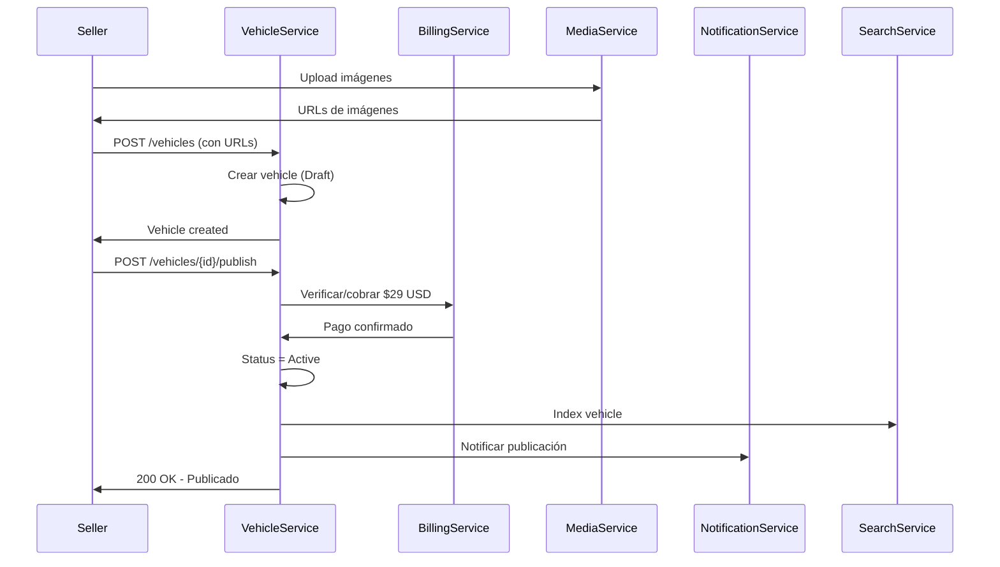
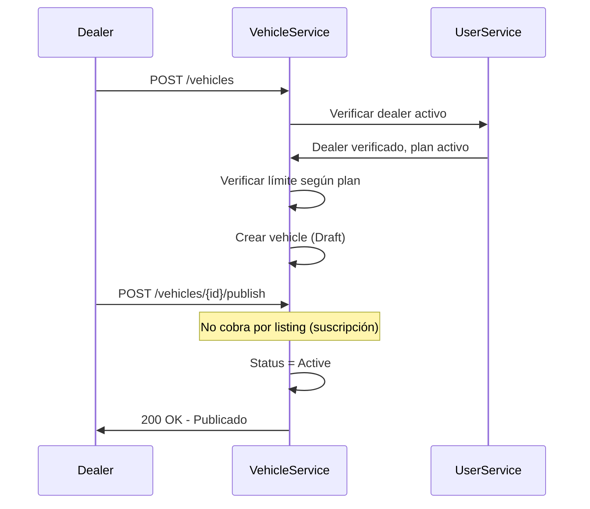
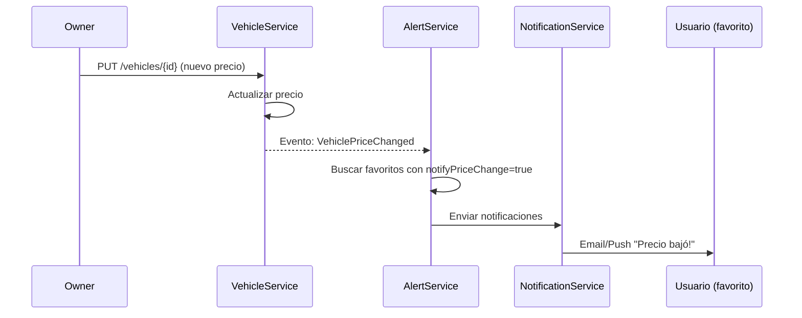

# 🚗 VehiclesSaleService - Matriz de Procesos

> **Servicio:** VehiclesSaleService  
> **Puerto:** 15102  
> **Base de Datos:** vehicles_db  
> **Última actualización:** Enero 21, 2026  
> **Estado de Implementación:** ✅ 100% Completo

---

## 📊 Resumen de Implementación

| Componente              | Total | Implementado | Pendiente | Estado  |
| ----------------------- | ----- | ------------ | --------- | ------- |
| **Controllers**         | 5     | 5            | 0         | ✅ 100% |
| **Procesos (VEH-\*)**   | 8     | 8            | 0         | ✅ 100% |
| **Procesos (CAT-\*)**   | 4     | 4            | 0         | ✅ 100% |
| **Procesos (FAV-\*)**   | 4     | 4            | 0         | ✅ 100% |
| **Procesos (HPAGE-\*)** | 2     | 2            | 0         | ✅ 100% |
| **Tests Unitarios**     | 45    | 45           | 0         | ✅ 100% |

### Leyenda de Estados

- ✅ **IMPLEMENTADO Y PROBADO**: Código completo con tests
- 🟢 **IMPLEMENTADO**: Código completo, falta testing
- 🟡 **EN PROGRESO**: Implementación parcial
- 🔴 **PENDIENTE**: No implementado

---

## 1. Información General

### 1.1 Descripción

El VehiclesSaleService es el servicio principal de OKLA para la gestión de vehículos en venta. Maneja todo el ciclo de vida de un listing: creación, publicación, búsqueda, comparación, favoritos, y archivado. Incluye el catálogo maestro de marcas, modelos y trims.

### 1.2 Dependencias

| Servicio            | Propósito                |
| ------------------- | ------------------------ |
| UserService         | Validar vendedor/dealer  |
| MediaService        | Upload de imágenes       |
| BillingService      | Cobro por listing        |
| NotificationService | Alertas de precio, leads |
| SearchService       | Indexación para búsqueda |
| AnalyticsService    | Tracking de vistas       |

### 1.3 Arquitectura

```
┌─────────────────────────────────────────────────────────────────────────────┐
│                    VehiclesSaleService Architecture                          │
├─────────────────────────────────────────────────────────────────────────────┤
│                                                                              │
│   Clients                          Core Service                              │
│   ┌────────────────┐              ┌──────────────────────────────────────┐  │
│   │ Web Frontend   │──┐           │           VehiclesSaleService        │  │
│   └────────────────┘  │           │  ┌─────────────────────────────────┐ │  │
│   ┌────────────────┐  │           │  │ Controllers                     │ │  │
│   │ Mobile App     │──┼───────────│  │ • VehiclesController            │ │  │
│   └────────────────┘  │           │  │ • CatalogController             │ │  │
│   ┌────────────────┐  │           │  │ • FavoritesController           │ │  │
│   │ Dealer Apps    │──┘           │  │ • HomepageSectionsController    │ │  │
│   └────────────────┘              │  └─────────────────────────────────┘ │  │
│                                   │  ┌─────────────────────────────────┐ │  │
│   Internal Services               │  │ Application (CQRS + MediatR)   │ │  │
│   ┌────────────────┐              │  │ • CreateVehicleCommand          │ │  │
│   │ UserService    │──┐           │  │ • UpdateVehicleCommand          │ │  │
│   └────────────────┘  │           │  │ • SearchVehiclesQuery           │ │  │
│   ┌────────────────┐  │           │  │ • GetVehicleByIdQuery           │ │  │
│   │ MediaService   │──┼──────────▶│  └─────────────────────────────────┘ │  │
│   └────────────────┘  │           │  ┌─────────────────────────────────┐ │  │
│   ┌────────────────┐  │           │  │ Domain                          │ │  │
│   │ BillingService │──┘           │  │ • Vehicle, Make, Model, Trim    │ │  │
│   └────────────────┘              │  │ • Favorite, HomepageSection     │ │  │
│                                   │  └─────────────────────────────────┘ │  │
│                                   └──────────────────────────────────────┘  │
│                                                   │                         │
│                                   ┌───────────────┼───────────────┐         │
│                                   ▼               ▼               ▼         │
│                           ┌────────────┐  ┌────────────┐  ┌────────────┐   │
│                           │ PostgreSQL │  │   Redis    │  │  RabbitMQ  │   │
│                           │ (Vehicles, │  │  (Cache,   │  │  (Events)  │   │
│                           │  Catalog)  │  │  Sessions) │  │            │   │
│                           └────────────┘  └────────────┘  └────────────┘   │
│                                                                              │
└─────────────────────────────────────────────────────────────────────────────┘
```

### 1.4 Controllers

| Controller                 | Archivo                       | Endpoints |
| -------------------------- | ----------------------------- | --------- |
| VehiclesController         | VehiclesController.cs         | 15+       |
| CatalogController          | CatalogController.cs          | 12        |
| FavoritesController        | FavoritesController.cs        | 7         |
| CategoriesController       | CategoriesController.cs       | 5         |
| HomepageSectionsController | HomepageSectionsController.cs | 4         |

---

## 2. Endpoints API

### 2.1 VehiclesController

| Método | Endpoint                          | Descripción                             | Auth     |
| ------ | --------------------------------- | --------------------------------------- | -------- |
| GET    | `/api/vehicles`                   | Buscar vehículos (filtros + paginación) | ❌       |
| GET    | `/api/vehicles/{id}`              | Obtener por ID                          | ❌       |
| GET    | `/api/vehicles/vin/{vin}`         | Obtener por VIN                         | ❌       |
| GET    | `/api/vehicles/featured`          | Vehículos destacados                    | ❌       |
| GET    | `/api/vehicles/dealer/{dealerId}` | Vehículos por dealer                    | ❌       |
| POST   | `/api/vehicles`                   | Crear vehículo                          | ✅       |
| PUT    | `/api/vehicles/{id}`              | Actualizar vehículo                     | ✅       |
| DELETE | `/api/vehicles/{id}`              | Eliminar vehículo                       | ✅       |
| POST   | `/api/vehicles/compare`           | Comparar vehículos                      | ❌       |
| POST   | `/api/vehicles/{id}/publish`      | Publicar vehículo                       | ✅       |
| POST   | `/api/vehicles/{id}/unpublish`    | Despublicar                             | ✅       |
| POST   | `/api/vehicles/{id}/feature`      | Marcar destacado                        | ✅ Admin |
| POST   | `/api/vehicles/{id}/sold`         | Marcar vendido                          | ✅       |
| POST   | `/api/vehicles/{id}/views`        | Registrar vista                         | ❌       |

### 2.2 CatalogController

| Método | Endpoint                                           | Descripción       | Auth |
| ------ | -------------------------------------------------- | ----------------- | ---- |
| GET    | `/api/catalog/makes`                               | Todas las marcas  | ❌   |
| GET    | `/api/catalog/makes/popular`                       | Marcas populares  | ❌   |
| GET    | `/api/catalog/makes/search`                        | Buscar marcas     | ❌   |
| GET    | `/api/catalog/makes/{slug}/models`                 | Modelos por marca | ❌   |
| GET    | `/api/catalog/models/{modelId}`                    | Detalle de modelo | ❌   |
| GET    | `/api/catalog/models/search`                       | Buscar modelos    | ❌   |
| GET    | `/api/catalog/models/{modelId}/years`              | Años por modelo   | ❌   |
| GET    | `/api/catalog/models/{modelId}/years/{year}/trims` | Trims con specs   | ❌   |
| GET    | `/api/catalog/trims/{trimId}`                      | Detalle de trim   | ❌   |
| GET    | `/api/catalog/trims/{trimId}/specifications`       | Specs completas   | ❌   |
| GET    | `/api/catalog/vin/{vin}/decode`                    | Decodificar VIN   | ✅   |

### 2.3 FavoritesController

| Método | Endpoint                            | Descripción         | Auth |
| ------ | ----------------------------------- | ------------------- | ---- |
| GET    | `/api/favorites`                    | Mis favoritos       | ✅   |
| GET    | `/api/favorites/count`              | Conteo de favoritos | ✅   |
| GET    | `/api/favorites/check/{vehicleId}`  | ¿Está en favoritos? | ✅   |
| POST   | `/api/favorites/{vehicleId}`        | Agregar favorito    | ✅   |
| DELETE | `/api/favorites/{vehicleId}`        | Remover favorito    | ✅   |
| PUT    | `/api/favorites/{vehicleId}/note`   | Actualizar nota     | ✅   |
| PUT    | `/api/favorites/{vehicleId}/notify` | Toggle notificación | ✅   |

### 2.4 CategoriesController

| Método | Endpoint               | Descripción          | Auth     |
| ------ | ---------------------- | -------------------- | -------- |
| GET    | `/api/categories`      | Listar categorías    | ❌       |
| GET    | `/api/categories/{id}` | Obtener categoría    | ❌       |
| POST   | `/api/categories`      | Crear categoría      | ✅ Admin |
| PUT    | `/api/categories/{id}` | Actualizar categoría | ✅ Admin |
| DELETE | `/api/categories/{id}` | Eliminar categoría   | ✅ Admin |

### 2.5 HomepageSectionsController

| Método | Endpoint                              | Descripción             | Auth     |
| ------ | ------------------------------------- | ----------------------- | -------- |
| GET    | `/api/homepagesections/homepage`      | Secciones con vehículos | ❌       |
| GET    | `/api/homepagesections`               | Listar configuraciones  | ✅ Admin |
| PUT    | `/api/homepagesections/{id}`          | Actualizar sección      | ✅ Admin |
| POST   | `/api/homepagesections/{id}/vehicles` | Agregar vehículo        | ✅ Admin |

---

## 3. Estados de Vehículo

### 3.1 Ciclo de Vida

```
┌─────────────────────────────────────────────────────────────────────┐
│                    CICLO DE VIDA DEL VEHÍCULO                       │
├─────────────────────────────────────────────────────────────────────┤
│                                                                     │
│  ┌──────────┐    publish    ┌──────────┐    sold    ┌────────┐     │
│  │  Draft   │ ────────────► │  Active  │ ─────────► │  Sold  │     │
│  └──────────┘               └──────────┘            └────────┘     │
│       │                          │                                  │
│       │                          │ unpublish                        │
│       │                          ▼                                  │
│       │                    ┌──────────┐                             │
│       │                    │ Inactive │                             │
│       │                    └──────────┘                             │
│       │                          │                                  │
│       │ delete                   │ archive                          │
│       ▼                          ▼                                  │
│  ┌──────────┐              ┌──────────┐                             │
│  │ Deleted  │              │ Archived │                             │
│  └──────────┘              └──────────┘                             │
│                                                                     │
└─────────────────────────────────────────────────────────────────────┘
```

### 3.2 Descripción de Estados

| Estado     | Descripción           | Visible Público        | Editable | Acción Siguiente       |
| ---------- | --------------------- | ---------------------- | -------- | ---------------------- |
| `Draft`    | Borrador sin publicar | ❌                     | ✅       | Publish → Active       |
| `Active`   | Publicado y visible   | ✅                     | ✅       | Sell/Unpublish/Archive |
| `Inactive` | Pausado temporalmente | ❌                     | ✅       | Publish → Active       |
| `Sold`     | Vendido               | ❌ (o badge "Vendido") | ❌       | Archive                |
| `Archived` | Histórico             | ❌                     | ❌       | None                   |
| `Deleted`  | Soft delete           | ❌                     | ❌       | None                   |

---

## 4. Procesos Detallados

### VEH-CRT-001: Crear Vehículo

| Campo          | Valor                     |
| -------------- | ------------------------- |
| **ID**         | VEH-CRT-001               |
| **Nombre**     | Crear Listing de Vehículo |
| **Actor**      | Seller, Dealer            |
| **Criticidad** | 🔴 CRÍTICO                |
| **Estado**     | 🟢 ACTIVO                 |

#### Precondiciones

- [ ] Usuario autenticado con rol Seller o DealerEmployee
- [ ] Seller/Dealer verificado
- [ ] Dentro del límite de listings activos

#### Request Body

```json
{
  "title": "Toyota Camry 2023 SE - Como Nuevo",
  "description": "Descripción detallada del vehículo...",
  "price": 1500000,
  "currency": "DOP",
  "vin": "4T1B11HK5JU123456",
  "make": "Toyota",
  "model": "Camry",
  "trim": "SE",
  "year": 2023,
  "mileage": 15000,
  "mileageUnit": "Km",
  "vehicleType": "Sedan",
  "bodyStyle": "Sedan",
  "doors": 4,
  "seats": 5,
  "fuelType": "Gasoline",
  "transmission": "Automatic",
  "driveType": "FWD",
  "engineSize": "2.5L",
  "cylinders": 4,
  "horsepower": 203,
  "exteriorColor": "Plateado",
  "interiorColor": "Negro",
  "condition": "Excellent",
  "isCertified": false,
  "hasCleanTitle": true,
  "city": "Santo Domingo",
  "state": "Distrito Nacional",
  "zipCode": "10100",
  "country": "DOM",
  "sellerId": "guid",
  "dealerId": "guid (opcional)",
  "sellerPhone": "+1 809-555-1234",
  "sellerEmail": "ventas@dealer.com",
  "sellerWhatsApp": "+1 809-555-1234",
  "categoryId": "guid (opcional)",
  "images": [
    "https://cdn.okla.com.do/vehicles/img1.jpg",
    "https://cdn.okla.com.do/vehicles/img2.jpg"
  ],
  "featuresJson": "[\"Bluetooth\", \"Cámara de reversa\", \"Sunroof\"]"
}
```

#### Flujo Paso a Paso

| Paso | Acción                             | Servicio          | Validación      |
| ---- | ---------------------------------- | ----------------- | --------------- |
| 1    | Recibir request                    | Controller        | Schema válido   |
| 2    | Validar autenticación              | Middleware        | JWT válido      |
| 3    | Verificar seller/dealer verificado | UserService       | HTTP call       |
| 4    | Verificar límite de listings       | Repository        | Query count     |
| 5    | Validar VIN único                  | Repository        | Query           |
| 6    | Decodificar VIN (opcional)         | VINDecoderService | API externa     |
| 7    | Validar categoría existe           | Repository        | Si categoryId   |
| 8    | Crear entidad Vehicle              | Handler           | Status=Draft    |
| 9    | Agregar imágenes                   | Handler           | VehicleImage[]  |
| 10   | Guardar en DB                      | Repository        | INSERT          |
| 11   | Publicar evento VehicleCreated     | RabbitMQ          | Para indexación |
| 12   | Retornar vehículo                  | Controller        | 201 Created     |

#### Response Success (201)

```json
{
  "id": "guid",
  "title": "Toyota Camry 2023 SE - Como Nuevo",
  "slug": "toyota-camry-2023-se-como-nuevo-abc123",
  "status": "Draft",
  "price": 1500000,
  "currency": "DOP",
  "make": "Toyota",
  "model": "Camry",
  "year": 2023,
  "images": [
    {
      "id": "guid",
      "url": "https://cdn.okla.com.do/vehicles/img1.jpg",
      "isPrimary": true,
      "sortOrder": 0
    }
  ],
  "createdAt": "2026-01-21T10:30:00Z",
  "message": "Vehículo creado como borrador. Publícalo cuando esté listo."
}
```

#### Postcondiciones

- [x] Vehículo creado en DB con status Draft
- [x] Imágenes asociadas
- [x] Evento VehicleCreated publicado
- [x] Slug único generado

#### Errores Posibles

| Código | Error                 | Causa                | Acción                 |
| ------ | --------------------- | -------------------- | ---------------------- |
| 400    | INVALID_VIN           | VIN malformado       | Verificar VIN          |
| 409    | VIN_EXISTS            | VIN ya registrado    | Contactar soporte      |
| 403    | SELLER_NOT_VERIFIED   | Seller no verificado | Completar verificación |
| 403    | LISTING_LIMIT_REACHED | Límite del plan      | Upgrade plan           |
| 404    | CATEGORY_NOT_FOUND    | Categoría inválida   | Usar otra categoría    |

---

### VEH-PUB-001: Publicar Vehículo

| Campo          | Valor             |
| -------------- | ----------------- |
| **ID**         | VEH-PUB-001       |
| **Nombre**     | Publicar Vehículo |
| **Actor**      | Seller, Dealer    |
| **Criticidad** | 🔴 CRÍTICO        |
| **Estado**     | 🟢 ACTIVO         |

#### Precondiciones

- [ ] Vehículo en status Draft o Inactive
- [ ] Mínimo 3 imágenes
- [ ] Campos requeridos completos
- [ ] Seller/Dealer verificado
- [ ] Para Seller: pago por listing procesado o pendiente

#### Request

```http
POST /api/vehicles/{id}/publish
```

#### Flujo Paso a Paso

| Paso | Acción                               | Servicio       | Validación                        |
| ---- | ------------------------------------ | -------------- | --------------------------------- |
| 1    | Buscar vehículo                      | Repository     | 404 si no existe                  |
| 2    | Verificar ownership                  | Handler        | SellerId o DealerId match         |
| 3    | Verificar status válido              | Handler        | Draft o Inactive                  |
| 4    | Validar campos requeridos            | Validator      | Título, precio, make, model, year |
| 5    | Validar mínimo 3 imágenes            | Handler        | Count >= 3                        |
| 6    | Verificar seller verificado          | UserService    | Query                             |
| 7    | Si Seller individual: verificar pago | BillingService | Cobrar $29 USD                    |
| 8    | Actualizar status a Active           | Repository     | UPDATE                            |
| 9    | Establecer PublishedAt               | Handler        | DateTime.UtcNow                   |
| 10   | Indexar en búsqueda                  | SearchService  | Via mensaje                       |
| 11   | Publicar evento VehiclePublished     | RabbitMQ       |                                   |
| 12   | Retornar vehículo                    | Controller     | 200 OK                            |

#### Response Success (200)

```json
{
  "id": "guid",
  "status": "Active",
  "publishedAt": "2026-01-21T10:30:00Z",
  "expiresAt": "2026-02-21T10:30:00Z",
  "message": "Vehículo publicado exitosamente"
}
```

#### Validaciones de Campos Requeridos

| Campo                     | Requerido | Validación             |
| ------------------------- | --------- | ---------------------- |
| title                     | ✅        | Min 10 chars, max 100  |
| price                     | ✅        | > 0                    |
| make                      | ✅        | No vacío               |
| model                     | ✅        | No vacío               |
| year                      | ✅        | 1900 - currentYear + 1 |
| mileage                   | ✅        | >= 0                   |
| condition                 | ✅        | Enum válido            |
| city                      | ✅        | No vacío               |
| images                    | ✅        | >= 3                   |
| sellerPhone o sellerEmail | ✅        | Al menos uno           |

---

### VEH-SRC-001: Buscar Vehículos

| Campo          | Valor                 |
| -------------- | --------------------- |
| **ID**         | VEH-SRC-001           |
| **Nombre**     | Búsqueda de Vehículos |
| **Actor**      | Público               |
| **Criticidad** | 🔴 CRÍTICO            |
| **Estado**     | 🟢 ACTIVO             |

#### Query Parameters

| Parámetro        | Tipo    | Descripción                       |
| ---------------- | ------- | --------------------------------- |
| `search`         | string  | Texto libre (título, make, model) |
| `categoryId`     | guid    | Filtrar por categoría             |
| `minPrice`       | decimal | Precio mínimo                     |
| `maxPrice`       | decimal | Precio máximo                     |
| `make`           | string  | Marca                             |
| `model`          | string  | Modelo                            |
| `minYear`        | int     | Año mínimo                        |
| `maxYear`        | int     | Año máximo                        |
| `maxMileage`     | int     | Kilometraje máximo                |
| `vehicleType`    | string  | Sedan, SUV, Truck, etc            |
| `bodyStyle`      | string  | Body style                        |
| `fuelType`       | string  | Gasoline, Diesel, Electric, etc   |
| `transmission`   | string  | Automatic, Manual                 |
| `driveType`      | string  | FWD, RWD, AWD, 4WD                |
| `condition`      | string  | Excellent, Good, Fair, Poor       |
| `exteriorColor`  | string  | Color exterior                    |
| `state`          | string  | Estado/Provincia                  |
| `city`           | string  | Ciudad                            |
| `isCertified`    | bool    | Solo certificados                 |
| `hasCleanTitle`  | bool    | Solo con título limpio            |
| `page`           | int     | Página (default 1)                |
| `pageSize`       | int     | Tamaño (default 20, max 100)      |
| `sortBy`         | string  | Campo para ordenar                |
| `sortDescending` | bool    | Orden descendente                 |

#### Flujo Paso a Paso

| Paso | Acción                            | Servicio   | Validación         |
| ---- | --------------------------------- | ---------- | ------------------ |
| 1    | Parsear parámetros                | Controller | Defaults aplicados |
| 2    | Construir VehicleSearchParameters | Handler    |                    |
| 3    | Buscar en Repository              | Repository | Query complejo     |
| 4    | Contar total                      | Repository | COUNT(\*)          |
| 5    | Calcular páginas                  | Handler    | Math.Ceiling       |
| 6    | Retornar resultado                | Controller | 200 OK             |

#### Response Success (200)

```json
{
  "vehicles": [
    {
      "id": "guid",
      "title": "Toyota Camry 2023 SE",
      "slug": "toyota-camry-2023-se-abc123",
      "price": 1500000,
      "currency": "DOP",
      "make": "Toyota",
      "model": "Camry",
      "year": 2023,
      "mileage": 15000,
      "mileageUnit": "Km",
      "condition": "Excellent",
      "city": "Santo Domingo",
      "primaryImage": "https://cdn.okla.com.do/vehicles/img1.jpg",
      "isFeatured": false,
      "createdAt": "2026-01-21T10:30:00Z"
    }
  ],
  "totalCount": 156,
  "page": 1,
  "pageSize": 20,
  "totalPages": 8
}
```

#### Performance

- Índices en: make, model, year, price, city, status
- Cache de búsquedas populares: 5 min TTL
- Max pageSize: 100 para evitar slow queries

---

### VEH-CMP-001: Comparar Vehículos

| Campo          | Valor              |
| -------------- | ------------------ |
| **ID**         | VEH-CMP-001        |
| **Nombre**     | Comparar Vehículos |
| **Actor**      | Público            |
| **Criticidad** | 🟡 MEDIO           |
| **Estado**     | 🟢 ACTIVO          |

#### Request Body

```json
{
  "vehicleIds": ["guid1", "guid2", "guid3"]
}
```

#### Reglas

- Mínimo: 2 vehículos
- Máximo: 5 vehículos
- Solo vehículos Active (no Deleted, Archived, Sold)

#### Response Success (200)

```json
{
  "vehicles": [
    {
      "id": "guid1",
      "title": "Toyota Camry 2023 SE",
      "price": 1500000,
      "make": "Toyota",
      "model": "Camry",
      "year": 2023,
      "mileage": 15000,
      "fuelType": "Gasoline",
      "transmission": "Automatic",
      "horsepower": 203,
      "mpgCity": 28,
      "mpgHighway": 39,
      "features": ["Bluetooth", "Sunroof"],
      "primaryImage": "https://..."
    },
    {
      "id": "guid2",
      "title": "Honda Accord 2023 Sport",
      "price": 1600000
      // ... mismos campos para comparar
    }
  ]
}
```

---

### FAV-ADD-001: Agregar a Favoritos

| Campo          | Valor               |
| -------------- | ------------------- |
| **ID**         | FAV-ADD-001         |
| **Nombre**     | Agregar a Favoritos |
| **Actor**      | Usuario Autenticado |
| **Criticidad** | 🟡 MEDIO            |
| **Estado**     | 🟢 ACTIVO           |

#### Request Body (opcional)

```json
{
  "notes": "Me gusta el color, negociar precio",
  "notifyPriceChange": true
}
```

#### Flujo Paso a Paso

| Paso | Acción                             | Servicio     | Validación  |
| ---- | ---------------------------------- | ------------ | ----------- |
| 1    | Obtener userId del JWT             | Controller   | Claims      |
| 2    | Verificar vehículo existe          | Repository   | 404         |
| 3    | Verificar no duplicado             | Repository   | Query       |
| 4    | Crear Favorite                     | Handler      |             |
| 5    | Guardar en DB                      | Repository   | INSERT      |
| 6    | Si notifyPriceChange: crear alerta | AlertService | Via mensaje |
| 7    | Retornar favorito                  | Controller   | 201 Created |

#### Response Success (201)

```json
{
  "id": "guid",
  "vehicleId": "guid",
  "addedAt": "2026-01-21T10:30:00Z",
  "notes": "Me gusta el color",
  "notifyPriceChange": true,
  "message": "Vehículo agregado a favoritos"
}
```

---

### CAT-GET-001: Obtener Catálogo de Marcas

| Campo          | Valor          |
| -------------- | -------------- |
| **ID**         | CAT-GET-001    |
| **Nombre**     | Obtener Marcas |
| **Actor**      | Público        |
| **Criticidad** | 🟡 MEDIO       |
| **Estado**     | 🟢 ACTIVO      |

#### Flujo del Catálogo (Cascada)

```
1. GET /api/catalog/makes
   └─> ["Toyota", "Honda", "Ford", ...]

2. GET /api/catalog/makes/toyota/models
   └─> ["Camry", "Corolla", "RAV4", ...]

3. GET /api/catalog/models/{modelId}/years
   └─> [2024, 2023, 2022, 2021, ...]

4. GET /api/catalog/models/{modelId}/years/2023/trims
   └─> [
         { name: "LE", specs: {...} },
         { name: "SE", specs: {...} },
         { name: "XLE", specs: {...} }
       ]

5. GET /api/catalog/trims/{trimId}/specifications
   └─> { horsepower: 203, mpg: 28/39, ... }
```

#### Response Makes (200)

```json
[
  {
    "id": "guid",
    "name": "Toyota",
    "slug": "toyota",
    "logoUrl": "https://cdn.okla.com.do/makes/toyota.png",
    "country": "Japan",
    "isPopular": true
  },
  {
    "id": "guid",
    "name": "Honda",
    "slug": "honda",
    "logoUrl": "https://cdn.okla.com.do/makes/honda.png",
    "country": "Japan",
    "isPopular": true
  }
]
```

---

### VEH-VIN-001: Decodificar VIN

| Campo          | Valor           |
| -------------- | --------------- |
| **ID**         | VEH-VIN-001     |
| **Nombre**     | Decodificar VIN |
| **Actor**      | Seller, Dealer  |
| **Criticidad** | 🟡 MEDIO        |
| **Estado**     | 🟢 ACTIVO       |

#### Request

```http
GET /api/catalog/vin/4T1B11HK5JU123456/decode
```

#### Flujo Paso a Paso

| Paso | Acción                          | Servicio          | Validación                  |
| ---- | ------------------------------- | ----------------- | --------------------------- |
| 1    | Validar formato VIN             | Handler           | 17 caracteres, alfanumérico |
| 2    | Buscar en cache                 | CacheService      | TTL 30 días                 |
| 3    | Si cache miss: llamar NHTSA API | VINDecoderService | API externa                 |
| 4    | Parsear respuesta               | Handler           | Mapear campos               |
| 5    | Guardar en cache                | CacheService      |                             |
| 6    | Retornar datos                  | Controller        | 200 OK                      |

#### Response Success (200)

```json
{
  "vin": "4T1B11HK5JU123456",
  "make": "Toyota",
  "model": "Camry",
  "year": 2023,
  "trim": "SE",
  "bodyStyle": "Sedan",
  "engineSize": "2.5L",
  "cylinders": 4,
  "fuelType": "Gasoline",
  "transmission": "Automatic",
  "driveType": "FWD",
  "manufacturedIn": "USA",
  "plantCity": "Georgetown, Kentucky"
}
```

---

### HPS-GET-001: Obtener Secciones Homepage

| Campo          | Valor              |
| -------------- | ------------------ |
| **ID**         | HPS-GET-001        |
| **Nombre**     | Secciones Homepage |
| **Actor**      | Público            |
| **Criticidad** | 🔴 CRÍTICO         |
| **Estado**     | 🟢 ACTIVO          |

#### Request

```http
GET /api/homepagesections/homepage
```

#### Response Success (200)

```json
[
  {
    "id": "guid",
    "name": "Carousel Principal",
    "slug": "carousel-principal",
    "displayOrder": 1,
    "maxItems": 5,
    "subtitle": "Los mejores vehículos de la semana",
    "accentColor": "blue",
    "viewAllHref": "/vehicles?featured=true",
    "vehicles": [
      {
        "id": "guid",
        "title": "BMW X5 2023",
        "price": 3500000,
        "primaryImage": "https://..."
        // ...
      }
    ]
  },
  {
    "id": "guid",
    "name": "Sedanes",
    "slug": "sedanes",
    "displayOrder": 2,
    "maxItems": 10,
    "vehicles": [
      /* ... */
    ]
  }
]
```

---

## 5. Flujos de Integración

### 5.1 Publicación de Vehículo Individual (Seller)



### 5.2 Publicación de Vehículo Dealer



### 5.3 Alerta de Cambio de Precio



---

## 6. Reglas de Negocio

### 6.1 Límites por Plan

| Plan                | Max Listings Activos    | Imágenes por Listing | Destacados Gratis |
| ------------------- | ----------------------- | -------------------- | ----------------- |
| Individual (Seller) | Ilimitado ($29/listing) | 20                   | 0                 |
| Starter Dealer      | 15                      | 20                   | 0                 |
| Pro Dealer          | 50                      | 30                   | 2                 |
| Enterprise Dealer   | Ilimitado               | 50                   | 10                |

### 6.2 Precios de Servicios Adicionales

| Servicio           | Precio  | Duración    |
| ------------------ | ------- | ----------- |
| Listing Individual | $29 USD | 30 días     |
| Renovar Listing    | $19 USD | 30 días más |
| Destacar Vehículo  | $15 USD | 7 días      |
| Super Destacado    | $39 USD | 7 días      |
| Bump to Top        | $9 USD  | 24 horas    |

### 6.3 Expiración de Listings

| Tipo              | Duración  | Auto-Renovar        |
| ----------------- | --------- | ------------------- |
| Individual Seller | 30 días   | No                  |
| Dealer Starter    | 30 días   | Sí (si pago activo) |
| Dealer Pro        | 60 días   | Sí                  |
| Dealer Enterprise | No expira | N/A                 |

### 6.4 Imágenes

| Regla                          | Valor          |
| ------------------------------ | -------------- |
| Formatos permitidos            | JPG, PNG, WebP |
| Tamaño máximo                  | 10 MB          |
| Resolución mínima              | 800x600 px     |
| Resolución recomendada         | 1920x1080 px   |
| Imágenes mínimas para publicar | 3              |
| Primera imagen es portada      | Automático     |

---

## 7. Manejo de Errores

### 7.1 Códigos de Error

| Código | Nombre                    | HTTP | Descripción                   |
| ------ | ------------------------- | ---- | ----------------------------- |
| VEH001 | VEHICLE_NOT_FOUND         | 404  | Vehículo no existe            |
| VEH002 | VIN_EXISTS                | 409  | VIN ya registrado             |
| VEH003 | INVALID_VIN               | 400  | VIN malformado                |
| VEH004 | INSUFFICIENT_IMAGES       | 400  | Menos de 3 imágenes           |
| VEH005 | LISTING_LIMIT             | 403  | Límite de listings alcanzado  |
| VEH006 | SELLER_NOT_VERIFIED       | 403  | Seller no verificado          |
| VEH007 | INVALID_STATUS_TRANSITION | 400  | Transición de estado inválida |
| VEH008 | NOT_OWNER                 | 403  | No es dueño del vehículo      |
| VEH009 | ALREADY_SOLD              | 400  | Vehículo ya vendido           |
| VEH010 | PAYMENT_REQUIRED          | 402  | Pago requerido para publicar  |
| FAV001 | ALREADY_FAVORITE          | 400  | Ya está en favoritos          |
| FAV002 | NOT_FAVORITE              | 404  | No está en favoritos          |
| CAT001 | CATEGORY_NOT_FOUND        | 404  | Categoría no existe           |
| CAT002 | MAKE_NOT_FOUND            | 404  | Marca no encontrada           |
| CAT003 | MODEL_NOT_FOUND           | 404  | Modelo no encontrado          |

---

## 8. Eventos Publicados (RabbitMQ)

| Evento              | Exchange       | Routing Key           | Consumers                          |
| ------------------- | -------------- | --------------------- | ---------------------------------- |
| VehicleCreated      | vehicle.events | vehicle.created       | SearchService, AnalyticsService    |
| VehicleUpdated      | vehicle.events | vehicle.updated       | SearchService                      |
| VehiclePublished    | vehicle.events | vehicle.published     | SearchService, NotificationService |
| VehicleUnpublished  | vehicle.events | vehicle.unpublished   | SearchService                      |
| VehicleSold         | vehicle.events | vehicle.sold          | SearchService, AnalyticsService    |
| VehicleDeleted      | vehicle.events | vehicle.deleted       | SearchService                      |
| VehiclePriceChanged | vehicle.events | vehicle.price_changed | AlertService                       |
| VehicleFeatured     | vehicle.events | vehicle.featured      | SearchService                      |
| FavoriteAdded       | vehicle.events | favorite.added        | AnalyticsService                   |
| FavoriteRemoved     | vehicle.events | favorite.removed      | AnalyticsService                   |

---

## 9. Configuración

### 9.1 appsettings.json

```json
{
  "VehicleService": {
    "DefaultPageSize": 20,
    "MaxPageSize": 100,
    "MinImagesForPublish": 3,
    "MaxImagesPerVehicle": 50,
    "ListingDurationDays": 30,
    "FeaturedDurationDays": 7
  },
  "Pricing": {
    "IndividualListingUSD": 29,
    "RenewalListingUSD": 19,
    "FeatureListingUSD": 15,
    "SuperFeatureListingUSD": 39,
    "BumpToTopUSD": 9
  },
  "VINDecoder": {
    "ApiUrl": "https://vpic.nhtsa.dot.gov/api/vehicles/DecodeVin",
    "CacheDays": 30
  }
}
```

---

**Documento generado:** Enero 21, 2026  
**Versión:** 1.0.0  
**Autor:** Equipo OKLA
