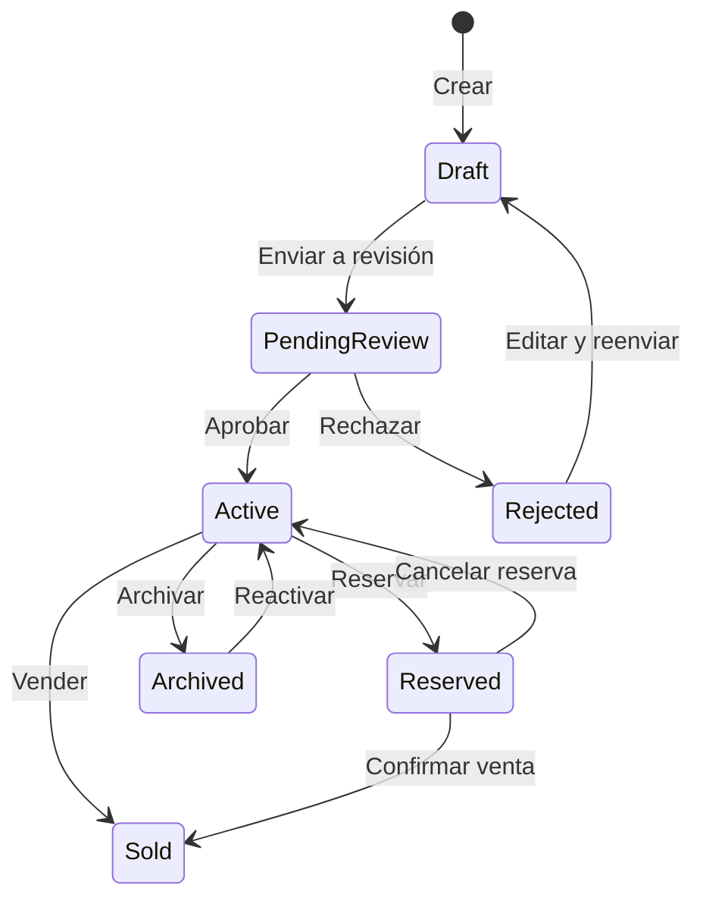

# 🚗 VehiclesRentService - Matriz de Procesos

## � Resumen de Implementación

| Componente    | Total | Implementado | Pendiente | Estado |
| ------------- | ----- | ------------ | --------- | ------ |
| Controllers   | 2     | 0            | 2         | 🔴     |
| RENT-VEH-\*   | 8     | 0            | 8         | 🔴     |
| RENT-CAT-\*   | 4     | 0            | 4         | 🔴     |
| RENT-BOOK-\*  | 6     | 0            | 6         | 🔴     |
| RENT-AVAIL-\* | 4     | 0            | 4         | 🔴     |
| Tests         | 0     | 0            | 15        | 🔴     |

**Leyenda:** ✅ Implementado + Tested | 🟢 Implementado | 🟡 En Progreso | 🔴 Pendiente

---

## �📋 Información General

| Aspecto           | Detalle                                                                                                                        |
| ----------------- | ------------------------------------------------------------------------------------------------------------------------------ |
| **Servicio**      | VehiclesRentService                                                                                                            |
| **Puerto**        | 5024                                                                                                                           |
| **Base de Datos** | PostgreSQL (vehicles_rent_db)                                                                                                  |
| **Tecnología**    | .NET 8, Entity Framework Core                                                                                                  |
| **Mensajería**    | RabbitMQ                                                                                                                       |
| **Descripción**   | Gestión de vehículos para alquiler/renta con categorías jerárquicas, búsqueda avanzada con 20+ filtros, y soporte multi-tenant |

### Arquitectura

```
┌─────────────────────────────────────────────────────────────────────────────┐
│                    VehiclesRentService Architecture                          │
├─────────────────────────────────────────────────────────────────────────────┤
│                                                                              │
│   Clients                           Core Service                             │
│   ┌────────────────┐              ┌─────────────────────────────────────┐    │
│   │ Rental Website │──┐           │        VehiclesRentService         │    │
│   │ (Search/Book)  │  │           │  ┌───────────────────────────────┐  │    │
│   └────────────────┘  │           │  │ Controllers                   │  │    │
│   ┌────────────────┐  │           │  │ • VehiclesController          │  │    │
│   │ Mobile App     │──┼──────────▶│  │ • CategoriesController        │  │    │
│   │ (Flutter)      │  │           │  │ • BookingsController          │  │    │
│   └────────────────┘  │           │  └───────────────────────────────┘  │    │
│   ┌────────────────┐  │           │  ┌───────────────────────────────┐  │    │
│   │ Dealer Panel   │──┘           │  │ Application (CQRS + MediatR)  │  │    │
│   │ (Fleet Mgmt)   │              │  │ • CreateRentalVehicleCmd      │  │    │
│   └────────────────┘              │  │ • CheckAvailabilityQuery      │  │    │
│                                   │  │ • CreateBookingCommand        │  │    │
│   Internal Services               │  │ • SearchVehiclesQuery         │  │    │
│   ┌────────────────┐              │  └───────────────────────────────┘  │    │
│   │ DealerService  │─────────────▶│  ┌───────────────────────────────┐  │    │
│   │ (Multi-tenant) │              │  │ Domain                        │  │    │
│   └────────────────┘              │  │ • RentalVehicle, Category     │  │    │
│   ┌────────────────┐              │  │ • Booking, Availability       │  │    │
│   │ MediaService   │              │  │ • RentalPricing               │  │    │
│   │ (Images)       │              │  └───────────────────────────────┘  │    │
│   └────────────────┘              └─────────────────────────────────────┘    │
│                                                    │                        │
│                                    ┌───────────────┼───────────────┐        │
│                                    ▼               ▼               ▼        │
│                            ┌────────────┐  ┌────────────┐  ┌────────────┐  │
│                            │ PostgreSQL │  │   Redis    │  │  RabbitMQ  │  │
│                            │ (Vehicles, │  │ (Avail.,   │  │ (Booking   │  │
│                            │  Bookings) │  │  Pricing)  │  │  Events)   │  │
│                            └────────────┘  └────────────┘  └────────────┘  │
│                                                                              │
└─────────────────────────────────────────────────────────────────────────────┘
```

---

## 🎯 Endpoints del Servicio

### VehiclesController

| Método   | Endpoint                          | Descripción                  | Auth | Roles         |
| -------- | --------------------------------- | ---------------------------- | ---- | ------------- |
| `GET`    | `/api/vehicles`                   | Buscar vehículos con filtros | ❌   | Público       |
| `GET`    | `/api/vehicles/{id}`              | Obtener vehículo por ID      | ❌   | Público       |
| `GET`    | `/api/vehicles/vin/{vin}`         | Obtener vehículo por VIN     | ❌   | Público       |
| `GET`    | `/api/vehicles/featured`          | Vehículos destacados         | ❌   | Público       |
| `GET`    | `/api/vehicles/seller/{sellerId}` | Vehículos por vendedor       | ❌   | Público       |
| `GET`    | `/api/vehicles/dealer/{dealerId}` | Vehículos por dealer         | ❌   | Público       |
| `POST`   | `/api/vehicles`                   | Crear vehículo de renta      | ✅   | Dealer/Seller |
| `PUT`    | `/api/vehicles/{id}`              | Actualizar vehículo          | ✅   | Owner         |
| `DELETE` | `/api/vehicles/{id}`              | Eliminar vehículo            | ✅   | Owner         |

### CategoriesController

| Método | Endpoint                        | Descripción          | Auth | Roles   |
| ------ | ------------------------------- | -------------------- | ---- | ------- |
| `GET`  | `/api/categories`               | Todas las categorías | ❌   | Público |
| `GET`  | `/api/categories/root`          | Categorías raíz      | ❌   | Público |
| `GET`  | `/api/categories/{id}`          | Categoría por ID     | ❌   | Público |
| `GET`  | `/api/categories/slug/{slug}`   | Categoría por slug   | ❌   | Público |
| `GET`  | `/api/categories/{id}/children` | Subcategorías        | ❌   | Público |

---

## 📊 Entidades del Dominio

### Vehicle (Entidad Principal)

```csharp
public class Vehicle : ITenantEntity
{
    public Guid Id { get; set; }
    public Guid DealerId { get; set; }              // Multi-tenant

    // ========================================
    // INFORMACIÓN BÁSICA
    // ========================================
    public string Title { get; set; }
    public string Description { get; set; }
    public decimal Price { get; set; }              // Precio de renta
    public string Currency { get; set; } = "USD";
    public VehicleStatus Status { get; set; }
    public Guid SellerId { get; set; }
    public string SellerName { get; set; }

    // ========================================
    // IDENTIFICACIÓN DEL VEHÍCULO
    // ========================================
    public string? VIN { get; set; }                // Vehicle Identification Number
    public string? StockNumber { get; set; }        // Número de inventario

    // ========================================
    // MARCA / MODELO / AÑO
    // ========================================
    public Guid? MakeId { get; set; }
    public string Make { get; set; }                // Toyota, Honda, Ford
    public Guid? ModelId { get; set; }
    public string Model { get; set; }               // Camry, Civic, F-150
    public string? Trim { get; set; }               // LE, SE, XLE, Sport
    public int Year { get; set; }
    public string? Generation { get; set; }

    // ========================================
    // TIPO Y CARROCERÍA
    // ========================================
    public VehicleType VehicleType { get; set; }    // Car, Truck, SUV, etc.
    public BodyStyle BodyStyle { get; set; }        // Sedan, Coupe, Hatchback
    public int Doors { get; set; } = 4;
    public int Seats { get; set; } = 5;

    // ========================================
    // MOTOR Y TRANSMISIÓN
    // ========================================
    public FuelType FuelType { get; set; }
    public string? EngineSize { get; set; }         // 2.5L, 3.0L
    public int? Horsepower { get; set; }
    public int? Torque { get; set; }
    public TransmissionType Transmission { get; set; }
    public DriveType DriveType { get; set; }        // FWD, RWD, AWD, 4WD
    public int? Cylinders { get; set; }

    // ========================================
    // KILOMETRAJE Y CONDICIÓN
    // ========================================
    public int Mileage { get; set; }
    public MileageUnit MileageUnit { get; set; }
    public VehicleCondition Condition { get; set; }
    public int? PreviousOwners { get; set; }
    public bool AccidentHistory { get; set; }
    public bool CleanTitle { get; set; } = true;

    // ========================================
    // APARIENCIA
    // ========================================
    public string? ExteriorColor { get; set; }
    public string? InteriorColor { get; set; }
    public string? InteriorMaterial { get; set; }   // Leather, Cloth, Vinyl

    // ========================================
    // ECONOMÍA DE COMBUSTIBLE
    // ========================================
    public int? MpgCity { get; set; }
    public int? MpgHighway { get; set; }
    public int? MpgCombined { get; set; }

    // ========================================
    // UBICACIÓN
    // ========================================
    public string? City { get; set; }
    public string? State { get; set; }
    public string? ZipCode { get; set; }
    public string? Country { get; set; } = "USA";
    public double? Latitude { get; set; }
    public double? Longitude { get; set; }

    // ========================================
    // HISTORIAL Y CERTIFICACIONES
    // ========================================
    public bool IsCertified { get; set; }
    public string? CertificationProgram { get; set; }   // CPO, Carfax Certified
    public string? CarfaxReportUrl { get; set; }
    public DateTime? LastServiceDate { get; set; }
    public string? ServiceHistoryNotes { get; set; }
    public string? WarrantyInfo { get; set; }

    // ========================================
    // CARACTERÍSTICAS Y EQUIPAMIENTO
    // ========================================
    public string FeaturesJson { get; set; } = "[]";    // ["Sunroof", "Navigation", ...]
    public string PackagesJson { get; set; } = "[]";    // ["Technology Package", ...]

    // ========================================
    // MÉTRICAS DE ENGAGEMENT
    // ========================================
    public int ViewCount { get; set; }
    public int FavoriteCount { get; set; }
    public int InquiryCount { get; set; }

    // ========================================
    // METADATOS
    // ========================================
    public DateTime CreatedAt { get; set; }
    public DateTime UpdatedAt { get; set; }
    public DateTime? PublishedAt { get; set; }
    public DateTime? SoldAt { get; set; }
    public bool IsDeleted { get; set; }
    public bool IsFeatured { get; set; }

    // ========================================
    // NAVEGACIÓN
    // ========================================
    public Guid? CategoryId { get; set; }
    public Category? Category { get; set; }
    public ICollection<VehicleImage> Images { get; set; }
}
```

### Category (Categorías Jerárquicas)

```csharp
public class Category : ITenantEntity
{
    public Guid Id { get; set; }
    public Guid DealerId { get; set; }              // Para categorías personalizadas
    public Guid? ParentId { get; set; }             // Categorías jerárquicas

    public string Name { get; set; }
    public string Slug { get; set; }
    public string? Description { get; set; }
    public string? IconUrl { get; set; }
    public string? ImageUrl { get; set; }
    public int SortOrder { get; set; }
    public bool IsActive { get; set; } = true;
    public bool IsSystem { get; set; } = false;     // True para predefinidas

    public DateTime CreatedAt { get; set; }
    public DateTime UpdatedAt { get; set; }

    // Navegación
    public Category? Parent { get; set; }
    public ICollection<Category> Children { get; set; }
    public ICollection<Vehicle> Vehicles { get; set; }
}
```

### VehicleImage

```csharp
public class VehicleImage
{
    public Guid Id { get; set; }
    public Guid VehicleId { get; set; }
    public string Url { get; set; }
    public ImageType Type { get; set; }
    public int SortOrder { get; set; }
    public bool IsPrimary { get; set; }
    public string? AltText { get; set; }
    public DateTime CreatedAt { get; set; }
}
```

### Enumeraciones

```csharp
public enum VehicleStatus
{
    Draft = 0,
    PendingReview = 1,
    Active = 2,
    Reserved = 3,
    Sold = 4,
    Archived = 5,
    Rejected = 6
}

public enum VehicleType
{
    Car = 0, Truck = 1, SUV = 2, Van = 3,
    Motorcycle = 4, RV = 5, Boat = 6, ATV = 7,
    Commercial = 8, Other = 99
}

public enum BodyStyle
{
    Sedan = 0, Coupe = 1, Hatchback = 2, Wagon = 3,
    SUV = 4, Crossover = 5, Pickup = 6, Van = 7,
    Minivan = 8, Convertible = 9, SportsCar = 10, Other = 99
}

public enum FuelType
{
    Gasoline = 0, Diesel = 1, Electric = 2, Hybrid = 3,
    PlugInHybrid = 4, Hydrogen = 5, FlexFuel = 6,
    NaturalGas = 7, Other = 99
}

public enum TransmissionType
{
    Automatic = 0, Manual = 1, CVT = 2,
    Automated = 3, DualClutch = 4, Other = 99
}

public enum DriveType
{
    FWD = 0,      // Front-Wheel Drive
    RWD = 1,      // Rear-Wheel Drive
    AWD = 2,      // All-Wheel Drive
    FourWD = 3,   // 4x4
    Other = 99
}

public enum MileageUnit { Miles = 0, Kilometers = 1 }

public enum VehicleCondition
{
    New = 0, CertifiedPreOwned = 1, Used = 2,
    Salvage = 3, Rebuilt = 4
}

public enum ImageType
{
    Exterior = 0, Interior = 1, Engine = 2,
    Damage = 3, Documents = 4, Other = 99
}
```

---

## 🔄 Procesos Detallados

### PROCESO 1: Búsqueda Avanzada de Vehículos

#### Endpoint: `GET /api/vehicles`

| Paso | Actor      | Acción                          | Sistema                                        | Resultado           |
| ---- | ---------- | ------------------------------- | ---------------------------------------------- | ------------------- |
| 1    | Visitante  | Envía búsqueda con filtros      | HTTP GET con query params                      | Request recibido    |
| 2    | API        | Mapea request a parámetros      | VehicleSearchParameters                        | Parámetros creados  |
| 3    | Handler    | Construye query base            | SELECT \* FROM vehicles                        | Query base          |
| 4    | Handler    | Aplica filtro por CategoryId    | WHERE CategoryId = @id                         | Filtrado            |
| 5    | Handler    | Aplica filtro por precio        | WHERE Price BETWEEN @min AND @max              | Filtrado            |
| 6    | Handler    | Aplica filtro por Make/Model    | WHERE Make = @make AND Model = @model          | Filtrado            |
| 7    | Handler    | Aplica filtro por Year          | WHERE Year BETWEEN @min AND @max               | Filtrado            |
| 8    | Handler    | Aplica filtro por Mileage       | WHERE Mileage BETWEEN @min AND @max            | Filtrado            |
| 9    | Handler    | Aplica filtros técnicos         | VehicleType, BodyStyle, FuelType, Transmission | Filtrado            |
| 10   | Handler    | Aplica filtro por ubicación     | WHERE State = @state AND City = @city          | Filtrado            |
| 11   | Handler    | Aplica filtro por certificación | WHERE IsCertified = true                       | Filtrado            |
| 12   | Handler    | Aplica ordenamiento             | ORDER BY @sortBy [@desc]                       | Ordenado            |
| 13   | Handler    | Aplica paginación               | OFFSET @skip LIMIT @take                       | Paginado            |
| 14   | Repository | Ejecuta query                   | EF Core query                                  | Datos obtenidos     |
| 15   | API        | Retorna resultado               | HTTP 200                                       | VehicleSearchResult |

#### Query Parameters Completos (20+ filtros)

| Parámetro        | Tipo    | Descripción                        |
| ---------------- | ------- | ---------------------------------- |
| `search`         | string  | Término de búsqueda general        |
| `categoryId`     | Guid    | Filtrar por categoría              |
| `minPrice`       | decimal | Precio mínimo                      |
| `maxPrice`       | decimal | Precio máximo                      |
| `make`           | string  | Marca (Toyota, Honda, etc.)        |
| `model`          | string  | Modelo (Camry, Civic, etc.)        |
| `minYear`        | int     | Año mínimo                         |
| `maxYear`        | int     | Año máximo                         |
| `minMileage`     | int     | Kilometraje mínimo                 |
| `maxMileage`     | int     | Kilometraje máximo                 |
| `vehicleType`    | enum    | Car, Truck, SUV, Van, etc.         |
| `bodyStyle`      | enum    | Sedan, Coupe, Hatchback, etc.      |
| `fuelType`       | enum    | Gasoline, Diesel, Electric, Hybrid |
| `transmission`   | enum    | Automatic, Manual, CVT             |
| `driveType`      | enum    | FWD, RWD, AWD, 4WD                 |
| `condition`      | enum    | New, Used, CertifiedPreOwned       |
| `exteriorColor`  | string  | Color exterior                     |
| `state`          | string  | Estado/Provincia                   |
| `city`           | string  | Ciudad                             |
| `zipCode`        | string  | Código postal                      |
| `isCertified`    | bool    | Solo certificados                  |
| `hasCleanTitle`  | bool    | Solo título limpio                 |
| `page`           | int     | Página (0-indexed)                 |
| `pageSize`       | int     | Tamaño de página (default: 20)     |
| `sortBy`         | string  | Campo para ordenar                 |
| `sortDescending` | bool    | Orden descendente                  |

#### Response (200 OK)

```json
{
  "vehicles": [
    {
      "id": "vehicle-uuid",
      "title": "2024 Toyota Camry XSE - Full Loaded",
      "description": "Hermoso Camry en perfectas condiciones...",
      "price": 35999.0,
      "currency": "USD",
      "status": "Active",
      "vin": "4T1BF1FK5EU123456",
      "make": "Toyota",
      "model": "Camry",
      "trim": "XSE",
      "year": 2024,
      "vehicleType": "Car",
      "bodyStyle": "Sedan",
      "doors": 4,
      "seats": 5,
      "fuelType": "Gasoline",
      "engineSize": "2.5L",
      "horsepower": 206,
      "transmission": "Automatic",
      "driveType": "FWD",
      "mileage": 12500,
      "mileageUnit": "Miles",
      "condition": "Used",
      "cleanTitle": true,
      "exteriorColor": "Pearl White",
      "interiorColor": "Black",
      "mpgCity": 28,
      "mpgHighway": 39,
      "city": "Miami",
      "state": "FL",
      "zipCode": "33101",
      "isCertified": true,
      "certificationProgram": "Toyota Certified Pre-Owned",
      "isFeatured": true,
      "viewCount": 245,
      "favoriteCount": 18,
      "inquiryCount": 7,
      "images": [
        {
          "url": "https://cdn.example.com/vehicles/123/front.jpg",
          "type": "Exterior",
          "isPrimary": true
        }
      ],
      "features": ["Sunroof", "Navigation", "Leather Seats", "Backup Camera"],
      "categoryId": "category-uuid",
      "categoryName": "Sedans",
      "sellerId": "seller-uuid",
      "sellerName": "Miami Auto Sales",
      "dealerId": "dealer-uuid",
      "createdAt": "2026-01-01T10:00:00Z",
      "publishedAt": "2026-01-02T08:00:00Z"
    }
  ],
  "totalCount": 1245,
  "page": 0,
  "pageSize": 20,
  "totalPages": 63
}
```

---

### PROCESO 2: Obtener Vehículo por ID

#### Endpoint: `GET /api/vehicles/{id}`

| Paso | Actor     | Acción                   | Sistema                   | Resultado           |
| ---- | --------- | ------------------------ | ------------------------- | ------------------- |
| 1    | Visitante | Solicita vehículo por ID | HTTP GET                  | Request recibido    |
| 2    | Handler   | Busca por ID             | Repository.GetByIdAsync() | Vehicle o null      |
| 3    | Handler   | Verifica existencia      | vehicle == null?          | Validación          |
| 4    | API       | Si no existe             | HTTP 404                  | NotFound            |
| 5    | Handler   | Incrementa ViewCount     | ViewCount++               | Métrica actualizada |
| 6    | API       | Retorna vehículo         | HTTP 200                  | Vehicle             |

---

### PROCESO 3: Obtener Vehículo por VIN

#### Endpoint: `GET /api/vehicles/vin/{vin}`

| Paso | Actor   | Acción           | Sistema                    | Resultado        |
| ---- | ------- | ---------------- | -------------------------- | ---------------- |
| 1    | Usuario | Busca por VIN    | HTTP GET /vin/{vin}        | Request recibido |
| 2    | Handler | Busca por VIN    | Repository.GetByVINAsync() | Vehicle o null   |
| 3    | API     | Si no existe     | HTTP 404                   | NotFound         |
| 4    | API     | Retorna vehículo | HTTP 200                   | Vehicle          |

---

### PROCESO 4: Obtener Vehículos Destacados

#### Endpoint: `GET /api/vehicles/featured`

| Paso | Actor     | Acción                 | Sistema                 | Resultado        |
| ---- | --------- | ---------------------- | ----------------------- | ---------------- |
| 1    | Visitante | Solicita featured      | HTTP GET ?take=10       | Request recibido |
| 2    | Handler   | Filtra featured        | WHERE IsFeatured = true | Filtrado         |
| 3    | Handler   | Filtra activos         | WHERE Status = Active   | Filtrado         |
| 4    | Handler   | Ordena por popularidad | ORDER BY ViewCount DESC | Ordenado         |
| 5    | Handler   | Limita resultados      | TAKE @take              | Limitado         |
| 6    | API       | Retorna lista          | HTTP 200                | List<Vehicle>    |

---

### PROCESO 5: Crear Vehículo de Renta

#### Endpoint: `POST /api/vehicles`

| Paso | Actor         | Acción                    | Sistema                           | Resultado          |
| ---- | ------------- | ------------------------- | --------------------------------- | ------------------ |
| 1    | Dealer/Seller | Envía datos del vehículo  | HTTP POST                         | Request recibido   |
| 2    | API           | Valida autenticación      | JWT check                         | Autorizado         |
| 3    | Validador     | Valida campos requeridos  | FluentValidation                  | Datos válidos      |
| 4    | Handler       | Verifica categoría existe | CategoryRepository.GetByIdAsync() | Categoría OK       |
| 5    | Handler       | Si categoría no existe    | HTTP 400                          | BadRequest         |
| 6    | Handler       | Crea entidad Vehicle      | new Vehicle()                     | Vehicle creado     |
| 7    | Handler       | Asigna Status = Draft     | VehicleStatus.Draft               | Estado inicial     |
| 8    | Handler       | Procesa imágenes          | VehicleImage collection           | Imágenes asignadas |
| 9    | Repository    | Persiste en BD            | INSERT vehicles                   | Vehicle guardado   |
| 10   | Logger        | Registra creación         | ILogger.LogInformation()          | Log creado         |
| 11   | API           | Retorna 201 Created       | CreatedAtAction()                 | Vehicle + Location |

#### Request Body

```json
{
  "title": "2024 Toyota Camry XSE - Full Loaded",
  "description": "Hermoso Camry en perfectas condiciones, único dueño...",
  "price": 35999.0,
  "currency": "USD",
  "vin": "4T1BF1FK5EU123456",
  "make": "Toyota",
  "model": "Camry",
  "year": 2024,
  "mileage": 12500,
  "mileageUnit": "Miles",
  "vehicleType": "Car",
  "bodyStyle": "Sedan",
  "fuelType": "Gasoline",
  "transmission": "Automatic",
  "driveType": "FWD",
  "engineSize": "2.5L",
  "engineCylinders": 4,
  "horsepower": 206,
  "exteriorColor": "Pearl White",
  "interiorColor": "Black",
  "condition": "Used",
  "isCertified": true,
  "hasCleanTitle": true,
  "streetAddress": "1234 Main Street",
  "city": "Miami",
  "state": "FL",
  "zipCode": "33101",
  "country": "USA",
  "sellerId": "seller-uuid",
  "sellerName": "Miami Auto Sales",
  "dealerId": "dealer-uuid",
  "categoryId": "sedans-category-uuid",
  "images": [
    "https://cdn.example.com/vehicles/new/front.jpg",
    "https://cdn.example.com/vehicles/new/side.jpg",
    "https://cdn.example.com/vehicles/new/interior.jpg"
  ]
}
```

---

### PROCESO 6: Actualizar Vehículo

#### Endpoint: `PUT /api/vehicles/{id}`

| Paso | Actor      | Acción                   | Sistema                   | Resultado             |
| ---- | ---------- | ------------------------ | ------------------------- | --------------------- |
| 1    | Owner      | Envía actualización      | HTTP PUT                  | Request recibido      |
| 2    | API        | Valida autenticación     | JWT check                 | Autorizado            |
| 3    | Handler    | Busca vehículo por ID    | Repository.GetByIdAsync() | Vehicle encontrado    |
| 4    | Handler    | Si no existe             | HTTP 404                  | NotFound              |
| 5    | Handler    | Actualiza campos no-null | Partial update            | Campos actualizados   |
| 6    | Handler    | Registra UpdatedAt       | DateTime.UtcNow           | Timestamp actualizado |
| 7    | Repository | Persiste cambios         | UPDATE vehicles           | Cambios guardados     |
| 8    | Logger     | Registra actualización   | ILogger.LogInformation()  | Log creado            |
| 9    | API        | Retorna vehículo         | HTTP 200                  | Vehicle actualizado   |

#### Request Body (Partial Update)

```json
{
  "title": "2024 Toyota Camry XSE - PRECIO REDUCIDO",
  "price": 33999.0,
  "mileage": 14500,
  "isFeatured": true
}
```

---

### PROCESO 7: Eliminar Vehículo (Soft Delete)

#### Endpoint: `DELETE /api/vehicles/{id}`

| Paso | Actor      | Acción               | Sistema                  | Resultado        |
| ---- | ---------- | -------------------- | ------------------------ | ---------------- |
| 1    | Owner      | Solicita eliminación | HTTP DELETE              | Request recibido |
| 2    | API        | Valida autenticación | JWT check                | Autorizado       |
| 3    | Handler    | Verifica existencia  | Repository.ExistsAsync() | Existe           |
| 4    | Handler    | Si no existe         | HTTP 404                 | NotFound         |
| 5    | Handler    | Marca como eliminado | IsDeleted = true         | Soft delete      |
| 6    | Repository | Persiste cambio      | UPDATE vehicles          | Cambio guardado  |
| 7    | Logger     | Registra eliminación | ILogger.LogInformation() | Log creado       |
| 8    | API        | Retorna 204          | HTTP 204                 | NoContent        |

---

### PROCESO 8: Listar Categorías Raíz

#### Endpoint: `GET /api/categories/root`

| Paso | Actor     | Acción                   | Sistema                | Resultado        |
| ---- | --------- | ------------------------ | ---------------------- | ---------------- |
| 1    | Visitante | Solicita categorías raíz | HTTP GET               | Request recibido |
| 2    | Handler   | Filtra sin parent        | WHERE ParentId IS NULL | Categorías raíz  |
| 3    | Handler   | Filtra activas           | WHERE IsActive = true  | Solo activas     |
| 4    | Handler   | Ordena por SortOrder     | ORDER BY SortOrder     | Ordenadas        |
| 5    | API       | Retorna lista            | HTTP 200               | List<Category>   |

---

### PROCESO 9: Obtener Subcategorías

#### Endpoint: `GET /api/categories/{id}/children`

| Paso | Actor     | Acción                 | Sistema                   | Resultado        |
| ---- | --------- | ---------------------- | ------------------------- | ---------------- |
| 1    | Visitante | Solicita subcategorías | HTTP GET                  | Request recibido |
| 2    | Handler   | Busca categoría padre  | Repository.GetByIdAsync() | Padre encontrado |
| 3    | Handler   | Obtiene hijos          | category.Children         | Subcategorías    |
| 4    | Handler   | Filtra activos         | WHERE IsActive = true     | Solo activas     |
| 5    | Handler   | Ordena por SortOrder   | ORDER BY SortOrder        | Ordenadas        |
| 6    | API       | Retorna lista          | HTTP 200                  | List<Category>   |

---

## 📂 Estructura de Categorías

### Categorías del Sistema (IsSystem = true)

```
📁 Cars (Autos)
├── 📁 Sedans
├── 📁 Coupes
├── 📁 Hatchbacks
├── 📁 Wagons
├── 📁 Convertibles
└── 📁 Sports Cars

📁 SUVs & Crossovers
├── 📁 Compact SUVs
├── 📁 Mid-Size SUVs
└── 📁 Full-Size SUVs

📁 Trucks
├── 📁 Compact Trucks
├── 📁 Full-Size Trucks
└── 📁 Heavy-Duty Trucks

📁 Vans
├── 📁 Minivans
├── 📁 Passenger Vans
└── 📁 Cargo Vans

📁 Motorcycles
├── 📁 Cruisers
├── 📁 Sport Bikes
├── 📁 Touring
└── 📁 Off-Road

📁 RVs & Campers
├── 📁 Class A
├── 📁 Class B
├── 📁 Class C
└── 📁 Travel Trailers

📁 Boats
├── 📁 Fishing Boats
├── 📁 Speedboats
├── 📁 Sailboats
└── 📁 Yachts

📁 ATVs & UTVs

📁 Commercial Vehicles
├── 📁 Box Trucks
├── 📁 Flatbeds
└── 📁 Service Vehicles
```

---

## 🔔 Eventos de Dominio (RabbitMQ)

### Eventos Publicados

| Evento                            | Exchange              | Routing Key              | Payload                                   |
| --------------------------------- | --------------------- | ------------------------ | ----------------------------------------- |
| `RentalVehicleCreatedEvent`       | `vehiclesrent.events` | `vehicle.created`        | VehicleId, DealerId, SellerId, CategoryId |
| `RentalVehicleUpdatedEvent`       | `vehiclesrent.events` | `vehicle.updated`        | VehicleId, ChangedFields                  |
| `RentalVehicleDeletedEvent`       | `vehiclesrent.events` | `vehicle.deleted`        | VehicleId, DealerId                       |
| `RentalVehicleStatusChangedEvent` | `vehiclesrent.events` | `vehicle.status_changed` | VehicleId, OldStatus, NewStatus           |
| `RentalVehicleFeaturedEvent`      | `vehiclesrent.events` | `vehicle.featured`       | VehicleId, DealerId                       |
| `RentalVehicleViewedEvent`        | `vehiclesrent.events` | `vehicle.viewed`         | VehicleId, ViewerId, SessionId            |

---

## ⚠️ Reglas de Negocio

### Validaciones de Vehículo

| #   | Regla                                       | Validación                      |
| --- | ------------------------------------------- | ------------------------------- |
| 1   | VIN debe tener 17 caracteres                | Regex pattern                   |
| 2   | Year debe ser razonable                     | 1900 <= Year <= CurrentYear + 1 |
| 3   | Price debe ser positivo                     | > 0                             |
| 4   | Mileage no puede ser negativo               | >= 0                            |
| 5   | CategoryId debe existir                     | FK validation                   |
| 6   | SellerId requerido                          | NOT NULL                        |
| 7   | Al menos 1 imagen requerida (para publicar) | Images.Count >= 1               |

### Estados y Transiciones



---

## ❌ Códigos de Error

| Código   | HTTP Status | Mensaje                     | Causa                         |
| -------- | ----------- | --------------------------- | ----------------------------- |
| `VR_001` | 404         | Vehicle not found           | ID no existe                  |
| `VR_002` | 400         | Category not found          | CategoryId inválido           |
| `VR_003` | 400         | Invalid VIN format          | VIN no tiene 17 caracteres    |
| `VR_004` | 400         | Invalid year                | Año fuera de rango            |
| `VR_005` | 400         | Price must be positive      | Precio <= 0                   |
| `VR_006` | 403         | Not authorized              | No es el owner                |
| `VR_007` | 400         | At least one image required | Sin imágenes                  |
| `VR_008` | 400         | Invalid transition          | Cambio de estado no permitido |

---

## ⚙️ Configuración del Servicio

### appsettings.json

```json
{
  "ConnectionStrings": {
    "DefaultConnection": "Host=postgres;Database=vehicles_rent_db;Username=postgres;Password=xxx"
  },
  "VehicleSettings": {
    "DefaultPageSize": 20,
    "MaxPageSize": 100,
    "FeaturedDefaultTake": 10,
    "MaxImagesPerVehicle": 50,
    "MinYearAllowed": 1900,
    "VinLength": 17
  },
  "CategorySettings": {
    "AllowCustomCategories": true,
    "MaxCategoryDepth": 3
  },
  "RabbitMQ": {
    "Host": "rabbitmq",
    "Port": 5672,
    "Username": "guest",
    "Password": "guest",
    "Exchange": "vehiclesrent.events"
  }
}
```

---

## 🔒 Seguridad

### Autenticación y Autorización

| Endpoint                      | Auth | Acceso        |
| ----------------------------- | ---- | ------------- |
| GET /api/vehicles             | ❌   | Público       |
| GET /api/vehicles/{id}        | ❌   | Público       |
| GET /api/vehicles/vin/{vin}   | ❌   | Público       |
| GET /api/vehicles/featured    | ❌   | Público       |
| GET /api/vehicles/seller/{id} | ❌   | Público       |
| GET /api/vehicles/dealer/{id} | ❌   | Público       |
| POST /api/vehicles            | ✅   | Dealer/Seller |
| PUT /api/vehicles/{id}        | ✅   | Owner only    |
| DELETE /api/vehicles/{id}     | ✅   | Owner only    |
| GET /api/categories/\*        | ❌   | Público       |

### Multi-Tenancy

Todos los vehículos tienen `DealerId` para aislamiento de datos por tenant.

---

## 📈 Métricas y Observabilidad

### Métricas Prometheus

| Métrica                           | Tipo      | Labels            | Descripción                 |
| --------------------------------- | --------- | ----------------- | --------------------------- |
| `vehiclesrent_total`              | Gauge     | dealer_id, status | Vehículos por dealer/status |
| `vehiclesrent_searches_total`     | Counter   | -                 | Búsquedas realizadas        |
| `vehiclesrent_search_duration_ms` | Histogram | -                 | Latencia de búsquedas       |
| `vehiclesrent_views_total`        | Counter   | dealer_id         | Vistas totales              |
| `vehiclesrent_featured_count`     | Gauge     | dealer_id         | Vehículos destacados        |

---

## 📚 Referencias

- [VehiclesController](../../backend/VehiclesRentService/VehiclesRentService.Api/Controllers/VehiclesController.cs)
- [CategoriesController](../../backend/VehiclesRentService/VehiclesRentService.Api/Controllers/CategoriesController.cs)
- [Vehicle Entity](../../backend/VehiclesRentService/VehiclesRentService.Domain/Entities/Vehicle.cs)
- [Category Entity](../../backend/VehiclesRentService/VehiclesRentService.Domain/Entities/Category.cs)

---

**Última actualización:** Enero 9, 2026  
**Autor:** Sistema de Documentación Automatizado  
**Versión:** 1.0.0
