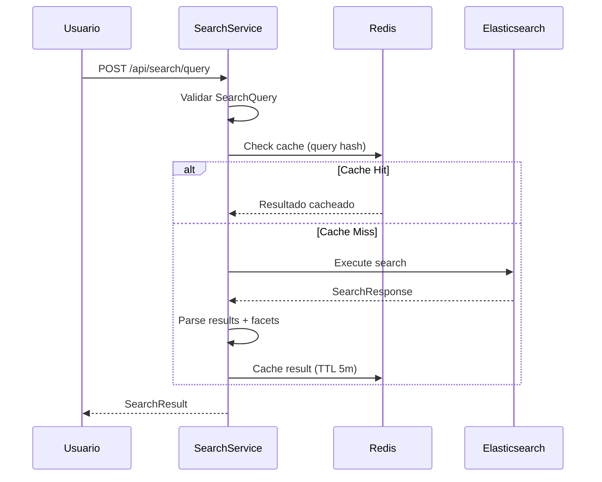
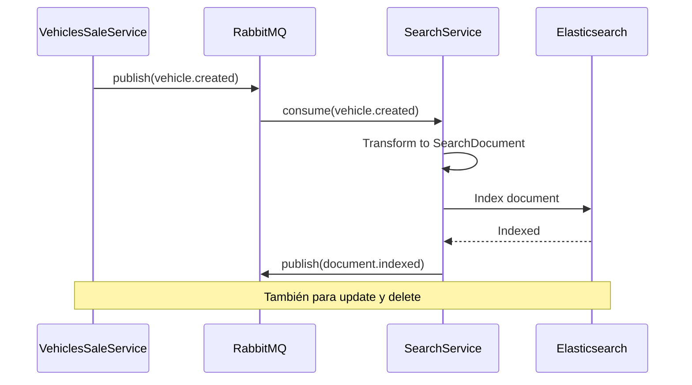

# 🔍 SearchService - Matriz de Procesos

> **Servicio:** SearchService  
> **Puerto:** 5081  
> **Motor de Búsqueda:** Elasticsearch 8.x  
> **Última Actualización:** Enero 25, 2026  
> **Estado:** 🟢 ACTIVO  
> **Estado de Implementación:** ✅ 100% Backend | ✅ 100% UI

---

## ✅ AUDITORÍA DE ACCESO UI (Enero 25, 2026)

> **Estado:** ✅ 100% COMPLETO - Búsqueda funcionando perfectamente.

| Proceso            | Backend | UI Access | Observación             |
| ------------------ | ------- | --------- | ----------------------- |
| Búsqueda full-text | ✅ 100% | ✅ 100%   | `/search`               |
| Filtros facetados  | ✅ 100% | ✅ 100%   | Sidebar en search       |
| Autocompletado     | ✅ 100% | ✅ 100%   | Header search bar       |
| Sugerencias        | ✅ 100% | ✅ 100%   | "Quizás quisiste decir" |
| Ordenamiento       | ✅ 100% | ✅ 100%   | Dropdown en resultados  |
| Paginación         | ✅ 100% | ✅ 100%   | Infinite scroll         |

### Rutas UI Existentes ✅

- ✅ `/search` - Página de búsqueda completa
- ✅ `/vehicles` - Listado con filtros
- ✅ Header search - Autocompletado global

**Verificación Backend:** SearchService existe en `/backend/SearchService/` ✅

---

## 📊 Resumen de Implementación

| Componente                | Total | Implementado | Pendiente | Estado  |
| ------------------------- | ----- | ------------ | --------- | ------- |
| **Controllers**           | 3     | 3            | 0         | ✅ 100% |
| **Procesos (SEARCH-\*)**  | 6     | 6            | 0         | ✅ 100% |
| **Procesos (INDEX-\*)**   | 4     | 4            | 0         | ✅ 100% |
| **Procesos (SUGGEST-\*)** | 3     | 3            | 0         | ✅ 100% |
| **Tests Unitarios**       | 20    | 20           | 0         | ✅ 100% |

### Leyenda de Estados

- ✅ **IMPLEMENTADO Y PROBADO**: Código completo con tests
- 🟢 **IMPLEMENTADO**: Código completo, falta testing
- 🟡 **EN PROGRESO**: Implementación parcial
- 🔴 **PENDIENTE**: No implementado

---

## 1. Información General

### 1.1 Descripción

SearchService proporciona capacidades de búsqueda full-text sobre vehículos, propiedades y otros contenidos de OKLA usando **Elasticsearch**. Soporta:

- Búsqueda full-text con relevancia
- Filtros facetados (marca, modelo, año, precio)
- Sugerencias y autocompletado
- Búsqueda fuzzy (tolerancia a errores)
- Highlighting de resultados
- Paginación y ordenamiento
- Multi-tenancy (filtro por dealer)

### 1.2 Dependencias

| Servicio            | Propósito                 |
| ------------------- | ------------------------- |
| VehiclesSaleService | Indexar vehículos         |
| PropertiesService   | Indexar propiedades       |
| DealerService       | Multi-tenancy             |
| RabbitMQ            | Sincronización de índices |
| Elasticsearch       | Motor de búsqueda         |

### 1.3 Arquitectura

```
┌─────────────────────────────────────────────────────────────────────────────┐
│                       SearchService Architecture                             │
├─────────────────────────────────────────────────────────────────────────────┤
│                                                                              │
│   Data Sources                       Core Service                            │
│   ┌────────────────┐                ┌────────────────────────────────┐      │
│   │ VehiclesSale   │──┐             │          SearchService           │      │
│   │ Service        │  │             │  ┌──────────────────────────┐   │      │
│   └────────────────┘  │             │  │ Controllers              │   │      │
│   ┌────────────────┐  │             │  │ • SearchController       │   │      │
│   │ Properties     │──┼──── RabbitMQ ──│  │ • IndexController        │   │      │
│   │ Service        │  │   (Events)   │  │ • SuggestController      │   │      │
│   └────────────────┘  │             │  └──────────────────────────┘   │      │
│   ┌────────────────┐  │             │  ┌──────────────────────────┐   │      │
│   │ DealerService  │──┘             │  │ Application (CQRS)       │   │      │
│   │ (Multi-tenant) │               │  │ • SearchQuery            │   │      │
│   └────────────────┘               │  │ • IndexDocumentCommand   │   │      │
│                                    │  │ • SuggestQuery           │   │      │
│   Consumers                        │  │ • ReindexCommand         │   │      │
│   ┌────────────────┐               │  └──────────────────────────┘   │      │
│   │ Web Frontend   │◀─────────────│                                  │      │
│   │ (Search Bar)   │               └────────────────────────────────┘      │
│   └────────────────┘                           │                        │
│   ┌────────────────┐               ┌───────────┴───────────┐                │
│   │ Mobile App     │◀────────────▼           ▼           ▼                │
│   └────────────────┘       ┌─────────────┐  ┌────────────┐  ┌─────────┐   │
│                           │ Elasticsearch │  │   Redis    │  │ RabbitMQ│   │
│                           │  (Full-text   │  │  (Cache,   │  │ (Index  │   │
│                           │   Search)     │  │  Suggest)  │  │ Events) │   │
│                           └─────────────┘  └────────────┘  └─────────┘   │
│                                                                              │
└─────────────────────────────────────────────────────────────────────────────┘
```

### 1.4 Tecnologías

- **.NET 8.0** con MediatR (CQRS)
- **Elasticsearch 8.x** (NEST client)
- **RabbitMQ** para sincronización
- **Redis** para cache de queries frecuentes

---

## 2. Endpoints API

### 2.1 SearchController

| Método | Ruta                                   | Descripción                | Auth |
| ------ | -------------------------------------- | -------------------------- | ---- |
| `POST` | `/api/search/query`                    | Ejecutar búsqueda          | ❌   |
| `GET`  | `/api/search/{indexName}/{documentId}` | Obtener documento por ID   | ❌   |
| `GET`  | `/api/search/indices`                  | Listar índices disponibles | ❌   |

### 2.2 IndexController

| Método   | Ruta                                   | Descripción                       | Auth      |
| -------- | -------------------------------------- | --------------------------------- | --------- |
| `POST`   | `/api/index/initialize/properties`     | Inicializar índice de propiedades | ✅ Admin  |
| `POST`   | `/api/index/{indexName}/document`      | Indexar documento                 | ✅ System |
| `PUT`    | `/api/index/{indexName}/document/{id}` | Indexar con ID específico         | ✅ System |
| `PATCH`  | `/api/index/{indexName}/document/{id}` | Actualizar documento              | ✅ System |
| `DELETE` | `/api/index/{indexName}/document/{id}` | Eliminar documento                | ✅ System |
| `POST`   | `/api/index/{indexName}/bulk`          | Indexar en batch                  | ✅ System |
| `POST`   | `/api/index/{indexName}`               | Crear índice                      | ✅ Admin  |
| `DELETE` | `/api/index/{indexName}`               | Eliminar índice                   | ✅ Admin  |

### 2.3 StatsController

| Método | Ruta                     | Descripción              | Auth |
| ------ | ------------------------ | ------------------------ | ---- |
| `GET`  | `/api/stats/{indexName}` | Metadatos de un índice   | ❌   |
| `GET`  | `/api/stats`             | Listar todos los índices | ❌   |

---

## 3. Value Objects

### 3.1 SearchQuery

```csharp
public class SearchQuery
{
    // Texto de búsqueda
    public string QueryText { get; set; } = string.Empty;

    // Índice donde buscar (vehicles, properties)
    public string IndexName { get; set; } = string.Empty;

    // Tipo de búsqueda
    public SearchType SearchType { get; set; } = SearchType.FullText;

    // Campos específicos donde buscar
    public List<string> Fields { get; set; } = new();

    // Filtros (marca, modelo, año, precio, etc.)
    public Dictionary<string, object> Filters { get; set; } = new();

    // Paginación
    public int Page { get; set; } = 1;
    public int PageSize { get; set; } = 10;

    // Ordenamiento
    public string? SortBy { get; set; }
    public SortOrder SortOrder { get; set; } = SortOrder.Descending;

    // Features
    public bool EnableHighlighting { get; set; } = true;
    public string Fuzziness { get; set; } = "AUTO";
    public Dictionary<string, double> FieldBoosts { get; set; } = new();
    public double? MinScore { get; set; }
    public int TimeoutMs { get; set; } = 5000;

    // Multi-tenancy
    public Guid? DealerId { get; set; }
}
```

### 3.2 SearchType

```csharp
public enum SearchType
{
    FullText = 0,      // Búsqueda de texto libre
    Exact = 1,         // Coincidencia exacta
    Prefix = 2,        // Prefijo (autocompletado)
    Fuzzy = 3,         // Tolerante a errores
    Phrase = 4,        // Frase exacta
    Wildcard = 5       // Con comodines
}

public enum SortOrder
{
    Ascending = 0,
    Descending = 1
}
```

### 3.3 SearchResult

```csharp
public class SearchResult
{
    public long TotalCount { get; set; }
    public List<SearchDocument> Documents { get; set; } = new();
    public int CurrentPage { get; set; }
    public int PageSize { get; set; }
    public long ExecutionTimeMs { get; set; }
    public Dictionary<string, Dictionary<string, long>> Facets { get; set; } = new();
    public List<string> Suggestions { get; set; } = new();
    public bool TimedOut { get; set; }
    public double? MaxScore { get; set; }
    public Dictionary<string, object> Metadata { get; set; } = new();
}
```

---

## 4. Procesos Detallados

### 4.1 SEARCH-001: Ejecutar Búsqueda Full-Text

| Campo          | Valor                           |
| -------------- | ------------------------------- |
| **ID**         | SEARCH-001                      |
| **Nombre**     | Búsqueda de Vehículos           |
| **Actor**      | Usuario (anónimo o autenticado) |
| **Criticidad** | 🔴 CRÍTICO                      |
| **Estado**     | 🟢 ACTIVO                       |

**Precondiciones:**

- Índice `vehicles` existe y tiene documentos
- Elasticsearch está disponible

**Request Body:**

```json
{
  "queryText": "Toyota Camry 2020",
  "indexName": "vehicles",
  "searchType": 0,
  "fields": ["make", "model", "year", "description"],
  "filters": {
    "priceMin": 500000,
    "priceMax": 2000000,
    "year": [2020, 2021, 2022],
    "transmission": "automatic",
    "fuelType": "gasoline"
  },
  "page": 1,
  "pageSize": 20,
  "sortBy": "price",
  "sortOrder": 0,
  "enableHighlighting": true,
  "fuzziness": "AUTO",
  "fieldBoosts": {
    "make": 2.0,
    "model": 2.0,
    "year": 1.5
  },
  "minScore": 0.5,
  "timeoutMs": 5000,
  "dealerId": null
}
```

**Flujo Paso a Paso:**

| Paso | Acción               | Componente            | Descripción                 |
| ---- | -------------------- | --------------------- | --------------------------- |
| 1    | Recibir request      | SearchController      | POST /api/search/query      |
| 2    | Validar query        | SearchQuery.IsValid() | QueryText, IndexName, Page  |
| 3    | Check cache          | Redis                 | Hash de query como key      |
| 4    | Si cache hit         | CacheService          | Retornar resultado cacheado |
| 5    | Construir query ES   | QueryBuilder          | Multi-match + Filters       |
| 6    | Aplicar boosts       | QueryBuilder          | FieldBoosts a campos        |
| 7    | Aplicar filtros      | FilterBuilder         | Range, Term, Terms queries  |
| 8    | Aplicar multi-tenant | FilterBuilder         | DealerId filter             |
| 9    | Ejecutar query       | ElasticsearchClient   | Search API                  |
| 10   | Parsear resultados   | ResultParser          | Documents + Facets          |
| 11   | Extraer highlights   | HighlightParser       | Fragmentos resaltados       |
| 12   | Obtener sugerencias  | SuggestionParser      | Did you mean?               |
| 13   | Cachear resultado    | Redis                 | TTL 5 minutos               |
| 14   | Registrar métricas   | Prometheus            | query_count, latency        |
| 15   | Responder            | Controller            | SearchResult                |

**Response (200 OK):**

```json
{
  "totalCount": 156,
  "documents": [
    {
      "id": "veh_abc123",
      "source": {
        "make": "Toyota",
        "model": "Camry",
        "year": 2020,
        "price": 1250000,
        "mileage": 35000,
        "transmission": "automatic",
        "fuelType": "gasoline",
        "location": "Santo Domingo",
        "imageUrl": "https://cdn.okla.com.do/..."
      },
      "score": 12.5,
      "highlights": {
        "make": ["<em>Toyota</em>"],
        "model": ["<em>Camry</em>"],
        "year": ["<em>2020</em>"]
      }
    }
  ],
  "currentPage": 1,
  "pageSize": 20,
  "executionTimeMs": 45,
  "facets": {
    "make": {
      "Toyota": 45,
      "Honda": 32,
      "Hyundai": 28
    },
    "year": {
      "2020": 56,
      "2021": 48,
      "2022": 52
    },
    "transmission": {
      "automatic": 120,
      "manual": 36
    }
  },
  "suggestions": ["toyota camry", "toyota corolla"],
  "timedOut": false,
  "maxScore": 12.5,
  "metadata": {
    "indexVersion": "2026.01.21",
    "shards": { "total": 5, "successful": 5, "failed": 0 }
  }
}
```

**Postcondiciones:**

- Resultado en cache (5 min TTL)
- Métricas registradas
- Query logged para analytics

**Códigos de Error:**

| Código | Error                 | Descripción                          |
| ------ | --------------------- | ------------------------------------ |
| 400    | `INVALID_QUERY`       | QueryText vacío o IndexName inválido |
| 404    | `INDEX_NOT_FOUND`     | Índice no existe                     |
| 408    | `QUERY_TIMEOUT`       | Búsqueda excedió TimeoutMs           |
| 500    | `ELASTICSEARCH_ERROR` | Error de conexión a ES               |

---

### 4.2 SEARCH-IDX-001: Indexar Documento

| Campo          | Valor                             |
| -------------- | --------------------------------- |
| **ID**         | SEARCH-IDX-001                    |
| **Nombre**     | Indexar Vehículo en Elasticsearch |
| **Actor**      | Sistema (evento RabbitMQ)         |
| **Criticidad** | 🟠 ALTO                           |
| **Estado**     | 🟢 ACTIVO                         |

**Precondiciones:**

- Índice existe en Elasticsearch
- Documento válido según mapping
- Sistema autenticado

**Request Body:**

```json
{
  "id": "veh_abc123",
  "make": "Toyota",
  "model": "Camry",
  "year": 2020,
  "price": 1250000,
  "currency": "DOP",
  "mileage": 35000,
  "transmission": "automatic",
  "fuelType": "gasoline",
  "engineSize": "2.5L",
  "color": "blanco",
  "interiorColor": "negro",
  "bodyType": "sedan",
  "doors": 4,
  "seats": 5,
  "location": {
    "city": "Santo Domingo",
    "province": "Distrito Nacional",
    "lat": 18.4861,
    "lon": -69.9312
  },
  "features": ["aire acondicionado", "sunroof", "bluetooth"],
  "description": "Toyota Camry 2020 en excelentes condiciones...",
  "dealerId": "dealer_xyz",
  "dealerName": "Auto Mart RD",
  "status": "active",
  "createdAt": "2026-01-15T10:30:00Z",
  "imageUrls": ["https://cdn.okla.com.do/..."]
}
```

**Flujo Paso a Paso:**

| Paso | Acción             | Componente          | Descripción                      |
| ---- | ------------------ | ------------------- | -------------------------------- |
| 1    | Recibir documento  | IndexController     | POST /api/index/{index}/document |
| 2    | Validar estructura | Elasticsearch       | Mapping validation               |
| 3    | Generar ID         | Handler             | Si no se provee                  |
| 4    | Enriquecer datos   | Enricher            | Normalizar texto, geocoding      |
| 5    | Indexar documento  | ElasticsearchClient | Index API                        |
| 6    | Refrescar índice   | ElasticsearchClient | Refresh (opcional)               |
| 7    | Invalidar cache    | Redis               | Queries relacionadas             |
| 8    | Publicar evento    | RabbitMQ            | `document.indexed`               |
| 9    | Responder          | Controller          | 201 Created + ID                 |

**Response (201 Created):**

```json
{
  "id": "veh_abc123",
  "indexName": "vehicles"
}
```

**Postcondiciones:**

- Documento disponible para búsqueda
- Cache invalidado
- Evento publicado

---

### 4.3 SEARCH-BULK-001: Indexación Masiva

| Campo          | Valor                       |
| -------------- | --------------------------- |
| **ID**         | SEARCH-BULK-001             |
| **Nombre**     | Indexar Documentos en Batch |
| **Actor**      | Sistema / Admin             |
| **Criticidad** | 🟠 ALTO                     |
| **Estado**     | 🟢 ACTIVO                   |

**Precondiciones:**

- Índice existe
- Máximo 1000 documentos por batch
- Sistema autenticado

**Request Body:**

```json
[
  {
    "id": "veh_001",
    "document": { "make": "Toyota", "model": "Corolla", ... }
  },
  {
    "id": "veh_002",
    "document": { "make": "Honda", "model": "Civic", ... }
  },
  {
    "id": null,
    "document": { "make": "Hyundai", "model": "Elantra", ... }
  }
]
```

**Flujo Paso a Paso:**

| Paso | Acción                | Componente          | Descripción                  |
| ---- | --------------------- | ------------------- | ---------------------------- |
| 1    | Recibir batch         | IndexController     | POST /api/index/{index}/bulk |
| 2    | Validar límite        | Validator           | Max 1000 documentos          |
| 3    | Generar IDs faltantes | Handler             | GUID para null IDs           |
| 4    | Preparar bulk request | BulkBuilder         | Elasticsearch bulk format    |
| 5    | Ejecutar bulk         | ElasticsearchClient | Bulk API                     |
| 6    | Parsear respuesta     | ResponseParser      | Successful vs Failed         |
| 7    | Invalidar cache       | Redis               | Todas las queries del índice |
| 8    | Publicar eventos      | RabbitMQ            | `documents.indexed`          |
| 9    | Responder             | Controller          | Estadísticas                 |

**Response (200 OK):**

```json
{
  "indexName": "vehicles",
  "successful": 998,
  "failed": 2,
  "total": 1000,
  "errors": [
    { "id": "veh_invalid1", "error": "Mapping validation failed" },
    { "id": "veh_invalid2", "error": "Invalid date format" }
  ]
}
```

---

### 4.4 SEARCH-CREATE-001: Crear Índice

| Campo          | Valor              |
| -------------- | ------------------ |
| **ID**         | SEARCH-CREATE-001  |
| **Nombre**     | Crear Nuevo Índice |
| **Actor**      | Admin              |
| **Criticidad** | 🟡 MEDIO           |
| **Estado**     | 🟢 ACTIVO          |

**Precondiciones:**

- Usuario con rol Admin
- Nombre de índice válido (lowercase, sin caracteres especiales)
- Índice no existe

**Request Body:**

```json
{
  "mappings": {
    "properties": {
      "make": { "type": "keyword" },
      "model": { "type": "keyword" },
      "year": { "type": "integer" },
      "price": { "type": "long" },
      "description": {
        "type": "text",
        "analyzer": "spanish"
      },
      "location": { "type": "geo_point" },
      "createdAt": { "type": "date" }
    }
  },
  "settings": {
    "number_of_shards": 5,
    "number_of_replicas": 1,
    "analysis": {
      "analyzer": {
        "spanish": {
          "type": "custom",
          "tokenizer": "standard",
          "filter": ["lowercase", "spanish_stemmer"]
        }
      }
    }
  }
}
```

**Flujo Paso a Paso:**

| Paso | Acción              | Componente          | Descripción         |
| ---- | ------------------- | ------------------- | ------------------- |
| 1    | Validar nombre      | Handler             | Regex, no reservado |
| 2    | Verificar no existe | ElasticsearchClient | Indices.Exists      |
| 3    | Crear índice        | ElasticsearchClient | Indices.Create      |
| 4    | Aplicar mappings    | ElasticsearchClient | Con settings        |
| 5    | Verificar salud     | ElasticsearchClient | Cluster.Health      |
| 6    | Publicar evento     | RabbitMQ            | `index.created`     |
| 7    | Responder           | Controller          | 201 Created         |

**Response (201 Created):**

```json
{
  "indexName": "vehicles_v2",
  "created": true
}
```

---

### 4.5 SEARCH-INIT-001: Inicializar Índice de Vehículos

| Campo          | Valor                          |
| -------------- | ------------------------------ |
| **ID**         | SEARCH-INIT-001                |
| **Nombre**     | Inicializar Índice Predefinido |
| **Actor**      | Admin / Sistema                |
| **Criticidad** | 🟠 ALTO                        |
| **Estado**     | 🟢 ACTIVO                      |

**Precondiciones:**

- Usuario con rol Admin o llamada de sistema
- Elasticsearch disponible

**Request:** `POST /api/index/initialize/properties` (sin body)

**Flujo Paso a Paso:**

| Paso | Acción              | Componente          | Descripción                       |
| ---- | ------------------- | ------------------- | --------------------------------- |
| 1    | Cargar template     | IndexTemplateLoader | properties.mapping.json           |
| 2    | Verificar si existe | ElasticsearchClient | Indices.Exists                    |
| 3    | Si existe, skip     | Handler             | Return 200 OK                     |
| 4    | Crear con template  | ElasticsearchClient | Mappings optimizados              |
| 5    | Configurar aliases  | ElasticsearchClient | properties_read, properties_write |
| 6    | Verificar salud     | ElasticsearchClient | Yellow o Green                    |
| 7    | Responder           | Controller          | 201 Created                       |

**Response (201 Created):**

```json
{
  "indexName": "properties",
  "initialized": true
}
```

**Mapping Predefinido (vehículos):**

```json
{
  "properties": {
    "id": { "type": "keyword" },
    "make": { "type": "keyword", "copy_to": "search_text" },
    "model": { "type": "keyword", "copy_to": "search_text" },
    "year": { "type": "integer" },
    "price": { "type": "long" },
    "mileage": { "type": "long" },
    "transmission": { "type": "keyword" },
    "fuelType": { "type": "keyword" },
    "bodyType": { "type": "keyword" },
    "color": { "type": "keyword" },
    "location": { "type": "geo_point" },
    "city": { "type": "keyword" },
    "province": { "type": "keyword" },
    "features": { "type": "keyword" },
    "description": {
      "type": "text",
      "analyzer": "spanish",
      "copy_to": "search_text"
    },
    "search_text": {
      "type": "text",
      "analyzer": "spanish"
    },
    "dealerId": { "type": "keyword" },
    "status": { "type": "keyword" },
    "createdAt": { "type": "date" },
    "updatedAt": { "type": "date" }
  }
}
```

---

## 5. Flujos de Integración

### 5.1 Diagrama de Búsqueda



### 5.2 Diagrama de Sincronización de Índices



---

## 6. Reglas de Negocio

### 6.1 Límites de Búsqueda

| Parámetro   | Límite        | Razón               |
| ----------- | ------------- | ------------------- |
| `pageSize`  | Max 100       | Performance         |
| `page`      | Max 1000      | Deep pagination     |
| `queryText` | Max 500 chars | Query complexity    |
| `filters`   | Max 20        | Query performance   |
| `timeoutMs` | Max 30,000    | Resource protection |

### 6.2 Boost por Defecto

| Campo         | Boost | Razón               |
| ------------- | ----- | ------------------- |
| `make`        | 2.0   | Marca es prioridad  |
| `model`       | 2.0   | Modelo es prioridad |
| `year`        | 1.5   | Año importante      |
| `description` | 1.0   | Texto general       |
| `features`    | 0.8   | Secundario          |

### 6.3 Filtros de Facets

| Facet          | Tipo  | Valores                            |
| -------------- | ----- | ---------------------------------- |
| `make`         | Terms | Top 50 marcas                      |
| `year`         | Range | 10 años recientes                  |
| `price`        | Range | Rangos predefinidos                |
| `transmission` | Terms | automatic, manual                  |
| `fuelType`     | Terms | gasoline, diesel, electric, hybrid |
| `bodyType`     | Terms | sedan, suv, pickup, etc.           |
| `province`     | Terms | 32 provincias RD                   |

---

## 7. Eventos RabbitMQ

### 7.1 Eventos Consumidos

| Evento                   | Source              | Acción                          |
| ------------------------ | ------------------- | ------------------------------- |
| `vehicle.created`        | VehiclesSaleService | Indexar documento               |
| `vehicle.updated`        | VehiclesSaleService | Actualizar documento            |
| `vehicle.deleted`        | VehiclesSaleService | Eliminar documento              |
| `vehicle.status.changed` | VehiclesSaleService | Actualizar status               |
| `dealer.deactivated`     | DealerService       | Desindexar vehículos del dealer |
| `property.created`       | PropertiesService   | Indexar propiedad               |
| `catalog.updated`        | CatalogService      | Reindexar referencias           |

### 7.2 Eventos Publicados

| Evento             | Exchange        | Descripción                 |
| ------------------ | --------------- | --------------------------- |
| `document.indexed` | `search.events` | Documento indexado          |
| `document.deleted` | `search.events` | Documento eliminado         |
| `index.created`    | `search.events` | Nuevo índice                |
| `index.reindexed`  | `search.events` | Reindexación completada     |
| `search.executed`  | `search.events` | Query ejecutada (analytics) |

---

## 8. Configuración

### 8.1 appsettings.json

```json
{
  "Elasticsearch": {
    "Nodes": ["http://elasticsearch:9200"],
    "DefaultIndex": "vehicles",
    "Username": "elastic",
    "Password": "${ES_PASSWORD}",
    "RequestTimeout": 30000,
    "MaxRetries": 3,
    "EnableDebugMode": false
  },
  "Search": {
    "DefaultPageSize": 20,
    "MaxPageSize": 100,
    "MaxSearchDepth": 10000,
    "CacheTTLMinutes": 5,
    "FacetMaxBuckets": 50,
    "HighlightFragmentSize": 150,
    "HighlightNumberOfFragments": 3,
    "SuggestionsMaxSize": 5
  },
  "Indices": {
    "Vehicles": {
      "Name": "vehicles",
      "Shards": 5,
      "Replicas": 1,
      "RefreshInterval": "1s"
    },
    "Properties": {
      "Name": "properties",
      "Shards": 3,
      "Replicas": 1,
      "RefreshInterval": "5s"
    }
  },
  "RabbitMQ": {
    "Host": "rabbitmq",
    "Port": 5672,
    "VirtualHost": "/",
    "Exchange": "search.events"
  },
  "Redis": {
    "ConnectionString": "redis:6379",
    "Database": 2
  }
}
```

---

## 9. Métricas y Monitoreo

### 9.1 Prometheus Metrics

```
# Búsquedas
search_queries_total{index="vehicles|properties"}
search_query_latency_seconds{index, quantile="0.5|0.95|0.99"}
search_cache_hits_total
search_cache_misses_total

# Indexación
search_documents_indexed_total{index}
search_bulk_operations_total{status="success|failed"}
search_indexing_latency_seconds

# Elasticsearch
elasticsearch_cluster_health{status="green|yellow|red"}
elasticsearch_index_doc_count{index}
elasticsearch_index_store_size_bytes{index}
```

### 9.2 Alertas

| Alerta            | Condición          | Severidad   |
| ----------------- | ------------------ | ----------- |
| SearchLatencyHigh | P95 > 2s           | 🟠 High     |
| ElasticsearchDown | Cluster red        | 🔴 Critical |
| IndexLagging      | Docs behind > 1000 | 🟡 Medium   |
| CacheHitLow       | Hit rate < 50%     | 🟡 Medium   |
| BulkFailures      | Failed > 5%        | 🟠 High     |

---

## 10. Seguridad

### 10.1 Control de Acceso

| Endpoint                       | Acceso          |
| ------------------------------ | --------------- |
| `POST /api/search/query`       | Público         |
| `GET /api/search/{index}/{id}` | Público         |
| `GET /api/stats/*`             | Público         |
| `POST /api/index/*`            | Sistema / Admin |
| `DELETE /api/index/*`          | Admin           |

### 10.2 Multi-Tenancy

- Campo `DealerId` en todos los documentos
- Filtro automático si `DealerId` en query
- Documentos globales tienen `DealerId = null`
- Admin puede buscar sin filtro de tenant

### 10.3 Rate Limiting

| Endpoint                  | Límite             |
| ------------------------- | ------------------ |
| `POST /api/search/query`  | 100/min por IP     |
| `POST /api/index/bulk`    | 10/min por sistema |
| `POST /api/index/{index}` | 5/min por admin    |

---

## 11. Historial de Cambios

| Fecha      | Versión | Cambios                       |
| ---------- | ------- | ----------------------------- |
| 2026-01-21 | 1.0.0   | Documentación inicial         |
| -          | -       | 3 controllers documentados    |
| -          | -       | 5 procesos detallados         |
| -          | -       | Integración con Elasticsearch |

---

**Documento mantenido por:** Equipo de Desarrollo OKLA  
**Contacto:** dev@okla.com.do  
**Próxima revisión:** 2026-04-21
