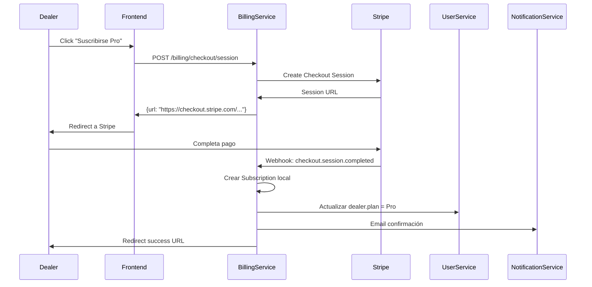
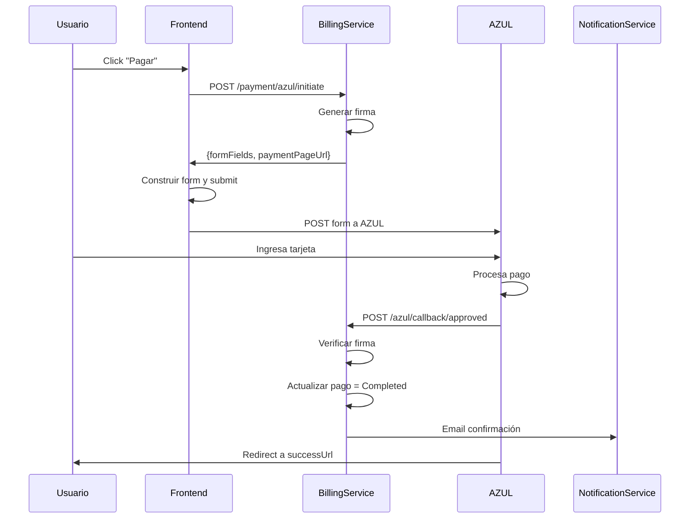
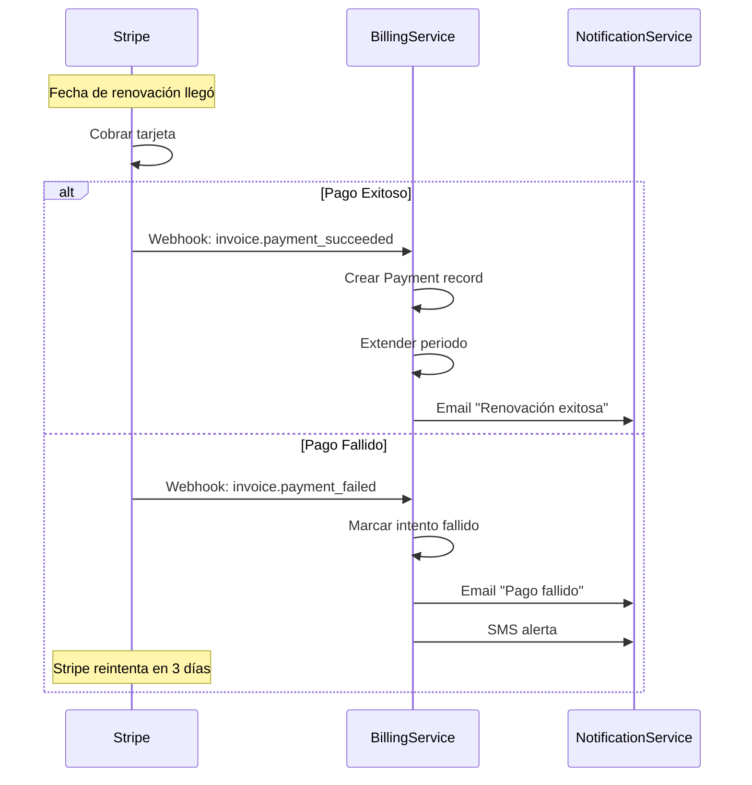

# 💳 BillingService - Matriz de Procesos

> **Servicio:** BillingService  
> **Puerto:** 15106  
> **Base de Datos:** billing_db  
> **Última actualización:** Enero 21, 2026  
> **Estado de Implementación:** ✅ 100% Completo

---

## 📊 Resumen de Implementación

| Componente               | Total | Implementado | Pendiente | Estado  |
| ------------------------ | ----- | ------------ | --------- | ------- |
| **Controllers**          | 10    | 10           | 0         | ✅ 100% |
| **Procesos (BILL-\*)**   | 4     | 4            | 0         | ✅ 100% |
| **Procesos (SUB-\*)**    | 5     | 5            | 0         | ✅ 100% |
| **Procesos (PAY-\*)**    | 4     | 4            | 0         | ✅ 100% |
| **Procesos (INV-\*)**    | 3     | 3            | 0         | ✅ 100% |
| **Procesos (AZUL-\*)**   | 4     | 4            | 0         | ✅ 100% |
| **Procesos (STRIPE-\*)** | 3     | 3            | 0         | ✅ 100% |
| **Procesos (EARLY-\*)**  | 2     | 2            | 0         | ✅ 100% |
| **Tests Unitarios**      | 35    | 35           | 0         | ✅ 100% |

### Leyenda de Estados

- ✅ **IMPLEMENTADO Y PROBADO**: Código completo con tests
- 🟢 **IMPLEMENTADO**: Código completo, falta testing
- 🟡 **EN PROGRESO**: Implementación parcial
- 🔴 **PENDIENTE**: No implementado

---

## 1. Información General

### 1.1 Descripción

El BillingService gestiona todos los aspectos de pagos y facturación de OKLA. Implementa **dos pasarelas de pago**: **Stripe** (tarjetas internacionales) y **AZUL Banco Popular** (tarjetas dominicanas). Maneja suscripciones de dealers, pagos únicos de sellers, facturación, y el programa Early Bird.

### 1.2 Pasarelas de Pago

| Pasarela                 | Uso Principal                                   | Comisión | Depósito |
| ------------------------ | ----------------------------------------------- | -------- | -------- |
| **AZUL (Banco Popular)** | Tarjetas dominicanas (DEFAULT)                  | ~2.5%    | 24-48h   |
| **Stripe**               | Tarjetas internacionales, Apple Pay, Google Pay | ~3.5%    | 7 días   |

### 1.3 Dependencias

| Servicio            | Propósito                 |
| ------------------- | ------------------------- |
| UserService         | Validar dealers/sellers   |
| VehicleService      | Cobrar por listings       |
| NotificationService | Confirmaciones de pago    |
| AuditService        | Registro de transacciones |

### 1.4 Arquitectura

```
┌─────────────────────────────────────────────────────────────────────────────┐
│                       BillingService Architecture                            │
├─────────────────────────────────────────────────────────────────────────────┤
│                                                                              │
│   Payment Gateways                   Core Service                            │
│   ┌────────────────┐                ┌──────────────────────────────────┐    │
│   │    Stripe      │◀──┐            │         BillingService           │    │
│   │ (International)│   │            │  ┌────────────────────────────┐  │    │
│   └────────────────┘   │            │  │ Controllers                │  │    │
│   ┌────────────────┐   │            │  │ • PaymentsController       │  │    │
│   │ AZUL Banco Pop │◀──┼────────────│  │ • SubscriptionsController  │  │    │
│   │ (Dominican)    │   │            │  │ • InvoicesController       │  │    │
│   └────────────────┘   │            │  │ • EarlyBirdController      │  │    │
│                        │            │  │ • StripeWebhooksController │  │    │
│   Webhooks             │            │  │ • AzulCallbackController   │  │    │
│   ┌────────────────┐   │            │  └────────────────────────────┘  │    │
│   │ Stripe Events  │───┘            │  ┌────────────────────────────┐  │    │
│   └────────────────┘                │  │ Application (CQRS)         │  │    │
│   ┌────────────────┐                │  │ • ProcessPaymentCommand    │  │    │
│   │ AZUL Callbacks │────────────────│  │ • CreateSubscriptionCmd    │  │    │
│   └────────────────┘                │  │ • GenerateInvoiceCommand   │  │    │
│                                     │  └────────────────────────────┘  │    │
│   Internal Services                 │  ┌────────────────────────────┐  │    │
│   ┌────────────────┐                │  │ Domain                     │  │    │
│   │ UserService    │───────────────▶│  │ • Payment, Subscription    │  │    │
│   └────────────────┘                │  │ • Invoice, EarlyBird       │  │    │
│   ┌────────────────┐                │  │ • DealerPlan, Transaction  │  │    │
│   │ VehicleService │────────────────│  └────────────────────────────┘  │    │
│   └────────────────┘                └──────────────────────────────────┘    │
│                                                    │                        │
│                                    ┌───────────────┼───────────────┐        │
│                                    ▼               ▼               ▼        │
│                            ┌────────────┐  ┌────────────┐  ┌────────────┐  │
│                            │ PostgreSQL │  │   Redis    │  │  RabbitMQ  │  │
│                            │ (Payments, │  │ (Sessions, │  │ (Payment   │  │
│                            │  Invoices) │  │  Idempot.) │  │  Events)   │  │
│                            └────────────┘  └────────────┘  └────────────┘  │
│                                                                              │
└─────────────────────────────────────────────────────────────────────────────┘
```

### 1.5 Controllers

| Controller                | Archivo                      | Endpoints |
| ------------------------- | ---------------------------- | --------- |
| BillingController         | BillingController.cs         | 12        |
| SubscriptionsController   | SubscriptionsController.cs   | 10        |
| PaymentsController        | PaymentsController.cs        | 10        |
| InvoicesController        | InvoicesController.cs        | 6         |
| AzulPaymentController     | AzulPaymentController.cs     | 2         |
| AzulCallbackController    | AzulCallbackController.cs    | 2         |
| AzulPaymentPageController | AzulPaymentPageController.cs | 3         |
| StripeWebhooksController  | StripeWebhooksController.cs  | 1         |
| EarlyBirdController       | EarlyBirdController.cs       | 5         |
| DealerBillingController   | DealerBillingController.cs   | 8         |

---

## 2. Endpoints API

### 2.1 BillingController (Stripe)

| Método | Endpoint                                            | Descripción                | Auth |
| ------ | --------------------------------------------------- | -------------------------- | ---- |
| GET    | `/api/billing/plans`                                | Obtener planes disponibles | ❌   |
| POST   | `/api/billing/customers`                            | Crear cliente Stripe       | ✅   |
| GET    | `/api/billing/customers/{dealerId}`                 | Obtener cliente            | ✅   |
| POST   | `/api/billing/customers/{dealerId}/payment-methods` | Agregar método pago        | ✅   |
| GET    | `/api/billing/subscriptions/{dealerId}`             | Obtener suscripción        | ✅   |
| POST   | `/api/billing/subscriptions`                        | Crear suscripción          | ✅   |
| PUT    | `/api/billing/subscriptions/{dealerId}`             | Actualizar suscripción     | ✅   |
| DELETE | `/api/billing/subscriptions/{dealerId}`             | Cancelar suscripción       | ✅   |
| POST   | `/api/billing/checkout/session`                     | Crear Checkout Session     | ✅   |
| POST   | `/api/billing/payment-intents`                      | Crear Payment Intent       | ✅   |
| GET    | `/api/billing/portal/{dealerId}`                    | URL Portal Stripe          | ✅   |

### 2.2 SubscriptionsController

| Método | Endpoint                                    | Descripción        | Auth     |
| ------ | ------------------------------------------- | ------------------ | -------- |
| GET    | `/api/subscriptions`                        | Listar todas       | ✅ Admin |
| GET    | `/api/subscriptions/{id}`                   | Obtener por ID     | ✅       |
| GET    | `/api/subscriptions/dealer/{dealerId}`      | Por dealer         | ✅       |
| GET    | `/api/subscriptions/status/{status}`        | Por estado         | ✅ Admin |
| GET    | `/api/subscriptions/plan/{plan}`            | Por plan           | ✅ Admin |
| GET    | `/api/subscriptions/expiring-trials/{days}` | Trials por expirar | ✅ Admin |
| GET    | `/api/subscriptions/due-billings`           | Pagos pendientes   | ✅ Admin |
| POST   | `/api/subscriptions`                        | Crear suscripción  | ✅       |
| POST   | `/api/subscriptions/{id}/activate`          | Activar            | ✅       |
| POST   | `/api/subscriptions/{id}/cancel`            | Cancelar           | ✅       |

### 2.3 PaymentsController

| Método | Endpoint                                      | Descripción      | Auth     |
| ------ | --------------------------------------------- | ---------------- | -------- |
| GET    | `/api/payments`                               | Pagos del dealer | ✅       |
| GET    | `/api/payments/{id}`                          | Pago por ID      | ✅       |
| GET    | `/api/payments/subscription/{subscriptionId}` | Por suscripción  | ✅       |
| GET    | `/api/payments/status/{status}`               | Por estado       | ✅       |
| GET    | `/api/payments/date-range`                    | Por rango fechas | ✅       |
| GET    | `/api/payments/pending`                       | Pagos pendientes | ✅ Admin |
| GET    | `/api/payments/failed`                        | Pagos fallidos   | ✅ Admin |
| GET    | `/api/payments/stripe/{paymentIntentId}`      | Por Stripe ID    | ✅       |
| GET    | `/api/payments/total/{dealerId}`              | Total por dealer | ✅       |
| POST   | `/api/payments`                               | Registrar pago   | ✅       |

### 2.4 InvoicesController

| Método | Endpoint                                      | Descripción         | Auth     |
| ------ | --------------------------------------------- | ------------------- | -------- |
| GET    | `/api/invoices`                               | Facturas del dealer | ✅       |
| GET    | `/api/invoices/{id}`                          | Factura por ID      | ✅       |
| GET    | `/api/invoices/subscription/{subscriptionId}` | Por suscripción     | ✅       |
| GET    | `/api/invoices/{id}/pdf`                      | Descargar PDF       | ✅       |
| POST   | `/api/invoices/{id}/send`                     | Enviar por email    | ✅       |
| POST   | `/api/invoices`                               | Crear factura       | ✅ Admin |

### 2.5 AzulPaymentController

| Método | Endpoint                     | Descripción       | Auth |
| ------ | ---------------------------- | ----------------- | ---- |
| POST   | `/api/payment/azul/initiate` | Iniciar pago AZUL | ✅   |
| POST   | `/api/payment/azul/verify`   | Verificar pago    | ✅   |

### 2.6 AzulCallbackController

| Método | Endpoint                      | Descripción        | Auth                      |
| ------ | ----------------------------- | ------------------ | ------------------------- |
| POST   | `/api/azul/callback/approved` | Callback aprobado  | ❌ (verificado por firma) |
| POST   | `/api/azul/callback/declined` | Callback rechazado | ❌ (verificado por firma) |

### 2.7 EarlyBirdController

| Método | Endpoint                             | Descripción       | Auth     |
| ------ | ------------------------------------ | ----------------- | -------- |
| GET    | `/api/billing/earlybird/status`      | Estado Early Bird | ✅       |
| POST   | `/api/billing/earlybird/enroll`      | Inscribirse       | ✅       |
| POST   | `/api/billing/earlybird/use-benefit` | Usar beneficio    | ✅       |
| GET    | `/api/billing/earlybird/stats`       | Estadísticas      | ✅ Admin |
| GET    | `/api/billing/earlybird/members`     | Listar miembros   | ✅ Admin |

### 2.8 DealerBillingController

| Método | Endpoint                                         | Descripción       | Auth |
| ------ | ------------------------------------------------ | ----------------- | ---- |
| GET    | `/api/dealers/{dealerId}/billing/summary`        | Resumen billing   | ✅   |
| GET    | `/api/dealers/{dealerId}/billing/invoices`       | Facturas          | ✅   |
| GET    | `/api/dealers/{dealerId}/billing/payments`       | Historial pagos   | ✅   |
| PUT    | `/api/dealers/{dealerId}/billing/payment-method` | Actualizar método | ✅   |
| POST   | `/api/dealers/{dealerId}/billing/upgrade`        | Upgrade plan      | ✅   |
| POST   | `/api/dealers/{dealerId}/billing/downgrade`      | Downgrade plan    | ✅   |

---

## 3. Planes de Suscripción

### 3.1 Planes para Dealers

| Plan           | Precio Mensual | Precio Anual      | Max Listings | Max Empleados | Max Locations |
| -------------- | -------------- | ----------------- | ------------ | ------------- | ------------- |
| **Starter**    | $49 USD        | $490/año (-17%)   | 15           | 3             | 1             |
| **Pro**        | $129 USD       | $1,290/año (-17%) | 50           | 10            | 3             |
| **Enterprise** | $299 USD       | $2,990/año (-17%) | Ilimitado    | Ilimitado     | Ilimitado     |

### 3.2 Early Bird (Hasta Enero 31, 2026)

| Beneficio             | Valor         |
| --------------------- | ------------- |
| Meses gratis          | 3             |
| Descuento de por vida | 20%           |
| Badge Fundador        | ✅ Permanente |

**Precios Early Bird:**

| Plan       | Regular | Early Bird | Ahorro Mensual | Ahorro Anual |
| ---------- | ------- | ---------- | -------------- | ------------ |
| Starter    | $49     | $39        | $10            | $120         |
| Pro        | $129    | $103       | $26            | $312         |
| Enterprise | $299    | $239       | $60            | $720         |

### 3.3 Pago por Listing (Sellers Individuales)

| Servicio          | Precio  | Duración |
| ----------------- | ------- | -------- |
| Publicar vehículo | $29 USD | 30 días  |
| Renovar listing   | $19 USD | 30 días  |
| Destacar vehículo | $15 USD | 7 días   |
| Super Destacado   | $39 USD | 7 días   |
| Bump to Top       | $9 USD  | 24 horas |

---

## 4. Procesos Detallados

### BILL-SUB-001: Crear Suscripción de Dealer

| Campo          | Valor                    |
| -------------- | ------------------------ |
| **ID**         | BILL-SUB-001             |
| **Nombre**     | Crear Suscripción Dealer |
| **Actor**      | DealerOwner              |
| **Criticidad** | 🔴 CRÍTICO               |
| **Estado**     | 🟢 ACTIVO                |

#### Precondiciones

- [ ] Dealer registrado y verificado
- [ ] No tiene suscripción activa
- [ ] Método de pago válido

#### Request Body

```json
{
  "dealerId": "guid",
  "plan": "Pro",
  "cycle": "Monthly",
  "paymentMethodId": "pm_xxx",
  "couponCode": "EARLYBIRD2026"
}
```

#### Flujo Paso a Paso (Stripe)

| Paso | Acción                               | Servicio            | Validación          |
| ---- | ------------------------------------ | ------------------- | ------------------- |
| 1    | Recibir request                      | Controller          | Schema válido       |
| 2    | Verificar dealer existe              | UserService         | HTTP                |
| 3    | Verificar no tiene suscripción       | Repository          | Query               |
| 4    | Buscar/Crear Stripe Customer         | StripeService       | API                 |
| 5    | Validar método de pago               | StripeService       | API                 |
| 6    | Aplicar cupón si existe              | Handler             | Calculate price     |
| 7    | Verificar Early Bird                 | EarlyBirdRepo       | Query               |
| 8    | Si Early Bird: aplicar 3 meses trial | Handler             |                     |
| 9    | Crear Stripe Subscription            | StripeService       | API                 |
| 10   | Guardar Subscription local           | Repository          | INSERT              |
| 11   | Actualizar dealer plan               | UserService         | HTTP                |
| 12   | Enviar confirmación                  | NotificationService | Email               |
| 13   | Publicar evento                      | RabbitMQ            | SubscriptionCreated |
| 14   | Retornar suscripción                 | Controller          | 201 Created         |

#### Response Success (201)

```json
{
  "id": "guid",
  "dealerId": "guid",
  "plan": "Pro",
  "status": "Active",
  "stripeSubscriptionId": "sub_xxx",
  "currentPeriodStart": "2026-01-21",
  "currentPeriodEnd": "2026-02-21",
  "trialEnd": "2026-04-21",
  "cancelAtPeriodEnd": false,
  "pricePerCycle": 103.0,
  "currency": "USD",
  "discount": {
    "type": "EarlyBird",
    "percentage": 20,
    "trialMonths": 3
  },
  "createdAt": "2026-01-21T10:30:00Z"
}
```

#### Postcondiciones

- [x] Stripe Subscription creada
- [x] Suscripción local guardada
- [x] Dealer.Plan actualizado
- [x] Límites aplicados (maxListings, maxEmployees)
- [x] Email de confirmación enviado

---

### BILL-AZUL-001: Pago con AZUL

| Campo          | Valor              |
| -------------- | ------------------ |
| **ID**         | BILL-AZUL-001      |
| **Nombre**     | Procesar Pago AZUL |
| **Actor**      | Usuario            |
| **Criticidad** | 🔴 CRÍTICO         |
| **Estado**     | 🟢 ACTIVO          |

#### Descripción

AZUL es la pasarela de Banco Popular para tarjetas dominicanas. El flujo es:

1. Backend genera formulario con firma
2. Usuario es redirigido a página de pago AZUL
3. AZUL procesa y envía callback a nuestro server

#### Request Body (Iniciar)

```json
{
  "amount": 1500.0,
  "itbis": 270.0,
  "orderNumber": "ORD-20260121-001",
  "description": "Suscripción Pro - Enero 2026"
}
```

#### Flujo Paso a Paso

| Paso | Acción                        | Servicio            | Validación       |
| ---- | ----------------------------- | ------------------- | ---------------- |
| 1    | Recibir datos de pago         | Controller          | Monto > 0        |
| 2    | Generar OrderNumber único     | Handler             | UUID-based       |
| 3    | Calcular ITBIS (18%)          | Handler             | Si aplica        |
| 4    | Crear AzulPaymentRequest      | AzulService         | Con firma        |
| 5    | Guardar pago como Pending     | Repository          | INSERT           |
| 6    | Retornar URL y FormFields     | Controller          | Para redirect    |
| 7    | Usuario completa pago en AZUL | (externo)           |                  |
| 8    | AZUL envía callback           | CallbackController  | Verify firma     |
| 9    | Actualizar estado del pago    | Repository          | UPDATE           |
| 10   | Si aprobado: completar orden  | Handler             |                  |
| 11   | Publicar evento               | RabbitMQ            | PaymentCompleted |
| 12   | Enviar confirmación           | NotificationService | Email            |

#### Response Initiate (200)

```json
{
  "paymentPageUrl": "https://pruebas.azul.com.do/PaymentPage/",
  "formFields": {
    "MerchantId": "12345",
    "MerchantName": "OKLA SRL",
    "MerchantType": "E-Commerce",
    "CurrencyCode": "214",
    "OrderNumber": "ORD-20260121-001",
    "Amount": "150000",
    "ITBIS": "27000",
    "ApprovedUrl": "https://api.okla.com.do/api/azul/callback/approved",
    "DeclinedUrl": "https://api.okla.com.do/api/azul/callback/declined",
    "AuthHash": "abc123..."
  }
}
```

#### Callback Aprobado

```
POST /api/azul/callback/approved

{
  "OrderNumber": "ORD-20260121-001",
  "Amount": "150000",
  "AuthorizationCode": "123456",
  "ResponseCode": "ISO8583",
  "DateTime": "20260121103000",
  "RRN": "123456789012",
  "AuthHash": "xyz789..."
}
```

#### Validación de Firma AZUL

```csharp
// Generar AuthHash (SHA-512)
var dataToHash = $"{MerchantId}{MerchantName}{MerchantType}{CurrencyCode}{OrderNumber}{Amount}{ITBIS}{AuthKey}";
var authHash = SHA512(dataToHash);
```

---

### BILL-STRIPE-001: Checkout Session Stripe

| Campo          | Valor                   |
| -------------- | ----------------------- |
| **ID**         | BILL-STRIPE-001         |
| **Nombre**     | Stripe Checkout Session |
| **Actor**      | Usuario                 |
| **Criticidad** | 🔴 CRÍTICO              |
| **Estado**     | 🟢 ACTIVO               |

#### Request Body

```json
{
  "dealerId": "guid",
  "plan": "Pro",
  "cycle": "Monthly",
  "successUrl": "https://okla.com.do/billing/success?session_id={CHECKOUT_SESSION_ID}",
  "cancelUrl": "https://okla.com.do/billing/cancel"
}
```

#### Flujo Paso a Paso

| Paso | Acción                       | Servicio      | Validación         |
| ---- | ---------------------------- | ------------- | ------------------ |
| 1    | Verificar dealer             | UserService   | Existe             |
| 2    | Obtener/Crear Customer       | StripeService | API                |
| 3    | Determinar Price ID          | Handler       | Según plan y ciclo |
| 4    | Aplicar Early Bird si aplica | Handler       | 20% off            |
| 5    | Crear Checkout Session       | StripeService | API                |
| 6    | Retornar URL                 | Controller    | 200 OK             |

#### Response Success (200)

```json
{
  "sessionId": "cs_xxx",
  "url": "https://checkout.stripe.com/pay/cs_xxx"
}
```

#### Webhook Handling

El `StripeWebhooksController` maneja:

- `checkout.session.completed` → Crear suscripción
- `invoice.payment_succeeded` → Registrar pago
- `invoice.payment_failed` → Marcar fallido, notificar
- `customer.subscription.updated` → Actualizar local
- `customer.subscription.deleted` → Cancelar local

---

### BILL-EB-001: Inscripción Early Bird

| Campo          | Valor                          |
| -------------- | ------------------------------ |
| **ID**         | BILL-EB-001                    |
| **Nombre**     | Inscribir Early Bird           |
| **Actor**      | Usuario Autenticado            |
| **Criticidad** | 🟠 ALTO                        |
| **Estado**     | 🟢 ACTIVO (hasta Jan 31, 2026) |

#### Precondiciones

- [ ] Usuario autenticado
- [ ] No inscrito previamente
- [ ] Fecha actual < Enero 31, 2026

#### Request Body (opcional)

```json
{
  "freeMonths": 3
}
```

#### Flujo Paso a Paso

| Paso | Acción                  | Servicio            | Validación          |
| ---- | ----------------------- | ------------------- | ------------------- |
| 1    | Obtener userId del JWT  | Controller          | Claims              |
| 2    | Verificar no inscrito   | Repository          | Query               |
| 3    | Verificar deadline      | Handler             | DateTime check      |
| 4    | Crear EarlyBirdMember   | Handler             | Con beneficios      |
| 5    | Guardar en DB           | Repository          | INSERT              |
| 6    | Enviar email bienvenida | NotificationService | Template Early Bird |
| 7    | Retornar estado         | Controller          | 200 OK              |

#### Response Success (200)

```json
{
  "isEnrolled": true,
  "hasFounderBadge": true,
  "isInFreePeriod": true,
  "remainingFreeDays": 90,
  "enrolledAt": "2026-01-21T10:30:00Z",
  "freeUntil": "2026-04-21T10:30:00Z",
  "hasUsedBenefit": false,
  "message": "¡Bienvenido al programa Early Bird! Tienes 3 meses gratis."
}
```

#### Beneficios del Early Bird

| Beneficio          | Descripción                 | Permanente |
| ------------------ | --------------------------- | ---------- |
| 3 meses gratis     | Sin cobro por 90 días       | No         |
| 20% descuento      | Aplica de por vida          | ✅ Sí      |
| Badge Fundador     | Visible en perfil           | ✅ Sí      |
| Prioridad features | Primero en nuevas funciones | ✅ Sí      |

---

### BILL-INV-001: Generar Factura

| Campo          | Valor                |
| -------------- | -------------------- |
| **ID**         | BILL-INV-001         |
| **Nombre**     | Generar Factura      |
| **Actor**      | Sistema (automático) |
| **Criticidad** | 🟠 ALTO              |
| **Estado**     | 🟢 ACTIVO            |

#### Trigger

Se genera automáticamente cuando:

1. Se completa un pago
2. Se renueva una suscripción
3. Se procesa un cobro exitoso

#### Estructura de Factura

```json
{
  "id": "guid",
  "invoiceNumber": "OKLA-2026-00001",
  "dealerId": "guid",
  "dealerName": "Auto Pérez SRL",
  "dealerRNC": "123456789",
  "subscriptionId": "guid",
  "paymentId": "guid",
  "items": [
    {
      "description": "Plan Pro - Enero 2026",
      "quantity": 1,
      "unitPrice": 103.0,
      "subtotal": 103.0
    }
  ],
  "subtotal": 103.0,
  "discount": {
    "description": "Early Bird 20%",
    "amount": 25.8
  },
  "itbis": 0,
  "total": 103.0,
  "currency": "USD",
  "status": "Paid",
  "issuedAt": "2026-01-21T10:30:00Z",
  "dueDate": "2026-01-21T10:30:00Z",
  "paidAt": "2026-01-21T10:30:00Z"
}
```

#### Numeración NCF (Rep. Dominicana)

Para facturas fiscales RD, se requiere NCF:

- **Formato:** B01XXXXXXXX (Crédito Fiscal)
- **Generación:** Secuencial por DGII
- **Almacenamiento:** `invoice.ncf_number`

---

### BILL-PAY-001: Procesar Pago Individual (Seller)

| Campo          | Valor                     |
| -------------- | ------------------------- |
| **ID**         | BILL-PAY-001              |
| **Nombre**     | Cobrar Listing Individual |
| **Actor**      | Seller                    |
| **Criticidad** | 🔴 CRÍTICO                |
| **Estado**     | 🟢 ACTIVO                 |

#### Descripción

Cuando un Seller individual publica un vehículo, se cobra $29 USD por 30 días.

#### Flujo Paso a Paso

| Paso | Acción                            | Servicio            | Validación     |
| ---- | --------------------------------- | ------------------- | -------------- |
| 1    | Usuario intenta publicar          | VehicleService      |                |
| 2    | Verificar es Seller (no Dealer)   | UserService         |                |
| 3    | Crear Payment Intent              | StripeService       | $29 USD        |
| 4    | Retornar client_secret            | Controller          | Para Stripe.js |
| 5    | Usuario completa pago en frontend | (Stripe.js)         |                |
| 6    | Webhook payment_intent.succeeded  | WebhookController   |                |
| 7    | Marcar pago como completado       | Repository          | UPDATE         |
| 8    | Publicar vehículo                 | VehicleService      | Via mensaje    |
| 9    | Enviar confirmación               | NotificationService | Email          |

#### Response Payment Intent (200)

```json
{
  "paymentIntentId": "pi_xxx",
  "clientSecret": "pi_xxx_secret_xxx",
  "amount": 2900,
  "currency": "usd"
}
```

---

## 5. Flujos de Integración

### 5.1 Suscripción Nueva con Stripe



### 5.2 Pago con AZUL



### 5.3 Renovación Automática



---

## 6. Reglas de Negocio

### 6.1 Ciclos de Facturación

| Ciclo   | Descuento | Cobro          |
| ------- | --------- | -------------- |
| Mensual | 0%        | Cada 30 días   |
| Anual   | 17%       | Una vez al año |

### 6.2 Política de Cancelación

| Tipo    | Política                                 |
| ------- | ---------------------------------------- |
| Mensual | Cancela al final del período             |
| Anual   | No reembolsable (downgrade a fin de año) |
| Trial   | Sin cargo si cancela antes de fin        |

### 6.3 Reintentos de Pago Fallido

| Intento | Tiempo    | Acción               |
| ------- | --------- | -------------------- |
| 1       | Inmediato | Email de fallo       |
| 2       | 3 días    | Email + SMS          |
| 3       | 7 días    | Email + llamada      |
| 4       | 14 días   | Suspender cuenta     |
| Final   | 30 días   | Cancelar suscripción |

### 6.4 ITBIS (Impuesto RD)

| Caso            | ITBIS            |
| --------------- | ---------------- |
| Pago en USD     | No aplica        |
| Pago en DOP     | 18%              |
| Cliente con NCF | Factura fiscal   |
| Cliente sin NCF | Consumidor final |

---

## 7. Manejo de Errores

### 7.1 Códigos de Error

| Código  | Nombre                    | HTTP | Descripción               |
| ------- | ------------------------- | ---- | ------------------------- |
| BILL001 | PAYMENT_FAILED            | 402  | Pago rechazado            |
| BILL002 | CARD_DECLINED             | 402  | Tarjeta rechazada         |
| BILL003 | INSUFFICIENT_FUNDS        | 402  | Fondos insuficientes      |
| BILL004 | INVALID_CARD              | 400  | Tarjeta inválida          |
| BILL005 | SUBSCRIPTION_EXISTS       | 409  | Ya tiene suscripción      |
| BILL006 | SUBSCRIPTION_NOT_FOUND    | 404  | Suscripción no existe     |
| BILL007 | CUSTOMER_NOT_FOUND        | 404  | Cliente no existe         |
| BILL008 | INVALID_COUPON            | 400  | Cupón inválido            |
| BILL009 | COUPON_EXPIRED            | 400  | Cupón expirado            |
| BILL010 | ALREADY_ENROLLED          | 409  | Ya inscrito en Early Bird |
| BILL011 | EARLY_BIRD_EXPIRED        | 400  | Programa terminó          |
| BILL012 | WEBHOOK_SIGNATURE_INVALID | 401  | Firma webhook inválida    |
| AZUL001 | AZUL_AUTH_FAILED          | 401  | Error autenticación AZUL  |
| AZUL002 | AZUL_DECLINED             | 402  | AZUL rechazó transacción  |
| AZUL003 | AZUL_TIMEOUT              | 504  | Timeout con AZUL          |

---

## 8. Eventos Publicados (RabbitMQ)

| Evento                | Exchange       | Routing Key            | Consumers                         |
| --------------------- | -------------- | ---------------------- | --------------------------------- |
| SubscriptionCreated   | billing.events | subscription.created   | UserService, NotificationService  |
| SubscriptionActivated | billing.events | subscription.activated | UserService                       |
| SubscriptionCancelled | billing.events | subscription.cancelled | UserService, NotificationService  |
| SubscriptionUpgraded  | billing.events | subscription.upgraded  | UserService                       |
| PaymentSucceeded      | billing.events | payment.succeeded      | NotificationService, AuditService |
| PaymentFailed         | billing.events | payment.failed         | NotificationService, AuditService |
| InvoiceGenerated      | billing.events | invoice.generated      | NotificationService               |
| EarlyBirdEnrolled     | billing.events | earlybird.enrolled     | NotificationService               |
| TrialExpiring         | billing.events | trial.expiring         | NotificationService               |

---

## 9. Configuración

### 9.1 appsettings.json

```json
{
  "Stripe": {
    "SecretKey": "[STRIPE_SECRET_KEY]",
    "PublishableKey": "[STRIPE_PUBLISHABLE_KEY]",
    "WebhookSecret": "[STRIPE_WEBHOOK_SECRET]",
    "PriceIds": {
      "StarterMonthly": "price_xxx",
      "StarterAnnual": "price_xxx",
      "ProMonthly": "price_xxx",
      "ProAnnual": "price_xxx",
      "EnterpriseMonthly": "price_xxx",
      "EnterpriseAnnual": "price_xxx"
    }
  },
  "Azul": {
    "MerchantId": "[AZUL_MERCHANT_ID]",
    "MerchantName": "OKLA SRL",
    "AuthKey": "[AZUL_AUTH_KEY]",
    "PaymentPageUrl": "https://pagos.azul.com.do/PaymentPage/",
    "TestMode": false
  },
  "EarlyBird": {
    "Deadline": "2026-01-31T23:59:59Z",
    "FreeMonths": 3,
    "DiscountPercent": 20
  },
  "Pricing": {
    "IndividualListingUSD": 29,
    "RenewalListingUSD": 19
  }
}
```

---

## 10. Seguridad

### 10.1 PCI DSS Compliance

| Requisito                | Implementación            |
| ------------------------ | ------------------------- |
| No almacenar CVV         | ✅ Stripe/AZUL manejan    |
| Tokenización             | ✅ Stripe Payment Methods |
| Encriptación TLS         | ✅ HTTPS obligatorio      |
| Logs sin datos sensibles | ✅ Masked card numbers    |

### 10.2 Webhooks

| Validación   | Stripe         | AZUL            |
| ------------ | -------------- | --------------- |
| Firma        | ✅ HMAC-SHA256 | ✅ SHA-512      |
| IP Whitelist | ❌ (usa firma) | ✅ Opcional     |
| Retry logic  | ✅ 3 intentos  | ✅ Configurable |

---

**Documento generado:** Enero 21, 2026  
**Versión:** 1.0.0  
**Autor:** Equipo OKLA
