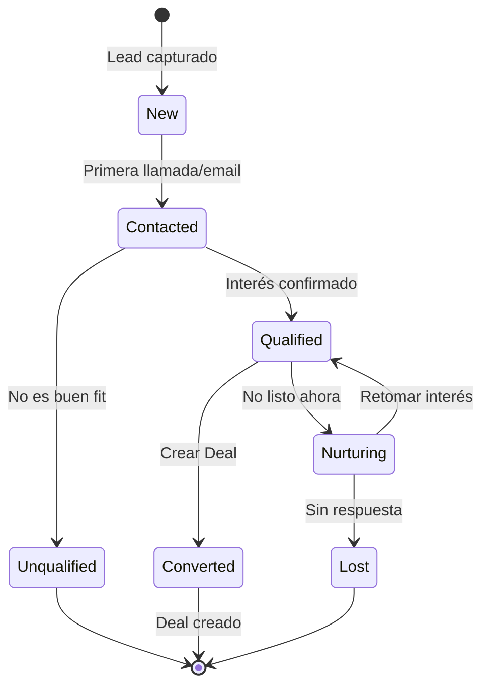
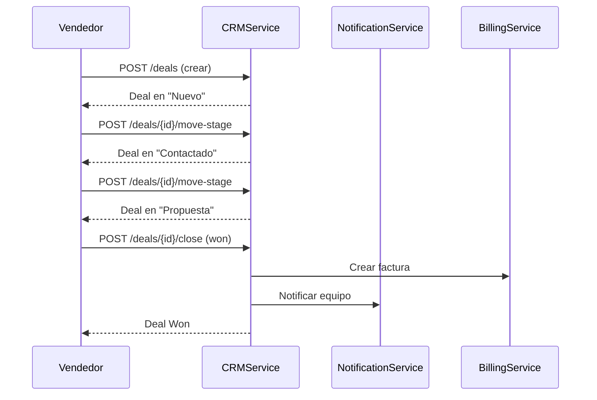

# 📊 CRMService - Matriz de Procesos

> **Servicio:** CRMService  
> **Puerto:** 5085  
> **Base de Datos:** crmservicedb  
> **Última Actualización:** Enero 25, 2026  
> **Estado:** 🟢 ACTIVO  
> **Estado de Implementación:** 🟡 Backend 85% | UI 75%

---

## ⚠️ AUDITORÍA DE ACCESO UI (Enero 25, 2026)

> **Estado:** UI accesible desde `/dealer/leads` para dealers

| Rol           | Backend | Acceso UI | Observación      |
| ------------- | ------- | --------- | ---------------- |
| **DLR-STAFF** | ✅ 100% | ✅ 80%    | Leads + Pipeline |
| **DLR-ADMIN** | ✅ 100% | ✅ 75%    | + Analytics      |

### Rutas UI Existentes ✅

- ✅ `/dealer/leads` - Lista de leads
- ✅ `/dealer/leads/{id}` - Detalle de lead
- ✅ `/dealer/analytics` - Métricas (incluye CRM)

### Rutas UI Faltantes 🔴

| Ruta Propuesta           | Funcionalidad        | Prioridad |
| ------------------------ | -------------------- | --------- |
| `/dealer/crm/pipeline`   | Kanban de pipeline   | 🟡 MEDIA  |
| `/dealer/crm/deals`      | Deals/Oportunidades  | 🟡 MEDIA  |
| `/dealer/crm/activities` | Timeline actividades | 🟡 MEDIA  |

---

## 📊 Resumen de Implementación (ACTUALIZADO)

| Componente             | Backend | Acceso UI | Estado Real |
| ---------------------- | ------- | --------- | ----------- |
| **Controllers**        | ✅ 100% | 🟡 75%    | 🟡 88%      |
| **Procesos (LEAD-\*)** | 🟡 67%  | 🟡 80%    | 🟡 74%      |
| **Procesos (DEAL-\*)** | 🟡 60%  | 🔴 40%    | 🔴 50%      |
| **Procesos (PIPE-\*)** | ✅ 100% | 🔴 50%    | 🟡 75%      |
| **Procesos (ACT-\*)**  | ✅ 100% | 🟡 60%    | 🟡 80%      |
| **Tests Unitarios**    | 🟡 75%  | N/A       | 🟡 75%      |

### Leyenda de Estados

- ✅ **IMPLEMENTADO Y PROBADO**: Código completo con tests
- 🟢 **IMPLEMENTADO**: Código completo, falta testing
- 🟡 **EN PROGRESO**: Implementación parcial
- 🔴 **PENDIENTE**: No implementado

---

## 1. Información General

### 1.1 Descripción

CRMService gestiona todo el ciclo de vida de leads y oportunidades de venta para dealers en OKLA. Implementa:

- Gestión de Leads (prospectos)
- Pipeline de ventas con Kanban
- Deals (oportunidades de venta)
- Actividades y seguimiento
- Scoring de leads automático
- Multi-tenancy por dealer

### 1.2 Dependencias

| Servicio            | Propósito                  |
| ------------------- | -------------------------- |
| AuthService         | Validación JWT, usuarios   |
| DealerService       | Multi-tenancy, info dealer |
| VehiclesSaleService | Vehículos de interés       |
| NotificationService | Recordatorios, alertas     |
| BillingService      | Conversión a ventas        |
| ContactService      | Gestión de contactos       |

### 1.3 Arquitectura

```
┌─────────────────────────────────────────────────────────────────────────────┐
│                         CRMService Architecture                              │
├─────────────────────────────────────────────────────────────────────────────┤
│                                                                              │
│   Lead Sources                       Core Service                            │
│   ┌────────────────┐                ┌────────────────────────────────┐      │
│   │ Website Forms  │──┐             │           CRMService             │      │
│   │ (Contact)      │  │             │  ┌──────────────────────────┐   │      │
│   └────────────────┘  │             │  │ Controllers              │   │      │
│   ┌────────────────┐  │             │  │ • LeadsController        │   │      │
│   │ VehiclesSale   │──┼────────────▶│  │ • DealsController        │   │      │
│   │ (Inquiries)    │  │             │  │ • PipelineController     │   │      │
│   └────────────────┘  │             │  │ • ActivitiesController   │   │      │
│   ┌────────────────┐  │             │  └──────────────────────────┘   │      │
│   │ Phone/WhatsApp │──┤             │  ┌──────────────────────────┐   │      │
│   │ (Calls)        │  │             │  │ Application (CQRS)       │   │      │
│   └────────────────┘  │             │  │ • CreateLeadCommand      │   │      │
│   ┌────────────────┐  │             │  │ • UpdateDealCommand      │   │      │
│   │ Walk-ins       │──┘             │  │ • MovePipelineStageCmd   │   │      │
│   │ (Manual Entry) │               │  │ • GetLeadsByDealerQuery  │   │      │
│   └────────────────┘               │  └──────────────────────────┘   │      │
│                                    │  ┌──────────────────────────┐   │      │
│   Integrations                     │  │ Domain                   │   │      │
│   ┌────────────────┐               │  │ • Lead, Deal, Activity   │   │      │
│   │ LeadScoring    │──────────────▶│  │ • Pipeline, Stage        │   │      │
│   │ Service        │               │  │ • Task, Note, Contact    │   │      │
│   └────────────────┘               │  └──────────────────────────┘   │      │
│                                    └────────────────────────────────┘      │
│                                                    │                        │
│                                    ┌───────────────┼───────────────┐        │
│                                    ▼               ▼               ▼        │
│                            ┌────────────┐  ┌────────────┐  ┌────────────┐  │
│                            │ PostgreSQL │  │   Redis    │  │  RabbitMQ  │  │
│                            │ (Leads,    │  │ (Dashboard,│  │ (Lead      │  │
│                            │  Deals)    │  │  Cache)    │  │  Events)   │  │
│                            └────────────┘  └────────────┘  └────────────┘  │
│                                                                              │
└─────────────────────────────────────────────────────────────────────────────┘
```

### 1.4 Tecnologías

- **.NET 8.0** con Repository Pattern
- **PostgreSQL** para persistencia
- **RabbitMQ** para eventos
- **Redis** para cache de dashboards

---

## 2. Endpoints API

### 2.1 LeadsController

| Método   | Ruta                               | Descripción               | Auth |
| -------- | ---------------------------------- | ------------------------- | ---- |
| `GET`    | `/api/crm/leads`                   | Listar todos los leads    | ✅   |
| `GET`    | `/api/crm/leads/{id}`              | Obtener lead por ID       | ✅   |
| `GET`    | `/api/crm/leads/status/{status}`   | Filtrar por estado        | ✅   |
| `GET`    | `/api/crm/leads/search?query=`     | Buscar leads              | ✅   |
| `GET`    | `/api/crm/leads/assigned/{userId}` | Leads asignados a usuario | ✅   |
| `GET`    | `/api/crm/leads/recent/{count}`    | Leads recientes           | ✅   |
| `POST`   | `/api/crm/leads`                   | Crear nuevo lead          | ✅   |
| `PUT`    | `/api/crm/leads/{id}`              | Actualizar lead           | ✅   |
| `DELETE` | `/api/crm/leads/{id}`              | Eliminar lead             | ✅   |

### 2.2 DealsController

| Método | Ruta                                 | Descripción            | Auth |
| ------ | ------------------------------------ | ---------------------- | ---- |
| `GET`  | `/api/crm/deals`                     | Listar todos los deals | ✅   |
| `GET`  | `/api/crm/deals/{id}`                | Obtener deal por ID    | ✅   |
| `GET`  | `/api/crm/deals/pipeline/{id}`       | Deals por pipeline     | ✅   |
| `GET`  | `/api/crm/deals/stage/{id}`          | Deals por etapa        | ✅   |
| `GET`  | `/api/crm/deals/status/{status}`     | Filtrar por estado     | ✅   |
| `GET`  | `/api/crm/deals/closing-soon/{days}` | Por cerrar pronto      | ✅   |
| `POST` | `/api/crm/deals`                     | Crear nuevo deal       | ✅   |
| `PUT`  | `/api/crm/deals/{id}`                | Actualizar deal        | ✅   |
| `POST` | `/api/crm/deals/{id}/close`          | Cerrar deal (Won/Lost) | ✅   |
| `POST` | `/api/crm/deals/{id}/move-stage`     | Mover a otra etapa     | ✅   |

### 2.3 PipelinesController

| Método   | Ruta                            | Descripción           | Auth |
| -------- | ------------------------------- | --------------------- | ---- |
| `GET`    | `/api/crm/pipelines`            | Listar pipelines      | ✅   |
| `GET`    | `/api/crm/pipelines/{id}`       | Obtener pipeline      | ✅   |
| `GET`    | `/api/crm/pipelines/default`    | Pipeline por defecto  | ✅   |
| `GET`    | `/api/crm/pipelines/{id}/deals` | Deals del pipeline    | ✅   |
| `GET`    | `/api/crm/pipelines/{id}/stats` | Estadísticas (Kanban) | ✅   |
| `POST`   | `/api/crm/pipelines`            | Crear pipeline        | ✅   |
| `PUT`    | `/api/crm/pipelines/{id}`       | Actualizar pipeline   | ✅   |
| `DELETE` | `/api/crm/pipelines/{id}`       | Eliminar pipeline     | ✅   |

### 2.4 ActivitiesController

| Método   | Ruta                                    | Descripción            | Auth |
| -------- | --------------------------------------- | ---------------------- | ---- |
| `GET`    | `/api/crm/activities`                   | Listar actividades     | ✅   |
| `GET`    | `/api/crm/activities/{id}`              | Obtener actividad      | ✅   |
| `GET`    | `/api/crm/activities/lead/{leadId}`     | Actividades de un lead | ✅   |
| `GET`    | `/api/crm/activities/deal/{dealId}`     | Actividades de un deal | ✅   |
| `GET`    | `/api/crm/activities/upcoming/{days}`   | Próximas actividades   | ✅   |
| `GET`    | `/api/crm/activities/overdue`           | Actividades vencidas   | ✅   |
| `GET`    | `/api/crm/activities/assigned/{userId}` | Asignadas a usuario    | ✅   |
| `GET`    | `/api/crm/activities/pending-count`     | Conteo pendientes      | ✅   |
| `POST`   | `/api/crm/activities`                   | Crear actividad        | ✅   |
| `PUT`    | `/api/crm/activities/{id}`              | Actualizar actividad   | ✅   |
| `POST`   | `/api/crm/activities/{id}/complete`     | Marcar completada      | ✅   |
| `DELETE` | `/api/crm/activities/{id}`              | Eliminar actividad     | ✅   |

---

## 3. Entidades del Dominio

### 3.1 Enumeraciones

```csharp
// Fuente del lead
public enum LeadSource
{
    Website = 0,       // Formulario web OKLA
    WhatsApp = 1,      // Mensaje de WhatsApp
    Phone = 2,         // Llamada telefónica
    Email = 3,         // Correo electrónico
    Referral = 4,      // Referido
    WalkIn = 5,        // Visita presencial
    SocialMedia = 6,   // Redes sociales
    Advertising = 7,   // Publicidad
    TradeShow = 8,     // Feria/evento
    Partner = 9,       // Socio comercial
    Other = 99
}

// Estado del lead
public enum LeadStatus
{
    New = 0,           // Nuevo, sin contactar
    Contacted = 1,     // Contactado
    Qualified = 2,     // Calificado como oportunidad
    Unqualified = 3,   // No calificado
    Nurturing = 4,     // En seguimiento largo
    Converted = 5,     // Convertido a deal
    Lost = 6           // Perdido
}

// Estado del deal
public enum DealStatus
{
    Open = 0,          // Abierto, activo
    Won = 1,           // Ganado
    Lost = 2           // Perdido
}

// Tipo de actividad
public enum ActivityType
{
    Task = 0,          // Tarea general
    Call = 1,          // Llamada telefónica
    Meeting = 2,       // Reunión
    Email = 3,         // Enviar email
    WhatsApp = 4,      // Mensaje WhatsApp
    TestDrive = 5,     // Prueba de manejo
    Followup = 6,      // Seguimiento
    Demo = 7,          // Demostración
    Note = 8           // Nota interna
}

// Estado de actividad
public enum ActivityStatus
{
    Pending = 0,       // Pendiente
    InProgress = 1,    // En progreso
    Completed = 2,     // Completada
    Cancelled = 3      // Cancelada
}
```

### 3.2 Entidades Principales

| Entidad    | Descripción                  | Campos Clave                                        |
| ---------- | ---------------------------- | --------------------------------------------------- |
| `Lead`     | Prospecto/contacto potencial | FirstName, LastName, Email, Source, Status, Score   |
| `Deal`     | Oportunidad de venta         | Title, Value, Currency, PipelineId, StageId, Status |
| `Pipeline` | Pipeline de ventas           | Name, Description, IsDefault, Stages[]              |
| `Stage`    | Etapa del pipeline           | Name, Order, Color, PipelineId                      |
| `Activity` | Actividad/tarea              | Title, Type, DueDate, Status, LeadId/DealId         |

### 3.3 Lead Entity

```csharp
public class Lead : ITenantEntity
{
    public Guid Id { get; private set; }
    public Guid DealerId { get; set; }

    // Contact
    public string FirstName { get; private set; }
    public string LastName { get; private set; }
    public string Email { get; private set; }
    public string? Phone { get; private set; }
    public string? Company { get; private set; }
    public string? JobTitle { get; private set; }

    // Lead Details
    public LeadSource Source { get; private set; }
    public LeadStatus Status { get; private set; }
    public int Score { get; private set; }  // 0-100
    public decimal? EstimatedValue { get; private set; }

    // Assignment
    public Guid? AssignedToUserId { get; private set; }

    // Vehicle Interest
    public Guid? InterestedProductId { get; private set; }
    public string? InterestedProductNotes { get; private set; }

    // Conversion
    public DateTime? ConvertedAt { get; private set; }
    public Guid? ConvertedToDealId { get; private set; }

    // Metadata
    public List<string> Tags { get; private set; }
    public string? Notes { get; private set; }
    public DateTime CreatedAt { get; private set; }
    public DateTime UpdatedAt { get; private set; }
}
```

### 3.4 Deal Entity

```csharp
public class Deal : ITenantEntity
{
    public Guid Id { get; private set; }
    public Guid DealerId { get; set; }

    // Deal Info
    public string Title { get; private set; }
    public string? Description { get; private set; }
    public decimal Value { get; private set; }
    public string Currency { get; private set; } = "DOP";

    // Pipeline
    public Guid PipelineId { get; private set; }
    public Guid StageId { get; private set; }
    public int StageOrder { get; private set; }

    // Status
    public DealStatus Status { get; private set; }
    public int Probability { get; private set; }  // 0-100%

    // Dates
    public DateTime? ExpectedCloseDate { get; private set; }
    public DateTime? ActualCloseDate { get; private set; }

    // Relationships
    public Guid? LeadId { get; private set; }
    public Guid? ContactId { get; private set; }
    public Guid? AssignedToUserId { get; private set; }

    // Vehicle
    public Guid? ProductId { get; private set; }
    public string? VIN { get; private set; }

    // Won/Lost
    public string? LostReason { get; private set; }
    public string? WonNotes { get; private set; }

    public DateTime CreatedAt { get; private set; }
    public DateTime UpdatedAt { get; private set; }
}
```

---

## 4. Procesos Detallados

### 4.1 CRM-LEAD-001: Crear Nuevo Lead

| Campo          | Valor               |
| -------------- | ------------------- |
| **ID**         | CRM-LEAD-001        |
| **Nombre**     | Capturar Nuevo Lead |
| **Actor**      | Sistema / Vendedor  |
| **Criticidad** | 🔴 CRÍTICO          |
| **Estado**     | 🟢 ACTIVO           |

**Precondiciones:**

- Dealer autenticado (header X-Dealer-Id)
- Información de contacto válida

**Request Body:**

```json
{
  "firstName": "Carlos",
  "lastName": "Ramírez",
  "email": "carlos.ramirez@email.com",
  "phone": "+1-809-555-1234",
  "company": "Empresa ABC",
  "source": "Website",
  "interestedProductId": "veh_abc123",
  "notes": "Interesado en Toyota Camry 2020"
}
```

**Headers:**

```
X-Dealer-Id: 3fa85f64-5717-4562-b3fc-2c963f66afa6
Authorization: Bearer <token>
```

**Flujo Paso a Paso:**

| Paso | Acción                  | Componente          | Descripción                    |
| ---- | ----------------------- | ------------------- | ------------------------------ |
| 1    | Recibir request         | LeadsController     | POST /api/crm/leads            |
| 2    | Extraer DealerId        | Controller          | Header X-Dealer-Id             |
| 3    | Validar datos           | Validator           | Email válido, nombre requerido |
| 4    | Parsear source          | Handler             | LeadSource enum                |
| 5    | Crear entidad Lead      | Constructor         | Status = New, Score = 0        |
| 6    | Persistir               | LeadRepository      | INSERT en PostgreSQL           |
| 7    | Asignar automáticamente | AssignmentService   | Round-robin a vendedores       |
| 8    | Publicar evento         | RabbitMQ            | `lead.created`                 |
| 9    | Notificar vendedor      | NotificationService | Push + Email                   |
| 10   | Crear actividad         | ActivityService     | "Contactar nuevo lead"         |
| 11   | Responder               | Controller          | 201 Created + LeadDto          |

**Response (201 Created):**

```json
{
  "id": "3fa85f64-5717-4562-b3fc-2c963f66afa6",
  "firstName": "Carlos",
  "lastName": "Ramírez",
  "email": "carlos.ramirez@email.com",
  "phone": "+1-809-555-1234",
  "company": "Empresa ABC",
  "source": "Website",
  "status": "New",
  "score": 0,
  "assignedToUserId": null,
  "createdAt": "2026-01-21T10:30:00Z"
}
```

**Postcondiciones:**

- Lead registrado en sistema
- Vendedor notificado
- Actividad de seguimiento creada
- Evento publicado para analytics

**Códigos de Error:**

| Código | Error               | Descripción                      |
| ------ | ------------------- | -------------------------------- |
| 400    | `INVALID_EMAIL`     | Email mal formado                |
| 400    | `MISSING_DEALER_ID` | Header X-Dealer-Id faltante      |
| 400    | `INVALID_SOURCE`    | LeadSource no reconocido         |
| 409    | `DUPLICATE_LEAD`    | Email ya existe para este dealer |

---

### 4.2 CRM-LEAD-002: Calificar Lead

| Campo          | Valor                    |
| -------------- | ------------------------ |
| **ID**         | CRM-LEAD-002             |
| **Nombre**     | Actualizar Score de Lead |
| **Actor**      | Vendedor / Sistema IA    |
| **Criticidad** | 🟠 ALTO                  |
| **Estado**     | 🟢 ACTIVO                |

**Precondiciones:**

- Lead existe
- Usuario tiene permisos sobre el lead

**Request Body:**

```json
{
  "firstName": "Carlos",
  "lastName": "Ramírez",
  "email": "carlos.ramirez@email.com",
  "phone": "+1-809-555-1234",
  "company": "Empresa ABC",
  "jobTitle": "Gerente de Ventas",
  "status": "Qualified",
  "score": 75
}
```

**Flujo Paso a Paso:**

| Paso | Acción              | Componente               | Descripción                |
| ---- | ------------------- | ------------------------ | -------------------------- |
| 1    | Obtener lead        | LeadRepository           | GetByIdAsync               |
| 2    | Actualizar contacto | Lead.UpdateContactInfo() | Datos de contacto          |
| 3    | Actualizar status   | Lead.UpdateStatus()      | New → Qualified            |
| 4    | Actualizar score    | Lead.UpdateScore()       | 0-100, clamped             |
| 5    | Persistir           | LeadRepository           | UPDATE                     |
| 6    | Publicar evento     | RabbitMQ                 | `lead.qualified`           |
| 7    | Si score > 70       | AutoConvertService       | Sugerir convertir a deal   |
| 8    | Notificar           | NotificationService      | "Lead calificado como hot" |

**Response (200 OK):**

```json
{
  "id": "3fa85f64-5717-4562-b3fc-2c963f66afa6",
  "status": "Qualified",
  "score": 75,
  "updatedAt": "2026-01-21T11:00:00Z"
}
```

**Reglas de Scoring:**

| Factor                           | Puntos      |
| -------------------------------- | ----------- |
| Email corporativo                | +15         |
| Teléfono proporcionado           | +10         |
| Vehículo de interés especificado | +20         |
| Responde en < 24h                | +15         |
| Visita presencial                | +25         |
| Solicita prueba de manejo        | +20         |
| Pregunta por financiamiento      | +10         |
| Múltiples interacciones          | +5 por cada |

---

### 4.3 CRM-LEAD-003: Convertir Lead a Deal

| Campo          | Valor                        |
| -------------- | ---------------------------- |
| **ID**         | CRM-LEAD-003                 |
| **Nombre**     | Convertir Lead a Oportunidad |
| **Actor**      | Vendedor                     |
| **Criticidad** | 🔴 CRÍTICO                   |
| **Estado**     | 🟢 ACTIVO                    |

**Precondiciones:**

- Lead en estado Qualified
- Pipeline configurado para el dealer

**Request (implícito en CreateDealRequest):**

```json
{
  "title": "Venta Toyota Camry - Carlos Ramírez",
  "value": 1250000,
  "leadId": "3fa85f64-5717-4562-b3fc-2c963f66afa6",
  "pipelineId": null,
  "stageId": null
}
```

**Flujo Paso a Paso:**

| Paso | Acción                   | Componente         | Descripción                           |
| ---- | ------------------------ | ------------------ | ------------------------------------- |
| 1    | Obtener pipeline default | PipelineRepository | Si no se especifica                   |
| 2    | Obtener primera etapa    | Pipeline.Stages    | Order = 1                             |
| 3    | Crear Deal               | Deal constructor   | Status = Open, Probability = 10%      |
| 4    | Persistir Deal           | DealRepository     | INSERT                                |
| 5    | Actualizar Lead          | Lead.Convert()     | Status = Converted, ConvertedToDealId |
| 6    | Copiar actividades       | ActivityService    | Relacionar con nuevo deal             |
| 7    | Publicar evento          | RabbitMQ           | `lead.converted`                      |
| 8    | Publicar evento          | RabbitMQ           | `deal.created`                        |
| 9    | Responder                | Controller         | 201 Created + DealDto                 |

**Response (201 Created):**

```json
{
  "id": "4fa85f64-5717-4562-b3fc-2c963f66afa7",
  "title": "Venta Toyota Camry - Carlos Ramírez",
  "value": 1250000,
  "currency": "DOP",
  "pipelineId": "...",
  "stageId": "...",
  "stageName": "Nuevo",
  "status": "Open",
  "probability": 10,
  "leadId": "3fa85f64-5717-4562-b3fc-2c963f66afa6",
  "createdAt": "2026-01-21T12:00:00Z"
}
```

---

### 4.4 CRM-DEAL-001: Mover Deal en Pipeline

| Campo          | Valor                   |
| -------------- | ----------------------- |
| **ID**         | CRM-DEAL-001            |
| **Nombre**     | Mover Deal a Otra Etapa |
| **Actor**      | Vendedor                |
| **Criticidad** | 🟠 ALTO                 |
| **Estado**     | 🟢 ACTIVO               |

**Precondiciones:**

- Deal existe y está Open
- Stage pertenece al mismo pipeline

**Request Body:**

```json
{
  "stageId": "5fa85f64-5717-4562-b3fc-2c963f66afa8"
}
```

**Flujo Paso a Paso:**

| Paso | Acción                  | Componente         | Descripción                    |
| ---- | ----------------------- | ------------------ | ------------------------------ |
| 1    | Obtener deal            | DealRepository     | GetByIdAsync                   |
| 2    | Validar stage           | PipelineRepository | Stage pertenece al pipeline    |
| 3    | Obtener stage order     | Stage              | Nuevo orden                    |
| 4    | Mover deal              | Deal.MoveToStage() | Actualizar StageId, StageOrder |
| 5    | Actualizar probabilidad | AutoProbability    | Según etapa                    |
| 6    | Persistir               | DealRepository     | UPDATE                         |
| 7    | Crear actividad         | ActivityService    | "Movido a [StageName]"         |
| 8    | Publicar evento         | RabbitMQ           | `deal.stage.changed`           |

**Response (200 OK):**

```json
{
  "id": "4fa85f64-5717-4562-b3fc-2c963f66afa7",
  "stageId": "5fa85f64-5717-4562-b3fc-2c963f66afa8",
  "stageName": "Negociación",
  "probability": 60,
  "updatedAt": "2026-01-21T14:00:00Z"
}
```

**Probabilidad Automática por Etapa:**

| Etapa         | Probabilidad |
| ------------- | ------------ |
| Nuevo         | 10%          |
| Contactado    | 20%          |
| Calificado    | 40%          |
| Propuesta     | 60%          |
| Negociación   | 75%          |
| Cierre Verbal | 90%          |

---

### 4.5 CRM-DEAL-002: Cerrar Deal

| Campo          | Valor                         |
| -------------- | ----------------------------- |
| **ID**         | CRM-DEAL-002                  |
| **Nombre**     | Cerrar Oportunidad (Won/Lost) |
| **Actor**      | Vendedor                      |
| **Criticidad** | 🔴 CRÍTICO                    |
| **Estado**     | 🟢 ACTIVO                     |

**Precondiciones:**

- Deal existe y está Open
- Razón requerida si Lost

**Request Body (Won):**

```json
{
  "won": true,
  "notes": "Cliente firmó contrato. Pago con financiamiento Banreservas.",
  "actualValue": 1200000
}
```

**Request Body (Lost):**

```json
{
  "won": false,
  "lostReason": "price",
  "notes": "Cliente consiguió mejor precio en competencia."
}
```

**Flujo Paso a Paso:**

| Paso | Acción               | Componente          | Descripción               |
| ---- | -------------------- | ------------------- | ------------------------- |
| 1    | Obtener deal         | DealRepository      | GetByIdAsync              |
| 2    | Validar estado       | Handler             | Debe ser Open             |
| 3    | Cerrar deal          | Deal.Close()        | Won/Lost, ActualCloseDate |
| 4    | Si Won               | Deal.MarkAsWon()    | WonNotes, actualValue     |
| 5    | Si Lost              | Deal.MarkAsLost()   | LostReason                |
| 6    | Persistir            | DealRepository      | UPDATE                    |
| 7    | Actualizar vehículo  | VehicleService      | Si Won, marcar vendido    |
| 8    | Crear factura        | BillingService      | Si Won                    |
| 9    | Publicar evento      | RabbitMQ            | `deal.won` o `deal.lost`  |
| 10   | Notificar gerente    | NotificationService | Resumen de cierre         |
| 11   | Actualizar analytics | AnalyticsService    | Win rate, revenue         |

**Response (200 OK):**

```json
{
  "id": "4fa85f64-5717-4562-b3fc-2c963f66afa7",
  "status": "Won",
  "actualCloseDate": "2026-01-21T16:00:00Z",
  "value": 1200000,
  "updatedAt": "2026-01-21T16:00:00Z"
}
```

**Razones de Pérdida Predefinidas:**

| Código        | Razón                    |
| ------------- | ------------------------ |
| `price`       | Precio muy alto          |
| `competitor`  | Eligió competidor        |
| `timing`      | No es el momento         |
| `budget`      | Sin presupuesto          |
| `financing`   | No aprobó financiamiento |
| `no_response` | Sin respuesta            |
| `other`       | Otra razón               |

---

### 4.6 CRM-ACT-001: Crear Actividad

| Campo          | Valor                              |
| -------------- | ---------------------------------- |
| **ID**         | CRM-ACT-001                        |
| **Nombre**     | Programar Actividad de Seguimiento |
| **Actor**      | Vendedor / Sistema                 |
| **Criticidad** | 🟡 MEDIO                           |
| **Estado**     | 🟢 ACTIVO                          |

**Precondiciones:**

- Lead o Deal existe
- Usuario autenticado

**Request Body:**

```json
{
  "title": "Llamar para seguimiento",
  "type": "Call",
  "dueDate": "2026-01-22T10:00:00Z",
  "duration": 15,
  "leadId": "3fa85f64-5717-4562-b3fc-2c963f66afa6",
  "dealId": null,
  "assignedToUserId": "user_xyz",
  "priority": 1,
  "notes": "Confirmar interés en Toyota Camry"
}
```

**Flujo Paso a Paso:**

| Paso | Acción                 | Componente           | Descripción              |
| ---- | ---------------------- | -------------------- | ------------------------ |
| 1    | Validar asociación     | Handler              | Lead o Deal debe existir |
| 2    | Crear actividad        | Activity constructor | Status = Pending         |
| 3    | Persistir              | ActivityRepository   | INSERT                   |
| 4    | Programar recordatorio | Hangfire             | Antes de DueDate         |
| 5    | Publicar evento        | RabbitMQ             | `activity.created`       |
| 6    | Notificar asignado     | NotificationService  | Si asignado a otro       |

**Response (201 Created):**

```json
{
  "id": "6fa85f64-5717-4562-b3fc-2c963f66afa9",
  "title": "Llamar para seguimiento",
  "type": "Call",
  "status": "Pending",
  "dueDate": "2026-01-22T10:00:00Z",
  "leadId": "3fa85f64-5717-4562-b3fc-2c963f66afa6",
  "createdAt": "2026-01-21T17:00:00Z"
}
```

---

### 4.7 CRM-PIPE-001: Estadísticas de Pipeline (Kanban)

| Campo          | Valor                            |
| -------------- | -------------------------------- |
| **ID**         | CRM-PIPE-001                     |
| **Nombre**     | Obtener Estadísticas de Pipeline |
| **Actor**      | Vendedor / Gerente               |
| **Criticidad** | 🟡 MEDIO                         |
| **Estado**     | 🟢 ACTIVO                        |

**Precondiciones:**

- Pipeline existe
- Usuario tiene acceso al dealer

**Request:** `GET /api/crm/pipelines/{id}/stats`

**Flujo Paso a Paso:**

| Paso | Acción                  | Componente         | Descripción             |
| ---- | ----------------------- | ------------------ | ----------------------- |
| 1    | Obtener pipeline        | PipelineRepository | Con stages              |
| 2    | Obtener deals           | DealRepository     | Por pipeline            |
| 3    | Agrupar por etapa       | LINQ               | Group by StageId        |
| 4    | Calcular totales        | Handler            | Count, SumValue         |
| 5    | Ordenar por stage order | LINQ               | OrderBy Stage.Order     |
| 6    | Cachear resultado       | Redis              | TTL 1 minuto            |
| 7    | Responder               | Controller         | PipelineStageStatsDto[] |

**Response (200 OK):**

```json
[
  {
    "stageId": "...",
    "stageName": "Nuevo",
    "color": "#6366F1",
    "count": 12,
    "totalValue": 15000000,
    "deals": [
      {
        "id": "...",
        "title": "Venta Toyota Camry",
        "value": 1250000,
        "probability": 10,
        "daysInStage": 2
      }
    ]
  },
  {
    "stageId": "...",
    "stageName": "Contactado",
    "color": "#10B981",
    "count": 8,
    "totalValue": 9600000,
    "deals": [...]
  }
]
```

---

## 5. Flujos de Integración

### 5.1 Diagrama de Ciclo de Vida del Lead



### 5.2 Diagrama de Pipeline de Ventas



---

## 6. Reglas de Negocio

### 6.1 Asignación Automática de Leads

| Criterio         | Asignación                       |
| ---------------- | -------------------------------- |
| Round-robin      | Por defecto, rotativo            |
| Por territorio   | Si Lead tiene provincia          |
| Por especialidad | Si vehículo requiere experto     |
| Por carga        | Vendedor con menos leads activos |

### 6.2 Alertas Automáticas

| Condición                | Alerta              |
| ------------------------ | ------------------- |
| Lead sin contactar > 2h  | Push al vendedor    |
| Deal sin movimiento > 7d | Email al gerente    |
| Actividad vencida        | Push + Email        |
| Lead hot (score > 80)    | Push inmediato      |
| Deal por cerrar < 3d     | Recordatorio diario |

### 6.3 Límites por Plan de Dealer

| Plan       | Leads     | Deals     | Pipelines | Usuarios  |
| ---------- | --------- | --------- | --------- | --------- |
| Starter    | 100/mes   | 50        | 1         | 2         |
| Pro        | 500/mes   | 200       | 3         | 10        |
| Enterprise | Ilimitado | Ilimitado | Ilimitado | Ilimitado |

---

## 7. Eventos RabbitMQ

### 7.1 Eventos Publicados

| Evento               | Exchange     | Descripción          |
| -------------------- | ------------ | -------------------- |
| `lead.created`       | `crm.events` | Nuevo lead capturado |
| `lead.updated`       | `crm.events` | Lead actualizado     |
| `lead.qualified`     | `crm.events` | Lead calificado      |
| `lead.converted`     | `crm.events` | Lead → Deal          |
| `lead.lost`          | `crm.events` | Lead perdido         |
| `deal.created`       | `crm.events` | Nueva oportunidad    |
| `deal.stage.changed` | `crm.events` | Movido en pipeline   |
| `deal.won`           | `crm.events` | Deal ganado          |
| `deal.lost`          | `crm.events` | Deal perdido         |
| `activity.created`   | `crm.events` | Nueva actividad      |
| `activity.completed` | `crm.events` | Actividad completada |
| `activity.overdue`   | `crm.events` | Actividad vencida    |

### 7.2 Eventos Consumidos

| Evento                      | Source          | Acción                |
| --------------------------- | --------------- | --------------------- |
| `vehicle.inquiry.received`  | ContactService  | Crear lead automático |
| `chatbot.lead.captured`     | ChatbotService  | Crear lead con datos  |
| `whatsapp.message.received` | WhatsAppService | Actualizar actividad  |
| `user.assigned`             | UserService     | Notificar nuevo lead  |

---

## 8. Configuración

### 8.1 appsettings.json

```json
{
  "ConnectionStrings": {
    "DefaultConnection": "Host=postgres;Database=crmservicedb;Username=postgres;Password=${DB_PASSWORD}"
  },
  "RabbitMQ": {
    "Host": "rabbitmq",
    "Port": 5672,
    "Exchange": "crm.events"
  },
  "CRM": {
    "LeadAutoAssignment": true,
    "LeadContactDeadlineHours": 2,
    "DealStagnationDays": 7,
    "ActivityReminderMinutes": 30,
    "HotLeadScoreThreshold": 80,
    "DefaultPipelineName": "Ventas de Vehículos",
    "DefaultStages": [
      { "name": "Nuevo", "order": 1, "color": "#6366F1" },
      { "name": "Contactado", "order": 2, "color": "#10B981" },
      { "name": "Calificado", "order": 3, "color": "#F59E0B" },
      { "name": "Propuesta", "order": 4, "color": "#3B82F6" },
      { "name": "Negociación", "order": 5, "color": "#8B5CF6" },
      { "name": "Cierre", "order": 6, "color": "#EC4899" }
    ]
  },
  "Redis": {
    "ConnectionString": "redis:6379",
    "Database": 3
  }
}
```

---

## 9. Métricas y Monitoreo

### 9.1 Prometheus Metrics

```
# Leads
crm_leads_total{status="New|Qualified|Converted|Lost", dealer_id}
crm_lead_conversion_rate{dealer_id}
crm_lead_response_time_seconds{dealer_id, quantile}

# Deals
crm_deals_total{status="Open|Won|Lost", dealer_id}
crm_deal_value_total{status="Won", dealer_id}
crm_deal_cycle_time_days{dealer_id, quantile}
crm_win_rate{dealer_id}

# Activities
crm_activities_pending_count{dealer_id}
crm_activities_overdue_count{dealer_id}
crm_activities_completed_total{type, dealer_id}
```

### 9.2 Alertas

| Alerta           | Condición                 | Severidad |
| ---------------- | ------------------------- | --------- |
| LeadNotContacted | Lead > 4h sin contactar   | 🟠 High   |
| DealStagnant     | Deal > 14d sin movimiento | 🟡 Medium |
| ActivityOverdue  | > 5 actividades vencidas  | 🟠 High   |
| WinRateDrop      | Win rate < 20%            | 🟠 High   |
| HighLeadVolume   | > 100 leads/hora          | 🟡 Medium |

---

## 10. Seguridad

### 10.1 Multi-Tenancy

- Todos los endpoints filtran por `X-Dealer-Id`
- Entidades implementan `ITenantEntity`
- Repository aplica filtro automático
- Un dealer no puede ver datos de otro

### 10.2 Control de Acceso

| Rol      | Permisos                                 |
| -------- | ---------------------------------------- |
| Vendedor | CRUD leads/deals asignados, ver pipeline |
| Gerente  | CRUD todo, reasignar, reportes           |
| Admin    | Full access, configuración               |

### 10.3 Auditoría

- CreatedAt, UpdatedAt en todas las entidades
- CreatedBy, UpdatedBy para trazabilidad
- Eventos RabbitMQ para log externo

---

## 11. Historial de Cambios

| Fecha      | Versión | Cambios                      |
| ---------- | ------- | ---------------------------- |
| 2026-01-21 | 1.0.0   | Documentación inicial        |
| -          | -       | 4 controllers documentados   |
| -          | -       | 7 procesos detallados        |
| -          | -       | Pipeline Kanban implementado |

---

**Documento mantenido por:** Equipo de Desarrollo OKLA  
**Contacto:** dev@okla.com.do  
**Próxima revisión:** 2026-04-21
