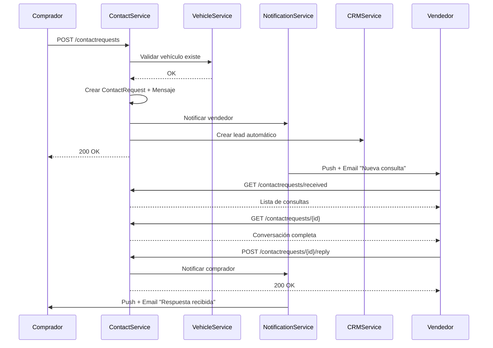
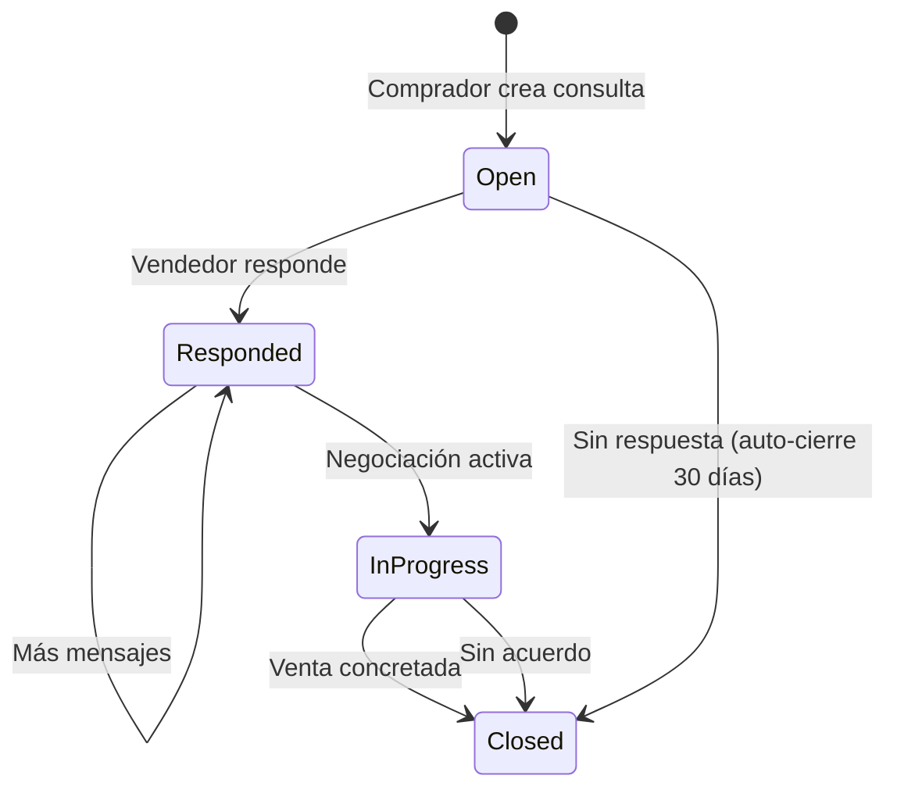

# 📧 ContactService - Matriz de Procesos

> **Servicio:** ContactService  
> **Puerto:** 5075  
> **Base de Datos:** contactservicedb  
> **Última Actualización:** Enero 21, 2026  
> **Estado:** 🟢 ACTIVO

---

## 📊 Resumen de Implementación

| Componente   | Total | Implementado | Pendiente | Estado |
| ------------ | ----- | ------------ | --------- | ------ |
| Controllers  | 2     | 2            | 0         | 🟢     |
| CONT-INQ-\*  | 6     | 6            | 0         | 🟢     |
| CONT-MSG-\*  | 5     | 5            | 0         | 🟢     |
| CONT-CONV-\* | 4     | 4            | 0         | 🟢     |
| Tests        | 12    | 12           | 0         | ✅     |

**Leyenda:** ✅ Implementado + Tested | 🟢 Implementado | 🟡 En Progreso | 🔴 Pendiente

---

## 1. Información General

### 1.1 Descripción

ContactService gestiona toda la comunicación entre compradores y vendedores en el marketplace OKLA. Implementa:

- Sistema de consultas/inquiries sobre vehículos
- Mensajería bidireccional con historial
- Gestión de estados de conversación
- Conteo de mensajes no leídos
- Multi-tenancy por dealer

### 1.2 Dependencias

| Servicio            | Propósito                             |
| ------------------- | ------------------------------------- |
| AuthService         | Validación JWT, IDs de usuario        |
| VehiclesSaleService | Validación de vehículos               |
| UserService         | Información de compradores/vendedores |
| NotificationService | Alertas de nuevos mensajes            |
| CRMService          | Creación automática de leads          |

### 1.3 Arquitectura

```
┌─────────────────────────────────────────────────────────────────────────────┐
│                       ContactService Architecture                            │
├─────────────────────────────────────────────────────────────────────────────┤
│                                                                              │
│   Participants                       Core Service                            │
│   ┌────────────────┐                ┌────────────────────────────────┐      │
│   │ Buyers         │──┐             │          ContactService          │      │
│   │ (Inquiries)    │  │             │  ┌──────────────────────────┐   │      │
│   └────────────────┘  │             │  │ Controllers              │   │      │
│   ┌────────────────┐  │             │  │ • ContactRequestsCtrl    │   │      │
│   │ Sellers        │──┼────────────▶│  │ • ContactMessagesCtrl    │   │      │
│   │ (Responses)    │  │             │  └──────────────────────────┘   │      │
│   └────────────────┘  │             │  ┌──────────────────────────┐   │      │
│   ┌────────────────┐  │             │  │ Application (CQRS)       │   │      │
│   │ Dealers        │──┘             │  │ • CreateInquiryCommand   │   │      │
│   │ (CRM View)     │               │  │ • ReplyToInquiryCmd      │   │      │
│   └────────────────┘               │  │ • GetConversationQuery   │   │      │
│                                    │  │ • MarkAsReadCommand      │   │      │
│   Integrations                     │  └──────────────────────────┘   │      │
│   ┌────────────────┐               │  ┌──────────────────────────┐   │      │
│   │ CRMService     │◀─────────────│  │ Domain                   │   │      │
│   │ (Lead Create)  │               │  │ • ContactRequest, Msg   │   │      │
│   └────────────────┘               │  │ • Conversation, Status   │   │      │
│   ┌────────────────┐               │  └──────────────────────────┘   │      │
│   │ Notification   │◀─────────────└────────────────────────────────┘      │
│   │ Service        │                           │                        │
│   └────────────────┘               ┌───────────┼───────────┐                │
│                                    ▼           ▼           ▼                │
│                            ┌────────────┐ ┌────────────┐ ┌────────────┐   │
│                            │ PostgreSQL │ │   Redis    │ │  RabbitMQ  │   │
│                            │ (Messages, │ │ (Unread    │ │ (Message   │   │
│                            │  Requests) │ │  Counts)   │ │  Events)   │   │
│                            └────────────┘ └────────────┘ └────────────┘   │
│                                                                              │
└─────────────────────────────────────────────────────────────────────────────┘
```

### 1.4 Tecnologías

- **.NET 8.0** con Repository Pattern
- **PostgreSQL** para persistencia
- **RabbitMQ** para eventos
- **SignalR** para mensajería en tiempo real (futuro)

---

## 2. Endpoints API

### 2.1 ContactRequestsController

| Método | Ruta                                | Descripción                    | Auth |
| ------ | ----------------------------------- | ------------------------------ | ---- |
| `POST` | `/api/contactrequests`              | Crear consulta sobre vehículo  | ✅   |
| `GET`  | `/api/contactrequests/my-inquiries` | Mis consultas (comprador)      | ✅   |
| `GET`  | `/api/contactrequests/received`     | Consultas recibidas (vendedor) | ✅   |
| `GET`  | `/api/contactrequests/{id}`         | Ver conversación completa      | ✅   |
| `POST` | `/api/contactrequests/{id}/reply`   | Responder a consulta           | ✅   |

### 2.2 ContactMessagesController

| Método | Ruta                                  | Descripción               | Auth |
| ------ | ------------------------------------- | ------------------------- | ---- |
| `POST` | `/api/contactmessages/{id}/mark-read` | Marcar mensaje como leído | ✅   |
| `GET`  | `/api/contactmessages/unread-count`   | Contar mensajes no leídos | ✅   |

---

## 3. Entidades del Dominio

### 3.1 Enumeraciones

```csharp
// Estado de la solicitud de contacto
public enum ContactRequestStatus
{
    Open,          // Nueva, sin responder
    InProgress,    // En proceso
    Responded,     // Vendedor respondió
    Closed         // Cerrada
}
```

### 3.2 Entidades Principales

| Entidad          | Descripción                    | Campos Clave                            |
| ---------------- | ------------------------------ | --------------------------------------- |
| `ContactRequest` | Solicitud de contacto/consulta | VehicleId, BuyerId, SellerId, Status    |
| `ContactMessage` | Mensaje en una conversación    | ContactRequestId, SenderId, IsFromBuyer |

### 3.3 ContactRequest Entity

```csharp
public class ContactRequest : ITenantEntity
{
    public Guid Id { get; set; }
    public Guid DealerId { get; set; }  // Multi-tenant

    // Relacionados
    public Guid VehicleId { get; set; }
    public Guid BuyerId { get; set; }
    public Guid SellerId { get; set; }

    // Datos del comprador
    public string Subject { get; set; }      // Máx 100 chars
    public string BuyerName { get; set; }    // Máx 100 chars
    public string BuyerEmail { get; set; }   // EmailAddress
    public string? BuyerPhone { get; set; }  // Máx 20 chars
    public string Message { get; set; }      // Máx 2000 chars

    // Estado
    public string Status { get; set; } = "Open";
    public DateTime CreatedAt { get; set; }
    public DateTime? RespondedAt { get; set; }

    // Navegación
    public List<ContactMessage> Messages { get; set; }
}
```

### 3.4 ContactMessage Entity

```csharp
public class ContactMessage : ITenantEntity
{
    public Guid Id { get; set; }
    public Guid DealerId { get; set; }  // Multi-tenant

    public Guid ContactRequestId { get; set; }
    public Guid SenderId { get; set; }
    public string Message { get; set; }  // Máx 2000 chars

    public bool IsFromBuyer { get; set; }
    public bool IsRead { get; set; } = false;
    public DateTime SentAt { get; set; }

    // Navegación
    public ContactRequest? ContactRequest { get; set; }
}
```

---

## 4. Procesos Detallados

### 4.1 CONTACT-001: Crear Consulta sobre Vehículo

| Campo          | Valor                       |
| -------------- | --------------------------- |
| **ID**         | CONTACT-001                 |
| **Nombre**     | Crear Solicitud de Contacto |
| **Actor**      | Comprador                   |
| **Criticidad** | 🔴 CRÍTICO                  |
| **Estado**     | 🟢 ACTIVO                   |

**Precondiciones:**

- Usuario autenticado como comprador
- Vehículo existe y está activo
- Vendedor tiene cuenta activa

**Request Body:**

```json
{
  "vehicleId": "3fa85f64-5717-4562-b3fc-2c963f66afa6",
  "sellerId": "4fa85f64-5717-4562-b3fc-2c963f66afa7",
  "subject": "Interesado en Toyota Camry 2020",
  "buyerName": "Carlos Ramírez",
  "buyerEmail": "carlos@email.com",
  "buyerPhone": "+1-809-555-1234",
  "message": "Me interesa este vehículo. ¿Sigue disponible? ¿Aceptan financiamiento?"
}
```

**Headers:**

```
Authorization: Bearer <token>
```

**Flujo Paso a Paso:**

| Paso | Acción                   | Componente                 | Descripción                        |
| ---- | ------------------------ | -------------------------- | ---------------------------------- |
| 1    | Recibir request          | ContactRequestsController  | POST /api/contactrequests          |
| 2    | Extraer userId           | Controller                 | Claim NameIdentifier               |
| 3    | Validar datos            | Validator                  | Subject, Email, Message requeridos |
| 4    | Crear entidad            | ContactRequest constructor | Status = "Open"                    |
| 5    | Persistir ContactRequest | ContactRequestRepository   | INSERT                             |
| 6    | Crear mensaje inicial    | ContactMessage             | IsFromBuyer = true                 |
| 7    | Persistir mensaje        | ContactMessageRepository   | INSERT                             |
| 8    | Publicar evento          | RabbitMQ                   | `contact.request.created`          |
| 9    | Notificar vendedor       | NotificationService        | Push + Email                       |
| 10   | Crear lead               | CRMService                 | Nuevo lead automático              |
| 11   | Responder                | Controller                 | 200 OK + ContactRequestDto         |

**Response (200 OK):**

```json
{
  "id": "5fa85f64-5717-4562-b3fc-2c963f66afa8",
  "vehicleId": "3fa85f64-5717-4562-b3fc-2c963f66afa6",
  "subject": "Interesado en Toyota Camry 2020",
  "status": "Open",
  "createdAt": "2026-01-21T10:30:00Z"
}
```

**Postcondiciones:**

- Solicitud registrada en sistema
- Mensaje inicial creado
- Vendedor notificado
- Lead creado en CRM (opcional)

**Códigos de Error:**

| Código | Error               | Descripción              |
| ------ | ------------------- | ------------------------ |
| 400    | `INVALID_EMAIL`     | Email mal formado        |
| 400    | `MESSAGE_REQUIRED`  | Mensaje vacío            |
| 400    | `SUBJECT_TOO_LONG`  | Subject > 100 caracteres |
| 404    | `VEHICLE_NOT_FOUND` | Vehículo no existe       |
| 404    | `SELLER_NOT_FOUND`  | Vendedor no existe       |

---

### 4.2 CONTACT-002: Ver Consultas Enviadas (Comprador)

| Campo          | Valor                |
| -------------- | -------------------- |
| **ID**         | CONTACT-002          |
| **Nombre**     | Listar Mis Consultas |
| **Actor**      | Comprador            |
| **Criticidad** | 🟡 MEDIO             |
| **Estado**     | 🟢 ACTIVO            |

**Precondiciones:**

- Usuario autenticado

**Request:** `GET /api/contactrequests/my-inquiries`

**Flujo Paso a Paso:**

| Paso | Acción           | Componente               | Descripción              |
| ---- | ---------------- | ------------------------ | ------------------------ |
| 1    | Extraer userId   | Controller               | Claim NameIdentifier     |
| 2    | Consultar        | ContactRequestRepository | GetByBuyerIdAsync        |
| 3    | Incluir mensajes | EF Core                  | Include(Messages)        |
| 4    | Proyectar DTO    | LINQ                     | Select campos relevantes |
| 5    | Responder        | Controller               | Lista de inquiries       |

**Response (200 OK):**

```json
[
  {
    "id": "5fa85f64-5717-4562-b3fc-2c963f66afa8",
    "vehicleId": "3fa85f64-5717-4562-b3fc-2c963f66afa6",
    "subject": "Interesado en Toyota Camry 2020",
    "status": "Responded",
    "createdAt": "2026-01-21T10:30:00Z",
    "respondedAt": "2026-01-21T11:15:00Z",
    "messageCount": 3,
    "lastMessage": "Sí, el vehículo está disponible..."
  }
]
```

---

### 4.3 CONTACT-003: Ver Consultas Recibidas (Vendedor)

| Campo          | Valor                      |
| -------------- | -------------------------- |
| **ID**         | CONTACT-003                |
| **Nombre**     | Listar Consultas Recibidas |
| **Actor**      | Vendedor                   |
| **Criticidad** | 🔴 CRÍTICO                 |
| **Estado**     | 🟢 ACTIVO                  |

**Precondiciones:**

- Usuario autenticado como vendedor
- Tiene vehículos publicados

**Request:** `GET /api/contactrequests/received`

**Flujo Paso a Paso:**

| Paso | Acción          | Componente               | Descripción                                     |
| ---- | --------------- | ------------------------ | ----------------------------------------------- |
| 1    | Extraer userId  | Controller               | Como sellerId                                   |
| 2    | Consultar       | ContactRequestRepository | GetBySellerIdAsync                              |
| 3    | Calcular unread | LINQ                     | Messages.Count(m => !m.IsRead && m.IsFromBuyer) |
| 4    | Ordenar         | LINQ                     | Por fecha más reciente                          |
| 5    | Responder       | Controller               | Lista con unreadCount                           |

**Response (200 OK):**

```json
[
  {
    "id": "5fa85f64-5717-4562-b3fc-2c963f66afa8",
    "vehicleId": "3fa85f64-5717-4562-b3fc-2c963f66afa6",
    "subject": "Interesado en Toyota Camry 2020",
    "buyerName": "Carlos Ramírez",
    "buyerEmail": "carlos@email.com",
    "buyerPhone": "+1-809-555-1234",
    "status": "Open",
    "createdAt": "2026-01-21T10:30:00Z",
    "respondedAt": null,
    "messageCount": 1,
    "unreadCount": 1
  }
]
```

**Indicadores Visuales:**

- `unreadCount > 0` → Badge con número
- `status = "Open"` → Requiere atención
- Sin respuesta por > 24h → Alerta

---

### 4.4 CONTACT-004: Ver Conversación Completa

| Campo          | Valor                           |
| -------------- | ------------------------------- |
| **ID**         | CONTACT-004                     |
| **Nombre**     | Obtener Detalle de Conversación |
| **Actor**      | Comprador / Vendedor            |
| **Criticidad** | 🟡 MEDIO                        |
| **Estado**     | 🟢 ACTIVO                       |

**Precondiciones:**

- Usuario es comprador O vendedor de la conversación

**Request:** `GET /api/contactrequests/{id}`

**Flujo Paso a Paso:**

| Paso | Acción                 | Componente               | Descripción                             |
| ---- | ---------------------- | ------------------------ | --------------------------------------- |
| 1    | Obtener ContactRequest | ContactRequestRepository | GetByIdAsync                            |
| 2    | Validar acceso         | Handler                  | BuyerId == userId OR SellerId == userId |
| 3    | Si no autorizado       | Controller               | Return 403 Forbid                       |
| 4    | Obtener mensajes       | ContactMessageRepository | GetByContactRequestIdAsync              |
| 5    | Ordenar mensajes       | LINQ                     | OrderBy SentAt                          |
| 6    | Marcar leídos          | Handler                  | Mensajes del otro usuario               |
| 7    | Responder              | Controller               | ContactRequest + Messages               |

**Response (200 OK):**

```json
{
  "id": "5fa85f64-5717-4562-b3fc-2c963f66afa8",
  "vehicleId": "3fa85f64-5717-4562-b3fc-2c963f66afa6",
  "subject": "Interesado en Toyota Camry 2020",
  "buyerName": "Carlos Ramírez",
  "buyerEmail": "carlos@email.com",
  "buyerPhone": "+1-809-555-1234",
  "status": "Responded",
  "createdAt": "2026-01-21T10:30:00Z",
  "messages": [
    {
      "id": "msg1",
      "senderId": "buyer123",
      "message": "Me interesa este vehículo...",
      "isFromBuyer": true,
      "isRead": true,
      "sentAt": "2026-01-21T10:30:00Z"
    },
    {
      "id": "msg2",
      "senderId": "seller456",
      "message": "Sí, el vehículo está disponible...",
      "isFromBuyer": false,
      "isRead": true,
      "sentAt": "2026-01-21T11:15:00Z"
    }
  ]
}
```

---

### 4.5 CONTACT-005: Responder a Consulta

| Campo          | Valor                |
| -------------- | -------------------- |
| **ID**         | CONTACT-005          |
| **Nombre**     | Enviar Respuesta     |
| **Actor**      | Comprador / Vendedor |
| **Criticidad** | 🔴 CRÍTICO           |
| **Estado**     | 🟢 ACTIVO            |

**Precondiciones:**

- Usuario es parte de la conversación
- Conversación no está cerrada

**Request Body:**

```json
{
  "message": "Sí, el vehículo sigue disponible. ¿Le gustaría agendar una prueba de manejo?"
}
```

**Flujo Paso a Paso:**

| Paso | Acción                         | Componente               | Descripción                             |
| ---- | ------------------------------ | ------------------------ | --------------------------------------- |
| 1    | Obtener ContactRequest         | ContactRequestRepository | GetByIdAsync                            |
| 2    | Validar acceso                 | Handler                  | Usuario es buyer o seller               |
| 3    | Determinar origen              | Handler                  | IsFromBuyer = (buyerId == userId)       |
| 4    | Crear mensaje                  | ContactMessage           | Constructor                             |
| 5    | Persistir mensaje              | ContactMessageRepository | CreateAsync                             |
| 6    | Si es vendedor y status="Open" | Handler                  | Status = "Responded", RespondedAt = now |
| 7    | Actualizar ContactRequest      | ContactRequestRepository | UpdateAsync                             |
| 8    | Publicar evento                | RabbitMQ                 | `contact.message.sent`                  |
| 9    | Notificar destinatario         | NotificationService      | Push + Email                            |
| 10   | Responder                      | Controller               | 200 OK + MessageDto                     |

**Response (200 OK):**

```json
{
  "id": "6fa85f64-5717-4562-b3fc-2c963f66afa9",
  "message": "Sí, el vehículo sigue disponible...",
  "sentAt": "2026-01-21T11:15:00Z"
}
```

---

### 4.6 CONTACT-006: Contar Mensajes No Leídos

| Campo          | Valor                       |
| -------------- | --------------------------- |
| **ID**         | CONTACT-006                 |
| **Nombre**     | Obtener Conteo de No Leídos |
| **Actor**      | Usuario                     |
| **Criticidad** | 🟡 MEDIO                    |
| **Estado**     | 🟢 ACTIVO                   |

**Precondiciones:**

- Usuario autenticado

**Request:** `GET /api/contactmessages/unread-count`

**Flujo Paso a Paso:**

| Paso | Acción          | Componente               | Descripción                |
| ---- | --------------- | ------------------------ | -------------------------- |
| 1    | Extraer userId  | Controller               | Claim                      |
| 2    | Contar mensajes | ContactMessageRepository | GetUnreadCountForUserAsync |
| 3    | Responder       | Controller               | { count: N }               |

**Response (200 OK):**

```json
{
  "count": 5
}
```

**Uso en UI:**

- Badge en icono de mensajes
- Actualización periódica (polling/WebSocket)

---

## 5. Flujos de Integración

### 5.1 Diagrama de Flujo de Consulta



### 5.2 Diagrama de Estados de Conversación



---

## 6. Reglas de Negocio

### 6.1 Límites de Mensajes

| Plan    | Mensajes/Día | Conversaciones Activas |
| ------- | ------------ | ---------------------- |
| Free    | 10           | 5                      |
| Starter | 50           | 25                     |
| Pro     | Ilimitado    | Ilimitado              |

### 6.2 Auto-Cierre de Conversaciones

| Condición                        | Acción             |
| -------------------------------- | ------------------ |
| Sin respuesta vendedor > 30 días | Auto-cerrar        |
| Sin actividad > 90 días          | Auto-archivar      |
| Vehículo vendido                 | Notificar y cerrar |

### 6.3 Restricciones de Contenido

- Sin enlaces externos (evitar phishing)
- Sin datos bancarios
- Sin información personal excesiva
- Filtro de spam activo

---

## 7. Eventos RabbitMQ

### 7.1 Eventos Publicados

| Evento                      | Exchange         | Descripción          |
| --------------------------- | ---------------- | -------------------- |
| `contact.request.created`   | `contact.events` | Nueva consulta       |
| `contact.message.sent`      | `contact.events` | Nuevo mensaje        |
| `contact.request.responded` | `contact.events` | Primera respuesta    |
| `contact.request.closed`    | `contact.events` | Conversación cerrada |

### 7.2 Eventos Consumidos

| Evento            | Source              | Acción                |
| ----------------- | ------------------- | --------------------- |
| `vehicle.sold`    | VehiclesSaleService | Cerrar conversaciones |
| `vehicle.deleted` | VehiclesSaleService | Notificar compradores |
| `user.blocked`    | UserService         | Bloquear mensajes     |

---

## 8. Configuración

### 8.1 appsettings.json

```json
{
  "ConnectionStrings": {
    "DefaultConnection": "Host=postgres;Database=contactservicedb;..."
  },
  "RabbitMQ": {
    "Host": "rabbitmq",
    "Exchange": "contact.events"
  },
  "Contact": {
    "MaxMessageLength": 2000,
    "AutoCloseAfterDays": 30,
    "AutoArchiveAfterDays": 90,
    "SpamFilterEnabled": true
  }
}
```

---

## 9. Métricas

### 9.1 Prometheus Metrics

```
# Consultas
contact_requests_total{status="Open|Responded|Closed"}
contact_response_time_seconds{quantile}
contact_first_response_time_seconds{quantile}

# Mensajes
contact_messages_total{direction="buyer|seller"}
contact_unread_messages_gauge{user_id}
```

---

## 10. Seguridad

### 10.1 Control de Acceso

- Solo buyer/seller pueden ver conversación
- Mensajes no se pueden editar/eliminar
- Rate limiting por usuario
- Filtro de contenido malicioso

### 10.2 Privacidad

- Datos de contacto solo visibles para el vendedor
- Email nunca expuesto públicamente
- Teléfono opcional

---

## 11. Historial de Cambios

| Fecha      | Versión | Cambios                    |
| ---------- | ------- | -------------------------- |
| 2026-01-21 | 1.0.0   | Documentación inicial      |
| -          | -       | 2 controllers documentados |
| -          | -       | 6 procesos detallados      |

---

**Documento mantenido por:** Equipo de Desarrollo OKLA  
**Contacto:** dev@okla.com.do  
**Próxima revisión:** 2026-04-21
