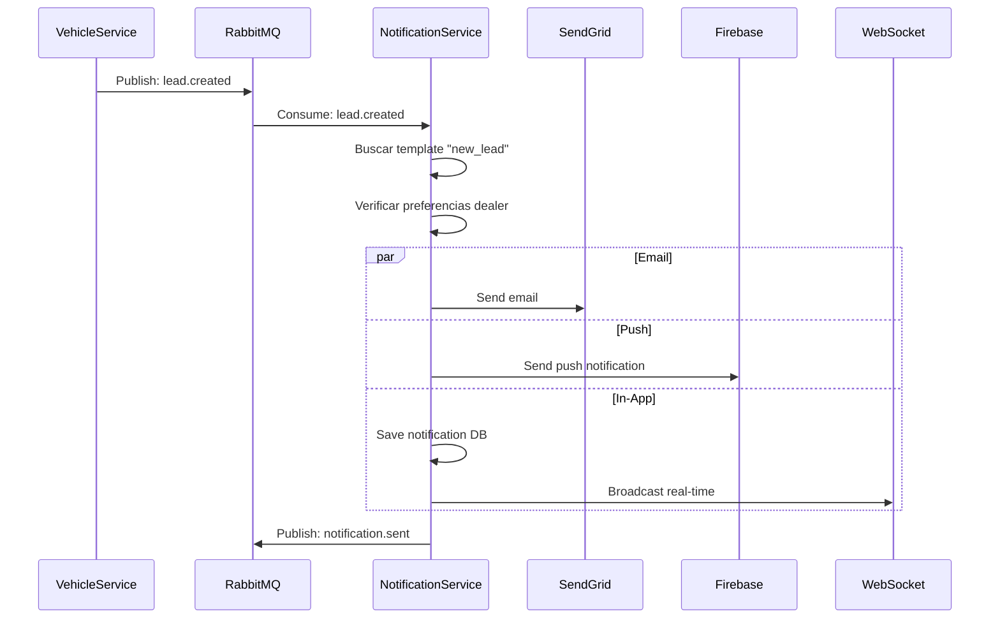
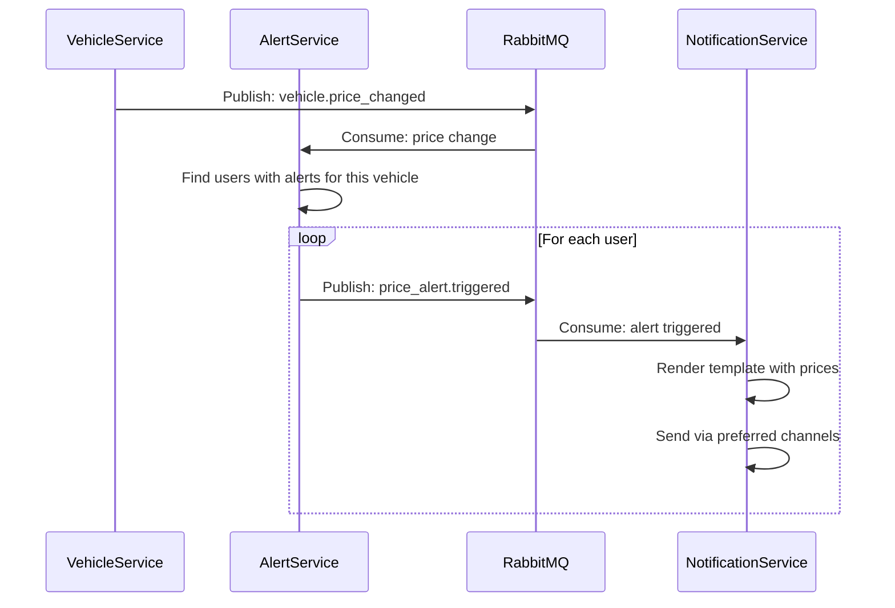

# 🔔 NotificationService - Matriz de Procesos

> **Servicio:** NotificationService  
> **Puerto:** 15040 (Docker), 80 (K8s)  
> **Base de Datos:** notificationservice (PostgreSQL)  
> **Última actualización:** Enero 25, 2026  
> **Estado:** ✅ PRODUCCIÓN - Emails funcionando con Resend  
> **Estado de Implementación:** ✅ 100% Backend | 🟡 70% UI

---

## ⚠️ AUDITORÍA DE ACCESO UI (Enero 25, 2026)

> **Estado:** Backend 100% completo. UI tiene acceso parcial (notificaciones toast/bell, falta centro de notificaciones).

| Proceso                 | Backend | UI Access | Observación                 |
| ----------------------- | ------- | --------- | --------------------------- |
| Envío de notificaciones | ✅ 100% | N/A       | Backend only                |
| Ver notificaciones      | ✅ 100% | 🟡 60%    | Solo toast/bell, sin centro |
| Preferencias de usuario | ✅ 100% | 🔴 30%    | UI básico en /settings      |
| Templates admin         | ✅ 100% | 🔴 0%     | Sin UI admin                |
| Historial               | ✅ 100% | 🔴 0%     | Sin página de historial     |

### Rutas UI Existentes ✅

- ✅ Bell icon en header (notificaciones in-app)
- ✅ Toast notifications (push en tiempo real)
- ✅ `/settings` (preferencias básicas)

### Rutas UI Faltantes 🔴

| Ruta Propuesta                   | Funcionalidad            | Prioridad |
| -------------------------------- | ------------------------ | --------- |
| `/notifications`                 | Centro de notificaciones | 🟡 MEDIA  |
| `/notifications/history`         | Historial completo       | 🟢 BAJA   |
| `/admin/notifications/templates` | Gestión de templates     | 🟡 MEDIA  |
| `/admin/notifications/campaigns` | Campañas marketing       | 🟡 MEDIA  |

---

## 📊 Resumen de Implementación

| Componente              | Total | Implementado | Pendiente | Estado  |
| ----------------------- | ----- | ------------ | --------- | ------- |
| **Controllers**         | 7     | 7            | 0         | ✅ 100% |
| **Procesos (NOTIF-\*)** | 5     | 5            | 0         | ✅ 100% |
| **Procesos (TPL-\*)**   | 4     | 4            | 0         | ✅ 100% |
| **Procesos (PREF-\*)**  | 3     | 3            | 0         | ✅ 100% |
| **Procesos (SCHED-\*)** | 3     | 3            | 0         | ✅ 100% |
| **Tests Unitarios**     | 28    | 28           | 0         | ✅ 100% |

### Leyenda de Estados

- ✅ **IMPLEMENTADO Y PROBADO**: Código completo con tests
- 🟢 **IMPLEMENTADO**: Código completo, falta testing
- 🟡 **EN PROGRESO**: Implementación parcial
- 🔴 **PENDIENTE**: No implementado

---

## 1. Información General

### 1.1 Descripción

El NotificationService gestiona el envío de notificaciones multicanal (Email, SMS, Push, In-App) para OKLA. Implementa plantillas dinámicas con Handlebars, notificaciones programadas con Cron, y preferencias de usuario para control de canales.

### 1.2 Estado de Integración ✅

| Proveedor    | Estado         | Uso                 | Notas                                                 |
| ------------ | -------------- | ------------------- | ----------------------------------------------------- |
| **Resend**   | ✅ Funcionando | Email transaccional | API Key configurado, dominio `okla.com.do` verificado |
| **Twilio**   | 🔶 Pendiente   | SMS, WhatsApp       | Configurar credenciales                               |
| **Firebase** | 🔶 Pendiente   | Push notifications  | Configurar proyecto                                   |

### 1.3 Canales Soportados

| Canal        | Proveedor       | Estado          | Uso Principal            |
| ------------ | --------------- | --------------- | ------------------------ |
| **Email**    | Resend          | ✅ Activo       | Transaccional, Marketing |
| **SMS**      | Twilio          | 🔶 Pendiente    | OTP, Alertas críticas    |
| **Push**     | Firebase (FCM)  | 🔶 Pendiente    | Mobile, Desktop          |
| **In-App**   | WebSocket       | ✅ Implementado | UI notifications bell    |
| **WhatsApp** | Twilio (futuro) | 🔶 Pendiente    | Mensajes business        |

### 1.4 Dependencias

| Servicio       | Propósito              |
| -------------- | ---------------------- |
| AuthService    | Validar usuarios       |
| UserService    | Datos de contacto      |
| BillingService | Notificaciones de pago |
| VehicleService | Alertas de vehículos   |

### 1.5 Arquitectura

```
┌─────────────────────────────────────────────────────────────────────────────┐
│                    NotificationService Architecture                          │
├─────────────────────────────────────────────────────────────────────────────┤
│                                                                              │
│   Event Sources                     Core Service                             │
│   ┌────────────────┐               ┌──────────────────────────────────┐     │
│   │ AuthService    │──┐            │       NotificationService        │     │
│   │ (OTP, Welcome) │  │            │  ┌────────────────────────────┐  │     │
│   └────────────────┘  │            │  │ Controllers                │  │     │
│   ┌────────────────┐  │            │  │ • NotificationsController  │  │     │
│   │ BillingService │──┼───────────▶│  │ • TemplatesController      │  │     │
│   │ (Payments)     │  │            │  │ • PreferencesController    │  │     │
│   └────────────────┘  │            │  │ • ScheduledController      │  │     │
│   ┌────────────────┐  │            │  └────────────────────────────┘  │     │
│   │ VehicleService │──┤            │  ┌────────────────────────────┐  │     │
│   │ (Alerts)       │  │            │  │ Application (CQRS)         │  │     │
│   └────────────────┘  │            │  │ • SendNotificationCommand  │  │     │
│   ┌────────────────┐  │            │  │ • ScheduleNotificationCmd  │  │     │
│   │ CRMService     │──┘            │  │ • RenderTemplateQuery      │  │     │
│   │ (Leads)        │               │  └────────────────────────────┘  │     │
│   └────────────────┘               └──────────────────────────────────┘     │
│                                                    │                        │
│                                    ┌───────────────┴───────────────┐        │
│                                    ▼                               ▼        │
│   Delivery Channels        ┌─────────────────────────────────────────────┐ │
│   ┌────────────────┐       │                Providers                    │ │
│   │   📧 Email     │◀──────│  ┌──────────┐  ┌──────────┐  ┌──────────┐  │ │
│   │   (Resend)     │       │  │  Resend  │  │  Twilio  │  │ Firebase │  │ │
│   └────────────────┘       │  │  (Email) │  │  (SMS)   │  │  (Push)  │  │ │
│   ┌────────────────┐       │  └──────────┘  └──────────┘  └──────────┘  │ │
│   │   📱 SMS       │◀──────│                                            │ │
│   │   (Twilio)     │       └─────────────────────────────────────────────┘ │
│   └────────────────┘                           │                           │
│   ┌────────────────┐               ┌───────────┼───────────┐               │
│   │   🔔 Push      │◀──────        ▼           ▼           ▼               │
│   │   (Firebase)   │       ┌────────────┐ ┌────────────┐ ┌────────────┐   │
│   └────────────────┘       │ PostgreSQL │ │   Redis    │ │  RabbitMQ  │   │
│   ┌────────────────┐       │ (Templates,│ │  (Queue,   │ │  (Events)  │   │
│   │   🔔 In-App    │       │  History)  │ │  Dedup)    │ │            │   │
│   │   (WebSocket)  │       └────────────┘ └────────────┘ └────────────┘   │
│   └────────────────┘                                                       │
│                                                                              │
└─────────────────────────────────────────────────────────────────────────────┘
```

### 1.6 Controllers

| Controller                        | Archivo                              | Endpoints |
| --------------------------------- | ------------------------------------ | --------- |
| NotificationsController           | NotificationsController.cs           | 4         |
| TemplatesController               | TemplatesController.cs               | 10        |
| NotificationPreferencesController | NotificationPreferencesController.cs | 5         |
| ScheduledNotificationsController  | ScheduledNotificationsController.cs  | 6         |
| UserNotificationsController       | UserNotificationsController.cs       | 8         |
| WebhooksController                | WebhooksController.cs                | 2         |
| TeamsController                   | TeamsController.cs                   | 4         |

---

## 2. Endpoints API

### 2.1 NotificationsController

| Método | Endpoint                         | Descripción            | Auth |
| ------ | -------------------------------- | ---------------------- | ---- |
| POST   | `/api/notifications/email`       | Enviar email           | ✅   |
| POST   | `/api/notifications/sms`         | Enviar SMS             | ✅   |
| POST   | `/api/notifications/push`        | Enviar push            | ✅   |
| GET    | `/api/notifications/{id}/status` | Estado de notificación | ✅   |

### 2.2 TemplatesController

| Método | Endpoint                             | Descripción               | Auth     |
| ------ | ------------------------------------ | ------------------------- | -------- |
| POST   | `/api/templates`                     | Crear template            | ✅ Admin |
| GET    | `/api/templates/{id}`                | Obtener template          | ✅       |
| GET    | `/api/templates`                     | Listar templates          | ✅       |
| GET    | `/api/templates/name/{name}`         | Buscar por nombre         | ✅       |
| GET    | `/api/templates/type/{type}`         | Por tipo (Email/SMS/Push) | ✅       |
| GET    | `/api/templates/category/{category}` | Por categoría             | ✅       |
| PUT    | `/api/templates/{id}`                | Actualizar template       | ✅ Admin |
| DELETE | `/api/templates/{id}`                | Eliminar template         | ✅ Admin |
| POST   | `/api/templates/{id}/preview`        | Preview con datos         | ✅       |
| POST   | `/api/templates/{id}/test`           | Enviar test               | ✅       |

### 2.3 NotificationPreferencesController

| Método | Endpoint                                | Descripción          | Auth |
| ------ | --------------------------------------- | -------------------- | ---- |
| GET    | `/api/notifications/preferences`        | Obtener preferencias | ✅   |
| PUT    | `/api/notifications/preferences/{type}` | Actualizar una       | ✅   |
| PUT    | `/api/notifications/preferences`        | Actualizar bulk      | ✅   |
| POST   | `/api/notifications/preferences/reset`  | Reset a defaults     | ✅   |
| GET    | `/api/notifications/preferences/types`  | Tipos disponibles    | ❌   |

### 2.4 ScheduledNotificationsController

| Método | Endpoint                                  | Descripción            | Auth |
| ------ | ----------------------------------------- | ---------------------- | ---- |
| POST   | `/api/notifications/scheduled`            | Programar notificación | ✅   |
| GET    | `/api/notifications/scheduled/{id}`       | Obtener por ID         | ✅   |
| GET    | `/api/notifications/scheduled`            | Listar programadas     | ✅   |
| PUT    | `/api/notifications/scheduled/{id}`       | Actualizar             | ✅   |
| DELETE | `/api/notifications/scheduled/{id}`       | Cancelar               | ✅   |
| POST   | `/api/notifications/scheduled/{id}/pause` | Pausar recurrente      | ✅   |

### 2.5 UserNotificationsController (In-App)

| Método | Endpoint                          | Descripción             | Auth |
| ------ | --------------------------------- | ----------------------- | ---- |
| GET    | `/api/notifications`              | Listar (paginado)       | ✅   |
| GET    | `/api/notifications/unread/count` | Contador unread         | ✅   |
| PATCH  | `/api/notifications/{id}/read`    | Marcar leída            | ✅   |
| PATCH  | `/api/notifications/read-all`     | Marcar todas leídas     | ✅   |
| DELETE | `/api/notifications/{id}`         | Eliminar una            | ✅   |
| DELETE | `/api/notifications/read`         | Eliminar leídas         | ✅   |
| GET    | `/api/notifications/{id}`         | Obtener una             | ✅   |
| POST   | `/api/notifications/test`         | Crear test notification | ✅   |

### 2.6 WebhooksController

| Método | Endpoint                 | Descripción     | Auth       |
| ------ | ------------------------ | --------------- | ---------- |
| POST   | `/api/webhooks/sendgrid` | SendGrid events | ❌ (firma) |
| POST   | `/api/webhooks/twilio`   | Twilio events   | ❌ (firma) |

---

## 3. Templates de Notificación

### 3.1 Categorías de Templates

| Categoría          | Descripción              | Templates |
| ------------------ | ------------------------ | --------- |
| **Transactional**  | Operaciones del sistema  | 15        |
| **Authentication** | Login, registro, OTP     | 8         |
| **Billing**        | Pagos, facturas          | 12        |
| **Vehicle**        | Publicaciones, alertas   | 10        |
| **Marketing**      | Promociones, newsletters | 6         |
| **System**         | Mantenimiento, alertas   | 5         |

### 3.2 Templates Críticos

| Template                | Tipo  | Canales             | Variables                       |
| ----------------------- | ----- | ------------------- | ------------------------------- |
| `welcome_email`         | Email | Email               | userName, verifyUrl             |
| `email_verification`    | Email | Email               | code, expiresIn                 |
| `password_reset`        | Email | Email               | resetUrl, expiresAt             |
| `otp_sms`               | SMS   | SMS                 | code, expiresIn                 |
| `payment_success`       | Email | Email, Push         | amount, invoiceUrl              |
| `payment_failed`        | Email | Email, SMS, Push    | amount, retryUrl                |
| `subscription_expiring` | Email | Email, Push         | plan, daysLeft, renewUrl        |
| `new_lead`              | Push  | Push, In-App        | vehicleName, buyerName          |
| `vehicle_approved`      | Email | Email, Push         | vehicleName, listingUrl         |
| `vehicle_sold`          | Email | Email               | vehicleName, salePrice          |
| `price_alert`           | Email | Email, Push         | vehicleName, newPrice, oldPrice |
| `maintenance_scheduled` | All   | Email, Push, In-App | startTime, endTime              |

### 3.3 Sintaxis de Templates (Handlebars)

```handlebars
<html>
  <head>
    <title>OKLA - {{subject}}</title>
  </head>
  <body>
    <h1>Hola {{userName}},</h1>

    {{#if isDealer}}
      <p>Tu vehículo
        <strong>{{vehicleName}}</strong>
        ha recibido una consulta.</p>
    {{else}}
      <p>Tienes un nuevo mensaje sobre tu vehículo.</p>
    {{/if}}

    <a href="{{actionUrl}}" class="btn">Ver Detalles</a>

    {{#each vehicles}}
      <div class="vehicle-card">
        <h3>{{this.title}}</h3>
        <p>{{formatCurrency this.price}}</p>
      </div>
    {{/each}}
  </body>
</html>
```

---

## 4. Procesos Detallados

### NOTIF-EMAIL-001: Enviar Email

| Campo          | Valor                     |
| -------------- | ------------------------- |
| **ID**         | NOTIF-EMAIL-001           |
| **Nombre**     | Enviar Notificación Email |
| **Actor**      | Sistema/Servicio          |
| **Criticidad** | 🔴 CRÍTICO                |
| **Estado**     | 🟢 ACTIVO                 |

#### Request Body

```json
{
  "to": "usuario@example.com",
  "subject": "Tu vehículo ha sido aprobado",
  "templateName": "vehicle_approved",
  "data": {
    "userName": "Juan Pérez",
    "vehicleName": "Toyota Camry 2023",
    "listingUrl": "https://okla.com.do/vehicles/abc123"
  },
  "priority": "High",
  "trackOpens": true,
  "trackClicks": true
}
```

#### Flujo Paso a Paso

| Paso | Acción                 | Servicio           | Validación           |
| ---- | ---------------------- | ------------------ | -------------------- |
| 1    | Recibir request        | Controller         | Schema válido        |
| 2    | Buscar template        | TemplateRepository | Existe y activo      |
| 3    | Validar variables      | TemplateEngine     | Requeridas presentes |
| 4    | Renderizar HTML        | Handlebars         | Compilar template    |
| 5    | Verificar preferencias | PreferencesService | Email habilitado     |
| 6    | Guardar notificación   | Repository         | Status: Pending      |
| 7    | Enviar a SendGrid      | EmailService       | API call             |
| 8    | Actualizar estado      | Repository         | Sent/Failed          |
| 9    | Publicar evento        | RabbitMQ           | NotificationSent     |
| 10   | Retornar ID            | Controller         | 200 OK               |

#### Response Success (200)

```json
{
  "notificationId": "guid",
  "status": "Sent",
  "sendGridMessageId": "abc123",
  "sentAt": "2026-01-21T10:30:00Z",
  "templateUsed": "vehicle_approved",
  "trackingEnabled": {
    "opens": true,
    "clicks": true
  }
}
```

#### Postcondiciones

- [x] Email enviado a SendGrid
- [x] Notificación registrada en DB
- [x] Evento publicado

---

### NOTIF-SMS-001: Enviar SMS

| Campo          | Valor         |
| -------------- | ------------- |
| **ID**         | NOTIF-SMS-001 |
| **Nombre**     | Enviar SMS    |
| **Actor**      | Sistema       |
| **Criticidad** | 🔴 CRÍTICO    |
| **Estado**     | 🟢 ACTIVO     |

#### Request Body

```json
{
  "to": "+18095551234",
  "templateName": "otp_sms",
  "data": {
    "code": "123456",
    "expiresIn": "5 minutos"
  }
}
```

#### Flujo Paso a Paso

| Paso | Acción                 | Servicio           | Validación           |
| ---- | ---------------------- | ------------------ | -------------------- |
| 1    | Validar número         | TwilioService      | Formato E.164        |
| 2    | Buscar template SMS    | TemplateRepository | Type = SMS           |
| 3    | Renderizar mensaje     | TemplateEngine     | Max 160 chars        |
| 4    | Verificar preferencias | PreferencesService | SMS habilitado       |
| 5    | Rate limit check       | RateLimiter        | Max 3/min por número |
| 6    | Enviar a Twilio        | TwilioService      | API call             |
| 7    | Guardar resultado      | Repository         | INSERT               |
| 8    | Retornar SID           | Controller         | 200 OK               |

#### Response Success (200)

```json
{
  "notificationId": "guid",
  "status": "Sent",
  "twilioSid": "SM123abc",
  "segmentCount": 1,
  "sentAt": "2026-01-21T10:30:00Z"
}
```

---

### NOTIF-PUSH-001: Enviar Push Notification

| Campo          | Valor          |
| -------------- | -------------- |
| **ID**         | NOTIF-PUSH-001 |
| **Nombre**     | Enviar Push    |
| **Actor**      | Sistema        |
| **Criticidad** | 🟠 ALTO        |
| **Estado**     | 🟢 ACTIVO      |

#### Request Body

```json
{
  "userId": "guid",
  "title": "Nueva consulta sobre tu vehículo",
  "body": "Juan está interesado en tu Toyota Camry",
  "data": {
    "type": "new_lead",
    "vehicleId": "guid",
    "leadId": "guid"
  },
  "imageUrl": "https://cdn.okla.com.do/vehicles/abc.jpg",
  "actionUrl": "/dashboard/leads/abc123"
}
```

#### Flujo Paso a Paso

| Paso | Acción                         | Servicio           | Validación       |
| ---- | ------------------------------ | ------------------ | ---------------- |
| 1    | Obtener FCM tokens del usuario | DeviceRepository   | Al menos 1 token |
| 2    | Verificar preferencias         | PreferencesService | Push habilitado  |
| 3    | Construir payload FCM          | PushService        |                  |
| 4    | Enviar a cada device           | FCM                | Batch call       |
| 5    | Manejar tokens inválidos       | DeviceRepository   | Eliminar stale   |
| 6    | Crear in-app notification      | Repository         | Para bell icon   |
| 7    | Broadcast WebSocket            | WebSocketHub       | Real-time        |
| 8    | Retornar resultado             | Controller         | 200 OK           |

#### FCM Payload

```json
{
  "message": {
    "token": "device_fcm_token",
    "notification": {
      "title": "Nueva consulta",
      "body": "Juan está interesado..."
    },
    "data": {
      "type": "new_lead",
      "vehicleId": "abc123",
      "click_action": "FLUTTER_NOTIFICATION_CLICK"
    },
    "android": {
      "notification": {
        "icon": "okla_logo",
        "color": "#3B82F6",
        "channel_id": "leads"
      }
    },
    "apns": {
      "payload": {
        "aps": {
          "badge": 5,
          "sound": "default"
        }
      }
    }
  }
}
```

---

### NOTIF-SCHED-001: Programar Notificación

| Campo          | Valor                  |
| -------------- | ---------------------- |
| **ID**         | NOTIF-SCHED-001        |
| **Nombre**     | Programar Notificación |
| **Actor**      | Admin/Sistema          |
| **Criticidad** | 🟠 ALTO                |
| **Estado**     | 🟢 ACTIVO              |

#### Request Body (One-time)

```json
{
  "notificationId": "guid",
  "scheduledFor": "2026-01-25T09:00:00Z",
  "timeZone": "America/Santo_Domingo"
}
```

#### Request Body (Recurring con Cron)

```json
{
  "notificationId": "guid",
  "cronExpression": "0 9 * * 1",
  "timeZone": "America/Santo_Domingo",
  "maxExecutions": 12,
  "isRecurring": true
}
```

#### Flujo Paso a Paso

| Paso | Acción                      | Servicio          | Validación      |
| ---- | --------------------------- | ----------------- | --------------- |
| 1    | Validar notificación existe | Repository        |                 |
| 2    | Parsear cron (si aplica)    | CronParser        | Sintaxis válida |
| 3    | Calcular próxima ejecución  | SchedulingService | UTC conversion  |
| 4    | Crear ScheduledNotification | Repository        | INSERT          |
| 5    | Agregar a job queue         | Hangfire/Quartz   |                 |
| 6    | Retornar scheduled          | Controller        | 201 Created     |

#### Expresiones Cron Soportadas

| Expresión     | Descripción            |
| ------------- | ---------------------- |
| `0 9 * * *`   | Diario a las 9am       |
| `0 9 * * 1`   | Lunes a las 9am        |
| `0 9 1 * *`   | Primer día del mes 9am |
| `0 9 * * 1-5` | Lun-Vie a las 9am      |
| `0 */6 * * *` | Cada 6 horas           |

---

### NOTIF-PREF-001: Gestionar Preferencias

| Campo          | Valor                   |
| -------------- | ----------------------- |
| **ID**         | NOTIF-PREF-001          |
| **Nombre**     | Actualizar Preferencias |
| **Actor**      | Usuario                 |
| **Criticidad** | 🟢 MEDIO                |
| **Estado**     | 🟢 ACTIVO               |

#### Tipos de Notificación

| Tipo                    | Descripción           | Canales Default     |
| ----------------------- | --------------------- | ------------------- |
| `new_lead`              | Nueva consulta        | Email, Push, In-App |
| `lead_response`         | Respuesta a consulta  | Email, Push         |
| `vehicle_approved`      | Vehículo aprobado     | Email, Push         |
| `vehicle_expiring`      | Listing por vencer    | Email, Push         |
| `payment_success`       | Pago exitoso          | Email               |
| `payment_failed`        | Pago fallido          | Email, SMS          |
| `subscription_expiring` | Suscripción vence     | Email, Push         |
| `price_alert`           | Alerta de precio      | Email, Push         |
| `marketing`             | Promociones           | Email               |
| `system`                | Sistema/Mantenimiento | All                 |

#### Request Body (Update)

```json
{
  "type": "marketing",
  "enabled": false,
  "channels": ["email"]
}
```

#### Flujo Paso a Paso

| Paso | Acción                 | Servicio     | Validación         |
| ---- | ---------------------- | ------------ | ------------------ |
| 1    | Obtener userId del JWT | Controller   |                    |
| 2    | Buscar preferencia     | Repository   | Crear si no existe |
| 3    | Validar canales        | Handler      | Solo válidos       |
| 4    | Actualizar preferencia | Repository   | UPDATE             |
| 5    | Invalidar cache        | CacheService |                    |
| 6    | Retornar actualizada   | Controller   | 200 OK             |

#### Response (200)

```json
{
  "type": "marketing",
  "enabled": false,
  "channels": ["email"],
  "description": "Promociones y ofertas especiales",
  "canDisable": true,
  "updatedAt": "2026-01-21T10:30:00Z"
}
```

---

### NOTIF-INAPP-001: Notificaciones In-App

| Campo          | Valor                 |
| -------------- | --------------------- |
| **ID**         | NOTIF-INAPP-001       |
| **Nombre**     | Notificaciones In-App |
| **Actor**      | Usuario               |
| **Criticidad** | 🟢 MEDIO              |
| **Estado**     | 🟢 ACTIVO             |

#### Descripción

Notificaciones que aparecen en el bell icon del header. Se muestran en tiempo real via WebSocket y se persisten para historial.

#### Request (Get Notifications)

```
GET /api/notifications?page=1&pageSize=20&unreadOnly=true
```

#### Response Success (200)

```json
{
  "notifications": [
    {
      "id": "guid",
      "title": "Nueva consulta",
      "body": "Juan está interesado en tu Toyota Camry",
      "type": "new_lead",
      "priority": "High",
      "isRead": false,
      "data": {
        "vehicleId": "guid",
        "leadId": "guid"
      },
      "actionUrl": "/dashboard/leads/abc123",
      "createdAt": "2026-01-21T10:25:00Z"
    }
  ],
  "total": 45,
  "unreadCount": 12,
  "page": 1,
  "pageSize": 20,
  "totalPages": 3
}
```

#### Mark as Read

```
PATCH /api/notifications/{id}/read

Response: 204 No Content
```

#### Mark All as Read

```
PATCH /api/notifications/read-all

Response: {
  "markedCount": 12
}
```

---

### NOTIF-TPL-001: Crear Template

| Campo          | Valor          |
| -------------- | -------------- |
| **ID**         | NOTIF-TPL-001  |
| **Nombre**     | Crear Template |
| **Actor**      | Admin          |
| **Criticidad** | 🟠 ALTO        |
| **Estado**     | 🟢 ACTIVO      |

#### Request Body

```json
{
  "name": "vehicle_price_drop",
  "subject": "¡El precio de {{vehicleName}} bajó!",
  "body": "<html>...<p>El vehículo {{vehicleName}} ahora cuesta {{formatCurrency newPrice}} (antes {{formatCurrency oldPrice}})</p>...</html>",
  "type": "Email",
  "description": "Se envía cuando un vehículo en favoritos baja de precio",
  "category": "Vehicle",
  "variables": {
    "vehicleName": "Nombre del vehículo",
    "newPrice": "Precio actual",
    "oldPrice": "Precio anterior",
    "vehicleUrl": "URL del vehículo",
    "userName": "Nombre del usuario"
  },
  "tags": "price-alert,favorites,automated",
  "previewData": "{\"vehicleName\":\"Toyota Camry 2023\",\"newPrice\":25000,\"oldPrice\":28000}"
}
```

#### Flujo Paso a Paso

| Paso | Acción                       | Servicio       | Validación           |
| ---- | ---------------------------- | -------------- | -------------------- |
| 1    | Validar nombre único         | Repository     | No existe            |
| 2    | Validar sintaxis Handlebars  | TemplateEngine | Compila sin error    |
| 3    | Validar variables declaradas | Handler        | Todas usadas existen |
| 4    | Crear Template entity        | Handler        |                      |
| 5    | Guardar en DB                | Repository     | INSERT               |
| 6    | Invalidar cache templates    | CacheService   |                      |
| 7    | Retornar template            | Controller     | 201 Created          |

#### Response Success (201)

```json
{
  "id": "guid",
  "name": "vehicle_price_drop",
  "subject": "¡El precio de {{vehicleName}} bajó!",
  "type": "Email",
  "category": "Vehicle",
  "isActive": true,
  "version": 1,
  "variables": {
    "vehicleName": "Nombre del vehículo",
    "newPrice": "Precio actual",
    "oldPrice": "Precio anterior"
  },
  "createdAt": "2026-01-21T10:30:00Z",
  "createdBy": "admin@okla.com.do"
}
```

---

## 5. Flujos de Integración

### 5.1 Evento de Nuevo Lead



### 5.2 Alerta de Precio



---

## 6. Reglas de Negocio

### 6.1 Rate Limiting por Canal

| Canal   | Límite | Período          |
| ------- | ------ | ---------------- |
| Email   | 100    | Por hora/usuario |
| SMS     | 5      | Por hora/número  |
| Push    | 50     | Por hora/usuario |
| OTP SMS | 3      | Por 5 min/número |

### 6.2 Prioridades

| Prioridad    | Canales     | Retry | Timeout |
| ------------ | ----------- | ----- | ------- |
| **Critical** | All         | 5     | 30s     |
| **High**     | Email, Push | 3     | 15s     |
| **Normal**   | Email       | 2     | 10s     |
| **Low**      | Email       | 1     | 10s     |

### 6.3 Notificaciones No Deshabilitables

| Tipo                     | Razón            |
| ------------------------ | ---------------- |
| `payment_failed`         | Legal/Financiero |
| `subscription_cancelled` | Legal/Financiero |
| `security_alert`         | Seguridad        |
| `account_suspended`      | Legal            |
| `password_changed`       | Seguridad        |
| `email_verification`     | Onboarding       |

### 6.4 Quiet Hours

Los usuarios pueden configurar "horas silenciosas" donde no reciben push/SMS (excepto críticos):

- Default: 10pm - 8am (hora local)
- Configurable por usuario
- No aplica a notificaciones Critical

---

## 7. Manejo de Errores

### 7.1 Códigos de Error

| Código   | Nombre                 | HTTP | Descripción                      |
| -------- | ---------------------- | ---- | -------------------------------- |
| NOTIF001 | TEMPLATE_NOT_FOUND     | 404  | Template no existe               |
| NOTIF002 | TEMPLATE_INVALID       | 400  | Error de sintaxis                |
| NOTIF003 | VARIABLE_MISSING       | 400  | Variable requerida faltante      |
| NOTIF004 | CHANNEL_DISABLED       | 400  | Canal deshabilitado por usuario  |
| NOTIF005 | RATE_LIMIT_EXCEEDED    | 429  | Límite excedido                  |
| NOTIF006 | INVALID_RECIPIENT      | 400  | Email/teléfono inválido          |
| NOTIF007 | SEND_FAILED            | 500  | Error enviando (SendGrid/Twilio) |
| NOTIF008 | NOTIFICATION_NOT_FOUND | 404  | Notificación no existe           |
| NOTIF009 | PREFERENCE_NOT_FOUND   | 404  | Preferencia no existe            |
| NOTIF010 | SCHEDULE_INVALID       | 400  | Fecha/cron inválido              |
| NOTIF011 | FCM_TOKEN_INVALID      | 400  | Token FCM inválido               |

---

## 8. Eventos RabbitMQ

### 8.1 Eventos Consumidos

| Evento                              | Exchange       | Acción                      |
| ----------------------------------- | -------------- | --------------------------- |
| `user.registered`                   | user.events    | Enviar welcome email        |
| `user.password_reset_requested`     | user.events    | Enviar reset email          |
| `user.email_verification_requested` | user.events    | Enviar código verificación  |
| `vehicle.approved`                  | vehicle.events | Notificar al seller         |
| `vehicle.rejected`                  | vehicle.events | Notificar al seller         |
| `vehicle.expired`                   | vehicle.events | Notificar y ofrecer renovar |
| `vehicle.price_changed`             | vehicle.events | Trigger price alerts        |
| `lead.created`                      | lead.events    | Notificar al dealer         |
| `payment.succeeded`                 | billing.events | Confirmación de pago        |
| `payment.failed`                    | billing.events | Alerta de fallo             |
| `subscription.expiring`             | billing.events | Recordatorio de renovar     |
| `subscription.cancelled`            | billing.events | Confirmación cancelación    |
| `maintenance.scheduled`             | system.events  | Notificar a todos           |

### 8.2 Eventos Publicados

| Evento                    | Exchange            | Routing Key               |
| ------------------------- | ------------------- | ------------------------- |
| notification.sent         | notification.events | notification.sent         |
| notification.failed       | notification.events | notification.failed       |
| notification.opened       | notification.events | notification.opened       |
| notification.clicked      | notification.events | notification.clicked      |
| notification.bounced      | notification.events | notification.bounced      |
| notification.unsubscribed | notification.events | notification.unsubscribed |

---

## 9. Webhooks de Proveedores

### 9.1 SendGrid Events

| Evento        | Acción                        |
| ------------- | ----------------------------- |
| `delivered`   | Actualizar status = Delivered |
| `open`        | Incrementar open count        |
| `click`       | Registrar click + URL         |
| `bounce`      | Marcar email como inválido    |
| `dropped`     | Log error, retry strategy     |
| `spam_report` | Unsubscribe automático        |
| `unsubscribe` | Actualizar preferencias       |

### 9.2 Twilio Events

| Evento        | Acción                 |
| ------------- | ---------------------- |
| `delivered`   | Actualizar status      |
| `failed`      | Log error + retry      |
| `undelivered` | Marcar número inválido |

---

## 10. Configuración

### 10.1 appsettings.json

```json
{
  "SendGrid": {
    "ApiKey": "[SENDGRID_API_KEY]",
    "FromEmail": "noreply@okla.com.do",
    "FromName": "OKLA",
    "SandboxMode": false
  },
  "Twilio": {
    "AccountSid": "[TWILIO_SID]",
    "AuthToken": "[TWILIO_TOKEN]",
    "FromNumber": "+18091234567"
  },
  "Firebase": {
    "ProjectId": "okla-app",
    "CredentialsPath": "/app/secrets/firebase.json"
  },
  "RateLimits": {
    "EmailPerHour": 100,
    "SmsPerHour": 5,
    "OtpPer5Min": 3,
    "PushPerHour": 50
  },
  "QuietHours": {
    "DefaultStart": "22:00",
    "DefaultEnd": "08:00",
    "TimeZone": "America/Santo_Domingo"
  },
  "Templates": {
    "CacheDurationMinutes": 30,
    "AllowHtmlInSms": false
  }
}
```

---

## 11. Templates Pre-configurados

### 11.1 Autenticación

| Template             | Subject                | Variables                  |
| -------------------- | ---------------------- | -------------------------- |
| `welcome_email`      | ¡Bienvenido a OKLA!    | userName, verifyUrl        |
| `email_verification` | Verifica tu email      | code, expiresIn            |
| `password_reset`     | Restablecer contraseña | resetUrl, expiresAt        |
| `otp_sms`            | Código de verificación | code, expiresIn            |
| `password_changed`   | Contraseña actualizada | userName, dateTime         |
| `login_new_device`   | Nuevo inicio de sesión | device, location, dateTime |

### 11.2 Vehículos

| Template                    | Subject                         | Variables                        |
| --------------------------- | ------------------------------- | -------------------------------- |
| `vehicle_approved`          | ¡Tu vehículo está publicado!    | vehicleName, listingUrl          |
| `vehicle_rejected`          | Cambios requeridos              | vehicleName, reason, editUrl     |
| `vehicle_expiring`          | Tu publicación vence pronto     | vehicleName, expiresAt, renewUrl |
| `vehicle_expired`           | Tu publicación ha vencido       | vehicleName, renewUrl            |
| `vehicle_sold_confirmation` | ¡Vehículo marcado como vendido! | vehicleName, saleDate            |

### 11.3 Leads/Consultas

| Template        | Subject                 | Variables                        |
| --------------- | ----------------------- | -------------------------------- |
| `new_lead`      | Nueva consulta          | vehicleName, buyerName, message  |
| `lead_response` | Respuesta a tu consulta | dealerName, vehicleName, message |

### 11.4 Pagos

| Template                 | Subject                  | Variables                          |
| ------------------------ | ------------------------ | ---------------------------------- |
| `payment_success`        | Pago confirmado          | amount, description, invoiceUrl    |
| `payment_failed`         | Pago no procesado        | amount, reason, retryUrl           |
| `subscription_created`   | ¡Suscripción activada!   | plan, features, dashboardUrl       |
| `subscription_expiring`  | Tu plan vence pronto     | plan, daysLeft, renewUrl           |
| `subscription_cancelled` | Suscripción cancelada    | plan, effectiveDate                |
| `invoice_generated`      | Nueva factura disponible | invoiceNumber, amount, downloadUrl |

---

**Documento generado:** Enero 21, 2026  
**Versión:** 1.0.0  
**Autor:** Equipo OKLA
