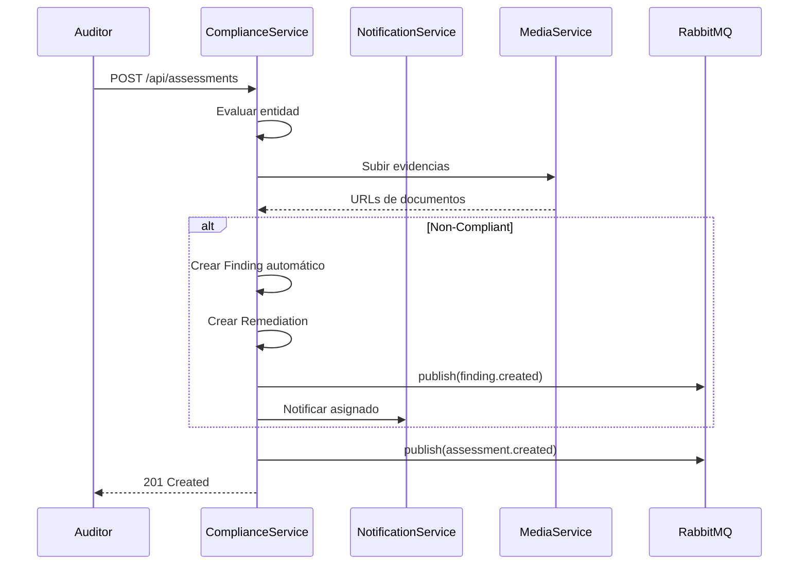
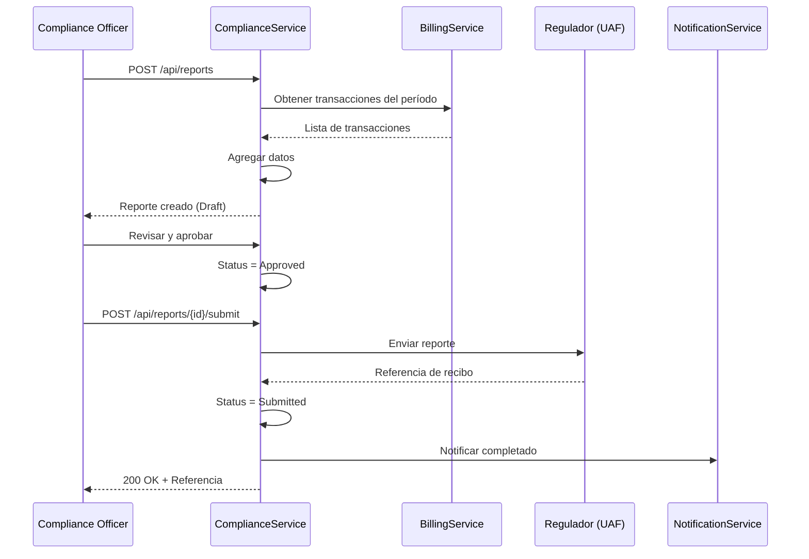

# 📋 ComplianceService - Matriz de Procesos

> **Servicio:** ComplianceService  
> **Puerto:** 5073  
> **Base de Datos:** complianceservicedb  
> **Última Actualización:** Enero 21, 2026  
> **Estado:** 🟢 ACTIVO  
> **Estado de Implementación:** 🟡 En Progreso

---

## 📊 Resumen de Implementación

| Componente             | Total | Implementado | Pendiente | Estado  |
| ---------------------- | ----- | ------------ | --------- | ------- |
| **Controllers**        | 6     | 6            | 0         | ✅ 100% |
| **Procesos (COMP-\*)** | 8     | 5            | 3         | 🟡 63%  |
| **Procesos (STR-\*)**  | 4     | 3            | 1         | 🟡 75%  |
| **Procesos (WL-\*)**   | 3     | 2            | 1         | 🟡 67%  |
| **Procesos (RISK-\*)** | 3     | 2            | 1         | 🟡 67%  |
| **Tests Unitarios**    | 25    | 15           | 10        | 🟡 60%  |

### Leyenda de Estados

- ✅ **IMPLEMENTADO Y PROBADO**: Código completo con tests
- 🟢 **IMPLEMENTADO**: Código completo, falta testing
- 🟡 **EN PROGRESO**: Implementación parcial
- 🔴 **PENDIENTE**: No implementado

---

## 1. Información General

### 1.1 Descripción

ComplianceService gestiona todo el cumplimiento regulatorio de OKLA según las leyes dominicanas aplicables:

- **Ley 155-17:** Prevención de Lavado de Activos (PLD/AML)
- **Ley 172-13:** Protección de Datos Personales
- **Ley 358-05:** Protección al Consumidor
- **Ley 126-02:** Comercio Electrónico
- **Ley 11-92:** Código Tributario (DGII)
- **Ley 63-17:** Registro Vehicular (INTRANT)

### 1.2 Dependencias

| Servicio            | Propósito                       |
| ------------------- | ------------------------------- |
| AuthService         | Validación JWT, roles           |
| UserService         | Datos de usuarios               |
| BillingService      | Transacciones para reportes UAF |
| NotificationService | Alertas de vencimiento          |
| MediaService        | Documentos de evidencia         |

### 1.3 Tecnologías

- **.NET 8.0** con MediatR (CQRS)
- **PostgreSQL** para persistencia
- **RabbitMQ** para eventos
- **Hangfire** para jobs programados

---

## 2. Endpoints API

### 2.1 FrameworksController

| Método | Ruta                             | Descripción                    | Auth | Roles             |
| ------ | -------------------------------- | ------------------------------ | ---- | ----------------- |
| `GET`  | `/api/frameworks`                | Listar marcos regulatorios     | ✅   | Any               |
| `GET`  | `/api/frameworks/{id}`           | Obtener marco por ID           | ✅   | Any               |
| `GET`  | `/api/frameworks/by-type/{type}` | Filtrar por tipo de regulación | ✅   | Any               |
| `POST` | `/api/frameworks`                | Crear marco regulatorio        | ✅   | Admin, Compliance |
| `PUT`  | `/api/frameworks/{id}`           | Actualizar marco               | ✅   | Admin, Compliance |

### 2.2 RequirementsController

| Método | Ruta                                   | Descripción                  | Auth | Roles             |
| ------ | -------------------------------------- | ---------------------------- | ---- | ----------------- |
| `GET`  | `/api/requirements/by-framework/{id}`  | Requerimientos por framework | ✅   | Any               |
| `GET`  | `/api/requirements/{id}`               | Obtener requerimiento        | ✅   | Any               |
| `GET`  | `/api/requirements/upcoming-deadlines` | Próximos a vencer            | ✅   | Any               |
| `POST` | `/api/requirements`                    | Crear requerimiento          | ✅   | Admin, Compliance |

### 2.3 ControlsController

| Método | Ruta                              | Descripción                    | Auth | Roles             |
| ------ | --------------------------------- | ------------------------------ | ---- | ----------------- |
| `GET`  | `/api/controls/by-framework/{id}` | Controles por framework        | ✅   | Any               |
| `GET`  | `/api/controls/{id}`              | Obtener control                | ✅   | Any               |
| `GET`  | `/api/controls/due-for-testing`   | Controles pendientes de prueba | ✅   | Any               |
| `GET`  | `/api/controls/statistics`        | Estadísticas de controles      | ✅   | Any               |
| `POST` | `/api/controls`                   | Crear control                  | ✅   | Admin, Compliance |
| `POST` | `/api/controls/{id}/test`         | Registrar prueba de control    | ✅   | Any               |

### 2.4 AssessmentsController

| Método | Ruta                          | Descripción                    | Auth | Roles             |
| ------ | ----------------------------- | ------------------------------ | ---- | ----------------- |
| `GET`  | `/api/assessments`            | Listar evaluaciones (paginado) | ✅   | Any               |
| `GET`  | `/api/assessments/{id}`       | Obtener evaluación             | ✅   | Any               |
| `GET`  | `/api/assessments/overdue`    | Evaluaciones vencidas          | ✅   | Any               |
| `GET`  | `/api/assessments/statistics` | Estadísticas                   | ✅   | Any               |
| `POST` | `/api/assessments`            | Crear evaluación               | ✅   | Admin, Compliance |

### 2.5 FindingsController

| Método | Ruta                       | Descripción                 | Auth | Roles             |
| ------ | -------------------------- | --------------------------- | ---- | ----------------- |
| `GET`  | `/api/findings`            | Listar hallazgos (paginado) | ✅   | Any               |
| `GET`  | `/api/findings/{id}`       | Obtener hallazgo            | ✅   | Any               |
| `GET`  | `/api/findings/critical`   | Hallazgos críticos          | ✅   | Any               |
| `GET`  | `/api/findings/statistics` | Estadísticas                | ✅   | Any               |
| `POST` | `/api/findings`            | Crear hallazgo              | ✅   | Admin, Compliance |

### 2.6 RemediationsController

| Método | Ruta                                | Descripción                | Auth | Roles             |
| ------ | ----------------------------------- | -------------------------- | ---- | ----------------- |
| `GET`  | `/api/remediations/by-finding/{id}` | Remediaciones por hallazgo | ✅   | Any               |
| `GET`  | `/api/remediations/{id}`            | Obtener remediación        | ✅   | Any               |
| `GET`  | `/api/remediations/overdue`         | Remediaciones vencidas     | ✅   | Any               |
| `POST` | `/api/remediations`                 | Crear remediación          | ✅   | Admin, Compliance |
| `POST` | `/api/remediations/{id}/complete`   | Completar remediación      | ✅   | Any               |

### 2.7 ReportsController

| Método | Ruta                       | Descripción                | Auth | Roles             |
| ------ | -------------------------- | -------------------------- | ---- | ----------------- |
| `GET`  | `/api/reports`             | Listar reportes (paginado) | ✅   | Any               |
| `GET`  | `/api/reports/{id}`        | Obtener reporte            | ✅   | Any               |
| `GET`  | `/api/reports/pending`     | Reportes pendientes        | ✅   | Any               |
| `POST` | `/api/reports`             | Crear reporte              | ✅   | Admin, Compliance |
| `POST` | `/api/reports/{id}/submit` | Enviar a regulador         | ✅   | Admin, Compliance |

### 2.8 CalendarController

| Método | Ruta                          | Descripción      | Auth | Roles             |
| ------ | ----------------------------- | ---------------- | ---- | ----------------- |
| `GET`  | `/api/calendar/upcoming`      | Eventos próximos | ✅   | Any               |
| `GET`  | `/api/calendar/{id}`          | Obtener evento   | ✅   | Any               |
| `GET`  | `/api/calendar/overdue`       | Eventos vencidos | ✅   | Any               |
| `POST` | `/api/calendar`               | Crear evento     | ✅   | Admin, Compliance |
| `POST` | `/api/calendar/{id}/complete` | Completar evento | ✅   | Any               |

### 2.9 TrainingController

| Método | Ruta                          | Descripción                 | Auth | Roles             |
| ------ | ----------------------------- | --------------------------- | ---- | ----------------- |
| `GET`  | `/api/training`               | Capacitaciones activas      | ✅   | Any               |
| `GET`  | `/api/training/{id}`          | Obtener capacitación        | ✅   | Any               |
| `GET`  | `/api/training/mandatory`     | Capacitaciones obligatorias | ✅   | Any               |
| `GET`  | `/api/training/statistics`    | Estadísticas                | ✅   | Any               |
| `POST` | `/api/training`               | Crear capacitación          | ✅   | Admin, Compliance |
| `POST` | `/api/training/{id}/complete` | Registrar completado        | ✅   | Any               |

### 2.10 DashboardController

| Método | Ruta                     | Descripción            | Auth | Roles                     |
| ------ | ------------------------ | ---------------------- | ---- | ------------------------- |
| `GET`  | `/api/dashboard`         | Dashboard completo     | ✅   | Any                       |
| `GET`  | `/api/dashboard/metrics` | Métricas de compliance | ✅   | Any                       |
| `POST` | `/api/dashboard/metrics` | Registrar métrica      | ✅   | Admin, Compliance, System |

---

## 3. Entidades del Dominio

### 3.1 Enumeraciones

```csharp
// Estado de evaluación
public enum ComplianceStatus
{
    NotEvaluated = 0,
    Pending = 1,
    InProgress = 2,
    Compliant = 3,
    NonCompliant = 4,
    PartiallyCompliant = 5,
    UnderRemediation = 6,
    Exempted = 7
}

// Tipo de regulación (leyes RD)
public enum RegulationType
{
    PLD_AML = 1,              // Ley 155-17 - Prevención de Lavado
    DataProtection = 2,       // Ley 172-13 - Protección de Datos
    ConsumerProtection = 3,   // Ley 358-05 - Protección al Consumidor
    ElectronicCommerce = 4,   // Ley 126-02 - Comercio Electrónico
    FinancialRegulation = 5,  // Regulaciones SIB/SIPEN
    TaxCompliance = 6,        // DGII - Cumplimiento Fiscal
    VehicleRegistration = 7,  // DGTT/INTRANT - Registro Vehicular
    Environmental = 8,        // MARENA - Medio Ambiente
    Other = 99
}

// Nivel de criticidad
public enum CriticalityLevel
{
    Low = 1,
    Medium = 2,
    High = 3,
    Critical = 4
}

// Tipo de hallazgo
public enum FindingType
{
    Observation = 1,
    MinorNonConformity = 2,
    MajorNonConformity = 3,
    CriticalNonConformity = 4,
    Recommendation = 5,
    BestPractice = 6
}

// Estado del hallazgo
public enum FindingStatus
{
    Open = 1,
    InProgress = 2,
    Resolved = 3,
    Verified = 4,
    Closed = 5,
    Overdue = 6,
    Escalated = 7
}

// Tipo de reporte regulatorio
public enum RegulatoryReportType
{
    AnnualCompliance = 1,     // Reporte anual
    QuarterlyPLD = 2,         // Trimestral PLD
    IncidentReport = 3,       // Reporte de incidentes
    AuditReport = 4,          // Auditoría
    RiskAssessment = 5,       // Evaluación de riesgos
    TrainingReport = 6,       // Capacitaciones
    TransactionReport = 7,    // Transacciones
    UAFReport = 8,            // Reporte a UAF
    SIBReport = 9,            // Reporte a SIB
    DGIIReport = 10           // Reporte a DGII
}

// Estado del reporte
public enum ReportStatus
{
    Draft = 1,
    PendingReview = 2,
    Approved = 3,
    Submitted = 4,
    Acknowledged = 5,
    Rejected = 6,
    RequiresCorrection = 7,
    Accepted = 8
}

// Tipo de control
public enum ControlType
{
    Preventive = 1,     // Preventivo
    Detective = 2,      // Detectivo
    Corrective = 3,     // Correctivo
    Directive = 4       // Directivo
}

// Frecuencia de evaluación
public enum EvaluationFrequency
{
    Daily = 1,
    Weekly = 2,
    Monthly = 3,
    Quarterly = 4,
    SemiAnnual = 5,
    Annual = 6,
    OnDemand = 7,
    Continuous = 8
}
```

### 3.2 Entidades Principales

| Entidad                 | Descripción              | Campos Clave                                                     |
| ----------------------- | ------------------------ | ---------------------------------------------------------------- |
| `RegulatoryFramework`   | Marco regulatorio        | Code, Name, Type, LegalReference, RegulatoryBody                 |
| `ComplianceRequirement` | Requerimiento específico | FrameworkId, Code, Title, Criticality, DeadlineDays              |
| `ComplianceControl`     | Control implementado     | FrameworkId, Code, Type, EffectivenessScore, NextTestDate        |
| `ControlTest`           | Prueba de control        | ControlId, TestProcedure, IsPassed, EffectivenessScore           |
| `ComplianceAssessment`  | Evaluación de entidad    | EntityType, EntityId, RequirementId, Status, Score               |
| `ComplianceFinding`     | Hallazgo de auditoría    | AssessmentId, Type, Status, Criticality, RootCause               |
| `RemediationAction`     | Acción correctiva        | FindingId, Status, AssignedTo, DueDate, Priority                 |
| `RegulatoryReport`      | Reporte a regulador      | Type, RegulationType, Status, RegulatoryBody, SubmissionDeadline |
| `ComplianceCalendar`    | Evento de calendario     | Title, DueDate, RegulationType, IsRecurring                      |
| `ComplianceTraining`    | Capacitación             | Title, RegulationType, IsMandatory, PassingScore                 |
| `TrainingCompletion`    | Registro de completado   | TrainingId, UserId, Score, IsPassed, CertificateUrl              |
| `ComplianceMetric`      | Métrica de cumplimiento  | MetricName, Value, Target, Threshold, IsWithinTarget             |

---

## 4. Procesos Detallados

### 4.1 COMP-FW-001: Gestión de Marcos Regulatorios

| Campo          | Valor                   |
| -------------- | ----------------------- |
| **ID**         | COMP-FW-001             |
| **Nombre**     | Crear Marco Regulatorio |
| **Actor**      | Compliance Officer      |
| **Criticidad** | 🔴 CRÍTICO              |
| **Estado**     | 🟢 ACTIVO               |

**Precondiciones:**

- Usuario autenticado con rol Admin o Compliance
- Ley o regulación vigente en República Dominicana

**Request Body:**

```json
{
  "code": "LEY-155-17",
  "name": "Ley de Prevención de Lavado de Activos",
  "description": "Marco regulatorio para PLD/AML según Ley 155-17",
  "type": 1,
  "legalReference": "Ley No. 155-17 del 1 de junio de 2017",
  "regulatoryBody": "UAF",
  "effectiveDate": "2017-06-01T00:00:00Z",
  "version": "1.0"
}
```

**Flujo Paso a Paso:**

| Paso | Acción          | Componente             | Descripción                   |
| ---- | --------------- | ---------------------- | ----------------------------- |
| 1    | Recibir request | FrameworksController   | Validar JSON                  |
| 2    | Verificar roles | AuthMiddleware         | Admin o Compliance            |
| 3    | Validar datos   | FluentValidation       | Code único, campos requeridos |
| 4    | Crear entidad   | CreateFrameworkHandler | RegulatoryFramework           |
| 5    | Persistir       | FrameworkRepository    | INSERT en PostgreSQL          |
| 6    | Publicar evento | RabbitMQ               | `framework.created`           |
| 7    | Notificar       | NotificationService    | Alerta a equipo compliance    |
| 8    | Responder       | Controller             | 201 Created + GUID            |

**Response (201 Created):**

```json
{
  "id": "3fa85f64-5717-4562-b3fc-2c963f66afa6"
}
```

**Postcondiciones:**

- Marco regulatorio registrado en sistema
- Evento publicado para auditoría
- Equipo compliance notificado

**Códigos de Error:**

| Código | Error                      | Descripción                   |
| ------ | -------------------------- | ----------------------------- |
| 400    | `INVALID_FRAMEWORK_DATA`   | Datos incompletos o inválidos |
| 400    | `DUPLICATE_CODE`           | Código de framework ya existe |
| 401    | `UNAUTHORIZED`             | Token JWT inválido            |
| 403    | `INSUFFICIENT_PERMISSIONS` | Rol no autorizado             |

---

### 4.2 COMP-CTRL-001: Prueba de Control

| Campo          | Valor                        |
| -------------- | ---------------------------- |
| **ID**         | COMP-CTRL-001                |
| **Nombre**     | Registrar Prueba de Control  |
| **Actor**      | Auditor Interno / Compliance |
| **Criticidad** | 🔴 CRÍTICO                   |
| **Estado**     | 🟢 ACTIVO                    |

**Precondiciones:**

- Control existente en el sistema
- Usuario autenticado
- Procedimiento de prueba definido

**Request Body:**

```json
{
  "testProcedure": "Verificación de transacciones >$10,000 USD reportadas a UAF",
  "testResults": "Se verificaron 47 transacciones. 45 cumplieron, 2 con retraso < 24h",
  "isPassed": true,
  "effectivenessScore": 95,
  "findings": "Dos transacciones se reportaron con 23 horas de retraso (límite 24h)",
  "recommendations": "Automatizar alertas en tiempo real para transacciones cercanas al umbral",
  "evidenceDocuments": [
    "doc_abc123_uaf_report.pdf",
    "doc_def456_transaction_log.xlsx"
  ]
}
```

**Flujo Paso a Paso:**

| Paso | Acción                | Componente               | Descripción                        |
| ---- | --------------------- | ------------------------ | ---------------------------------- |
| 1    | Validar control       | ControlsController       | Verificar que control existe       |
| 2    | Validar procedimiento | FluentValidation         | Campos obligatorios                |
| 3    | Crear ControlTest     | RecordControlTestHandler | Entidad de prueba                  |
| 4    | Actualizar Control    | ControlRepository        | LastTestedAt, NextTestDate, Status |
| 5    | Calcular efectividad  | BusinessLogic            | Promediar scores históricos        |
| 6    | Persistir             | ControlTestRepository    | INSERT con evidencias              |
| 7    | Publicar evento       | RabbitMQ                 | `control.tested`                   |
| 8    | Crear hallazgos       | FindingService           | Si hay no conformidades            |
| 9    | Notificar             | NotificationService      | Resultado de prueba                |

**Response (201 Created):**

```json
{
  "testId": "3fa85f64-5717-4562-b3fc-2c963f66afa6"
}
```

**Postcondiciones:**

- Prueba registrada con evidencias
- Control actualizado con nueva fecha de prueba
- Hallazgos creados automáticamente si no pasó
- NextTestDate calculado según frecuencia

**Reglas de Negocio:**

- Si `isPassed = false`, se crea hallazgo automático tipo `MinorNonConformity`
- Si `effectivenessScore < 70`, el control pasa a estado `PartiallyCompliant`
- Si `effectivenessScore < 50`, el control pasa a estado `NonCompliant`

---

### 4.3 COMP-ASS-001: Evaluación de Cumplimiento

| Campo          | Valor                            |
| -------------- | -------------------------------- |
| **ID**         | COMP-ASS-001                     |
| **Nombre**     | Crear Evaluación de Cumplimiento |
| **Actor**      | Auditor Interno / Sistema        |
| **Criticidad** | 🔴 CRÍTICO                       |
| **Estado**     | 🟢 ACTIVO                        |

**Precondiciones:**

- Entidad a evaluar existe (User, Dealer, Transaction)
- Requerimiento de compliance aplicable
- Usuario con permisos de evaluación

**Request Body:**

```json
{
  "entityType": "Dealer",
  "entityId": "3fa85f64-5717-4562-b3fc-2c963f66afa6",
  "requirementId": "4ea85f64-5717-4562-b3fc-2c963f66afa7",
  "status": 3,
  "score": 87,
  "observations": "Dealer cumple con documentación KYC. Falta actualizar RNC.",
  "evidenceProvided": "doc_kyc_dealer_xyz.pdf"
}
```

**Flujo Paso a Paso:**

| Paso | Acción                 | Componente              | Descripción                              |
| ---- | ---------------------- | ----------------------- | ---------------------------------------- |
| 1    | Validar entidad        | AssessmentsController   | EntityType + EntityId válidos            |
| 2    | Obtener requerimiento  | RequirementRepository   | Verificar que existe y está activo       |
| 3    | Calcular deadline      | BusinessLogic           | DueDate = Now + Requirement.DeadlineDays |
| 4    | Crear Assessment       | CreateAssessmentHandler | Con NextAssessmentDate                   |
| 5    | Persistir              | AssessmentRepository    | INSERT en PostgreSQL                     |
| 6    | Publicar evento        | RabbitMQ                | `assessment.created`                     |
| 7    | Programar recordatorio | Hangfire                | Alerta antes de DeadlineDate             |
| 8    | Actualizar entidad     | ExternalService         | Marcar como evaluada                     |

**Response (201 Created):**

```json
{
  "id": "3fa85f64-5717-4562-b3fc-2c963f66afa6"
}
```

**Postcondiciones:**

- Evaluación registrada
- Deadline calculado automáticamente
- Recordatorio programado según `ReminderDaysBefore`
- Evento publicado para tracking

---

### 4.4 COMP-FIND-001: Gestión de Hallazgos

| Campo          | Valor                        |
| -------------- | ---------------------------- |
| **ID**         | COMP-FIND-001                |
| **Nombre**     | Crear Hallazgo de Compliance |
| **Actor**      | Auditor / Sistema            |
| **Criticidad** | 🔴 CRÍTICO                   |
| **Estado**     | 🟢 ACTIVO                    |

**Precondiciones:**

- Evaluación o prueba de control completada
- No conformidad o observación identificada

**Request Body:**

```json
{
  "assessmentId": "3fa85f64-5717-4562-b3fc-2c963f66afa6",
  "title": "Documentación KYC incompleta para transacciones > $5,000",
  "description": "Se identificaron 3 transacciones sin verificación de identidad completa",
  "type": 2,
  "criticality": 3,
  "rootCause": "Proceso manual sin validación automática en punto de venta",
  "impact": "Riesgo de incumplimiento Ley 155-17 Art. 15",
  "recommendation": "Implementar verificación automática de identidad en checkout",
  "assignedTo": "compliance@okla.com.do",
  "dueDate": "2026-02-15T23:59:59Z"
}
```

**Flujo Paso a Paso:**

| Paso | Acción             | Componente           | Descripción                  |
| ---- | ------------------ | -------------------- | ---------------------------- |
| 1    | Validar assessment | FindingsController   | Verificar que existe         |
| 2    | Validar datos      | FluentValidation     | Campos obligatorios          |
| 3    | Calcular prioridad | BusinessLogic        | Basado en Type + Criticality |
| 4    | Crear Finding      | CreateFindingHandler | Estado = Open                |
| 5    | Persistir          | FindingRepository    | INSERT                       |
| 6    | Publicar evento    | RabbitMQ             | `finding.created`            |
| 7    | Notificar asignado | NotificationService  | Email + In-App               |
| 8    | Escalar si crítico | EscalationService    | Si Criticality = Critical    |
| 9    | Crear remediación  | RemediationService   | Acción correctiva default    |

**Response (201 Created):**

```json
{
  "id": "3fa85f64-5717-4562-b3fc-2c963f66afa6"
}
```

**Reglas de Escalamiento:**

| Criticality | Escalamiento                  | Tiempo Respuesta |
| ----------- | ----------------------------- | ---------------- |
| Critical    | CEO + Legal + Regulador       | < 4 horas        |
| High        | Compliance Officer + Gerencia | < 24 horas       |
| Medium      | Compliance Officer            | < 72 horas       |
| Low         | Equipo asignado               | < 7 días         |

---

### 4.5 COMP-RPT-001: Generación de Reporte Regulatorio

| Campo          | Valor                     |
| -------------- | ------------------------- |
| **ID**         | COMP-RPT-001              |
| **Nombre**     | Crear Reporte Regulatorio |
| **Actor**      | Compliance Officer        |
| **Criticidad** | 🔴 CRÍTICO                |
| **Estado**     | 🟢 ACTIVO                 |

**Precondiciones:**

- Período de reporte definido
- Datos del período disponibles
- Usuario con rol Admin o Compliance

**Request Body:**

```json
{
  "type": 8,
  "regulationType": 1,
  "title": "Reporte Trimestral PLD Q4-2025",
  "description": "Reporte de operaciones sospechosas y transacciones > $10,000 USD",
  "periodStart": "2025-10-01T00:00:00Z",
  "periodEnd": "2025-12-31T23:59:59Z",
  "regulatoryBody": "UAF",
  "submissionDeadline": "2026-01-15T23:59:59Z",
  "content": {
    "transactionsOver10K": 156,
    "suspiciousOperations": 3,
    "reportedToUAF": 3,
    "peps": 12,
    "highRiskCustomers": 47
  }
}
```

**Flujo Paso a Paso:**

| Paso | Acción             | Componente          | Descripción                           |
| ---- | ------------------ | ------------------- | ------------------------------------- |
| 1    | Validar período    | ReportsController   | No traslapado con reportes existentes |
| 2    | Generar número     | ReportService       | Formato: UAF-2026-001                 |
| 3    | Recopilar datos    | DataAggregator      | Query de transacciones del período    |
| 4    | Crear reporte      | CreateReportHandler | Status = Draft                        |
| 5    | Persistir          | ReportRepository    | INSERT con content JSON               |
| 6    | Publicar evento    | RabbitMQ            | `report.created`                      |
| 7    | Programar deadline | Hangfire            | Alerta antes de SubmissionDeadline    |

**Response (201 Created):**

```json
{
  "id": "3fa85f64-5717-4562-b3fc-2c963f66afa6",
  "reportNumber": "UAF-2026-001"
}
```

---

### 4.6 COMP-RPT-002: Enviar Reporte a Regulador

| Campo          | Valor                      |
| -------------- | -------------------------- |
| **ID**         | COMP-RPT-002               |
| **Nombre**     | Enviar Reporte a Regulador |
| **Actor**      | Compliance Officer         |
| **Criticidad** | 🔴 CRÍTICO                 |
| **Estado**     | 🟢 ACTIVO                  |

**Precondiciones:**

- Reporte en estado `Approved`
- Antes de `SubmissionDeadline`
- Usuario con rol Admin o Compliance

**Request Body:**

```json
{
  "submissionReference": "UAF-REC-2026-00123"
}
```

**Flujo Paso a Paso:**

| Paso | Acción               | Componente          | Descripción                     |
| ---- | -------------------- | ------------------- | ------------------------------- |
| 1    | Obtener reporte      | ReportRepository    | Verificar que existe            |
| 2    | Validar estado       | BusinessLogic       | Debe ser Approved               |
| 3    | Validar deadline     | BusinessLogic       | Now < SubmissionDeadline        |
| 4    | Preparar envío       | ReportSubmitter     | Formato requerido por regulador |
| 5    | Enviar (si API)      | IntegrationService  | POST a API del regulador        |
| 6    | Actualizar estado    | SubmitReportHandler | Status = Submitted              |
| 7    | Registrar referencia | ReportRepository    | SubmissionReference             |
| 8    | Persistir            | ReportRepository    | UPDATE                          |
| 9    | Publicar evento      | RabbitMQ            | `report.submitted`              |
| 10   | Notificar            | NotificationService | Confirmación a equipo           |
| 11   | Generar recibo       | MediaService        | PDF de confirmación             |

**Response (200 OK):**

```json
{
  "success": true,
  "submittedAt": "2026-01-14T15:30:00Z",
  "reference": "UAF-REC-2026-00123"
}
```

**Postcondiciones:**

- Reporte marcado como Submitted
- Referencia del regulador almacenada
- Registro de auditoría creado
- Notificación enviada

**Códigos de Error:**

| Código | Error                   | Descripción                 |
| ------ | ----------------------- | --------------------------- |
| 400    | `INVALID_REPORT_STATUS` | Reporte no está aprobado    |
| 400    | `DEADLINE_EXCEEDED`     | Pasó la fecha límite        |
| 404    | `REPORT_NOT_FOUND`      | Reporte no existe           |
| 500    | `SUBMISSION_FAILED`     | Error al enviar a regulador |

---

### 4.7 COMP-TRN-001: Capacitación de Compliance

| Campo          | Valor                                |
| -------------- | ------------------------------------ |
| **ID**         | COMP-TRN-001                         |
| **Nombre**     | Registrar Completado de Capacitación |
| **Actor**      | Empleado / Sistema                   |
| **Criticidad** | 🟠 ALTO                              |
| **Estado**     | 🟢 ACTIVO                            |

**Precondiciones:**

- Capacitación activa y asignada al usuario
- Usuario completó el contenido
- Examen aprobado (si aplica)

**Request Body:**

```json
{
  "userId": "3fa85f64-5717-4562-b3fc-2c963f66afa6",
  "score": 85.5,
  "passed": true,
  "certificateUrl": "https://cdn.okla.com.do/certificates/cert_xyz.pdf"
}
```

**Flujo Paso a Paso:**

| Paso | Acción              | Componente                      | Descripción                        |
| ---- | ------------------- | ------------------------------- | ---------------------------------- |
| 1    | Validar training    | TrainingController              | Verificar que existe y está activo |
| 2    | Validar score       | FluentValidation                | >= PassingScore de la capacitación |
| 3    | Crear completion    | RecordTrainingCompletionHandler | Con ExpiresAt                      |
| 4    | Calcular expiración | BusinessLogic                   | ValidUntil de la capacitación      |
| 5    | Persistir           | TrainingCompletionRepository    | INSERT                             |
| 6    | Generar certificado | MediaService                    | Si no se provee URL                |
| 7    | Publicar evento     | RabbitMQ                        | `training.completed`               |
| 8    | Actualizar usuario  | UserService                     | Agregar competencia                |
| 9    | Notificar           | NotificationService             | Certificado listo                  |

**Response (201 Created):**

```json
{
  "completionId": "3fa85f64-5717-4562-b3fc-2c963f66afa6",
  "certificateUrl": "https://cdn.okla.com.do/certificates/cert_xyz.pdf",
  "expiresAt": "2027-01-21T00:00:00Z"
}
```

**Reglas de Negocio:**

- Capacitaciones PLD obligatorias cada 12 meses
- Score mínimo configurable por capacitación
- Certificado con código QR de verificación

---

### 4.8 COMP-CAL-001: Gestión de Calendario de Compliance

| Campo          | Valor                      |
| -------------- | -------------------------- |
| **ID**         | COMP-CAL-001               |
| **Nombre**     | Crear Evento de Calendario |
| **Actor**      | Compliance Officer         |
| **Criticidad** | 🟡 MEDIO                   |
| **Estado**     | 🟢 ACTIVO                  |

**Precondiciones:**

- Usuario con rol Admin o Compliance
- Fecha futura válida

**Request Body:**

```json
{
  "title": "Fecha límite reporte trimestral UAF",
  "description": "Presentar reporte de transacciones sospechosas Q1-2026",
  "regulationType": 1,
  "dueDate": "2026-04-15T23:59:59Z",
  "reminderDaysBefore": 7,
  "isRecurring": true,
  "recurrencePattern": 4,
  "assignedTo": "compliance@okla.com.do"
}
```

**Flujo Paso a Paso:**

| Paso | Acción                 | Componente                 | Descripción                  |
| ---- | ---------------------- | -------------------------- | ---------------------------- |
| 1    | Validar fecha          | CalendarController         | DueDate > Now                |
| 2    | Crear evento           | CreateCalendarEventHandler | Status = Pending             |
| 3    | Persistir              | CalendarRepository         | INSERT                       |
| 4    | Programar recordatorio | Hangfire                   | DueDate - ReminderDaysBefore |
| 5    | Crear recurrencias     | RecurrenceService          | Si IsRecurring = true        |
| 6    | Publicar evento        | RabbitMQ                   | `calendar.event.created`     |
| 7    | Notificar asignado     | NotificationService        | Evento agregado              |

**Response (201 Created):**

```json
{
  "id": "3fa85f64-5717-4562-b3fc-2c963f66afa6"
}
```

---

### 4.9 COMP-DASH-001: Dashboard de Compliance

| Campo          | Valor                           |
| -------------- | ------------------------------- |
| **ID**         | COMP-DASH-001                   |
| **Nombre**     | Obtener Dashboard de Compliance |
| **Actor**      | Cualquier usuario autenticado   |
| **Criticidad** | 🟡 MEDIO                        |
| **Estado**     | 🟢 ACTIVO                       |

**Precondiciones:**

- Usuario autenticado

**Request:** `GET /api/dashboard`

**Flujo Paso a Paso:**

| Paso | Acción                | Componente            | Descripción             |
| ---- | --------------------- | --------------------- | ----------------------- |
| 1    | Obtener frameworks    | FrameworkRepository   | Activos con conteos     |
| 2    | Obtener assessments   | AssessmentRepository  | Estadísticas por estado |
| 3    | Obtener hallazgos     | FindingRepository     | Críticos y abiertos     |
| 4    | Obtener remediaciones | RemediationRepository | Vencidas                |
| 5    | Obtener reportes      | ReportRepository      | Pendientes              |
| 6    | Obtener calendarios   | CalendarRepository    | Próximos 30 días        |
| 7    | Obtener métricas      | MetricRepository      | Out of target           |
| 8    | Agregar datos         | DashboardBuilder      | DTO consolidado         |
| 9    | Cachear               | Redis                 | TTL 5 minutos           |

**Response (200 OK):**

```json
{
  "frameworksCount": 8,
  "activeControls": 45,
  "assessmentStats": {
    "compliant": 234,
    "nonCompliant": 12,
    "pending": 28,
    "overdue": 5
  },
  "criticalFindings": 3,
  "openFindings": 18,
  "overdueRemediations": 2,
  "pendingReports": 1,
  "upcomingDeadlines": [
    {
      "title": "Reporte Trimestral UAF",
      "dueDate": "2026-04-15T23:59:59Z",
      "daysRemaining": 84
    }
  ],
  "outOfTargetMetrics": [
    {
      "name": "Tiempo promedio de KYC",
      "value": 48,
      "target": 24,
      "unit": "horas"
    }
  ],
  "lastUpdated": "2026-01-21T10:30:00Z"
}
```

---

## 5. Flujos de Integración

### 5.1 Diagrama de Auditoría de Compliance



### 5.2 Diagrama de Reporte Regulatorio



---

## 6. Reglas de Negocio

### 6.1 Plazos Regulatorios (Ley 155-17)

| Reporte                          | Frecuencia | Plazo                         | Regulador |
| -------------------------------- | ---------- | ----------------------------- | --------- |
| Transacciones > $10,000 USD      | Por evento | 24 horas                      | UAF       |
| Operaciones sospechosas          | Por evento | 48 horas                      | UAF       |
| Reporte trimestral               | Trimestral | 15 días después del trimestre | UAF       |
| Reporte anual PLD                | Anual      | 31 de enero                   | UAF       |
| Lista de clientes de alto riesgo | Trimestral | Con reporte trimestral        | UAF       |

### 6.2 Sanciones por Incumplimiento

| Tipo                             | Sanción Ley 155-17                  |
| -------------------------------- | ----------------------------------- |
| No reportar transacción > $10K   | 10-200 salarios mínimos             |
| No reportar operación sospechosa | 50-500 salarios mínimos             |
| Omitir debida diligencia         | 100-1,000 salarios mínimos          |
| Reincidencia                     | Cierre temporal + sanciones penales |

### 6.3 Niveles de Riesgo de Cliente

| Nivel   | Criterio                                 | Verificación             |
| ------- | ---------------------------------------- | ------------------------ |
| Bajo    | Cliente estándar, transacciones normales | KYC básico               |
| Medio   | Transacciones frecuentes, monto moderado | KYC + monitoreo          |
| Alto    | PEPs, sectores de riesgo, países GAFI    | Enhanced Due Diligence   |
| Crítico | Alertas previas, lista negra             | Rechazo o aprobación CEO |

---

## 7. Eventos RabbitMQ

### 7.1 Eventos Publicados

| Evento                  | Exchange            | Routing Key             | Payload                          |
| ----------------------- | ------------------- | ----------------------- | -------------------------------- |
| `framework.created`     | `compliance.events` | `framework.created`     | FrameworkId, Code, Type          |
| `control.tested`        | `compliance.events` | `control.tested`        | ControlId, IsPassed, Score       |
| `assessment.created`    | `compliance.events` | `assessment.created`    | AssessmentId, EntityType, Status |
| `finding.created`       | `compliance.events` | `finding.created`       | FindingId, Type, Criticality     |
| `finding.escalated`     | `compliance.events` | `finding.escalated`     | FindingId, EscalatedTo           |
| `remediation.completed` | `compliance.events` | `remediation.completed` | RemediationId, FindingId         |
| `report.created`        | `compliance.events` | `report.created`        | ReportId, Type, Deadline         |
| `report.submitted`      | `compliance.events` | `report.submitted`      | ReportId, Reference              |
| `training.completed`    | `compliance.events` | `training.completed`    | UserId, TrainingId, Passed       |
| `deadline.approaching`  | `compliance.events` | `deadline.approaching`  | ItemId, Type, DaysRemaining      |

### 7.2 Eventos Consumidos

| Evento                         | Source         | Acción                      |
| ------------------------------ | -------------- | --------------------------- |
| `transaction.created`          | BillingService | Evaluar si > $10K USD       |
| `user.kyc.completed`           | UserService    | Actualizar assessment       |
| `dealer.verified`              | DealerService  | Crear assessment automático |
| `suspicious.activity.detected` | FraudService   | Crear finding automático    |

---

## 8. Configuración

### 8.1 appsettings.json

```json
{
  "ConnectionStrings": {
    "DefaultConnection": "Host=postgres;Database=complianceservicedb;Username=postgres;Password=${DB_PASSWORD}"
  },
  "RabbitMQ": {
    "Host": "rabbitmq",
    "Port": 5672,
    "Username": "guest",
    "Password": "guest",
    "VirtualHost": "/",
    "Exchange": "compliance.events"
  },
  "Compliance": {
    "UAF": {
      "ReportingThresholdUSD": 10000,
      "SuspiciousReportDeadlineHours": 48,
      "TransactionReportDeadlineHours": 24,
      "QuarterlyReportDays": 15
    },
    "Training": {
      "PLDExpirationMonths": 12,
      "MinimumPassingScore": 70
    },
    "Reminders": {
      "DeadlineReminderDays": [7, 3, 1],
      "TrainingReminderDays": [30, 14, 7]
    },
    "Escalation": {
      "CriticalEscalationEmails": ["ceo@okla.com.do", "legal@okla.com.do"],
      "CriticalResponseHours": 4
    }
  },
  "Redis": {
    "ConnectionString": "redis:6379",
    "DashboardCacheTTLMinutes": 5
  }
}
```

---

## 9. Seguridad

### 9.1 Control de Acceso

| Rol        | Permisos                                                     |
| ---------- | ------------------------------------------------------------ |
| Admin      | CRUD completo en todos los recursos                          |
| Compliance | CRUD en frameworks, controls, assessments, findings, reports |
| Auditor    | Read all, Create assessments y findings                      |
| Manager    | Read all, Complete remediations asignadas                    |
| User       | Read training, Complete assigned trainings                   |

### 9.2 Auditoría

Todas las operaciones se registran con:

- `CreatedAt`, `CreatedBy`
- `UpdatedAt`, `UpdatedBy`
- Evento en RabbitMQ para log externo
- Retención mínima 10 años (Ley 155-17)

### 9.3 Protección de Datos

- Datos sensibles cifrados en BD (AES-256)
- TLS 1.3 en tránsito
- Acceso a reportes UAF limitado a roles autorizados
- No exponer datos de transacciones sospechosas en APIs públicas

---

## 10. Métricas y Monitoreo

### 10.1 Prometheus Metrics

```
# Evaluaciones de compliance
compliance_assessments_total{status="Compliant|NonCompliant"}
compliance_assessments_overdue_count

# Hallazgos
compliance_findings_open_count{criticality="Critical|High|Medium|Low"}
compliance_findings_resolution_time_seconds

# Reportes
compliance_reports_pending_count
compliance_reports_submitted_total{type="UAF|DGII"}
compliance_report_submission_latency_seconds

# Capacitaciones
compliance_training_completion_rate
compliance_training_overdue_count
```

### 10.2 Alertas

| Alerta                    | Condición                         | Severidad   |
| ------------------------- | --------------------------------- | ----------- |
| CriticalFindingOpen       | Hallazgo crítico > 4h sin asignar | 🔴 Critical |
| ReportDeadlineApproaching | Reporte < 3 días de deadline      | 🟠 High     |
| UAFReportOverdue          | Reporte UAF vencido               | 🔴 Critical |
| TrainingExpiring          | Capacitación PLD expira < 30 días | 🟡 Medium   |
| ControlTestOverdue        | Control sin prueba > frecuencia   | 🟠 High     |

---

## 11. Historial de Cambios

| Fecha      | Versión | Cambios                                  |
| ---------- | ------- | ---------------------------------------- |
| 2026-01-21 | 1.0.0   | Documentación inicial con 10 controllers |
| -          | -       | 14 entidades documentadas                |
| -          | -       | 9 procesos detallados                    |
| -          | -       | Integración con Ley 155-17               |

---

**Documento mantenido por:** Equipo de Compliance OKLA  
**Contacto:** compliance@okla.com.do  
**Próxima revisión:** 2026-04-21
