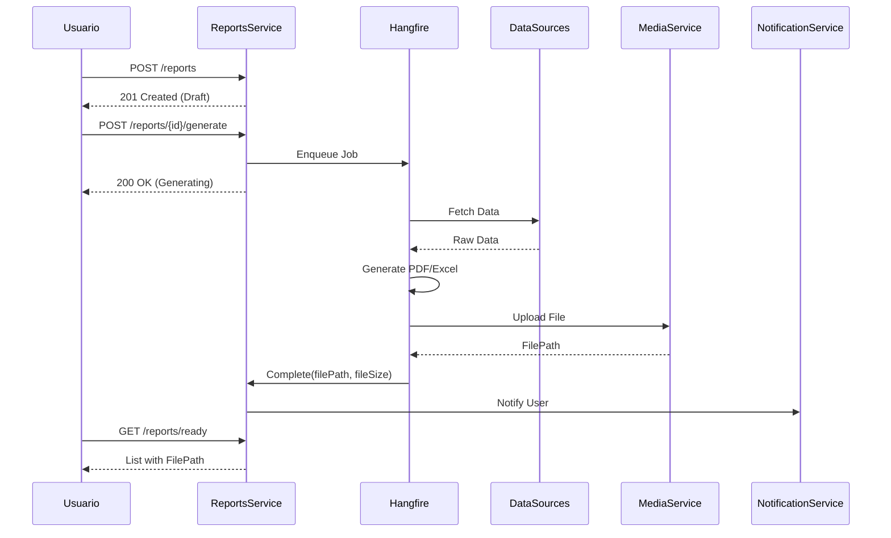
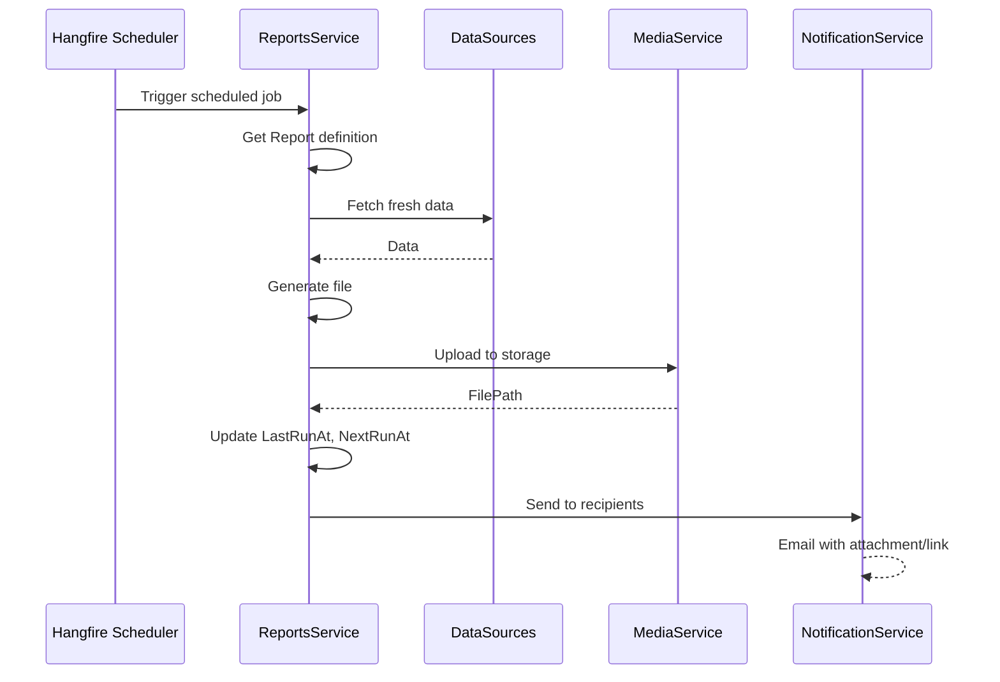

# 📊 ReportsService - Matriz de Procesos

> **Servicio:** ReportsService  
> **Puerto:** 5095  
> **Base de Datos:** reportsservicedb  
> **Última Actualización:** Enero 21, 2026  
> **Estado:** 🟢 ACTIVO

---

## 1. Información General

### 1.1 Descripción

ReportsService gestiona la generación, programación y distribución de reportes analíticos para dealers en OKLA. Implementa:

- Generación de reportes bajo demanda
- Reportes programados (scheduling)
- Dashboards personalizables con widgets
- Múltiples formatos de exportación (PDF, Excel, CSV, HTML, JSON)
- Multi-tenancy por dealer

### 1.2 Dependencias

| Servicio            | Propósito                    |
| ------------------- | ---------------------------- |
| VehiclesSaleService | Datos de inventario y ventas |
| BillingService      | Datos financieros            |
| CRMService          | Datos de leads y pipeline    |
| MediaService        | Almacenamiento de archivos   |
| NotificationService | Envío de reportes por email  |

### 1.3 Tecnologías

- **.NET 8.0** con Repository Pattern
- **PostgreSQL** para metadatos
- **Hangfire** para scheduling
- **QuestPDF/ClosedXML** para generación
- **RabbitMQ** para eventos

---

## 2. Endpoints API

### 2.1 ReportsController

| Método   | Ruta                           | Descripción                    | Auth        |
| -------- | ------------------------------ | ------------------------------ | ----------- |
| `GET`    | `/api/reports`                 | Listar todos los reportes      | ✅          |
| `GET`    | `/api/reports/{id}`            | Obtener reporte por ID         | ✅          |
| `GET`    | `/api/reports/type/{type}`     | Filtrar por tipo               | ✅          |
| `GET`    | `/api/reports/status/{status}` | Filtrar por estado             | ✅          |
| `GET`    | `/api/reports/ready`           | Reportes listos para descargar | ✅          |
| `POST`   | `/api/reports`                 | Crear definición de reporte    | ✅          |
| `PUT`    | `/api/reports/{id}`            | Actualizar reporte             | ✅          |
| `POST`   | `/api/reports/{id}/generate`   | Iniciar generación             | ✅          |
| `POST`   | `/api/reports/{id}/complete`   | Marcar como completado         | ✅ Internal |
| `POST`   | `/api/reports/{id}/fail`       | Marcar como fallido            | ✅ Internal |
| `DELETE` | `/api/reports/{id}`            | Eliminar reporte               | ✅          |

### 2.2 DashboardsController

| Método   | Ruta                                      | Descripción             | Auth |
| -------- | ----------------------------------------- | ----------------------- | ---- |
| `GET`    | `/api/dashboards`                         | Listar dashboards       | ✅   |
| `GET`    | `/api/dashboards/{id}`                    | Obtener dashboard       | ✅   |
| `GET`    | `/api/dashboards/type/{type}`             | Filtrar por tipo        | ✅   |
| `GET`    | `/api/dashboards/default`                 | Dashboard por defecto   | ✅   |
| `POST`   | `/api/dashboards`                         | Crear dashboard         | ✅   |
| `PUT`    | `/api/dashboards/{id}`                    | Actualizar dashboard    | ✅   |
| `POST`   | `/api/dashboards/{id}/set-default`        | Establecer como default | ✅   |
| `POST`   | `/api/dashboards/{id}/widgets`            | Agregar widget          | ✅   |
| `PUT`    | `/api/dashboards/{id}/widgets/{widgetId}` | Actualizar widget       | ✅   |
| `DELETE` | `/api/dashboards/{id}/widgets/{widgetId}` | Eliminar widget         | ✅   |
| `DELETE` | `/api/dashboards/{id}`                    | Eliminar dashboard      | ✅   |

### 2.3 ReportSchedulesController

| Método   | Ruta                                     | Descripción             | Auth |
| -------- | ---------------------------------------- | ----------------------- | ---- |
| `GET`    | `/api/reportschedules`                   | Listar programaciones   | ✅   |
| `GET`    | `/api/reportschedules/{id}`              | Obtener programación    | ✅   |
| `GET`    | `/api/reportschedules/report/{reportId}` | Por reporte             | ✅   |
| `GET`    | `/api/reportschedules/active`            | Solo activos            | ✅   |
| `GET`    | `/api/reportschedules/due`               | Pendientes de ejecución | ✅   |
| `POST`   | `/api/reportschedules`                   | Crear programación      | ✅   |
| `PUT`    | `/api/reportschedules/{id}`              | Actualizar programación | ✅   |
| `POST`   | `/api/reportschedules/{id}/activate`     | Activar                 | ✅   |
| `POST`   | `/api/reportschedules/{id}/deactivate`   | Desactivar              | ✅   |
| `DELETE` | `/api/reportschedules/{id}`              | Eliminar                | ✅   |

---

## 3. Entidades del Dominio

### 3.1 Enumeraciones

```csharp
// Tipo de reporte
public enum ReportType
{
    Sales,       // Ventas de vehículos
    Inventory,   // Estado del inventario
    Financial,   // Financiero
    CRM,         // Leads y pipeline
    Marketing,   // Campañas y tráfico
    Custom       // Personalizado
}

// Formato de exportación
public enum ReportFormat
{
    Pdf,         // Documento PDF
    Excel,       // Excel (.xlsx)
    Csv,         // CSV
    Html,        // HTML
    Json         // JSON estructurado
}

// Estado del reporte
public enum ReportStatus
{
    Draft,       // Borrador, no generado
    Generating,  // En proceso de generación
    Ready,       // Listo para descargar
    Failed,      // Falló la generación
    Expired      // Archivo expirado
}

// Frecuencia de programación
public enum ScheduleFrequency
{
    Once,        // Una vez
    Daily,       // Diario
    Weekly,      // Semanal
    Monthly,     // Mensual
    Quarterly,   // Trimestral
    Yearly       // Anual
}

// Tipo de dashboard
public enum DashboardType
{
    Executive,   // Vista ejecutiva
    Sales,       // Ventas
    Inventory,   // Inventario
    Marketing,   // Marketing
    Custom       // Personalizado
}
```

### 3.2 Entidades Principales

| Entidad           | Descripción                | Campos Clave                            |
| ----------------- | -------------------------- | --------------------------------------- |
| `Report`          | Definición de reporte      | Name, Type, Format, Status, FilePath    |
| `ReportSchedule`  | Programación de reporte    | ReportId, Frequency, NextRunAt          |
| `Dashboard`       | Dashboard con widgets      | Name, Type, Layout, IsDefault           |
| `DashboardWidget` | Widget dentro de dashboard | Title, WidgetType, Position, DataSource |

### 3.3 Report Entity

```csharp
public class Report : ITenantEntity
{
    public Guid Id { get; private set; }
    public Guid DealerId { get; set; }

    // Identificación
    public string Name { get; private set; }
    public string? Description { get; private set; }

    // Configuración
    public ReportType Type { get; private set; }
    public ReportFormat Format { get; private set; }
    public ReportStatus Status { get; private set; }

    // Query
    public string? QueryDefinition { get; private set; }  // JSON
    public string? Parameters { get; private set; }        // JSON
    public string? FilterCriteria { get; private set; }    // JSON

    // Rango de fechas
    public DateTime? StartDate { get; private set; }
    public DateTime? EndDate { get; private set; }

    // Archivo generado
    public string? FilePath { get; private set; }
    public long? FileSize { get; private set; }
    public string? ErrorMessage { get; private set; }

    // Timestamps
    public DateTime? GeneratedAt { get; private set; }
    public DateTime? ExpiresAt { get; private set; }
    public DateTime CreatedAt { get; private set; }
    public DateTime? UpdatedAt { get; private set; }
    public Guid CreatedBy { get; private set; }
}
```

### 3.4 ReportSchedule Entity

```csharp
public class ReportSchedule : ITenantEntity
{
    public Guid Id { get; private set; }
    public Guid DealerId { get; set; }
    public Guid ReportId { get; private set; }

    // Configuración
    public string Name { get; private set; }
    public ScheduleFrequency Frequency { get; private set; }

    // Timing
    public string? CronExpression { get; private set; }
    public TimeOnly? ExecutionTime { get; private set; }
    public DayOfWeek? DayOfWeek { get; private set; }
    public int? DayOfMonth { get; private set; }

    public bool IsActive { get; private set; }

    // Distribución
    public string? Recipients { get; private set; }  // JSON array
    public bool SendEmail { get; private set; }
    public bool SaveToStorage { get; private set; }

    // Ejecución
    public DateTime? LastRunAt { get; private set; }
    public DateTime? NextRunAt { get; private set; }
    public string? LastRunStatus { get; private set; }

    // Auditoría
    public DateTime CreatedAt { get; private set; }
    public Guid CreatedBy { get; private set; }
}
```

### 3.5 Dashboard Entity

```csharp
public class Dashboard : ITenantEntity
{
    public Guid Id { get; private set; }
    public Guid DealerId { get; set; }

    // Configuración
    public string Name { get; private set; }
    public string? Description { get; private set; }
    public DashboardType Type { get; private set; }

    // Layout
    public string? Layout { get; private set; }  // JSON grid config
    public bool IsDefault { get; private set; }
    public bool IsPublic { get; private set; }

    // Widgets
    public List<DashboardWidget> Widgets { get; private set; }

    public DateTime CreatedAt { get; private set; }
    public Guid CreatedBy { get; private set; }
}
```

---

## 4. Procesos Detallados

### 4.1 REPORT-001: Crear Definición de Reporte

| Campo          | Valor           |
| -------------- | --------------- |
| **ID**         | REPORT-001      |
| **Nombre**     | Crear Reporte   |
| **Actor**      | Gerente / Admin |
| **Criticidad** | 🟡 MEDIO        |
| **Estado**     | 🟢 ACTIVO       |

**Precondiciones:**

- Usuario con permisos de reportería
- Dealer ID válido en header

**Request Body:**

```json
{
  "name": "Reporte de Ventas Mensual",
  "description": "Resumen de ventas del mes con comparativo",
  "type": "Sales",
  "format": "Pdf",
  "startDate": "2026-01-01T00:00:00Z",
  "endDate": "2026-01-31T23:59:59Z",
  "queryDefinition": "{\"metrics\": [\"totalSales\", \"avgPrice\", \"conversionRate\"]}",
  "filterCriteria": "{\"vehicleType\": \"SUV\"}"
}
```

**Headers:**

```
X-Dealer-Id: 3fa85f64-5717-4562-b3fc-2c963f66afa6
X-User-Id: 4fa85f64-5717-4562-b3fc-2c963f66afa7
Authorization: Bearer <token>
```

**Flujo Paso a Paso:**

| Paso | Acción                  | Componente           | Descripción             |
| ---- | ----------------------- | -------------------- | ----------------------- |
| 1    | Recibir request         | ReportsController    | POST /api/reports       |
| 2    | Validar ReportType      | Handler              | Enum válido             |
| 3    | Validar ReportFormat    | Handler              | Enum válido             |
| 4    | Crear entidad Report    | Constructor          | Status = Draft          |
| 5    | Configurar rango fechas | SetDateRange()       | Si aplica               |
| 6    | Configurar query        | SetQueryDefinition() | JSON de métricas        |
| 7    | Configurar filtros      | SetFilter()          | JSON de filtros         |
| 8    | Persistir               | ReportRepository     | INSERT                  |
| 9    | Log                     | Logger               | Report created          |
| 10   | Responder               | Controller           | 201 Created + ReportDto |

**Response (201 Created):**

```json
{
  "id": "5fa85f64-5717-4562-b3fc-2c963f66afa8",
  "name": "Reporte de Ventas Mensual",
  "description": "Resumen de ventas del mes con comparativo",
  "type": "Sales",
  "format": "Pdf",
  "status": "Draft",
  "startDate": "2026-01-01T00:00:00Z",
  "endDate": "2026-01-31T23:59:59Z",
  "createdAt": "2026-01-21T10:30:00Z"
}
```

---

### 4.2 REPORT-002: Generar Reporte

| Campo          | Valor                         |
| -------------- | ----------------------------- |
| **ID**         | REPORT-002                    |
| **Nombre**     | Iniciar Generación de Reporte |
| **Actor**      | Usuario / Scheduler           |
| **Criticidad** | 🔴 CRÍTICO                    |
| **Estado**     | 🟢 ACTIVO                     |

**Precondiciones:**

- Reporte existe en estado Draft o Ready
- Parámetros adicionales opcionales

**Request Body (opcional):**

```json
{
  "parameters": "{\"includeCharts\": true, \"comparisonPeriod\": \"previous_month\"}"
}
```

**Flujo Paso a Paso:**

| Paso | Acción            | Componente        | Descripción           |
| ---- | ----------------- | ----------------- | --------------------- |
| 1    | Obtener reporte   | ReportRepository  | GetByIdAsync          |
| 2    | Si no existe      | Controller        | Return 404            |
| 3    | Actualizar params | SetParameters()   | Si se envían          |
| 4    | Cambiar estado    | StartGeneration() | Status = Generating   |
| 5    | Persistir         | ReportRepository  | UPDATE                |
| 6    | Encolar job       | Hangfire          | BackgroundJob.Enqueue |
| 7    | Log               | Logger            | Generation started    |
| 8    | Responder         | Controller        | 200 OK + ReportDto    |

**Job de Generación (Background):**

| Paso | Acción          | Componente       | Descripción                          |
| ---- | --------------- | ---------------- | ------------------------------------ |
| 1    | Consultar datos | DataService      | Según QueryDefinition                |
| 2    | Aplicar filtros | FilterEngine     | Según FilterCriteria                 |
| 3    | Generar archivo | ReportGenerator  | QuestPDF / ClosedXML                 |
| 4    | Subir a storage | MediaService     | S3 compatible                        |
| 5    | Si éxito        | Complete()       | FilePath, FileSize, ExpiresAt        |
| 6    | Si error        | Fail()           | ErrorMessage                         |
| 7    | Persistir       | ReportRepository | UPDATE                               |
| 8    | Publicar evento | RabbitMQ         | `report.generated` o `report.failed` |

**Response (200 OK):**

```json
{
  "id": "5fa85f64-5717-4562-b3fc-2c963f66afa8",
  "status": "Generating",
  "updatedAt": "2026-01-21T10:35:00Z"
}
```

---

### 4.3 REPORT-003: Descargar Reporte Listo

| Campo          | Valor                   |
| -------------- | ----------------------- |
| **ID**         | REPORT-003              |
| **Nombre**     | Obtener Reportes Listos |
| **Actor**      | Usuario                 |
| **Criticidad** | 🟡 MEDIO                |
| **Estado**     | 🟢 ACTIVO               |

**Request:** `GET /api/reports/ready`

**Flujo Paso a Paso:**

| Paso | Acción            | Componente       | Descripción           |
| ---- | ----------------- | ---------------- | --------------------- |
| 1    | Consultar         | ReportRepository | GetReadyAsync()       |
| 2    | Filtrar expirados | Handler          | Where ExpiresAt > now |
| 3    | Ordenar           | LINQ             | Por GeneratedAt DESC  |
| 4    | Proyectar         | LINQ             | Select MapToDto       |
| 5    | Responder         | Controller       | Lista de reportes     |

**Response (200 OK):**

```json
[
  {
    "id": "5fa85f64-5717-4562-b3fc-2c963f66afa8",
    "name": "Reporte de Ventas Mensual",
    "type": "Sales",
    "format": "Pdf",
    "status": "Ready",
    "filePath": "https://storage.okla.com.do/reports/xxx.pdf",
    "fileSize": 256789,
    "generatedAt": "2026-01-21T10:40:00Z",
    "expiresAt": "2026-01-28T10:40:00Z"
  }
]
```

---

### 4.4 SCHEDULE-001: Crear Programación de Reporte

| Campo          | Valor                        |
| -------------- | ---------------------------- |
| **ID**         | SCHEDULE-001                 |
| **Nombre**     | Programar Reporte Automático |
| **Actor**      | Gerente / Admin              |
| **Criticidad** | 🟡 MEDIO                     |
| **Estado**     | 🟢 ACTIVO                    |

**Precondiciones:**

- Reporte existe
- Usuario tiene permisos

**Request Body:**

```json
{
  "reportId": "5fa85f64-5717-4562-b3fc-2c963f66afa8",
  "name": "Reporte Semanal de Ventas",
  "frequency": "Weekly",
  "executionTime": "08:00",
  "dayOfWeek": "Monday",
  "recipients": "[\"gerente@dealer.com\", \"admin@dealer.com\"]",
  "sendEmail": true,
  "saveToStorage": true
}
```

**Flujo Paso a Paso:**

| Paso | Acción                 | Componente                 | Descripción     |
| ---- | ---------------------- | -------------------------- | --------------- |
| 1    | Validar reporte existe | ReportRepository           | ExistsAsync     |
| 2    | Validar frequency      | Handler                    | Enum válido     |
| 3    | Crear entidad          | ReportSchedule constructor | IsActive = true |
| 4    | Configurar tiempo      | SetExecutionTime()         | TimeOnly        |
| 5    | Configurar día         | SetWeeklySchedule()        | DayOfWeek       |
| 6    | Configurar recipients  | SetRecipients()            | JSON array      |
| 7    | Configurar delivery    | SetDeliveryOptions()       | Email/Storage   |
| 8    | Calcular NextRunAt     | CalculateNextRun()         | Automático      |
| 9    | Persistir              | ReportScheduleRepository   | INSERT          |
| 10   | Registrar en Hangfire  | SchedulerService           | RecurringJob    |
| 11   | Responder              | Controller                 | 201 Created     |

**Response (201 Created):**

```json
{
  "id": "6fa85f64-5717-4562-b3fc-2c963f66afa9",
  "reportId": "5fa85f64-5717-4562-b3fc-2c963f66afa8",
  "name": "Reporte Semanal de Ventas",
  "frequency": "Weekly",
  "executionTime": "08:00",
  "dayOfWeek": "Monday",
  "isActive": true,
  "nextRunAt": "2026-01-27T08:00:00Z",
  "createdAt": "2026-01-21T10:45:00Z"
}
```

---

### 4.5 DASHBOARD-001: Crear Dashboard

| Campo          | Valor                         |
| -------------- | ----------------------------- |
| **ID**         | DASHBOARD-001                 |
| **Nombre**     | Crear Dashboard Personalizado |
| **Actor**      | Gerente / Admin               |
| **Criticidad** | 🟡 MEDIO                      |
| **Estado**     | 🟢 ACTIVO                     |

**Request Body:**

```json
{
  "name": "Dashboard Ejecutivo",
  "description": "Vista general del negocio",
  "type": "Executive",
  "layout": "{\"columns\": 3, \"rows\": 4}",
  "isPublic": false
}
```

**Flujo Paso a Paso:**

| Paso | Acción                 | Componente            | Descripción |
| ---- | ---------------------- | --------------------- | ----------- |
| 1    | Validar DashboardType  | Handler               | Enum válido |
| 2    | Crear entidad          | Dashboard constructor |             |
| 3    | Configurar layout      | SetLayout()           | JSON grid   |
| 4    | Configurar visibilidad | SetPublic()           | bool        |
| 5    | Persistir              | DashboardRepository   | INSERT      |
| 6    | Responder              | Controller            | 201 Created |

**Response (201 Created):**

```json
{
  "id": "7fa85f64-5717-4562-b3fc-2c963f66afb0",
  "name": "Dashboard Ejecutivo",
  "type": "Executive",
  "isDefault": false,
  "isPublic": false,
  "widgetCount": 0,
  "createdAt": "2026-01-21T11:00:00Z"
}
```

---

### 4.6 DASHBOARD-002: Agregar Widget a Dashboard

| Campo          | Valor           |
| -------------- | --------------- |
| **ID**         | DASHBOARD-002   |
| **Nombre**     | Agregar Widget  |
| **Actor**      | Gerente / Admin |
| **Criticidad** | 🟡 MEDIO        |
| **Estado**     | 🟢 ACTIVO       |

**Request Body:**

```json
{
  "title": "Ventas del Mes",
  "widgetType": "BarChart",
  "positionX": 0,
  "positionY": 0,
  "width": 2,
  "height": 1,
  "dataSource": "sales_monthly",
  "configuration": "{\"showLabels\": true, \"colors\": [\"#3B82F6\"]}"
}
```

**Flujo Paso a Paso:**

| Paso | Acción                | Componente                  | Descripción             |
| ---- | --------------------- | --------------------------- | ----------------------- |
| 1    | Obtener dashboard     | DashboardRepository         | GetByIdWithWidgetsAsync |
| 2    | Crear widget          | DashboardWidget constructor |                         |
| 3    | Configurar dataSource | SetDataSource()             |                         |
| 4    | Configurar options    | SetConfiguration()          | JSON                    |
| 5    | Agregar a dashboard   | Dashboard.Widgets.Add()     |                         |
| 6    | Persistir             | DashboardRepository         | UPDATE                  |
| 7    | Responder             | Controller                  | 200 OK                  |

**Tipos de Widget:**

| WidgetType  | Descripción                 |
| ----------- | --------------------------- |
| `Counter`   | Número grande con label     |
| `BarChart`  | Gráfico de barras           |
| `LineChart` | Gráfico de líneas           |
| `PieChart`  | Gráfico circular            |
| `Table`     | Tabla de datos              |
| `KPI`       | Indicador KPI con tendencia |
| `Gauge`     | Medidor circular            |
| `Timeline`  | Línea de tiempo             |

---

## 5. Flujos de Integración

### 5.1 Flujo de Generación de Reporte



### 5.2 Flujo de Reporte Programado



---

## 6. Reglas de Negocio

### 6.1 Límites por Plan

| Plan       | Reportes/Mes | Programados | Dashboards | Widgets   |
| ---------- | ------------ | ----------- | ---------- | --------- |
| Starter    | 10           | 1           | 1          | 4         |
| Pro        | 100          | 10          | 5          | 20        |
| Enterprise | Ilimitado    | Ilimitado   | Ilimitado  | Ilimitado |

### 6.2 Retención de Archivos

| Tipo      | Retención    | Después       |
| --------- | ------------ | ------------- |
| On-demand | 7 días       | Auto-delete   |
| Scheduled | 30 días      | Auto-archive  |
| Custom    | Configurable | User decision |

### 6.3 Formatos por Tipo

| ReportType | PDF | Excel | CSV | HTML | JSON |
| ---------- | --- | ----- | --- | ---- | ---- |
| Sales      | ✅  | ✅    | ✅  | ✅   | ✅   |
| Inventory  | ✅  | ✅    | ✅  | ❌   | ✅   |
| Financial  | ✅  | ✅    | ❌  | ❌   | ✅   |
| CRM        | ✅  | ✅    | ✅  | ✅   | ✅   |
| Marketing  | ✅  | ✅    | ❌  | ✅   | ✅   |

---

## 7. Eventos RabbitMQ

### 7.1 Eventos Publicados

| Evento                      | Exchange         | Descripción            |
| --------------------------- | ---------------- | ---------------------- |
| `report.created`            | `reports.events` | Reporte definido       |
| `report.generation.started` | `reports.events` | Generación iniciada    |
| `report.generated`          | `reports.events` | Reporte listo          |
| `report.failed`             | `reports.events` | Generación fallida     |
| `report.expired`            | `reports.events` | Reporte expirado       |
| `schedule.executed`         | `reports.events` | Programación ejecutada |
| `dashboard.updated`         | `reports.events` | Dashboard modificado   |

---

## 8. Configuración

### 8.1 appsettings.json

```json
{
  "ConnectionStrings": {
    "DefaultConnection": "Host=postgres;Database=reportsservicedb;..."
  },
  "Hangfire": {
    "ConnectionString": "Host=postgres;Database=hangfire;..."
  },
  "Storage": {
    "Provider": "S3",
    "Bucket": "okla-reports",
    "Region": "us-east-1"
  },
  "Reports": {
    "DefaultExpirationDays": 7,
    "MaxFileSizeMB": 50,
    "MaxConcurrentJobs": 5,
    "RetryAttempts": 3
  }
}
```

---

## 9. Métricas

### 9.1 Prometheus Metrics

```
# Generación
reports_generated_total{type, format, status}
report_generation_duration_seconds{type, quantile}
report_file_size_bytes{type, quantile}

# Programación
report_schedules_active_count
report_schedule_executions_total{status="success|failed"}
report_schedule_last_run_timestamp

# Dashboards
dashboards_count{type}
dashboard_widgets_count{dashboard_id}
dashboard_views_total{dashboard_id}
```

---

## 10. Códigos de Error

| Código | Error                 | Descripción              |
| ------ | --------------------- | ------------------------ |
| 400    | `INVALID_REPORT_TYPE` | Tipo no reconocido       |
| 400    | `INVALID_FORMAT`      | Formato no soportado     |
| 400    | `INVALID_DATE_RANGE`  | EndDate < StartDate      |
| 400    | `REPORT_NOT_FOUND`    | Reporte no existe        |
| 400    | `SCHEDULE_CONFLICT`   | Ya existe programación   |
| 500    | `GENERATION_FAILED`   | Error al generar         |
| 500    | `STORAGE_ERROR`       | Error al guardar archivo |

---

## 11. Seguridad

### 11.1 Control de Acceso

- Multi-tenancy estricto por X-Dealer-Id
- Roles: viewer, editor, admin
- Dashboards públicos solo lectura

### 11.2 Datos Sensibles

- Reportes financieros encriptados
- URLs firmadas para descarga
- Expiración automática

---

## 12. Historial de Cambios

| Fecha      | Versión | Cambios                    |
| ---------- | ------- | -------------------------- |
| 2026-01-21 | 1.0.0   | Documentación inicial      |
| -          | -       | 3 controllers documentados |
| -          | -       | 6 procesos detallados      |
| -          | -       | Scheduling con Hangfire    |

---

**Documento mantenido por:** Equipo de Desarrollo OKLA  
**Contacto:** dev@okla.com.do  
**Próxima revisión:** 2026-04-21
