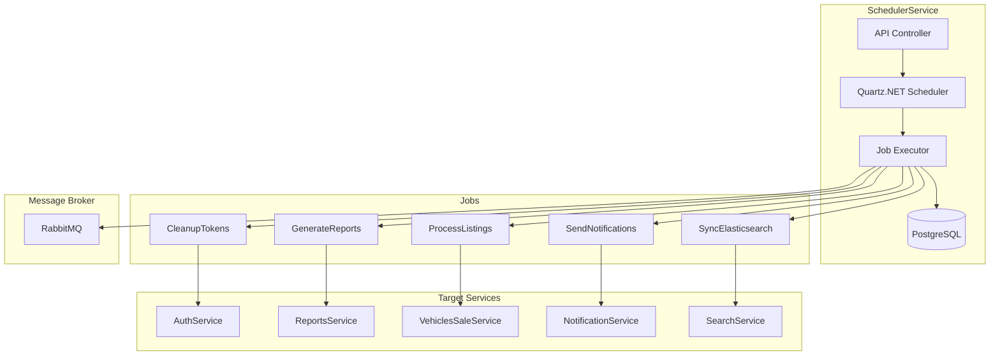

# ⏰ SchedulerService - Matriz de Procesos

---

## 📊 Resumen de Implementación

| Componente                    | Total | Implementado | Pendiente | Estado         |
| ----------------------------- | ----- | ------------ | --------- | -------------- |
| **Controllers**               | 2     | 0            | 2         | 🔴 Pendiente   |
| **SCHED-JOB-\*** (Jobs CRUD)  | 5     | 0            | 5         | 🔴 Pendiente   |
| **SCHED-EXEC-\*** (Ejecución) | 4     | 0            | 4         | 🔴 Pendiente   |
| **SCHED-CRON-\*** (Cron)      | 3     | 0            | 3         | 🔴 Pendiente   |
| **SCHED-HIST-\*** (Historial) | 3     | 0            | 3         | 🔴 Pendiente   |
| **Tests**                     | 0     | 0            | 18        | 🔴 Pendiente   |
| **TOTAL**                     | 17    | 0            | 17        | 🔴 0% Completo |

---

## 📋 Información General

| Aspecto           | Detalle                                                                                                                                               |
| ----------------- | ----------------------------------------------------------------------------------------------------------------------------------------------------- |
| **Servicio**      | SchedulerService                                                                                                                                      |
| **Puerto**        | 5046                                                                                                                                                  |
| **Base de Datos** | PostgreSQL (scheduler_db)                                                                                                                             |
| **Tecnología**    | .NET 8, MediatR, Quartz.NET, Entity Framework Core                                                                                                    |
| **Mensajería**    | RabbitMQ (publicador)                                                                                                                                 |
| **Descripción**   | Sistema centralizado de programación de tareas (jobs) para ejecutar procesos recurrentes, reportes programados, mantenimientos y tareas de background |

---

## 🎯 Endpoints del Servicio

### JobsController - Gestión de Jobs

| Método   | Endpoint                 | Descripción                 | Auth | Roles |
| -------- | ------------------------ | --------------------------- | ---- | ----- |
| `GET`    | `/api/jobs`              | Listar todos los jobs       | ✅   | Admin |
| `GET`    | `/api/jobs/active`       | Listar jobs activos         | ✅   | Admin |
| `GET`    | `/api/jobs/{id}`         | Obtener job por ID          | ✅   | Admin |
| `POST`   | `/api/jobs`              | Crear nuevo job             | ✅   | Admin |
| `PUT`    | `/api/jobs/{id}`         | Actualizar job              | ✅   | Admin |
| `DELETE` | `/api/jobs/{id}`         | Eliminar job                | ✅   | Admin |
| `POST`   | `/api/jobs/{id}/enable`  | Habilitar job               | ✅   | Admin |
| `POST`   | `/api/jobs/{id}/disable` | Deshabilitar job            | ✅   | Admin |
| `POST`   | `/api/jobs/{id}/pause`   | Pausar job                  | ✅   | Admin |
| `POST`   | `/api/jobs/{id}/trigger` | Ejecutar job inmediatamente | ✅   | Admin |

### ExecutionsController - Historial de Ejecuciones

| Método | Endpoint                      | Descripción                   | Auth | Roles |
| ------ | ----------------------------- | ----------------------------- | ---- | ----- |
| `GET`  | `/api/executions/recent`      | Obtener ejecuciones recientes | ✅   | Admin |
| `GET`  | `/api/executions/{id}`        | Obtener ejecución por ID      | ✅   | Admin |
| `GET`  | `/api/executions/job/{jobId}` | Obtener ejecuciones de un job | ✅   | Admin |

---

## 📊 Entidades del Dominio

### Job (Configuración de Job)

```csharp
public class Job
{
    public Guid Id { get; set; }
    public string Name { get; set; }                     // Nombre del job
    public string Description { get; set; }              // Descripción
    public string JobType { get; set; }                  // Fully qualified type name
    public string CronExpression { get; set; }           // Expresión CRON
    public JobStatus Status { get; set; }                // Estado del job
    public int RetryCount { get; set; } = 3;             // Reintentos en caso de fallo
    public int TimeoutSeconds { get; set; } = 300;       // Timeout (5 min default)
    public Dictionary<string, string> Parameters { get; set; } = new();  // Parámetros
    public DateTime CreatedAt { get; set; }
    public DateTime? UpdatedAt { get; set; }
    public string CreatedBy { get; set; }                // Usuario que creó el job
    public DateTime? LastExecutionAt { get; set; }       // Última ejecución
    public DateTime? NextExecutionAt { get; set; }       // Próxima ejecución

    // Relaciones
    public List<JobExecution> Executions { get; set; }
}
```

### JobExecution (Instancia de Ejecución)

```csharp
public class JobExecution
{
    public Guid Id { get; set; }
    public Guid JobId { get; set; }                      // FK al Job
    public ExecutionStatus Status { get; set; }          // Estado de la ejecución
    public DateTime ScheduledAt { get; set; }            // Cuándo estaba programada
    public DateTime? StartedAt { get; set; }             // Cuándo inició
    public DateTime? CompletedAt { get; set; }           // Cuándo terminó
    public int AttemptNumber { get; set; } = 1;          // Número de intento
    public string? ErrorMessage { get; set; }            // Mensaje de error
    public string? StackTrace { get; set; }              // Stack trace si falló
    public string? Result { get; set; }                  // Resultado serializado
    public long? DurationMs { get; set; }                // Duración en ms
    public string? ExecutedBy { get; set; }              // Worker que lo ejecutó

    // Navegación
    public Job Job { get; set; }
}
```

### Enumeraciones

```csharp
public enum JobStatus
{
    Enabled = 1,    // Job habilitado, se ejecutará según el CRON
    Disabled = 2,   // Job deshabilitado, no se ejecutará
    Paused = 3,     // Job pausado temporalmente
    Archived = 4    // Job archivado/eliminado lógicamente
}

public enum ExecutionStatus
{
    Scheduled = 1,  // Programada, esperando ejecución
    Running = 2,    // Actualmente ejecutándose
    Succeeded = 3,  // Completada exitosamente
    Failed = 4,     // Falló con error
    Cancelled = 5,  // Cancelada manualmente
    Retrying = 6    // Reintentando después de un fallo
}
```

---

## 🔄 Procesos Detallados

### PROCESO 1: Crear Nuevo Job

#### Endpoint: `POST /api/jobs`

| Paso | Actor           | Acción                         | Sistema                            | Resultado         |
| ---- | --------------- | ------------------------------ | ---------------------------------- | ----------------- |
| 1    | Admin           | Envía configuración del job    | HTTP POST                          | Request recibido  |
| 2    | API             | Valida token JWT con rol Admin | Authorization                      | Autorizado        |
| 3    | Validador       | Valida campos requeridos       | FluentValidation                   | Campos válidos    |
| 4    | Validador       | Valida expresión CRON          | Cronos.CronExpression.Parse()      | CRON válido       |
| 5    | Validador       | Valida que JobType existe      | Type.GetType()                     | Tipo existe       |
| 6    | Handler         | Crea entidad Job               | new Job()                          | Job creado        |
| 7    | Handler         | Calcula NextExecutionAt        | CronExpression.GetNextOccurrence() | Próxima ejecución |
| 8    | Repository      | Persiste en base de datos      | INSERT jobs                        | Job guardado      |
| 9    | QuartzScheduler | Registra job en Quartz         | IScheduler.ScheduleJob()           | Job programado    |
| 10   | API             | Retorna 201 Created            | HTTP Response                      | Job DTO           |

#### Request Body

```json
{
  "name": "GenerateMonthlyReports",
  "description": "Genera reportes mensuales de ventas para todos los dealers",
  "jobType": "SchedulerService.Jobs.GenerateMonthlyReportsJob",
  "cronExpression": "0 0 1 * *",
  "retryCount": 3,
  "timeoutSeconds": 600,
  "parameters": {
    "reportType": "MonthlyDealerSales",
    "format": "PDF",
    "sendEmail": "true"
  }
}
```

#### Response (201 Created)

```json
{
  "id": "job-uuid",
  "name": "GenerateMonthlyReports",
  "description": "Genera reportes mensuales de ventas para todos los dealers",
  "jobType": "SchedulerService.Jobs.GenerateMonthlyReportsJob",
  "cronExpression": "0 0 1 * *",
  "status": "Enabled",
  "retryCount": 3,
  "timeoutSeconds": 600,
  "parameters": {
    "reportType": "MonthlyDealerSales",
    "format": "PDF",
    "sendEmail": "true"
  },
  "createdAt": "2026-01-09T10:30:00Z",
  "createdBy": "admin-uuid",
  "nextExecutionAt": "2026-02-01T00:00:00Z"
}
```

---

### PROCESO 2: Obtener Todos los Jobs

#### Endpoint: `GET /api/jobs`

| Paso | Actor   | Acción                   | Sistema                            | Resultado        |
| ---- | ------- | ------------------------ | ---------------------------------- | ---------------- |
| 1    | Admin   | Solicita lista de jobs   | HTTP GET                           | Request recibido |
| 2    | API     | Valida autenticación     | JWT check                          | Autorizado       |
| 3    | Handler | Consulta todos los jobs  | Repository.GetAllAsync()           | Lista de jobs    |
| 4    | Handler | Incluye última ejecución | Include(j => j.Executions.Take(1)) | Con historial    |
| 5    | Handler | Ordena por nombre        | OrderBy(j => j.Name)               | Ordenado         |
| 6    | API     | Retorna lista            | HTTP 200                           | List<JobDto>     |

#### Response (200 OK)

```json
[
  {
    "id": "job-uuid-1",
    "name": "CleanupExpiredTokens",
    "description": "Limpia tokens JWT expirados de la base de datos",
    "cronExpression": "0 0 * * *",
    "status": "Enabled",
    "lastExecutionAt": "2026-01-09T00:00:00Z",
    "nextExecutionAt": "2026-01-10T00:00:00Z",
    "lastExecutionStatus": "Succeeded"
  },
  {
    "id": "job-uuid-2",
    "name": "GenerateDailyBackup",
    "description": "Genera backup diario de todas las bases de datos",
    "cronExpression": "0 2 * * *",
    "status": "Enabled",
    "lastExecutionAt": "2026-01-09T02:00:00Z",
    "nextExecutionAt": "2026-01-10T02:00:00Z",
    "lastExecutionStatus": "Succeeded"
  },
  {
    "id": "job-uuid-3",
    "name": "SendPendingNotifications",
    "description": "Envía notificaciones pendientes en cola",
    "cronExpression": "*/5 * * * *",
    "status": "Enabled",
    "lastExecutionAt": "2026-01-09T10:25:00Z",
    "nextExecutionAt": "2026-01-09T10:30:00Z",
    "lastExecutionStatus": "Succeeded"
  }
]
```

---

### PROCESO 3: Obtener Jobs Activos

#### Endpoint: `GET /api/jobs/active`

| Paso | Actor   | Acción                       | Sistema                 | Resultado        |
| ---- | ------- | ---------------------------- | ----------------------- | ---------------- |
| 1    | Admin   | Solicita jobs activos        | HTTP GET                | Request recibido |
| 2    | API     | Valida autenticación         | JWT check               | Autorizado       |
| 3    | Handler | Filtra jobs habilitados      | WHERE Status = Enabled  | Solo activos     |
| 4    | Handler | Ordena por próxima ejecución | OrderBy NextExecutionAt | Ordenado         |
| 5    | API     | Retorna lista filtrada       | HTTP 200                | List<JobDto>     |

---

### PROCESO 4: Habilitar/Deshabilitar Job

#### Endpoint: `POST /api/jobs/{id}/enable`

| Paso | Actor           | Acción                        | Sistema                            | Resultado         |
| ---- | --------------- | ----------------------------- | ---------------------------------- | ----------------- |
| 1    | Admin           | Solicita habilitar job        | HTTP POST                          | Request recibido  |
| 2    | API             | Valida autenticación          | JWT check                          | Autorizado        |
| 3    | Handler         | Busca job por ID              | Repository.GetByIdAsync()          | Job encontrado    |
| 4    | Handler         | Valida que no esté habilitado | job.Status != Enabled              | Puede habilitarse |
| 5    | Handler         | Cambia estado a Enabled       | job.Enable()                       | Estado cambiado   |
| 6    | Handler         | Calcula NextExecutionAt       | CronExpression.GetNextOccurrence() | Próxima ejecución |
| 7    | Repository      | Persiste cambio               | UPDATE jobs                        | Job actualizado   |
| 8    | QuartzScheduler | Reactiva en Quartz            | IScheduler.ResumeJob()             | Job reactivado    |
| 9    | API             | Retorna job actualizado       | HTTP 200                           | JobDto            |

#### Endpoint: `POST /api/jobs/{id}/disable`

| Paso | Actor           | Acción                    | Sistema                   | Resultado             |
| ---- | --------------- | ------------------------- | ------------------------- | --------------------- |
| 1    | Admin           | Solicita deshabilitar job | HTTP POST                 | Request recibido      |
| 2    | API             | Valida autenticación      | JWT check                 | Autorizado            |
| 3    | Handler         | Busca job por ID          | Repository.GetByIdAsync() | Job encontrado        |
| 4    | Handler         | Cambia estado a Disabled  | job.Disable()             | Estado cambiado       |
| 5    | Handler         | Limpia NextExecutionAt    | NextExecutionAt = null    | Sin próxima ejecución |
| 6    | Repository      | Persiste cambio           | UPDATE jobs               | Job actualizado       |
| 7    | QuartzScheduler | Pausa en Quartz           | IScheduler.PauseJob()     | Job pausado           |
| 8    | API             | Retorna job actualizado   | HTTP 200                  | JobDto                |

---

### PROCESO 5: Ejecutar Job Inmediatamente

#### Endpoint: `POST /api/jobs/{id}/trigger`

| Paso | Actor           | Acción                         | Sistema                   | Resultado                |
| ---- | --------------- | ------------------------------ | ------------------------- | ------------------------ |
| 1    | Admin           | Solicita ejecución inmediata   | HTTP POST                 | Request recibido         |
| 2    | API             | Valida autenticación           | JWT check                 | Autorizado               |
| 3    | Handler         | Busca job por ID               | Repository.GetByIdAsync() | Job encontrado           |
| 4    | Handler         | Valida que job esté habilitado | job.IsExecutable()        | Puede ejecutarse         |
| 5    | Handler         | Crea JobExecution              | new JobExecution()        | Ejecución creada         |
| 6    | Handler         | Estado = Scheduled             | ExecutionStatus.Scheduled | Programada               |
| 7    | Repository      | Persiste ejecución             | INSERT job_executions     | Ejecución guardada       |
| 8    | QuartzScheduler | Dispara ejecución              | IScheduler.TriggerJob()   | Job disparado            |
| 9    | API             | Retorna ID de ejecución        | HTTP 200                  | { executionId, message } |

#### Response (200 OK)

```json
{
  "executionId": "execution-uuid",
  "message": "Job triggered successfully"
}
```

---

### PROCESO 6: Obtener Ejecuciones Recientes

#### Endpoint: `GET /api/executions/recent`

| Paso | Actor   | Acción                         | Sistema                             | Resultado             |
| ---- | ------- | ------------------------------ | ----------------------------------- | --------------------- |
| 1    | Admin   | Solicita ejecuciones recientes | HTTP GET                            | Request recibido      |
| 2    | API     | Valida autenticación           | JWT check                           | Autorizado            |
| 3    | Handler | Consulta ejecuciones           | Repository.GetRecentAsync()         | Lista de ejecuciones  |
| 4    | Handler | Ordena por fecha DESC          | OrderByDescending(e => e.StartedAt) | Más recientes primero |
| 5    | Handler | Aplica límite                  | Take(pageSize)                      | Tamaño limitado       |
| 6    | API     | Retorna lista                  | HTTP 200                            | List<JobExecutionDto> |

#### Query Parameters

| Parámetro  | Tipo | Default | Descripción                        |
| ---------- | ---- | ------- | ---------------------------------- |
| `pageSize` | int  | 100     | Cantidad de ejecuciones a retornar |

#### Response (200 OK)

```json
[
  {
    "id": "exec-uuid-1",
    "jobId": "job-uuid-1",
    "jobName": "SendPendingNotifications",
    "status": "Succeeded",
    "scheduledAt": "2026-01-09T10:25:00Z",
    "startedAt": "2026-01-09T10:25:01Z",
    "completedAt": "2026-01-09T10:25:03Z",
    "durationMs": 2150,
    "attemptNumber": 1,
    "executedBy": "worker-1"
  },
  {
    "id": "exec-uuid-2",
    "jobId": "job-uuid-4",
    "jobName": "ProcessExpiredListings",
    "status": "Failed",
    "scheduledAt": "2026-01-09T10:20:00Z",
    "startedAt": "2026-01-09T10:20:01Z",
    "completedAt": "2026-01-09T10:20:15Z",
    "durationMs": 14500,
    "attemptNumber": 3,
    "executedBy": "worker-2",
    "errorMessage": "Database connection timeout"
  },
  {
    "id": "exec-uuid-3",
    "jobId": "job-uuid-2",
    "jobName": "GenerateDailyBackup",
    "status": "Running",
    "scheduledAt": "2026-01-09T10:00:00Z",
    "startedAt": "2026-01-09T10:00:02Z",
    "attemptNumber": 1,
    "executedBy": "worker-1"
  }
]
```

---

### PROCESO 7: Obtener Ejecuciones de un Job Específico

#### Endpoint: `GET /api/executions/job/{jobId}`

| Paso | Actor   | Acción                     | Sistema                     | Resultado             |
| ---- | ------- | -------------------------- | --------------------------- | --------------------- |
| 1    | Admin   | Solicita historial del job | HTTP GET                    | Request recibido      |
| 2    | API     | Valida autenticación       | JWT check                   | Autorizado            |
| 3    | Handler | Filtra por jobId           | WHERE JobId = @jobId        | Ejecuciones del job   |
| 4    | Handler | Ordena por fecha DESC      | OrderByDescending StartedAt | Más recientes primero |
| 5    | Handler | Aplica límite              | Take(pageSize)              | Tamaño limitado       |
| 6    | API     | Retorna historial          | HTTP 200                    | List<JobExecutionDto> |

---

## 📅 Expresiones CRON

### Formato CRON (5 campos)

```
┌───────────── minuto (0 - 59)
│ ┌───────────── hora (0 - 23)
│ │ ┌───────────── día del mes (1 - 31)
│ │ │ ┌───────────── mes (1 - 12)
│ │ │ │ ┌───────────── día de la semana (0 - 6) (Domingo = 0)
│ │ │ │ │
* * * * *
```

### Ejemplos de CRON

| Expresión        | Descripción                        |
| ---------------- | ---------------------------------- |
| `* * * * *`      | Cada minuto                        |
| `*/5 * * * *`    | Cada 5 minutos                     |
| `0 * * * *`      | Cada hora (minuto 0)               |
| `0 0 * * *`      | Diario a medianoche                |
| `0 2 * * *`      | Diario a las 2:00 AM               |
| `0 0 1 * *`      | Primer día de cada mes             |
| `0 0 * * 0`      | Cada domingo a medianoche          |
| `0 9-17 * * 1-5` | Cada hora de 9-17, Lunes a Viernes |
| `0 0 1,15 * *`   | Días 1 y 15 de cada mes            |

---

## 🔧 Jobs Predefinidos del Sistema

| Job                         | CRON          | Descripción                          |
| --------------------------- | ------------- | ------------------------------------ |
| `CleanupExpiredTokens`      | `0 0 * * *`   | Limpia tokens JWT expirados          |
| `CleanupExpiredOtps`        | `0 */6 * * *` | Limpia OTPs expirados cada 6 horas   |
| `GenerateDailyBackup`       | `0 2 * * *`   | Backup diario a las 2 AM             |
| `ProcessExpiredListings`    | `0 3 * * *`   | Marca listings expirados             |
| `SendPendingNotifications`  | `*/5 * * * *` | Procesa cola de notificaciones       |
| `GenerateMonthlyReports`    | `0 0 1 * *`   | Reportes mensuales                   |
| `SyncElasticsearch`         | `0 */2 * * *` | Sincroniza índice de búsqueda        |
| `CheckSubscriptionRenewals` | `0 8 * * *`   | Verifica renovaciones de suscripción |
| `SendExpirationReminders`   | `0 9 * * *`   | Envía recordatorios de expiración    |
| `ArchiveOldAuditLogs`       | `0 1 1 * *`   | Archiva logs de auditoría antiguos   |
| `PruneMediaFiles`           | `0 4 * * 0`   | Limpia archivos huérfanos (domingos) |
| `GenerateComplianceReports` | `0 0 1 * *`   | Reportes de compliance mensuales     |
| `RefreshMaterializedViews`  | `0 */4 * * *` | Actualiza vistas materializadas      |
| `CheckDealerSubscriptions`  | `0 6 * * *`   | Verifica estado de suscripciones     |

---

## 🔔 Eventos de Dominio (RabbitMQ)

### Eventos Publicados

| Evento                    | Exchange           | Routing Key           | Payload                           |
| ------------------------- | ------------------ | --------------------- | --------------------------------- |
| `JobCreatedEvent`         | `scheduler.events` | `job.created`         | JobId, Name, CronExpression       |
| `JobUpdatedEvent`         | `scheduler.events` | `job.updated`         | JobId, ChangedFields              |
| `JobDeletedEvent`         | `scheduler.events` | `job.deleted`         | JobId, Name                       |
| `JobEnabledEvent`         | `scheduler.events` | `job.enabled`         | JobId, NextExecutionAt            |
| `JobDisabledEvent`        | `scheduler.events` | `job.disabled`        | JobId                             |
| `JobTriggeredEvent`       | `scheduler.events` | `job.triggered`       | JobId, ExecutionId, TriggeredBy   |
| `ExecutionStartedEvent`   | `scheduler.events` | `execution.started`   | ExecutionId, JobId, StartedAt     |
| `ExecutionSucceededEvent` | `scheduler.events` | `execution.succeeded` | ExecutionId, JobId, DurationMs    |
| `ExecutionFailedEvent`    | `scheduler.events` | `execution.failed`    | ExecutionId, JobId, ErrorMessage  |
| `ExecutionRetryingEvent`  | `scheduler.events` | `execution.retrying`  | ExecutionId, JobId, AttemptNumber |

---

## ⚠️ Reglas de Negocio

### Gestión de Jobs

| #   | Regla                               | Validación                    |
| --- | ----------------------------------- | ----------------------------- |
| 1   | CRON debe ser válido                | Cronos.CronExpression.Parse() |
| 2   | JobType debe existir en el assembly | Type.GetType() != null        |
| 3   | TimeoutSeconds mínimo 30 segundos   | >= 30                         |
| 4   | TimeoutSeconds máximo 1 hora        | <= 3600                       |
| 5   | RetryCount máximo 5                 | <= 5                          |
| 6   | Nombre de job único                 | Unique constraint             |

### Ejecución de Jobs

| #   | Regla                                   | Validación                  |
| --- | --------------------------------------- | --------------------------- |
| 1   | Solo jobs Enabled pueden ejecutarse     | Status == Enabled           |
| 2   | No ejecutar si ya hay ejecución Running | Check existing executions   |
| 3   | Reintentar según RetryCount             | AttemptNumber <= RetryCount |
| 4   | Cancelar si excede TimeoutSeconds       | CancellationToken timeout   |
| 5   | Registrar todas las ejecuciones         | JobExecution always created |

### Retención de Historial

| Tipo                 | Retención | Descripción                   |
| -------------------- | --------- | ----------------------------- |
| Ejecuciones exitosas | 30 días   | Limpieza automática           |
| Ejecuciones fallidas | 90 días   | Mayor retención para análisis |
| Jobs eliminados      | 365 días  | Soft delete con archivado     |

---

## ❌ Códigos de Error

| Código     | HTTP Status | Mensaje                                   | Causa                   |
| ---------- | ----------- | ----------------------------------------- | ----------------------- |
| `JOB_001`  | 400         | Expresión CRON inválida                   | Formato CRON incorrecto |
| `JOB_002`  | 400         | JobType no encontrado                     | Tipo de clase no existe |
| `JOB_003`  | 400         | Nombre de job ya existe                   | Nombre duplicado        |
| `JOB_004`  | 404         | Job no encontrado                         | ID inexistente          |
| `JOB_005`  | 400         | Job no está habilitado                    | No puede ejecutarse     |
| `JOB_006`  | 400         | Job ya tiene ejecución en progreso        | Concurrent execution    |
| `JOB_007`  | 400         | TimeoutSeconds fuera de rango             | < 30 o > 3600           |
| `JOB_008`  | 400         | RetryCount fuera de rango                 | < 0 o > 5               |
| `EXEC_001` | 404         | Ejecución no encontrada                   | ID inexistente          |
| `EXEC_002` | 400         | No se puede cancelar ejecución completada | Estado terminal         |

---

## ⚙️ Configuración del Servicio

### appsettings.json

```json
{
  "ConnectionStrings": {
    "DefaultConnection": "Host=postgres;Database=scheduler_db;Username=postgres;Password=xxx"
  },
  "Quartz": {
    "SchedulerName": "OKLAScheduler",
    "ThreadPool": {
      "ThreadCount": 10,
      "ThreadPriority": "Normal"
    },
    "JobStore": {
      "Type": "Quartz.Impl.AdoJobStore.JobStoreTX",
      "DataSource": "default",
      "TablePrefix": "QRTZ_",
      "UseProperties": true
    },
    "DataSource": {
      "Provider": "Npgsql",
      "ConnectionString": "Host=postgres;Database=scheduler_db;Username=postgres;Password=xxx"
    },
    "MisfireThreshold": 60000
  },
  "SchedulerSettings": {
    "DefaultRetryCount": 3,
    "DefaultTimeoutSeconds": 300,
    "ExecutionHistoryDays": 30,
    "FailedExecutionHistoryDays": 90,
    "MaxConcurrentJobs": 5
  },
  "RabbitMQ": {
    "Host": "rabbitmq",
    "Port": 5672,
    "Username": "guest",
    "Password": "guest",
    "VirtualHost": "/",
    "Exchange": "scheduler.events"
  }
}
```

---

## 🔒 Seguridad

### Autenticación y Autorización

| Endpoint               | Auth | Roles |
| ---------------------- | ---- | ----- |
| GET /api/jobs          | ✅   | Admin |
| GET /api/jobs/active   | ✅   | Admin |
| GET /api/jobs/{id}     | ✅   | Admin |
| POST /api/jobs         | ✅   | Admin |
| PUT /api/jobs/{id}     | ✅   | Admin |
| DELETE /api/jobs/{id}  | ✅   | Admin |
| POST /api/jobs/{id}/\* | ✅   | Admin |
| GET /api/executions/\* | ✅   | Admin |

### Consideraciones

1. **Solo Admin puede gestionar jobs** - Operaciones sensibles
2. **Jobs no exponen endpoints externos** - Ejecutan internamente
3. **Parámetros validados** - Sin inyección de código
4. **Timeouts estrictos** - Evitar bloqueos

---

## 📈 Métricas y Observabilidad

### Métricas Prometheus

| Métrica                                | Tipo      | Labels           | Descripción                      |
| -------------------------------------- | --------- | ---------------- | -------------------------------- |
| `scheduler_jobs_total`                 | Gauge     | status           | Total de jobs por estado         |
| `scheduler_executions_total`           | Counter   | job_name, status | Total de ejecuciones             |
| `scheduler_execution_duration_seconds` | Histogram | job_name         | Duración de ejecuciones          |
| `scheduler_failed_executions_total`    | Counter   | job_name         | Ejecuciones fallidas             |
| `scheduler_retry_count`                | Counter   | job_name         | Reintentos realizados            |
| `scheduler_next_execution_seconds`     | Gauge     | job_name         | Segundos hasta próxima ejecución |

### Health Checks

```
GET /health          - Health general
GET /health/ready    - Ready (Quartz running)
GET /health/live     - Liveness
```

---

## 🔌 Diagrama de Integración



---

## 📚 Referencias

- [JobsController](../../backend/SchedulerService/SchedulerService.Api/Controllers/JobsController.cs)
- [ExecutionsController](../../backend/SchedulerService/SchedulerService.Api/Controllers/ExecutionsController.cs)
- [Job Entity](../../backend/SchedulerService/SchedulerService.Domain/Entities/Job.cs)
- [JobExecution Entity](../../backend/SchedulerService/SchedulerService.Domain/Entities/JobExecution.cs)
- [Quartz.NET Documentation](https://www.quartz-scheduler.net/documentation/)

---

**Última actualización:** Enero 9, 2026  
**Autor:** Sistema de Documentación Automatizado  
**Versión:** 1.0.0
