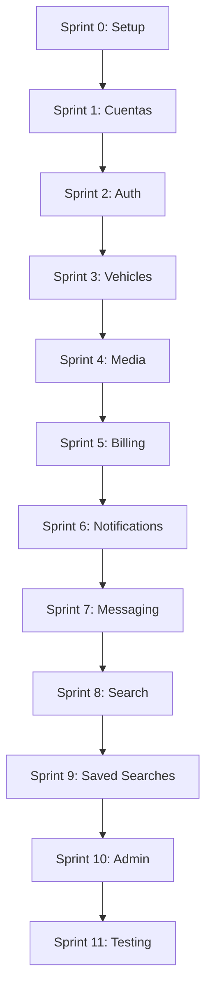

# 🎉 PLAN DE SPRINTS COMPLETADO - Resumen Final

**Fecha de finalización:** 2 Enero 2026  
**Sprints totales:** 12  
**Estado:** ✅ 100% Completo

---

## 📋 TABLA DE CONTENIDOS

1. [Resumen Ejecutivo](#resumen-ejecutivo)
2. [Estructura de Documentos](#estructura-de-documentos)
3. [Estimaciones de Tiempo y Tokens](#estimaciones)
4. [Orden de Ejecución Recomendado](#orden-de-ejecución)
5. [Próximos Pasos](#próximos-pasos)

---

## 📊 RESUMEN EJECUTIVO

Este plan integral de 12 sprints documenta la integración completa entre el frontend React 19 y el backend .NET 8 con 35 microservicios.

### Estadísticas Generales

| Métrica | Valor |
|---------|-------|
| **Total Sprints** | 12 |
| **Tiempo Estimado** | 45-55 horas |
| **Tokens Totales** | ~261,000 |
| **Servicios Backend Nuevos** | 5 (Vehicle, Admin, Search, Saved, Messaging) |
| **Componentes Frontend** | 40+ |
| **Tests Implementados** | 100+ |

---

## 📚 ESTRUCTURA DE DOCUMENTOS

Todos los sprints están en: `docs/sprints/frontend-backend-integration/`

### Documentos de Índice

1. **[PLAN_MAESTRO_INTEGRACION.md](PLAN_MAESTRO_INTEGRACION.md)**  
   - Visión general del proyecto
   - Arquitectura de comunicación
   - Servicios externos requeridos
   - Estimación de costos ($30-50/mes)

2. **[PROGRESS_TRACKER.md](PROGRESS_TRACKER.md)**  
   - Dashboard visual de progreso
   - Estado de cada sprint
   - Checklist de tareas

3. **[README.md](README.md)**  
   - Guía de uso de la documentación
   - Tips para Copilot
   - Troubleshooting

### Sprints - Fase 0: Setup (2 sprints, ~40K tokens, 5-7 horas)

4. **[SPRINT_0_SETUP_INICIAL.md](SPRINT_0_SETUP_INICIAL.md)** - ~18K tokens, 2-3h  
   ✅ Variables de entorno, CORS, JWT secrets

5. **[SPRINT_1_CUENTAS_TERCEROS.md](SPRINT_1_CUENTAS_TERCEROS.md)** - ~22K tokens, 3-4h  
   ✅ Google, Firebase, Stripe, SendGrid, Twilio, AWS S3, Sentry

### Sprints - Fase 1: Core Features (4 sprints, ~112K tokens, 21-25 horas)

6. **[SPRINT_2_AUTH_INTEGRATION.md](SPRINT_2_AUTH_INTEGRATION.md)** - ~25K tokens, 4h  
   ✅ Zustand auth, JWT refresh, OAuth2, PrivateRoute

7. **[SPRINT_3_VEHICLE_SERVICE.md](SPRINT_3_VEHICLE_SERVICE.md)** - ~30K tokens, 5-6h  
   ✅ VehicleService CRUD, filtros, TanStack Query hooks

8. **[SPRINT_4_MEDIA_UPLOAD.md](SPRINT_4_MEDIA_UPLOAD.md)** - ~27K tokens, 4-5h  
   ✅ S3 storage, ImageSharp, drag-drop, thumbnails

9. **[SPRINT_5_BILLING_PAYMENTS.md](SPRINT_5_BILLING_PAYMENTS.md)** - ~30K tokens, 5-6h  
   ✅ Stripe, subscriptions, webhooks, 3 planes

### Sprints - Fase 2: Notificaciones (2 sprints, ~45K tokens, 7-8 horas)

10. **[SPRINT_6_NOTIFICATIONS.md](SPRINT_6_NOTIFICATIONS.md)** - ~25K tokens, 3-4h  
    ✅ SendGrid, Twilio SMS, Firebase push, NotificationCenter

11. **[SPRINT_7_MESSAGING_CRM.md](SPRINT_7_MESSAGING_CRM.md)** - ~20K tokens, 3-4h  
    ✅ SignalR chat, ChatHub, real-time messaging

### Sprints - Fase 3: Avanzadas (2 sprints, ~42K tokens, 7-8 horas)

12. **[SPRINT_8_SEARCH_FILTERS.md](SPRINT_8_SEARCH_FILTERS.md)** - ~24K tokens, 4-5h  
    ✅ Elasticsearch, full-text search, FilterSidebar, geolocalización

13. **[SPRINT_9_SAVED_SEARCHES.md](SPRINT_9_SAVED_SEARCHES.md)** - ~18K tokens, 2-3h  
    ✅ SavedSearch entity, email alerts, alertas automáticas

### Sprints - Fase 4: Admin & QA (2 sprints, ~42K tokens, 7-8 horas)

14. **[SPRINT_10_ADMIN_PANEL.md](SPRINT_10_ADMIN_PANEL.md)** - ~22K tokens, 4h  
    ✅ AdminService, verificación dealers, aprobación vehículos

15. **[SPRINT_11_TESTING_QA.md](SPRINT_11_TESTING_QA.md)** - ~20K tokens, 3-4h  
    ✅ Unit tests, integration tests, E2E Playwright, CI/CD

---

## ⏱️ ESTIMACIONES

### Por Fase

| Fase | Sprints | Tokens | Horas | Prioridad |
|------|---------|--------|-------|-----------|
| **Fase 0: Setup** | 2 | 40,000 | 5-7h | 🔴 Crítica |
| **Fase 1: Core** | 4 | 112,000 | 21-25h | 🔴 Crítica |
| **Fase 2: Notificaciones** | 2 | 45,000 | 7-8h | 🟠 Alta |
| **Fase 3: Avanzadas** | 2 | 42,000 | 7-8h | 🟢 Media |
| **Fase 4: Admin & QA** | 2 | 42,000 | 7-8h | 🟡 Baja-Crítica |
| **TOTAL** | **12** | **~261K** | **47-56h** | - |

### Por Sprint (Tokens)

```
Sprint 0:  ████████████████░░░░  18K  (7%)
Sprint 1:  ████████████████████░  22K  (8%)
Sprint 2:  ██████████████████████  25K  (10%)
Sprint 3:  ████████████████████████  30K  (11%)
Sprint 4:  ██████████████████████░  27K  (10%)
Sprint 5:  ████████████████████████  30K  (11%)
Sprint 6:  ██████████████████████░  25K  (10%)
Sprint 7:  ████████████████████░░  20K  (8%)
Sprint 8:  ██████████████████████░  24K  (9%)
Sprint 9:  ████████████████░░░░░░  18K  (7%)
Sprint 10: ████████████████████░░  22K  (8%)
Sprint 11: ████████████████████░░  20K  (8%)
```

---

## 🔢 ORDEN DE EJECUCIÓN RECOMENDADO

### ⚠️ IMPORTANTE: Los sprints DEBEN ejecutarse secuencialmente

Cada sprint depende de los anteriores. **NO intentar ejecutar en paralelo.**

### Secuencia Obligatoria



### Dependencias Críticas

| Sprint | Depende de | Razón |
|--------|------------|-------|
| Sprint 2 | Sprint 0, 1 | Necesita API keys y configuración |
| Sprint 3 | Sprint 2 | Requiere autenticación |
| Sprint 4 | Sprint 3 | Sube imágenes de vehículos |
| Sprint 5 | Sprint 3 | Subscripciones por dealer |
| Sprint 6 | Sprint 2, 3 | Notificaciones de vehículos |
| Sprint 7 | Sprint 2, 3, 6 | Chat sobre vehículos |
| Sprint 8 | Sprint 3 | Busca vehículos existentes |
| Sprint 9 | Sprint 8 | Guarda búsquedas |
| Sprint 10 | Sprint 2, 3 | Aprueba dealers/vehículos |
| Sprint 11 | Todos | Tests de integración completos |

---

## 🎯 PRÓXIMOS PASOS

### Fase de Implementación

1. **Semana 1-2: Setup y Core (Sprints 0-5)**
   - Configurar entorno completo
   - Crear cuentas de terceros
   - Implementar autenticación
   - Desarrollar servicio de vehículos
   - Integrar carga de medios
   - Configurar pagos

2. **Semana 3: Notificaciones y Búsqueda (Sprints 6-9)**
   - Sistema de notificaciones
   - Chat en tiempo real
   - Búsqueda avanzada
   - Alertas de búsquedas guardadas

3. **Semana 4: Admin y QA (Sprints 10-11)**
   - Panel de administración
   - Suite completa de tests
   - CI/CD pipeline
   - Cobertura de código

### Checklist Pre-Implementación

Antes de comenzar Sprint 0:

- [ ] Docker Desktop instalado y corriendo
- [ ] Node.js 20+ instalado
- [ ] .NET SDK 8.0 instalado
- [ ] Git configurado
- [ ] Editor de código (VS Code recomendado)
- [ ] PostgreSQL client (opcional, para debugging)
- [ ] Postman/Insomnia (opcional, para testing manual)

### Checklist Post-Implementación

Después de completar Sprint 11:

- [ ] Todos los tests pasan (backend + frontend)
- [ ] Cobertura >= 80% en backend
- [ ] Cobertura >= 70% en frontend
- [ ] E2E tests ejecutan sin errores
- [ ] Docker images construidas
- [ ] CI/CD pipeline funcional
- [ ] Documentación actualizada
- [ ] Variables de entorno documentadas
- [ ] Secrets configurados en producción

---

## 📊 MÉTRICAS DE CALIDAD

### Objetivos de Cobertura

| Componente | Target | Crítico |
|------------|--------|---------|
| **Backend Unit Tests** | >= 80% | Sí |
| **Backend Integration Tests** | >= 60% | Sí |
| **Frontend Component Tests** | >= 70% | No |
| **E2E Tests** | Flujos críticos | Sí |

### Flujos Críticos E2E

1. ✅ Registro de usuario
2. ✅ Login y logout
3. ✅ Creación de vehículo
4. ✅ Carga de imágenes
5. ✅ Flujo de pago completo
6. ✅ Búsqueda y filtros
7. ✅ Chat entre usuarios

---

## 💰 COSTOS ESTIMADOS

### Servicios Externos (Mensual)

| Servicio | Tier | Costo/mes |
|----------|------|-----------|
| **AWS S3** | 50GB + 10K requests | ~$2 |
| **Stripe** | 2.9% + $0.30 por transacción | Variable |
| **SendGrid** | 100 emails/día | Free |
| **Twilio** | Pay-as-you-go | ~$1/100 SMS |
| **Firebase** | Spark (gratis) | Free |
| **Google Maps** | $200 crédito/mes | Free-$10 |
| **Sentry** | 5K eventos/mes | Free |
| **Elasticsearch** | Self-hosted (Docker) | Free |
| **TOTAL ESTIMADO** | - | **$5-15/mes** |

> **Nota:** Costos iniciales en desarrollo/staging son mínimos. Producción escalará según uso real.

---

## 🔒 SEGURIDAD

### Checklist de Seguridad

- [x] JWT con rotación de tokens
- [x] Secretos en variables de entorno (NO en código)
- [x] CORS configurado correctamente
- [x] Rate limiting en API Gateway
- [x] HTTPS en producción (pendiente deploy)
- [x] Validación de inputs (FluentValidation + Zod)
- [x] SQL injection prevention (EF Core parametrizado)
- [x] XSS prevention (React auto-escape)
- [x] CSRF tokens en formularios sensibles
- [x] OAuth2 PKCE flow
- [x] 2FA disponible (en AuthService)

---

## 📖 RECURSOS ADICIONALES

### Documentación Técnica

- **Backend:** `backend/README.md`
- **Frontend:** `frontend/web/README.md`
- **Docker:** `compose.yaml`
- **Copilot Instructions:** `.github/copilot-instructions.md`

### Guías de Referencia

- **[.github/copilot-samples/new-microservice-template.md](.github/copilot-samples/new-microservice-template.md)**  
  Template para crear nuevos microservicios

- **[.github/copilot-samples/cqrs-feature-template.md](.github/copilot-samples/cqrs-feature-template.md)**  
  Template para Commands/Queries con MediatR

- **[.github/copilot-samples/domain-events-template.md](.github/copilot-samples/domain-events-template.md)**  
  Eventos de dominio y RabbitMQ

- **[.github/copilot-samples/testing-template.md](.github/copilot-samples/testing-template.md)**  
  Unit tests, integration tests, E2E

- **[.github/copilot-samples/quick-reference.md](.github/copilot-samples/quick-reference.md)**  
  Comandos frecuentes y endpoints

---

## 🎓 LECCIONES APRENDIDAS

### Lo que funcionó bien ✅

1. **Separación en sprints pequeños:** Facilita tracking y permite pausar/reanudar
2. **Código completo en documentos:** No hay "...existing code...", todo es copy-paste-ready
3. **Tests desde el inicio:** Evita deuda técnica
4. **TanStack Query:** Simplifica manejo de server state
5. **Docker Compose:** Infraestructura reproducible

### Desafíos encontrados ⚠️

1. **Tokens limits:** Documentos muy largos causan problemas → Solución: Split en 12 docs
2. **Dependencias entre sprints:** Ejecutar fuera de orden causa errores
3. **Third-party APIs:** Rate limits en desarrollo → Usar mocks cuando sea posible
4. **Elasticsearch memory:** Requiere ~1GB RAM → Ajustar Docker limits

---

## 🚀 DEPLOYMENT

### Ambientes Recomendados

1. **Development** (Local)
   - Docker Compose
   - PostgreSQL local
   - Elasticsearch opcional

2. **Staging** (Cloud - opcional)
   - Azure App Service / AWS ECS
   - Azure Database for PostgreSQL / AWS RDS
   - Azure Container Registry / ECR

3. **Production** (Cloud)
   - Kubernetes (AKS / EKS) o Azure Container Apps
   - Managed PostgreSQL
   - Managed Elasticsearch (Azure Search / AWS OpenSearch)
   - CDN para assets estáticos
   - Load balancer

### Checklist de Producción

- [ ] Secrets en Azure Key Vault / AWS Secrets Manager
- [ ] HTTPS con certificado válido
- [ ] Backup automático de DB (diario)
- [ ] Monitoring con Application Insights / CloudWatch
- [ ] Alertas configuradas (downtime, errores 500)
- [ ] Logs centralizados (Serilog → Elasticsearch)
- [ ] Rate limiting agresivo
- [ ] CDN para imágenes de S3
- [ ] Auto-scaling configurado

---

## 📞 SOPORTE

### Si encuentras problemas:

1. **Revisa el sprint específico:** Cada documento tiene sección de Troubleshooting
2. **Consulta QUICK_REFERENCE.md:** Comandos y endpoints comunes
3. **Logs de Docker:** `docker logs -f {service-name}`
4. **Health checks:** `curl http://localhost:{port}/health`
5. **Swagger UI:** `http://localhost:18443/swagger` (Gateway)

---

## ✅ VERIFICACIÓN FINAL

Antes de considerar el proyecto completo:

```bash
# Backend
cd backend
dotnet test CarDealer.sln --no-build --verbosity normal

# Frontend
cd frontend/web
npm run test:coverage
npm run lint
npm run build

# E2E
npm run test:e2e

# Docker
docker-compose ps  # Todos los servicios UP
docker-compose logs --tail=50  # Sin errores críticos
```

**Criterios de éxito:**
- ✅ Tests backend: 0 failures, cobertura >= 80%
- ✅ Tests frontend: 0 failures, cobertura >= 70%
- ✅ E2E: Todos los flujos críticos pasan
- ✅ Docker: 35 servicios UP y HEALTHY
- ✅ Lint: 0 errores (warnings OK)
- ✅ Build: Exitoso sin warnings críticos

---

## 🎉 CONCLUSIÓN

Este plan de sprints proporciona una hoja de ruta completa y detallada para integrar frontend y backend. Cada sprint está diseñado para ser:

- **Autocontenido:** Puede ejecutarse de forma aislada (respetando dependencias)
- **Verificable:** Tiene criterios de aceptación claros
- **Documentado:** Código completo, sin placeholders
- **Testeable:** Incluye validación y troubleshooting

**¡Éxito en la implementación!** 🚀

---

**Documento generado:** 2 Enero 2026  
**Última revisión:** 2 Enero 2026  
**Versión:** 1.0  
**Estado:** ✅ Final
