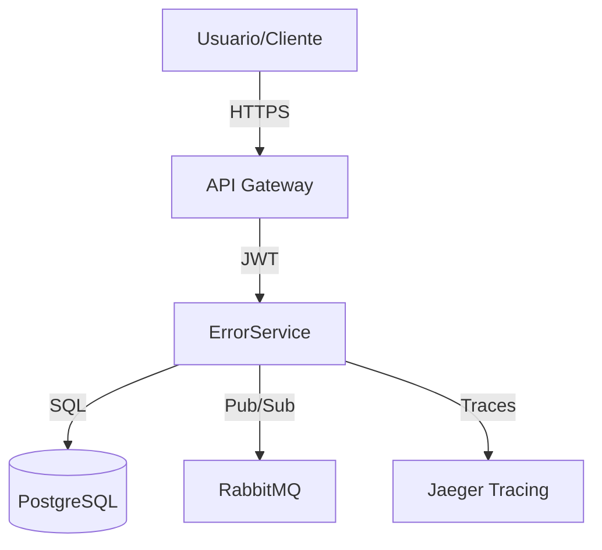
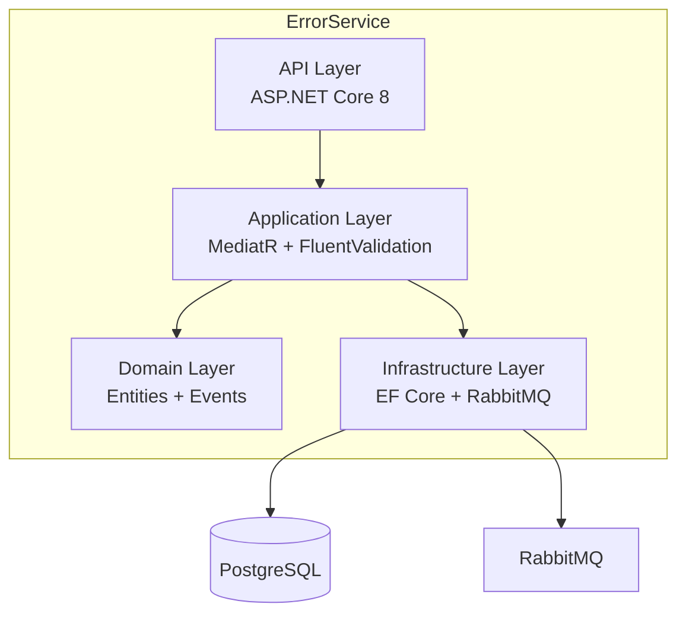
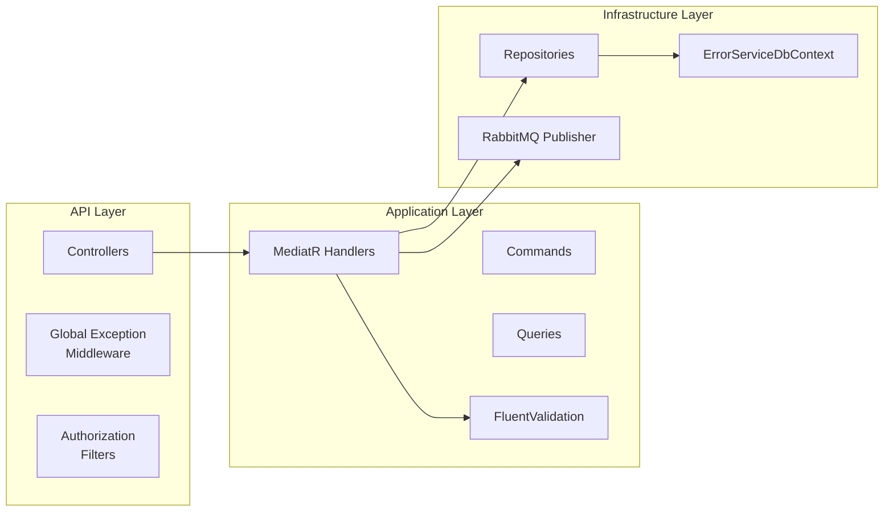

# POLÍTICA 10: DOCUMENTACIÓN OBLIGATORIA

**Versión**: 1.0  
**Última Actualización**: 2025-11-30  
**Estado**: OBLIGATORIO ✅  
**Responsable**: Equipo de Arquitectura CarDealer

---

## 📋 RESUMEN EJECUTIVO

**POLÍTICA CRÍTICA**: Todos los microservicios deben incluir documentación completa y actualizada: README.md, API documentation (Swagger/OpenAPI), arquitectura (C4 diagrams), guías de troubleshooting, y comentarios XML en código público. La documentación desactualizada es equivalente a código roto.

**Objetivo**: Garantizar que cualquier desarrollador pueda entender, ejecutar, probar, y desplegar un microservicio sin necesidad de asistencia externa.

**Alcance**: Aplica a TODOS los microservicios del ecosistema CarDealer.

---

## 🎯 DOCUMENTOS OBLIGATORIOS

### Matriz de Documentación

| Documento | Ubicación | Propósito | Obligatorio |
|-----------|-----------|-----------|-------------|
| **README.md** | Raíz del microservicio | Guía rápida de inicio | ✅ SÍ |
| **API Documentation** | Swagger UI `/swagger` | Documentación de endpoints | ✅ SÍ |
| **ARCHITECTURE.md** | Raíz del microservicio | Diagramas C4, decisiones técnicas | ✅ SÍ |
| **TROUBLESHOOTING.md** | Raíz del microservicio | Guía de resolución de problemas | ✅ SÍ |
| **TESTING_GUIDE.md** | Raíz del microservicio | Cómo ejecutar tests | ✅ SÍ |
| **DEPLOYMENT.md** | Raíz del microservicio | Guía de despliegue | ✅ SÍ |
| **CHANGELOG.md** | Raíz del microservicio | Historial de cambios | ✅ SÍ |
| **XML Comments** | Código fuente | Documentación inline | ✅ SÍ |

---

## 📄 DOCUMENTO 1: README.md

### Template de README.md

```markdown
# [Microservicio Name]

**Versión**: 1.0.0  
**Estado**: ✅ Producción  
**Responsable**: [Nombre del equipo]

---

## 📋 Descripción

Breve descripción del propósito del microservicio (2-3 líneas).

**Responsabilidades**:
- Responsabilidad 1
- Responsabilidad 2
- Responsabilidad 3

**Tecnologías**:
- .NET 8.0
- PostgreSQL 16
- RabbitMQ 3.13
- Redis (opcional)

---

## 🏗️ Arquitectura

```
┌─────────────────────────────────────────────────┐
│                  API Layer                      │
│  Controllers + Middleware + Filters             │
└─────────────────────────────────────────────────┘
                      ↓
┌─────────────────────────────────────────────────┐
│             Application Layer                   │
│  Commands + Queries + Handlers (MediatR)        │
└─────────────────────────────────────────────────┘
                      ↓
┌─────────────────────────────────────────────────┐
│               Domain Layer                      │
│  Entities + Aggregates + Domain Events          │
└─────────────────────────────────────────────────┘
                      ↓
┌─────────────────────────────────────────────────┐
│           Infrastructure Layer                  │
│  Repositories + DbContext + External Services   │
└─────────────────────────────────────────────────┘
```

**Ver más**: [ARCHITECTURE.md](ARCHITECTURE.md)

---

## 🚀 Quick Start

### Prerrequisitos

- .NET 8.0 SDK
- PostgreSQL 16
- RabbitMQ 3.13
- Docker (opcional, para contenedores)

### Instalación

```bash
# Clonar repositorio
git clone https://github.com/cardealer/[microservicio-name].git
cd [microservicio-name]

# Restaurar dependencias
dotnet restore

# Configurar User Secrets
dotnet user-secrets init --project [Microservicio].Api
dotnet user-secrets set "ConnectionStrings:DefaultConnection" "Host=localhost;Port=25432;Database=[dbname];Username=postgres;Password=yourpassword" --project [Microservicio].Api
dotnet user-secrets set "Jwt:SecretKey" "your-secret-key-min-32-chars-long" --project [Microservicio].Api

# Ejecutar migraciones
cd [Microservicio].Api
dotnet ef database update

# Ejecutar aplicación
dotnet run
```

**API disponible en**: `https://localhost:5001`  
**Swagger UI**: `https://localhost:5001/swagger`  
**Health Check**: `https://localhost:5001/health`

---

## 🧪 Testing

```bash
# Ejecutar todos los tests
dotnet test

# Ejecutar con coverage
dotnet test /p:CollectCoverage=true /p:CoverageReportsFormat=html

# Ejecutar solo tests unitarios
dotnet test --filter "Category=Unit"

# Ejecutar solo tests de integración
dotnet test --filter "Category=Integration"
```

**Ver más**: [TESTING_GUIDE.md](TESTING_GUIDE.md)

---

## 📦 Endpoints Principales

| Método | Endpoint | Descripción | Auth |
|--------|----------|-------------|------|
| GET | `/api/[resource]` | Listar todos | ✅ |
| GET | `/api/[resource]/{id}` | Obtener por ID | ✅ |
| POST | `/api/[resource]` | Crear nuevo | ✅ |
| PUT | `/api/[resource]/{id}` | Actualizar | ✅ |
| DELETE | `/api/[resource]/{id}` | Eliminar | ✅ Admin |

**Documentación completa**: `/swagger`

---

## 🔧 Configuración

### Variables de Entorno

| Variable | Descripción | Ejemplo |
|----------|-------------|---------|
| `ASPNETCORE_ENVIRONMENT` | Ambiente de ejecución | `Development`, `Production` |
| `ConnectionStrings__DefaultConnection` | PostgreSQL connection string | `Host=localhost;Port=25432;...` |
| `Jwt__SecretKey` | JWT secret key | `your-secret-key-min-32-chars` |
| `RabbitMQ__Host` | RabbitMQ host | `localhost` |
| `RabbitMQ__Port` | RabbitMQ port | `5672` |

### appsettings.json

Ver `appsettings.Development.json` para configuración local.  
**NUNCA** commitear secretos en `appsettings.json`.

---

## 🐳 Docker

### Build

```bash
docker build -t [microservicio-name]:latest -f [Microservicio].Api/Dockerfile .
```

### Run

```bash
docker run -d \
  --name [microservicio-name] \
  -p 5001:8080 \
  -e ASPNETCORE_ENVIRONMENT=Production \
  -e ConnectionStrings__DefaultConnection="Host=postgres;..." \
  [microservicio-name]:latest
```

### Docker Compose

```bash
docker-compose up -d
```

**Ver más**: [DEPLOYMENT.md](DEPLOYMENT.md)

---

## 📊 Monitoreo

- **Health Checks**: `/health`, `/health/ready`, `/health/live`
- **Metrics**: `/metrics` (Prometheus)
- **Tracing**: Jaeger UI `http://localhost:16686`
- **Logs**: Seq UI `http://localhost:5341` (Development)

---

## 🛠️ Troubleshooting

**Problema común 1**: Error de conexión a PostgreSQL
```bash
# Verificar que PostgreSQL esté ejecutándose
docker ps | grep postgres

# Verificar logs
docker logs postgres
```

**Ver más**: [TROUBLESHOOTING.md](TROUBLESHOOTING.md)

---

## 📚 Recursos

- [ARCHITECTURE.md](ARCHITECTURE.md) - Arquitectura detallada
- [TESTING_GUIDE.md](TESTING_GUIDE.md) - Guía de testing
- [TROUBLESHOOTING.md](TROUBLESHOOTING.md) - Resolución de problemas
- [DEPLOYMENT.md](DEPLOYMENT.md) - Guía de despliegue
- [CHANGELOG.md](CHANGELOG.md) - Historial de cambios

---

## 📝 Contribuir

1. Fork el repositorio
2. Crear feature branch (`git checkout -b feature/nueva-funcionalidad`)
3. Commit cambios (`git commit -am 'Add nueva funcionalidad'`)
4. Push al branch (`git push origin feature/nueva-funcionalidad`)
5. Crear Pull Request

---

## 📄 Licencia

Copyright © 2025 CarDealer. Todos los derechos reservados.
```

---

## 🔌 DOCUMENTO 2: API DOCUMENTATION (SWAGGER/OPENAPI)

### Configuración de Swagger

```csharp
// Program.cs
using Microsoft.OpenApi.Models;

var builder = WebApplication.CreateBuilder(args);

// Swagger/OpenAPI
builder.Services.AddEndpointsApiExplorer();
builder.Services.AddSwaggerGen(options =>
{
    // Información básica
    options.SwaggerDoc("v1", new OpenApiInfo
    {
        Version = "v1",
        Title = "ErrorService API",
        Description = "API para registro y gestión de errores en microservicios",
        Contact = new OpenApiContact
        {
            Name = "Equipo CarDealer",
            Email = "dev@cardealer.com",
            Url = new Uri("https://cardealer.com")
        },
        License = new OpenApiLicense
        {
            Name = "Uso interno",
            Url = new Uri("https://cardealer.com/license")
        }
    });
    
    // JWT Authentication
    options.AddSecurityDefinition("Bearer", new OpenApiSecurityScheme
    {
        Description = "JWT Authorization header using the Bearer scheme. Example: \"Authorization: Bearer {token}\"",
        Name = "Authorization",
        In = ParameterLocation.Header,
        Type = SecuritySchemeType.ApiKey,
        Scheme = "Bearer",
        BearerFormat = "JWT"
    });
    
    options.AddSecurityRequirement(new OpenApiSecurityRequirement
    {
        {
            new OpenApiSecurityScheme
            {
                Reference = new OpenApiReference
                {
                    Type = ReferenceType.SecurityScheme,
                    Id = "Bearer"
                }
            },
            Array.Empty<string>()
        }
    });
    
    // XML Comments
    var xmlFile = $"{Assembly.GetExecutingAssembly().GetName().Name}.xml";
    var xmlPath = Path.Combine(AppContext.BaseDirectory, xmlFile);
    options.IncludeXmlComments(xmlPath);
    
    // Ordenar endpoints alfabéticamente
    options.OrderActionsBy(apiDesc => 
        $"{apiDesc.ActionDescriptor.RouteValues["controller"]}_{apiDesc.HttpMethod}");
    
    // Custom schema IDs
    options.CustomSchemaIds(type => type.FullName);
});

var app = builder.Build();

// Habilitar Swagger en Development y Staging
if (app.Environment.IsDevelopment() || app.Environment.IsStaging())
{
    app.UseSwagger();
    app.UseSwaggerUI(options =>
    {
        options.SwaggerEndpoint("/swagger/v1/swagger.json", "ErrorService API v1");
        options.RoutePrefix = "swagger";  // URL: /swagger
        
        // Configuración UI
        options.DocumentTitle = "ErrorService API Documentation";
        options.DisplayRequestDuration();
        options.EnableDeepLinking();
        options.EnableFilter();
        options.ShowExtensions();
        
        // Try it out habilitado por defecto
        options.EnableTryItOutByDefault();
        
        // Configuración de seguridad
        options.EnablePersistAuthorization();
    });
}
```

---

### Habilitar XML Comments

```xml
<!-- ErrorService.Api.csproj -->
<Project Sdk="Microsoft.NET.Sdk.Web">
  <PropertyGroup>
    <TargetFramework>net8.0</TargetFramework>
    <Nullable>enable</Nullable>
    <ImplicitUsings>enable</ImplicitUsings>
    
    <!-- ✅ Generar XML documentation -->
    <GenerateDocumentationFile>true</GenerateDocumentationFile>
    <DocumentationFile>bin\$(Configuration)\$(TargetFramework)\$(AssemblyName).xml</DocumentationFile>
    
    <!-- Suprimir warnings de documentación faltante (opcional) -->
    <NoWarn>$(NoWarn);1591</NoWarn>
  </PropertyGroup>
</Project>
```

---

### XML Comments en Controllers

```csharp
// ErrorsController.cs
using Microsoft.AspNetCore.Mvc;

namespace ErrorService.Api.Controllers
{
    /// <summary>
    /// Gestión de logs de errores
    /// </summary>
    [ApiController]
    [Route("api/[controller]")]
    [Produces("application/json")]
    [Authorize]
    public class ErrorsController : ControllerBase
    {
        /// <summary>
        /// Obtiene todos los logs de errores
        /// </summary>
        /// <param name="pageNumber">Número de página (1-indexed)</param>
        /// <param name="pageSize">Tamaño de página (máximo 100)</param>
        /// <returns>Lista paginada de logs de errores</returns>
        /// <response code="200">Retorna la lista de errores</response>
        /// <response code="401">No autenticado</response>
        /// <response code="500">Error interno del servidor</response>
        [HttpGet]
        [ProducesResponseType(typeof(PaginatedResult<ErrorLogDto>), StatusCodes.Status200OK)]
        [ProducesResponseType(StatusCodes.Status401Unauthorized)]
        [ProducesResponseType(StatusCodes.Status500InternalServerError)]
        public async Task<ActionResult<PaginatedResult<ErrorLogDto>>> GetAll(
            [FromQuery] int pageNumber = 1,
            [FromQuery] int pageSize = 20)
        {
            // ...
        }
        
        /// <summary>
        /// Obtiene un log de error por ID
        /// </summary>
        /// <param name="id">ID único del error</param>
        /// <returns>Detalle del log de error</returns>
        /// <response code="200">Retorna el error encontrado</response>
        /// <response code="404">Error no encontrado</response>
        /// <response code="401">No autenticado</response>
        [HttpGet("{id}")]
        [ProducesResponseType(typeof(ErrorLogDto), StatusCodes.Status200OK)]
        [ProducesResponseType(StatusCodes.Status404NotFound)]
        [ProducesResponseType(StatusCodes.Status401Unauthorized)]
        public async Task<ActionResult<ErrorLogDto>> GetById(Guid id)
        {
            // ...
        }
        
        /// <summary>
        /// Registra un nuevo error
        /// </summary>
        /// <param name="command">Datos del error a registrar</param>
        /// <returns>ID del error creado</returns>
        /// <response code="201">Error registrado exitosamente</response>
        /// <response code="400">Datos de entrada inválidos</response>
        /// <response code="401">No autenticado</response>
        /// <remarks>
        /// Ejemplo de request:
        ///
        ///     POST /api/errors
        ///     {
        ///        "serviceName": "NotificationService",
        ///        "exceptionType": "NullReferenceException",
        ///        "message": "Object reference not set to an instance of an object",
        ///        "stackTrace": "at NotificationService...",
        ///        "statusCode": 500
        ///     }
        ///
        /// </remarks>
        [HttpPost]
        [ProducesResponseType(typeof(Guid), StatusCodes.Status201Created)]
        [ProducesResponseType(typeof(ValidationProblemDetails), StatusCodes.Status400BadRequest)]
        [ProducesResponseType(StatusCodes.Status401Unauthorized)]
        public async Task<ActionResult<Guid>> LogError([FromBody] LogErrorCommand command)
        {
            // ...
        }
        
        /// <summary>
        /// Elimina un log de error (solo Admin)
        /// </summary>
        /// <param name="id">ID del error a eliminar</param>
        /// <response code="204">Error eliminado exitosamente</response>
        /// <response code="404">Error no encontrado</response>
        /// <response code="401">No autenticado</response>
        /// <response code="403">No autorizado (requiere rol Admin)</response>
        [HttpDelete("{id}")]
        [Authorize(Roles = "Admin")]
        [ProducesResponseType(StatusCodes.Status204NoContent)]
        [ProducesResponseType(StatusCodes.Status404NotFound)]
        [ProducesResponseType(StatusCodes.Status401Unauthorized)]
        [ProducesResponseType(StatusCodes.Status403Forbidden)]
        public async Task<IActionResult> Delete(Guid id)
        {
            // ...
        }
    }
}
```

---

### XML Comments en DTOs

```csharp
// ErrorLogDto.cs
namespace ErrorService.Application.DTOs
{
    /// <summary>
    /// Representa un log de error
    /// </summary>
    public class ErrorLogDto
    {
        /// <summary>
        /// Identificador único del error
        /// </summary>
        /// <example>3fa85f64-5717-4562-b3fc-2c963f66afa6</example>
        public Guid Id { get; set; }
        
        /// <summary>
        /// Nombre del servicio que generó el error
        /// </summary>
        /// <example>NotificationService</example>
        public string ServiceName { get; set; } = string.Empty;
        
        /// <summary>
        /// Tipo de excepción
        /// </summary>
        /// <example>NullReferenceException</example>
        public string ExceptionType { get; set; } = string.Empty;
        
        /// <summary>
        /// Mensaje de error
        /// </summary>
        /// <example>Object reference not set to an instance of an object</example>
        public string Message { get; set; } = string.Empty;
        
        /// <summary>
        /// Stack trace completo
        /// </summary>
        public string? StackTrace { get; set; }
        
        /// <summary>
        /// Código de estado HTTP
        /// </summary>
        /// <example>500</example>
        public int StatusCode { get; set; }
        
        /// <summary>
        /// Fecha y hora del error (UTC)
        /// </summary>
        /// <example>2025-11-30T10:30:00Z</example>
        public DateTime Timestamp { get; set; }
    }
}
```

---

## 🏗️ DOCUMENTO 3: ARCHITECTURE.md

### Template de ARCHITECTURE.md

```markdown
# Arquitectura - [Microservicio Name]

**Versión**: 1.0  
**Última Actualización**: 2025-11-30

---

## 📐 C4 Model

### Nivel 1: Context Diagram



### Nivel 2: Container Diagram



### Nivel 3: Component Diagram



---

## 🔄 CQRS Pattern

### Commands (Write Operations)

- `LogErrorCommand` - Registrar nuevo error
- `UpdateErrorCommand` - Actualizar error existente
- `DeleteErrorCommand` - Eliminar error

### Queries (Read Operations)

- `GetErrorByIdQuery` - Obtener error por ID
- `GetAllErrorsQuery` - Listar todos los errores
- `GetErrorsByServiceQuery` - Filtrar por servicio
- `GetErrorStatisticsQuery` - Estadísticas de errores

---

## 🗄️ Database Schema

### Tabla: error_logs

| Columna | Tipo | Constraints | Descripción |
|---------|------|-------------|-------------|
| id | UUID | PRIMARY KEY | Identificador único |
| service_name | VARCHAR(100) | NOT NULL | Nombre del servicio |
| exception_type | VARCHAR(200) | NOT NULL | Tipo de excepción |
| message | TEXT | NOT NULL | Mensaje de error |
| stack_trace | TEXT | NULL | Stack trace completo |
| status_code | INTEGER | NOT NULL | Código HTTP |
| timestamp | TIMESTAMP | NOT NULL | Fecha/hora UTC |
| created_at | TIMESTAMP | DEFAULT NOW() | Fecha de creación |

**Índices**:
- `idx_error_logs_service_name` ON (service_name)
- `idx_error_logs_timestamp` ON (timestamp DESC)
- `idx_error_logs_status_code` ON (status_code)

---

## 📨 Mensajería (RabbitMQ)

### Exchanges

- `errors.exchange` (Direct) - Publicación de eventos de error

### Queues

- `errors.logged` - Errores registrados
- `errors.dlq` - Dead Letter Queue

### Routing Keys

- `error.logged` - Evento de error registrado
- `error.deleted` - Evento de error eliminado

---

## 🔐 Seguridad

### Authentication

- JWT Bearer Tokens
- Token expiration: 60 minutos
- Clock skew: 5 minutos

### Authorization Policies

- `Authenticated` - Requiere usuario autenticado
- `AdminOnly` - Requiere rol Admin
- `ErrorServiceAccess` - Requiere claim específico

### Input Validation

- FluentValidation con detección de SQL Injection
- FluentValidation con detección de XSS
- Rate Limiting: 100 requests/minuto

---

## 📊 Observabilidad

### Logging

- Serilog con structured logging
- Enriquecido con TraceId/SpanId
- Niveles: Debug, Information, Warning, Error, Critical

### Metrics (Prometheus)

- `errorservice_errors_total` - Total de errores registrados
- `errorservice_http_requests_total` - Total de requests HTTP
- `errorservice_http_request_duration_seconds` - Duración de requests

### Tracing (OpenTelemetry + Jaeger)

- Trazas distribuidas con TraceId
- Spans para operaciones clave
- Propagación de contexto

---

## 🔄 Resiliencia

### Polly Policies

- **Circuit Breaker**: FailureRatio 0.5, MinimumThroughput 10
- **Retry**: MaxRetryAttempts 3, Exponential Backoff
- **Timeout**: 10 segundos por request
- **Bulkhead**: 50 operaciones concurrentes máximo

### Health Checks

- `/health` - Estado general
- `/health/ready` - Readiness probe (K8s)
- `/health/live` - Liveness probe (K8s)

---

## 🚀 Deployment

### Kubernetes Resources

- **Deployment**: 3 réplicas mínimo
- **Service**: ClusterIP en puerto 8080
- **ConfigMap**: Configuración no sensible
- **Secret**: Credenciales y JWT secret
- **HPA**: Auto-scaling basado en CPU (70%)

### Resource Limits

```yaml
resources:
  requests:
    memory: "256Mi"
    cpu: "250m"
  limits:
    memory: "512Mi"
    cpu: "500m"
```

---

## 📚 Decisiones de Arquitectura (ADRs)

### ADR-001: Uso de Clean Architecture

**Decisión**: Implementar Clean Architecture con 6 capas separadas.

**Contexto**: Necesidad de separación de responsabilidades y testabilidad.

**Consecuencias**:
- ✅ Mayor testabilidad
- ✅ Independencia de frameworks
- ✅ Facilidad de mantenimiento
- ❌ Mayor complejidad inicial

### ADR-002: CQRS con MediatR

**Decisión**: Separar commands y queries usando patrón CQRS con MediatR.

**Contexto**: Diferentes requisitos de performance para lectura y escritura.

**Consecuencias**:
- ✅ Optimización independiente de lecturas/escrituras
- ✅ Código más organizado
- ❌ Duplicación de modelos (Commands vs Queries)

### ADR-003: PostgreSQL como base de datos principal

**Decisión**: Usar PostgreSQL para persistencia.

**Contexto**: Necesidad de transacciones ACID y relaciones complejas.

**Consecuencias**:
- ✅ ACID compliance
- ✅ Índices avanzados
- ✅ JSON support nativo
- ❌ Overhead de relacional para casos simples

---

## 🔮 Roadmap Técnico

### Próximos 3 meses

- [ ] Implementar caching con Redis
- [ ] Agregar rate limiting por usuario
- [ ] Implementar archivado automático de errores antiguos

### Próximos 6 meses

- [ ] Migrar a Event Sourcing para auditoría completa
- [ ] Implementar CQRS con read replicas
- [ ] Agregar ML para detección de patrones de error

---

## 📞 Contacto

**Equipo responsable**: Backend Team  
**Tech Lead**: [Nombre]  
**Email**: backend@cardealer.com  
**Slack**: #backend-errorservice
```

---

## 🔧 DOCUMENTO 4: TROUBLESHOOTING.md

### Template de TROUBLESHOOTING.md

```markdown
# Troubleshooting Guide - [Microservicio Name]

**Versión**: 1.0  
**Última Actualización**: 2025-11-30

---

## 🚨 Problemas Comunes

### 1. Error de Conexión a PostgreSQL

**Síntoma**:
```
Npgsql.NpgsqlException: Connection refused (localhost:25432)
```

**Causa**: PostgreSQL no está ejecutándose o puerto incorrecto.

**Solución**:

```bash
# Verificar que PostgreSQL esté ejecutándose
docker ps | grep postgres

# Si no está ejecutándose, iniciar contenedor
docker start postgres

# Verificar logs
docker logs postgres

# Probar conexión manualmente
psql -h localhost -p 25432 -U postgres -d errorservice
```

**Prevención**: Configurar auto-start de contenedores Docker.

---

### 2. JWT Token Inválido o Expirado

**Síntoma**:
```json
{
  "error": "Unauthorized",
  "detail": "The token is invalid or has expired"
}
```

**Causa**: Token JWT expiró (60 min) o SecretKey incorrecta.

**Solución**:

```bash
# Verificar SecretKey en User Secrets
dotnet user-secrets list --project ErrorService.Api

# Si falta, configurar
dotnet user-secrets set "Jwt:SecretKey" "your-secret-key-min-32-chars-long" --project ErrorService.Api

# Generar nuevo token (desde AuthService)
curl -X POST https://localhost:5000/api/auth/login \
  -H "Content-Type: application/json" \
  -d '{"username":"admin","password":"password"}'
```

**Prevención**: Implementar refresh tokens para sesiones largas.

---

### 3. Migración de Base de Datos Fallida

**Síntoma**:
```
Failed to apply migration '20250101_InitialCreate'
```

**Causa**: Conflicto de versiones o base de datos corrupta.

**Solución**:

```bash
# Ver migraciones aplicadas
dotnet ef migrations list --project ErrorService.Infrastructure

# Revertir última migración
dotnet ef database update [MigrationAnterior] --project ErrorService.Infrastructure

# Eliminar migración fallida
dotnet ef migrations remove --project ErrorService.Infrastructure

# Recrear migración
dotnet ef migrations add [MigrationName] --project ErrorService.Infrastructure

# Aplicar migración
dotnet ef database update --project ErrorService.Infrastructure
```

**Prevención**: Siempre hacer backup antes de aplicar migraciones en producción.

---

### 4. RabbitMQ Connection Refused

**Síntoma**:
```
RabbitMQ.Client.Exceptions.BrokerUnreachableException: None of the specified endpoints were reachable
```

**Causa**: RabbitMQ no está ejecutándose o credenciales incorrectas.

**Solución**:

```bash
# Verificar que RabbitMQ esté ejecutándose
docker ps | grep rabbitmq

# Iniciar RabbitMQ
docker start rabbitmq

# Verificar logs
docker logs rabbitmq

# Verificar credenciales en User Secrets
dotnet user-secrets list --project ErrorService.Api | grep RabbitMQ

# Probar conexión manualmente (Management UI)
# http://localhost:15672
# Usuario: guest / Password: guest
```

**Prevención**: Configurar auto-recovery en RabbitMQ connection factory.

---

### 5. High Memory Usage

**Síntoma**: El servicio consume >1GB de RAM.

**Causa**: Memory leak o carga excesiva.

**Diagnóstico**:

```bash
# Monitorear memoria en tiempo real
dotnet-counters monitor --process-id [PID] System.Runtime

# Tomar dump de memoria
dotnet-dump collect --process-id [PID]

# Analizar dump
dotnet-dump analyze [dump-file.dmp]
> dumpheap -stat
> gcroot [address]
```

**Solución**:
- Verificar que DbContext se esté disposing correctamente
- Revisar que no haya event handlers sin unsubscribe
- Implementar paginación en queries grandes
- Configurar límites de memory en Kubernetes

**Prevención**: Usar `IMemoryCache` con políticas de expiración.

---

### 6. Slow Database Queries

**Síntoma**: Queries tardan >1 segundo.

**Diagnóstico**:

```sql
-- Ver queries lentas en PostgreSQL
SELECT
    query,
    mean_exec_time,
    calls,
    total_exec_time
FROM pg_stat_statements
ORDER BY mean_exec_time DESC
LIMIT 10;

-- Ver queries activas
SELECT
    pid,
    now() - query_start AS duration,
    query,
    state
FROM pg_stat_activity
WHERE state != 'idle'
ORDER BY duration DESC;
```

**Solución**:
- Agregar índices faltantes
- Optimizar queries con EXPLAIN ANALYZE
- Implementar caching con Redis
- Paginar resultados grandes

**Prevención**: Configurar slow query log en PostgreSQL.

---

### 7. Circuit Breaker Abierto

**Síntoma**: Logs muestran "Circuit breaker is open".

**Causa**: Servicio dependiente caído, alto porcentaje de fallos.

**Solución**:

```bash
# Verificar estado del servicio dependiente
curl https://[servicio-dependiente]/health

# Ver logs de circuit breaker
docker logs [container-name] | grep "circuit breaker"

# Esperar BreakDuration (30s por defecto)
# El circuit breaker se cerrará automáticamente si el servicio se recupera
```

**Prevención**: Implementar fallback strategies.

---

## 🔍 Herramientas de Diagnóstico

### Logs

```bash
# Ver logs en tiempo real
docker logs -f [container-name]

# Filtrar por nivel de log
docker logs [container-name] | grep "ERROR"

# Ver últimas 100 líneas
docker logs --tail 100 [container-name]

# Ver logs con timestamps
docker logs -t [container-name]
```

### Metrics (Prometheus)

```bash
# Query metrics via HTTP
curl http://localhost:5001/metrics

# Ver errores por servicio
errorservice_errors_total{service_name="NotificationService"}

# Ver requests HTTP por endpoint
errorservice_http_requests_total{endpoint="/api/errors"}
```

### Tracing (Jaeger)

1. Abrir Jaeger UI: `http://localhost:16686`
2. Seleccionar servicio: `ErrorService`
3. Buscar trace por TraceId (en logs)
4. Analizar spans y tiempos

### Database

```bash
# Conectar a PostgreSQL
docker exec -it postgres psql -U postgres -d errorservice

# Ver tamaño de tablas
\dt+

# Ver índices
\di+

# Ver conexiones activas
SELECT count(*) FROM pg_stat_activity;
```

---

## 📞 Escalamiento de Problemas

### Nivel 1: Auto-diagnóstico (5 min)
- Revisar logs recientes
- Verificar health checks
- Reiniciar servicios

### Nivel 2: Backend Team (15 min)
- Analizar métricas
- Revisar traces distribuidos
- Verificar configuración

### Nivel 3: Tech Lead (30 min)
- Análisis de memory dumps
- Revisión de arquitectura
- Decisiones de rollback

### Nivel 4: Arquitectura Team (1 hora)
- Decisiones críticas de arquitectura
- Coordinación con otros equipos

---

## 📚 Recursos Adicionales

- **Runbook**: [RUNBOOK.md](RUNBOOK.md)
- **Logs**: Seq `http://localhost:5341`
- **Metrics**: Grafana `http://localhost:3000`
- **Tracing**: Jaeger `http://localhost:16686`
- **Slack**: #backend-errorservice-alerts
```

---

## ✅ CHECKLIST DE DOCUMENTACIÓN

### README.md
- [ ] Descripción clara del microservicio
- [ ] Responsabilidades listadas
- [ ] Tecnologías especificadas
- [ ] Quick start con comandos completos
- [ ] Endpoints principales documentados
- [ ] Variables de entorno listadas
- [ ] Comandos de testing incluidos
- [ ] Links a documentación adicional

### API Documentation (Swagger)
- [ ] Swagger configurado y accesible
- [ ] JWT authentication configurado en Swagger
- [ ] XML comments generados
- [ ] Todos los endpoints documentados
- [ ] DTOs con `<summary>` y `<example>`
- [ ] Response codes documentados (200, 400, 401, 404, 500)
- [ ] Ejemplos de request/response
- [ ] Schemas personalizados con descripciones

### ARCHITECTURE.md
- [ ] C4 diagrams (Context, Container, Component)
- [ ] CQRS pattern documentado
- [ ] Database schema con índices
- [ ] Mensajería (exchanges, queues, routing keys)
- [ ] Seguridad (auth, authorization, validation)
- [ ] Observabilidad (logging, metrics, tracing)
- [ ] Resiliencia (circuit breaker, retry, timeout)
- [ ] ADRs (Architecture Decision Records)
- [ ] Roadmap técnico

### TROUBLESHOOTING.md
- [ ] Top 10 problemas comunes documentados
- [ ] Cada problema con síntoma, causa, solución
- [ ] Comandos de diagnóstico incluidos
- [ ] Herramientas de diagnóstico documentadas
- [ ] Procedimiento de escalamiento
- [ ] Links a recursos adicionales

### TESTING_GUIDE.md
- [ ] Comandos para ejecutar tests
- [ ] Cobertura mínima especificada
- [ ] Estructura de tests explicada
- [ ] Fixtures y factories documentados
- [ ] E2E testing scripts incluidos

### DEPLOYMENT.md
- [ ] Requisitos de infraestructura
- [ ] Dockerfile documentado
- [ ] docker-compose.yml incluido
- [ ] Comandos de build y deploy
- [ ] Variables de entorno requeridas
- [ ] Health checks configurados
- [ ] Kubernetes manifests (si aplica)

### CHANGELOG.md
- [ ] Formato [Keep a Changelog](https://keepachangelog.com/)
- [ ] Versionado semántico
- [ ] Cambios por versión (Added, Changed, Deprecated, Removed, Fixed, Security)

### XML Comments (Código)
- [ ] Todos los controllers con `<summary>`
- [ ] Todos los endpoints con `<summary>`, `<param>`, `<returns>`, `<response>`
- [ ] DTOs con `<summary>` y `<example>`
- [ ] Commands/Queries con documentación
- [ ] Interfaces públicas documentadas

---

## 🚫 ANTI-PATRONES DE DOCUMENTACIÓN

### ❌ PROHIBIDO

```markdown
# ❌ README vacío o genérico
# MyService
This is a service.

# ❌ Sin ejemplos concretos
To run the service, configure the settings and start it.

# ❌ Comandos incompletos
dotnet run
# (¿Desde qué directorio? ¿Qué configurar antes?)

# ❌ Links rotos
See [Architecture](ARCH.md) for more details
# (Archivo no existe)

# ❌ Documentación desactualizada
Last updated: 2020-01-01
# (Hace 5 años)
```

### ✅ CORRECTO

```markdown
# ✅ README completo y actualizado
# ErrorService

**Versión**: 1.0.0  
**Última Actualización**: 2025-11-30

## Quick Start

```bash
# 1. Restaurar dependencias
dotnet restore

# 2. Configurar User Secrets
dotnet user-secrets init --project ErrorService.Api
dotnet user-secrets set "ConnectionStrings:DefaultConnection" "Host=localhost;Port=25432;Database=errorservice;Username=postgres;Password=postgres123" --project ErrorService.Api

# 3. Aplicar migraciones
cd ErrorService.Api
dotnet ef database update

# 4. Ejecutar
dotnet run
```

**API**: https://localhost:5001  
**Swagger**: https://localhost:5001/swagger
```

---

## 📚 RECURSOS Y REFERENCIAS

- **Microservicio de Referencia**: `ErrorService/README.md`
- **C4 Model**: [https://c4model.com/](https://c4model.com/)
- **Swagger/OpenAPI**: [https://swagger.io/](https://swagger.io/)
- **Keep a Changelog**: [https://keepachangelog.com/](https://keepachangelog.com/)
- **XML Documentation**: [Microsoft Docs](https://docs.microsoft.com/en-us/dotnet/csharp/language-reference/xmldoc/)

---

**Fecha de Vigencia**: 2025-11-30  
**Aprobado por**: Equipo de Arquitectura CarDealer  
**Revisión**: Trimestral

**NOTA**: Documentación es OBLIGATORIA. PRs sin README.md completo o sin XML comments son automáticamente RECHAZADOS.
