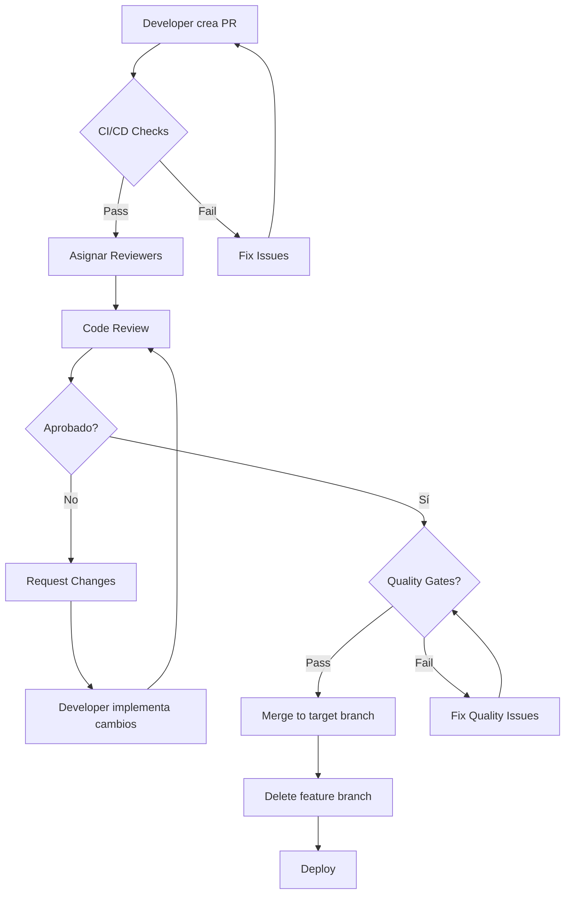

# POLÍTICA 12: CODE REVIEW Y QUALITY GATES

**Versión**: 1.0  
**Última Actualización**: 2025-11-30  
**Estado**: OBLIGATORIO ✅  
**Responsable**: Equipo de Arquitectura CarDealer

---

## 📋 RESUMEN EJECUTIVO

**POLÍTICA CRÍTICA**: Todos los Pull Requests deben pasar por code review obligatorio con al menos 1 aprobación (develop) o 2 aprobaciones (main), Quality Gates automatizados (SonarQube, tests, coverage), y cumplir con estándares de código. PRs que no cumplan los Quality Gates son automáticamente RECHAZADOS.

**Objetivo**: Mantener alta calidad de código, detectar bugs tempranamente, compartir conocimiento entre el equipo, y garantizar que el código cumple con las políticas de arquitectura.

**Alcance**: Aplica a TODOS los Pull Requests en todos los repositorios del ecosistema CarDealer.

---

## 🎯 QUALITY GATES OBLIGATORIOS

### Matriz de Quality Gates

| Quality Gate | Herramienta | Umbral | Bloqueante |
|--------------|-------------|--------|------------|
| **Build Success** | .NET CLI / MSBuild | 100% | ✅ SÍ |
| **Unit Tests** | xUnit | 100% passing | ✅ SÍ |
| **Integration Tests** | xUnit | 100% passing | ✅ SÍ |
| **Code Coverage** | Coverlet | ≥80% | ✅ SÍ |
| **SonarQube Quality Gate** | SonarQube | A | ✅ SÍ |
| **Security Scan** | OWASP Dependency Check | 0 Critical/High | ✅ SÍ |
| **Code Analysis** | Roslyn Analyzers | 0 Errors, <10 Warnings | ✅ SÍ |
| **Performance** | BenchmarkDotNet | No regression >10% | ⚠️ Warning |

---

## 👥 CODE REVIEW PROCESS

### Roles y Responsabilidades

| Rol | Responsabilidad | Aprobaciones Requeridas |
|-----|----------------|-------------------------|
| **Junior Developer** | Crear PR, implementar feedback | - |
| **Senior Developer** | Review code, aprobar (develop) | 1 |
| **Tech Lead** | Review arquitectura, aprobar (main) | 1 (de 2) |
| **Architect** | Review decisiones críticas | 1 (de 2, opcional) |

---

### Workflow de Code Review



---

### Tiempos de Respuesta SLA

| Prioridad | Primera Revisión | Feedback Completo | Aprobación Final |
|-----------|------------------|-------------------|------------------|
| **Critical (Hotfix)** | <2 horas | <4 horas | <8 horas |
| **High (Feature)** | <8 horas | <24 horas | <48 horas |
| **Medium (Refactor)** | <24 horas | <48 horas | <72 horas |
| **Low (Docs)** | <48 horas | <72 horas | <1 semana |

---

## 🔍 CODE REVIEW CHECKLIST

### 1. Arquitectura y Diseño

```markdown
## Arquitectura y Diseño

- [ ] **Clean Architecture**: Código en la capa correcta
  - Controllers en Api layer
  - Commands/Queries en Application layer
  - Entities en Domain layer
  - Repositories en Infrastructure layer

- [ ] **CQRS**: Separación clara de Commands y Queries
  - Commands modifican estado
  - Queries solo leen datos
  - No mixing de responsabilidades

- [ ] **Dependency Injection**: Inyección correcta de dependencias
  - Interfaces en constructors
  - No uso de `new` para servicios
  - Lifetime apropiado (Scoped, Transient, Singleton)

- [ ] **SOLID Principles**:
  - Single Responsibility: Clase con una sola responsabilidad
  - Open/Closed: Extensible sin modificar
  - Liskov Substitution: Subclases intercambiables
  - Interface Segregation: Interfaces específicas
  - Dependency Inversion: Depender de abstracciones

- [ ] **Design Patterns**: Patrones apropiados aplicados
  - Repository Pattern
  - Factory Pattern
  - Strategy Pattern (si aplica)
  - Observer Pattern (eventos de dominio)

- [ ] **Domain-Driven Design**: Conceptos de DDD aplicados
  - Aggregates bien definidos
  - Value Objects usados correctamente
  - Domain Events para comunicación
  - Bounded Contexts respetados
```

---

### 2. Calidad de Código

```markdown
## Calidad de Código

### Naming Conventions
- [ ] Nombres descriptivos y significativos
  - Clases: PascalCase (ErrorService, LogErrorCommand)
  - Métodos: PascalCase (GetById, LogError)
  - Variables: camelCase (errorLog, serviceName)
  - Constantes: PascalCase o UPPER_CASE (MaxRetries, DEFAULT_PAGE_SIZE)
  - Private fields: _camelCase (_repository, _logger)

- [ ] No hay nombres genéricos o abreviaciones
  - ❌ `var d = new Data();` → ✅ `var errorLog = new ErrorLog();`
  - ❌ `Process()` → ✅ `ValidateAndSaveErrorLog()`
  - ❌ `var tmp = ...` → ✅ `var validatedMessage = ...`

### Métodos
- [ ] Métodos pequeños y enfocados (<20 líneas idealmente)
- [ ] Un nivel de abstracción por método
- [ ] Máximo 3-4 parámetros (usar DTOs si necesita más)
- [ ] No hay métodos con side effects ocultos

### Complejidad Ciclomática
- [ ] Complejidad ciclomática <10 por método
- [ ] No hay nested if/loops profundos (máximo 3 niveles)
- [ ] Uso de early returns para reducir anidamiento

### DRY (Don't Repeat Yourself)
- [ ] No hay código duplicado
- [ ] Lógica común extraída a métodos helper
- [ ] Uso de extension methods para funcionalidad repetida

### Comentarios
- [ ] Código auto-documentado (nombres claros)
- [ ] Comentarios solo para lógica compleja o no obvia
- [ ] No hay código comentado (usar git para historial)
- [ ] XML comments en APIs públicas
```

---

### 3. Testing

```markdown
## Testing

### Unit Tests
- [ ] Cobertura ≥80% de líneas de código
- [ ] Tests para casos happy path
- [ ] Tests para casos edge cases
- [ ] Tests para manejo de errores
- [ ] Tests siguen patrón Arrange-Act-Assert
- [ ] Tests son independientes (no dependen de orden)
- [ ] Nombres descriptivos (Should_ReturnError_When_IdNotFound)

### Integration Tests
- [ ] Tests de integración para endpoints críticos
- [ ] Tests de integración con base de datos
- [ ] Tests de integración con RabbitMQ (si aplica)
- [ ] Uso de CustomWebApplicationFactory

### Test Quality
- [ ] No hay tests comentados o deshabilitados sin justificación
- [ ] No hay tests con Thread.Sleep (usar await)
- [ ] Mocks usados apropiadamente (Moq)
- [ ] No hay tests frágiles (dependen de timing)

### Code Coverage
- [ ] Coverage ≥80% en Application layer
- [ ] Coverage ≥70% en Infrastructure layer
- [ ] Coverage ≥60% en Api layer
- [ ] Coverage report generado y verificado
```

---

### 4. Seguridad

```markdown
## Seguridad

### Authentication & Authorization
- [ ] Endpoints protegidos con `[Authorize]`
- [ ] `[AllowAnonymous]` justificado y aprobado
- [ ] JWT authentication implementado
- [ ] Authorization policies correctas

### Input Validation
- [ ] FluentValidation en todos los Commands/Queries
- [ ] Validación de SQL Injection
- [ ] Validación de XSS
- [ ] Validación de tamaño máximo de inputs
- [ ] Validación de formatos (email, phone, etc.)

### Secrets Management
- [ ] No hay secrets hardcodeados
- [ ] No hay contraseñas en código
- [ ] No hay API keys en código
- [ ] Uso de User Secrets (dev) o Key Vault (prod)

### Dependencies
- [ ] No hay vulnerabilidades conocidas en NuGet packages
- [ ] Dependencias actualizadas a versiones seguras
- [ ] OWASP Dependency Check passed

### Data Protection
- [ ] Datos sensibles encriptados (passwords, PII)
- [ ] No hay logs de información sensible
- [ ] HTTPS enforcement configurado
- [ ] CORS restrictivo (no Allow-All)
```

---

### 5. Performance

```markdown
## Performance

### Database
- [ ] No hay queries N+1
- [ ] Índices apropiados en columnas filtradas/ordenadas
- [ ] Paginación implementada en listados
- [ ] Uso de AsNoTracking() para read-only queries
- [ ] Proyecciones para evitar cargar entidades completas

### Async/Await
- [ ] Métodos async/await usados correctamente
- [ ] No hay blocking calls (Task.Result, .Wait())
- [ ] CancellationToken propagado en llamadas async

### Memory
- [ ] IDisposable implementado en clases con recursos
- [ ] Uso de `using` statements para DbContext, HttpClient, etc.
- [ ] No hay memory leaks evidentes
- [ ] Colecciones grandes procesadas en streams

### Caching
- [ ] Caching implementado donde apropiado (IMemoryCache, Redis)
- [ ] Cache invalidation strategy definida
- [ ] TTL apropiado configurado

### HTTP Calls
- [ ] HttpClient inyectado via IHttpClientFactory
- [ ] Timeout configurado
- [ ] Circuit Breaker implementado
- [ ] Retry policies configuradas
```

---

### 6. Observabilidad

```markdown
## Observabilidad

### Logging
- [ ] Logging apropiado con Serilog
- [ ] Niveles de log correctos (Debug, Info, Warning, Error)
- [ ] Structured logging con propiedades
- [ ] TraceId/SpanId incluidos en logs
- [ ] No hay logs de información sensible

### Metrics
- [ ] Métricas apropiadas instrumentadas
- [ ] Counters para operaciones importantes
- [ ] Histograms para duración de operaciones
- [ ] Métricas exportadas a Prometheus

### Tracing
- [ ] OpenTelemetry configurado
- [ ] Spans para operaciones clave
- [ ] Contexto de tracing propagado

### Error Handling
- [ ] Global Exception Middleware configurado
- [ ] Errores manejados apropiadamente
- [ ] Stack traces logueados
- [ ] Errores enviados a ErrorService
```

---

### 7. Resiliencia

```markdown
## Resiliencia

### Polly Policies
- [ ] Circuit Breaker configurado para llamadas externas
- [ ] Retry policies con exponential backoff
- [ ] Timeout policies configuradas
- [ ] Bulkhead isolation (si aplica)

### Error Handling
- [ ] Try-catch apropiados
- [ ] Excepciones custom cuando necesario
- [ ] No hay catch genéricos sin logging
- [ ] Finally blocks para cleanup

### Health Checks
- [ ] Health checks implementados
- [ ] Dependencias verificadas (DB, RabbitMQ)
- [ ] Endpoints /health, /health/ready, /health/live

### Graceful Degradation
- [ ] Fallback strategies implementadas
- [ ] Servicios degradan gracefully ante fallos
```

---

### 8. Documentación

```markdown
## Documentación

### Code Documentation
- [ ] XML comments en controllers públicos
- [ ] XML comments en DTOs
- [ ] Swagger documentation actualizada
- [ ] Ejemplos en Swagger (remarks, examples)

### Project Documentation
- [ ] README.md actualizado (si aplica)
- [ ] CHANGELOG.md actualizado
- [ ] ARCHITECTURE.md actualizado (cambios arquitectónicos)
- [ ] TROUBLESHOOTING.md actualizado (nuevos issues)

### Comments
- [ ] Comentarios útiles para lógica compleja
- [ ] No hay TODOs sin issue asociado
- [ ] No hay código comentado (excepto por razón específica)
```

---

## 🛠️ SONARQUBE QUALITY GATE

### Configuración de SonarQube

```yaml
# sonar-project.properties
sonar.projectKey=cardealer-errorservice
sonar.projectName=ErrorService
sonar.projectVersion=1.0.0

sonar.sources=ErrorService.Api,ErrorService.Application,ErrorService.Domain,ErrorService.Infrastructure
sonar.tests=ErrorService.Tests

# Exclusiones
sonar.exclusions=**/Migrations/**,**/obj/**,**/bin/**
sonar.coverage.exclusions=**/Program.cs,**/Startup.cs

# C# específico
sonar.cs.opencover.reportsPaths=**/coverage.opencover.xml
sonar.cs.vstest.reportsPaths=**/*.trx

# Quality Gate
sonar.qualitygate.wait=true
sonar.qualitygate.timeout=300
```

---

### Quality Gate Metrics

| Métrica | Umbral | Descripción |
|---------|--------|-------------|
| **Reliability Rating** | A | 0 bugs |
| **Security Rating** | A | 0 vulnerabilidades |
| **Maintainability Rating** | A | Technical debt <5% |
| **Coverage** | ≥80% | Cobertura de código |
| **Duplicated Lines** | <3% | Código duplicado |
| **Security Hotspots** | 100% reviewed | Hotspots revisados |
| **Code Smells** | <100 | Violaciones de buenas prácticas |
| **Cognitive Complexity** | <15 per function | Complejidad cognitiva |
| **Cyclomatic Complexity** | <10 per function | Complejidad ciclomática |

---

### Ejecutar SonarQube Localmente

```bash
# 1. Iniciar SonarQube (Docker)
docker run -d --name sonarqube \
  -p 9000:9000 \
  sonarqube:latest

# 2. Instalar SonarScanner
dotnet tool install --global dotnet-sonarscanner

# 3. Ejecutar análisis
dotnet sonarscanner begin \
  /k:"cardealer-errorservice" \
  /d:sonar.host.url="http://localhost:9000" \
  /d:sonar.login="admin" \
  /d:sonar.password="admin" \
  /d:sonar.cs.opencover.reportsPaths="**/coverage.opencover.xml"

# 4. Build
dotnet build

# 5. Tests con coverage
dotnet test \
  /p:CollectCoverage=true \
  /p:CoverletOutputFormat=opencover \
  /p:CoverletOutput=./coverage/

# 6. Finalizar análisis
dotnet sonarscanner end \
  /d:sonar.login="admin" \
  /d:sonar.password="admin"

# 7. Ver resultados
# http://localhost:9000/dashboard?id=cardealer-errorservice
```

---

## 🔒 SECURITY SCAN (OWASP DEPENDENCY CHECK)

### Configuración

```xml
<!-- Directory.Build.props -->
<Project>
  <PropertyGroup>
    <TreatWarningsAsErrors>true</TreatWarningsAsErrors>
    <WarningsAsErrors />
    <NoWarn>$(NoWarn);1591</NoWarn>
    <RunAnalyzersDuringBuild>true</RunAnalyzersDuringBuild>
    <EnableNETAnalyzers>true</EnableNETAnalyzers>
    <AnalysisMode>AllEnabledByDefault</AnalysisMode>
  </PropertyGroup>

  <ItemGroup>
    <!-- Security analyzers -->
    <PackageReference Include="Microsoft.CodeAnalysis.NetAnalyzers" Version="8.0.0">
      <PrivateAssets>all</PrivateAssets>
      <IncludeAssets>runtime; build; native; contentfiles; analyzers</IncludeAssets>
    </PackageReference>
    
    <PackageReference Include="SecurityCodeScan.VS2019" Version="5.6.7">
      <PrivateAssets>all</PrivateAssets>
      <IncludeAssets>runtime; build; native; contentfiles; analyzers</IncludeAssets>
    </PackageReference>
  </ItemGroup>
</Project>
```

---

### Ejecutar OWASP Dependency Check

```bash
# 1. Instalar OWASP Dependency Check
dotnet tool install --global DependencyCheck.Runner.Tool

# 2. Ejecutar scan
dependency-check \
  --project "ErrorService" \
  --scan "." \
  --format "HTML" \
  --format "JSON" \
  --out "./dependency-check-report" \
  --suppression "./dependency-check-suppressions.xml"

# 3. Ver reporte
# ./dependency-check-report/dependency-check-report.html

# 4. Verificar que no hay Critical/High vulnerabilities
# Exit code 1 si encuentra vulnerabilidades
```

---

## 📊 CODE ANALYSIS (ROSLYN ANALYZERS)

### .editorconfig

```ini
# .editorconfig
root = true

[*]
charset = utf-8
indent_style = space
indent_size = 4
insert_final_newline = true
trim_trailing_whitespace = true

[*.cs]
# Naming conventions
dotnet_naming_rule.interfaces_should_be_prefixed_with_i.severity = error
dotnet_naming_rule.interfaces_should_be_prefixed_with_i.symbols = interface
dotnet_naming_rule.interfaces_should_be_prefixed_with_i.style = begins_with_i

# Code style
csharp_prefer_braces = true:error
csharp_prefer_simple_using_statement = true:suggestion
csharp_style_namespace_declarations = file_scoped:warning

# Code quality
dotnet_code_quality.CA1002.severity = warning  # Do not expose generic lists
dotnet_code_quality.CA1062.severity = error    # Validate arguments of public methods
dotnet_code_quality.CA1031.severity = warning  # Do not catch general exception types
dotnet_code_quality.CA2007.severity = none     # Do not await on ConfigureAwait(false)

# Security
dotnet_code_quality.CA3001.severity = error    # SQL injection vulnerability
dotnet_code_quality.CA3003.severity = error    # File path injection
dotnet_code_quality.CA3004.severity = error    # XSS vulnerability
dotnet_code_quality.CA3006.severity = error    # Command injection
dotnet_code_quality.CA3011.severity = error    # DLL injection

# Performance
dotnet_code_quality.CA1806.severity = warning  # Do not ignore method results
dotnet_code_quality.CA1821.severity = warning  # Remove empty finalizers
dotnet_code_quality.CA1822.severity = suggestion # Mark members as static
dotnet_code_quality.CA1825.severity = warning  # Avoid zero-length array allocations
```

---

### Ejecutar Code Analysis

```bash
# Análisis durante build
dotnet build /p:RunAnalyzers=true /p:TreatWarningsAsErrors=true

# Generar reporte de análisis
dotnet build /p:RunAnalyzers=true /fileLogger /fileLoggerParameters:LogFile=build-analysis.log

# Verificar warnings
cat build-analysis.log | grep -i "warning"

# Quality Gate: Máximo 10 warnings permitidos
```

---

## 🚀 CI/CD INTEGRATION

### GitHub Actions Workflow

```yaml
# .github/workflows/pr-validation.yml
name: PR Validation

on:
  pull_request:
    branches: [ develop, main ]

jobs:
  quality-gates:
    runs-on: ubuntu-latest
    
    steps:
    - name: Checkout code
      uses: actions/checkout@v3
      with:
        fetch-depth: 0  # Para SonarQube
    
    - name: Setup .NET
      uses: actions/setup-dotnet@v3
      with:
        dotnet-version: '8.0.x'
    
    - name: Restore dependencies
      run: dotnet restore
    
    - name: Build
      run: dotnet build --no-restore --configuration Release
    
    - name: Run unit tests
      run: |
        dotnet test --no-build --configuration Release \
          --filter "Category=Unit" \
          --logger "trx;LogFileName=unit-tests.trx" \
          /p:CollectCoverage=true \
          /p:CoverletOutputFormat=opencover \
          /p:CoverletOutput=./coverage/unit/
    
    - name: Run integration tests
      run: |
        dotnet test --no-build --configuration Release \
          --filter "Category=Integration" \
          --logger "trx;LogFileName=integration-tests.trx" \
          /p:CollectCoverage=true \
          /p:CoverletOutputFormat=opencover \
          /p:CoverletOutput=./coverage/integration/
    
    - name: Check code coverage
      run: |
        dotnet test /p:CollectCoverage=true /p:Threshold=80 /p:ThresholdType=line
    
    - name: SonarQube Scan
      uses: sonarsource/sonarqube-scan-action@master
      env:
        SONAR_TOKEN: ${{ secrets.SONAR_TOKEN }}
        SONAR_HOST_URL: ${{ secrets.SONAR_HOST_URL }}
    
    - name: SonarQube Quality Gate
      uses: sonarsource/sonarqube-quality-gate-action@master
      timeout-minutes: 5
      env:
        SONAR_TOKEN: ${{ secrets.SONAR_TOKEN }}
    
    - name: OWASP Dependency Check
      run: |
        dotnet tool install --global DependencyCheck.Runner.Tool
        dependency-check --project "ErrorService" --scan "." --format "JSON" --out "./dependency-check"
    
    - name: Check for vulnerabilities
      run: |
        if grep -q '"severity": "CRITICAL"' dependency-check/dependency-check-report.json; then
          echo "Critical vulnerabilities found!"
          exit 1
        fi
    
    - name: Publish test results
      uses: dorny/test-reporter@v1
      if: always()
      with:
        name: Test Results
        path: '**/*.trx'
        reporter: dotnet-trx
    
    - name: Publish coverage report
      uses: codecov/codecov-action@v3
      with:
        files: ./coverage/**/*.opencover.xml
        flags: unittests,integrationtests
        name: codecov-cardealer
```

---

### Azure DevOps Pipeline

```yaml
# azure-pipelines.yml
trigger:
  branches:
    include:
    - develop
    - main

pr:
  branches:
    include:
    - develop
    - main

pool:
  vmImage: 'ubuntu-latest'

variables:
  buildConfiguration: 'Release'
  dotnetVersion: '8.0.x'

stages:
- stage: Build
  jobs:
  - job: BuildAndTest
    steps:
    - task: UseDotNet@2
      displayName: 'Install .NET SDK'
      inputs:
        version: $(dotnetVersion)
    
    - task: DotNetCoreCLI@2
      displayName: 'Restore dependencies'
      inputs:
        command: 'restore'
    
    - task: DotNetCoreCLI@2
      displayName: 'Build'
      inputs:
        command: 'build'
        arguments: '--configuration $(buildConfiguration) --no-restore'
    
    - task: DotNetCoreCLI@2
      displayName: 'Run tests'
      inputs:
        command: 'test'
        arguments: |
          --configuration $(buildConfiguration) 
          --no-build 
          --logger trx 
          /p:CollectCoverage=true 
          /p:CoverletOutputFormat=cobertura 
          /p:CoverletOutput=$(Build.SourcesDirectory)/coverage/
    
    - task: PublishTestResults@2
      displayName: 'Publish test results'
      inputs:
        testResultsFormat: 'VSTest'
        testResultsFiles: '**/*.trx'
    
    - task: PublishCodeCoverageResults@1
      displayName: 'Publish coverage results'
      inputs:
        codeCoverageTool: 'Cobertura'
        summaryFileLocation: '$(Build.SourcesDirectory)/coverage/coverage.cobertura.xml'
    
    - task: SonarQubePrepare@5
      displayName: 'Prepare SonarQube'
      inputs:
        SonarQube: 'SonarQube'
        scannerMode: 'MSBuild'
        projectKey: 'cardealer-errorservice'
        projectName: 'ErrorService'
    
    - task: SonarQubeAnalyze@5
      displayName: 'Run SonarQube analysis'
    
    - task: SonarQubePublish@5
      displayName: 'Publish SonarQube results'
      inputs:
        pollingTimeoutSec: '300'
    
    - task: sonarcloud-buildbreaker@2
      displayName: 'Break build on quality gate failure'
      inputs:
        SonarCloud: 'SonarQube'
```

---

## 📝 CODE REVIEW COMMENTS EXAMPLES

### ✅ Comentarios Constructivos

```markdown
## ✅ BUENOS COMENTARIOS

### Sugerencia de Mejora
> **Suggestion**: Consider extracting this validation logic into a separate method for better readability.
> 
> ```csharp
> // Current
> if (string.IsNullOrEmpty(request.Message) || request.Message.Length > 5000)
> {
>     // validation logic
> }
> 
> // Suggested
> private bool IsValidMessage(string message)
> {
>     return !string.IsNullOrEmpty(message) && message.Length <= 5000;
> }
> ```

### Bug Potencial
> **Issue**: Potential `NullReferenceException` here if `errorLog` is null.
> 
> Line 45: `var serviceName = errorLog.ServiceName;`
> 
> **Fix**: Add null check or use null-conditional operator:
> ```csharp
> var serviceName = errorLog?.ServiceName ?? "Unknown";
> ```

### Performance
> **Performance**: This query will cause N+1 problem. Consider using `Include()`.
> 
> ```csharp
> // Current (N+1)
> var errors = await _context.ErrorLogs.ToListAsync();
> foreach (var error in errors) {
>     var service = await _context.Services.FindAsync(error.ServiceId);
> }
> 
> // Better
> var errors = await _context.ErrorLogs
>     .Include(e => e.Service)
>     .ToListAsync();
> ```

### Security
> **Security Concern**: This input is not validated against SQL injection.
> 
> Please add FluentValidation rule with `SqlInjectionPattern` regex.
> Reference: Policy 08 - Seguridad y Autenticación

### Arquitectura
> **Architecture**: This repository is being called directly from the controller, bypassing the CQRS pattern.
> 
> Please create a `GetErrorByIdQuery` and corresponding handler.
> Reference: Policy 01 - Clean Architecture
```

---

### ❌ Comentarios No Constructivos

```markdown
## ❌ MALOS COMENTARIOS (EVITAR)

# Demasiado vago
"This looks wrong."

# Sin contexto
"Change this."

# Ofensivo
"This is terrible code."

# Sin explicación
"No."

# Perfeccionismo innecesario
"The variable name could be 2 characters shorter for better optimization."

# Sin alternativa
"This approach is bad." (sin sugerir alternativa)
```

---

## 🎯 PR SIZE GUIDELINES

### Tamaño Ideal de PR

| Tamaño | Líneas Cambiadas | Archivos | Tiempo de Review | Recomendación |
|--------|------------------|----------|------------------|---------------|
| **XS** | <50 | <5 | <15 min | ✅ Ideal |
| **S** | 50-200 | 5-10 | 15-30 min | ✅ Bueno |
| **M** | 200-500 | 10-20 | 30-60 min | ⚠️ Aceptable |
| **L** | 500-1000 | 20-40 | 1-2 horas | ⚠️ Considerar dividir |
| **XL** | >1000 | >40 | >2 horas | ❌ Dividir |

---

### Estrategias para PRs Grandes

```markdown
## Dividir PR Grande

### Opción 1: Por Capas
1. PR 1: Domain entities y interfaces
2. PR 2: Application layer (commands/queries)
3. PR 3: Infrastructure implementation
4. PR 4: API controllers
5. PR 5: Tests

### Opción 2: Por Features
1. PR 1: Feature A - Backend
2. PR 2: Feature A - Tests
3. PR 3: Feature A - Documentation

### Opción 3: Por Incrementos
1. PR 1: Basic implementation
2. PR 2: Add validation
3. PR 3: Add error handling
4. PR 4: Add tests
5. PR 5: Add documentation

## Feature Flags para Features Grandes
- Implementar feature behind feature flag
- Deploy código disabled
- Habilitar cuando feature completa
```

---

## ✅ CHECKLIST COMPLETO DE QUALITY GATES

### Pre-Review (Autor del PR)

```markdown
## Pre-Review Checklist

### Código
- [ ] Build exitoso localmente
- [ ] Todos los tests pasan localmente
- [ ] Code coverage ≥80%
- [ ] No hay warnings de compilación
- [ ] Código formateado (`dotnet format`)
- [ ] No hay código comentado o debug logs
- [ ] No hay TODOs sin issue

### Git
- [ ] Commits siguen Conventional Commits
- [ ] Branch actualizado con target branch
- [ ] No hay merge conflicts
- [ ] Historial de commits limpio

### Testing
- [ ] Tests unitarios agregados/actualizados
- [ ] Tests de integración agregados (si aplica)
- [ ] E2E tests actualizados (si aplica)
- [ ] Tests son independientes y reproducibles

### Documentación
- [ ] XML comments en código público
- [ ] README actualizado (si aplica)
- [ ] CHANGELOG.md actualizado
- [ ] Swagger actualizado
- [ ] PR description completa

### Quality Gates Automatizados
- [ ] SonarQube Quality Gate: PASSED
- [ ] Code coverage: ≥80%
- [ ] Security scan: 0 Critical/High
- [ ] Build: SUCCESS
- [ ] Tests: 100% passing
```

---

### During Review (Reviewer)

```markdown
## Code Review Checklist

### Primera Pasada (5 min)
- [ ] PR size apropiado (<500 líneas)
- [ ] PR description clara
- [ ] Commits organizados
- [ ] CI/CD checks passed

### Segunda Pasada (15-30 min)
- [ ] Arquitectura correcta (Clean Architecture + CQRS)
- [ ] SOLID principles aplicados
- [ ] No hay código duplicado
- [ ] Naming conventions correctas
- [ ] Métodos pequeños y enfocados

### Tercera Pasada (15-30 min)
- [ ] Tests completos y de calidad
- [ ] Security: Input validation, auth, no secrets
- [ ] Performance: No N+1, async/await correcto
- [ ] Observability: Logging, metrics, tracing
- [ ] Resiliencia: Circuit breaker, retry, timeout

### Cuarta Pasada (10-15 min)
- [ ] Documentación actualizada
- [ ] Error handling apropiado
- [ ] Edge cases considerados
- [ ] Database migrations correctas (si aplica)
```

---

### Post-Merge

```markdown
## Post-Merge Checklist

### Verificación
- [ ] Build en CI/CD exitoso
- [ ] Tests en CI/CD pasando
- [ ] Deploy a ambiente de staging exitoso
- [ ] Smoke tests en staging pasando

### Cleanup
- [ ] Feature branch eliminado
- [ ] CHANGELOG.md actualizado en target branch
- [ ] Documentation deployada (si aplica)

### Comunicación
- [ ] Equipo notificado del merge
- [ ] Issue/ticket actualizado
- [ ] Stakeholders informados (si aplica)
```

---

## 🚫 ANTI-PATRONES DE CODE REVIEW

### ❌ PROHIBIDO

```markdown
## Anti-Patrones del Autor

❌ Crear PR gigante (>1000 líneas)
❌ "WIP" PR sin marcar como Draft
❌ PR sin descripción o con "changes"
❌ Pushear código que no compila
❌ Ignorar feedback del reviewer
❌ Forzar merge sin aprobaciones
❌ No actualizar tests
❌ Dejar TODOs sin issue

## Anti-Patrones del Reviewer

❌ Aprobar sin leer código
❌ Aprobar solo mirando files changed count
❌ Comentarios vagos sin contexto
❌ Nitpicking sin importancia
❌ Bloquear PR por preferencias personales
❌ No dar feedback constructivo
❌ Ignorar PR por días/semanas
❌ Aprobar "porque ya pasó CI/CD"
```

---

## 📚 RECURSOS Y REFERENCIAS

- **SonarQube**: [https://www.sonarqube.org/](https://www.sonarqube.org/)
- **OWASP Dependency Check**: [https://owasp.org/www-project-dependency-check/](https://owasp.org/www-project-dependency-check/)
- **Coverlet**: [https://github.com/coverlet-coverage/coverlet](https://github.com/coverlet-coverage/coverlet)
- **Code Review Best Practices**: [Google Engineering Practices](https://google.github.io/eng-practices/review/)
- **Roslyn Analyzers**: [Microsoft Docs](https://docs.microsoft.com/en-us/dotnet/fundamentals/code-analysis/overview)

---

**Fecha de Vigencia**: 2025-11-30  
**Aprobado por**: Equipo de Arquitectura CarDealer  
**Revisión**: Trimestral

**NOTA**: Quality Gates son NO NEGOCIABLES. PRs que no cumplan con SonarQube Quality Gate o coverage <80% son automáticamente RECHAZADOS sin excepción.
