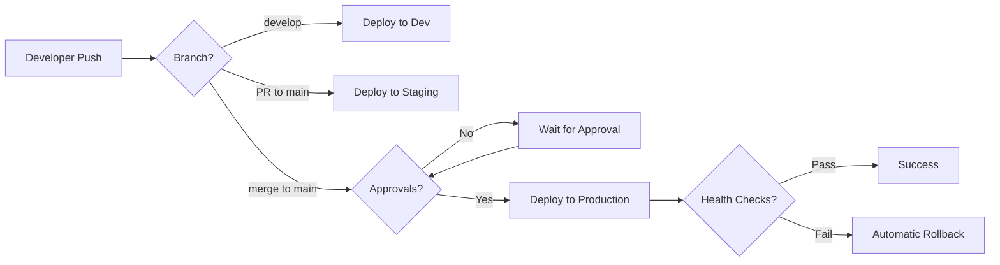

# POLÍTICA 13: DEPLOYMENT Y CI/CD

**Versión**: 1.0  
**Última Actualización**: 2025-11-30  
**Estado**: OBLIGATORIO ✅  
**Responsable**: Equipo de Arquitectura CarDealer

---

## 📋 RESUMEN EJECUTIVO

**POLÍTICA CRÍTICA**: Todos los microservicios deben implementar CI/CD completo con pipelines automatizados para build, test, quality gates, security scan, containerización, y deployment multi-ambiente (Development, Staging, Production). Los deployments manuales están PROHIBIDOS en Production.

**Objetivo**: Garantizar deployments rápidos, seguros, y consistentes; reducir errores humanos; y permitir rollbacks automáticos ante fallos.

**Alcance**: Aplica a TODOS los microservicios del ecosistema CarDealer.

---

## 🎯 ESTRATEGIA DE DEPLOYMENT

### Ambientes Obligatorios

| Ambiente | Propósito | Deployment | Aprobación | Rollback |
|----------|-----------|------------|------------|----------|
| **Development** | Testing de desarrollo | Auto (commit a `develop`) | ❌ No | Manual |
| **Staging** | Testing pre-producción | Auto (PR a `main`) | ❌ No | Manual |
| **Production** | Usuarios finales | Auto (merge a `main`) | ✅ Sí | Automático |

---

### Deployment Strategy



---

## 🚀 CI/CD PIPELINE STAGES

### Pipeline Completo

```yaml
Stages:
  1. Source Control        # Git checkout, versioning
  2. Build                 # Compile, restore dependencies
  3. Unit Tests            # Fast tests (<1 min)
  4. Code Analysis         # Roslyn, SonarQube
  5. Security Scan         # OWASP Dependency Check
  6. Integration Tests     # Database, messaging tests
  7. Code Coverage         # Coverlet (≥80%)
  8. Quality Gate          # SonarQube gate
  9. Docker Build          # Create container image
  10. Docker Push          # Push to registry
  11. Deploy to Dev        # Automatic
  12. Smoke Tests Dev      # Basic validation
  13. Deploy to Staging    # Automatic (PR)
  14. E2E Tests Staging    # Full test suite
  15. Manual Approval      # Tech Lead approval
  16. Deploy to Production # Blue-Green deployment
  17. Health Checks Prod   # Liveness/Readiness
  18. Smoke Tests Prod     # Basic validation
  19. Monitor Metrics      # 15 min observation
  20. Rollback (if fail)   # Automatic
```

---

## 🔨 STAGE 1-8: BUILD & QUALITY GATES

### GitHub Actions - Build Pipeline

```yaml
# .github/workflows/build.yml
name: Build and Quality Gates

on:
  push:
    branches: [ develop, main ]
  pull_request:
    branches: [ develop, main ]

env:
  DOTNET_VERSION: '8.0.x'
  SONAR_PROJECT_KEY: 'cardealer-errorservice'

jobs:
  build-and-test:
    runs-on: ubuntu-latest
    
    steps:
    # 1. SOURCE CONTROL
    - name: Checkout code
      uses: actions/checkout@v4
      with:
        fetch-depth: 0  # Full history for SonarQube
    
    - name: Setup .NET
      uses: actions/setup-dotnet@v4
      with:
        dotnet-version: ${{ env.DOTNET_VERSION }}
    
    # 2. BUILD
    - name: Restore dependencies
      run: dotnet restore
    
    - name: Build
      run: |
        dotnet build \
          --configuration Release \
          --no-restore \
          /p:TreatWarningsAsErrors=true
    
    # 3. UNIT TESTS
    - name: Run unit tests
      run: |
        dotnet test \
          --configuration Release \
          --no-build \
          --filter "Category=Unit" \
          --logger "trx;LogFileName=unit-tests.trx" \
          /p:CollectCoverage=true \
          /p:CoverletOutputFormat=opencover \
          /p:CoverletOutput=./coverage/unit/
    
    # 4. CODE ANALYSIS
    - name: Install SonarScanner
      run: dotnet tool install --global dotnet-sonarscanner
    
    - name: SonarQube Begin
      env:
        SONAR_TOKEN: ${{ secrets.SONAR_TOKEN }}
      run: |
        dotnet sonarscanner begin \
          /k:"${{ env.SONAR_PROJECT_KEY }}" \
          /o:"cardealer" \
          /d:sonar.host.url="https://sonarcloud.io" \
          /d:sonar.login="${{ secrets.SONAR_TOKEN }}" \
          /d:sonar.cs.opencover.reportsPaths="**/coverage/**/*.opencover.xml"
    
    # 5. SECURITY SCAN
    - name: OWASP Dependency Check
      uses: dependency-check/Dependency-Check_Action@main
      with:
        project: 'ErrorService'
        path: '.'
        format: 'HTML'
        failOnCVSS: 7
    
    - name: Upload OWASP report
      uses: actions/upload-artifact@v4
      with:
        name: dependency-check-report
        path: dependency-check-report.html
    
    # 6. INTEGRATION TESTS
    - name: Start test infrastructure
      run: |
        docker-compose -f docker-compose.test.yml up -d
        sleep 10  # Wait for services
    
    - name: Run integration tests
      run: |
        dotnet test \
          --configuration Release \
          --no-build \
          --filter "Category=Integration" \
          --logger "trx;LogFileName=integration-tests.trx" \
          /p:CollectCoverage=true \
          /p:CoverletOutputFormat=opencover \
          /p:CoverletOutput=./coverage/integration/
    
    - name: Stop test infrastructure
      if: always()
      run: docker-compose -f docker-compose.test.yml down
    
    # 7. CODE COVERAGE
    - name: Generate coverage report
      run: |
        dotnet tool install --global dotnet-reportgenerator-globaltool
        reportgenerator \
          -reports:"./coverage/**/*.opencover.xml" \
          -targetdir:"./coverage-report" \
          -reporttypes:"Html;Cobertura"
    
    - name: Check coverage threshold
      run: |
        dotnet test \
          /p:CollectCoverage=true \
          /p:Threshold=80 \
          /p:ThresholdType=line \
          /p:ThresholdStat=total
    
    - name: Upload coverage to Codecov
      uses: codecov/codecov-action@v4
      with:
        files: ./coverage-report/Cobertura.xml
        flags: unittests,integrationtests
        name: codecov-errorservice
    
    # 8. QUALITY GATE
    - name: SonarQube End
      env:
        SONAR_TOKEN: ${{ secrets.SONAR_TOKEN }}
      run: dotnet sonarscanner end /d:sonar.login="${{ secrets.SONAR_TOKEN }}"
    
    - name: SonarQube Quality Gate Check
      uses: sonarsource/sonarqube-quality-gate-action@master
      timeout-minutes: 5
      env:
        SONAR_TOKEN: ${{ secrets.SONAR_TOKEN }}
      with:
        scanMetadataReportFile: .sonarqube/out/.sonar/report-task.txt
    
    # Publish artifacts
    - name: Publish test results
      uses: dorny/test-reporter@v1
      if: always()
      with:
        name: Test Results
        path: '**/*.trx'
        reporter: dotnet-trx
    
    - name: Publish coverage report
      uses: actions/upload-artifact@v4
      with:
        name: coverage-report
        path: coverage-report/
```

---

## 🐳 STAGE 9-10: DOCKER BUILD & PUSH

### Dockerfile Multi-Stage

```dockerfile
# Dockerfile
# Stage 1: Build
FROM mcr.microsoft.com/dotnet/sdk:8.0 AS build
WORKDIR /src

# Copy csproj and restore
COPY ["ErrorService.Api/ErrorService.Api.csproj", "ErrorService.Api/"]
COPY ["ErrorService.Application/ErrorService.Application.csproj", "ErrorService.Application/"]
COPY ["ErrorService.Domain/ErrorService.Domain.csproj", "ErrorService.Domain/"]
COPY ["ErrorService.Infrastructure/ErrorService.Infrastructure.csproj", "ErrorService.Infrastructure/"]
COPY ["ErrorService.Shared/ErrorService.Shared.csproj", "ErrorService.Shared/"]

RUN dotnet restore "ErrorService.Api/ErrorService.Api.csproj"

# Copy source code
COPY . .

# Build
WORKDIR "/src/ErrorService.Api"
RUN dotnet build "ErrorService.Api.csproj" -c Release -o /app/build

# Stage 2: Publish
FROM build AS publish
RUN dotnet publish "ErrorService.Api.csproj" -c Release -o /app/publish /p:UseAppHost=false

# Stage 3: Runtime
FROM mcr.microsoft.com/dotnet/aspnet:8.0 AS final
WORKDIR /app

# Create non-root user
RUN groupadd -r appuser && useradd -r -g appuser appuser

# Copy published files
COPY --from=publish /app/publish .

# Change ownership
RUN chown -R appuser:appuser /app

# Switch to non-root user
USER appuser

# Expose ports
EXPOSE 8080
EXPOSE 8081

# Health check
HEALTHCHECK --interval=30s --timeout=3s --start-period=10s --retries=3 \
  CMD curl --fail http://localhost:8080/health || exit 1

# Entry point
ENTRYPOINT ["dotnet", "ErrorService.Api.dll"]
```

---

### Docker Build & Push Pipeline

```yaml
# .github/workflows/docker.yml
name: Docker Build and Push

on:
  push:
    branches: [ develop, main ]
  release:
    types: [ published ]

env:
  REGISTRY: ghcr.io
  IMAGE_NAME: ${{ github.repository }}/errorservice

jobs:
  docker:
    runs-on: ubuntu-latest
    permissions:
      contents: read
      packages: write
    
    steps:
    - name: Checkout code
      uses: actions/checkout@v4
    
    - name: Set up Docker Buildx
      uses: docker/setup-buildx-action@v3
    
    - name: Log in to Container Registry
      uses: docker/login-action@v3
      with:
        registry: ${{ env.REGISTRY }}
        username: ${{ github.actor }}
        password: ${{ secrets.GITHUB_TOKEN }}
    
    - name: Extract metadata
      id: meta
      uses: docker/metadata-action@v5
      with:
        images: ${{ env.REGISTRY }}/${{ env.IMAGE_NAME }}
        tags: |
          type=ref,event=branch
          type=ref,event=pr
          type=semver,pattern={{version}}
          type=semver,pattern={{major}}.{{minor}}
          type=sha,prefix={{branch}}-
          type=raw,value=latest,enable={{is_default_branch}}
    
    - name: Build and push Docker image
      uses: docker/build-push-action@v5
      with:
        context: .
        file: ./ErrorService.Api/Dockerfile
        push: true
        tags: ${{ steps.meta.outputs.tags }}
        labels: ${{ steps.meta.outputs.labels }}
        cache-from: type=gha
        cache-to: type=gha,mode=max
        build-args: |
          BUILD_DATE=${{ github.event.head_commit.timestamp }}
          VCS_REF=${{ github.sha }}
          VERSION=${{ steps.meta.outputs.version }}
    
    - name: Scan image for vulnerabilities
      uses: aquasecurity/trivy-action@master
      with:
        image-ref: ${{ env.REGISTRY }}/${{ env.IMAGE_NAME }}:${{ steps.meta.outputs.version }}
        format: 'sarif'
        output: 'trivy-results.sarif'
        severity: 'CRITICAL,HIGH'
    
    - name: Upload Trivy results
      uses: github/codeql-action/upload-sarif@v3
      with:
        sarif_file: 'trivy-results.sarif'
```

---

## 🌍 STAGE 11-14: DEPLOY TO DEV & STAGING

### Kubernetes Manifests

#### ConfigMap

```yaml
# k8s/configmap.yaml
apiVersion: v1
kind: ConfigMap
metadata:
  name: errorservice-config
  namespace: cardealer
data:
  ASPNETCORE_ENVIRONMENT: "Production"
  ASPNETCORE_URLS: "http://+:8080"
  
  # Logging
  Serilog__MinimumLevel__Default: "Information"
  Serilog__MinimumLevel__Override__Microsoft: "Warning"
  Serilog__MinimumLevel__Override__System: "Warning"
  
  # OpenTelemetry
  OpenTelemetry__Jaeger__AgentHost: "jaeger-agent.observability.svc.cluster.local"
  OpenTelemetry__Jaeger__AgentPort: "6831"
  
  # RabbitMQ
  RabbitMQ__Host: "rabbitmq.messaging.svc.cluster.local"
  RabbitMQ__Port: "5672"
  RabbitMQ__Username: "errorservice"
```

#### Secret

```yaml
# k8s/secret.yaml
apiVersion: v1
kind: Secret
metadata:
  name: errorservice-secret
  namespace: cardealer
type: Opaque
stringData:
  # PostgreSQL
  ConnectionStrings__DefaultConnection: "Host=postgres.database.svc.cluster.local;Port=5432;Database=errorservice;Username=errorservice;Password=REPLACE_ME"
  
  # JWT
  Jwt__SecretKey: "REPLACE_WITH_SECURE_KEY_MIN_32_CHARS"
  
  # RabbitMQ
  RabbitMQ__Password: "REPLACE_ME"
```

#### Deployment

```yaml
# k8s/deployment.yaml
apiVersion: apps/v1
kind: Deployment
metadata:
  name: errorservice
  namespace: cardealer
  labels:
    app: errorservice
    version: v1
spec:
  replicas: 3
  strategy:
    type: RollingUpdate
    rollingUpdate:
      maxSurge: 1
      maxUnavailable: 0
  selector:
    matchLabels:
      app: errorservice
  template:
    metadata:
      labels:
        app: errorservice
        version: v1
      annotations:
        prometheus.io/scrape: "true"
        prometheus.io/port: "8080"
        prometheus.io/path: "/metrics"
    spec:
      serviceAccountName: errorservice
      
      # Init container for migrations
      initContainers:
      - name: migrations
        image: ghcr.io/cardealer/errorservice:latest
        command: ["dotnet", "ef", "database", "update"]
        envFrom:
        - configMapRef:
            name: errorservice-config
        - secretRef:
            name: errorservice-secret
      
      containers:
      - name: errorservice
        image: ghcr.io/cardealer/errorservice:latest
        imagePullPolicy: Always
        
        ports:
        - name: http
          containerPort: 8080
          protocol: TCP
        
        envFrom:
        - configMapRef:
            name: errorservice-config
        - secretRef:
            name: errorservice-secret
        
        resources:
          requests:
            memory: "256Mi"
            cpu: "250m"
          limits:
            memory: "512Mi"
            cpu: "500m"
        
        livenessProbe:
          httpGet:
            path: /health/live
            port: 8080
          initialDelaySeconds: 30
          periodSeconds: 10
          timeoutSeconds: 3
          failureThreshold: 3
        
        readinessProbe:
          httpGet:
            path: /health/ready
            port: 8080
          initialDelaySeconds: 10
          periodSeconds: 5
          timeoutSeconds: 3
          failureThreshold: 3
        
        startupProbe:
          httpGet:
            path: /health/live
            port: 8080
          initialDelaySeconds: 0
          periodSeconds: 5
          timeoutSeconds: 3
          failureThreshold: 30
        
        securityContext:
          runAsNonRoot: true
          runAsUser: 1000
          allowPrivilegeEscalation: false
          capabilities:
            drop:
            - ALL
          readOnlyRootFilesystem: true
        
        volumeMounts:
        - name: tmp
          mountPath: /tmp
      
      volumes:
      - name: tmp
        emptyDir: {}
      
      affinity:
        podAntiAffinity:
          preferredDuringSchedulingIgnoredDuringExecution:
          - weight: 100
            podAffinityTerm:
              labelSelector:
                matchExpressions:
                - key: app
                  operator: In
                  values:
                  - errorservice
              topologyKey: kubernetes.io/hostname
```

#### Service

```yaml
# k8s/service.yaml
apiVersion: v1
kind: Service
metadata:
  name: errorservice
  namespace: cardealer
  labels:
    app: errorservice
spec:
  type: ClusterIP
  ports:
  - port: 80
    targetPort: 8080
    protocol: TCP
    name: http
  selector:
    app: errorservice
```

#### HorizontalPodAutoscaler

```yaml
# k8s/hpa.yaml
apiVersion: autoscaling/v2
kind: HorizontalPodAutoscaler
metadata:
  name: errorservice
  namespace: cardealer
spec:
  scaleTargetRef:
    apiVersion: apps/v1
    kind: Deployment
    name: errorservice
  minReplicas: 3
  maxReplicas: 10
  metrics:
  - type: Resource
    resource:
      name: cpu
      target:
        type: Utilization
        averageUtilization: 70
  - type: Resource
    resource:
      name: memory
      target:
        type: Utilization
        averageUtilization: 80
  behavior:
    scaleUp:
      stabilizationWindowSeconds: 60
      policies:
      - type: Percent
        value: 50
        periodSeconds: 60
    scaleDown:
      stabilizationWindowSeconds: 300
      policies:
      - type: Percent
        value: 10
        periodSeconds: 60
```

---

### Deploy Pipeline

```yaml
# .github/workflows/deploy.yml
name: Deploy to Environments

on:
  push:
    branches: [ develop, main ]
  workflow_dispatch:
    inputs:
      environment:
        description: 'Environment to deploy'
        required: true
        type: choice
        options:
        - development
        - staging
        - production

jobs:
  deploy-dev:
    if: github.ref == 'refs/heads/develop'
    runs-on: ubuntu-latest
    environment: development
    
    steps:
    - name: Checkout code
      uses: actions/checkout@v4
    
    - name: Configure kubectl
      uses: azure/k8s-set-context@v3
      with:
        method: kubeconfig
        kubeconfig: ${{ secrets.KUBE_CONFIG_DEV }}
    
    - name: Deploy to Development
      run: |
        kubectl apply -f k8s/namespace.yaml
        kubectl apply -f k8s/configmap-dev.yaml
        kubectl apply -f k8s/secret-dev.yaml
        kubectl apply -f k8s/deployment.yaml
        kubectl apply -f k8s/service.yaml
        kubectl apply -f k8s/hpa.yaml
        
        # Wait for rollout
        kubectl rollout status deployment/errorservice -n cardealer --timeout=5m
    
    - name: Run smoke tests
      run: |
        # Wait for service to be ready
        sleep 30
        
        # Get service URL
        SERVICE_URL=$(kubectl get svc errorservice -n cardealer -o jsonpath='{.status.loadBalancer.ingress[0].ip}')
        
        # Health check
        curl -f http://$SERVICE_URL/health || exit 1
        
        # API check
        curl -f http://$SERVICE_URL/api/errors || exit 1
  
  deploy-staging:
    if: github.ref == 'refs/heads/main' || github.event.inputs.environment == 'staging'
    runs-on: ubuntu-latest
    environment: staging
    
    steps:
    - name: Checkout code
      uses: actions/checkout@v4
    
    - name: Configure kubectl
      uses: azure/k8s-set-context@v3
      with:
        method: kubeconfig
        kubeconfig: ${{ secrets.KUBE_CONFIG_STAGING }}
    
    - name: Deploy to Staging
      run: |
        kubectl apply -f k8s/namespace.yaml
        kubectl apply -f k8s/configmap-staging.yaml
        kubectl apply -f k8s/secret-staging.yaml
        kubectl apply -f k8s/deployment.yaml
        kubectl apply -f k8s/service.yaml
        kubectl apply -f k8s/hpa.yaml
        
        kubectl rollout status deployment/errorservice -n cardealer --timeout=5m
    
    - name: Run E2E tests
      run: |
        sleep 30
        
        # Install dependencies
        npm install -g newman
        
        # Run Postman collection
        newman run tests/e2e/ErrorService.postman_collection.json \
          --environment tests/e2e/staging.postman_environment.json \
          --reporters cli,junit \
          --reporter-junit-export ./newman-results.xml
    
    - name: Upload E2E results
      uses: actions/upload-artifact@v4
      if: always()
      with:
        name: e2e-test-results
        path: newman-results.xml

  deploy-production:
    if: github.ref == 'refs/heads/main' || github.event.inputs.environment == 'production'
    needs: deploy-staging
    runs-on: ubuntu-latest
    environment: production
    
    steps:
    - name: Checkout code
      uses: actions/checkout@v4
    
    - name: Configure kubectl
      uses: azure/k8s-set-context@v3
      with:
        method: kubeconfig
        kubeconfig: ${{ secrets.KUBE_CONFIG_PROD }}
    
    - name: Blue-Green Deployment
      run: |
        # Deploy green version
        kubectl apply -f k8s/namespace.yaml
        kubectl apply -f k8s/configmap-prod.yaml
        kubectl apply -f k8s/secret-prod.yaml
        
        # Create green deployment
        cat k8s/deployment.yaml | sed 's/version: v1/version: v2/g' | \
          sed 's/name: errorservice/name: errorservice-green/g' | \
          kubectl apply -f -
        
        # Wait for green to be ready
        kubectl rollout status deployment/errorservice-green -n cardealer --timeout=5m
        
        # Run health checks on green
        kubectl run smoke-test --rm -i --restart=Never --image=curlimages/curl -- \
          curl -f http://errorservice-green.cardealer.svc.cluster.local/health
        
        # Switch traffic to green
        kubectl patch service errorservice -n cardealer \
          -p '{"spec":{"selector":{"version":"v2"}}}'
        
        # Wait and monitor
        sleep 60
        
        # Check error rate
        ERROR_RATE=$(kubectl logs -l app=errorservice,version=v2 -n cardealer --tail=100 | \
          grep "ERROR" | wc -l)
        
        if [ $ERROR_RATE -gt 10 ]; then
          echo "High error rate detected! Rolling back..."
          kubectl patch service errorservice -n cardealer \
            -p '{"spec":{"selector":{"version":"v1"}}}'
          exit 1
        fi
        
        # Delete blue deployment
        kubectl delete deployment errorservice -n cardealer || true
        
        # Rename green to blue
        kubectl patch deployment errorservice-green -n cardealer \
          --type merge -p '{"metadata":{"name":"errorservice"}}'
    
    - name: Notify deployment
      uses: 8398a7/action-slack@v3
      with:
        status: ${{ job.status }}
        text: 'ErrorService deployed to Production'
        webhook_url: ${{ secrets.SLACK_WEBHOOK }}
      if: always()
```

---

## 🔄 ROLLBACK STRATEGY

### Automatic Rollback

```yaml
# k8s/rollback-monitor.yaml
apiVersion: batch/v1
kind: CronJob
metadata:
  name: errorservice-rollback-monitor
  namespace: cardealer
spec:
  schedule: "*/5 * * * *"  # Every 5 minutes
  jobTemplate:
    spec:
      template:
        spec:
          containers:
          - name: rollback-monitor
            image: bitnami/kubectl:latest
            command:
            - /bin/bash
            - -c
            - |
              # Check error rate
              ERROR_RATE=$(kubectl logs -l app=errorservice -n cardealer --tail=1000 | \
                grep "ERROR" | wc -l)
              
              # Check if error rate > threshold
              if [ $ERROR_RATE -gt 50 ]; then
                echo "High error rate ($ERROR_RATE). Initiating rollback..."
                
                # Rollback to previous version
                kubectl rollout undo deployment/errorservice -n cardealer
                
                # Notify team
                curl -X POST $SLACK_WEBHOOK \
                  -H 'Content-Type: application/json' \
                  -d '{"text":"🚨 Auto-rollback triggered for ErrorService due to high error rate"}'
              fi
          restartPolicy: OnFailure
```

---

### Manual Rollback

```bash
# Ver historial de deployments
kubectl rollout history deployment/errorservice -n cardealer

# Rollback a versión anterior
kubectl rollout undo deployment/errorservice -n cardealer

# Rollback a versión específica
kubectl rollout undo deployment/errorservice -n cardealer --to-revision=3

# Ver estado de rollback
kubectl rollout status deployment/errorservice -n cardealer

# Pausar rollout
kubectl rollout pause deployment/errorservice -n cardealer

# Reanudar rollout
kubectl rollout resume deployment/errorservice -n cardealer
```

---

## 📊 MONITORING POST-DEPLOYMENT

### Smoke Tests Script

```bash
#!/bin/bash
# scripts/smoke-test.sh

set -e

SERVICE_URL=$1

if [ -z "$SERVICE_URL" ]; then
  echo "Usage: $0 <service-url>"
  exit 1
fi

echo "Running smoke tests against $SERVICE_URL..."

# 1. Health check
echo "✓ Testing /health endpoint..."
curl -f "$SERVICE_URL/health" || exit 1

# 2. Readiness check
echo "✓ Testing /health/ready endpoint..."
curl -f "$SERVICE_URL/health/ready" || exit 1

# 3. Liveness check
echo "✓ Testing /health/live endpoint..."
curl -f "$SERVICE_URL/health/live" || exit 1

# 4. Metrics endpoint
echo "✓ Testing /metrics endpoint..."
curl -f "$SERVICE_URL/metrics" || exit 1

# 5. API endpoint (requires auth)
echo "✓ Testing /api/errors endpoint..."
curl -f -H "Authorization: Bearer $AUTH_TOKEN" \
  "$SERVICE_URL/api/errors?pageNumber=1&pageSize=10" || exit 1

# 6. Swagger documentation
echo "✓ Testing /swagger endpoint..."
curl -f "$SERVICE_URL/swagger/index.html" || exit 1

echo "✅ All smoke tests passed!"
```

---

### Metrics Monitoring

```yaml
# k8s/servicemonitor.yaml
apiVersion: monitoring.coreos.com/v1
kind: ServiceMonitor
metadata:
  name: errorservice
  namespace: cardealer
spec:
  selector:
    matchLabels:
      app: errorservice
  endpoints:
  - port: http
    path: /metrics
    interval: 30s
    scrapeTimeout: 10s
```

---

### Alerting Rules

```yaml
# k8s/prometheusrule.yaml
apiVersion: monitoring.coreos.com/v1
kind: PrometheusRule
metadata:
  name: errorservice-alerts
  namespace: cardealer
spec:
  groups:
  - name: errorservice
    interval: 30s
    rules:
    # High error rate
    - alert: HighErrorRate
      expr: |
        rate(errorservice_errors_total[5m]) > 10
      for: 5m
      labels:
        severity: critical
      annotations:
        summary: "High error rate in ErrorService"
        description: "ErrorService has {{ $value }} errors/sec"
    
    # High response time
    - alert: HighResponseTime
      expr: |
        histogram_quantile(0.95, 
          rate(errorservice_http_request_duration_seconds_bucket[5m])
        ) > 1
      for: 5m
      labels:
        severity: warning
      annotations:
        summary: "High response time in ErrorService"
        description: "95th percentile response time is {{ $value }}s"
    
    # Low availability
    - alert: ServiceDown
      expr: |
        up{job="errorservice"} == 0
      for: 1m
      labels:
        severity: critical
      annotations:
        summary: "ErrorService is down"
        description: "ErrorService has been down for more than 1 minute"
    
    # High memory usage
    - alert: HighMemoryUsage
      expr: |
        container_memory_usage_bytes{pod=~"errorservice-.*"} / 
        container_spec_memory_limit_bytes{pod=~"errorservice-.*"} > 0.9
      for: 5m
      labels:
        severity: warning
      annotations:
        summary: "High memory usage in ErrorService"
        description: "Memory usage is {{ $value }}%"
    
    # Pod not ready
    - alert: PodNotReady
      expr: |
        kube_pod_status_ready{pod=~"errorservice-.*", condition="false"} == 1
      for: 5m
      labels:
        severity: warning
      annotations:
        summary: "ErrorService pod not ready"
        description: "Pod {{ $labels.pod }} is not ready"
```

---

## 🔐 SECRETS MANAGEMENT

### Sealed Secrets (Kubernetes)

```bash
# Instalar Sealed Secrets controller
kubectl apply -f https://github.com/bitnami-labs/sealed-secrets/releases/download/v0.24.0/controller.yaml

# Instalar kubeseal CLI
wget https://github.com/bitnami-labs/sealed-secrets/releases/download/v0.24.0/kubeseal-linux-amd64
sudo install -m 755 kubeseal-linux-amd64 /usr/local/bin/kubeseal

# Crear secret
kubectl create secret generic errorservice-secret \
  --from-literal=Jwt__SecretKey="your-secret-key" \
  --from-literal=ConnectionStrings__DefaultConnection="Host=..." \
  --dry-run=client -o yaml > secret.yaml

# Sellar secret
kubeseal -f secret.yaml -w sealed-secret.yaml

# Aplicar sealed secret (seguro commitearlo)
kubectl apply -f sealed-secret.yaml
```

---

### External Secrets Operator (Azure Key Vault)

```yaml
# k8s/externalsecret.yaml
apiVersion: external-secrets.io/v1beta1
kind: ExternalSecret
metadata:
  name: errorservice-secret
  namespace: cardealer
spec:
  secretStoreRef:
    name: azure-keyvault
    kind: SecretStore
  
  target:
    name: errorservice-secret
    creationPolicy: Owner
  
  data:
  - secretKey: Jwt__SecretKey
    remoteRef:
      key: errorservice-jwt-secret
  
  - secretKey: ConnectionStrings__DefaultConnection
    remoteRef:
      key: errorservice-db-connection
  
  - secretKey: RabbitMQ__Password
    remoteRef:
      key: errorservice-rabbitmq-password
```

---

## 📋 DEPLOYMENT CHECKLIST

### Pre-Deployment

```markdown
## Pre-Deployment Checklist

### Code
- [ ] All PRs merged to target branch
- [ ] All CI/CD checks passing
- [ ] SonarQube Quality Gate: PASSED
- [ ] Code coverage ≥80%
- [ ] No critical/high vulnerabilities

### Infrastructure
- [ ] Database migrations ready
- [ ] ConfigMaps updated
- [ ] Secrets configured
- [ ] Resource limits verified
- [ ] Health checks configured

### Monitoring
- [ ] Prometheus metrics configured
- [ ] Grafana dashboards created
- [ ] Alerts configured
- [ ] Logging configured (Seq/ELK)
- [ ] Tracing configured (Jaeger)

### Dependencies
- [ ] PostgreSQL available
- [ ] RabbitMQ available
- [ ] Redis available (if used)
- [ ] External APIs accessible

### Communication
- [ ] Stakeholders notified
- [ ] Maintenance window scheduled (if needed)
- [ ] Rollback plan documented
- [ ] On-call engineer assigned
```

---

### Post-Deployment

```markdown
## Post-Deployment Checklist

### Verification
- [ ] Smoke tests passed
- [ ] Health checks passing
- [ ] All pods ready
- [ ] No error spikes in logs
- [ ] Metrics baseline established

### Monitoring (15 min observation)
- [ ] CPU usage normal (<70%)
- [ ] Memory usage normal (<80%)
- [ ] Response time acceptable (<1s p95)
- [ ] Error rate acceptable (<1%)
- [ ] No alerts triggered

### Functionality
- [ ] CRUD operations working
- [ ] Authentication working
- [ ] Authorization working
- [ ] Database connectivity verified
- [ ] RabbitMQ messaging working

### Performance
- [ ] API response times normal
- [ ] Database query times normal
- [ ] No memory leaks detected
- [ ] No connection pool exhaustion

### Rollback Decision Point
- [ ] If all checks pass: Proceed
- [ ] If any check fails: Rollback immediately
```

---

## 🚫 ANTI-PATRONES DE DEPLOYMENT

### ❌ PROHIBIDO

```markdown
## Anti-Patrones de Deployment

❌ Deployment manual a Production
❌ No ejecutar tests antes de deploy
❌ No tener plan de rollback
❌ Deployar viernes por la tarde
❌ No monitorear post-deployment
❌ Secrets en código o ConfigMaps
❌ No usar health checks
❌ No configurar resource limits
❌ Deploy directo sin staging
❌ No notificar al equipo
❌ No documentar cambios
❌ Asumir que "funcionará en prod"
```

### ✅ CORRECTO

```markdown
## Best Practices de Deployment

✅ CI/CD automatizado completo
✅ Tests en cada stage
✅ Blue-Green o Canary deployment
✅ Rollback automático ante fallos
✅ Monitoreo continuo post-deploy
✅ Secrets en Sealed Secrets o Key Vault
✅ Health checks + readiness/liveness probes
✅ Resource requests/limits configurados
✅ Deploy Dev → Staging → Production
✅ Notificaciones en Slack/Teams
✅ CHANGELOG actualizado
✅ Validación en staging primero
```

---

## 📚 RECURSOS Y REFERENCIAS

- **Kubernetes**: [https://kubernetes.io/docs/](https://kubernetes.io/docs/)
- **GitHub Actions**: [https://docs.github.com/en/actions](https://docs.github.com/en/actions)
- **Docker Multi-Stage Builds**: [https://docs.docker.com/build/building/multi-stage/](https://docs.docker.com/build/building/multi-stage/)
- **Sealed Secrets**: [https://github.com/bitnami-labs/sealed-secrets](https://github.com/bitnami-labs/sealed-secrets)
- **External Secrets Operator**: [https://external-secrets.io/](https://external-secrets.io/)
- **Blue-Green Deployment**: [https://martinfowler.com/bliki/BlueGreenDeployment.html](https://martinfowler.com/bliki/BlueGreenDeployment.html)

---

**Fecha de Vigencia**: 2025-11-30  
**Aprobado por**: Equipo de Arquitectura CarDealer  
**Revisión**: Trimestral

**NOTA**: Deployments manuales a Production están PROHIBIDOS. Todo deployment debe pasar por pipeline CI/CD con aprobaciones y monitoreo automático.
